# Transkrip Visualisasi Data menggunakan Diagram

Apa itu diagram? Anda mungkin pernah mendengar istilah chart atau graph. Kedua hal tersebut merupakan bagian dari diagram.

Diagram adalah sebuah representatif visual terhadap informasi. Diagram digunakan untuk mempermudah kita memahami informasi dari data yang kita miliki. Ketika kita membicarakan data maka yang paling sering terlintas adalah bentuk baris dan kolom yang berisi informasi, namun berapakah waktu yang kita butuhkan untuk mengerti informasi dalam bentuk baris dan kolom tersebut?

## Bar/Column Chart

Adalah jenis grafik di mana setiap kategori diwakili oleh persegi panjang, dengan panjang perseginya yang sebanding dengan nilai agregasi data.

## Line Chart

Adalah jenis grafik yang menampilkan informasi sebagai serangkaian titik data yang disebut 'penanda' yang dihubungkan oleh segmen garis lurus.

## Area Chart

Mirip dengan jenis grafik Line Chart. Namun, area di bawah garis yang menghubungkan titik data akan terisi dengan warna atau bayangan.

## Pie Chart

Adalah jenis grafik yang menampilkan data dalam grafik lingkaran. Seluruh "kue pai" mewakili 100% dari keseluruhan, sedangkan pai "irisan" mewakili bagian dari keseluruhan.

## Scatter Chart

Menggunakan titik untuk merepresentasikan nilai numerik pada kategori yang berbeda. Posisi setiap titik pada sumbu horizontal dan vertikal menunjukkan nilai untuk titik data individual.

## Map Chart

Memungkinkan kita untuk memvisualisasikan hubungan spasial dalam data dengan menunjukkan data pada peta geografis. Umumnya pada peta seperti ini, semakin tebal warnanya, semakin intens pula kepadatan datanya.

# Visualisasi Data Kuantitatif dalam Bentuk Diagram

Untuk penggunaan grafik secara lebih rinci akan kita bahas pada pembelajaran selanjutnya. Diharapkan pada pembelajaran kali ini setidaknya Anda bisa mengetahui struktur data yang dapat digunakan untuk membuat grafik.

Setelah teori, tak lengkap rasanya tanpa latihan. Pada bagian kali ini, kita akan belajar memvisualisasikan data ke dalam sebuah grafik menggunakan Google Sheets. Jenis grafik dalam Google Sheets bisa dikombinasikan dengan jenis model lainnya. Misalnya, diagram batang dapat dikombinasikan dengan diagram garis. Namun, penerapannya juga harus sesuai dan tidak dipaksakan supaya data dapat mudah dipahami.

Oke, dalam latihan ini kita akan menggunakan data kamar Airbnb yang disewakan di kota New York.

- Dataset : New York City Airbnb
- Deskripsi : Dataset ini menjelaskan aktivitas Airbnb di kota New York untuk 2019.
- Unduh : Buka GitHub Dicoding Academy berikut-> Klik Download raw file https://github.com/dicodingacademy/assets/blob/main/visualisasi_data_academy/AB_NYC_2019.csv.
- Tools : Google Sheets (untuk menggunakan Google Sheets, Anda harus memiliki akun Gmail terlebih dahulu).

## Langkah 1: Persiapan

Pastikan semua tools dan data sudah dipersiapkan. Setelah semua siap, maka buat spreadsheet baru.

Untuk memasukkan data dari komputer ke Google Sheets, klik File → Import dan pilih/taruh berkas yang ingin dimasukkan.

Unggah berkas AB_NYC_2019.csv dari data yang telah kita download dan sesuaikan konfigurasi seperti gambar di bawah. Setelah itu, klik Import data.

Spreadsheet akan terisi dengan data dari berkas yang kita unggah seperti berikut:

## Langkah 2: Visualisasi

Tahap persiapan sudah dilakukan dan kini semua data berhasil ditampilkan. Sekarang saatnya kita mulai membuat visualisasi dari data-data tersebut. Caranya sangat mudah, kita tinggal memilih kolom dan baris mana yang ingin divisualisasikan. Nah, sebelum memilih kolom dan baris untuk divisualisasikan, kita perlu memahami maksud dari data tersebut.

Pertama, kita perlu mengetahui bahwa data ini merupakan data kamar Airbnb yang disewakan. Namun, apa sajakah arti tiap kolom pada data tersebut? Berikut pemaparannya.

- Id : Identifier unik untuk tiap tempat sewa.
- Name : Nama tempat.
- Host_id : Identifier penyedia kamar/tempat.
- Host_name : Nama penyedia kamar/tempat.
- Neighbourhood_group : Kelompok lingkungan dari tempat tinggal yang disediakan host (penyedia kamar/tempat), yakni pengelompokan dari neighbourhood.
- Neighbourhood : Nama dari lingkungan tempat tinggal yang disediakan host.
- Latitude & longitude : Garis lintang dan garis bujur dari tempat tinggal yang disediakan.
- Room_type : Tipe kamar yang disediakan.
- Price : Harga sewa per malam dalam dolar Amerika.
- Minimum_nights : Jumlah minimum malam yang disewa untuk setiap penyewaan.
- Number_of_reviews : Jumlah ulasan oleh pelanggan.
- Last_review : Tanggal review terakhir oleh pelanggan.
- Reviews_per_month : Rata-rata ulasan jika dibagi per bulan.
- Calculated_host_listings_count : Jumlah tempat milik host yang telah didaftarkan ke Airbnb.
- Availability_365 : Beberapa hari dalam setahun, tempat tersedia untuk pemesanan.

Setelah kita mengetahui maksud dari kolom dan isian data tersebut, sekarang kita bisa mulai membuat pertanyaan pada diri sendiri, sebagai contohnya “Saya ingin melihat perbandingan rata-rata harga tiap tipe kamar.”

Dari sana kita tahu bahwa kolom yang digunakan adalah room_type dan price dengan menggunakan semua baris. Untuk mulai membuat visualisasi, pilih semua data yang tersedia di kolom I (room_type) dan J (price). Cara cepat untuk melakukan hal tersebut adalah dengan menekan tombol shift pada keyboard sambil klik kolom I dan J. Akan tampil seperti gambar di bawah ini:

Setelah data yang dibutuhkan telah dipilih, kita dapat memvisualisasikan dengan klik Insert → Chart.

Secara standar, grafik yang pertama terbentuk adalah jenis Column chart (grafik kolom) di mana X-axis berupa room_type dan Y-axis (Series) berupa sum (penjumlahan) dari price.

Bisa kita lihat bahwa grafik yang terbentuk tidaklah rapi. Terlalu banyak data poin pada X-axis. Hal tersebut dikarenakan kita tidak melakukan grouping atau pengelompokan. Oleh karena itu, silakan centang tombol Aggregate untuk melakukan agregasi terhadap data room_type yang sama. Maka, visualisasi akan berubah seperti gambar di bawah ini.

Untuk mengubah jenis grafik yang diinginkan dan sesuai dengan tipe data yang kita pilih, klik Chart type pada Chart editor. Misalnya, jika kita ingin mengubah tampilan grafik menjadi bentuk kue pai, cukup klik bentuk Pie chart yang diinginkan seperti di bawah.

Lalu, grafik sebelumnya akan berubah menjadi di bawah ini.

Perlu diingat bahwa nilai data di sini masih menggunakan pengaturan awal, yaitu sum (penjumlahan). Untuk mengubah menjadi rata-rata, kita dapat klik seperti gambar di bawah dan menggantinya menjadi Average.

Hasil grafiknya menjadi seperti berikut.

Hal yang perlu diperhatikan adalah setiap tipe grafik memiliki kebutuhan data yang berbeda-beda. Seperti pada grafik kolom sebelumnya, data yang dibutuhkan adalah X-axis dan satu data Y-axis (Series). Sementara itu, jika ingin membuat Combo chart (grafik kombo yang kombinasikan grafik Line dengan Column), Y-axis perlu ditambahkan data lainnya sebagai perbandingan. Pada contoh di bawah, telah ditambahkan data number_of_reviews dan availability_365 seperti gambar di bawah ini.

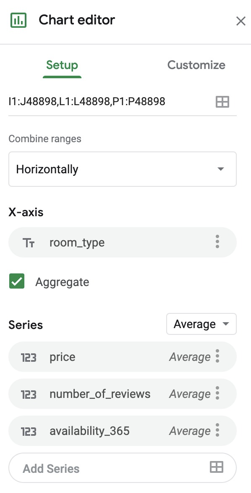

Grafik akan berubah menjadi seperti berikut.

Untuk melakukan styling pada font, legend, warna, dan lainnya, lakukan konfigurasi sesuai jenis grafik yang kita pilih pada bagian Customize seperti pada gambar di bawah.

Setelah mengetahui itu semua, saatnya Anda mencoba sendiri dan pelajari terus potensi-potensi yang ada untuk membuat grafik yang lebih kompleks dan lebih mudah dipahami.

# Kesalahan Umum dalam Visualisasi Data

Sudahkah Anda menerapkan visualisasi data dalam menyajikan data? Kita telah sepakat bahwa visualisasi data memudahkan audiens dalam memahami data yang dipresentasikan. Namun, apakah metode visualisasi data dapat selalu menyampaikan informasi dengan efektif?

Visualisasi akan efektif jika dibuat dengan mematuhi kaidah yang ditentukan. Namun, terkadang penerapan visualisasi data dilakukan dengan cara yang sebaliknya: tak tepat dan tak patuh pedoman. Alhasil, penerapan visualisasi data kadang berujung pada informasi yang membingungkan dan ambigu. Pada akhirnya, alih-alih membuat paham, audiens jadi meragukan kebenaran data.

Karena itulah, Anda perlu tahu dan hindari beberapa kesalahan umum yang sering dilakukan dalam membuat visualisasi data. Berikut ini penjelasannya:

## Nilai Persentase Tidak Sesuai

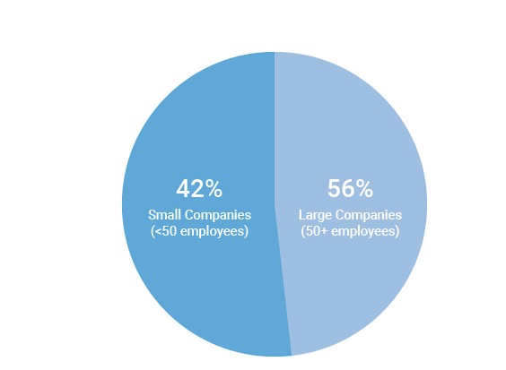

Di atas adalah visualisasi data dalam bentuk grafik pai yang membandingkan banyaknya Small Companies (perusahaan kecil yang didefinisikan memiliki kurang dari 50 karyawan) dan Large companies (perusahaan besar yang didefinisikan memiliki 50 atau lebih karyawan).

Menurut Anda, adakah yang salah dari diagram lingkaran di atas? Jika Anda mengatakan “Ya, ada yang salah”, itu sudah tepat. Alasannya, total nilai persentase yang ditunjukkan dari diagram sebesar 98% atau kurang dari 100%. Selain itu, ada juga kesalahan lainnya, yaitu besar/porsi irisan lingkaran Small Companies (42%) lebih besar daripada Large Companies (56%). Karena 42% itu lebih kecil dari 56%, maka besar porsi potongan lingkarannya pun seharusnya lebih kecil, bukan sebaliknya.

Penulisan persentase dan besar porsi irisan yang merepresentasikan data harus tepat. Jika menggunakan satuan persen, maka total data yang disajikan totalnya harus 100%. Apabila menggunakan satuan derajat, maka data yang disajikan totalnya harus 360 derajat.

Dari diagram di atas, jika datanya sudah tepat, maka bisa menjadi seperti berikut:

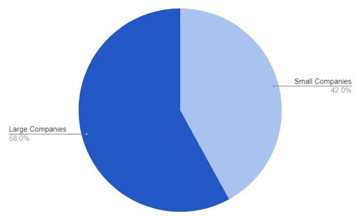

Besar porsi irisan juga harus sesuai dengan nilai datanya. Jangan pula menampilkan terlalu banyak irisan yang bisa berujung bias, contohnya di bawah ini:

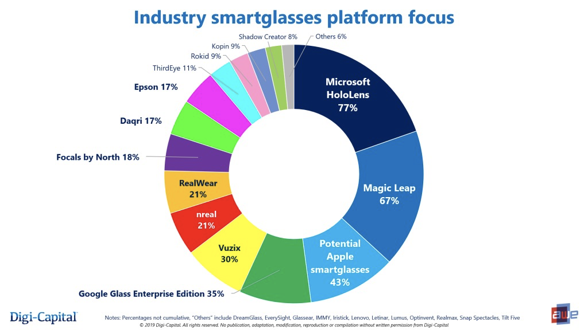

Sumber: Digi-Capital, www.digi-capital.com

Pasti Anda akan sulit untuk membaca informasi dari diagram lingkaran di atas. Sulit untuk membedakan data mana yang lebih besar dibandingkan lainnya. Memang idealnya irisan diagram lingkaran tak lebih dari empat irisan supaya perpotongan irisannya terlihat jelas sehingga kita tahu data mana yang lebih besar atau lebih kecil.

Lantas, bagaimana kalau data yang ingin ditulis berjumlah enam? Sebagai contoh, Anda dapat menggambarkannya seperti di bawah ini:

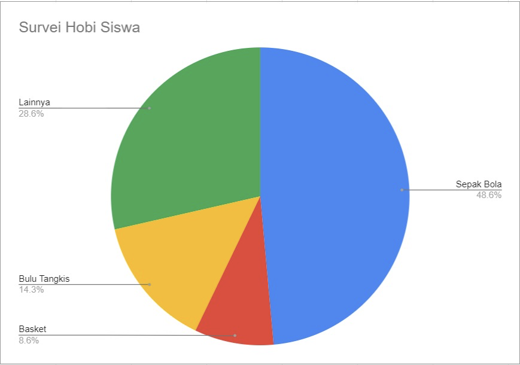

“Lainnya” merupakan data hobi yang dihimpun selain sepak bola, bulu tangkis, dan basket. Bisa jadi ada menulis, membaca, dan lain sebagainya.

Namun, menulis “lainnya” saja tidak cukup. Anda perlu tambahkan keterangan kategori lainnya itu berisi hobi apa saja. Jika data yang dibutuhkan sangat banyak misal lebih dari 100 data, maka kita perlu menuliskan data hobi ini dalam bentuk tabel saja, bukan diagram lingkaran.

## Terlalu Banyak Data

Kita telah mengetahui tujuan visualisasi data adalah membuat sebuah data yang kompleks menjadi lebih mudah dipahami dengan bentuk visual. Namun, apakah hal sebaliknya bisa saja terjadi?

Ya, itu dapat terjadi jika kita memaksakan untuk memasukkan data yang berjumlah banyak. Hasilnya menjadi tidak efektif dan tentu membingungkan pembaca. Contohnya gambar di bawah ini:

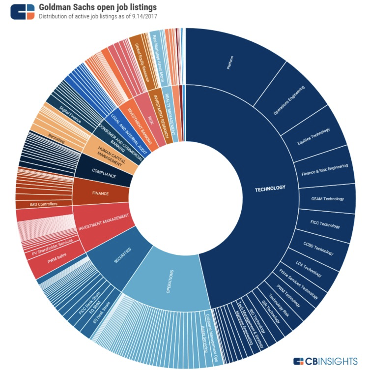

Sumber: CB Insights, www.cbinsights.com

​Begitu banyak data yang dimasukkan dalam diagram lingkaran di atas, bukan?

Sebagai pembaca, kita kesulitan untuk bisa menangkap informasi apa yang ingin disampaikan oleh diagram tersebut. Seperti diulas pada poin sebelumnya, diagram lingkaran paling efektif jika hanya sampai 4 irisan data saja. Apabila terdapat banyak sekali data seperti gambar di atas, maka sebaiknya data Anda dituliskan dalam bentuk tabel saja. Hal tersebut juga berlaku untuk semua jenis diagram.

## Tidak Mengikuti Standar Penulisan

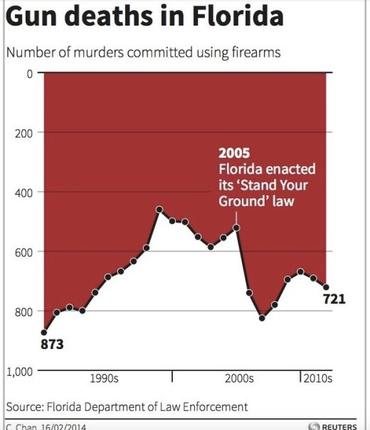

Sumber: Reuters, www.reuters.com

Saat melihat grafik di atas, apakah Anda bisa langsung mengerti tren angka pembunuhan menggunakan senjata api di Florida? Sekilas tidak ada yang salah, tetapi coba perhatikan kembali sumbu Y. Nilai yang ditunjukkan terbalik. Angka 0 berada di atas sebagai nilai minimum dan angka 1000 sebagai nilai maksimum berada di bawah. Hal tersebut sudah tidak sesuai dengan standar umum penulisan karena umumnya sumbu Y dimulai dari nilai minimum berada di bawah dan semakin ke atas akan semakin naik nilainya.

Tentu saja ini berpengaruh bagi pembaca informasi karena bisa menimbulkan salah persepsi. Mereka akan mengira bahwa trennya turun, padahal dari 2005 hingga 2007 menunjukkan kenaikan apabila sumbu Y tidak terbalik. Jadi, usahakan dalam pembuatan sumbu X maupun Y, gunakanlah standar penulisan umum yang berlaku.

## Terdapat Sumbu yang Terpotong

Nilai pada suatu sumbu sangat penting kaitannya dengan data yang ditampilkan dalam sebuah diagram. Jika penerapannya kurang tepat, maka dapat memicu bias bagi pembacanya. Sebagai contoh, lihatlah gambar di bawah ini:

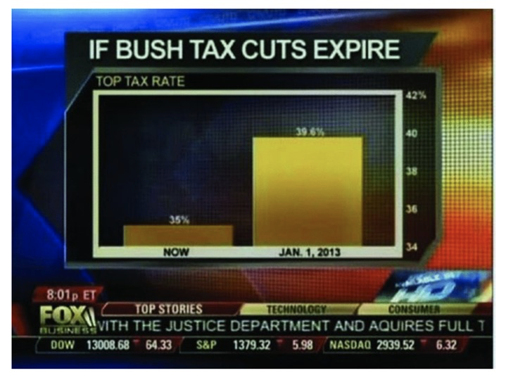

Sumber: Fox Business, www.foxbusiness.com

Visualisasi data di atas bertujuan untuk membandingkan besarnya pajak pada saat itu (tahun 2012) dan bagaimana pajak dapat berubah pada 1 Januari 2013. Ketika dilihat sekilas, terlihat akan ada peningkatan pajak yang tinggi pada 1 Januari 2013.

Namun, coba perhatikan sumbu Y. Terdapat potongan pada sumbu Y sehingga langsung dimulai dari 34%, bukan 0. Akibatnya, pembaca dapat terkecoh dan salah menyimpulkan bahkan peningkatannya akan sangat besar. Padahal nilainya hanya 35% versus 39%. Seharusnya tampilan kedua diagram batang tidak begitu berbeda tingginya. Di sini kita jadi paham bahwa setiap data pada sumbu Y mutlak harus dimulai dari 0 agar menghindari bias dan salah interpretasi data.

## Penggunaan Grafik 3D yang Kurang Sesuai

Pasti kita ingin visualisasi data yang disajikan terlihat keren kan? Di bawah ini merupakan visualisasi data dalam bentuk grafik pai 3D (tiga dimensi) mengenai persentase penggunaan bahasa pemrograman ketika bekerja. Apakah grafik 3D tersebut terlihat lebih keren daripada grafik 2D biasa?

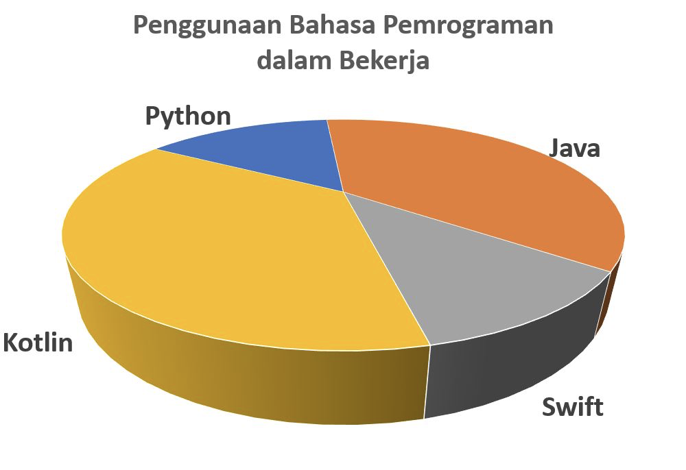

Apa informasi yang bisa Anda dapatkan dari grafik di atas? Terlihat Kotlin lebih besar daripada Java, sedangkan Swift lebih besar daripada Python. Sekarang lihat grafik pai 2D di bawah.

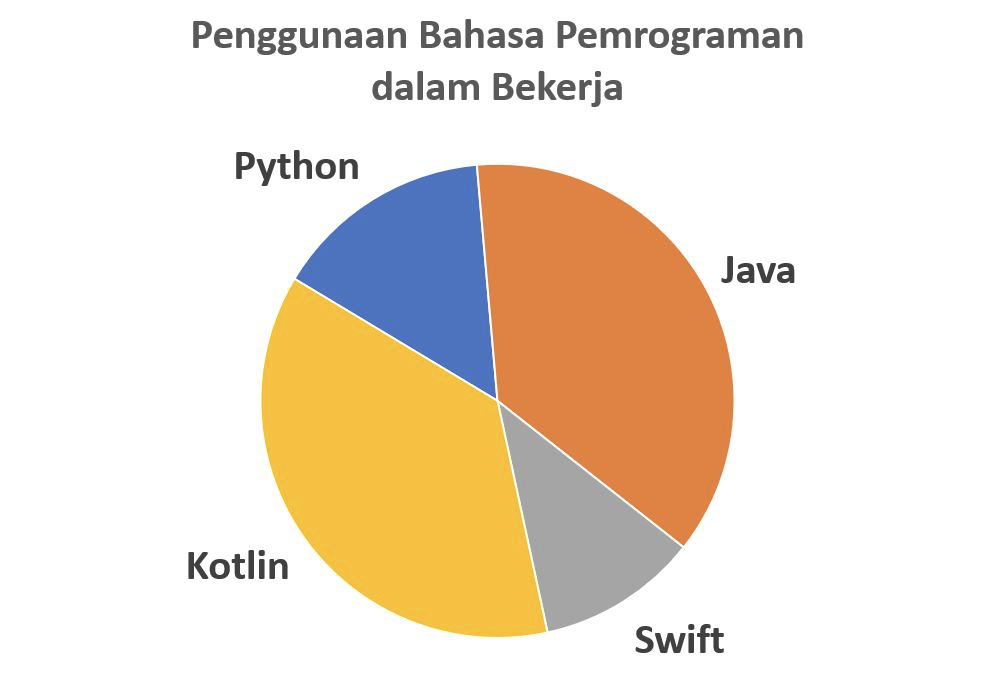

Apa informasi yang Anda dapatkan dari grafik 2D ini? Kotlin terlihat sama besarnya dengan Java, sedangkan Python memiliki irisan pai lebih besar daripada Swift.

Kagetkah Anda jika ternyata data yang digunakan untuk kedua grafik pai tersebut sama? Untuk kedua grafik pai di atas, Kotlin sebesar 37%, Java sebesar 37%, Python sebesar 15%, dan Swift sebesar 11%. Versi grafik 3D mengacaukan persepsi visual kita sehingga dapat menimbulkan kesalahan dalam memahami data.

Mari kita lihat contoh grafik 3D berikutnya, yaitu grafik kolom mengenai jenis pekerjaan yang didapatkan oleh lulusan kelas. Melihat sekilas grafik di bawah, IT merupakan jenis pekerjaan yang paling banyak didapatkan lulusan, kemudian urutan peringkat berikutnya adalah jenis pekerjaan sales, marketing, dan admin.

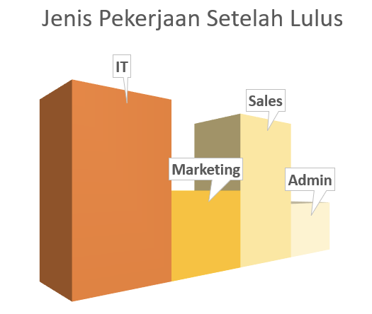

Sekarang perhatikan grafik 2D di bawah. Jenis pekerjaan IT dan Sales ternyata memiliki peringkat yang sama. Terlihat ada perbedaan informasi yang dapat ditangkap oleh pembaca, padahal data yang digunakan sama. Data yang digunakan untuk kedua grafik ini adalah: IT sebanyak 50 lulusan, Marketing sebanyak 25 lulusan, Sales sebanyak 50 lulusan, dan Admin sebanyak 20 lulusan.

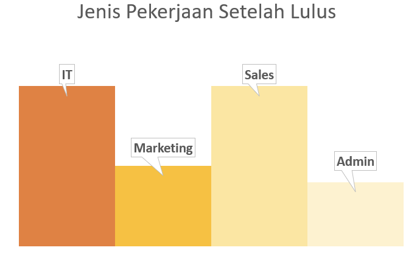

Maka dari itu, berhati-hatilah dalam menggunakan diagram tiga deimensi. Saat terselip di benak kita untuk menggunakan skema 3 dimensi dalam visualisasi, segeralah cari alternatif lain. Sekarang Anda jadi mengerti kenapa penggunaan jenis diagram 3 dimensi kurang disarankan dalam visualisasi data. Alasannya adalah menyulitkan pembaca dalam memahami data dan dapat menciptakan bias sehingga menimbulkan perbedaan persepsi tentang data yang disajikan.

## Sukar Dibandingkan

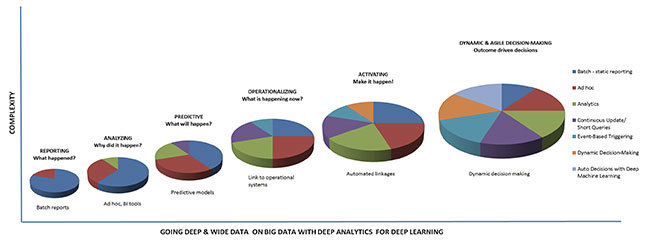

Visualisasi data bertujuan untuk memudahkan kita membandingkan data yang ada. Namun, contoh di atas menunjukkan sebaliknya. Perbandingan dari setiap data, sulit dipahami. Pembaca sulit mengerti tujuan dan informasi apa yang ingin disampaikan.

Apakah ini ingin menunjukkan sebuah tren? Apakah ini perbandingan yang perlu dilihat di dalam masing-masing grafik pai atau apakah yang perlu dilihat perbandingan antara grafik pai? Bagaimana cara pembaca bisa membandingkan besarnya irisan-irisan dalam pai? Apakah pembaca juga harus membandingkan ukuran dari masing-masing pai karena ukurannya berbeda-beda? Jika visualisasi data membuat pembaca susah mengerti dan sulit membandingkan, seharusnya kita mengganti jenis diagram yang digunakan.

Referensi: Beberapa visualisasi data pada materi ini berasal dari https://viz.wtf/. Untuk melihat contoh lainnya mengenai kesalahan dalam visualisasi data, Anda dapat mengunjungi https://viz.wtf/.

# Dokumentasi Data

Pernahkah mendengar istilah dokumentasi data? Dokumentasi data atau yang sering disebut dengan data provenance adalah sebuah langkah untuk melihat sumber data yang kita peroleh. Kata provenance sendiri berasal dari bahasa Perancis provenir yang berarti “berasal” atau “silsilah”.

Coba bayangkan Anda berperan sebagai seorang Data Analyst. Anda mendapatkan sebuah dataset (himpunan data) yang siap untuk dianalisis. Anda tidak tahu data ini berasal dari mana, bagaimana validitasnya, apakah ia akan berubah selama proses pengerjaan, dan sebagainya. Gawat kan?

Dokumentasi data sangatlah penting untuk mengetahui keabsahan data dan memungkinkan kita menggunakannya kembali di waktu yang lain.

W3C Provenance Incubator Group, sebuah organisasi yang bergerak di bidang pengembangan dan standarisasi teknologi web, menjelaskan tentang dokumentasi data sebagai berikut:

“Catatan yang menggambarkan semua pihak dan proses dalam pembuatan, perubahan, penanganan, ataupun hal lainnya yang berpengaruh kepada data. Provenance merupakan landasan utama untuk dapat menilai keaslian dan menumbuhkan kepercayaan kepada data, sekaligus untuk mereproduksi data tersebut.”

Terdengar rumit? Baiklah. Berikut ini contoh sebuah penggambaran dokumentasi data yang ditunjukkan dalam sebuah metadata. Metadata merupakan bagian penting dari data yang dipublikasi untuk menentukan kualitas, kredibilitas, reprodusibilitas hasil (terukur), serta menentukan apakah data dapat digunakan kembali atau tidak (reusable).

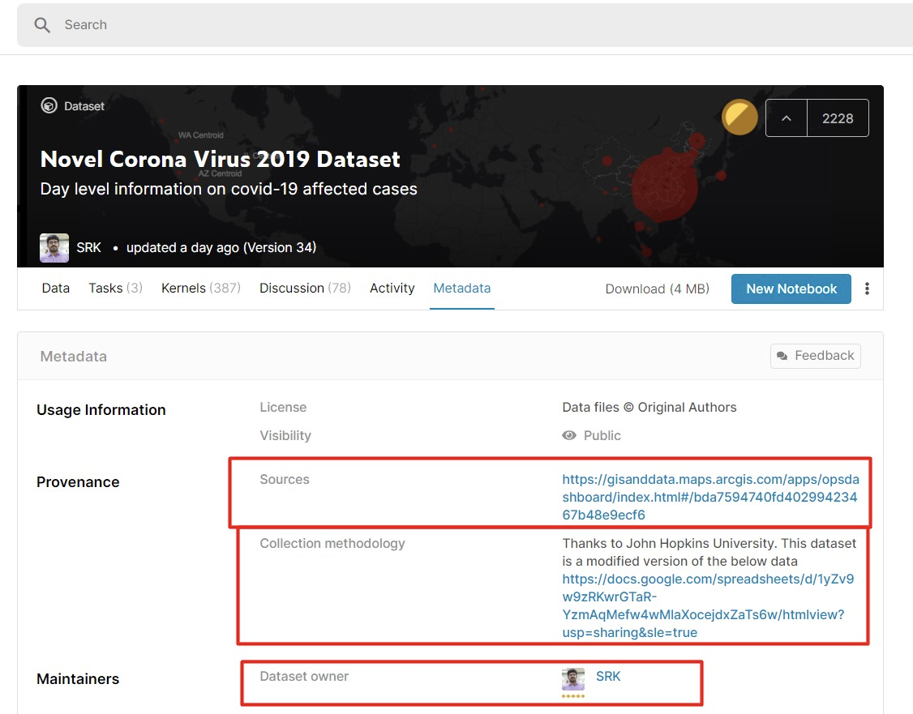

Contoh data provenance di atas didapatkan dari website Kaggle https://www.kaggle.com/datasets/sudalairajkumar/novel-corona-virus-2019-dataset/metadata. Pada gambar tersebut, terlihat dokumentasi yang menyertakan sumber data, metodologi pembuatan data, dan juga pemilik dari dataset. Berikut contoh lain dari dokumentasi data.

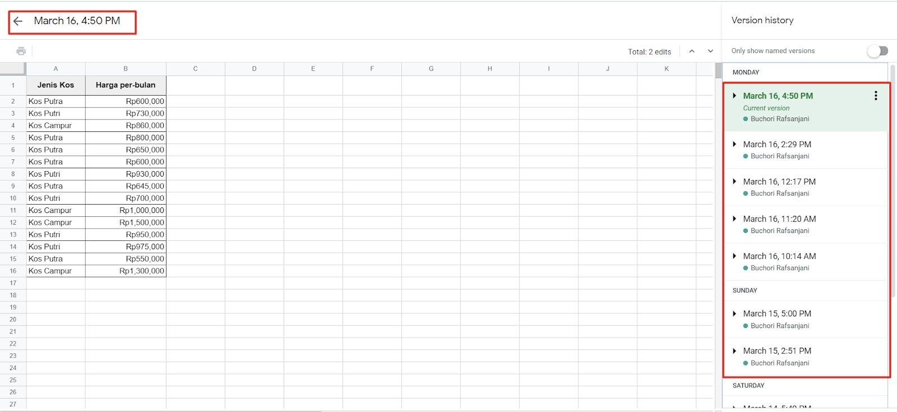

Tampilan di atas merupakan version history (sejarah versi dokumen) dari berkas Google Sheets. Semua perubahan data tercatat mulai dari tanggal hingga nama orang yang melakukan perubahan. Version history ini dapat Anda temukan saat klik bagian berikut.

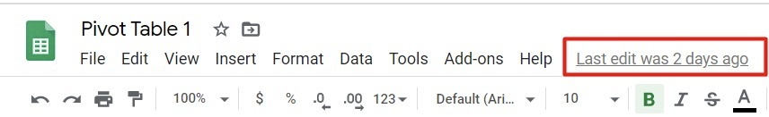

Untuk dapat kembali ke penulisan sebelumnya, kita dapat melakukan restore version (pengembalian versi) dengan memilih dari riwayat penulisan dan klik tombol Restore this version.

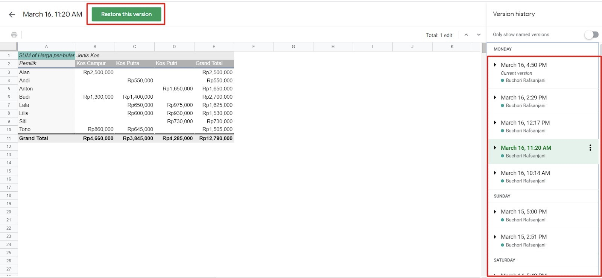
