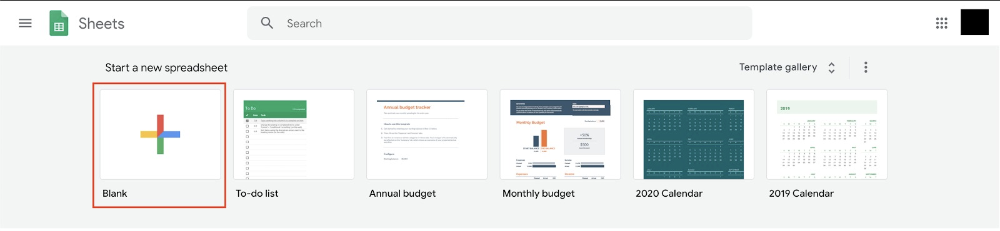

# Transkrip Visualisasi Data menggunakan Diagram

Apa itu diagram? Anda mungkin pernah mendengar istilah chart atau graph. Kedua hal tersebut merupakan bagian dari diagram.

Diagram adalah sebuah representatif visual terhadap informasi. Diagram digunakan untuk mempermudah kita memahami informasi dari data yang kita miliki. Ketika kita membicarakan data maka yang paling sering terlintas adalah bentuk baris dan kolom yang berisi informasi, namun berapakah waktu yang kita butuhkan untuk mengerti informasi dalam bentuk baris dan kolom tersebut?

## Bar/Column Chart

Adalah jenis grafik di mana setiap kategori diwakili oleh persegi panjang, dengan panjang perseginya yang sebanding dengan nilai agregasi data.

## Line Chart

Adalah jenis grafik yang menampilkan informasi sebagai serangkaian titik data yang disebut 'penanda' yang dihubungkan oleh segmen garis lurus.

## Area Chart

Mirip dengan jenis grafik Line Chart. Namun, area di bawah garis yang menghubungkan titik data akan terisi dengan warna atau bayangan.

## Pie Chart

Adalah jenis grafik yang menampilkan data dalam grafik lingkaran. Seluruh "kue pai" mewakili 100% dari keseluruhan, sedangkan pai "irisan" mewakili bagian dari keseluruhan.

## Scatter Chart

Menggunakan titik untuk merepresentasikan nilai numerik pada kategori yang berbeda. Posisi setiap titik pada sumbu horizontal dan vertikal menunjukkan nilai untuk titik data individual.

## Map Chart

Memungkinkan kita untuk memvisualisasikan hubungan spasial dalam data dengan menunjukkan data pada peta geografis. Umumnya pada peta seperti ini, semakin tebal warnanya, semakin intens pula kepadatan datanya.

# Visualisasi Data Kuantitatif dalam Bentuk Diagram

Untuk penggunaan grafik secara lebih rinci akan kita bahas pada pembelajaran selanjutnya. Diharapkan pada pembelajaran kali ini setidaknya Anda bisa mengetahui struktur data yang dapat digunakan untuk membuat grafik.

Setelah teori, tak lengkap rasanya tanpa latihan. Pada bagian kali ini, kita akan belajar memvisualisasikan data ke dalam sebuah grafik menggunakan Google Sheets. Jenis grafik dalam Google Sheets bisa dikombinasikan dengan jenis model lainnya. Misalnya, diagram batang dapat dikombinasikan dengan diagram garis. Namun, penerapannya juga harus sesuai dan tidak dipaksakan supaya data dapat mudah dipahami.

Oke, dalam latihan ini kita akan menggunakan data kamar Airbnb yang disewakan di kota New York.

- Dataset : New York City Airbnb
- Deskripsi : Dataset ini menjelaskan aktivitas Airbnb di kota New York untuk 2019.
- Unduh : Buka GitHub Dicoding Academy berikut-> Klik Download raw file https://github.com/dicodingacademy/assets/blob/main/visualisasi_data_academy/AB_NYC_2019.csv.
- Tools : Google Sheets (untuk menggunakan Google Sheets, Anda harus memiliki akun Gmail terlebih dahulu).

## Langkah 1: Persiapan

Pastikan semua tools dan data sudah dipersiapkan. Setelah semua siap, maka buat spreadsheet baru.

Untuk memasukkan data dari komputer ke Google Sheets, klik File → Import dan pilih/taruh berkas yang ingin dimasukkan.

Unggah berkas AB_NYC_2019.csv dari data yang telah kita download dan sesuaikan konfigurasi seperti gambar di bawah. Setelah itu, klik Import data.

Spreadsheet akan terisi dengan data dari berkas yang kita unggah seperti berikut:

## Langkah 2: Visualisasi

Tahap persiapan sudah dilakukan dan kini semua data berhasil ditampilkan. Sekarang saatnya kita mulai membuat visualisasi dari data-data tersebut. Caranya sangat mudah, kita tinggal memilih kolom dan baris mana yang ingin divisualisasikan. Nah, sebelum memilih kolom dan baris untuk divisualisasikan, kita perlu memahami maksud dari data tersebut.

Pertama, kita perlu mengetahui bahwa data ini merupakan data kamar Airbnb yang disewakan. Namun, apa sajakah arti tiap kolom pada data tersebut? Berikut pemaparannya.

- Id : Identifier unik untuk tiap tempat sewa.
- Name : Nama tempat.
- Host_id : Identifier penyedia kamar/tempat.
- Host_name : Nama penyedia kamar/tempat.
- Neighbourhood_group : Kelompok lingkungan dari tempat tinggal yang disediakan host (penyedia kamar/tempat), yakni pengelompokan dari neighbourhood.
- Neighbourhood : Nama dari lingkungan tempat tinggal yang disediakan host.
- Latitude & longitude : Garis lintang dan garis bujur dari tempat tinggal yang disediakan.
- Room_type : Tipe kamar yang disediakan.
- Price : Harga sewa per malam dalam dolar Amerika.
- Minimum_nights : Jumlah minimum malam yang disewa untuk setiap penyewaan.
- Number_of_reviews : Jumlah ulasan oleh pelanggan.
- Last_review : Tanggal review terakhir oleh pelanggan.
- Reviews_per_month : Rata-rata ulasan jika dibagi per bulan.
- Calculated_host_listings_count : Jumlah tempat milik host yang telah didaftarkan ke Airbnb.
- Availability_365 : Beberapa hari dalam setahun, tempat tersedia untuk pemesanan.

Setelah kita mengetahui maksud dari kolom dan isian data tersebut, sekarang kita bisa mulai membuat pertanyaan pada diri sendiri, sebagai contohnya “Saya ingin melihat perbandingan rata-rata harga tiap tipe kamar.”

Dari sana kita tahu bahwa kolom yang digunakan adalah room_type dan price dengan menggunakan semua baris. Untuk mulai membuat visualisasi, pilih semua data yang tersedia di kolom I (room_type) dan J (price). Cara cepat untuk melakukan hal tersebut adalah dengan menekan tombol shift pada keyboard sambil klik kolom I dan J. Akan tampil seperti gambar di bawah ini:

Setelah data yang dibutuhkan telah dipilih, kita dapat memvisualisasikan dengan klik Insert → Chart.

Secara standar, grafik yang pertama terbentuk adalah jenis Column chart (grafik kolom) di mana X-axis berupa room_type dan Y-axis (Series) berupa sum (penjumlahan) dari price.

Bisa kita lihat bahwa grafik yang terbentuk tidaklah rapi. Terlalu banyak data poin pada X-axis. Hal tersebut dikarenakan kita tidak melakukan grouping atau pengelompokan. Oleh karena itu, silakan centang tombol Aggregate untuk melakukan agregasi terhadap data room_type yang sama. Maka, visualisasi akan berubah seperti gambar di bawah ini.

Untuk mengubah jenis grafik yang diinginkan dan sesuai dengan tipe data yang kita pilih, klik Chart type pada Chart editor. Misalnya, jika kita ingin mengubah tampilan grafik menjadi bentuk kue pai, cukup klik bentuk Pie chart yang diinginkan seperti di bawah.

Lalu, grafik sebelumnya akan berubah menjadi di bawah ini.

Perlu diingat bahwa nilai data di sini masih menggunakan pengaturan awal, yaitu sum (penjumlahan). Untuk mengubah menjadi rata-rata, kita dapat klik seperti gambar di bawah dan menggantinya menjadi Average.

Hasil grafiknya menjadi seperti berikut.

Hal yang perlu diperhatikan adalah setiap tipe grafik memiliki kebutuhan data yang berbeda-beda. Seperti pada grafik kolom sebelumnya, data yang dibutuhkan adalah X-axis dan satu data Y-axis (Series). Sementara itu, jika ingin membuat Combo chart (grafik kombo yang kombinasikan grafik Line dengan Column), Y-axis perlu ditambahkan data lainnya sebagai perbandingan. Pada contoh di bawah, telah ditambahkan data number_of_reviews dan availability_365 seperti gambar di bawah ini.

Grafik akan berubah menjadi seperti berikut.

Untuk melakukan styling pada font, legend, warna, dan lainnya, lakukan konfigurasi sesuai jenis grafik yang kita pilih pada bagian Customize seperti pada gambar di bawah.

Setelah mengetahui itu semua, saatnya Anda mencoba sendiri dan pelajari terus potensi-potensi yang ada untuk membuat grafik yang lebih kompleks dan lebih mudah dipahami.
