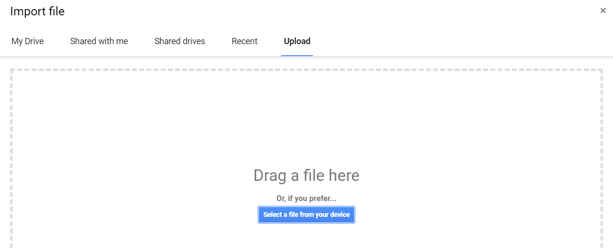
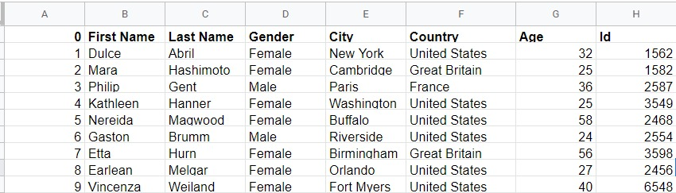
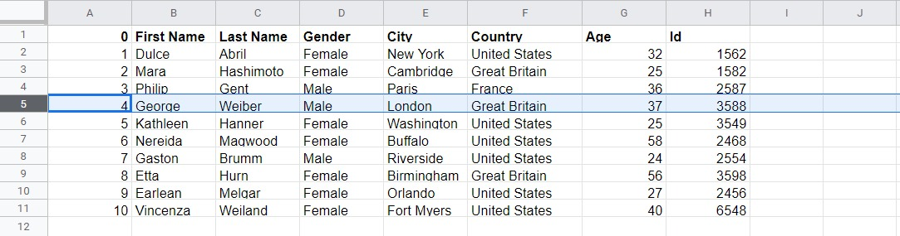
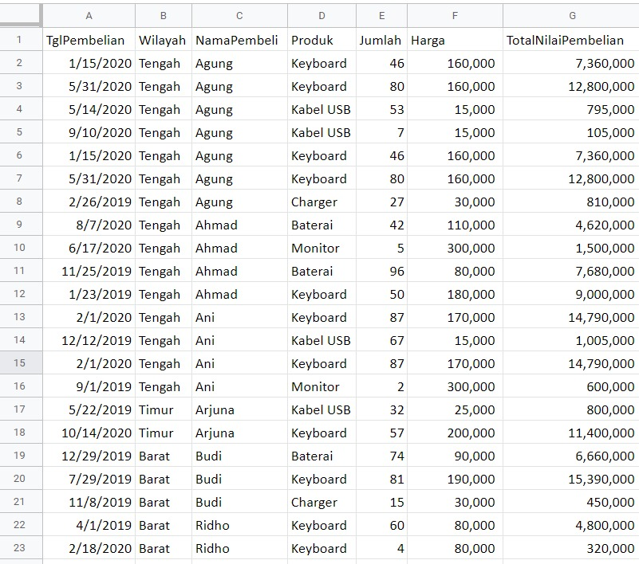
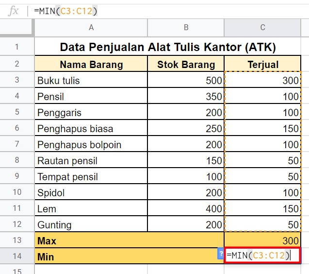
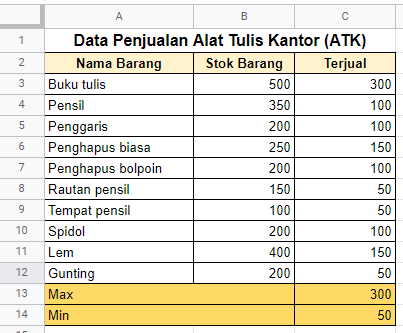
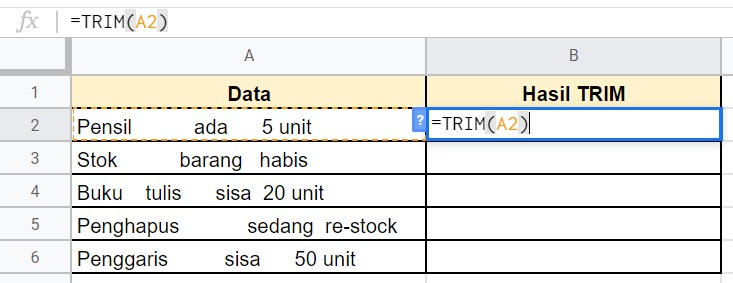
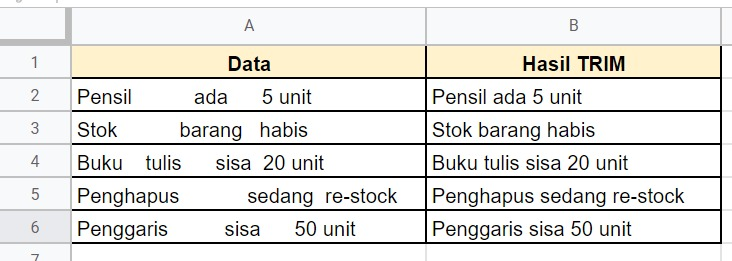

# Baris dan Kolom

Pada materi sebelumnya, kita telah mempelajari navigasi pada Google Sheets. Nah, sekarang mari kita bermain dengan baris dan kolom dengan memanfaatkan contoh data spreadsheet yang dapat diunduh di sini: sample file. https://github.com/dicodingacademy/assets/raw/main/vd_academy/file_example_XLS_10.xls

Dalam percobaan kali ini, kita menggunakan data sederhana yang terdiri dari 10 baris saja. Kita dapat memasukkan file tersebut dengan cara import seperti berikut:

1. Klik File - Import pada menu bar Google Sheets.
   
2. Selanjutnya, pilih berkas yang ingin ditambahkan dan akan muncul jendela berikut
   
   Pada gambar di atas terdapat lima pilihan untuk mengimpor file, yaitu dari:

- My Drive: menambahkan contoh berkas dari Drive. Jika menggunakan opsi ini, tentukan juga lokasi folder berkas yang akan diimpor.
- Shared with me: menambahkan contoh berkas dari sekumpulan berkas milik orang lain yang aksesnya dibagi (shared) dengan Anda.
- Shared drives: menambahkan contoh berkas dari shared drive (drive lain yang bisa Anda akses).
- Recent: menambahkan contoh berkas dari sekumpulan berkas yang baru Anda akses.
- Upload: menambahkan contoh berkas dari mesin lokal/komputer Anda.

Maka dari itu, kita pilih Upload supaya bisa mengunggah berkas contoh yang diunduh sehingga tidak perlu membuat berkas baru.


3. Apabila data sudah dimasukkan, maka tampilannya sebagai berikut:
   

Jangan ditutup dulu berkasnya ya. Kita masih akan menggunakannya lagi di uraian berikutnya.

## Menyisipkan Kolom

Saat ini Anda sudah memiliki 10 baris contoh data. Bagaimana caranya apabila kita ingin menambahkan kolom baru dengan nama City di antara Gender dan Country? Berikut langkah-langkahnya.

1. Sorot salah satu kolom. Misalnya di sini kita memilih kolom Gender. Karena Gender berada di kolom D, maka klik kolom tersebut sehingga semua kolom D tersorot.
   
2. Klik kanan pada kolom Gender tersebut, kemudian pilih Insert 1 right karena kolom City yang ingin kita buat posisinya setelah kolom Gender dan sebelum kolom Country.
   
3. Hasilnya adalah kolom baru di antara Gender dan Country. Lalu, kita dapat mengisi data pada kolom kosong tersebut dengan data kolom City di bawah.
   
   Kita telah berhasil menyisipkan kolom baru pada contoh data yang ada.

## Menghapus Kolom

Bagaimana jika kita tidak sengaja membuat kolom baru dan ingin menghapusnya? Misalkan pada contoh data sebelumnya, kita ingin menghapus kolom Date.

1. Karena Date berada di kolom H, klik kolom tersebut sehingga semuanya tersorot.
   
2. Klik kanan pada kolom Date tersebut, kemudian pilih Delete Column.
   
3. Sekarang seluruh data pada kolom H sudah terhapus. Secara otomatis data ID (yang sebelumnya berada di kolom I) akan bergeser ke kiri seperti berikut (menjadi data kolom H yang baru).
   
   Kita telah berhasil menghapus kolom Date dari contoh data di atas.

## Menyisipkan Baris

Sebelumnya, kita membahas tentang menyisipkan dan menghapus kolom. Selanjutnya, kita bermain dengan baris dari contoh data yang ada.

Bagaimana caranya jika kita ingin menyisipkan data milik George di baris ke-5 setelah nama Philip? Dengan masih menggunakan contoh data terakhir di atas, mari kita mulai dengan langkah berikut.

1. Berdasarkan spreadsheet, Philip berada di baris ke-4. Karena itu, klik baris tersebut sehingga semua baris ke-4 tersorot.
   
2. Klik kanan pada baris nama Philip tersebut, kemudian pilih Insert 1 below karena nama George ingin kita buat posisinya setelah Philip dan sebelum Kathleen.
   
3. Setelah muncul baris baru di antara Philip dan Kathleen, kita dapat mengisi data George pada baris baru tersebut.
   
   Kita telah berhasil membuat baris baru dengan dengan data milik George pada contoh di atas.

## Menghapus Baris

Bagaimana jika kita tidak sengaja membuat baris baru dan ingin menghapusnya? Misalkan pada contoh data sebelumnya kita ingin menghapus baris George.

1. Karena George berada di baris ke-5, klik baris tersebut sehingga semuanya tersorot.
   
2. Klik kanan pada baris George tersebut, kemudian pilih Delete Row.
   
3. Ketika data pada baris ke-5 terhapus, maka otomatis data pada baris setelahnya (baris ke-6 dan seterusnya) akan naik menggantikan data milik George sehingga data Kathleen akan bergeser ke atas seperti berikut.
   
   Kita telah berhasil menghapus baris George dari contoh data di atas.

# Sortir Data

Tahukah Anda tentang sortir data di Google Sheets? Fitur ini berguna untuk mengurutkan data yang kita miliki supaya lebih tertata rapi.

Terdapat beberapa hal yang harus didefinisikan di awal sebelum melakukan sortir data, di antaranya seperti:

Manakah kolom yang harus disortir?
Tentukan terlebih dahulu data yang ingin disortir. Katakanlah kita memiliki sebuah tabel yang berisi informasi jumlah penjualan dari masing-masing produk yang dijual di sebuah toko. Apakah kita ingin mengurutkan berdasarkan angka penjualan atau berdasarkan nama produknya?
Bagaimana metode mengurutkannya?
Selanjutnya, Anda dapat menentukan metode dalam proses sortir. Misalnya, jika kita memilih untuk mengurutkan berdasarkan angka penjualan, apakah ingin diurutkan dari yang paling laris atau dari yang paling sedikit terjual?
Kunci dalam proses sortir adalah memastikan bahwa seluruh data yang ingin disortir telah terpilih. Setiap baris dalam berkas spreadsheet dapat mewakili penjualan produk kepada pelanggan. Kemudian, setiap kolom atribut akan mencatat detail misalnya seperti jumlah produk terjual penjualan, waktu dibuat, alamat pelanggan, dan lain-lain.

Masih bingung tentang sortir data? Simak penerapan sortir data pada uraian di bawah ini:

1. Unduh berkas contoh data penjualan yang ingin kita sortir di sini https://github.com/dicodingacademy/assets/raw/main/visualisasi_data_academy/SampleDataModulSortirData.xlsx.
2. Selanjutnya, lakukan import contoh data tersebut ke dalam Google Sheets sehingga tampilannya menjadi seperti berikut.
   
3. Sorot terlebih dahulu semua data yang ada di Spreadsheet tersebut. Hal ini bisa kamu lakukan dengan cara klik dan seret dari kolom A hingga kolom G. Kemudian, buka menu Data dan klik opsi Sort range.
   

Dengan menggunakan Sort range, Anda dapat mengurutkan data berdasarkan satu kondisi. Misalnya, hanya ingin mengurutkan berdasarkan kolom C (Nama Pembeli) saja atau berdasarkan kolom D (Produk) saja.

Anda juga dapat mengurutkan berdasarkan dua atau lebih kondisi, seperti mengurutkan berdasarkan kolom C dan juga berdasarkan kolom D. Untuk lebih jelasnya, ikuti langkah berikut.

## Mengurutkan berdasarkan satu kondisi

1. Untuk mengurutkan berdasarkan satu jenis kondisi, perhatikan pengaturan sort range berikut. Pastikan Anda mencentang opsi Data has header row agar Google Sheets mendeteksi baris pertama sebagai sebuah judul pengelompokan dari data yang terletak di baris-baris berikutnya. Jika Anda sudah mencentang opsi Data has header row, maka opsi di samping tulisan Sort by seharusnya jadi seperti berikut:
   

Nah, pada kondisi kali ini kita akan mengurutkan data berdasarkan nama pembeli sesuai abjad dengan urutan naik (A-Z). Maka dari itu, isi kondisi Sort by dengan NamaPembeli dan akhiri dengan klik Sort.

2. Dengan demikian, hasil pengurutan data berdasarkan nama pembeli berubah menjadi urut secara menaik (A-Z) seperti berikut:
   

3. Jika Anda perhatikan, bukan namanya (kolom C) saja yang berubah urutan sesuai abjad, tetapi data yang melekat pada nama pembeli tersebut (seperti data pada kolom A, B, D, E, F, dan G) juga ikut berurutan.

## Mengurutkan berdasarkan dua kondisi atau lebih

Selanjutnya, kita ingin mengurutkan data berdasarkan lebih dari satu kondisi, misal berdasarkan nama pembeli dan produk yang dibeli. Apabila sebelumnya hanya menggunakan satu kondisi yaitu berdasarkan nama pembeli saja, saat ini kita tambahkan lagi kondisi lainnya yaitu berdasarkan produk. Alhasil, data yang berurutan bukan hanya nama pembel, melainkan juga produk.

1. Sorot kembali semua data yang ada, kemudian pilih menu Data - Sort Range.
   
2. Atur pengaturan pada Sort range sesuai dengan data pertama yang ingin diurutkan. Dalam latihan ini, berarti pilih NamaPembeli seperti berikut:
   
3. Setelah itu, kita bisa tambahkan kondisi baru dengan klik Add another sort column dan isikan dengan Produk seperti berikut. Alhasil, alur sortirnya dimulai berdasarkan nama pembeli terlebih dahulu, kemudian produknya. Setelah selesai, klik tombol Sort.
   
4. Sekarang tampilannya akan terlihat seperti berikut:
   

Dari gambar di atas dapat dilihat bahwa metode pengurutan pertama adalah berdasarkan nama, kemudian produk. Misalnya, Agung pernah membeli produk charger, kabel USB, dan keyboard; sedangkan Ahmad pernah membeli produk baterai, keyboard, dan monitor. Karena abjad nama Agung (AG) lebih dulu dari Ahmad (AH), maka Agung berada di urutan pertama. Google Sheets kemudian mengurutkan produk yang dibeli Agung menurut abjad mulai dari charger hingga keyboard. Setelah mengurutkan item yang dibeli Agung, barulah menuju ke data Ahmad dengan urutan produk yang dibeli mulai dari baterai hingga monitor.

# Penyaringan Data

Pada Google Sheets, tersedia fitur yang memungkinkan kita untuk melakukan penyaringan data. Apa itu penyaringan data?

Penyaringan data adalah cara agar hanya menampilkan data tertentu berdasarkan kondisi yang kita tentukan. Pada saat proses penyaringan, data yang tidak memenuhi kriteria kondisi akan secara otomatis disembunyikan. Namun, data yang disembunyikan tersebut tidak terhapus dari Google Sheets.

Fitur ini disebut fitur filter dan proses penyaringan data pada Google Sheets disebut dengan istilah memfilter. Fitur ini dapat Anda akses melalui menu Data - Create a filter.

Untuk memperdalam pemahaman tentang penyaringan data, mari kita mulai penerapannya pada contoh data penjualan sebelumnya.

1. Pertama, tentukan data apa yang ingin Anda ketahui. Misalnya, kita ingin melihat dan menampilkan data pembeli produk keyboard.

2. Sorot semua data, kemudian pilih menu Data - Create a filter.

   

3. Setelah itu, Anda akan melihat ikon kecil berbentuk seperti segitiga terbalik di sebelah kanan judul kategori data.


4. Dalam kasus ini, klik ikon yang terletak di samping judul kategori Produk. Berbagai opsi kondisi penyaringan akan muncul. Karena kita hanya ingin menampilkan pembelian produk keyboard, maka pastikan hanya “Keyboard” saja yang tercentang. Setelah itu, klik OK.


5. Berikut inilah hasilnya.


Seperti yang Anda lihat, hanya terlihat baris yang pada kolom Produk (kolom D) berisi data “Keyboard”.

# Pengenalan Formula pada Spreadsheet

Sebelum memulai pembahasan mengenai formula, ada baiknya kita menyegarkan ingatan tentang materi yang sudah dipelajari sebelumnya. Pada materi sebelumnya, kita telah belajar tentang navigasi hingga penyaringan data (filter).

Namun, bagaimana jika kita ingin menganalisis data? Pasti dalam prosesnya tidak lepas dari perhitungan matematis dalam spreadsheet tersebut. Nah, di sinilah pentingnya formula yang dapat membantu kita dalam perhitungan mulai dari yang sederhana, seperti penjumlahan dan rata-rata, hingga yang kompleks.

Formula merupakan sebuah langkah atau rumus untuk melakukan perhitungan matematis sehingga mendapatkan nilai tertentu. Istilah formula sendiri sudah sangat umum ditemui dalam aplikasi spreadsheet seperti Microsoft Excel, LibreOffice Calc, dan Google Sheets.

## Referensi Sel

Sebuah formula pasti merujuk pada suatu alamat sel tertentu. Nah, rujukan alamat bisa disebut dengan referensi sel. Contoh sederhananya apabila kita ingin mengetahui jumlah nilai dari dua alamat sel, maka kita bisa menggunakan rumus penjumlahan sederhana seperti berikut.


Bagian A, B, C, dan seterusnya yang terbentang secara horizontal disebut kolom, sedangkan 1, 2, dan 3 yang membentang vertikal disebut baris. Gambar di atas juga menjelaskan bahwa terdapat data pada sel A1 bernilai 4 dan sel A2 bernilai 3. Kemudian, kita ingin mengetahui hasil penjumlahannya pada sel A3. Mulailah dengan tanda “=” diikuti dengan alamat sel A1 + A2. Pada akhirnya, formula tersebut menghasilkan nilai baru yaitu 7 pada sel A3.


Apabila nilai dari salah satu sel referensi sel A1 atau A2 diubah, maka secara otomatis hasil penjumlahan di sel A3 juga berubah. Jika kita mengubah referensi sel, maka nilai yang tampil sebagai output di sel lain yang berisi rumus juga berubah.

Contoh pada gambar di bawah, data pada sel A2 kita ubah dari angka 3 menjadi 4. Alhasil, pada kolom A3 akan otomatis berubah dari 7 menjadi 8.


Berhati-hatilah dalam mengganti referensi sel yang berkaitan dengan rumus atau formula tertentu. Ini berlaku untuk semua penggunaan rumus yang ada di spreadsheet ya.

Dengan menggabungkan operator matematika dengan referensi sel, Anda dapat menerapkannya di rumus lainnya dalam Google Sheets. Formula atau rumus juga dapat menyertakan kombinasi referensi sel dan angka, misalnya:


# Operator pada Spreadsheet

Operator adalah simbol atau tanda yang memiliki fungsi tertentu dan digunakan untuk melakukan pemrosesan atau perhitungan data. Penggunaan operator matematika erat kaitannya dengan perhitungan penjumlahan, pengurangan, dan lainnya.

Begitu pula dengan perhitungan dalam Google Sheets, operator selalu digunakan dalam penulisan rumus. Penggunaan operator dalam spreadsheet, baik itu Microsoft Excel, Google Sheets, maupun lainnya; mengikuti aturan urutan umum perhitungan matematika. Misalnya, operator perkalian dan pembagian akan berjalan lebih dulu, baru setelahnya operator penjumlahan dan pengurangan. Setiap penulisan formula dalam spreadsheet pun pasti diawali dengan tanda “=” (simbol sama dengan).

Mari kita lihat macam-macam operator dan kegunaannya.

## Operator Aritmatika

Operator aritmatika atau matematika digunakan pada aplikasi spreadsheet untuk melakukan operasi matematika dasar, seperti penambahan, pengurangan, perkalian, atau pembagian. Selain itu, operator ini juga dapat digunakan untuk menghitung nilai pangkat atau persen.


## Operator Perbandingan

Dalam spreadsheet, biasanya kita menggunakan jenis operator perbandingan untuk fungsi-fungsi logika seperti IF, OR, AND, dan NOT. Hasilnya adalah kondisi nilai True atau False. Contohnya sebagai berikut:


## Operator Text

Selanjutnya, ada jenis operator teks. Tahukah Anda kapan jenis operator text digunakan? Operator text yang dimaksud adalah ampersand (“&”) yang berfungsi untuk menggabungkan beberapa string text menjadi satu string tunggal. Ia biasanya menggunakan formula Concatenate.

## Operator Referensi

Apakah Anda familier dengan operator referensi dalam spreadsheet? Sebenarnya, secara tidak langsung kita telah menerapkan operator ini saat menulis rumus yang berhubungan dengan beberapa sel. Misalnya, rumus total =SUM(A1:A5) , artinya penjumlahan dilakukan mulai dari sel A1 hingga A5. Alhasil, bisa disimpulkan bahwa operator referensi dalam spreadsheet berguna untuk menunjukkan lokasi sel yang digunakan dalam penerapan sebuah rumus atau range data. Berikut macam-macam operator referensi yang sering digunakan dalam spreadsheet:


# Elemen Formula dalam Spreadsheet

Pernahkah Anda menulis sebuah fungsi sederhana dalam aplikasi spreadsheet? Pada materi sebelumnya, kita sudah berkenalan dengan formula, referensi sel, dan operator yang biasanya digunakan dalam spreadsheet. Nah, kini saatnya mulai menulis formula.

Akan tetapi, sebelum mulai menulis formula, ada baiknya kita mempelajari dulu elemen-elemen dalam sebuah formula.

Penulisan formula dalam spreadsheet diawali dengan tanda sama dengan “=”, sedangkan bagian-bagian dalam sebuah formula dapat terdiri dari satu atau lebih elemen berikut:

- Fungsi
- Referensi sel (single/range)
- Operator
- Konstanta

Untuk memperjelas setiap elemennya, langsung lihat penjabarannya berdasarkan gambar di bawah ini.


- Tanda sama dengan (“=”)
  Tanda sama dengan “=” merupakan elemen yang paling awal ditulis dalam sebuah formula apa pun sebelum lanjut ke elemen lainnya.

- Fungsi
  Fungsi merupakan sebuah penamaan yang telah ditentukan untuk melakukan kalkulasi data berdasarkan susunan argumen dalam aplikasi spreadsheet. Misal, kita ingin menghitung rata-rata menggunakan fungsi AVERAGE, total data menggunakan fungsi SUM, dan lainnya (akan dijelaskan lebih lanjut di materi berikutnya).

- Referensi Sel
  Telah disinggung di materi sebelumnya bahwa referensi sel merupakan acuan sebuah sel atau range dalam aplikasi spreadsheet, mulai dari sheet yang sama hingga berbeda berkas atau workbook. Pada contoh gambar di atas terdapat dua jenis referensi sel yaitu range yang ditunjukkan dengan (A1:A5) dan single sel yang ditunjukkan dengan alamat sel B1.

- Operator
  Masih ingat apa itu operator dalam spreadsheet? Operator juga termasuk salah satu elemen dalam penulisan formula spreadsheet. Seperti yang dijelaskan pada materi sebelumnya, ada banyak jenis di dalam operator, yaitu operator aritmatika, perbandingan, teks, dan referensi. Pada contoh gambar penulisan formula di atas, terdapat dua jenis operator, yaitu operator aritmatika dan referensi. Operator aritmatika terdapat pada tanda pembagian (“/”) dan perkalian (“\*”), sedangkan operator referensi merujuk pada tanda titik dua (“:”) pada tulisan (A1:A5).

- Konstanta
  Konstanta merupakan nilai masukan yang bukan berasal dari perhitungan karena nilainya selalu sama dan tidak pernah berubah. Bentuk dari konstanta bisa berupa teks atau angka, misalnya dalam contoh di atas konstanta ditunjukkan dengan angka 2.

# Fungsi Sum, Average, dan Count pada Spreadsheet

Setelah kita mengetahui tentang elemen yang terdapat dalam formula spreadsheet, kini saatnya belajar macam-macam formula dan juga cara penulisannya. Sebelumnya, buat contoh data sederhana berisi angka sebagai berikut:


Berdasarkan contoh di atas, kita akan menerapkan fungsi dasar spreadsheet. Berikut uraian lengkapnya.

## SUM

Kita sering menemui rumus ini dalam spreadsheet. Rumus SUM dapat membantu untuk mendapatkan nilai total dari rentang sel yang dipilih. Penggunaannya dengan cara menyorot semua baris atau kolom yang ingin diketahui jumlahnya. Penulisannya sebagai berikut:

```bash
=SUM(data ke-1, data ke-2, …. , data ke-n)
```

Contoh kasus:

Bagaimana cara mengetahui total semua stok dan barang yang terjual berdasarkan data penjualan ATK di atas?

Pertama, kita menghitung total dari stok barang dengan rumus =SUM(B3:B12) sehingga sel yang dihitung mulai dari B3 hingga B12 dan akan menghasilkan nilai 2550.


Selanjutnya, kita hitung jumlah barang yang terjual. Masih menggunakan rumus fungsi yang sama yaitu =SUM(C3:C12) sehingga sel yang dihitung mulai dari C3 hingga C12 dan akan menghasilkan nilai 1150.


Berdasarkan perhitungan, kita dapat mengetahui total stok barang adalah 2550 unit dan total barang yang terjual adalah 1150 unit.


## SUMIF

Selanjutnya, kita membahas fungsi SUMIF. Fungsi ini berbeda dari SUM yang biasa karena SUMIF bertujuan untuk menjumlahkan data dengan kriteria tertentu. Penulisan fungsi dari SUMIF sebagai berikut:

```bash
=SUMIF(range,”kriteria”,sum_range)
```

Jika Anda mencoba menerapkan rumus seperti =SUMIF(range,”kriteria”,sum_range) dan terjadi error atau tidak dapat terbaca di Excel atau Spreadsheet, maka gunakan tanda titik koma (;) sehingga menjadi =SUMIF(range;”kriteria”;sum_range). Hal tersebut disebabkan pengaturan delimiter dari setiap komputer terkadang berbeda-beda.

Contoh kasus

Kita akan menggunakan contoh data di bawah ini:


Misalnya, kita ingin mengetahui berapa total buku tulis berdasarkan data di atas.

Jawab:

Berdasarkan contoh tabel data di atas, kita dapat menuliskan rumus SUMIF pada sel G3 sebagai berikut:


Pada rumus di atas, range diisi dengan sel C3 sampai C12 yang merupakan kumpulan nama barang yang terjual dari tanggal 01 Februari 2020 sampai 04 Februari 2020. Kemudian, kriteria diisi dengan nama barang yang ingin dicari jumlahnya dan dalam contoh ini menggunakan “Buku tulis”. Kriteria dapat diisi dengan teks, angka, ataupun ekspresi. Terakhir, sum_range diisi dengan sel-sel yang ingin dijumlahkan datanya yang ditunjukkan pada sel D3 sampai D12. Formula tersebut menghasilkan total buku tulis yang terjual adalah 295 unit.

## SUMIFS

Kemudian, ada lagi fungsi yang bernama SUMIFS. Tahukah Anda perbedaan antara SUMIF dan SUMIFS? Secara penggunaan sebenarnya sama, yaitu untuk menjumlahkan data dengan kriteria tertentu. Apabila SUMIF hanya bisa menggunakan satu kriteria saja, SUMIFS dapat menggunakan lebih dari satu kriteria. Penulisannya sebagai berikut:

```bash
=SUMIFS(sum_range, kriteria_range1, “kriteria1”, kriteria_range2, “kriteria2”, dan seterusnya)
```

Contoh kasus:

Masih menggunakan contoh data di bawah ini:


Kali ini kita ingin mengetahui berapa total buku tulis yang terjual dari tanggal 01 Februari 2020 sampai 02 Februari 2020.

Jawab:

Berdasarkan contoh tabel data di atas, kita dapat menuliskan rumus SUMIFS pada sel G3 sebagai berikut:


```bash
=SUMIFS(D3:D12,C3:C12,"Buku tulis",B3:B12,">=01/02/2020",B3:B12,"<=02/02/2020")
```

Pada contoh penjelasan gambar dan rumus di atas, sum_range diisi dengan sel-sel yang ingin dijumlahkan datanya. kriteria_range1 berisi nama barang yang ditunjukkan oleh sel C3 sampai C12. kriteria1 yang ingin kita cari adalah "Buku tulis" dan kriteria2 yang kita cari adalah buku tulis yang terjual pada atau setelah tanggal 01 Februari 2020 dan yang terjual pada atau sebelum tanggal 02 Februari 2020. Alhasil, buku tulis yang terjual sejumlah 175 unit.

## AVERAGE

Masih ingatkah Anda dengan rata-rata aritmatika? Fungsi AVERAGE sama dengan rata-rata aritmatika yang menjumlahkan semua data kemudian dibagi dengan jumlah data yang ada. Penggunaannya hampir sama dengan rumus SUM yaitu sebagai berikut:

```bash
=AVERAGE(data ke-1, data ke-2, … , data ke-n)
```

Contoh kasus:

Bagaimana jika kita ingin mengetahui berapa rata-rata dari semua barang yang terjual dalam tabel data penjualan ATK?

Kita dapat menghitung rata-rata jumlah semua barang yang terjual dengan rumus =AVERAGE(C3:C12)sehingga sel yang dihitung mulai dari C3 hingga C12.


Berdasarkan perhitungan, kita dapat mengetahui rata-rata dari semua barang yang terjual adalah 115 unit.


## COUNT

COUNT merupakan fungsi yang dapat menghitung banyaknya sel terpilih dalam rentang tertentu yang berisi nilai numerik. Penggunaan fungsi COUNT sebagai berikut:

```bash
=COUNT(data ke-1, data ke-2, … , data ke-n)
```

Contoh kasus:

Dalam contoh penggunaan COUNT, kita modifikasi sedikit tabel data penjualan ATK untuk memperjelas penggunaan fungsi ini. Contoh perubahannya sebagai berikut:


Pertanyaannya adalah bagaimana kita mengetahui jumlah produk yang berhasil terjual berdasarkan kolom terjual?

Kita mulai dengan menuliskankan rumus =COUNT(C3:C12) pada sel C13. Lebih jelasnya bisa dilihat pada gambar di bawah ini.


Berdasarkan perhitungan di atas, kita dapat mengetahui barang yang berhasil terjual ada 8 jenis. Apakah Anda tahu kenapa hasilnya 8?

Fungsi COUNT hanya menghitung nilai numerik (hanya angka saja) sehingga data yang berupa non-numerik (seperti sel C8) dan sel kosong (seperti sel C12) akan dilewati.

## COUNTA

Sama seperti COUNT, COUNTA dapat menghitung jumlah sel terpilih dalam rentang tertentu. Namun, bedanya COUNTA, kita dapat menghitung semua sel yang terpilih, tak peduli apa pun tipe data yang ada di dalamnya (angka, teks, tanggal, kondisi benar atau salah, hingga kesalahan perhitungan). Akan tetapi, terdapat satu yang dilewati dalam perhitungan COUNTA, yaitu sel yang kosong. Penggunaan rumus COUNTA sebagai berikut:

```bash
=COUNTA(data ke-1, data ke-2, … , data ke-n)
```

Contoh kasus:

Pada contoh kasus ini kita masih menggunakan tabel sebelumnya.


Pertanyaannya adalah bagaimana kita mengetahui berapa jenis barang yang terjual berdasarkan kolom terjual (termasuk yang belum terjual)?

Kita lakukan hal yang sama seperti fungsi sebelumnya, tetapi di sini menggunakan rumus =COUNTA(C3:C12) pada sel C13. Untuk lebih jelasnya, lihatlah gambar di bawah ini.


Berdasarkan gambar di atas, COUNTA dari data terjual adalah 9 karena menghitung semua jenis data kecuali sel yang kosong (sel C12).

## COUNTIF dan COUNTIFS

Tahukah Anda apa fungsi dari COUNTIF? COUNTIF sering digunakan untuk menghitung banyaknya data pada kumpulan sel dengan kriteria tertentu. Sistematika penulisannya sebagai berikut:

```bash
=COUNTIF(range,kriteria)
```

- Range: Data COUNTIF yang dihitung.
- Kriteria: Kondisi tertentu yang diinginkan untuk diketahui, bisa berisi teks, operasi logika, ataupun angka.

Sementara itu, COUNTIFS berfungsi untuk menghitung banyaknya data pada kumpulan sel berdasarkan kriteria (lebih dari satu). Sistematika penulisannya sebagai berikut:

```bash
=COUNTIFS(kriteria_range1,kriteria1, kriteria_range2, kriteria2, dan seterusnya)
```

- Kriteria_range1 adalah range pertama yang dihitung jumlah datanya.
- Kriteria1 adalah kondisi tertentu yang diinginkan untuk diketahui.
- Kriteria_range2,kriteria2 adalah kriteria atau kondisi berikutnya yang ingin diketahui.

Contoh kasus:

Kita akan menggunakan contoh tabel berikut:


Berdasarkan tabel di atas, kita ingin mengetahui:

- Berapa orang yang berjenis kelamin laki-laki?
- Berapa orang yang berjenis kelamin laki-laki dan hobi bermain sepak bola?

Jawab:

Untuk mengetahui berapa orang yang berjenis kelamin laki-laki, kita dapat menggunakan fungsi COUNTIF seperti berikut:


Penulisan fungsi yang digunakan =COUNTIF(C3:C12,"L")

Sementara itu, untuk mengetahui berapa orang yang berjenis kelamin laki-laki dan memiliki hobi sepak bola, kita dapat menggunakan fungsi COUNTIFS seperti berikut:


Penulisan fungsi yang digunakan =COUNTIFS(C3:C12,"L",D3:D12,"Sepak bola")

# Fungsi Min, Max, Trim, Replace, Unique, dan If pada Spreadsheet

## MIN dan MAX

Apakah Anda pernah menggunakan fungsi MIN dan MAX sebelumnya? Kedua fungsi ini berguna untuk menentukan nilai terendah (MIN) dan tertinggi (MAX) dari suatu rentang data yang terpilih. Contoh penggunaan rumus MIN dan MAX seperti berikut:

```bash
=MIN(data ke-1, data ke-2, …, data ke-n)
```

```bash
=MAX(data ke-1, data ke-2, …, data ke-n)
```

Contoh kasus:

Kita kembali menggunakan tabel data penjualan ATK di bawah ini untuk menerapkan contoh kasus penggunaan fungsi MIN dan MAX.


Nah, berdasarkan tabel di atas, apa yang kita lakukan jika ingin mengetahui jumlah penjualan paling tinggi dan paling sedikit?

1. Pertama, untuk mengetahui barang apa yang paling banyak terjual gunakan rumus =MAX(C3:C12).


Rumus MAX di atas memilih rentang data mulai dari C3 hingga C12 sehingga dapat disimpulkan bahwa angka penjualan paling banyak pada rentang data tersebut sejumlah 300.

2. Selanjutnya, untuk mencari angka penjualan paling rendah, rumus yang dapat diterapkan adalah =MIN(C3:C12).




Rumus MIN di atas memilih rentang data mulai dari C3 hingga C12. Kesimpulannya, angka penjualan paling sedikit pada data rentang tersebut adalah 50.

## TRIM

Selanjutnya, fungsi TRIM digunakan untuk menghilangkan ruang kosong yang tidak dibutuhkan pada sebuah teks. Fungsi ini hanya berjalan pada sel tunggal bukan pada rentang sel. Penggunaan rumusnya adalah sebagai berikut:

```bash
=TRIM(teks)
```

Contoh kasus:

Untuk menerapkan fungsi TRIM, kita gunakan contoh kasus dengan data seperti berikut:


Terlihat pada contoh di atas bahwa data yang ada terlalu banyak spasi dan tidak rapi. Di sinilah kegunaan fungsi TRIM. Terapkan rumus =TRIM(A2) pada sel B2 sebagai berikut:



Setelah menggunakan fungsi TRIM, data yang dihasilkan pun menjadi lebih rapi. Sekarang, coba gunakan fungsi TRIM untuk merapikan data pada sel A3 dan seterusnya. Tampilan akhirnya sebagai berikut:



## REPLACE

Selanjutnya, terdapat fungsi REPLACE. Tahukah Anda apakah fungsi REPLACE dalam spreadsheet? REPLACE dapat digunakan untuk mengganti string, baik berupa angka maupun teks biasa. Sistematika penulisan fungsi REPLACE adalah sebagai berikut:

```bash
=REPLACE(text, position, length, new_text)
```

Contoh kasus:


Pada contoh data di atas, terdapat 3 data yang ingin kita ganti, yaitu:

- Buka diganti menjadi Buku
- Saya membaca buku diganti menjadi Saya menulis buku
- Saya123 diganti menjadi Aku123

Mari kita praktikkan.

1. Untuk contoh pertama, kita menerapkan fungsi sebagai berikut pada sel B2.


Berikut penjelasannya sesuai sistematika penulisannya:

- Parameter 1: Text -> Dapat diisi dengan teks secara langsung atau alamat sel. Dalam contoh di atas, kita menggunakan alamat sel A2.

- Parameter 2: Position -> Posisi atau urutan dari huruf yang ingin diganti. Dalam hal ini, huruf “a” yang ingin kita ganti berada di urutan ke-4 dari kata “Buka”.

- Parameter 3: Length -> Panjang karakter yang ingin kita ganti. Karena yang ingin kita ganti hanya huruf “a” saja, berarti kita isi dengan 1.

- Parameter 4: New_text -> Teks baru yang ingin kita gunakan untuk mengganti teks lama, bisa berupa angka atau huruf. Dalam contoh di atas, kita menggunakan huruf “u” sebagai teks baru supaya kata “Buka” bisa berganti menjadi “Buku”.

2. Contoh selanjutnya, kita ingin mengganti kalimat “Saya membaca buku” menjadi “Saya menulis buku”.


Berikut penjelasannya sesuai sistematika penulisannya:

- Parameter 1: Text -> Dapat diisi dengan teks secara langsung atau alamat sel. Dalam contoh di atas, kita menggunakan alamat sel A3.

- Parameter 2: Position -> Posisi atau urutan dari huruf yang ingin diganti. Dalam hal ini, kata “membaca” yang ingin kita ganti berada di urutan ke-6 dengan spasi terhitung satu karakter.

- Parameter 3: Length -> Panjang karakter yang ingin kita ganti. Karena yang ingin diganti adalah kata “membaca”, berarti kita isi dengan 7.

- Parameter 4: New_text -> Teks baru yang ingin kita gunakan untuk mengganti teks lama, bisa berupa angka, huruf, dan kalimat. Dalam contoh di atas, kita menggunakan kata “menulis” sebagai teks baru supaya kata “membaca” bisa berganti menjadi “menulis”.

3. Kemudian, kita juga ingin mengganti kalimat “Saya123” menjadi “Aku123”.


Berikut penjelasannya sesuai sistematika penulisannya:

- Parameter 1: Text -> Dapat diisi dengan teks secara langsung atau alamat sel. Dalam contoh di atas, kita menggunakan alamat sel A4.

- Parameter 2: Position -> Posisi atau urutan dari huruf yang ingin diganti. Dalam hal ini, kata “Saya123” hanya diganti bagian “Saya” saja sehingga urutan karakternya diisi dengan 1.

- Parameter 3: Length -> Panjang karakter yang ingin kita ganti. Karena yang ingin diganti kata “Saya”, berarti kita isi dengan 4.

- Parameter 4: New_text -> Teks baru yang ingin kita gunakan untuk mengganti teks lama, bisa berupa angka, huruf, dan kalimat. Dalam contoh di atas, kita menggunakan kata “Aku”.

Hasil akhirnya adalah sebagai berikut:


## UNIQUE

UNIQUE merupakan sebuah fungsi yang dapat kita gunakan untuk mencari data yang unik dari sebuah data yang mungkin saja ada yang sama. Sistematika penulisannya sebagai berikut:

```bash
=UNIQUE(range)
```

Contoh kasus:


Bagaimanakah jika kita ingin mengambil data yang unik saja dari data di atas?

Jawab:

Kita dapat menggunakan fungsi UNIQUE seperti di bawah ini:


Secara otomatis setelah fungsi dijalankan hasilnya akan memunculkan daftar data yang unik dari nama barang. Tidak akan muncul data yang sama seperti pada kolom C pada gambar di bawah ini:


## IF

Fungsi IF digunakan untuk membuat perbandingan logis antara sebuah data dengan kondisi pengujian yang diberikan. Penggunaannya sebagai berikut:

```bash
=IF(Sel yang ingin diuji, [nilai jika benar], [nilai jika salah])
```

Contoh:

```bash
= IF (E4>=E3, “Ya”,”Salah”)
```

Berdasarkan contoh di atas, kita akan memeriksa apakah nilai pada sel E4 lebih besar atau sama dengan sel E3. Jika logikanya benar, nilai sel tempat fungsi tersebut menjadi bernilai “Ya”; sedangkan jika salah, maka bernilai “Salah”.

## IF Sederhana

Untuk menerapkan fungsi IF dalam contoh kasus, kita modifikasi contoh tabel Penjualan data seperti berikut:


Contoh kasus:

Kita ingin mengetahui status penjualan setiap barang berdasarkan dua opsi kategori berikut: “Bagus” atau “Perlu ditingkatkan”. Kondisi untuk menentukan status tersebut adalah:

- Jika barang yang terjual lebih dari 75 unit, maka statusnya masuk kategori "Bagus".
- Jika barang yang terjual sama atau kurang dari 75 unit, maka statusnya masuk kategori "Perlu ditingkatkan".

Bagaimana cara mengetahuinya?

Pada alamat sel D3, masukkan rumus =IF(C3>75,"Bagus","Perlu ditingkatkan"). Fungsi tersebut memeriksa sel C3, yang berisi nilai 300, apakah lebih besar dari angka standar yang ditentukan (pada kasus ini 75).


Hasil dari rumus tersebut adalah “Bagus” karena 300 lebih besar daripada 75. Sekarang, gunakan rumus tersebut untuk sel lainya pada kolom D. Hasil akhir akan terlihat seperti berikut.


## IF Bertingkat


Terdapat 5 nilai siswa (lihat kolom D) dalam sebuah ulangan matematika. Bagaimana caranya jika kita ingin mengetahui nilai huruf dari kelima siswa tersebut?

Jawab:

Kita dapat menggunakan IF bertingkat pada alamat sel E3 seperti berikut:

```bash
=IF(D3>=90,"A",IF(D3>=80,"B",IF(D3>=70,"C",IF(D3>=60,"D","E"))))
```


Pada tabel di atas terdapat, empat logika IF.

- IF pertama digunakan untuk menguji apakah nilainya lebih dari atau sama dengan 90. Jika benar, maka akan mendapatkan nilai huruf A.
- Jika salah, maka akan disambung dengan IF kedua, yaitu menguji apakah nilainya lebih dari atau sama dengan 80. Jika benar, maka akan mendapatkan nilai huruf B.
- Jika ternyata masih salah, maka akan disambung dengan IF ketiga, yaitu menguji apakah nilai lebih besar atau sama dengan 70. Jika benar, maka akan mendapatkan nilai huruf C.
- Terakhir, jika masih belum memenuhi kondisi, maka akan diuji apakah nilai lebih dari atau sama dengan 60. Jika benar, maka akan mendapatkan nilai D.
- Jika tidak memenuhi kondisi di atas, berarti otomatis mendapat nilai E karena di bawah 60.
- Jangan lupa untuk menggunakan tutup kurung sebanyak jumlah IF pada akhir fungsi.

Seluruh hasilnya akan tampak sebagai berikut:


