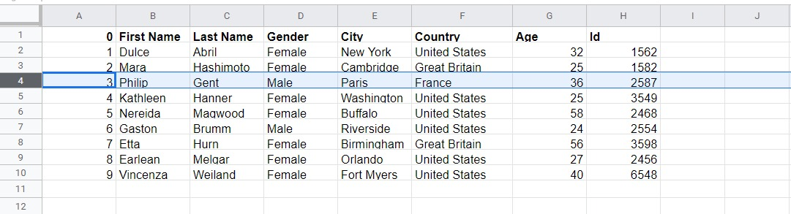

# Baris dan Kolom

Pada materi sebelumnya, kita telah mempelajari navigasi pada Google Sheets. Nah, sekarang mari kita bermain dengan baris dan kolom dengan memanfaatkan contoh data spreadsheet yang dapat diunduh di sini: sample file. https://github.com/dicodingacademy/assets/raw/main/vd_academy/file_example_XLS_10.xls

Dalam percobaan kali ini, kita menggunakan data sederhana yang terdiri dari 10 baris saja. Kita dapat memasukkan file tersebut dengan cara import seperti berikut:

1. Klik File - Import pada menu bar Google Sheets.
   
2. Selanjutnya, pilih berkas yang ingin ditambahkan dan akan muncul jendela berikut
   
   Pada gambar di atas terdapat lima pilihan untuk mengimpor file, yaitu dari:

- My Drive: menambahkan contoh berkas dari Drive. Jika menggunakan opsi ini, tentukan juga lokasi folder berkas yang akan diimpor.
- Shared with me: menambahkan contoh berkas dari sekumpulan berkas milik orang lain yang aksesnya dibagi (shared) dengan Anda.
- Shared drives: menambahkan contoh berkas dari shared drive (drive lain yang bisa Anda akses).
- Recent: menambahkan contoh berkas dari sekumpulan berkas yang baru Anda akses.
- Upload: menambahkan contoh berkas dari mesin lokal/komputer Anda.

Maka dari itu, kita pilih Upload supaya bisa mengunggah berkas contoh yang diunduh sehingga tidak perlu membuat berkas baru.

3. Apabila data sudah dimasukkan, maka tampilannya sebagai berikut:
   

Jangan ditutup dulu berkasnya ya. Kita masih akan menggunakannya lagi di uraian berikutnya.

## Menyisipkan Kolom

Saat ini Anda sudah memiliki 10 baris contoh data. Bagaimana caranya apabila kita ingin menambahkan kolom baru dengan nama City di antara Gender dan Country? Berikut langkah-langkahnya.

1. Sorot salah satu kolom. Misalnya di sini kita memilih kolom Gender. Karena Gender berada di kolom D, maka klik kolom tersebut sehingga semua kolom D tersorot.
   
2. Klik kanan pada kolom Gender tersebut, kemudian pilih Insert 1 right karena kolom City yang ingin kita buat posisinya setelah kolom Gender dan sebelum kolom Country.
   
3. Hasilnya adalah kolom baru di antara Gender dan Country. Lalu, kita dapat mengisi data pada kolom kosong tersebut dengan data kolom City di bawah.
   
   Kita telah berhasil menyisipkan kolom baru pada contoh data yang ada.

## Menghapus Kolom

Bagaimana jika kita tidak sengaja membuat kolom baru dan ingin menghapusnya? Misalkan pada contoh data sebelumnya, kita ingin menghapus kolom Date.

1. Karena Date berada di kolom H, klik kolom tersebut sehingga semuanya tersorot.
   
2. Klik kanan pada kolom Date tersebut, kemudian pilih Delete Column.
   
3. Sekarang seluruh data pada kolom H sudah terhapus. Secara otomatis data ID (yang sebelumnya berada di kolom I) akan bergeser ke kiri seperti berikut (menjadi data kolom H yang baru).
   
   Kita telah berhasil menghapus kolom Date dari contoh data di atas.

## Menyisipkan Baris

Sebelumnya, kita membahas tentang menyisipkan dan menghapus kolom. Selanjutnya, kita bermain dengan baris dari contoh data yang ada.

Bagaimana caranya jika kita ingin menyisipkan data milik George di baris ke-5 setelah nama Philip? Dengan masih menggunakan contoh data terakhir di atas, mari kita mulai dengan langkah berikut.

1. Berdasarkan spreadsheet, Philip berada di baris ke-4. Karena itu, klik baris tersebut sehingga semua baris ke-4 tersorot.
   
2. Klik kanan pada baris nama Philip tersebut, kemudian pilih Insert 1 below karena nama George ingin kita buat posisinya setelah Philip dan sebelum Kathleen.
   
3. Setelah muncul baris baru di antara Philip dan Kathleen, kita dapat mengisi data George pada baris baru tersebut.
   
   Kita telah berhasil membuat baris baru dengan dengan data milik George pada contoh di atas.

## Menghapus Baris

Bagaimana jika kita tidak sengaja membuat baris baru dan ingin menghapusnya? Misalkan pada contoh data sebelumnya kita ingin menghapus baris George.

1. Karena George berada di baris ke-5, klik baris tersebut sehingga semuanya tersorot.
   
2. Klik kanan pada baris George tersebut, kemudian pilih Delete Row.
   
3. Ketika data pada baris ke-5 terhapus, maka otomatis data pada baris setelahnya (baris ke-6 dan seterusnya) akan naik menggantikan data milik George sehingga data Kathleen akan bergeser ke atas seperti berikut.
   
   Kita telah berhasil menghapus baris George dari contoh data di atas.

# Sortir Data

Tahukah Anda tentang sortir data di Google Sheets? Fitur ini berguna untuk mengurutkan data yang kita miliki supaya lebih tertata rapi.

Terdapat beberapa hal yang harus didefinisikan di awal sebelum melakukan sortir data, di antaranya seperti:

Manakah kolom yang harus disortir?
Tentukan terlebih dahulu data yang ingin disortir. Katakanlah kita memiliki sebuah tabel yang berisi informasi jumlah penjualan dari masing-masing produk yang dijual di sebuah toko. Apakah kita ingin mengurutkan berdasarkan angka penjualan atau berdasarkan nama produknya?
Bagaimana metode mengurutkannya?
Selanjutnya, Anda dapat menentukan metode dalam proses sortir. Misalnya, jika kita memilih untuk mengurutkan berdasarkan angka penjualan, apakah ingin diurutkan dari yang paling laris atau dari yang paling sedikit terjual?
Kunci dalam proses sortir adalah memastikan bahwa seluruh data yang ingin disortir telah terpilih. Setiap baris dalam berkas spreadsheet dapat mewakili penjualan produk kepada pelanggan. Kemudian, setiap kolom atribut akan mencatat detail misalnya seperti jumlah produk terjual penjualan, waktu dibuat, alamat pelanggan, dan lain-lain.

Masih bingung tentang sortir data? Simak penerapan sortir data pada uraian di bawah ini:

1. Unduh berkas contoh data penjualan yang ingin kita sortir di sini https://github.com/dicodingacademy/assets/raw/main/visualisasi_data_academy/SampleDataModulSortirData.xlsx.
2. Selanjutnya, lakukan import contoh data tersebut ke dalam Google Sheets sehingga tampilannya menjadi seperti berikut.
   
3. Sorot terlebih dahulu semua data yang ada di Spreadsheet tersebut. Hal ini bisa kamu lakukan dengan cara klik dan seret dari kolom A hingga kolom G. Kemudian, buka menu Data dan klik opsi Sort range.
   

Dengan menggunakan Sort range, Anda dapat mengurutkan data berdasarkan satu kondisi. Misalnya, hanya ingin mengurutkan berdasarkan kolom C (Nama Pembeli) saja atau berdasarkan kolom D (Produk) saja.

Anda juga dapat mengurutkan berdasarkan dua atau lebih kondisi, seperti mengurutkan berdasarkan kolom C dan juga berdasarkan kolom D. Untuk lebih jelasnya, ikuti langkah berikut.

## Mengurutkan berdasarkan satu kondisi

1. Untuk mengurutkan berdasarkan satu jenis kondisi, perhatikan pengaturan sort range berikut. Pastikan Anda mencentang opsi Data has header row agar Google Sheets mendeteksi baris pertama sebagai sebuah judul pengelompokan dari data yang terletak di baris-baris berikutnya. Jika Anda sudah mencentang opsi Data has header row, maka opsi di samping tulisan Sort by seharusnya jadi seperti berikut:
   

Nah, pada kondisi kali ini kita akan mengurutkan data berdasarkan nama pembeli sesuai abjad dengan urutan naik (A-Z). Maka dari itu, isi kondisi Sort by dengan NamaPembeli dan akhiri dengan klik Sort.

2. Dengan demikian, hasil pengurutan data berdasarkan nama pembeli berubah menjadi urut secara menaik (A-Z) seperti berikut:
   

3. Jika Anda perhatikan, bukan namanya (kolom C) saja yang berubah urutan sesuai abjad, tetapi data yang melekat pada nama pembeli tersebut (seperti data pada kolom A, B, D, E, F, dan G) juga ikut berurutan.

## Mengurutkan berdasarkan dua kondisi atau lebih

Selanjutnya, kita ingin mengurutkan data berdasarkan lebih dari satu kondisi, misal berdasarkan nama pembeli dan produk yang dibeli. Apabila sebelumnya hanya menggunakan satu kondisi yaitu berdasarkan nama pembeli saja, saat ini kita tambahkan lagi kondisi lainnya yaitu berdasarkan produk. Alhasil, data yang berurutan bukan hanya nama pembel, melainkan juga produk.

1. Sorot kembali semua data yang ada, kemudian pilih menu Data - Sort Range.
   
2. Atur pengaturan pada Sort range sesuai dengan data pertama yang ingin diurutkan. Dalam latihan ini, berarti pilih NamaPembeli seperti berikut:
   
3. Setelah itu, kita bisa tambahkan kondisi baru dengan klik Add another sort column dan isikan dengan Produk seperti berikut. Alhasil, alur sortirnya dimulai berdasarkan nama pembeli terlebih dahulu, kemudian produknya. Setelah selesai, klik tombol Sort.
   
4. Sekarang tampilannya akan terlihat seperti berikut:
   

Dari gambar di atas dapat dilihat bahwa metode pengurutan pertama adalah berdasarkan nama, kemudian produk. Misalnya, Agung pernah membeli produk charger, kabel USB, dan keyboard; sedangkan Ahmad pernah membeli produk baterai, keyboard, dan monitor. Karena abjad nama Agung (AG) lebih dulu dari Ahmad (AH), maka Agung berada di urutan pertama. Google Sheets kemudian mengurutkan produk yang dibeli Agung menurut abjad mulai dari charger hingga keyboard. Setelah mengurutkan item yang dibeli Agung, barulah menuju ke data Ahmad dengan urutan produk yang dibeli mulai dari baterai hingga monitor.
