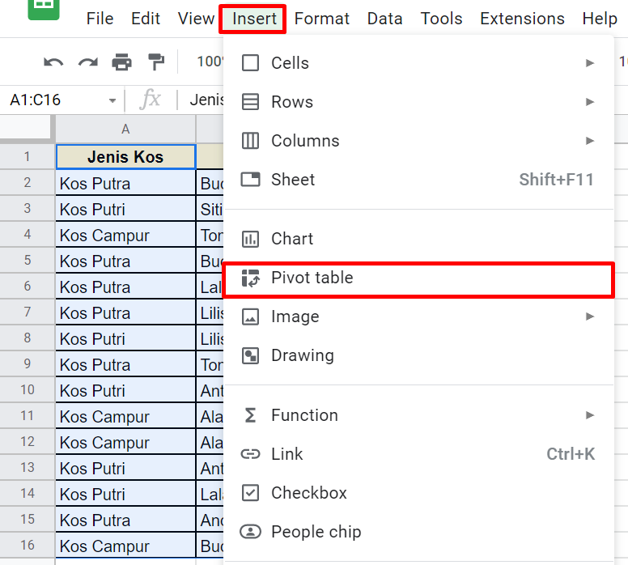
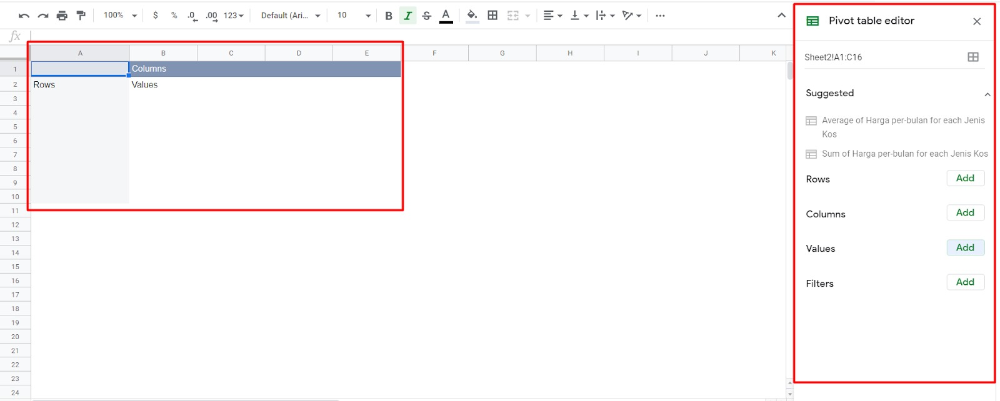
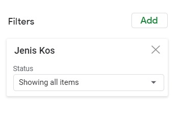

# Pengenalan Pivot Table

Untuk membantu menjelaskan pivot dalam spreadsheet, kita akan gunakan contoh data harga indekos per bulan berikut.

Menurut Anda, bagaimana jika kita ingin mengetahui berapa jumlah indekos putra dan total harga per bulannya?

Mungkin Anda akan menggunakan fungsi COUNTIF (menghitung jumlah data berupa teks dengan parameter tertentu) dan SUMIF (menjumlahkan data berupa angka sehingga diketahui jumlah keseluruhannya) untuk menyelesaikan permasalahan tersebut. Namun, bagaimana jika contoh kasusnya diganti dengan berapa jumlah indekos putri dan total harga per bulannya? Tentu Anda dapat mengganti rumus sebelumnya, tetapi akan terkesan kurang praktis dan efisien.

Nah, di sinilah waktunya kita menggunakan pivot agar lebih fleksibel dalam mengetahui sebuah kelompok data yang diinginkan. Cukup dengan beberapa klik, kita bisa mengetahui hasilnya sebagai berikut tanpa perlu melakukan penulisan rumus baru.

Berdasarkan contoh di atas, kita dapat mengetahui jumlah dan harga indekos per bulan berdasarkan jenisnya. Dengan ini, bisa disimpulkan bahwa pivot table dapat membantu mengumpulkan dan mengelompokkan data berdasarkan parameter tertentu sesuai kebutuhan. Sebelum membuat pivot, pastikan data Anda sudah rapi terlebih dahulu, baik dari kategori, nilai, dan sebagainya.

## Membuat Pivot Table dari Data Sederhana

Sudah coba membuat pivot table dengan contoh data di atas? Jika belum, yuk kita belajar bersama membuat pivot tabel sederhana dengan contoh data di bawah ini:

Contoh data di atas merupakan modifikasi dari tabel sebelumnya dengan menambahkan nama pemilik. Penerapan pivot table pun jadi lebih detail. Untuk memulai, simak langkah-langkahnya di bawah ini ya.

1. Pertama, pastikan Anda sudah membuat tabel data seperti contoh di atas, kemudian sorot semua data.

2. Setelah it,u pilih menu Insert - Pivot table.

3. Muncul jendela baru Create pivot table. Pilih New Sheet supaya data hasil pivot dibuat pada sheet lain sehingga tidak bercampur dengan data asal. Namun, jika Anda menghendaki hasil pivot diletakkan dalam sheet yang sama, maka pilih Existing sheet. Setelah itu, klik Create.

4. Lalu, muncul sheet baru dengan isi Row, Column, dan Values. Di panel kanan terdapat Pivot table editor seperti di bawah ini.

5. Selanjutnya, kita tentukan data apa yang ingin dikelompokkan dalam pivot table. Misal, kita ingin melihat setiap pemilik mengelola beberapa jenis tempat indekos. Dari kondisi tersebut, kita coba masukkan ke dalam pivot table editor. Untuk menambahkan nama pemilik indekos, kita dapat memasukkannya ke dalam Rows dengan klik tombol Add dan pilih Pemilik.

6. Hasil yang didapatkan dari langkah tersebut adalah menampilkan baris nama pemilik seperti di bawah ini.

7. Berikutnya, kita ingin mengetahui jenis indekos yang ada. Anda dapat mulai menambahkan kolom baru pada Pivot table editor dengan klik Add pada bagian Columns dan pilih Jenis Kos.

8. Hasilnya akan menampilkan jenis indekos yang ada dalam bentuk kolom seperti berikut:

9. Kemudian, untuk mengetahui berapa jumlah indekos yang dikelola setiap pemiliknya, pada Pivot table editor bagian Value, klik Add dan pilih Jenis Kos.

10. Nah, saat ini kita telah mengetahui setiap pemilik mengelola berapa jenis indekos dari data yang telah dikelompokkan di bawah ini. Misal, Alan memiliki 2 indekos berjenis campur, Budi memiliki 1 indekos campur dan 2 indekos putra, dan lain seterusnya.

Yay, kita telah berhasil membuat pivot table. Selanjutnya, kita akan melanjutkan pembahasan mengenai elemen setiap pivot table. Yuk, lanjut ke materi berikutnya.

# Elemen Pivot Table

Bicara mengenai pivot table, erat kaitannya dengan kolom, baris, dan nilai (value). Sebagaimana yang telah kita lakukan pada materi sebelumnya, hasil pivot tersebut mengandung ketiga elemen tadi, yaitu kolom, baris, dan nilai. Mari kita bedah satu per satu setiap elemennya.

## Baris

Elemen pertama yang akan kita bahas adalah baris. Pada saat klik tombol Add pada bagian Rows di Pivot table editor, sistem akan memberikan Anda pilihan yang terdiri dari data pada baris pertama sumber tabel data. Jika kita menggunakan tabel data dari materi sebelumnya, maka opsinya adalah “Jenis Kos” yang terletak di sel A1, “Pemilik” yang terletak di sel B2, dan “Harga per-bulan” yang terletak di sel C3.

Ketika kita memilih salah satu, misalnya “Pemilik”, sistem akan menampilkan data yang terletak pada kolom Pemilik (kolom B, mulai dari sel B2 dan seterusnya) secara unik. Unik di sini menjelaskan bahwa jika terdapat nama pemilik yang sama, seperti “Budi” yang disebut 2 kali, maka yang tampil dalam pivot hanya satu saja. Data pada kolom tersebut akan ditampilkan per baris.

## Kolom

Elemen kolom mirip seperti elemen baris. Pada saat klik tombol Add pada bagian Columns di Pivot table editor, sistem akan memberikan Anda pilihan yang terdiri dari data pada baris pertama sumber tabel data. Ketika kita memilih salah satu, misalnya “Jenis Kos”, sistem akan menampilkan data yang terletak pada kolom Jenis Kos (kolom A) secara unik. Berbeda dengan elemen Baris, data pada kolom tersebut tidak akan ditampilkan per baris, melainkan akan ditampilkan per kolom.

## Nilai (Value)

Ketika kita menekan tombol Add pada bagian Values, sistem akan menyuguhkan pilihan yang terdiri dari data pada baris pertama sumber tabel data. Nah, jika kita mengisinya dengan “Jenis Kos” dan fungsi penghitungnya menggunakan COUNTA, maka semua data yang ada berdasarkan jenis indekos akan dihitung dan disesuaikan dengan nama pemilik indekos. Misalnya, pada gambar di atas, nama pemilik Alan memiliki nilai 2 indekos yang ia kelola dan berjenis campur.

## Total

Pada saat membuat pivot pada baris atau kolom, di bagian bawah terdapat opsi Show totals yang dapat dicentang. Jika dicentang, maka tabel akan menampilkan nilai total (Grand Total) dari masing-masing kolom pivot.

## Pengurutan

Setiap baris dan kolom memiliki sistem pengurutan berdasarkan parameter masing-masing. Misal pada bagian Pemilik terdapat pengaturan untuk mengurutkan datanya secara ascending (naik) atau descending (menurun) berdasarkan abjad awal dari setiap nama pemilik. Contohnya sebagai berikut:

# Tips Pivot Table

Pivot table merupakan sebuah cara yang efektif dalam mengelompokkan data. Untuk memaksimalkan penggunaannya, berikut tips-tips dalam pembuatan pivot table.

## Menampilkan Nilai Grand Total

1. Pertama, tentukan dulu baris yang ingin dibuat. Di sini kita akan menggunakan data Jenis Kos.

Hasilnya sebagai berikut:

2. Berikutnya, tambahkan dua nilai (value), yaitu Jenis Kos dan Harga per-bulan dengan rincian sebagai berikut:

3. Seperti ditunjukkan gambar pada langkah ke-2 di atas, kita telah menambahkan nilai Jenis Kos dan Harga per-bulan. Karena kita ingin mengetahui jumlah jenis indekos yang ada, maka pada opsi Summarize by, kita memilih fungsi COUNTA. Di sisi lain, karena kita ingin tahu nilai rata-rata pada Harga per-bulan maka isilah opsi Summarize by dengan fungsi AVERAGE. Hasilnya menjadi seperti di bawah ini:

## Menambahkan Fitur Penyaringan (Filter)

Kita juga dapat melakukan penyaringan dengan menampilkan beberapa data yang diinginkan. Misal, dari hasil pivot, kita hanya ingin menampilkan hasil data dari kos putra saja. Maka, kita dapat menambahkan filter pada pivot table editor seperti berikut:

1. Pada pivot table editor, klik Add pada bagian Filter dan pilih Jenis Kos.

2. Selanjutnya, terlihat status “Show all items”. Klik tombol dropdown tersebut dan hilangkan centang pada data yang tidak ingin kita lihat. Pada contoh kali ini, kita hanya ingin melihat data dari Kos Putra saja sehingga kita akan menghilangkan centang pada pilihan Kos Campur dan Kos Putri. Klik OK apabila sudah sesuai.

3. Kita akan mendapatkan hasil filter yang menampilkan data Kos Putra saja dari tabel pivot. Tampilannya sebagai berikut:

## Menampilkan Detail Data dari Pivot Table

Kali ini, terdapat sedikit tambahan tips tentang menampilkan detail data dari pivot table. Percayalah, caranya benar-benar sederhana. Misal kita memiliki data pivot table sebagai berikut:

Dari hasil di atas, kita ingin tahu detail kos campur yang berjumlah empat dengan harga rata-rata per bulan sejumlah 1.165.000 rupiah tersebut.

Nah, kekuatan super yang dapat dilakukan pivot table adalah mampu menampilkan detail dengan hanya klik dua kali pada salah satu value yang ingin dilihat detailnya. Di sini, kita klik dua kali pada alamat sel B2 dan yang terjadi adalah sebagai berikut.

Dengan sekejap saja, Google Sheets membuat sheet terpisah dengan berisi detail dari kos campur yang berisi Pemilik dan Harga per-bulan. Keren, bukan?
