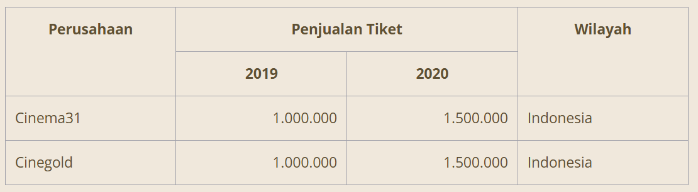

# Pentingnya Dokumentasi Data

Kepercayaan, kredibilitas, dan reproduksibilitas terhadap sebuah data didasari oleh dokumentasi sumber data yang sesuai. Dalam sebuah penelitian, pengguna data tidak serta merta dapat menjadi pembuat data.

Orang yang membuat data dapat:

- mengonfigurasikan instrumen atau simulasi dari mengumpulkan data primer; atau
- menerapkan metodologi dan proses tertentu guna mengekstraksi, mengubah, dan menganalisis data masukan demi menghasilkan sebuah produk data keluaran.

## Mengelola Sumber Data

Provenance dicatat dalam jenis metadata tentang sebuah data. Banyak bidang metadata yang dapat dikumpulkan dalam kategori informasi asalnya, misalnya tanggal pembuatan, pemilik, perangkat lunak atau tools lain yang digunakan, metode pemrosesan data, dan lain sebagainya. Dengan demikian, pengelolaan dan manajemen data yang baik menjadi dasar dari dokumentasi data yang akurat.

Salah satu usaha dan pendekatan yang mungkin Anda familier adalah teknologi blockchain dalam manajemen rantai persediaan (supply chain). Video berikut bercerita bagaimana teknologi blockchain digunakan untuk mendapatkan informasi mengenai kapan, di mana, dan bagaimana cara penangkapan ikan dapat diketahui dengan memindai barcode yang telah dipasangkan ke ikan atau pengemasannya. Dengan begitu, distributor, toko penjual, dan konsumen bisa dengan mudah mencari asal usul ikan tersebut dan bisa langsung tahu jika ikan didapatkan dari penangkapan secara ilegal.

https://youtu.be/oOywU_rXgFE

Metadata dalam kasus ini adalah lokasi ikan ditangkap, nelayan yang menangkapnya, kapan ikan tersebut ditangkap, dan sebagainya, sementara data adalah ikan itu sendiri.

Pendekatan yang bisa dilakukan dalam melakukan dokumentasi data sebagai berikut:

- Dicatat dalam bentuk teks, bisa menggunakan skema penulisan umum atau bisa juga dengan skema khusus dalam data provenance.
- Dicatat dan disimpan secara internal menggunakan program perangkat lunak atau dalam sistem eksternal lainnya.
- Dituliskan dalam bentuk yang dapat dibaca oleh mesin atau yang bisa dibaca oleh manusia.

Bentuk sederhananya, sebuah sumber dicatat dan disimpan dalam sebuah berkas berjudul README yang di dalamnya menjelaskan tentang pengumpulan data dan metode pemrosesan. Data sumber juga bisa dicatat dengan lebih terstruktur menggunakan elemen-elemen spesifik dalam standar metadata seperti Dublin Core https://www.dublincore.org/ hingga standar disiplin metadata khusus seperti ISO 19115-2 https://www.iso.org/standard/67039.html. Untuk lebih memperjelas contoh bentuk penulisan dokumentasi data, simak uraian berikut ini:

- Berkas README
  Pernah menemui berkas README? Berkas README biasanya berupa dokumen text (.txt) dan sering kita temui dalam paket instalasi perangkat lunak, kode pemrograman, kumpulan data, dan bisa juga ditemui dalam proyek penelitian. Dalam proyek penelitian, sebuah berkas README harus memuat daftar berkas yang digunakan dalam dataset, rujukan informasi yang relevan, serta berkas lain yang menunjang penelitian seperti artikel, karya ilmiah, atau slide presentasi. Untuk penulisan README, Anda bisa menggunakan template yang telah distandarkan oleh Cornell University pada tautan berikut: https://data.research.cornell.edu/content/readme

- Data Dictionaries
  
  Data dictionaries atau kamus data berisi informasi penting tentang data yang Anda kumpulkan. Ia digunakan untuk menjelaskan suatu bagian tertentu dalam dataset. Misalnya, menjelaskan arti dari nama sebuah variabel, kegunaan, deskripsi, dan lain sebagainya. Kamus data biasanya digunakan pada data tabular atau sebuah database. Contoh dari data dictionaries dapat dilihat dari kamus data yang disediakan oleh Kementerian Pertanian Amerika Serikat pada tautan berikut: https://data.nal.usda.gov/data-dictionary-examples

- Data paper
  Berbeda dengan makalah, jurnal, atau artikel penelitian biasa yang berfokus pada hipotesis dan hasil penelitian, data paper bertujuan utama untuk menjelaskan mengenai data dan bagaimana data tersebut dikumpulkan. Dalam kata lain, data paper disebut sebagai sebuah dokumen berisi metadata.

## Tools Dokumentasi Data

Dalam proses dokumentasi data, pastinya kita memerlukan sebuah tools (alat) supaya lebih mudah dan efisien. Berikut beberapa hal yang dapat Anda lakukan.

- Buku Catatan
  Salah satu cara tradisional adalah dengan buku catatan. Kita dapat menggunakan catatan sebagai alat untuk mencatat sumber data yang kita peroleh. Namun, jika berbicara tentang data, pasti tidak jauh dengan angka dan terkadang terdiri dari banyak digit. Jika data dicatat dalam jumlah yang besar, sering kali rentan salah. Jika Anda terpaksa menggunakan buku catatan, fokuslah untuk mencatat poin-poin pentingnya agar meminimalisir kesalahan.

- Log dan Blockchain
  Jika bekerja sendiri, Anda dapat melakukan logging atau menggunakan tools bantuan (docs atau spreadsheet) yang memiliki kemampuan untuk memperlihatkan history (sejarah versi). Anda yang bekerja dengan tools modern mungkin mengenal istilah logging atau auditing. Anda bisa memanfaatkan log aplikasi untuk mencatat perubahan pada data.

  Pada pasar perdagangan dunia, pencatatan dilakukan melalui shared ledger yang diterapkan pada blockchain. Setiap stakeholder (pemangku kepentingan) akan memiliki salinan dari setiap kejadian yang tercatat, termasuk perubahan-perubahan yang terjadi pada data tersebut.

## Tips Dokumentasi Data

- Gunakan Alur Ilmiah yang Terstruktur
  Di sinilah kita akan memanfaatkan alur terstruktur yang terdiri dari pencatatan, eksekusi, pemrosesan, dan urutan secara ilmiah. Hal tersebut penting supaya pembaca paham sumber asal dan teori yang mendukung dokumentasi data buatan kita.

  Alur tersebut dapat dirancang dalam bentuk grafis secara berurutan berdasarkan tugas yang diberikan sehingga tugas baru yang dimasukkan ke dokumentasi data dapat mengambil masukan dari tugas sebelumnya. Supaya alur kerja dapat digunakan kembali di masa mendatang, maka informasi yang dicatat perlu dapat menunjukkan dari mana data berasal, bagaimana proses data tersebut diubah, dan komponen apa saja yang mendukung di dalamnya.

  Hal tersebut dapat memungkinkan orang berikutnya dapat mudah melakukan eksperimen lebih lanjut dan merevisi apabila terdapat hal yang kurang tepat dari data tersebut.

- Informasi Harus Jelas dan Sedetail Mungkin
  Tautan ke data sumber asli harus jelas. Sebutkan dari mana Anda mendapatkannya. Ini sangat penting untuk menunjukkan sumber supaya dataset terlihat kuat dan dapat dipercaya.

  Coba tanyakan ke diri Anda sendiri, jika orang lain membaca informasi mengenai sumber data, apakah orang tersebut mudah menemukan data tersebut? Jika orang lain membutuhkan waktu lama untuk menemukan sumber data aslinya, walaupun sudah diinfokan tautannya, berarti informasi yang Anda berikan belum jelas.

  Selain itu, pastikan penjelasan setiap perubahan data yang Anda lakukan harus dituliskan dengan terperinci. Orang lain harus mengetahui langkah demi langkah perubahan apa yang telah dilakukan, tanpa perlu harus bertanya kepada Anda.

# Bercerita dengan Data

Sekarang saatnya kita mulai menyatukan hal-hal yang telah dipelajari dari awal sampai akhir. Tujuan utama dari modul ini adalah membantu Anda menyampaikan hasil visualisasi yang mendukung hipotesis pada orang lain. Jika tersampaikan dengan baik, maka visualisasi data tersebut dapat digunakan untuk melakukan analisis, baik itu bertujuan untuk memberikan insight maupun meyakinkan orang lain untuk mengambil sebuah keputusan dengan diperkuat oleh hasil analisis kita.

## Exploratory vs Explanatory

Dalam presentasi atau penyampaian hasil visualisasi, Anda harus dapat membedakan cara penyampaian antara exploratory analysis dan explanatory analysis.

Exploratory berasal dari kata explore yang berarti jelajah, sehingga exploratory analysis adalah proses penyampaian di mana Anda membimbing dan memandu audiens dalam melihat (menjelajahi) data yang telah dikumpulkan. Di sisi lain, explanatory berasal dari explain yang berarti menjelaskan, sehingga explanatory analysis adalah proses penyampaian di mana Anda tidak meminta audiens untuk menjelajahi data, melainkan langsung ke poin-poin utama dan implikasi dari data tersebut.

Mungkin Anda tergoda untuk melakukan exploratory analysis karena dapat menunjukkan betapa banyaknya data yang telah dikumpulkan dan seberapa besar kerja keras yang dilakukan. Namun, harus dimengerti bahwa mayoritas orang bosan dengan cerita presentasi yang bertele-tele. Jika kita bandingkan sebagai sebuah cerita seseorang yang menonton tari kecak di Bali, exploratory analysis adalah bagian di mana orang tersebut mempersiapkan barang-barang yang dibutuhkan dan proses untuk sampai ke Bali, sedangkan explanatory analysis adalah cerita saat melihat tari kecaknya.

Dari penjelasan di atas, explanatory analysis adalah cara yang cocok untuk mayoritas situasi penyampaian yang mungkin terjadi. Namun, dalam melakukan explanatory analysis, ada 3 pertanyaan penting yang harus dapat Anda jawab terlebih dahulu.

## Kepada siapa kita berkomunikasi?

Hal ini sangat penting agar kita paham bagaimana mengomunikasikan hasil yang didapatkan. Tergantung siapa lawan bicara atau audiens, kita bisa memilih bagaimana berbicara dan bertindak saat menyampaikan informasi. Sebagai contoh, cara bicara kepada teman dan orang tua itu beda, kan?

Terdapat dua cara pandang yang dibutuhkan untuk dapat melakukan komunikasi yang efektif.

- Melihat dari sisi audiens
  Semakin spesifik kita tahu siapa audiensnya, semakin besar potensi komunikasi kita sukses. Maka dari itu, kita harus menghindari penyampaian data yang terlalu umum. Kita juga perlu paham kebutuhan informasi seperti apa yang ingin diketahui audiens. Berkomunikasi dengan terlalu banyak orang pada saat yang sama sekaligus cenderung tidak tepat sasaran karena kebutuhan masing-masing orang dapat berbeda. Ini justru membuat kita kurang efektif dalam usaha untuk penyampaian informasi. Persempit target audiens, maka hasilnya akan lebih efektif.

- Melihat dari sisi diri sendiri
  Penting untuk mengetahui hubungan kita dengan audiens, apakah mereka sudah mengenal kita? Apakah mereka menganggap kita sebagai ahli dan setiap hal yang kita sampaikan bisa dipercaya? Ini merupakan sebuah acuan untuk menyusun cara komunikasi kita, hal yang disampaikan, dan kapan harus menggunakan data. Hal ini dapat memengaruhi alur keseluruhan cerita yang ingin disampaikan. Jika sebelumnya tidak pernah bertemu dengan audiens, berarti Anda terlebih dahulu harus membangun reputasi bahwa Anda itu benar-benar mengerti topik yang akan diberikan. Biasanya hal ini dilakukan dengan cara perkenalan diri.

## Bagaimana kita berkomunikasi dengan audiens?

Setelah mengerti dan memahami audiens, langkah selanjutnya adalah menentukan bagaimana cara komunikasi yang paling efektif dengan audiens tersebut. Alat apa yang nanti digunakan untuk berkomunikasi dan bagaimana cara membawa diri yang paling efektif.

- Alat
  Metode alat yang kita gunakan untuk berkomunikasi dengan audiens memiliki peran penting dalam sejumlah faktor, termasuk jumlah kontrol yang kita miliki atas bagaimana audiens memperoleh informasi dan tingkat detail yang perlu lebih dijelaskan.

  Pada proses presentasi secara langsung dan tatap muka, kita dapat menanggapi audiens jika terdapat hal yang kurang jelas. Tidak semua yang kita sampaikan harus ditulis secara detail pada dokumen presentasi dan visualisasi data karena kita ada di sana untuk menjelaskan dan menjawab setiap pertanyaan yang muncul selama presentasi.

  Lain halnya ketika hanya menuliskan hasil analisis dalam bentuk dokumen yang dibaca sendiri-sendiri. Jika pada presentasi langsung kita dapat mengendalikan audiens yang kurang paham, maka hal tersebut tidak efektif jika kita tidak ada di sana untuk menanggapi atau melihat ekspresi kebingungan audiens saat menemui bagian yang kurang jelas. Alhasil, tingkat detail yang diperlukan pada penulisan dokumen biasanya lebih tinggi.

- Pembawaan Diri
  Pertimbangan penting lainnya adalah nada penyampaian ke audiens. Apakah kita ingin menyampaikannya dengan ceria, memotivasi, atau serius? Nada yang kita inginkan untuk komunikasi juga akan memiliki pengaruh pada pilihan desain yang akan digunakan untuk membuat proses visualisasi data. Selain itu, pernahkah kita berpikir bahwa audiens bisa lebih tahu daripada kita? Terkadang asumsi tersebut muncul. Namun, sebaiknya hapus pemikiran seperti itu. Jika kita adalah orang yang menganalisis dan mengomunikasikan data, maka kita harus percaya diri. Bahkan, kita dapat melakukan interaksi dengan audiens untuk meningkatkan keterlibatan mereka atau mengurangi rasa gugup saat menyampaikan data tersebut.

## Bagaimana kita bisa menggunakan data untuk membantu menegaskan maksud kita?

Setelah kita menjawab pertanyaan di atas, barulah kita membahas data apa yang akan membantu menegaskan dan mendukung inti cerita atau kesimpulan yang ingin disampaikan. Salah satu cara yang dapat dilakukan adalah menggunakan metode 5W (What, Who, When, Why, Where). Gunakan data yang telah didapatkan untuk menjawab unsur dari 5W sehingga dapat menegaskan informasi penting yang ingin kita sampaikan.

Berikut unsur-unsur dalam metode 5W dan cara penggunaan dalam bercerita dengan data. Sebagai contoh, mari kita gunakan visualisasi data dalam bentuk tabel berikut.

- What : Unsur “Apa?”. Apa yang telah terjadi? Anda bisa menggunakan data untuk menegaskan apa yang telah terjadi. Sebagai contoh, “Penjualan tiket bioskop naik 50%.”
- Who : Unsur “Siapa?”. Siapa yang terlibat? Gunakan data untuk membuktikan siapa saja yang terlibat dalam sebuah situasi. Sebagai contoh, “Penjualan tiket bioskop perusahaan Cinema31 dan Cinegold naik 50%.”
- When : Unsur “Kapan?”. Kapan terjadinya? Data yang berhubungan dengan waktu dapat menjelaskan mengenai kapan terjadinya inti cerita. “Penjualan tiket bioskop perusahaan Cinema31 dan Cinegold naik 50% di tahun 2020.”
- Where : Unsur “Di Mana?”. Di mana kejadiannya? Anda dapat menegaskan tempat kejadian sebuah situasi jika Anda memiliki data dengan informasi dalam bentuk lokasi. “Penjualan tiket bioskop perusahaan Cinema31 dan Cinegold di Indonesia naik 50% di tahun 2020.”
- Why : Unsur “Mengapa?”. Mengapa hal itu terjadi? Gunakan data untuk menjelaskan kenapa sebuah situasi terjadi. “Penjualan tiket bioskop perusahaan Cinema31 dan Cinegold di Indonesia naik 50% di tahun 2020 karena didorong oleh diskon.”

# Visualisasi yang Efektif

Terdapat banyak sekali jenis visualisasi yang dapat digunakan dalam menyampaikan data, tetapi hanya sedikit di antaranya yang mampu secara efektif menjawab kebutuhan kita. Pada tahap ini, kita akan fokus pada beberapa visualisasi tersebut.

## Berbentuk Teks

Ketika kita hanya ingin menampilkan satu atau dua angka saja, gunakan teks sederhana, tak perlu tabel dan grafik. Buat tampilan angka terlihat menonjol. Tambahkan beberapa kata pendukung untuk menyampaikan pikiran kita secara jelas. Penambahan kata atau kalimat pendukung berfungsi untuk meminimalisir perbedaan pendapat atau kesalahan informasi. Untuk mengilustrasikan penjelasan tersebut, mari kita lihat contoh di bawah ini:

Kenyataannya, kita tidak harus menggunakan diagram atau grafik jika ingin menampilkan beberapa angka saja. Grafik tidak menjelaskan banyak mengenai interpretasi angka. Dalam kasus ini, seharusnya menggunakan sebuah kalimat sederhana saja, seperti: Tahun 2012 sebanyak 20% anak memiliki ibu yang berprofesi sebagai ibu rumah tangga, dibandingkan dengan tahun 1970 yang sebanyak 41%. Sebagai alternatif, kita dapat mewujudkan informasi visual alternatif sebagai berikut:

Ketika kita hanya memiliki satu atau dua angka yang ingin disampaikan, sampaikanlah tanpa grafik atau tabel. Sebaliknya, jika ada banyak angka untuk ditampilkan, tabel atau grafik jadi opsi terbaik.

## Tabel

Pasti kita sering menemui data dalam bentuk tabel. Ketika terdapat sebuah tabel, kita cenderung akan menggunakan telunjuk untuk membaca antar baris dan kolom untuk membandingkan nilai. Tabel sangat baik ketika audiens Anda beragam karena mereka dapat membaca baris tertentu sesuai kepentingan masing-masing. Jika kita berhadapan dengan banyak unit pengukuran, tabel lebih memudahkan saat dibaca.

Perlu diperhatikan bahwa dalam pembuatan tabel untuk presentasi, hindari penggunaan garis tepi yang tebal atau bayangan karena mengakibatkan audiens untuk salah fokus ke garis atau bayangan tersebut. Lebih baik gunakan garis tepi tipis atau ruang putih untuk memisahkan elemen-elemen dalam tabel. Berikut ilustrasi untuk memperjelas detail tersebut:

Garis tepi seharusnya digunakan untuk membantu audiens membaca data, tetapi jangan berlebihan hingga jadi pusat perhatian. Pertimbangkan untuk membuat garis tepinya jadi abu-abu atau tanpa warna. Datalah yang seharusnya menjadi pusat perhatian, bukan garis tepi.

## Heatmap

Cara untuk menggabungkan detail angka pada tabel dengan visual adalah menggunakan heatmap. Grafik ini berfungsi untuk memvisualisasikan data melalui format tabulasi yang memanfaatkan pewarnaan dalam sel untuk menunjukkan besaran nilai angkanya.

Pada gambar di atas, terdapat tabel biasa di sebelah kiri dan heatmap di sebelah kanan. Pada tabel biasa, kita harus mengamati tiap baris dan kolom untuk memahami data mana yang lebih besar atau lebih kecil dibandingkan lainnya. Untuk mengurangi proses dalam memahami data, gunakan saturasi warna sebagai penanda visual. Hal ini dapat membantu mata dan otak kita bekerja lebih cepat untuk menentukan hal penting yang kita butuhkan. Kategori warna pada tabel heatmap sebelah kanan membuat proses pencarian informasi lebih mudah dan cepat. Pasalnya, jika ingin mencari data yang persentasenya paling besar, kita dapat mencari saturasi warna yang paling gelap.

## Grafik

Grafik lebih cepat diproses dan mudah dipahami dalam mendapatkan informasi. Artinya, kita dapat lebih cepat memahami informasi dari grafik dibandingkan dengan tabel yang didesain dengan baik.

Grafik yang digunakan umumnya terbagi menjadi empat kategori : Titik, garis, batang, dan area.

## Kategori Titik

### Scatterplot

Grafik scatterplot berguna untuk menunjukkan hubungan antara dua hal yang terdapat di sumbu x dan y. Grafik ini memudahkan kita untuk memproses data serentak guna melihat hubungan apa yang muncul. Meski jarang digunakan, dunia bisnis masih ada yang menggunakan scatterplot.

Sebagai contoh, bayangkan kita mengelola armada bus dan ingin memahami hubungan antara jarak yang ditempuh dan biaya per kilometer. Scatterplot akan terlihat seperti gambar di bawah ini.

Biaya per kilometer menjadi sumbu Y dan jarak yang ditempuh per bulan menjadi sumbu X. Dengan menaruh data dalam bentuk titik, audiens dengan mudah dapat mengerti bahwa semakin sedikit jarak total yang ditempuh, maka biaya per kilometer semakin besar. Semenatara itu, yang paling efisien adalah jika menempuh jarak sekitar 2.000 sampai 3.000 km. Setelah melebihi jarak tersebut, biaya per km akan semakin besar.

Jika kita ingin lebih fokus pada kasus di mana biaya per km di bawah rata-rata, maka kita dapat memodifikasi sedikit scatterplot untuk menarik perhatian pembaca seperti pada gambar di bawah ini.

Kita juga dapat menambahkan informasi observasi, seperti biaya per kilometer lebih tinggi dari rata-rata saat jarak tempuh kurang dari 1.700 km atau lebih dari 3.300 km untuk sampel yang diobservasi.

## Kategori Garis

### Grafik Garis

Grafik garis biasanya digunakan untuk melihat data yang bersifat kontinu (berkelanjutan). Karena titik dihubungkan melalui garis, grafik ini memperlihatkan perubahan (pertumbuhan atau pengurangan) yang terjadi antar titik. Jenis grafik ini kurang sesuai untuk data yang bersifat kategoris seperti data yang membandingkan jenis kelamin (berapa banyak laki-laki dan perempuan) atau data yang membandingkan makanan kesukaan (berapa banyak yang suka buah, daging, dan seterusnya). Sering kali data kontinu berupa unit waktu seperti hari, bulan, kuarter, atau tahun.

Grafik garis dapat menampilkan seri data tunggal (single series), dua seri data (two series), atau data multi seri (multiple series) seperti contoh pada gambar di bawah ini.

### Slopegraph

Slopegraph merupakan grafik berkategori garis yang mirip dengan grafik garis biasa. Namun, secara konsep dan tujuan berbeda dari grafik garis biasa. Slopegraph hanya memperlihatkan perubahan antara dua titik saja. Hal tersebut bertujuan agar audiens fokus pada perubahan kenaikan atau penurunan yang terjadi.

Bayangkan kita menganalisis dan mengkomunikasikan data dari survei karyawan. Dari hasil analisis tersebut, menunjukkan perubahan dalam kategori survei dari 2014 hingga 2015 seperti berikut:

Jika terlalu banyak garis bersinggungan, slopegraph mungkin tidak efektif sehingga sulit membaca datanya. Jika ingin audiens fokus pada kategori yang paling menurun tingkat kepuasannya, Anda dapat melakukan perubahan pada slopegraph seperti berikut.

## Kategori Batang

Terkadang kita menghindari penggunaan grafik batang karena grafik ini terlalu sering digunakan. Pendapat ini justru salah. Sebaliknya, dikarenakan grafik tersebut sering digunakan, maka audiens tidak perlu menghabiskan waktu untuk mempelajari cara membaca grafik. Daripada menggunakan energi untuk memahami bagaimana cara membaca grafik, lebih baik jika audiens menggunakan waktunya untuk memahami isi datanya.

Grafik batang mudah untuk dibaca. Mata kita akan membandingkan beberapa data yang digambarkan dalam bentuk batang secara cepat. Kita pun bisa dengan cepat tahu data yang terbesar, terkecil, dan perbandingan antara kategori data.

Perlu diingat, karena mata kita membandingkan secara otomatis dan melihat batang pada ujung atas, mulailah dari titik 0 pada sumbu Y. Tanpa demikian, perbandingan visual bisa salah seperti ini (diagram sebelah kiri).

Pada grafik sebelah kiri, terlihat perbedaan yang sangat mencolok karena sumbu Y tidak dimulai dari 0. Sebenarnya, kenaikan tidak terlalu signifikan karena jika diterapkan sumbu Y mulai dari 0, maka akan terlihat seperti grafik sebelah kanan.

Selanjutnya, selain mempertimbangkan panjang batang, kita juga harus memperhatikan lebar dari diagram batang tersebut. Secara umum, lebar batang harus lebih besar dibandingkan jarak antara batang, penggambarannya seperti di bawah ini.

Kita telah membahas bagaimana cara terbaik untuk membuat grafik batang. Selanjutnya, mari kita lihat ragam jenis grafik batang. Dengan tahu varian yang ada, kita bisa memilih mana yang terbaik untuk keperluan kita.

- Grafik Batang Vertikal
  Seperti grafik garis, grafik batang vertikal dapat berjumlah data tunggal, dua seri, ataupun multi seri. Perlu diingat bahwa jika seri data yang ditambahkan semakin banyak, semakin sulit audiens untuk fokus membaca dan menarik kesimpulan. Alternatifnya, gunakan grafik multi seri. Kita juga harus memperhatikan penyesuaian visual yang terjadi jika memiliki seri data tunggal. Hal ini membuat susunan kategorisasi menjadi penting. Pertimbangkan apa yang ingin diketahui audiens dan buat susunan kategorisasi sejelas mungkin.

- Grafik Batang Vertikal Bertumpuk
  Penggunaan stacked vertical bar chart atau grafik batang bertumpuk lebih terbatas. Grafik ini memungkinkan kita untuk membandingkan antar kategori utama dan juga antar sub komponen dalam tiap kategori. Namun, grafik ini dapat membuat audiens kebingungan secara visual, terutama ketika aplikasi grafik menambahkan variasi warna secara otomatis. Sulit untuk membandingkan sub komponen dari kategori-kategori ketika mereka tidak terletak sejajar di garis bawah. Hal ini menyulitkan kita untuk membandingkan, seperti ilustrasi pada gambar di bawah ini.

- Grafik Air Terjun
  Waterfall chart atau apabila diterjemahkan menjadi grafik air terjun dapat digunakan untuk menampilkan bagian tertentu dari grafik batang bertumpuk. Hal tersebut bertujuan untuk lebih fokus menunjukkan data awal, kenaikan atau penurunan yang terjadi, serta data akhir.

  Cara terbaik untuk mengilustrasikan waterfall chart adalah dengan cerita berikut. Bayangkan kita adalah manajer tim SDM (human resource) yang diminta oleh direktur perusahaan untuk memperlihatkan bagaimana perubahan jumlah karyawan pada tim pemasaran.

Di sisi kiri, kita melihat jumlah karyawan tim pemasaran di awal tahun. Seraya bergerak ke arah kanan, kita melihat pertambahan dari perekrutan karyawan baru dan perpindahan dari tim lain ke dalam tim pemasaran. Pertambahan ini diikuti dengan pengurangan: peralihan karyawan ke tim yang beda dan pengunduran diri karyawan dari perusahaan. Batang yang di ujung kanan merepresentasikan jumlah karyawan di akhir tahun, setelah pertambahan dan pengurangan yang telah terjadi.

- Grafik Batang Horizontal
  Grafik ini sangat mudah dibaca untuk mengetahui kisaran sebuah data, khususnya jika nama kategori panjang. Selain itu, grafik ini cocok dengan kebiasaan mata kita memproses informasi mulai dari kiri atas (nama kategori) hingga ke kanan (data) dari grafik batang horizontal.

- Grafik Batang Horizontal Bertumpuk
  Grafik batang horizontal bertumpuk dapat menunjukkan perbandingan antara kategori total dengan antar sub komponen di tiap kategori. Grafik ini dapat digunakan untuk memvisualisasikan porsi keseluruhan skala dari negatif hingga positif karena kita menggunakan garis dasar yang konsisten, baik ujung kiri maupun ujung kanan. Pendekatan grafik ini dapat terlihat cukup baik pada contoh data survei di bawah ini.

## Kategori Area

Salah satu kategori grafik yang sering dihindari adalah jenis area karena mata manusia tidak terbiasa untuk menghubungkan data kuantitatif dengan bidang dua dimensi. Hal ini menyebabkan grafik area lebih sulit dibaca daripada grafik-grafik sebelumnya.

Untuk alasan ini, hindarilah grafik area kecuali ketika ingin memvisualisasikan data yang besaran perbedaan angkanya sangat tinggi. Sebagai contoh pada visualisasi di bawah, diceritakan bahwa dari 100 pelamar, 25 dipanggil interview, dan 9 diterima sebagai karyawan.

Setiap pelamar divisualisasikan sebagai satu area kotak kecil. Dikarenakan perbedaan nilai data sangat tinggi (100 lawan 25 lawan 9), maka visualisasi area ini terlihat cantik dan mudah dicerna. Kehadiran dua dimensi dari grafik ini memungkinkan kita menampilkan data lebih ringkas dibandingkan dengan satu dimensi.

