# Prinsip Gestalt dalam Persepsi Visual

Apakah Anda pernah membuat sebuah grafik atau visualisasi lainnya, tetapi terlihat berantakan? Mungkin terlihat cantik, tetapi sulit dicerna dengan cepat oleh audiens?

Dalam teori persepsi visual, terdapat prinsip Gestalt yang menyatakan bahwa seseorang cenderung mengelompokkan sesuatu yang dilihat menjadi satu kesatuan utuh berdasarkan pola, hubungan, dan kemiripan. Prinsip Gestalt wajib dimengerti dan diikuti ketika membuat sebuah visualisasi data agar tidak terlihat berantakan dan cepat dicerna oleh audiens.

Terdapat berbagai macam prinsip Gestalt, tetapi kita akan fokus pada enam konsep yaitu proximity, similarity, enclosure, closure, continuity, dan connection.

## Proximity (Kedekatan)

Manusia cenderung menganggap objek yang jaraknya berdekatan merupakan kelompok atau golongan yang sama, sedangkan objek yang jaraknya berjauhan sebagai kelompok atau golongan yang berbeda. Sebagai contoh, perhatikan gambar di bawah.

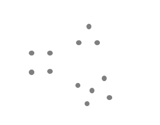

Kita akan melihat 12 titik di bawah sebagai tiga kelompok terpisah akibat kedekatan relatif satu sama lain.

## Similarity (Kesamaan)

Pada konsep kesamaan, objek yang memiliki warna, bentuk, ukuran, dan arah yang sama dianggap terkait atau termasuk bagian dari kelompok yang sama. Sebagai contoh, pada gambar di bawah terdapat objek berwarna biru dan abu-abu.

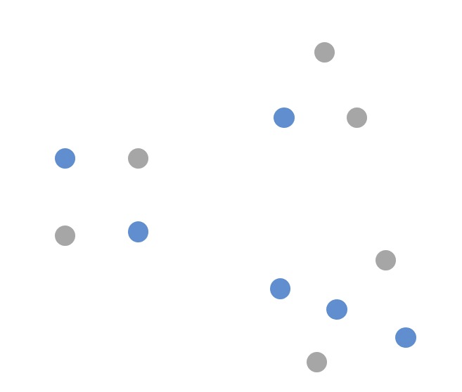

Walaupun mereka tidak berdekatan, tetapi otak kita akan menganggap bahwa mereka memiliki hubungan. Apa yang ingin diceritakan dengan visualisasi tersebut? Apakah mungkin ini menceritakan bahwa ada 3 kelompok dengan pendapat berbeda dan masing-masing kelompok tersebut terdiri dari pria (warna biru) dan wanita (warna abu-abu)?

## Enclosure (Pembeda)

Konsep pembeda menyatakan bahwa objek yang memiliki batas fisik atau border yang sama merupakan satu golongan sama. Salah satu cara untuk mengoptimalkan prinsip enclosure adalah menggambar visual pembeda dalam data kita.

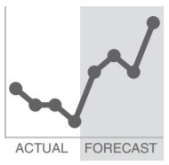

Pada gambar di atas, kita menambahkan area berbayang pada grafik baris untuk memisahkan bagian yang berupa data riil (seperti angka penjualan selama 4 bulan terakhir) dengan data prediks (seperti perkiraan angka penjualan selama 4 bulan ke depan).

## Closure (Penutupan Bentuk)

Konsep penutupan bentuk berkata bahwa otak manusia cenderung memandang sekumpulan objek yang terpecah-pecah sebagai bagian dari satu objek yang lengkap, daripada memandang kumpulan objek tersebut sebagai sesuatu yang benar-benar terpisah satu sama lain. Karena hal ini, orang cenderung melihat kumpulan elemen individu sebagai kesatuan suatu elemen tunggal.

Sebagai contoh perhatikan gambar sebelah kiri. Biasanya ketika kita membuat sebuah grafik pada Google Sheets, akan otomatis terbentuk border atau kotak agar grafik terlihat sebagai satu kesatuan. Selain itu, kadang ada warna pengisi pada kotak (seperti warna abu-abu pada gambar tersebut). Namun, coba hilangkan border dan warna pengisi tersebut sehingga terlihat seperti pada gambar sebelah kanan.

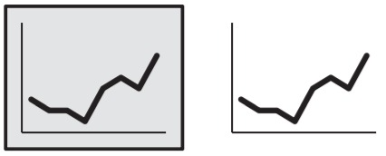

Otak manusia akan tetap menganggap kedua elemen gambar sebagai bagian dari satu grafik yang sama. Sebagai nilai plus, dengan menyederhanakan bentuk grafik, maka data pada grafik akan lebih terlihat menonjol.

## Continuity (Kesinambungan Pola)

Konsep kesinambungan pola mirip dengan konsep penutupan bentuk, tetapi lebih fokus kepada kecenderungan otak manusia untuk secara alami membentuk garis pola walaupun tidak terlihat secara eksplisit. Contohnya, dapat dilihat pada gambar grafik bar di bawah ini yang sumbu-y vertikal telah dihapus.

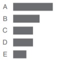

Walaupun sumbu tersebut dihilangkan, kita tetap melihat bahwa masing-masing batang berbaris rapi dimulai dari sumbu-y yang imajiner karena konsistensi jarak antara label (tulisan A, B, C, D, dan E) di sisi kiri dan gambar batang di sebelah kanan. Berarti Anda dapat menggunakan konsep ini untuk menghilangkan komponen visualisasi yang berantakan agar lebih bersih. Sebagai nilai plus, desain yang lebih bersih dapat membuat data kita lebih menonjol.

## Connection (Koneksi)

Konsep terakhir yang akan kita bahas adalah konsep koneksi. Manusia cenderung melihat objek yang secara fisik terhubung sebagai bagian dari satu golongan atau kesatuan. Konsep koneksi biasanya lebih kuat tertanam di otak kita daripada konsep kedekatan (proximity) dan konsep kemiripan (similarity).

Salah satu cara yang bisa kita manfaatkan untuk prinsip koneksi adalah grafik garis yang bertujuan untuk membantu mata kita melihat susunan data seperti pada gambar di bawah ini.

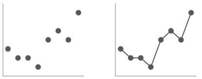

Tanpa adanya garis yang secara fisik menghubungkan titik, otak akan cenderung melihat terlebih dahulu pola sesuai konsep kedekatan (di mana terlihat ada 3 kelompok beda pada gambar sebelah kiri). Namun, ketika ditambahkan garis fisik, maka otak langsung melihat keseluruhan sebagai bagian dari satu kesatuan sebagaimana pada gambar sebelah kanan.

Berdasarkan penjelasan di atas kita dapat mengetahui bahwa prinsip Gestalt membantu kita memahami bagaimana orang melihat dan mengidentifikasi elemen yang tidak diperlukan untuk mempermudah proses komunikasi visual.

## Menghilangkan Elemen yang Rumit

Bayangkan sebuah halaman atau layar kosong. Kemudian, tambahkan satu elemen visual dan minta orang lain untuk menjelaskan apa yang dia tangkap dari elemen tersebut. Selanjutnya, tambahkan satu elemen baru, lalu minta orang lain untuk menjelaskan kedua elemen yang ada. Lakukan berulang-ulang.

Semakin lama, Anda akan menyadari bahwa makin banyak elemen yang ditambahkan, makin banyak pula bagian yang akan dilewatkan oleh audiens. Hal ini karena tiap elemen yang Anda tambahkan ke halaman atau layar tersebut pasti memerlukan waktu untuk dipahami.

Untuk memahami dan memproses setiap elemen, dibutuhkan kekuatan otak. Sementara itu, kemampuan setiap orang itu terbatas. Oleh karenanya, semakin banyak elemen berarti semakin tidak efektif dalam menyampaikan visualisasi data. Agar audiens dapat dengan efektif mengerti visual yang diberikan, maka Anda perlu membuat elemen visual terlihat rapi. Secara umum, identifikasilah dan hapuslah elemen yang kurang efektif.

## Cognitive Load (Beban Kognitif)

Apa itu beban kognitif? Sederhananya, ia adalah usaha mental yang harus dilakukan untuk dapat memproses dan mempelajari informasi.

Ketika kita meminta komputer untuk melakukan pekerjaan, kita mengandalkan kekuatan pemrosesan komputer. Hal serupa juga terjadi pada manusia. Ketika kita meminta audiens untuk menyerap informasi, kita mengandalkan pola berpikir mereka untuk memproses hal tersebut. Ini disebut dengan beban kognitif.

Harus dimengerti bahwa otak manusia memiliki kekuatan untuk pemrosesan yang terbatas. Sebagai orang yang membuat visualisasi data, kita harus membuat audiens mudah memahami data yang disampaikan. Jika audiens membutuhkan waktu lama untuk memahami data yang disampaikan, maka kita harus memperbaiki persepsi visual data yang kita buat.

Salah satu hal penting yang mempengaruhi beban kognitif adalah usaha dari audiens untuk mencerna informasi. Jika audiens merasa tidak percaya diri dalam mencerna visual yang Anda berikan, maka akan semakin besar bebannya. Hal sama bisa terjadi jika audiens tidak percaya dengan informasi yang Anda berikan. Ketidakpercayaan tersebut akan menjadi halangan bagi mereka untuk mencoba memahami data dengan cepat.

## Kerumitan

Salah satu penyebab utama yang menimbulkan cognitive load berlebihan adalah sebuah kerumitan atau disebut juga dengan clutter. Clutter merupakan elemen visual yang tidak menambah pemahaman. Terdapat alasan sederhana mengapa kita berusaha untuk mereduksinya.

Mungkin tanpa kita sadari, sebuah clutter dalam komunikasi visual dapat menyebabkan informasi kurang ideal sehingga berdampak pada pengalaman tidak nyaman bagi audiens saat membacanya. Ketika visual terlihat rumit, kita membuat audiens membuang banyak waktu untuk memahami tampilan data. Alhasil, kita bisa kehilangan kesempatan menyampaikan informasi pada audiens dengan efektif.

# Preattentive Attributes

Kita telah mengetahui pentingnya mengidentifikasi dan menghilangkan hal-hal yang berantakan dari visual yang dibuat. Walaupun dengan cara tersebut kita dapat mengurangi beban kognitif audiens, tetapi kita juga perlu memfokuskan kemampuan kognitif mereka sehingga dapat cepat menangkap cerita yang ingin kita sampaikan melalui visualisasi data.

Sebagai contoh, kita telah sukses mengurangi beban kognitif dari 100% menjadi 50% sehingga informasi penting tidak terlewat. Walaupun sudah sukses dikurangi, manusia tetap butuh waktu untuk memahami visual. Waktu memahami visual tersebut dapat kita kurangi dengan menekankan prinsip preattentive attributes.

Preattentive attributes adalah komponen atau atribut visual yang langsung tertangkap perhatian kita secara tanpa sadar. Pada bagian ini, kita akan mengeksplorasi bagaimana atribut tersebut dapat digunakan secara strategis dan dapat dilakukan hanya dengan mengolah ukuran, warna, dan posisi sebuah visual. Dua cara preattentive attributes dapat digunakan sebagai berikut.

- Preattentive attributes dapat dimanfaatkan untuk membantu mengarahkan perhatian pada fokus utama yang ingin disampaikan.
- Atribut ini dapat digunakan untuk membuat hierarki elemen visual yang mengarahkan perhatian pada informasi yang hendak diinformasikan sesuai dengan proses yang diharapkan.

Jika kita menggunakan preattentive attributes secara strategis, audiens jadi mudah melihat dan menemukan dengan cepat apa yang kita ingin mereka cari.

## Preattentive attributes sebagai sinyal untuk fokus

Cara terbaik untuk membuktikan kekuatan preattentive attributes adalah dengan mendemonstrasikannya. Gambar di bawah ini menunjukkan sejumlah angka. Berapa lama waktu yang dibutuhkan bagi Anda untuk menghitung berapa banyak angka enam yang ada dalam rangkaian tersebut?

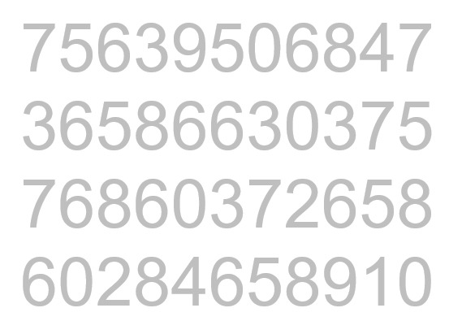

Berapa lama waktu yang telah Anda butuhkan untuk menemukan bahwa angka 6 muncul sepuluh kali. Bahkan Anda mungkin tidak sukses menemukan sepuluh angka tersebut? Namun, apa yang terjadi ketika membuat sebuah perubahan di rangkaian angka seperti berikut.

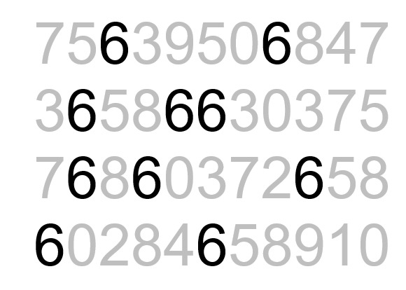

Perhatikan betapa mudah dan cepat kita menemukan angka 6 dalam data di atas menggunakan data yang sama. Tak butuh waktu lama dan untuk mengetahui bahwa terdapat sepuluh angka 6 yang dapat dilihat. Preattentive attributes dari contoh kasus ini adalah penggunaan intensitas warna yang membuat angka 6 mencolok dari angka lain sehingga otak kita menangkap secara cepat dan menghitung jumlah angka 6 yang terlihat mencolok daripada yang lain.

## Preattentive attributes dalam teks

Apakah Anda sadar bahwa Anda kemungkinan besar sudah menggunakan konsep preattentive attributes berkali-kali dalam hidup? Konsep preattentive attributes yang sering orang gunakan adalah pada pembuatan dokumen di mana ada perbedaan pada ukuran nama judul, sub judul, dan paragraf. Kasus lain adalah ketika kita menggunakan stabilo pada sebuah buku agar kata atau baris yang penting dapat lebih mudah ditemukan di kemudian hari.

Selain itu, ukuran juga memberikan informasi hierarki. Seperti halnya judul dan sub judul, kita mengetahui bahwa informasi sub judul merupakan bagian lebih detail dari judul.

Dengan membuat hierarki, kita akan memudahkan audiens untuk memisahkan grup informasi yang memiliki korelasi. Seperti halnya pada modul ini, kita menggunakan ukuran teks sebagai pembatas dari informasi-informasi pembelajaran. Hal ini juga bisa kita terapkan pada pembuatan presentasi seperti gambar di bawah.

Bagaimana? Dengan sedikit memainkan ukuran, warna, dan ketebalan; kita bisa membuat perbedaan yang cukup signifikan. Coba kamu lihat gambar di bawah sebagai pembanding. Selain warna dan ukuran, masih banyak yang bisa kita lakukan untuk membuat preattentive pada teks.

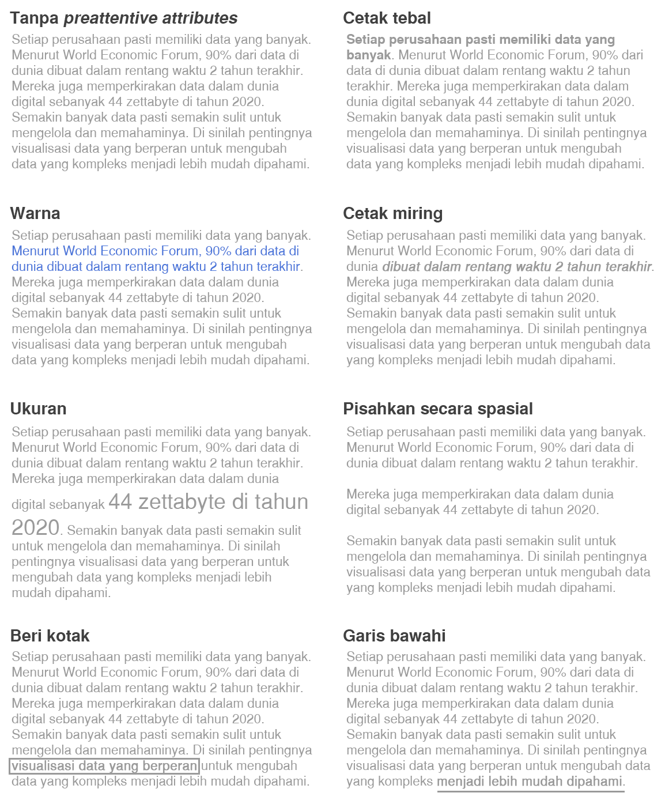

Mungkin pertanyaan selanjutnya adalah, "Kapan kita harus menggunakan salah satu preattentive attributes?" Kembali lagi ke audiens. Ketika audiens merupakan orang yang cukup tua atau memiliki penglihatan yang kurang, maka perubahan ukuran akan lebih baik. Bila seseorang sulit untuk membedakan warna, maka jangan gunakan perbedaan warna sebagai atribut pembeda. Ketika kita memiliki banyak informasi yang penting dalam sebuah teks, maka kita dapat memberikan outline kotak atau mungkin kalian lebih suka untuk melingkari hal yang penting.

## Preattentive attributes dalam grafik

Grafik juga memerlukan penanda visual seperti yang sudah dijelaskan pada contoh kasus sebelumnya yang menghitung banyaknya angka 6. Berikut merupakan contoh penerapan preattentive attributes dalam grafik.

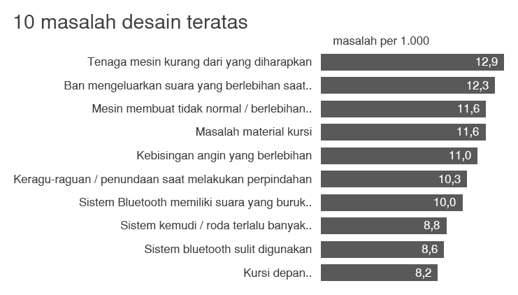

Grafik di atas terlihat tanpa penanda visual sehingga kita sulit menentukan informasi yang ingin diketahui. Masih ingatkah Anda dengan perbedaan antara exploratory analysis dan explanatory analysis? Gambar di atas dapat membantu dalam proses explanatory analysis. Namun, agar lebih efektif, kita harus memastikan data yang berupa inti utama dari cerita dapat terlihat menarik dan penting. Salah satu caranya adalah penggunaan warna dan teks agar audiens fokus pada hal yang ingin diinformasikan. Contohnya seperti pada ilustrasi di bawah ini.

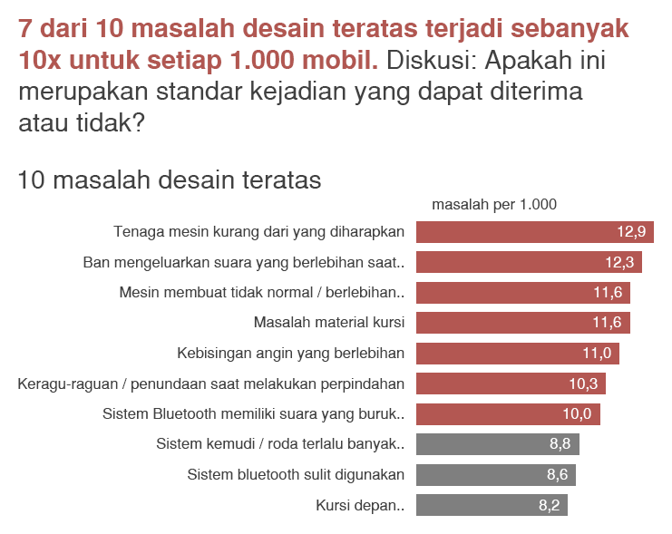

Penyajian di atas menggunakan data dan visual yang sama, tetapi dengan modifikasi fokus dan teks untuk mengarahkan ke bagian utama dari data yang ingin disampaikan. Anda juga dapat menambahkan cerita untuk melengkapi informasi tersebut seperti di bawah ini.

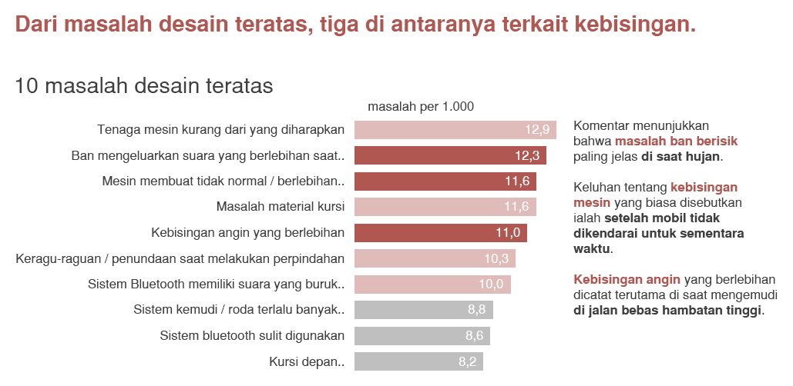

Khususnya dalam presentasi langsung, kita bisa lakukan pengulangan visual dengan perbedaan penekanan untuk menyampaikan aspek yang berbeda dari cerita yang sama. Ini merupakan strategi efektif.

Dalam preattentive attributes, terdapat beberapa atribut yang penting dari sudut pandang strategis ketika memfokuskan perhatian audiens sesuai spesifikasi diskusinya yaitu:

- Ukuran
  Ukuran relatif berpengaruh untuk menunjukkan tingkat kepentingan. Jika kita menunjukkan berbagai hal yang memiliki kepentingan yang sama, berikan mereka ukuran yang sama. Sebagai alternatif, jika terdapat satu hal penting maka manfaatkan ukuran dan membuatnya menjadi lebih besar.

- Warna
  Ketika digunakan secara bijak, warna merupakan salah satu alat paling ampuh untuk menarik perhatian. Hindari keinginan untuk menggunakan warna hanya karena ingin terlihat meriah atau warna-warni semata. Gunakan warna secara selektif sebagai sebuah alat strategis untuk menekankan bagian penting dari visual yang dibuat. Gambar di sebelah kiri, walaupun terlihat meriah, tetapi tidak seefektif gambar sebelah kanan.

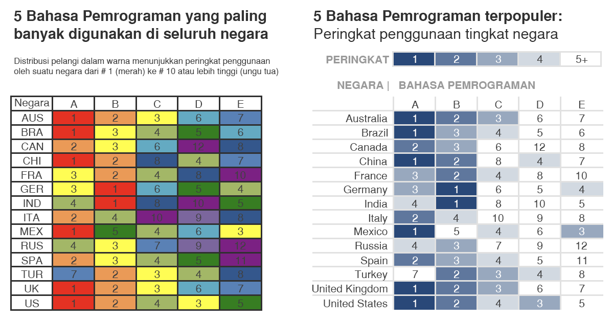

- Posisi
  Ketika kita membuat sebuah visual, maka kita harus bijak dalam memilih posisi. Umumnya, kita membaca dari kiri ke kanan seperti gambar di bawah ini. Akan tetapi, bagaimana dengan orang yang berasal dari Arab? Mungkin orang tersebut lebih terbiasa melihat dari kanan ke kiri. Kita harus menyesuaikan dengan cara audiens membaca. Hal tersebut akan bermanfaat untuk kita menentukan struktur dari visualisasi.

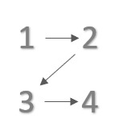

# Konsep Desain dalam Berkomunikasi dengan Data

Pada preattentive attributes yang dipelajari sebelumnya, kita telah belajar bagaimana memusatkan perhatian audiens terhadap informasi yang kita berikan. Namun, untuk membuat visualisasi lebih menarik, kita perlu menggunakan beberapa ilmu pokok desain. Oleh karena itu, sangat penting bagi kita untuk dapat berpikir sebagai seorang desainer.

Pada bagian ini, kita akan belajar pola pikir desainer dan bagaimana konsep desain tradisional dapat diterapkan untuk berkomunikasi dengan data. Terdapat 3 poin utama dalam desain yang akan kita bahas yaitu affordances, accessibility, dan aesthetics.

Seorang desainer dapat membedakan mana desain yang baik dan yang tidak dengan membiasakan diri dengan beberapa aspek umum beserta contoh-contoh desain yang ada. Kita akan belajar dan menanamkan kepercayaan diri pada insting visual dengan mempelajari beberapa tips untuk diikuti dan disesuaikan ketika hal-hal dirasa kurang tepat pada sebuah visual.

## Affordances

Dalam istilah desain, semua benda memiliki fungsinya masing-masing. Seperti halnya ketika kita melihat sebuah tombol, secara insting kita langsung tahu bahwa tombol perlu ditekan untuk mengaktifkannya. Karakteristik ini menunjukkan bagaimana sebuah objek seharusnya berinteraksi. Karakteristik dan sifat ini dinamakan affordances. Nah, bagaimana kita menerapkan konsep affordances ke dalam visualisasi data?

Penerapan konsep tersebut pada dasarnya berupa implementasi desain visualisasi data yang wajar dan umum sehingga audiens secara insting akan fokus pada informasi penting yang ingin Anda utarakan.

- Gunakan warna yang umum
  Sehari-hari kita sudah terbiasa melihat warna merah untuk menandakan informasi negatif dan warna hijau atau biru untuk menandakan informasi yang positif. Gunakan kebiasaan itu sebagai dasar dari pewarnaan pada visualisasi data sehingga audiens dapat langsung mengerti apakah kesimpulan yang data Anda sajikan itu positif atau negatif.
- Gunakan warna yang konsisten
  Jika Anda telah menggunakan suatu warna, seperti kuning atau oranye, untuk menandakan informasi yang penting, maka tetap gunakanlah warna tersebut pada visualisasi selanjutnya. Jika audiens sudah terbiasa melihat warna tersebut digunakan untuk menandakan data penting, maka mereka akan secara insting akan langsung fokus ke warna tersebut pada visualisasi berikutnya.
- Gunakan posisi yang konsisten
  Selalu gunakan posisi yang konsisten pada visualisasi data yang Anda buat. Sebagai contoh, jika judul telah diletakkan di sisi kiri atas, maka selalu gunakan posisi itu. Jika kesimpulan dari suatu grafik telah diletakkan di sisi kanan, maka selalu gunakan sisi kanan ketika membuat kesimpulan grafik berikutnya. Hal ini agar audiens mudah menemukan informasi yang dia butuhkan tanpa harus mencari-cari di mana informasi itu diletakkan.

## Accessibility

Konsep ini membicarakan bahwa visual dan desain seharusnya bisa dimengerti dan digunakan oleh orang dari berbagai latar belakang atau kemampuan. Apakah termasuk penyandang disabilitas? Tentu, latar belakang dan kemampuan yang dimaksud itu konsepnya lebih luas. Sebagai contoh, apabila kita seorang sarjana ekonomi, maka hasil analisis dan visual yang kita buat harus dapat juga dimengerti oleh orang yang bukan berlatar belakang sarjana ekonomi. Ada beberapa hal yang dapat membantu Anda menerapkan konsep accessibility.

- Gunakan bahasa yang sederhana
  Ketika Anda menggunakan sebuah istilah atau kata pada visualisasi data, apakah Anda dapat memastikan audiens mengerti istilah tersebut? Jika audiens tidak memiliki pemahaman kosa kata yang tepat, maka audiens dapat salah mengerti informasi yang Anda berikan. Maka dari itu, pastikan bahasa yang digunakan adalah bahasa yang umum, sederhana, dan tidak bertele-tele.
- Visual harus dapat menjelaskan dirinya sendiri
  Agar sebuah visualisasi dapat dimengerti oleh orang dari berbagai latar belakang dan kemampuan, maka visualisasi tersebut harus dapat menyampaikan maksud Anda ke audiens tanpa perlu penjelasan dari Anda. Ketika sebuah grafik belum dapat menyampaikan maksud kita, maka tambahkanlah teks yang dapat menyampaikan maksud tersebut.

## Aesthetics

Estetika mungkin terlihat berlawanan dengan apa yang disampaikan pada pembelajaran sebelumnya. Namun, yang dimaksud dengan estetika di sini bukanlah menambahkan sesuatu sehingga membuat visual lebih menarik, melainkan bagaimana kita membuat pilihan warna, bentuk, dan posisi menjadi satu kesatuan yang menarik.

Apakah estetika itu penting? Ya, tentu saja. Saat melihat sesuatu yang kurang menarik atau tidak indah, biasanya kita cenderung memberikan kesan negatif walaupun belum mengerti secara lebih detail. Untuk itulah estetika berperan.

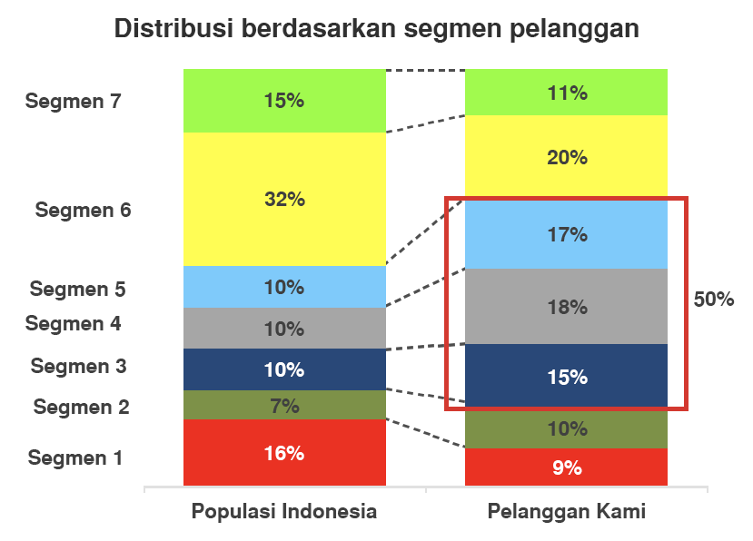
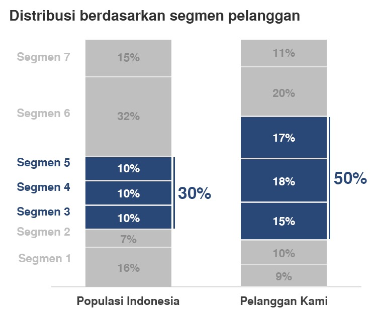

Lihat kedua gambar di atas. Pada gambar pertama, kita melihat penggunaan banyak warna yang sangat mencolok sehingga mengurangi nilai estetika. Hal ini dapat membuat audiens mempertanyakan tingkat profesionalitas dari pembuat visual sehingga menurunkan kepercayaan terhadap data. Konsep ini berlaku juga untuk alignment yang tidak rata dan penggunaan kotak merah untuk total persentase dari sebuah kelompok kategori.

Pada gambar kedua, kita merapikan beberapa hal mulai dari pemilihan warna, menghilangkan garis-garis, dan perbaikan posisi. Dengan adanya sedikit perubahan sedemikian rupa, tampilan visual jadi jauh lebih baik.

## Transkrip Visualisasi Data dalam Dunia Pemrograman

Pada modul ini, Anda telah belajar bagaimana dapat membuat sebuah visualisasi data yang efektif.

Seharusnya Anda telah mengerti teknik dasar untuk dapat mempresentasikan hasil data secara visual, sehingga dapat mengkomunikasikan dengan baik mengenai data yang telah diproses.

Namun Anda mungkin bertanya-tanya, ilmu yang telah didapatkan dapat digunakan untuk apa? Apa hubungannya ilmu visualisasi data dengan bidang atau pekerjaan pemrograman?

Setiap perusahaan pasti memiliki data yang jumlahnya tidak sedikit. Menurut World Economic Forum, 90% dari data di dunia dibuat dalam rentang waktu 2 tahun terakhir.

Dari begitu banyaknya data pasti semakin sulit untuk mengelola dan memahaminya. Oleh karena itu terdapat disiplin ilmu seperti ilmu data, sering disebut sebagai data science, dan pemelajaran mesin atau sering disebut machine learning.

Seorang Machine Learning Developer, atau disebut sebagai pengembang pemelajaran mesin, adalah pakar dalam menggunakan data untuk membuat model pelatihan. Model-model tersebut kemudian digunakan untuk mengotomatisasi proses seperti klasifikasi gambar, pengenalan suara, dan perkiraan pasar.

Sering kali ada penggabungan dengan peran data scientist atau artificial intelligence engineer.

Seseorang yang ingin berkarir di industri ini harus mampu menghasilkan solusi yang dibuat khusus untuk setiap masalah dan mencapai hasil optimal dengan hati-hati memproses data dan memilih algoritma terbaik untuk konteks yang diberikan.

Namun harus selalu diingat bahwa pekerjaan mengelola atau memahami data tidak akan berguna tanpa adanya kemampuan untuk mengubah data yang kompleks menjadi lebih mudah dipahami oleh banyak orang.

JIka kamu ingin berkarir di bidang ini, maka diperlukan ilmu visualisasi data supaya dapat menceritakan dan mempresentasikan data yang ada.

