# Media Visualisasi Data

Tahukah Anda macam-macam media yang digunakan dalam visualisasi data? Materi ini akan memaparkan tentang tabel dan diagram. Berikut penjelasannya.

## Tabel

Dari tabel di atas, Anda dapat membaca data buah-buahan dengan lebih efektif dan mengetahui jumlah total buah. Kita dapat mengurutkan data tersebut secara ascending berdasarkan kolom Nama Buah sehingga akan tampak seperti berikut.

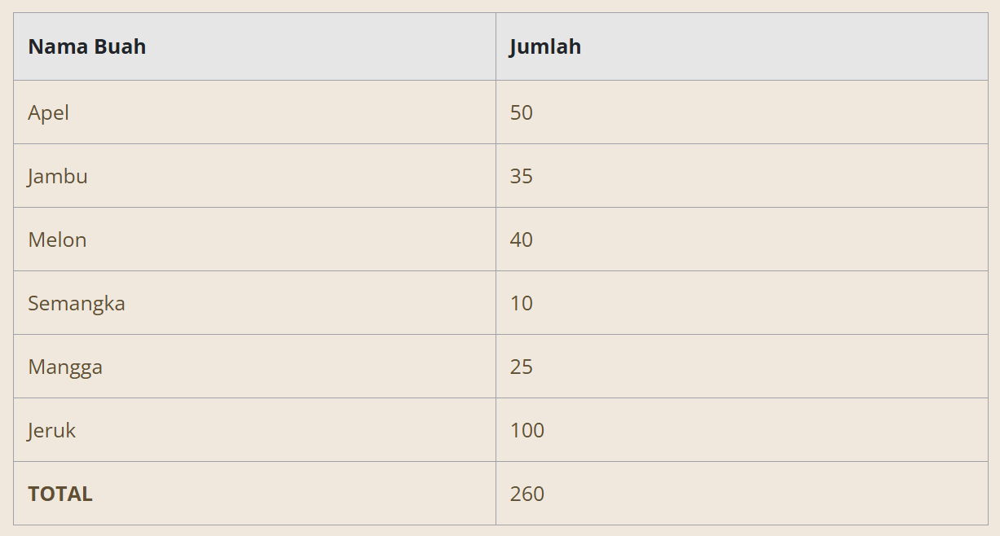

Terdapat beberapa aturan dasar dalam penulisan tabel sebagai berikut:

- Penulisan Judul
  Dalam menulis judul, pastikan sudah mencakup isi dari tabel kita. Usahakan menggunakan font yang jelas dan mudah dibaca agar pembaca jadi paham tabel apa yang tersaji.

- Simpel
  Simplicity is a must (kesederhanaan adalah suatu keharusan). Jangan terlalu berlebihan dalam mendesain sebuah tabel. Akibatnya, pembaca tidak fokus pada data yang disajikan. Penulisan variabel di dalamnya juga singkat saja.

- Penjelasan Simbol
  Apabila dalam tabel terdapat simbol atau istilah tertentu, Anda dapat menjelaskannya pada catatan kaki tabel.

- Penekanan
  Penekanan yang dimaksud adalah cara kita memfokuskan perhatian pembaca pada pokok data. Misalnya, kita bisa mengganti warna background untuk kolom Nama Buah menjadi biru supaya pembaca bisa mudah membedakan nama buah dan jumlah buah. Selain itu, apabila suatu data ada dalam kategori yang sama dan dapat dijumlahkan, maka Anda dapat menyertakan total di akhir datanya seperti contoh tabel di atas.

- Sumber Tabel
  Apabila tabel yang disajikan bukan milik Anda, maka sertakan sumber di catatan kaki tabel.

## Diagram

Sering kali kita mendengar kata Diagram. Sebenarnya apa itu diagram? Diagram merupakan sebuah representasi data yang digambarkan dalam bentuk grafik. Jika Anda memiliki data yang ingin diproyeksikan dalam bentuk diagram, berikut beberapa tipe diagram yang bisa digunakan.

### Diagram Batang

Pernah membuat diagram batang sebelumnya? Diagram batang merupakan salah satu jenis grafik yang hampir sering kita jumpai dalam visualisasi data. Sebabnya, ia dapat menunjukkan perbandingan angka pada kategori tertentu.

Jumlah elemen batang dari diagram ini sebaiknya tidak terlalu banyak supaya label dari data tersebut masih bisa terbaca atau tidak terpotong. Sumbu X pada diagram batang menunjukkan kategori data sedangkan sumbu Y menunjukkan skala nilai dari data dalam satuan ukuran tertentu. Pastikan pada sumbu Y nilai awalnya adalah 0 supaya diagram Anda terlihat akurat dan mengurangi kesalahpahaman dalam mengartikan data.

Selain itu, perhatikan pula penulisan label diagram. Hindari penulisan label secara vertikal maupun diagonal supaya tidak menyulitkan pembaca dalam memahami label tersebut. Warna juga penting dalam penyajian data diagram. Usahakan menggunakan warna yang konsisten supaya mudah dipahami.

Berikut contoh dari diagram batang yang sudah Anda lihat di penjelasan sebelumnya.
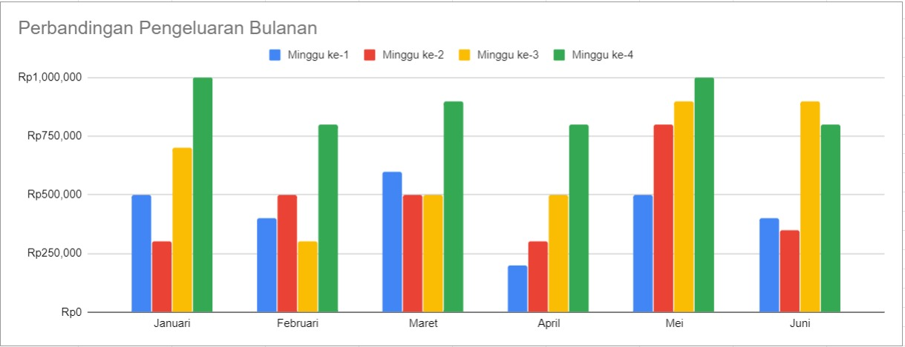

### Diagram Garis

Diagram garis biasanya menyajikan perubahan data dalam periode waktu tertentu. Secara umum, diagram garis digunakan untuk melihat perkembangan data tertentu yang berlangsung secara terus menerus atau berkelanjutan. Contoh dari data yang bisa digambarkan dalam diagram garis adalah perkembangan jumlah penduduk selama 10 tahun terakhir, pertumbuhan ekonomi Indonesia dari tahun 2000 sampai 2025, dan lainnya.

Dalam proses penggambaran diagram garis, diperlukan sumbu mendatar atau X dan sumbu tegak atau Y. Masing-masing sumbu memiliki fungsinya sendiri-sendiri. Sumbu X berfungsi untuk menunjukkan interval waktu, sedangkan sumbu Y menunjukkan kuantitas atau nilai dari data tersebut, seperti total penjualan, biaya yang dikeluarkan, jumlah pendapatan, dan lain sebagainya.

Kemudian, buat tanda titik koordinat yang menunjukkan nilai data berdasarkan waktunya. Setelah semua data ditandai dengan titik koordinat, maka selanjutnya buatlah garis yang menghubungkan titik-titik tersebut. Dari penarikan garis tersebut kita bisa melihat pola perkembangan datanya cenderung naik, stabil, atau turun.

Bayangkan Anda memiliki sebuah toko sepeda dan ingin melihat perkembangan penjualan di tahun 2019. Anda memiliki tabel seperti berikut.

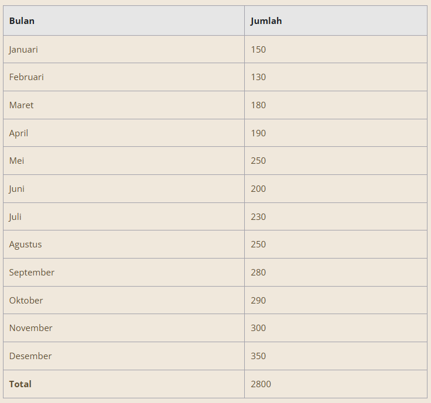

Untuk mempermudah melihat perkembangan data, Anda dapat membuat data dalam tabel tersebut menjadi sebuah diagram garis berikut ini.

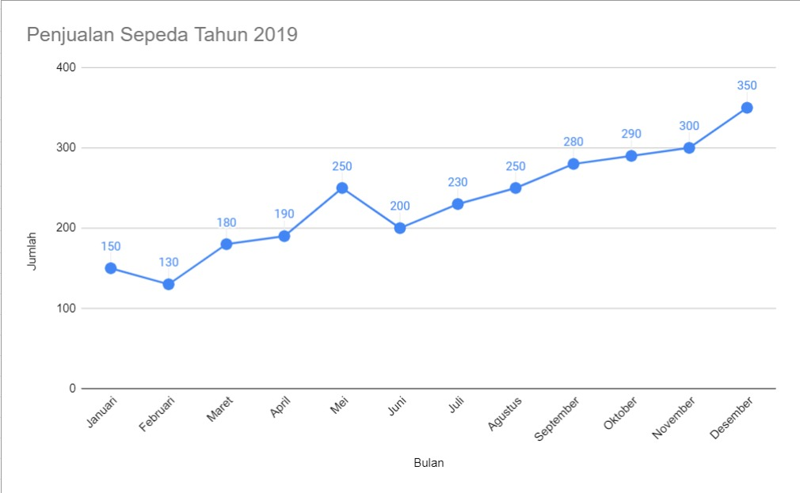

Dari data tersebut, dapat dilihat tren penjualan sepeda pada toko Anda cenderung naik pada tahun 2019. Walaupun pada bulan Januari sampai Juni sedikit tidak stabil karena terjadi kenaikan dan penurunan, tetapi pada bulan Juni sampai Desember penjualan cenderung naik.

Nah, data diagram garis tersebut lebih mudah dibaca, bukan?

### Diagram Lingkaran

Apakah Anda pernah membuat diagram lingkaran sebelumnya? Diagram lingkaran mirip seperti pizza yang diiris dengan porsi tertentu. Pada konteks data, irisan pizza tersebut menggambarkan persentase data nilai atau kuantitas. Ada irisan yang besar dan ada yang kecil, semuanya bergantung pada data yang ditampilkan. Apabila irisan tersebut dijumlahkan nilainya, maka seharusnya akan menghasilkan 100 persen atau 360 derajat.

Diagram lingkaran biasanya sering digunakan oleh perusahaan atau dunia pendidikan untuk merepresentasikan data. Diagram lingkaran tidak hanya menunjukkan jumlah relatif dari kuantitas suatu data satu sama lain, melainkan dapat menunjukkan keseluruhan data dan kuantitas sebuah kategori data itu sendiri relatif vis a vis atau berhubungan dengan keseluruhan data yang ada.

Untuk memperjelas pemahaman tentang diagram lingkaran, berikut terdapat contoh survei terhadap siswa yang memiliki hobi sepak bola, basket, dan bulu tangkis untuk pelatihan menghadapi lomba tingkat kecamatan.

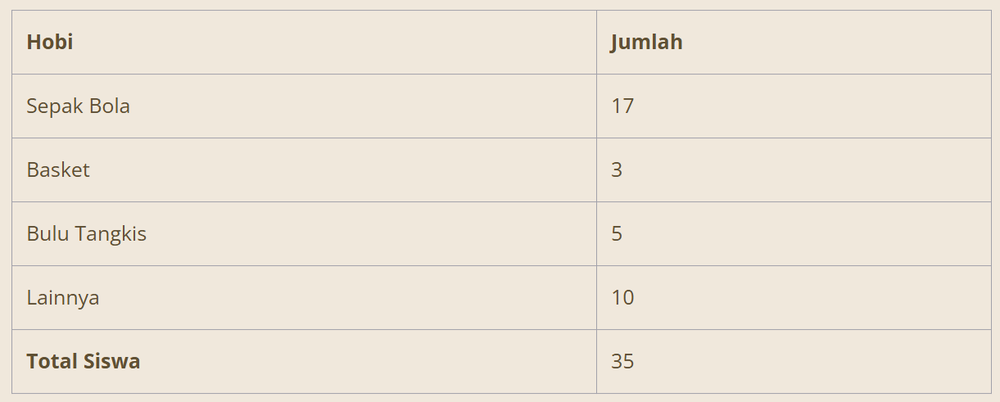

Apabila data tabel di atas digambarkan dengan diagram lingkaran, ini hasilnya:

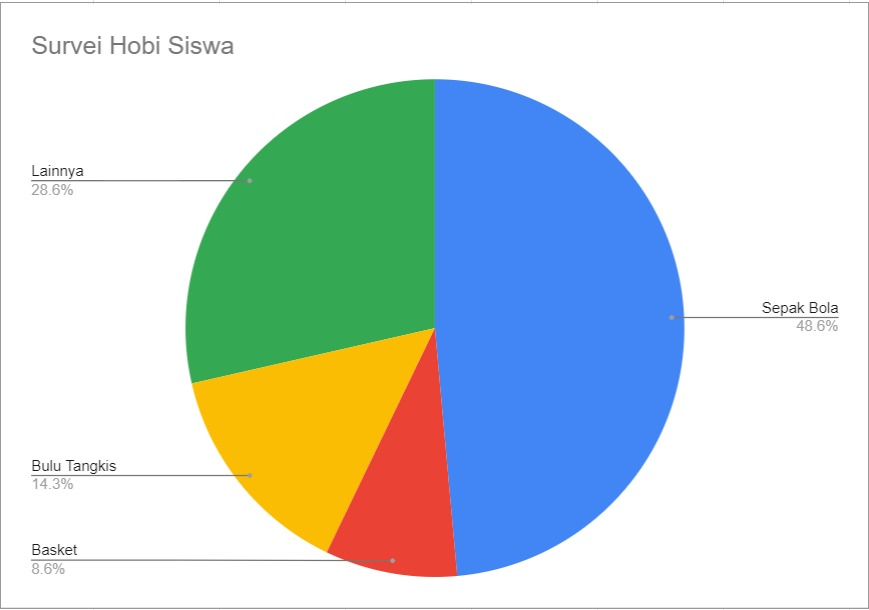

Dari 35 siswa dalam satu kelas, sepak bola paling digemari dibandingkan dengan hobi lainnya. Hampir separuh dari total siswa menyukainya. Basket dan bulu tangkis masing-masing sebanyak 8,6% dan 14,3%, sedangkan 28,6% atau sama dengan 10 orang siswa lainnya memiliki hobi lainnya seperti bermain musik, jalan-jalan, dan membaca novel.

Nah, bagaimana caranya menjadikan jumlah data tersebut dalam bentuk persen? Ada rumusnya, lho. Berikut ini perhitungan rumus diagram lingkaran dalam bentuk persen dan derajat.

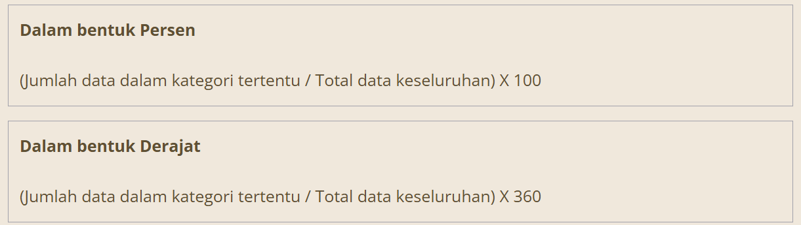

Dalam proses pembuatan diagram lingkaran, terdapat beberapa aturan dasar yang perlu diperhatikan. Sama seperti diagram garis dan batang, pastikan terdapat judul pada diagram lingkaran yang Anda buat. Apabila Anda membuat diagram lingkaran dalam satuan persen, maka pastikan jumlah total datanya adalah 100%; sedangkan untuk satuan derajat, totalnya adalah 360 derajat.

Kemudian, penulisan label juga penting untuk penanda dari suatu data, bisa menunjukkan kategori data, nilai, ataupun keduanya. Selanjutnya, buat setiap warna irisannya berbeda untuk membedakan datanya. Yang paling penting, usahakan data yang Anda gambarkan dalam diagram maksimal 5 irisan supaya tidak menyulitkan pembaca. Selain itu juga tidak menimbulkan bias antara data satu dengan yang lainnya.

# Visualisasi Data dalam Bisnis

Dalam kehidupan sehari-hari, visualisasi data sering kita gunakan, baik di bidang kesehatan, pendidikan, dan lain sebagainya. Bagaimana kalau di bidang bisnis? Pernahkah Anda membayangkan berapa banyak data yang dimiliki perusahaan besar?

Visualisasi data pasti tidak lepas dari bidang bisnis karena terdapat banyak informasi yang beragam dan kompleks. Dalam bidang bisnis, kita harus bisa menyampaikan data secara benar dan tepat untuk menghindari kesalahan analisis di masa mendatang. Berikut tipe visualisasi data yang dapat diterapkan dalam bidang bisnis.

## Scorecard

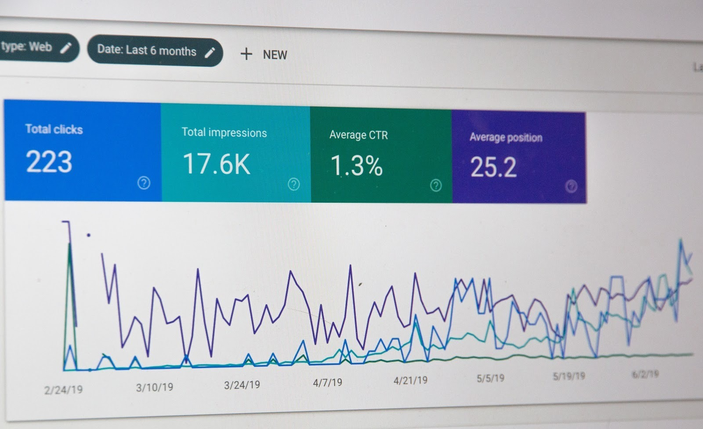

Scorecard merupakan sebuah visualisasi yang fokus pada sebuah jenis data spesifik sehingga biasanya terdiri dari 1 bentuk visualisasi saja. Visualisasinya dapat berfokus pada jumlah pendapatan, kepuasan pelanggan, dan hal lainnya yang dapat dibandingkan dengan target yang telah ditentukan. Scorecard dapat juga menggambarkan tentang salah satu Key Performance Indicators (KPI) perusahaan yang lebih disederhanakan untuk dapat memantau kemajuan progres.

## Dashboard

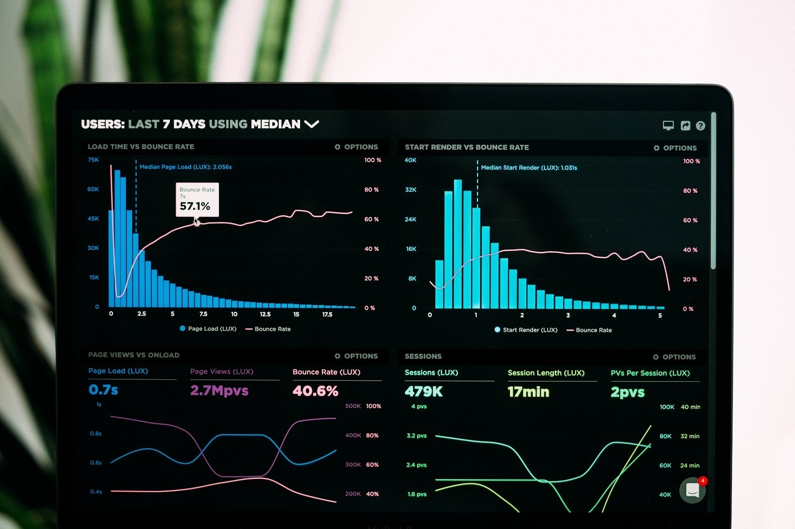

Dashboard merupakan kumpulan dari berbagai macam visualisasi yang menggabungkan dan merangkum informasi atau data bisnis. Kumpulan beberapa scorecard juga dapat disebut sebagai sebuah dashboard. Sebelum mendesain sebuah dashboard, Anda harus menentukan terlebih dahulu apa saja yang ingin diceritakan dalam dashboard itu. Saat kerangka dashboard sudah dibuat, Anda dapat mengisinya dengan berbagai visualisasi yang relevan seperti diagram garis, batang, lingkaran, dan berbagai metode visualisasi lainnya. Biasanya terdapat kombinasi empat visualisasi data yang saling berhubungan satu sama lain.

## Report

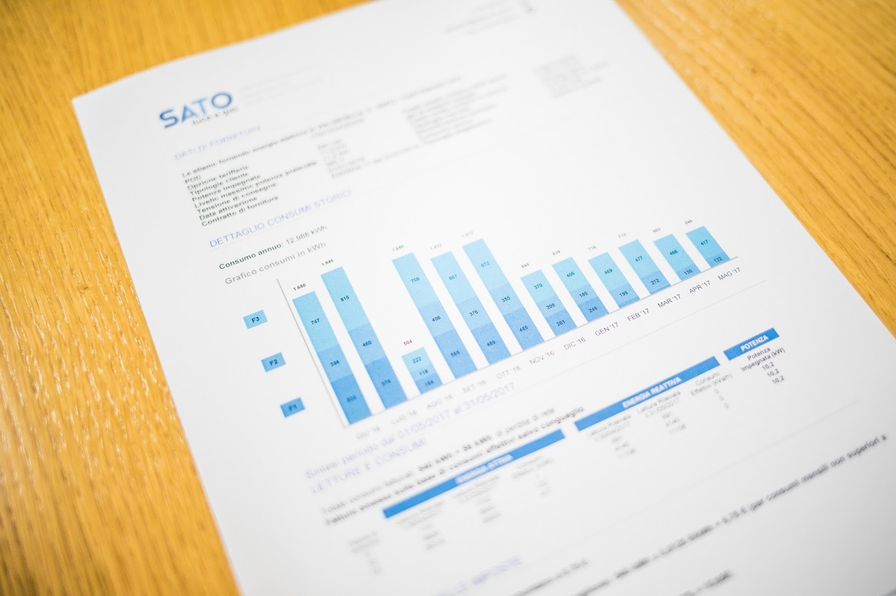

Report atau laporan merupakan suatu bentuk penyampaian berita, keterangan, pemberitahuan, ataupun pertanggungjawaban sebagai bentuk pelaksanaan komunikasi dari pihak yang satu kepada yang lainnya. Report yang baik umumnya menggunakan visualisasi data untuk membuat ringkasan dari apa yang terjadi di perusahaan dalam waktu tertentu sehingga dapat digunakan untuk memahami hal yang sedang terjadi secepat mungkin.

## Analytic Report

Analytic report adalah laporan yang berfokus pada analisis yang digunakan untuk menentukan keputusan. Jenis laporan ini menggunakan data kualitatif dan kuantitatif untuk menganalisis dan mengevaluasi ide dari suatu bisnis. Analytic report memberikan keuntungan bagi pembaca karena memberi pemahaman yang mudah dipahami. Selain itu, hanya dengan membaca sekilas saja, pembaca juga dapat memahami data dalam jumlah yang banyak. Analytic report juga menerapkan langkah-langkah umum seperti mengidentifikasi masalah, menentukan metode yang tepat, analisis data, dan mendapatkan solusi terbaik dari masalah yang dihadapi.

# Tools dalam Visualisasi Data

Dalam membuat visualisasi data, kita juga terbantu dengan perangkat lunak atau tools tertentu. Berikut tools gratis yang dapat Anda gunakan untuk mulai belajar tentang visualisasi data.

## Tableau Public

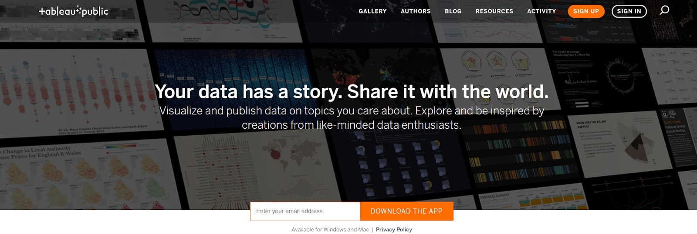

Tableau Public merupakan sebuah layanan gratis yang memungkinkan siapa saja dapat mempublikasikan visualisasi data ke dalam web. Visualisasi yang telah dipublikasikan ke Tableau Public ("vizzes") dapat diletakkan dalam halaman web dan blog, dibagikan ke sosial media, dan juga dapat diunduh oleh pengguna lainnya. Untuk proses pembuatan visualisasi datanya sendiri menggunakan aplikasi terpisah bernama Tableau Desktop Public Edition. Ingin tahu hal yang menarik dari Tableau Desktop Public ini? Ya, Anda dapat menggunakan aplikasi ini tanpa memerlukan keahlian dalam bidang pemrograman. Keren, bukan? Untuk mengunduh aplikasi Tableau Public dapat klik di sini https://public.tableau.com/app/discover, ya.

## Google Sheets

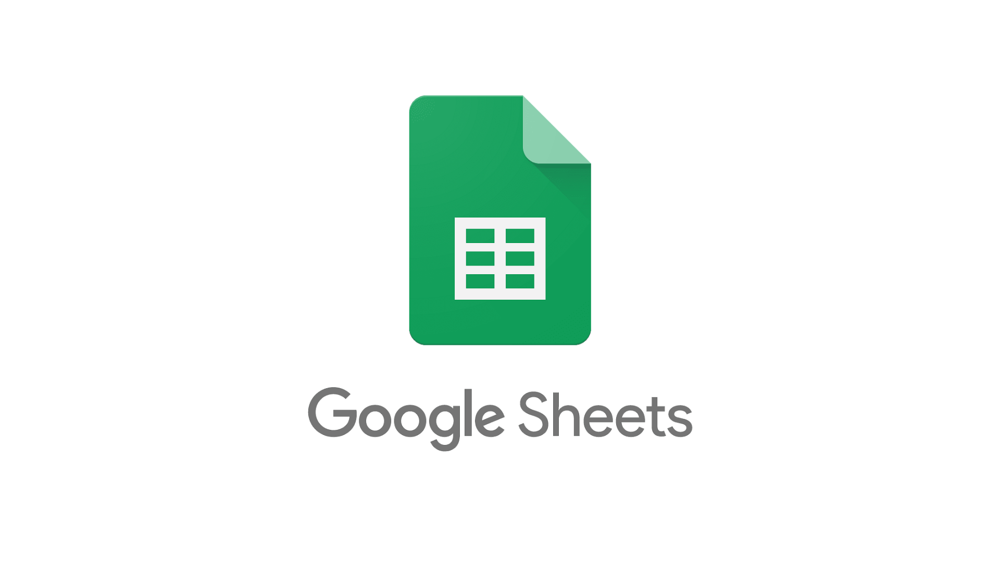

Sudah pernah menggunakan Google Sheets sebelumnya? Anda tidak harus melakukan instalasi aplikasi spreadsheet di laptop karena dalam Google Sheets semuanya tersedia online. Google Sheets menawarkan kumpulan fitur dan fungsi standar spreadsheet application seperti yang ada di Microsoft Excel. Tentunya, Google Sheets dapat membuat visualisasi sederhana dari data yang kita buat baik dalam bentuk diagram batang, diagram garis, maupun diagram lingkaran. Layanan ini tersedia gratis, tetapi Anda butuh memiliki akun Google untuk membuat file baru.

## Microsoft Excel

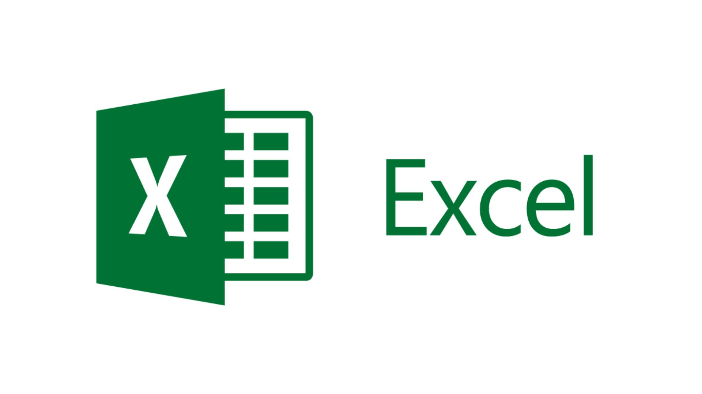

Pasti Anda familiar dengan Microsoft Excel, bukan? Sebuah aplikasi spreadsheet berbayar buatan Microsoft yang memuat banyak fitur powerful. Microsoft Excel menggunakan spreadsheet yang terdiri dari baris dan kolom untuk manajemen data serta melakukan perhitungan fungsi yang lebih akrab disebut formula. Selain melakukan perhitungan angka yang bersifat numerik, Excel juga dapat membuat visualisasi data sederhana ke dalam bentuk grafik seperti diagram garis, batang, lingkaran, dan lain-lain. Sebelum menggunakan Microsoft Excel, perlu dilakukan instalasi ke komputer atau laptop.

# Konteks Data

Data bisa dikatakan sebagai cerminan dari kehidupan nyata. Anda tahu kan bagaimana kehidupan di dunia nyata itu rumit? Begitu pula data.

Data yang banyak akan terlihat rumit dan sulit dipahami. Namun, apabila Anda menemukan konteks (makna inti) dari data tersebut, setidaknya Anda dapat menemukan sebuah cara yang tepat untuk memahaminya. Maka dari itu, apabila kita memiliki data tanpa memahami konteks, bisa saja data tersebut tidak bisa tersampaikan dengan baik.

Penting untuk mengetahui audiens (siapa yang nanti membaca data atau visualisasi) untuk menentukan bagaimana cara menyampaikan data. Selanjutnya, Anda juga harus bertanya pada diri sendiri, “Apakah mereka perlu tahu dan apakah Anda ingin mereka jadi tahu?” Hal ini harus bisa Anda jawab terlebih dahulu sebelum menyampaikan data kepada audiens. Apabila pertanyaan tersebut belum terjawab, maka bisa saja Anda malah menyampaikan hal-hal yang menurut mereka tidak perlu dan menjadi kurang relevan.

Misal, Anda tahu audiens yang hadir adalah seorang Data Analyst (seseorang yang pekerjaannya menganalisis data) dan memiliki pengalaman di bidang pengolahan data. Maka tidak mungkin Anda menyampaikan informasi kepada mereka sama halnya seperti dengan pengusaha non-IT. Dengan demikian, Anda sangat perlu menentukan gaya bahasa dalam menyampaikan informasi.

Pertanyaan penting yang juga harus ditanyakan ke diri sendiri adalah, “Bagaimana saya bisa menentukan poin penting dan membuat data tersampaikan secara efektif?” Bayangkan data Anda berupa kanvas dan Anda adalah seorang pelukis. Apa pun yang akan Anda lukis pada kanvas, itu yang akan dilihat oleh orang lain. Lantas, sebagai seorang pelukis, ada beberapa hal yang perlu dipikirkan, antara lain:

Untuk siapa lukisan ini dibuat?
Apa yang ingin dilukis?
Bagaimana cara melukiskannya?
Poin-poin pertanyaan di atas apabila dilakukan oleh seorang Data Analyst menjadi seperti berikut:

Kepada siapa data ini akan disampaikan?
Data apa yang ingin disampaikan?
Bagaimana cara menyampaikan data tersebut?

## Kepada siapa data ini akan disampaikan?

Sebelum menyampaikan sebuah data, kita harus mengetahui dulu siapa audiens yang akan kita hadapi. Hal ini penting untuk membuat proses penyampaian data lebih efektif dan bisa diterima oleh audiens. Anda harus bisa membedakan penyampaian data antara audiens umum dan yang sudah profesional (sudah ahli di bidangnya).

Apabila mayoritas berupa audiens umum, bukan berarti kita bisa menganggap semuanya masih pemula. Bisa saja di antara mereka ada salah satu audiens profesional, makanya kita harus mengambil titik tengah dalam hal penyampaian data, yaitu dengan penyampaian yang mudah dipahami, tetapi tidak mengurangi detail dari data.

Lain ceritanya jika kita membawakan data dengan audiens yang rata-rata sudah profesional. Maka harus benar-benar diperhatikan setiap detail dari data yang kita bawakan karena pasti audiens lebih kritis dalam memahami apa yang disampaikan.

## Data apa yang ingin saya sampaikan?

Supaya data relevan dengan audiens, Anda harus menyaring terlebih dahulu data yang dimiliki. Hal ini untuk membuat audiens dapat menentukan langkah seperti apa yang harus dilakukan audiens setelah mengetahui data yang disampaikan.

Misalnya, Anda diminta untuk mempresentasikan data tentang perkembangan penjualan perusahaan dalam setahun terakhir pada sebuah rapat dan audiensnya adalah tim penjualan khusus untuk produk televisi. Nah, Anda dapat mengumpulkan data yang khusus berhubungan dengan penjualan televisi, total produksi barang televisi, dan lain sebagainya. Dengan begitu, audiens yang ada dalam rapat tersebut dapat cepat mengambil keputusan apakah mereka perlu menambah atau mengurangi produksi barang.

## Bagaimana cara menyampaikan data tersebut?

Metode penyampaian juga perlu diperhatikan. Misal, terdapat kondisi di mana sebagian besar audiens tidak terbiasa dengan data dalam bentuk angka. Maka, kita dapat menggunakan metode seolah sedang bercerita dengan berdasar pada data yang kita sampaikan sehingga cara kita membawakan data tidak seperti membaca. Tugas kita sebagai presenter yang membawakan data tersebut adalah memperjelas setiap bagian dengan bumbu cerita pada beberapa elemen data yang ada.

Seabgai contoh, penjualan novel dengan judul A pada bulan Juni 2019 meningkat sebanyak 25% dibanding bulan sebelumnya. Nah, di sini Anda jangan terlalu datar dengan menyampaikan jumlah peningkatannya saja. Namun, Anda dapat bercerita tentang apa yang melatarbelakangi peningkatan tersebut. Misal kita membawakan dengan narasi sebagai berikut:

“Film A yang ditayangkan bulan Februari 2019 lalu mengundang antusias yang tinggi bagi penonton film tanah air. Bahkan, beberapa sumber mengatakan jutaan tiket bioskop ludes terjual dalam waktu sehari saja dari total keseluruhan penonton di Indonesia. Hal tersebut dikarenakan film A merupakan adaptasi dari novel yang sangat terkenal sehingga pada bulan Februari penjualan total tiket meningkat sebanyak 25% dibanding bulan sebelumnya.”

Narasi di atas akan lebih dapat dimengerti oleh audiens tersebut daripada hanya membaca angka seperti berikut:
“Penjualan total tiket bulan Januari: 900 ribu.
Penjualan total tiket bulan Februari: 1.125 juta.”

