# Pendahuluan Feature Engineering

Hi AI enthusiast!

Pada materi ini, kita akan mendalami lebih jauh mengenai proses feature engineering. Feature engineering atau rekayasa fitur adalah langkah penting dalam pengembangan model machine learning yang sukses. Andrew Ng, seorang profesor terkemuka dalam bidang kecerdasan buatan dari Stanford University dan pendiri Google Brain menekankan bahwa "Menciptakan fitur-fitur yang baik adalah pekerjaan yang sulit, memakan waktu, dan membutuhkan pengetahuan mendalam dari seorang pakar di bidang tersebut. Dalam banyak kasus, machine learning terapan pada intinya adalah proses rekayasa fitur."

Dari pernyataan tersebut dapat disimpulkan bahwa rekayasa fitur tidak hanya memakan waktu, tetapi juga membutuhkan keterampilan khusus dan pemahaman yang mendalam tentang data serta domain masalah yang sedang dihadapi. Proses ini melibatkan ekstraksi informasi penting dari data mentah, sehingga model machine learning dapat memahami pola-pola yang relevan dan memberikan hasil yang akurat. Oleh karena itu, rekayasa fitur merupakan salah satu aspek yang paling menentukan dalam kualitas model machine learning.

Dalam materi ini, Anda akan diperkenalkan dengan berbagai teknik rekayasa fitur tambahan yang akan melengkapi apa yang telah dibahas di modul sebelumnya. Tujuannya adalah untuk memperluas pengetahuan Anda tentang bagaimana cara memaksimalkan potensi data melalui rekayasa fitur yang efektif.

Sebelum menyelam lebih dalam, mari kita mulai dengan satu pertanyaan yang mungkin tebersit di benak Anda, “Apa sih feature engineering itu?”

Sederhananya, feature engineering adalah proses yang sangat penting dalam machine learning, yaitu ketika data mentah atau kotor diubah menjadi fitur-fitur yang dapat digunakan oleh model untuk melakukan prediksi. Proses ini melibatkan pemilihan, transformasi, dan penciptaan fitur-fitur yang relevan serta bermakna dari data yang tersedia. Tujuan utamanya adalah untuk memaksimalkan performa model dengan menyediakan input yang paling representatif dan informatif.


Harapannya dengan mempelajari teknik feature engineering, Anda dapat membuat sebuah model machine learning yang lebih komprehensif dan andal. Jika Anda ingat, proses feature engineering ini masih tergolong tahapan awal pada proses pembangunan model machine learning. Perhatikan kembali gambar machine learning workflow berikut.


Seperti yang sudah kita pelajari pada modul Machine Learning Workflow, tahapan feature engineering memiliki irisan dengan tahapan EDA dan pre-processing. Pada modul-modul sebelumnya, proses feature engineering ini tidak disebutkan secara eksplisit agar Anda lebih fokus terhadap pemecahan masalah dan pembuatan model machine learning. Namun, bukan berarti tahapan ini tidak ada, ya. Silakan ulas kembali modul-modul sebelumnya jika Anda penasaran terkait proses yang sudah dilalui.

Lalu, mengapa feature engineering ini menjadi satu modul tersendiri? Sekali lagi, feature engineering merupakan jantung dari pengembangan model machine learning yang andal dan optimal. Hal ini dikarenakan proses feature engineering melibatkan berbagai teknik untuk mengubah data mentah menjadi fitur-fitur yang dapat dimanfaatkan oleh model.

Dengan pendekatan yang tepat, feature engineering dapat meningkatkan performa model dan memungkinkan prediksi yang lebih akurat. Masih ingatkah Anda dengan realita bahwa data di industri tidak seindah di Kaggle (open source dataset)?


Dengan melakukan feature engineering Anda dapat menciptakan, mengubah, dan memilih fitur yang relevan sehingga dapat membantu model memahami pola dalam data dengan lebih baik, meningkatkan akurasi prediksi, dan memastikan bahwa model dapat digeneralisasikan dengan baik pada data baru. Meskipun banyak model modern memiliki kemampuan untuk mengekstraksi fitur secara otomatis, feature engineering tetap memberikan dampak yang signifikan terutama ketika pengetahuan domain dapat diterapkan dengan baik.


Dengan memproses dan mentransformasi data, Anda dapat mengurangi noise yang berpotensi mengaburkan pola penting dan meningkatkan hubungan (korelasi) yang benar-benar berharga antara setiap variabel. Proses ini juga membantu menyesuaikan data dengan algoritma yang akan digunakan sehingga model dapat bekerja lebih optimal dengan data yang telah diolah.

Mengurangi risiko overfitting juga merupakan salah satu manfaat utama dari feature engineering. Dengan melakukan pemilihan fitur yang tepat dan eliminasi fitur yang tidak relevan, dapat mencegah model menjadi terlalu kompleks. Hal ini dapat membantu dalam mengoptimalkan kinerja model agar lebih efisien sehingga memungkinkan model mencapai performa yang sangat baik dengan fitur-fitur yang tepat tanpa memerlukan komputasi yang besar (efisiensi).


Nah, sampai di sini sudah paham kan mengapa feature engineering ini penting? So, jangan memandang sebelah mata untuk tahapan ini, ya.

“In theory, theory and practice are the same. In practice, they are not.” — Albert Einstein.

Kutipan di atas menyiratkan bahwa meskipun dalam teori, segala sesuatu tampak berjalan dengan sempurna dan sesuai rencana. Kenyataannya, saat teori tersebut diterapkan dalam situasi praktis, sering kali muncul kesulitan, ketidaksesuaian, atau hal-hal tak terduga yang tidak diprediksi oleh teori.

Untuk menghindari permasalahan tersebut, mari kita melangkah menuju tahapan praktik agar Anda lebih terbiasa menangani permasalahan yang ada. Pada materi berikutnya, Anda akan memulai perjalanan panjang terkait feature engineering yang dimulai dari tahapan feature selection. Sudah tidak sabar ‘kan? Yuk, langsung berangkat. Semangat!

# Teknik Pemilihan Fitur (Feature Selection)

Teknik Pemilihan Fitur (Feature Selection) adalah proses pemilihan subset fitur yang paling relevan atau penting untuk digunakan dalam model machine learning. Tujuannya adalah untuk meningkatkan performa model dengan menghilangkan fitur yang tidak relevan, redundan, atau kotor (biasa disebut noise). Dengan demikian, kita bisa mengurangi kompleksitas model, meningkatkan akurasi, dan mempercepat proses pelatihan.

Pemilihan fitur sangat penting karena model machine learning yang dilatih dengan fitur yang tidak relevan atau terlalu banyak fitur, memungkinkan untuk mengalami masalah seperti overfitting yaitu kondisi ketika model terlalu cocok dengan data pelatihan sehingga tidak dapat melakukan generalisasi dengan baik untuk data baru. Dengan melakukan feature selection, kita dapat menghasilkan model yang lebih simpel, cepat, dan efektif.

“Ini kan sama-sama mengurangi fitur sebelum melatih model, lalu apa bedanya dengan feature extraction?”. Pertanyaan yang bagus, mari kita bahas!

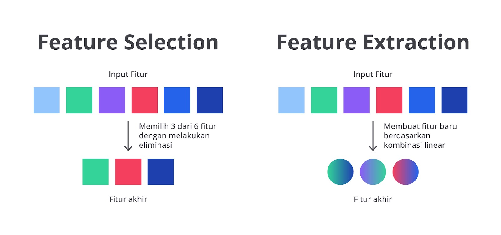

Feature selection dan feature extraction adalah dua teknik yang sering digunakan untuk mengurangi jumlah variabel dalam analisis data, tetapi dengan pendekatan yang berbeda. Pada feature extraction, pengurangan jumlah variabel dilakukan dengan menciptakan fitur baru melalui kombinasi fitur-fitur yang sudah ada.

Teknik ini menghasilkan representasi baru dari data, yang bertujuan untuk menangkap informasi penting dengan cara yang lebih ringkas. Sebagai contoh, metode seperti Principal Component Analysis (PCA) mengubah data asli menjadi beberapa komponen utama yang mewakili variasi terbesar.

Di sisi lain, feature selection mengurangi jumlah variabel dengan memilih fitur-fitur yang paling relevan dari dataset tanpa memodifikasinya. Metode ini tidak menciptakan fitur baru, melainkan menyaring fitur-fitur yang ada untuk mempertahankan yang paling relevan. Sampai di sini pastinya Anda sudah paham perbedaan feature extraction dan feature selection, ‘kan?

Nah, feature selection ini juga terbagi menjadi dua subset utama yaitu unsupervised feature selection dan supervised feature selection. Namun, Perlu Anda catat bahwa metode ini berbeda dengan unsupervised learning ataupun supervised learning yang ada sudah Anda pelajari pada modul-modul sebelumnya.

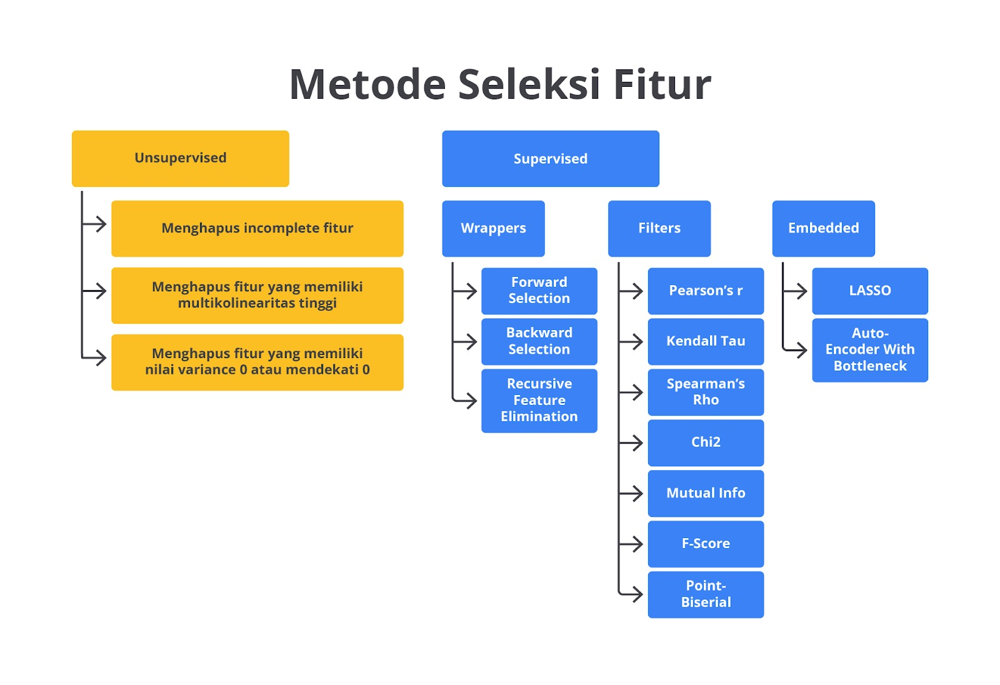

Unsupervised feature selection adalah proses memilih fitur dari dataset tanpa menggunakan label atau informasi target (output). Metode ini berbeda dengan supervised feature selection karena fiturnya dipilih berdasarkan hubungannya dengan variabel target yang sudah diketahui.

Tujuan utama dari unsupervised feature selection adalah mengurangi dimensionalitas data dengan mengidentifikasi fitur-fitur yang paling relevan atau signifikan untuk meningkatkan efisiensi algoritma machine learning dan mempermudah visualisasi data tanpa menghiraukan label target.

Beberapa pendekatan umum yang digunakan dalam unsupervised feature selection meliputi teknik-teknik berikut.

1. Drop Incomplete Features: fitur yang "incomplete" atau tidak lengkap mengacu pada kolom dalam dataset yang memiliki banyak missing values (nilai yang hilang). Fitur-fitur ini sering kali dianggap tidak informatif atau bahkan dapat merusak performa model machine learning jika tidak ditangani dengan benar. Meskipun menghapus fitur yang tidak lengkap bukanlah cara yang baik untuk menangani data yang hilang, hal ini acapkali menjadi pilihan tercepat. Selain itu, jika terlalu banyak data yang hilang, teknik ini masuk akal untuk dilakukan karena fitur-fitur seperti itu kemungkinan besar tidak penting.
2. Drop Features with High Multicollinearity: multicollinearity adalah kondisi ketika dua atau lebih fitur dalam dataset sangat berkorelasi satu sama lain. Hal ini bisa menyebabkan masalah dalam model regresi atau model lain yang sensitif terhadap hubungan linear antara fitur seperti regresi linear atau logistik. Ketika fitur-fitur ini terlalu berkorelasi, mereka memberikan informasi yang redundan (berlebihan) sehingga dapat menyebabkan model menjadi tidak stabil atau sulit untuk diinterpretasikan.
3. Drop Features with (Near-)Zero Variance: fitur dengan variansi yang sangat rendah atau mendekati nol merupakan fitur yang nilai-nilainya hampir tidak berubah di seluruh dataset. Dengan kata lain, fitur ini tidak memiliki banyak variasi dan tidak memberikan banyak informasi yang berguna untuk model.
4. Variance Thresholding: fitur-fitur dengan variansi yang sangat rendah dapat diabaikan karena tidak memberikan banyak informasi baru.
5. Principal Component Analysis (PCA): meskipun PCA secara teknis bukan metode seleksi fitur, ini sering digunakan untuk mengurangi dimensionalitas dengan mentransformasi fitur ke dalam komponen utama yang lebih sedikit. Namun, tetap merepresentasikan variasi terbesar dalam data.
6. Clustering-based Methods: fitur-fitur yang secara bersama-sama membentuk kelompok (klaster) dalam data dapat dipilih sebagai fitur representatif berdasarkan clustering seperti k-means.
7. Correlation-based Selection: fitur-fitur yang sangat berkorelasi satu sama lain dapat direduksi menjadi satu fitur untuk mengurangi redundansi.

Dengan pendekatan unsupervised feature selection, kita bisa mengidentifikasi fitur yang memberikan informasi penting dalam data tanpa perlu mengetahui hasil akhir atau label klasifikasi.

Lalu, apa kabar dengan supervised feature selection? Seperti yang sudah dijelaskan di atas,

Supervised feature selection adalah proses memilih fitur yang paling relevan dari dataset dengan memanfaatkan informasi dari label atau target variabel. Hal ini berarti pemilihan fitur dilakukan dengan memperhatikan hubungan antara setiap fitur dan variabel target.

Tujuannya adalah untuk meningkatkan performa model machine learning dengan menghilangkan fitur yang tidak relevan, redundan, atau bahkan merugikan karena tidak memiliki hubungan sama sekali dengan fitur target.

Secara umum supervised feature selection terbagi menjadi tiga teknik, yaitu filter, wrapper, dan embedded.

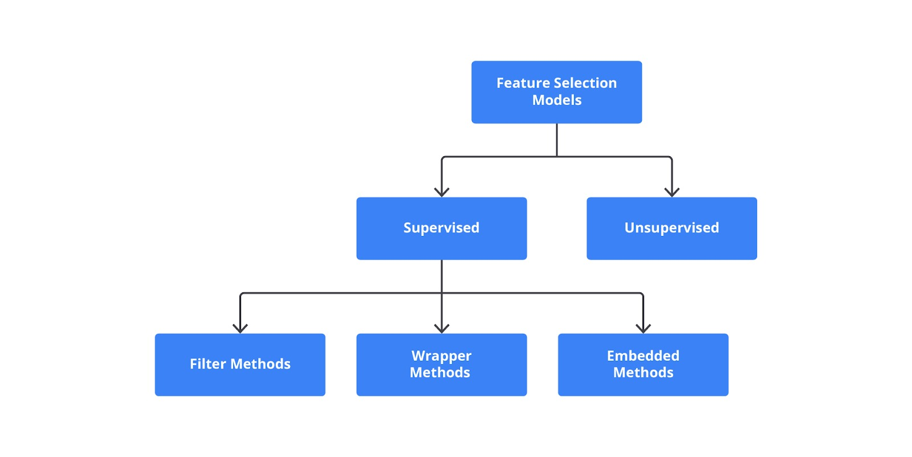

Metode di atas akan membantu mengidentifikasi fitur yang paling relevan untuk model sehingga dapat meningkatkan kinerja, mengurangi kompleksitas, dan mempercepat waktu pelatihan.

Sambil menyelam minum air, sembari mempelajari maksud dari masing-masing metode tersebut, alangkah baiknya Anda juga memahami implementasinya. Namun, sebelum berangkat, mari kita persiapkan amunisinya terlebih dahulu dengan mengimpor library yang akan digunakan.

```bash
import numpy as np
import pandas as pd
from sklearn.datasets import load_iris
from sklearn.feature_selection import SelectKBest, chi2
from sklearn.feature_selection import RFE
from sklearn.linear_model import LogisticRegression
from sklearn.ensemble import RandomForestClassifier
from sklearn.model_selection import train_test_split
from sklearn.preprocessing import StandardScaler
from sklearn.datasets import load_wine
```

Selanjutnya, Anda perlu memilih dataset yang akan digunakan. Pada kasus ini, kita akan menggunakan dataset load_wine() dari Scikit.

```bash
# Memuat dataset Wine Quality
data = load_wine()
X, y = data.data, data.target
```

Untuk memudahkan interpretasi mari kita ubah dataset tersebut menjadi sebuah DataFrame.

```bash
# Mengubah menjadi DataFrame untuk analisis yang lebih mudah
df = pd.DataFrame(X, columns=data.feature_names)
df['target'] = y
df
```

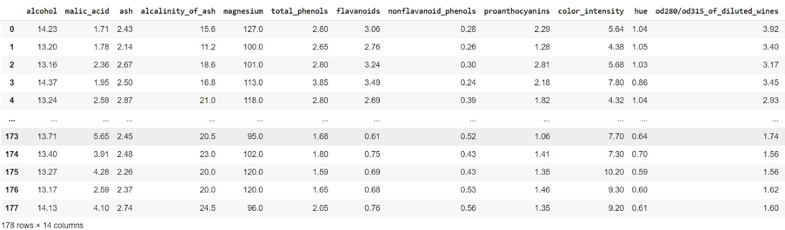

Dataset ini memiliki 178 baris dan 13 kolom fitur independen serta satu kolom dependen (target). Masih ingatkah tahapan terakhir persiapan data sebelum melatih model? Yup! Anda perlu membagi dataset menjadi data latih dan data uji. Pada kasus ini, kita akan membagi ukuran dataset menjadi 80% data uji dan 20% data latih. Silakan eksplorasi mandiri untuk proporsi lainnya ya.

```bash
# Pembagian data
X_train, X_test, y_train, y_test = train_test_split(X, y, test_size=0.2, random_state=42)
```

Backpack sudah penuh dan persiapan sudah lengkap. Sekarang, mari kita bahas satu per satu metode feature selection agar lebih jelas.

## Filter Methods

Filter methods adalah teknik untuk menilai relevansi fitur secara independen dari model yang akan digunakan. Metode ini menggunakan statistik untuk memilih fitur tanpa melibatkan algoritma machine learning. Hal ini membuat proses pemilihan fitur dengan lebih cepat dan efisien, terutama untuk dataset besar.

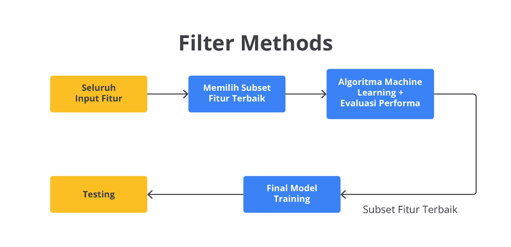

Metode ini akan menilai relevansi fitur secara independen dari model yang akan digunakan kelak. Pada dasarnya filter methods menggunakan statistik untuk memilih fitur tanpa melibatkan algoritma machine learning sehingga membuatnya lebih cepat dan efisien dalam memproses dataset khususnya untuk dataset dengan ukuran yang besar. Contohnya termasuk penggunaan korelasi untuk menghitung hubungan antara setiap fitur dan label target, serta chi-square untuk menguji independensi antara fitur dan label.

Selain itu, teknik mutual information dapat digunakan untuk mengukur ketergantungan antara fitur dan label. Eitss, tidak sampai di situ, metode ini juga dapat menghitung variance threshold dengan memilih fitur yang memiliki varians lebih tinggi dari ambang tertentu lalu mengeliminasi fitur dengan informasi rendah.

Metode ini memiliki beberapa kekurangan dan kelebihan seperti berikut.

Kekurangan

Karena beroperasi secara independen, filter methods mungkin melewatkan interaksi data yang mungkin penting untuk prediksi.

Anda perlu melakukan perhitungan metriks yang tepat dan sesuai dengan algoritma yang akan digunakan. Hal ini karena memilih metrik yang sesuai untuk data dan tugas Anda sangat penting untuk kinerja yang optimal.

Kelebihan

Metode filter tidak membutuhkan daya komputasi yang besar sehingga ideal untuk set data yang besar dengan kondisi keterbatasan hardware.

Metode-metode ini sering kali sudah ada di dalam library machine learning yang populer sehingga akan mempermudah pekerjaan Anda sebagai machine learning engineer.

Metode filter dapat digunakan dengan semua jenis model machine learning sehingga Anda tidak perlu takut salah. Namun, hal ini bukan berarti Anda dapat melakukan konsep All in One Methods, ya.

Setelah mengetahui konsep dasarnya, mari kita coba implementasikan filter methods pada dataset yang telah disiapkan sebelumnya menggunakan kode berikut.

```bash
# ------------------- Filter Methods -------------------
# Menggunakan SelectKBest
filter_selector = SelectKBest(score_func=chi2, k=2)  # Memilih 2 fitur terbaik
X_train_filter = filter_selector.fit_transform(X_train, y_train)
X_test_filter = filter_selector.transform(X_test)

print("Fitur yang dipilih dengan Filter Methods:", filter_selector.get_support(indices=True))
```

Kode di atas akan mencari fitur terbaik berdasarkan nilai yang sudah ditentukan, agar lebih jelas mari kita bahas lebih detail.

SelectKBest
SelectKBest adalah salah satu metode dari filter methods yang umum digunakan untuk memilih fitur terbaik berdasarkan skor statistik tertentu.

Parameter score_func=chi2 berarti metode ini menggunakan Chi-squared (χ²) sebagai fungsi skor. Chi-squared adalah metode uji statistik yang digunakan untuk mengukur independensi antara dua variabel kategorikal.

Parameter k=2 artinya kita hanya akan memilih 2 fitur terbaik dari semua fitur yang ada di dataset. Dengan kata lain, ini akan menyeleksi dua fitur dengan skor tertinggi berdasarkan hasil uji Chi-squared.

        Kedua parameter ini bisa Anda sesuaikan dengan studi kasus dan trial and error ya.

fit_transform(X_train, y_train)

fit(X_train, y_train) merupakan metode yang akan menghitung skor Chi-squared untuk setiap fitur pada data pelatihan (X_train) terhadap target (y_train).

transform(X_train) merupakan fungsi yang bertugas untuk menyalin data dari X_train, tetapi pada kasus ini hanya memiliki fitur yang tersimpan pada filter_selector.

Hasilnya adalah sebuah dataset pelatihan baru (X_train_filter) yang hanya mengandung dua fitur terbaik hasil perhitungan Chi-squared.

transform(X_test)
Fungsi transform(X_test) digunakan untuk mentransformasikan dataset uji (X_test) dengan memilih fitur yang sama yang dipilih dari dataset pelatihan.

get_support(indices=True)

Fungsi get_support(indices=True) digunakan untuk mendapatkan indeks dari fitur-fitur yang dipilih. Dalam hal ini, fitur yang dipilih adalah dua fitur dengan skor tertinggi berdasarkan uji Chi-squared.

Fungsi ini akan mencetak indeks fitur yang dipilih dari dataset awal yang bisa digunakan untuk memahami fitur mana yang dipertahankan setelah proses seleksi. Sehingga, output akhir dari kode ini merupakan dataset yang sudah difilter dan informasi angka indeks dari fitur yang dipilih.

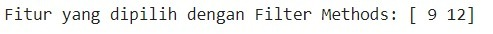

Sampai di sini, Anda sudah memiliki sebuah dataset yang terdiri dari dua buah fitur dengan skor independensi paling besar. Tahan sejenak rasa ingin tahu Anda, karena pada akhir materi ini kita akan membandingkan performa dari ketiga metode feature selection.

## Wrapper Methods

Wrapper methods bertugas untuk mengevaluasi subset fitur berdasarkan kinerja model machine learning. Metode ini lebih berat secara komputasional tetapi sering kali memberikan hasil yang lebih baik karena mempertimbangkan interaksi antara fitur.

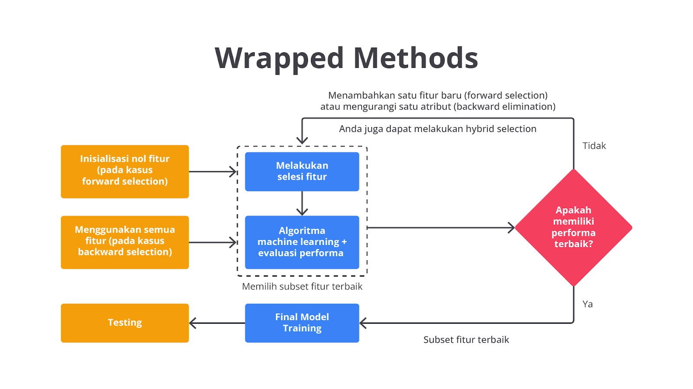

Seperti yang dapat Anda lihat pada gambar di atas, metode ini akan mengevaluasi subset fitur berdasarkan kinerja model machine learning yang dipilih. Metode ini secara iteratif akan menambah atau menghapus fitur dengan tujuan untuk menemukan kombinasi yang menghasilkan kinerja model terbaik. Dalam penggunaannya Anda dapat menggunakan beberapa teknik untuk memaksimalkan proses feature selection.

Salah satu teknik yang umum digunakan pada metode ini adalah Recursive Feature Elimination (RFE) di mana proses iteratif akan menghapus fitur yang kurang penting dengan membangun model secara berulang. Metode lain yaitu forward selection dan backward elimination yang berfokus pada penambahan atau penghapusan fitur berdasarkan performa model dengan melakukan evaluasi menggunakan teknik cross-validation. Last but not least, untuk dataset kecil, exhaustive feature selection dapat dilakukan meskipun metode ini berat secara komputasional karena mencakup semua kombinasi fitur.

Metode ini memiliki beberapa kekurangan dan kelebihan seperti berikut.

Kekurangan

Mengevaluasi kombinasi fitur yang berbeda dapat memakan waktu dan sumber daya yang besar terutama untuk data dengan ukuran besar.

Menyesuaikan fitur pada model tertentu dapat menyebabkan model overfitting yaitu model yang memiliki kinerja buruk pada data yang yang belum pernah dilihat.

Kelebihan

Wrapper methods secara langsung mempertimbangkan bagaimana fitur memengaruhi model sehingga berpotensi menghasilkan performa yang lebih baik dibandingkan dengan metode filter.

Metode-metode ini dapat diadaptasi ke berbagai jenis model dan metriks evaluasi.

Setelah memahami konsep wrapper mari kita coba implementasikan method ini pada dataset yang telah disiapkan sebelumnya menggunakan kode berikut.

```bash
# Menggunakan RFE (Recursive Feature Elimination)
model = LogisticRegression(solver='lbfgs', max_iter=5000)
rfe_selector = RFE(model, n_features_to_select=2)  # Memilih 2 fitur
X_train_rfe = rfe_selector.fit_transform(X_train, y_train)
X_test_rfe = rfe_selector.transform(X_test)

print("Fitur yang dipilih dengan Wrapper Methods:", rfe_selector.get_support(indices=True))
```

Mirip dengan filter methods pada materi sebelumnya, kode di atas akan mencari dua buah fitur yang paling relevan berdasarkan perhitungan Recursive Feature Elimination. Namun, metode ini menghasilkan indeks fitur yang berbeda jika kita bandingkan dengan filter methods.

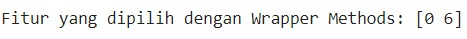

Mengapa hal ini bisa terjadi? Tenang saja ini merupakan hal yang wajar, perbedaan ini disebabkan kedua metode ini menggunakan perhitungan matematis yang berbeda. Chi2 akan mengukur hubungan antara fitur dan target secara independen tanpa menggunakan model pembelajaran mesin dan tidak mempertimbangkan interaksi antar fitur. Lalu, RFE akan menghitung menggunakan model machine learning dan secara iteratif memilih fitur terbaik.

## Embedded Methods

Terakhir Embedded methods menggabungkan pemilihan fitur dengan pelatihan model. Metode mengambil pendekatan “why not both?” sehingga memasukkan pemilihan fitur secara langsung ke dalam proses pelatihan model. Hal ini memungkinkan model untuk mempelajari hubungan antara fitur dan variabel target bersamaan dengan memilih fitur mana yang paling relevan dengan target.

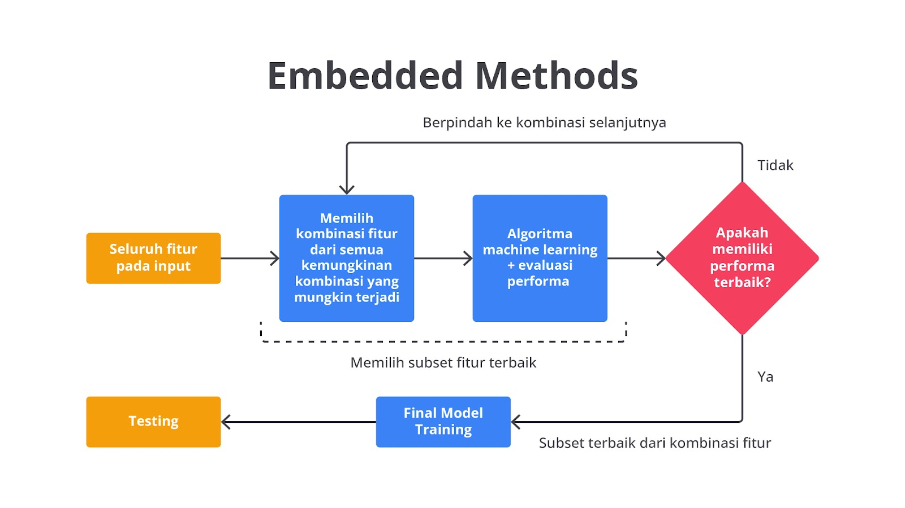

Metode ini melakukan pemilihan fitur saat model dibangun yang memberikan kelebihan dalam hal efisiensi dan efektivitas. Contohnya adalah dengan menggunakan teknik regularisasi seperti Lasso Regression (L1 Regularization) yang menggunakan penalti untuk mengatur bobot fitur menjadi nol, sehingga secara otomatis memilih fitur yang paling penting. Perhitungan yang dilakukan mirip dengan lasso regression pada modul Supervised Learning - Regresi. Jika, Anda ingin bernostalgia dengan rumus matematikanya, silakan ulas kembali materinya, ya.

Selain teknik regularisasi, metode ini juga dapat menggunakan teknik Tree-Based. Tree-Based Methods adalah teknik dalam machine learning yang menggunakan struktur pohon untuk membuat keputusan dan memprediksi hasil.

Metode ini memiliki beberapa kekurangan dan kelebihan seperti berikut.

Kekurangan

Metode embedded dapat lebih sulit untuk diinterpretasikan dibandingkan dengan metode filter sehingga lebih sulit untuk memahami mengapa fitur tertentu dipilih.

Tidak semua algoritma machine learning menerima hasil dari metode embedded.

Kelebihan

Mirip dengan wrapper methods, teknik ini memanfaatkan proses pembelajaran untuk mengidentifikasi fitur yang relevan sehingga dapat memberikan hasil yang lebih baik.

Terakhir setelah menamatkan konsep embedded, mari kita coba implementasikan method ini pada dataset yang telah disiapkan sebelumnya menggunakan kode berikut.

```bash
# ------------------- Embedded Methods -------------------
# Menggunakan Random Forest untuk mendapatkan fitur penting
rf_model = RandomForestClassifier(n_estimators=100, random_state=42)
rf_model.fit(X_train, y_train)

# Mendapatkan fitur penting
importances = rf_model.feature_importances_
indices = np.argsort(importances)[::-1]

# Menentukan ambang batas untuk fitur penting
threshold = 0.05  # Misalnya, ambang batas 5%
important_features_indices = [i for i in range(len(importances)) if importances[i] >= threshold]

# Memindahkan fitur penting ke variabel baru
X_important = X_train[:, important_features_indices]  # Hanya fitur penting dari data pelatihan
X_test_important = X_test[:, important_features_indices]  # Hanya fitur penting dari data pengujian

# Mencetak fitur yang dipilih
print("Fitur yang dipilih dengan Embedded Methods (di atas ambang batas):")
for i in important_features_indices:
    print(f"{data.feature_names[i]}: {importances[i]}")

# X_important sekarang berisi hanya fitur penting
print("\nDimensi data pelatihan dengan fitur penting:", X_important.shape)
print("Dimensi data pengujian dengan fitur penting:", X_test_important.shape)
```

Secara garis besar, kode di atas akan menjalankan beberapa langkah hingga akhirnya mendapatkan fitur yang paling relevan menurut perhitungannya.

Pertama, kode di atas menggunakan algoritma Random Forest dari scikit-learn untuk melatih model klasifikasi. Algoritma Random Forest dipilih karena secara otomatis dapat menghitung kepentingan fitur selama proses pelatihan dijalankan. Pada kasus ini, model dilatih menggunakan data pelatihan (X_train dan y_train) dengan parameter n_estimators=100, yang berarti model akan membangun 100 pohon keputusan secara paralel. Selain itu, kode ini juga mengatur random_state=42 untuk memastikan hasil yang konsisten di setiap kali menjalankan kode.

Setelah model dilatih, Anda bisa mendapatkan informasi tentang peran fitur menggunakan atribut feature*importances*. Nilai ini menunjukkan seberapa penting setiap fitur dalam membantu model membuat keputusan (pada kasus ini klasifikasi). Fitur dengan nilai feature_importance yang lebih tinggi memiliki pengaruh yang lebih besar terhadap prediksi model.

Untuk menampilkan fitur terpenting, nilai feature_importance perlu diurutkan dari yang tertinggi ke terendah menggunakan np.argsort(importances)[::-1] sehingga Anda akan mendapatkan indeks fitur berdasarkan urutan kontribusinya.

Selanjutnya, Anda perlu menetapkan ambang batas (threshold). Pada kasus ini, kita sepakat menentukan nilai sebesar 0.05 yang artinya kita hanya akan mempertahankan fitur yang memiliki nilai kepentingan di atas 5%. Bagaimana caranya memilih fiturnya? Tugas ini akan dieksekusi oleh baris kode [i for i in range(len(importances)) if importances[i] >= threshold] yang bertugas untuk memilih indeks fitur yang memenuhi kriteria tersebut.

Setelah fitur-fitur penting dipilih, Anda perlu memindahkan data yang berisikan fitur yang dianggap penting ke dalam variabel baru. X_important adalah versi dari X_train yang hanya berisi fitur-fitur yang dianggap penting, dan hal yang sama dilakukan untuk data pengujian (X_test_important).

Kode di atas juga mencetak daftar fitur yang dipilih beserta nilai kontribusinya sehingga kita bisa melihat fitur mana saja yang dianggap signifikan oleh model Random Forest. Terakhir, kode akan mencetak dimensi dari data pelatihan dan pengujian setelah seleksi fitur dengan tujuan memberikan gambaran tentang seberapa banyak fitur yang telah disaring.

Sehingga, hasil akhir dari kode di atas kurang lebih seperti berikut.

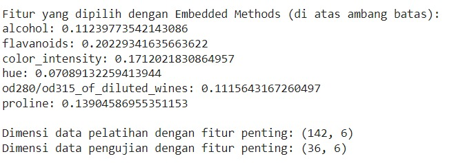

Nah, sampai di sini Anda sudah mengetahui konsep beserta contoh penerapannya pada studi kasus sederhana. Namun, seperti terasa ada yang kurang ya? Benar, sampai di sini semuanya belum terasa jelas karena tidak ada perbandingan dari masing-masing metode terkait evaluasi performanya. Oleh karena itu, mari kita bahas performa ketiganya agar lebih terbayang.

Karena kita akan melakukan proses evaluasi sebanyak tiga kali, alangkah baiknya membuat sebuah fungsi agar dapat digunakan berulang kali.

```bash
# Evaluasi dengan fitur terpilih dari masing-masing metode
def evaluate_model(X_train, X_test, y_train, y_test, model):
    model.fit(X_train, y_train)
    accuracy = model.score(X_test, y_test)
    return accuracy
```

Kode di atas merupakan sebuah fungsi yang akan melakukan pelatihan dan mendapatkan metriks evaluasi (accuracy) seperti yang sudah Anda biasa lakukan pada modul-modul sebelumnya, tetapi dibungkus pada sebuah fungsi.

Selanjutnya, mari kita latih model machine learning berdasarkan fitur yang telah ditentukan oleh masing-masing metode feature selection menggunakan kode berikut.

```bash
# Model Logistic Regression untuk Filter Methods
logistic_model_filter = LogisticRegression(max_iter=200)
accuracy_filter = evaluate_model(X_train_filter, X_test_filter, y_train, y_test, logistic_model_filter)

# Model Logistic Regression untuk Wrapper Methods
logistic_model_rfe = LogisticRegression(max_iter=200)
accuracy_rfe = evaluate_model(X_train_rfe, X_test_rfe, y_train, y_test, logistic_model_rfe)

# Model Random Forest untuk Embedded Methods
accuracy_rf = evaluate_model(X_important, X_test_important, y_train, y_test, rf_model)
```

Untuk melihat performa ketiga model tersebut Anda dapat menggunakan perintah print() sederhana atau menambahkan teks agar mempermudah pemahaman pembaca seperti berikut.

```bash
print(f"\nAkurasi Model dengan Filter Methods: {accuracy_filter:.2f}")
print(f"Akurasi Model dengan Wrapper Methods: {accuracy_rfe:.2f}")
print(f"Akurasi Model dengan Embedded Methods: {accuracy_rf:.2f}")
```

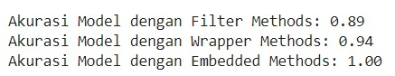

Seperti yang dapat Anda lihat masing-masing metode memiliki performa yang berbeda. Hal ini karena penggunaan fitur yang berbeda pada proses pelatihan model machine learning. Karena embedded methods memiliki akurasi sempurna, mungkin Anda berpikir “Ya sudah aku pakai embedded methods saja untuk semua kasus.” Eiitss, tidak semudah itu kawan, meskipun embedded methods bisa digunakan dalam berbagai skenario, tetapi tidak semua masalah cocok menggunakan metode ini. Ada beberapa hal yang menjadi pertimbangan ketika Anda akan melakukan feature selection.

Jenis Model: tidak semua algoritma mendukung embedded methods, contohnya linear regression standar atau k-nearest neighbors (KNN) karena algoritma tersebut tidak memiliki mekanisme bawaan untuk memilih fitur. Untuk model-model tersebut, Anda perlu menggunakan feature selection secara independen (seperti filter atau wrapper methods).
Ukuran dan Kompleksitas Data: jika data sangat besar atau kompleks, embedded feature selection bisa memakan waktu dan sumber daya komputasi yang lebih besar. Dalam beberapa kasus, menggunakan teknik lain seperti filter methods untuk mereduksi dimensi data di awal bisa lebih efisien.
Kebutuhan Interpretabilitas: beberapa model dengan embedded feature selection (misalnya, Random Forest) bisa menghasilkan model yang sulit diinterpretasi. Jika interpretabilitas sangat penting, gunakan teknik lain yang lebih sesuai.
Tipe Fitur: jika fitur yang ada memiliki tipe yang sangat berbeda-beda misalnya numerik dan kategorikal, embedded feature selection dalam model tertentu mungkin tidak bekerja dengan baik.
Jadi semua metode di atas memiliki kelebihannya masing-masing, ketika kelak Anda menggunakan data yang lebih kompleks serta fitur yang lebih banyak, belum tentu embedded methods menjadi pilihan terbaik. Karena pada dasarnya, pembangunan machine learning tidak hanya bergantung kepada performa, tetapi juga efisiensi biaya dan optimisasi bisnis. So, jangan lupa untuk berlatih dan mempertajam kemampuan Anda, ya!

