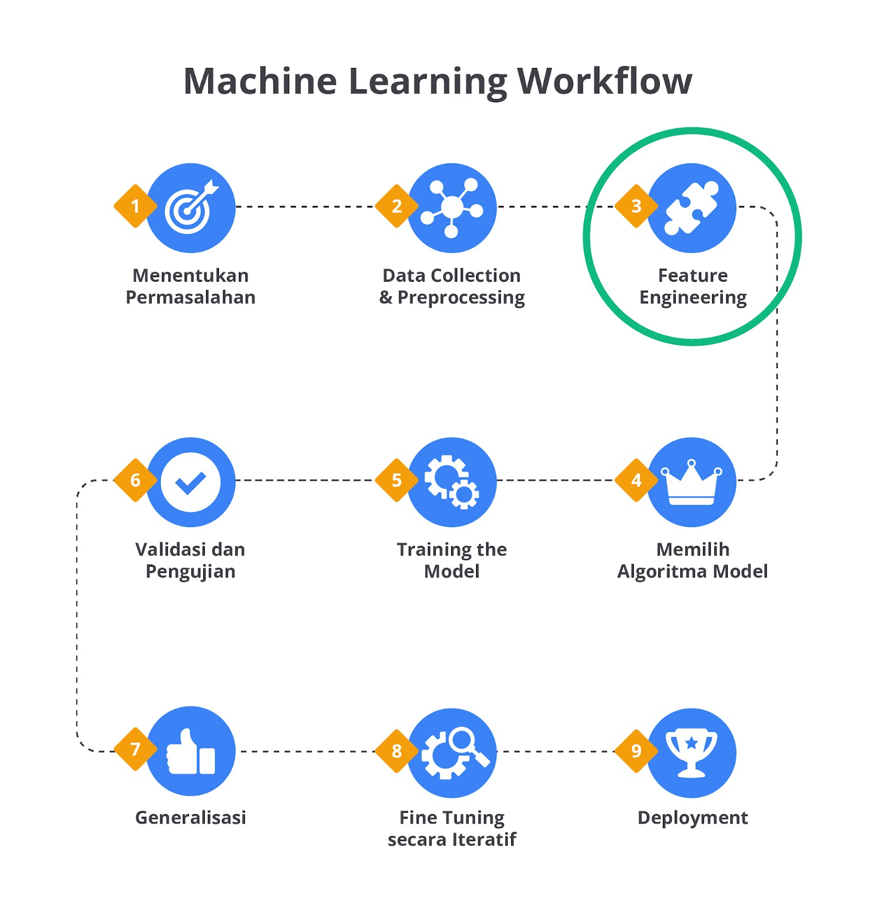
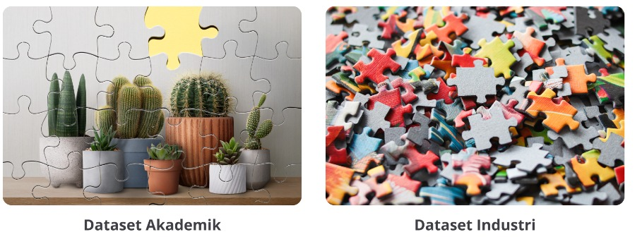
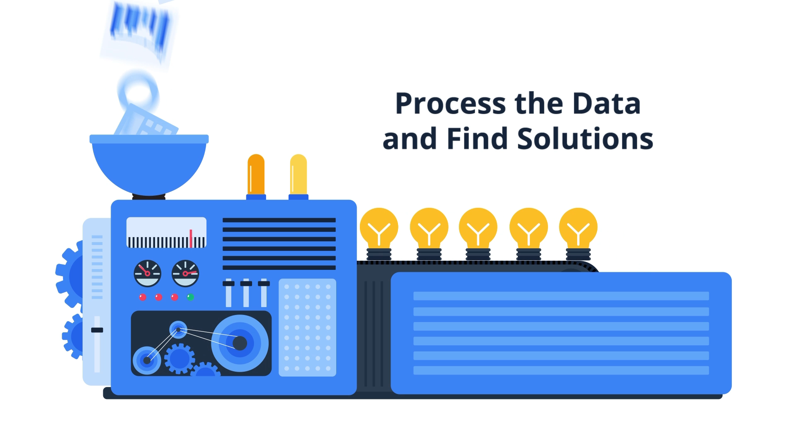
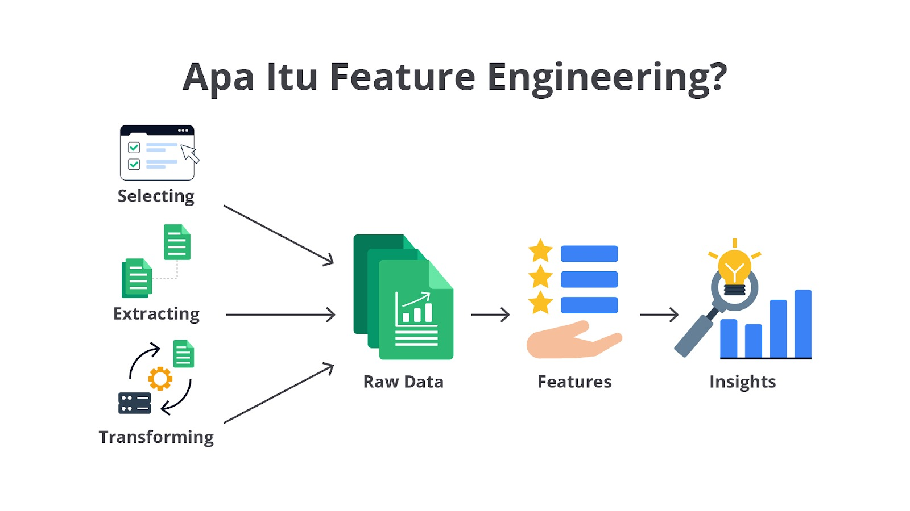

# Pendahuluan Feature Engineering

Hi AI enthusiast!

Pada materi ini, kita akan mendalami lebih jauh mengenai proses feature engineering. Feature engineering atau rekayasa fitur adalah langkah penting dalam pengembangan model machine learning yang sukses. Andrew Ng, seorang profesor terkemuka dalam bidang kecerdasan buatan dari Stanford University dan pendiri Google Brain menekankan bahwa "Menciptakan fitur-fitur yang baik adalah pekerjaan yang sulit, memakan waktu, dan membutuhkan pengetahuan mendalam dari seorang pakar di bidang tersebut. Dalam banyak kasus, machine learning terapan pada intinya adalah proses rekayasa fitur."

Dari pernyataan tersebut dapat disimpulkan bahwa rekayasa fitur tidak hanya memakan waktu, tetapi juga membutuhkan keterampilan khusus dan pemahaman yang mendalam tentang data serta domain masalah yang sedang dihadapi. Proses ini melibatkan ekstraksi informasi penting dari data mentah, sehingga model machine learning dapat memahami pola-pola yang relevan dan memberikan hasil yang akurat. Oleh karena itu, rekayasa fitur merupakan salah satu aspek yang paling menentukan dalam kualitas model machine learning.

Dalam materi ini, Anda akan diperkenalkan dengan berbagai teknik rekayasa fitur tambahan yang akan melengkapi apa yang telah dibahas di modul sebelumnya. Tujuannya adalah untuk memperluas pengetahuan Anda tentang bagaimana cara memaksimalkan potensi data melalui rekayasa fitur yang efektif.

Sebelum menyelam lebih dalam, mari kita mulai dengan satu pertanyaan yang mungkin tebersit di benak Anda, “Apa sih feature engineering itu?”

Sederhananya, feature engineering adalah proses yang sangat penting dalam machine learning, yaitu ketika data mentah atau kotor diubah menjadi fitur-fitur yang dapat digunakan oleh model untuk melakukan prediksi. Proses ini melibatkan pemilihan, transformasi, dan penciptaan fitur-fitur yang relevan serta bermakna dari data yang tersedia. Tujuan utamanya adalah untuk memaksimalkan performa model dengan menyediakan input yang paling representatif dan informatif.

Harapannya dengan mempelajari teknik feature engineering, Anda dapat membuat sebuah model machine learning yang lebih komprehensif dan andal. Jika Anda ingat, proses feature engineering ini masih tergolong tahapan awal pada proses pembangunan model machine learning. Perhatikan kembali gambar machine learning workflow berikut.

Seperti yang sudah kita pelajari pada modul Machine Learning Workflow, tahapan feature engineering memiliki irisan dengan tahapan EDA dan pre-processing. Pada modul-modul sebelumnya, proses feature engineering ini tidak disebutkan secara eksplisit agar Anda lebih fokus terhadap pemecahan masalah dan pembuatan model machine learning. Namun, bukan berarti tahapan ini tidak ada, ya. Silakan ulas kembali modul-modul sebelumnya jika Anda penasaran terkait proses yang sudah dilalui.

Lalu, mengapa feature engineering ini menjadi satu modul tersendiri? Sekali lagi, feature engineering merupakan jantung dari pengembangan model machine learning yang andal dan optimal. Hal ini dikarenakan proses feature engineering melibatkan berbagai teknik untuk mengubah data mentah menjadi fitur-fitur yang dapat dimanfaatkan oleh model.

Dengan pendekatan yang tepat, feature engineering dapat meningkatkan performa model dan memungkinkan prediksi yang lebih akurat. Masih ingatkah Anda dengan realita bahwa data di industri tidak seindah di Kaggle (open source dataset)?

Dengan melakukan feature engineering Anda dapat menciptakan, mengubah, dan memilih fitur yang relevan sehingga dapat membantu model memahami pola dalam data dengan lebih baik, meningkatkan akurasi prediksi, dan memastikan bahwa model dapat digeneralisasikan dengan baik pada data baru. Meskipun banyak model modern memiliki kemampuan untuk mengekstraksi fitur secara otomatis, feature engineering tetap memberikan dampak yang signifikan terutama ketika pengetahuan domain dapat diterapkan dengan baik.

Dengan memproses dan mentransformasi data, Anda dapat mengurangi noise yang berpotensi mengaburkan pola penting dan meningkatkan hubungan (korelasi) yang benar-benar berharga antara setiap variabel. Proses ini juga membantu menyesuaikan data dengan algoritma yang akan digunakan sehingga model dapat bekerja lebih optimal dengan data yang telah diolah.

Mengurangi risiko overfitting juga merupakan salah satu manfaat utama dari feature engineering. Dengan melakukan pemilihan fitur yang tepat dan eliminasi fitur yang tidak relevan, dapat mencegah model menjadi terlalu kompleks. Hal ini dapat membantu dalam mengoptimalkan kinerja model agar lebih efisien sehingga memungkinkan model mencapai performa yang sangat baik dengan fitur-fitur yang tepat tanpa memerlukan komputasi yang besar (efisiensi).

Nah, sampai di sini sudah paham kan mengapa feature engineering ini penting? So, jangan memandang sebelah mata untuk tahapan ini, ya.

“In theory, theory and practice are the same. In practice, they are not.” — Albert Einstein.

Kutipan di atas menyiratkan bahwa meskipun dalam teori, segala sesuatu tampak berjalan dengan sempurna dan sesuai rencana. Kenyataannya, saat teori tersebut diterapkan dalam situasi praktis, sering kali muncul kesulitan, ketidaksesuaian, atau hal-hal tak terduga yang tidak diprediksi oleh teori.

Untuk menghindari permasalahan tersebut, mari kita melangkah menuju tahapan praktik agar Anda lebih terbiasa menangani permasalahan yang ada. Pada materi berikutnya, Anda akan memulai perjalanan panjang terkait feature engineering yang dimulai dari tahapan feature selection. Sudah tidak sabar ‘kan? Yuk, langsung berangkat. Semangat!
