# Encoding Variabel ke Numerik

Setelah dataset dibersihkan, masih ada beberapa tahap yang perlu dilakukan agar dataset benar-benar siap untuk diproses oleh model machine learning. Biasanya, dataset Anda akan terdiri dari dua jenis data: kategorik dan numerik. Contoh data numerik adalah: ukuran panjang, suhu, nilai uang, hitungan dalam bentuk angka, dll, yang terdiri dari bilangan integer (seperti -1, 0, 1, 2, 3, dan seterusnya) atau bilangan float (seperti -1.0, 2.5, 39.99, dan seterusnya).

Setiap nilai dari data dapat diasumsikan memiliki hubungan dengan data lain karena data numerik dapat dibandingkan dan memiliki ukuran yang jelas. Misal, Anda dapat mengatakan bahwa panjang 39 m lebih besar dibanding 21 m. Jenis data ini terdefinisi dengan baik, dapat dioperasikan dengan metode statistik, dan mudah dipahami oleh komputer.

Jenis data lain yang sering kita temui adalah data kategorik. Data kategorik adalah data yang berupa kategori dan berjenis string, tidak dapat diukur atau didefinisikan dengan angka atau bilangan. Contoh data kategorik adalah sebuah kolom pada dataset yang berisi perkiraan cuaca seperti cerah, berawan, hujan, atau berkabut.

Contoh lain dari data kategorik adalah jenis buah misalnya apel, pisang, semangka, dan jeruk. Pada jenis data ini, kita tidak bisa mendefinisikan operasi perbandingan seperti lebih besar dari, sama dengan, dan lebih kecil dari. Dan dengan demikian, kita juga tidak dapat mengurutkan dan melakukan operasi statistik terhadap data jenis ini.

Umumnya, model machine learning tidak dapat mengolah data kategorik, sehingga kita perlu melakukan konversi data kategorik menjadi data numerik. Banyak model machine learning seperti Regresi Linear dan Support Vector Machine (kedua model ini sudah dibahas pada modul-modul sebelumnya, silakan cek kembali ya!) yang hanya menerima input numerik sehingga tidak bisa memproses data kategorik. Salah satu teknik untuk mengubah data kategorik menjadi data numerik adalah dengan menggunakan Encoding.

Encoding dalam machine learning adalah proses mengonversi data non-numerik (kategorikal atau teks) menjadi bentuk numerik. Tujuan utamanya agar data tersebut dapat dimengerti oleh komputer sehingga dapat menjadi model yang dapat digunakan. Hal ini sangat penting karena sebagian besar algoritma machine learning bekerja dengan angka untuk menghitung jarak, perhitungan statistik, dan pengambilan keputusan.

Ketika Anda membiarkan data non-numerik untuk dilatih, ia akan menimbulkan masalah karena model machine learning biasanya hanya dapat memproses data dalam bentuk numerik. Itulah sebabnya, data non-numerik harus diubah menjadi angka agar dapat digunakan dalam proses pelatihan model.

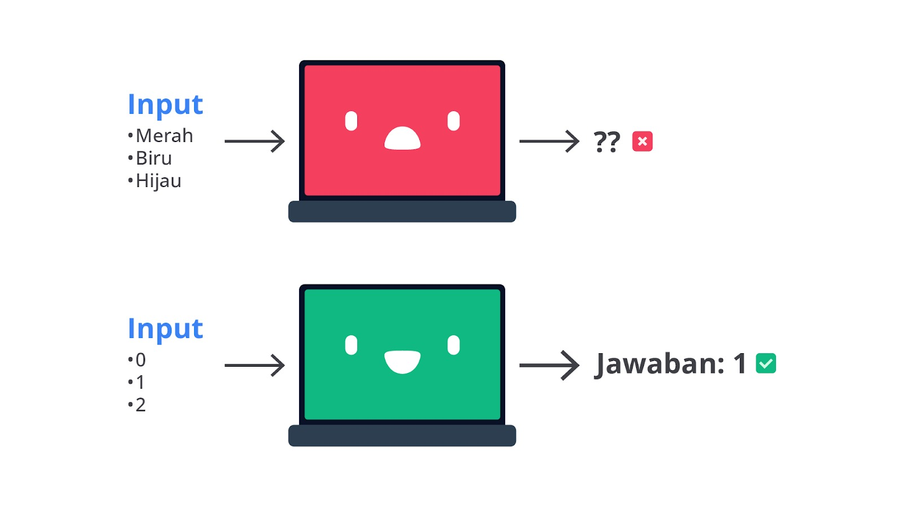

Secara umum komputer dan model machine learning hanya dapat menangani angka. Oleh karena itu, jika dataset mengandung kolom-kolom non-numerik, seperti kategori (contoh: "Merah", "Biru", "Hijau") perlu diubah menjadi angka agar dapat diproses oleh algoritma. Tanpa encoding yang tepat, model dapat memberikan hasil yang buruk atau bahkan gagal berfungsi. Lalu, bagaimana cara menentukan teknik encoding yang tepat? Tenang, kita akan memulai semuanya dari dasar, sekarang saatnya Anda mengetahui perbedaan dari masing-masing teknik encoding.

Ada berbagai macam teknik encoding yang yang memiliki karakteristik berbeda-beda. Namun, pada materi ini, kita hanya akan membahas tujuh buat teknik yang paling sering digunakan ketika membangun model machine learning. Perhatikan gambar berikut untuk memahami perbedaanya secara singkat.

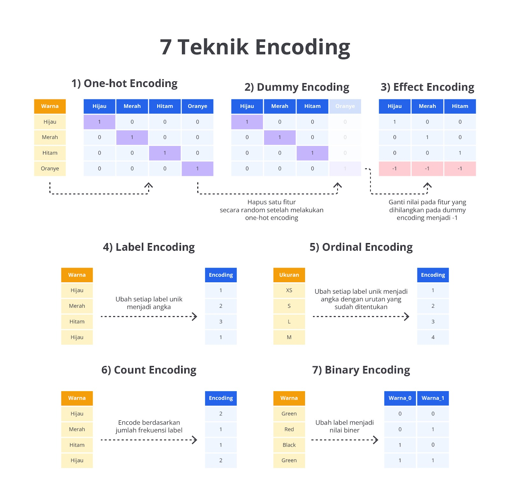

Sekilas dari gambar di atas, Anda sudah mengetahui perbedaannya ‘kan? Namun, itu adalah hasil akhirnya saja sehingga terlihat sangat mudah. Pada materi ini, kita tidak akan berhenti sampai di situ. Agar Anda memiliki pemahaman yang lebih dalam, mari kita bahas semua teknik encoding dengan lebih detail beserta contoh implementasinya.

## One-Hot Encoding

One-Hot Encoding adalah salah satu metode paling umum yang digunakan dalam setiap kasus machine learning dan data science untuk menangani data kategorikal. One-Hot Encoding mengubah setiap nilai unik dari kolom kategorikal menjadi biner pada kolom baru. Setiap kolom biner tersebut berisi nilai 0 atau 1 yang menunjukkan apakah kategori tersebut ada dalam baris itu atau tidak.

Sebagai contoh, jika kita memiliki kolom dengan tiga kategori yaitu Merah, Kuning, dan Hijau, One-Hot Encoding akan membuat tiga kolom biner yang masing-masing merepresentasikan kategori tersebut. Jika suatu baris memiliki kategori Merah, kolom Warna_Merah nilainya akan 1, dan kolom Kuning dan Hijau nilainya 0.

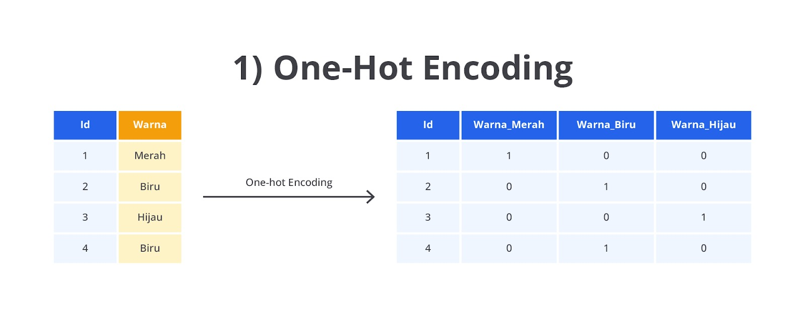

Seperti yang sudah Anda pelajari tahapan encoding ini memiliki peran yang krusial dalam pembangunan model machine learning. Salah satunya karena kebanyakan algoritma machine learning terutama yang berbasis jarak seperti K-Nearest Neighbors atau Support Vector Machine tidak dapat menangani data kategorikal dalam bentuk string atau teks karena tidak ada definisi matematis dari jarak antara string.

Jika Anda hanya mengubah kategori menjadi angka menggunakan metode seperti Label Encoding, model dapat menganggap bahwa ada urutan atau hubungan numerik antara kategori, padahal kategori tersebut sebenarnya independen. One-Hot Encoding dapat memastikan bahwa tidak ada asumsi urutan atau hubungan antara kategori, dan setiap kategori dianggap sebagai entitas yang unik dan independen.

Namun, One-Hot Encoding juga memiliki kekurangan yang cukup mengganggu. Salah satu masalah terbesar teknik One-Hot Encoding yaitu ketika kolom kategorikal memiliki banyak nilai unik (biasa disebut High Cardinality), jumlah kolom biner yang dihasilkan bisa sangat banyak.

Hal ini menyebabkan masalah dalam efisiensi komputasi dan memori karena jumlah fitur yang sangat besar. Misalnya, jika Anda memiliki 1000 kategori yang berbeda, Anda akan memiliki 1000 kolom baru setelah One-Hot Encoding yang bisa menghambat performa model, terutama pada dataset besar.

Secara umum, ada beberapa hal yang perlu Anda perhatikan ketika akan menggunakan teknik One-Hot Encoding.

Data kategorikal memiliki jumlah kategori yang relatif kecil.
Tidak ada urutan antar kategori.
Model machine learning yang digunakan cocok untuk data high-dimensional seperti neural networks dan tree-based models.
Sampai di sini tentu Anda sudah paham ‘kan tentang konsep dasar One-Hot Encoding? Nicee, selanjutnya kita akan kembali melangkah ke teknik encoding lainnya agar Anda memiliki pengetahuan dan tidak melakukan All in One Methods ketika membangun model machine learning.

## Dummy Encoding

Dummy Encoding merupakan salah satu teknik encoding yang digunakan untuk mengubah data kategorikal menjadi format numerik, khususnya yang digunakan dalam model machine learning.

Seperti One-Hot Encoding, Dummy Encoding menghasilkan kolom-kolom biner (0 dan 1) untuk setiap kategori. Namun, perbedaannya terletak pada Dummy Encoding satu kategori akan dihapus atau digunakan sebagai kategori referensi (baseline). Tujuan utama Dummy Encoding adalah untuk menghindari masalah multikolinearitas yang bisa terjadi pada model regresi atau model linier lainnya.

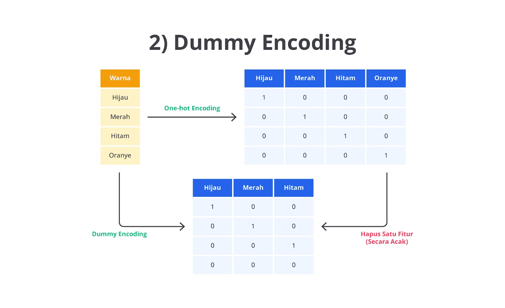

Dummy Encoding memiliki peran yang sangat penting ketika Anda bekerja dengan model linier, seperti regresi linier atau regresi logistik. Jika kita menggunakan One-Hot Encoding hasilnya setiap kolom yang dihasilkan dari kategori tersebut memungkinkan menjadi kombinasi linier satu sama lain sehingga menyebabkan multikolinearitas. Seperti yang Anda ketahui, multikolinearitas terjadi ketika ada hubungan linier yang kuat antara dua atau lebih variabel independen (fitur) sehingga dapat mengacaukan hasil estimasi koefisien dalam model regresi.

Dengan menghapus satu kategori secara acak, Dummy Encoding dapat menghindari masalah ini karena nilai dari kategori yang dihapus bisa diprediksi dari kolom lainnya. Dalam analisis regresi, kategori yang dihapus ini bertindak sebagai baseline atau referensi, dan koefisien dari kategori lainnya menunjukkan pengaruhnya relatif terhadap kategori baseline tersebut.

## Effect Encoding

Effect Encoding atau juga dikenal sebagai Deviation Encoding atau Contrast Coding adalah teknik encoding yang digunakan untuk menangani data kategorikal seperti One-Hot dan Dummy Encoding. Seperti teknik sebelumnya, Effect Encoding berperan untuk mengubah data kategorikal menjadi format numerik. Namun, terdapat perbedaan penting dalam proses pengubahan kategori menjadi nilai numerik. Effect Encoding menggunakan metode yang berbeda dengan Dummy Encoding yaitu menghilangkan satu kategori dan menggantikannya dengan nilai 0, menggunakan nilai -1 sebagai representasi untuk kategori referensi atau baseline.

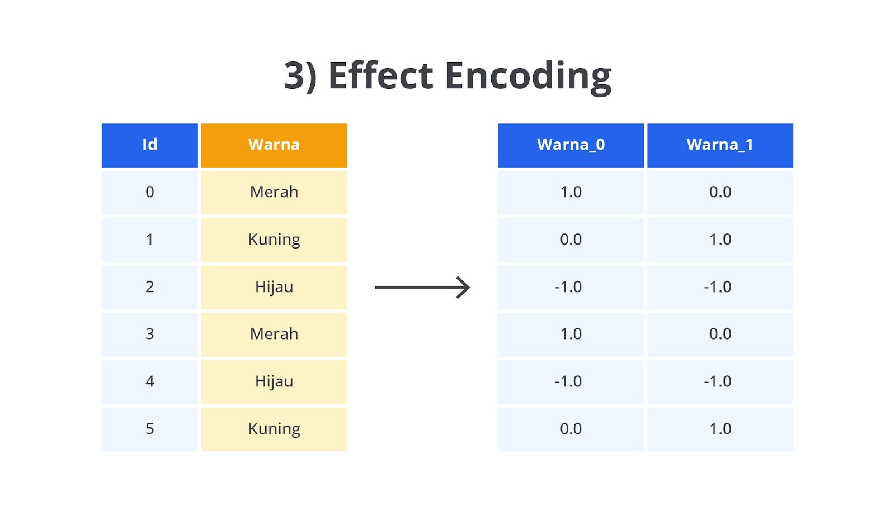

Dalam Effect Encoding, kategori-kategori dalam kolom data kategorikal diubah menjadi kolom-kolom biner (1, 0, -1), tetapi ada satu perbedaan besar yang perlu Anda ketahui jika dibandingkan dengan Dummy Encoding seperti berikut.

Alih-alih menghapus kategori referensi, effect encoding akan mengganti kategori baseline (atau referensi) menjadi nilai -1 dalam setiap kolom biner lainnya.
Kategori-kategori lainnya diberi nilai 1 jika mereka sesuai dengan kategori tersebut dan 0 jika tidak termasuk kategori tersebut.
Dengan Effect Encoding, nilai -1 pada kategori baseline memastikan bahwa rata-rata koefisien model untuk semua kategori yang di-encode sama dengan 0. Artinya, setiap kategori yang di-encode dalam Effect Encoding merepresentasikan efek dari kategori tersebut relatif terhadap rata-rata keseluruhan, bukan terhadap kategori baseline (seperti dalam Dummy Encoding).

Pertanyaan umum yang biasanya muncul sampai materi ini adalah “Kapan menggunakan effect encoding?” Anda sebaiknya menggunakan Effect Encoding ketika memiliki kasus seperti berikut.

Anda menginginkan nilai koefisien yang mengacu pada rata-rata. Jika Anda membangun model regresi dan ingin koefisien untuk setiap kategori menunjukkan perbedaan dari rata-rata keseluruhan, Effect Encoding adalah pilihan yang tepat.
Bekerja dengan ANOVA atau analisis statistik. Effect Encoding sering digunakan dalam analisis statistik seperti ANOVA, di mana kita ingin mengetahui apakah kategori tertentu memiliki efek yang signifikan terhadap variabel dependen dibandingkan dengan rata-rata keseluruhan.
Anda menginginkan simetri dalam representasi kategori. Jika Anda tidak ingin menghapus kategori referensi seperti pada teknik Dummy Encoding, Effect Encoding memberikan representasi yang lebih simetris dengan tetap menyertakan kategori referensi melalui nilai -1.
Sebetulnya masih banyak lagi parameter yang dapat menjadi pertimbangan ketika Anda memilih Effect Encoding. Untuk lebih lengkapnya, silakan baca pada paper berikut: Categorical Variables in Regression Analysis: A Comparison of Dummy and Effect Coding.

## Label Encoding

Label Encoding adalah salah satu metode encoding yang digunakan untuk mengonversi data kategorikal menjadi numerik dalam proses pembuatan model machine learning. Metode ini sangat sederhana dan banyak digunakan, terutama untuk menangani data kategorikal yang bersifat ordinal di mana terdapat urutan antar kategori, tetapi juga dapat digunakan untuk data kategorikal non-ordinal.

Label Encoding bekerja dengan mengganti setiap kategori dengan nilai numerik unik. Kategori pertama akan diberi nilai 0, kategori kedua diberi nilai 1, dan seterusnya. Teknik ini mengubah data menjadi bentuk yang bisa dibaca oleh algoritma machine learning karena sebagian besar algoritma tidak dapat bekerja dengan data kategorikal dalam bentuk string.

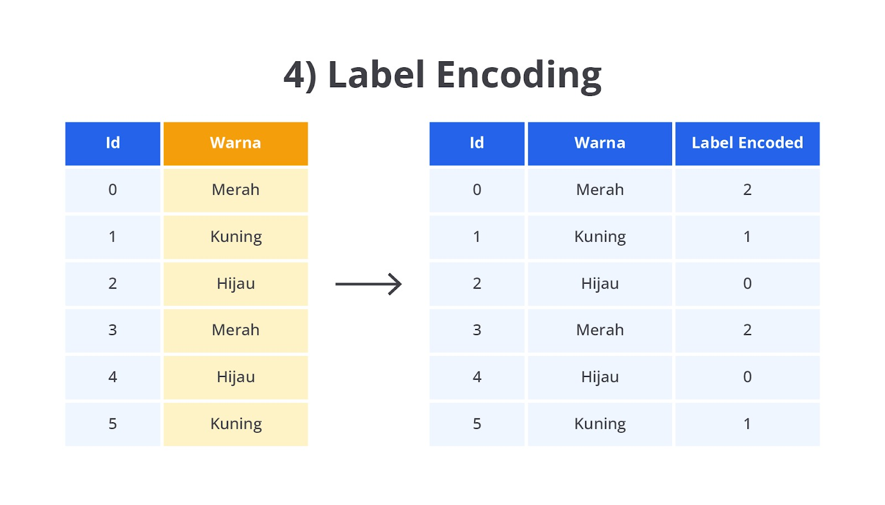

Label Encoding memungkinkan kita untuk melakukan pengubahan kategorikal menjadi numerik dengan cara yang sederhana dan cepat. Label Encoding biasanya digunakan ketika data kategorikal bersifat ordinal atau jumlah kategori relatif sedikit.

Lalu, bagaimana jika kategori tidak memiliki urutan yang logis seperti warna pada contoh kasus di atas? By default, fungsi LabelEncoder() akan mengurutkan data nominal berdasarkan urutan abjad pada variabel target.

Penting untuk dicatat bahwa nilai numerik yang diberikan tidak memiliki nilai matematis apa pun yang melekat pada target yang diubah. Artinya, operasi matematika dasar seperti penjumlahan, pengurangan, perkalian, atau pembagian tidak ada gunanya. Sehingga Anda dapat mepertimbangkan teknik encoding lainnya ketika memiliki data nominal.
Eiitss, pada teknik ini data ordinal masih diurutkan berdasarkan pengetahuan komputer, lalu bagaimana jika Anda memiliki urutan sendiri atau bahkan ingin mengikuti preferensi umum yang tidak dapat disediakan oleh algoritma ini? Tenang, pada teknik encoding berikutnya Anda dapat lebih leluasa untuk mengurutkan target sesuai keinginan.

## Ordinal Encoding

Ordinal Encoding adalah salah satu metode encoding yang digunakan untuk mengonversi data kategorikal menjadi data numerik dalam proses pembuatan model machine learning. Berbeda dengan Label Encoding yang hanya mengubah kategori menjadi angka secara acak tanpa memperhatikan urutan, Ordinal Encoding digunakan khusus untuk data ordinal yang kategorinya memiliki urutan atau hierarki jelas.

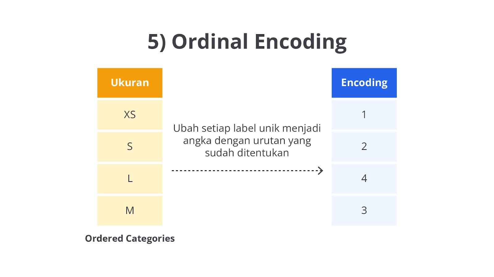

Dalam Ordinal Encoding, setiap kategori diberikan nilai numerik berdasarkan urutan yang logis dan alami dari kategori tersebut. Angka yang lebih kecil menunjukkan kategori yang lebih rendah, dan angka yang lebih besar menunjukkan kategori yang lebih tinggi dalam urutan tersebut. Pada kasus ini agar contoh kasusnya serupa dengan metode sebelumnya, kita akan mengasumsikan urutan warna dengan kondisi Merah < Kuning < Hijau (walaupun secara teknis ini tidak bisa diurutkan).

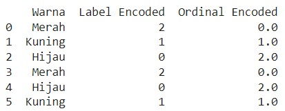

Seperti yang dapat Anda lihat pada gambar di atas hasil dari ordinal encoding ini memiliki output yang berbeda dengan label encoding. Hal ini karena kita telah menentukan urutan “Warna” sehingga memiliki nilai yang berbeda. Lalu, apa kelebihan dari teknik ordinal encoding ini?

Jika kategori target memiliki urutan (bertipe ordinal) tetapi Anda menggunakan teknik encoding lain seperti One-Hot Encoding atau Label Encoding (tanpa urutan), model machine learning tidak dapat memanfaatkan hubungan urutan dari kategori tersebut. Sebaliknya, dengan Ordinal Encoding urutan antara kategori tetap diperhitungkan sehingga model dapat belajar dari urutan tersebut.

## Count Encoding

Count Encoding atau dikenal juga sebagai Frequency Encoding adalah salah satu metode encoding yang digunakan untuk mengonversi data kategorikal menjadi data numerik berdasarkan frekuensi kemunculan kategori di dalam dataset. Berbeda dengan metode seperti One-Hot Encoding atau Label Encoding, Count Encoding mengubah setiap kategori menjadi nilai numerik yang merepresentasikan berapa kali kategori tersebut muncul dalam kolom data.

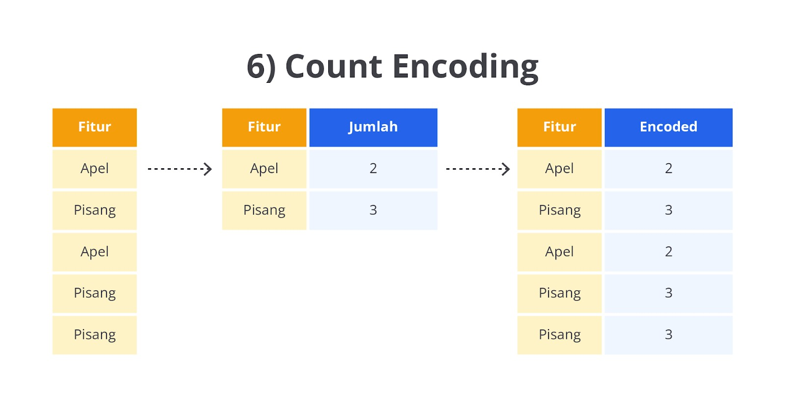

Count Encoding sangat berguna ketika ada banyak kategori unik di dalam suatu kolom, atau dalam dataset dengan kondisi high cardinality (kategori dengan jumlah yang sangat banyak). Dengan Count Encoding, kita mengurangi kompleksitas dataset tanpa menambah dimensi seperti yang terjadi pada One-Hot Encoding.

Pada dasarnya, Count Encoding akan menggantikan setiap kategori dengan jumlah kemunculannya di dalam dataset. Mari kita implementasikan teknik count encoding ini terhadap contoh data yang telah kita gunakan sejauh ini. Perhatikan gambar berikut.

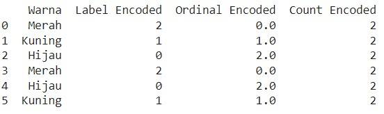

Data yang kita gunakan pada contoh kasus ini yaitu Merah, Kuning, Hijau, Merah, Hijau, dan Kuning. Teknik ini akan menghitung berapa kali setiap kategori muncul sehingga menghasilkan ketentuan seperti berikut.

Merah muncul 2 kali.
Kuning muncul 2 kali.
Hijau muncul 2 kali.

Sehingga akan menghasilkan data seperti berikut (perhatikan kolom Count Encoded).

Di sini, Merah, Kuning, dan Hijau masing-masing digantikan dengan angka 2 karena masing-masing muncul dua kali.

Perlu Anda perhatikan, teknik count encoding berpotensi tidak bekerja dengan optimal pada model berbasis jarak seperti KNN atau ketika ada potensi overfitting pada kategori yang jarang muncul.

## Binary Encoding

Binary Encoding merupakan salah satu metode encoding yang digunakan untuk mengubah data kategorikal menjadi bentuk numerik dengan cara yang lebih efisien dibandingkan One-Hot Encoding atau Label Encoding. Binary Encoding bekerja dengan menggabungkan pendekatan Label Encoding dan One-Hot Encoding. Proses awalnya dimulai dari mengubah kategori menjadi angka menggunakan Label Encoding, dan kemudian angka-angka tersebut diubah ke bentuk biner. Setiap digit biner dari hasil encoding ini dipecah ke dalam kolom baru.

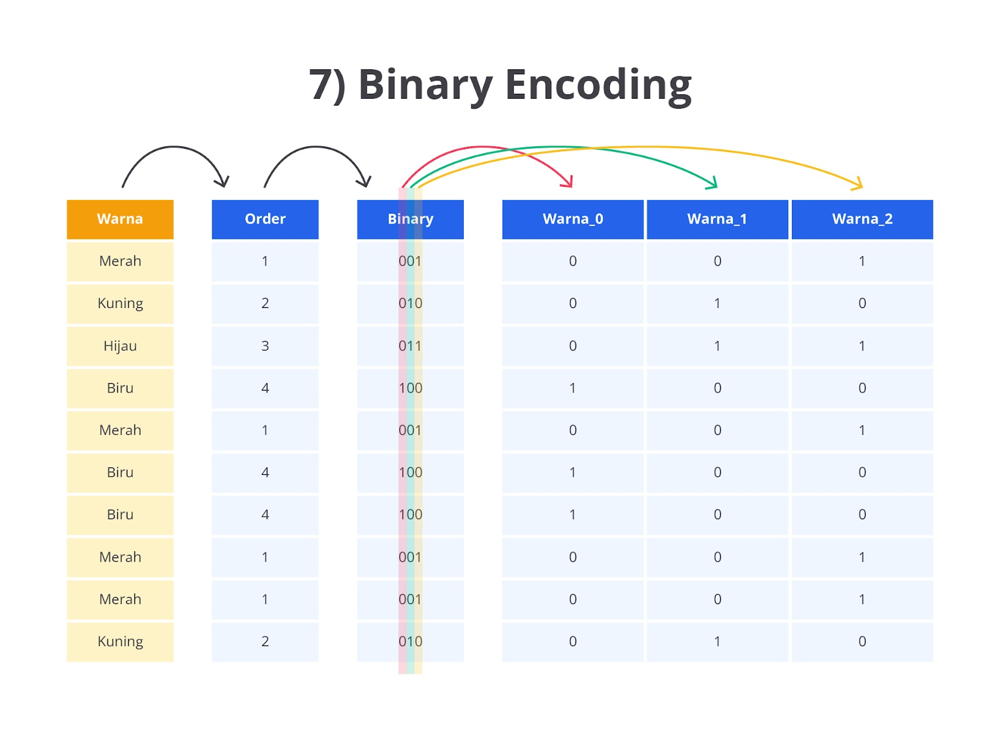

Metode ini dirancang untuk menangani data dengan data yang memiliki banyak kategori unik dengan cara yang lebih hemat ruang dan efisien daripada One-Hot Encoding yang bisa menghasilkan banyak kolom ketika ada banyak kategori.

Seperti yang dapat Anda lihat pada gambar di atas, teknik binary encoding akan dilakukan dalam dua langkah utama, yaitu label encoding dan konversi ke biner. Berikut penjelasan lebih detail terkait kedua tahapan yang dilalui oleh teknik binary encoding.

Label Encoding: setiap kategori dalam kolom data kategorikal diubah menjadi angka integer yang unik. Sebagai contoh, jika kategori terdiri dari Merah, Kuning, Hijau, komputer akan memberi mereka angka 1, 2, dan 3 secara berurutan.

Konversi ke Biner: setelah setiap kategori diberi angka melalui Label Encoding, angka-angka tersebut kemudian diubah ke bentuk biner. Setiap digit biner ini kemudian dipecah menjadi kolom terpisah, di mana setiap kolom mewakili satu digit dalam angka biner tersebut.

Sebagai contoh, jika Merah diberi nilai 1, Kuning diberi nilai 2, dan Hijau diberi nilai 3, representasi biner dari angka-angka tersebut adalah seperti berikut.

1 dalam biner: 01
2 dalam biner: 10
3 dalam biner: 11

Binary Encoding kemudian memecah setiap digit biner ini ke dalam kolom baru sehingga akan memberikan kolom baru seperti berikut.

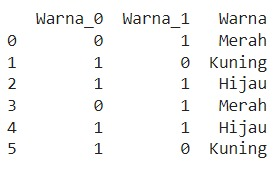

Setelah mempelajari berbagai teknik encoding mulai dari One-Hot, Dummy, Label, hingga Binary, dan Count Encoding, Anda kini memiliki bekal yang kuat untuk mengonversi data kategorikal menjadi numerik. Setiap teknik memiliki keunggulan tersendiri, dan tugas Anda adalah memilih teknik yang tepat sehingga dapat meningkatkan performa model machine learning.

Perlu Anda catat encoding bukan hanya langkah teknis, tetapi fondasi untuk pembangunan model yang lebih andal dan akurat.

Tetap semangat dan terus bereksperimen, dengan bekal ini jangan sampai salah pilih teknik, ya. Teruslah belajar dan bersiaplah menghadapi tantangan data berikutnya yaitu Binning pada materi berikutnya. See you~

# Binning Numerik ke Kategorikal

Seperti yang sudah dipelajari pada materi Encoding Variabel ke Numerik tentunya Anda merasa bahwa semua permasalahan sudah dapat diselesaikan ‘kan? Eitsss, Anda tidak sepenuhnya salah dengan pemahaman tersebut. Namun, perlu Anda ketahui bahwa masih terdapat metode yang dapat membantu meningkatkan performa pembangunan model machine learning yaitu binning.

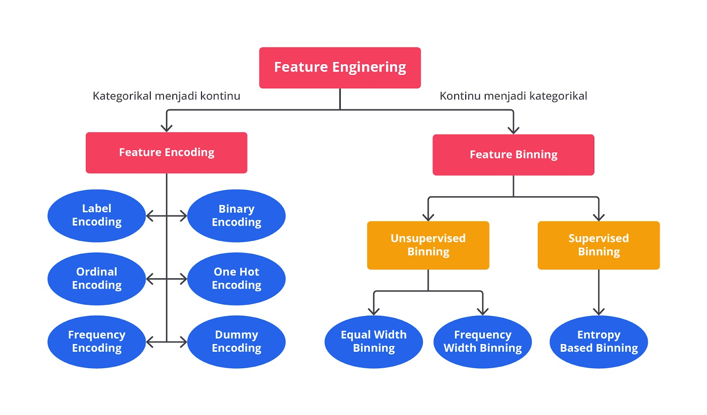

Binning digunakan untuk mengubah data numerik kontinu menjadi kategori atau interval diskrit. Tujuannya adalah untuk menyederhanakan data numerik dengan memisahkannya menjadi beberapa kelompok atau bin berdasarkan rentang atau distribusi nilai tertentu.

Bayangkan Anda memiliki data usia mulai dari 0 tahun hingga 100 tahun. Jika Anda mengubah data tersebut menggunakan encoding tentu akan menghasilkan data yang sangat banyak ‘kan? Nah, dengan menggunakan binning data tersebut dapat dibagi menjadi beberapa kelompok seperti “Anak-Anak”,"Remaja", "Dewasa", dan "Lansia".

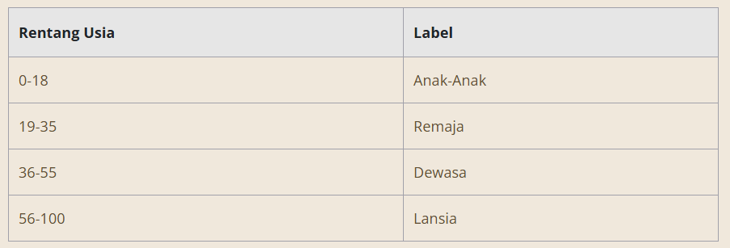

Binning digunakan dalam proses pembangunan model machine learning ketika kita ingin menyederhanakan data numerik kontinu atau menangani variabel yang memiliki variasi nilai yang luas. Salah satu alasan utamanya adalah untuk mengurangi variasi kecil yang tidak signifikan yang dapat mengganggu pola utama dalam data.

Dengan membagi data menjadi kategori atau kelompok, Anda dapat lebih fokus pada tren utama. Selain itu, binning juga berguna dalam menangani outlier, di mana nilai-nilai ekstrim yang jauh dari data lain dapat dikelompokkan dalam bin tertentu agar tidak memengaruhi model secara signifikan. Terakhir, binning sering digunakan karena kategori diskrit yang dihasilkan akan lebih mudah diolah dan diinterpretasikan dibandingkan dengan data numerik mentah.

Sampai di sini, apakah Anda sudah paham betul perbedaan encoding dan binning? Tenang saja karena keduanya sangat mudah dibedakan. Secara sederhana metode binning ini berfokus pada penyederhanaan data numerik, sementara encoding yang sebelumnya kita pelajari menangani variabel kategorikal.

Secara umum, teknik binning ini terbagi menjadi dua kelompok besar yaitu unsupervised binning dan supervised binning.

Unsupervised binning dan supervised binning merupakan dua pendekatan yang berbeda dalam mengelompokkan data numerik ke dalam kategori (binning). Unsupervised binning tidak mempertimbangkan target variabel saat mengelompokkan data melainkan hanya berdasarkan pada distribusi atau rentang dari fitur yang sedang diolah.

Metode ini sering menggunakan teknik seperti equal-width binning yang membagi data menjadi interval dengan lebar yang sama, atau equal-frequency binning yang memastikan setiap bin memiliki jumlah data yang sama. Unsupervised binning cocok digunakan ketika kita tidak memiliki informasi tentang target variabel atau ingin membagi data secara netral.

Di sisi lain, supervised binning memanfaatkan informasi dari variabel target untuk menentukan rentang atau batasan binning agar lebih optimal. Pendekatan ini mencari cara untuk membagi data sehingga setiap bin dapat memaksimalkan kemampuan fitur dalam memprediksi target variabel. Salah satu metode yang umum digunakan dalam supervised binning adalah entropy based binning yang menentukan batas bin berdasarkan bagaimana fitur memisahkan target.

Supervised binning berguna untuk meningkatkan kinerja model prediktif dengan membentuk bin yang lebih relevan untuk klasifikasi atau regresi. Singkatnya, perbedaan utama terletak pada apakah target variabel diperhitungkan dalam proses binning atau tidak.

Agar lebih jelas, mari kita bahas dan praktikkan beberapa teknik binning mulai dari equal-width binning, equal-frequency binning, hingga entropy based binning.

## Equal-Width Binning

Equal-width binning adalah metode binning yang membagi rentang nilai data numerik menjadi beberapa bin yang memiliki lebar interval yang sama. Dalam metode ini, rentang total dari data dihitung, kemudian rentang ini dibagi secara merata ke dalam sejumlah bin tertentu. Jumlah data dalam setiap bin tidak perlu sama, tetapi lebar intervalnya tetap seragam.

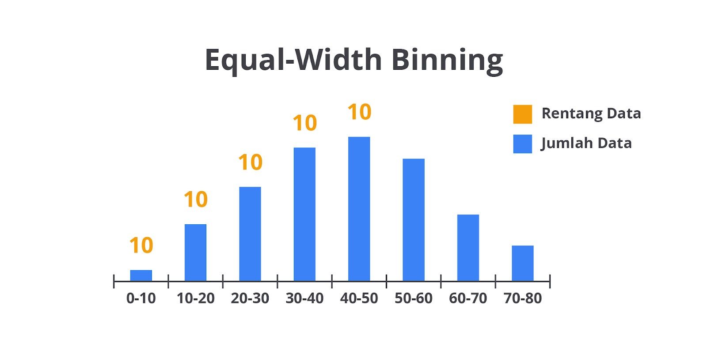

Misalkan Anda memiliki data usia yaitu [5, 12, 17, 22, 27, 33, 38, 42, 50, 57]. Lalu, ketika Anda ingin membagi data tersebut menjadi tiga bin dengan equal-width binning, langkah yang dapat dilakukan adalah seperti berikut.

Nilai minimum: 5, nilai maksimum: 57.
Rentang data: 57 - 5 = 52.
Jika kita ingin 3 bin, maka lebar setiap bin adalah 52 / 3 = 17.33.
Jadi, bin pertama adalah [5, 22.33], bin kedua [22.34, 39.67], dan bin ketiga [39.68, 57].
Berdasarkan rentang ini, data akan di-binned sebagai berikut.

Bin 1 (5-22.33): [5, 12, 17]
Bin 2 (22.34-39.67): [22, 27, 33, 38]
Bin 3 (39.68-57): [42, 50, 57]
Mudah ‘kan? Teknik ini tidak memerlukan komputasi dan perhitungan yang sangat besar, karena pada dasarnya hanya membagi rentang bin secara merata. Kekurangan dari teknik ini yaitu tidak memperhatikan distribusi data. Jika data terdistribusi tidak merata, beberapa bin bisa sangat padat, sementara bin lain bisa kosong atau hampir kosong.

## Equal-Frequency Binning

Equal-frequency binning adalah metode binning yang membagi data menjadi beberapa bin sehingga setiap bin berisi jumlah data yang sama atau hampir sama. Lebar interval bin tidak seragam, tetapi data di dalam setiap bin akan terdistribusi secara merata berdasarkan frekuensi.

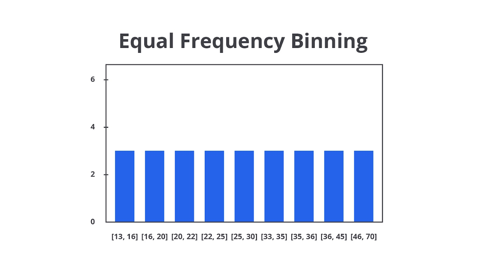

Mari kita implementasikan menggunakan data yang sama pada contoh sebelumnya yaitu data usia = [5, 12, 17, 22, 27, 33, 38, 42, 50, 57] dan ingin membaginya menjadi 3 bin.

Data diurutkan: [5, 12, 17, 22, 27, 33, 38, 42, 50, 57].
Karena ada 10 data dan kita ingin 3 bin, maka setiap bin harus berisi sekitar 10/3 ≈ 3-4 data.
Bin-nya akan dibagi seperti ini:

Bin 1: [5, 12, 17] (3 data).
Bin 2: [22, 27, 33, 38] (4 data).
Bin 3: [42, 50, 57] (3 data).
Berbanding terbalik dengan equal-width, teknik ini memang membagi jumlah data secara merata, tetapi ada satu kekurangan ketika Anda ingin mempertahankan distribusi data yaitu lebar (jumlah data) pada setiap bin akan menjadi bervariasi sehingga dapat membuat interpretasi lebih sulit.

Sampai di sini sudah jelas kan perbedaan dari kedua teknik ini? Benar, keduanya tidak membutuhkan perhitungan matematika yang kompleks. Kedua teknik ini hanya menggunakan pembagian dasar sebagai senjata utamanya. Secara garis besar, keduanya akan membagi pembagian data dengan adil berdasarkan masing-masing parameternya. Berikut contoh lainnya dari penggunaan equal-width dan equal-frequency binning.

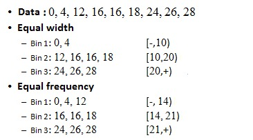

## Entropy-Based Binning

Last but not least, salah satu metode yang mempertimbangkan hubungan binning dengan variabel lainnya yaitu entropy-based binning. Entropy-based binning adalah metode binning yang mempertimbangkan target variabel dalam pembangunan model supervised learning.

Metode ini membagi data berdasarkan seberapa baik nilai dalam setiap bin memisahkan kelas target. Entropi digunakan sebagai ukuran ketidakpastian atau "kekacauan" dalam distribusi kelas pada masing-masing bin. Binning ini bertujuan untuk meminimalkan entropi dalam setiap bin sehingga nilai di dalam bin lebih seragam terhadap target kelas.

Langkah-langkah Entropy-Based Binning secara umum seperti berikut.

Urutkan data berdasarkan nilai fitur numerik.
Tentukan berapa banyak bin yang diinginkan.
Tentukan titik split dengan menghitung entropi dalam bin yang berbeda. Split dilakukan di tempat yang meminimalkan entropi.
Ulangi proses untuk menambah bin, jika diperlukan.
Mari asumsikan kita memiliki data berikut dengan target apakah seseorang akan membeli produk (Yes/No).

Usia: [18, 22, 25, 28, 35, 37, 40, 42, 50, 57]
Target (Yes/No): [No, No, Yes, No, Yes, Yes, Yes, No, Yes, Yes]
Dari data di atas, kita dapat simpulkan bahwa terdapat enam data “Yes” dan empat data “No”. Langkah pertama yang perlu Anda lakukan adalah menghitung probabilitas untuk setiap kelas (pada kasus ini “Yes” dan “No”). Pada kasus ini terbagi menjadi 0.6 untuk “Yes” dan 0.4 untuk “No”.

Tahapan selanjutnya, Anda perlu menghitung nilai entropy dari keseluruhan dataset yang digunakan. Entropi adalah ukuran ketidakpastian dalam sebuah dataset. Konsep ini berasal dari teori informasi dan sering digunakan dalam algoritma seperti decision tree untuk menentukan seberapa informatif suatu atribut dalam memisahkan data.

Secara umum, semakin rendah nilai entropi, semakin "teratur" data tersebut, sedangkan semakin tinggi entropi maka semakin "acak" data tersebut sehingga lebih sulit untuk memisahkan fiturnya dengan mudah. Secara matematis, rumus entropy dapat ditulis seperti berikut.

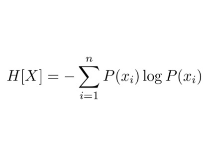

Berdasarkan nilai probabilitas yang telah dihitung sebelumnya, mari kita masukkan angka tersebut lalu hitung menggunakan rumus entropy sehingga menghasilkan angka seperti berikut.

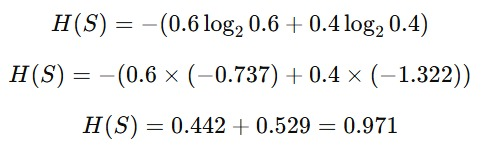

Jadi, entropi total dari dataset ini adalah 0.971. Selanjutnya, kita ingin membagi data berdasarkan usia. Anda perlu memilih salah satu titik split, misalnya di antara usia 25 dan 28, sehingga dua bin terbentuk yaitu bin_1 Usia <= 25 dan bin_2 Usia > 25.

Tahapan berikutnya, Anda perlu menghitung masing-masing nilai entropy pada setiap bin.

bin_1 (Usia ≤ 25)

Data: [18, 22, 25]

Target: [No, No, Yes]

2 orang tidak membeli (No), 1 orang membeli (Yes).

Probabilitas pYes = 1/3, pNo = 2/3.

Sehingga, entropi untuk bin_1 menghasilkan nilai seperti berikut.

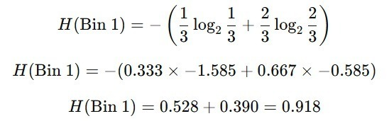

bin_2 (Usia > 25)

Data: [28, 35, 37, 40, 42, 50, 57]

Target: [No, Yes, Yes, Yes, No, Yes, Yes]

5 orang membeli (Yes), 2 orang tidak membeli (No).

Probabilitas pYes = 5/7, pNo = 2/7.

Sehingga, entropi untuk bin_2 menghasilkan nilai seperti berikut.

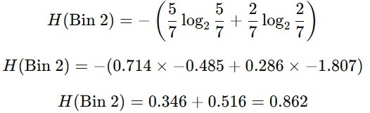

Langkah terakhir untuk menentukan fitur terbaik pada tahapan ini adalah mencari nilai information gain. Information gain adalah penurunan entropi setelah data dibagi menjadi bin. Secara matematis rumus information gain dapat ditulis seperti berikut.

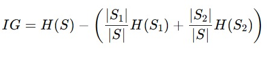

Jika diartikan, rumus di atas memiliki peran seperti berikut.

H(S) adalah entropi total sebelum binning (pada kasus ini 0.971).
H(S1) dan H(S2) adalah entropi dari masing-masing bin.
∣S1∣ dan ∣S2∣ adalah jumlah data dalam masing-masing bin.
|S| adalah jumlah total data.
Pada contoh kasus ini, jumlah data pada bin_1 = 3, bin_2 = 7 dan total data = 10. Sehingga, dari angka tersebut Anda dapat mendapatkan nilai information gain seperti berikut.

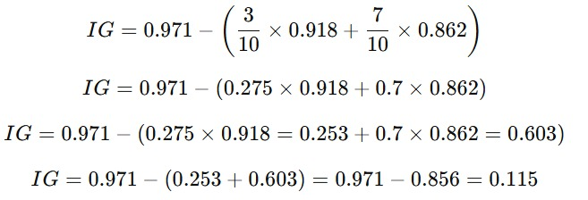

Dari perhitungan di atas, Anda mendapatkan nilai information gain pada fitur Usia sebesar 0.115. Sebenarnya Anda bisa mencoba beberapa titik pemisahan (split point) lain di usia yang berbeda, menghitung entropi untuk masing-masing bin, dan memilih split yang memberikan information gain tertinggi. Split yang menghasilkan information gain tertinggi adalah yang dipilih untuk membagi data karena memberikan penurunan ketidakpastian terbesar.

Pada kasus lainnya dengan fitur yang lebih banyak, Anda perlu menghitung nilai information gain pada setiap fitur. Jika split ini menghasilkan information gain tertinggi dibandingkan split lainnya, fitur tersebut akan dipilih sebagai titik binning yang optimal.

Nah, sampai di sini, Anda sudah mengetahui berbagai tipe binning pada data numerik. Sejujurnya masih terdapat banyak sekali teknik yang dapat Anda gunakan untuk melakukan binning. Namun, materi ini merupakan fondasi awal karena ke depannya Anda perlu melakukan eksplorasi secara mandiri agar terus berkembang sehingga dapat mengikuti perkembangan teknologi yang sangat pesat. So, jangan sampai kehabisan bensin ya, semangat!
