# Scaling Fitur

Scaling feature pada machine learning adalah proses menyesuaikan rentang atau skala nilai-nilai fitur agar berada dalam rentang tertentu yang lebih seragam. Proses ini memiliki peran yang cukup penting karena banyak algoritma machine learning sensitif terhadap perbedaan skala antara fitur.

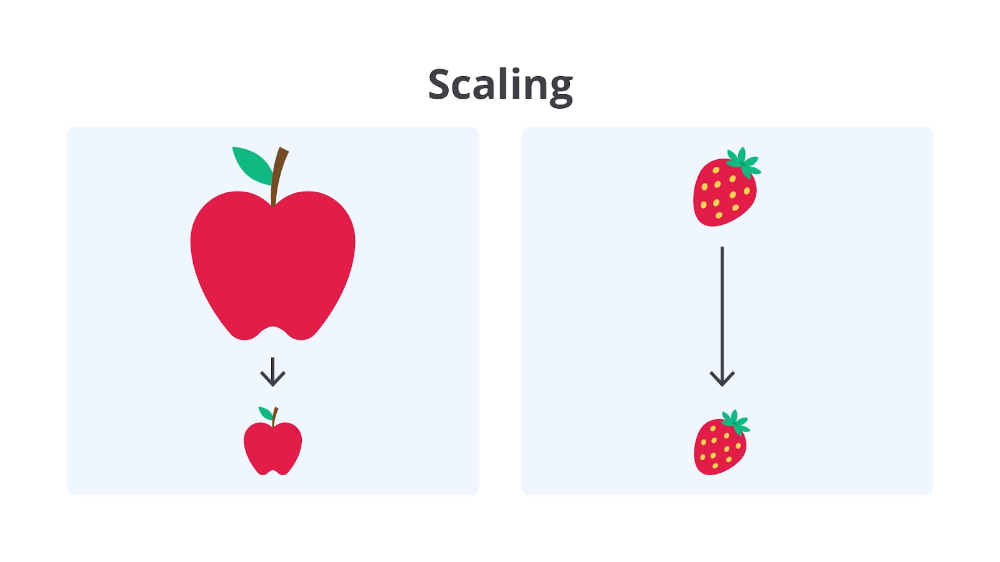

Jika nilai pada masing-masing fitur tidak di-scaling, algoritma yang Anda gunakan mungkin akan memberikan bobot lebih pada fitur dengan rentang nilai yang lebih besar padahal tidak selalu berarti fitur tersebut lebih penting. Scaling membantu memastikan bahwa semua fitur memiliki kontribusi yang seimbang dalam proses training model machine learning.

Salah satu alasan mengapa scaling ini penting karena algoritma seperti K-Nearest Neighbors (KNN), K-Means clustering, dan Support Vector Machines (SVM) menggunakan jarak seperti Euclidean atau Minkowski untuk membuat sebuah pola. Fitur yang memiliki skala lebih besar akan mendominasi pengukuran jarak dan dapat mengaburkan informasi dari fitur yang lebih kecil skalanya.

Secara umum terdapat dua teknik yang dapat Anda gunakan untuk mengubah skala data agar konsisten yaitu normalisasi dan standardisasi. Perhatikan perbedaan pada gambar berikut.

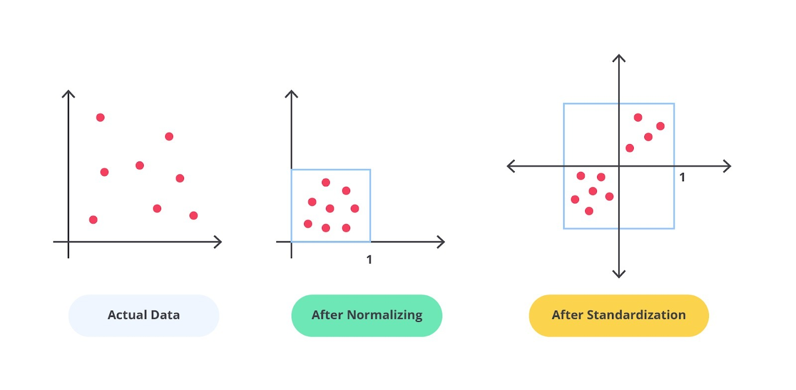

Terlihat jelas perbedaannya ‘kan? Sederhananya, normalisasi merupakan proses pengubahan skala data dari rentang asli sehingga semua nilai berada dalam rentang 0 dan 1. Di lain sisi, standardisasi data melibatkan pengubahan skala distribusi nilai sehingga rata-rata nilai yang dianalisis adalah 0 dan memiliki nilai standar deviasi sebesar satu.

Mari kita implementasikan kedua teknik scaling ini agar Anda lebih terbayang perbedaannya menggunakan kode berikut.

```bash
from sklearn.preprocessing import MinMaxScaler, StandardScaler

# Contoh data
data = [[10], [2], [30], [40], [50]]

# Min-Max Scaling
min_max_scaler = MinMaxScaler()
scaled_min_max = min_max_scaler.fit_transform(data)
print("Min-Max Scaling:\n", scaled_min_max)

# Standardization
standard_scaler = StandardScaler()
scaled_standard = standard_scaler.fit_transform(data)
print("\nStandardization:\n", scaled_standard)
```

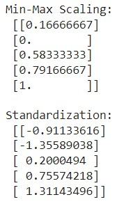

Seperti yang dapat Anda lihat, data dummy yang digunakan memiliki skala yang berbeda tergantung dengan teknik scaling yang digunakan. Mudah ‘kan? Good job!

Pada kelas ini, Anda hanya akan memahami kedua metode ini sampai di sini. Jika Anda penasaran terkait perhitungan matematis dan penjelasan yang lebih detail, silakan lanjutkan pembelajaran di kelas Belajar Pengembangan Machine Learning, ya.

# Penanganan Outlier

Selain konversi data kategorik menjadi numerik, ada teknik lain dalam proses pengembangan machine learning yang perlu Anda ketahui yaitu penanganan outlier. Dalam statistik, outlier adalah sebuah nilai yang jauh berbeda dari kumpulan nilai lainnya dan dapat mengacaukan hasil dari sebuah analisis statistik. Outlier dapat disebabkan oleh kesalahan dalam pengumpulan data atau nilai tersebut benar ada dan memang unik dari kumpulan nilai lainnya.

Apa pun alasan kemunculannya, Anda perlu tahu cara mengidentifikasi dan memproses outlier. Ini adalah bagian penting dalam persiapan data di dalam machine learning. Salah satu cara termudah untuk mengecek apakah terdapat outlier dalam data kita adalah dengan melakukan visualisasi.

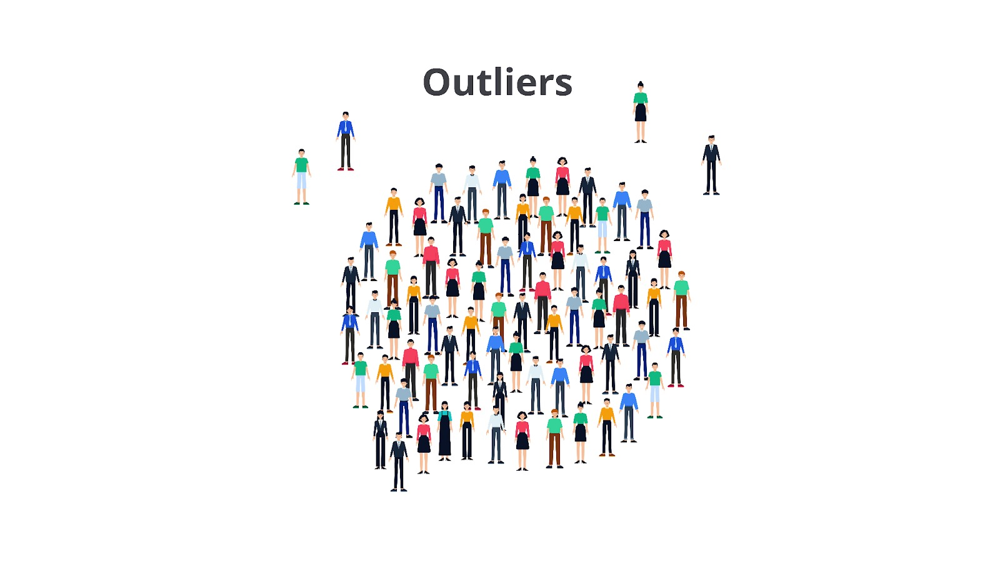

Dapat dilihat dengan jelas bahwa terdapat satu sampel yang jauh berbeda dengan sampel-sampel lainnya. Setelah mengetahui bahwa di data kita terdapat outlier, kita dapat mencari lalu menghapus sampel tersebut dari dataset.

Dengan munculnya permasalahan ini, penanganan outlier merupakan langkah penting yang perlu Anda lakukan dalam proses pengembangan machine learning. Outlier dapat secara signifikan memengaruhi performa model machine learning karena mereka dapat menyebabkan model overfitting atau mengacaukan proses analisis. Oleh karena itu, memahami cara mendeteksi dan menangani outlier adalah kunci untuk menghasilkan model yang lebih akurat dan robust.

Misalnya, jika sebagian besar nilai penghasilan dalam dataset berada di kisaran Rp5.000.000 hingga Rp10.000.000, tetapi ada beberapa individu yang memiliki penghasilan di atas Rp100.000.000, nilai tersebut bisa dianggap sebagai outlier. Lalu, bagaimana cara mengatasi permasalahan tersebut? Terdapat beberapa metode yang dapat Anda lakukan untuk mendeteksi outlier seperti metode statistik dan visualisasi data.

## Metode Statistik

Metode statistik sederhana dapat digunakan untuk mendeteksi outlier dalam dataset univariat. Ini melibatkan identifikasi titik-titik data yang berada jauh dari distribusi utama. Salah satu perhitungan statistik yang dapat Anda gunakan adalah perhitungan interquartile range (IQR).

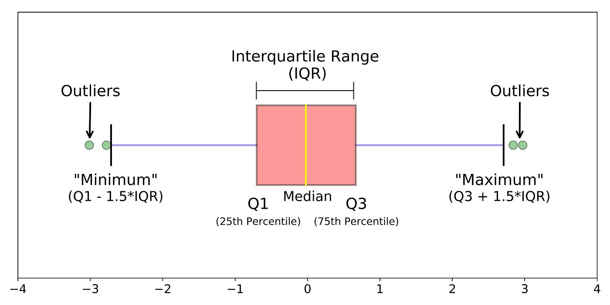

IQR digunakan untuk mendeteksi outlier dengan menghitung rentang antara kuartil pertama (Q1) dan kuartil ketiga (Q3). Nilai di luar batas ini dianggap sebagai outlier. Contohnya ketika Anda memiliki data Q1 = 25 dan Q3 = 75, nilai batas outliernya akan seperti berikut.

IQR = 75 - 25 = 50.
Batas bawah = 25 - 1.5 \* 50 = -50.
Batas atas = 75 + 1.5 \* 50 = 150.

Setiap nilai di luar -50 dan 150 adalah outlier. Seru kan belajar matematika? Tahan dahulu semangat Anda karena perhitungan lebih dalamnya akan Anda pelajari pada kelas Machine Learning Terapan. Sampai di sini, mungkin Anda perlu meningkatkan pengetahuan dasar lainnya terlebih dahulu.

## Visualisasi Data

Visualisasi data adalah cara efektif untuk mendeteksi outlier secara manual. Anda dapat dengan mudah mendeteksi outlier dengan menggunakan visualisasi data seperti Boxplot, Scatterplot, Histogram, dan lain sebagainya.

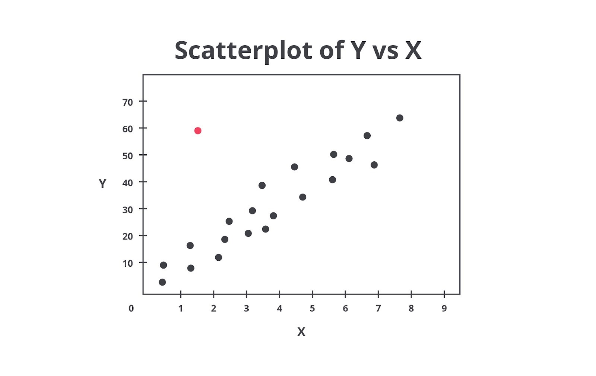

Setelah outlier terdeteksi, ada beberapa cara untuk menanganinya, tergantung pada sifat outlier dan tujuan analisis. Tanpa berlama-lama, mari kita bahas satu per satu beberapa cara yang biasanya digunakan untuk mengatasi outlier.

### Menghapus Outlier

Salah satu metode paling umum yaitu menghapus outlier dari dataset. Ini bisa dilakukan jika Anda yakin bahwa outlier tersebut dihasilkan dari kesalahan pengukuran atau jika outlier tersebut tidak relevan dengan analisis yang sedang dilakukan. Namun, menghapus outlier harus dilakukan dengan hati-hati. Menghapus terlalu banyak data dapat mengurangi ukuran dataset dan menyebabkan hilangnya informasi penting.

### Transformasi Data

Kadang-kadang, Anda juga bisa mengatasi outlier dengan melakukan transformasi data. Transformasi ini bisa mengurangi pengaruh outlier tanpa harus menghapusnya. Namun, metode ini bukanlah metode terbaik karena dengan mengubah skala data hanya akan memperkecil nilainya saja dan tetap menjadi outlier.

### Capping

Capping adalah metode di mana nilai outlier dibatasi ke nilai maksimum atau minimum tertentu (seperti pada perhitungan IQR sebelumnya). Biasanya, dari pada menghapus data, nilai yang melampaui batas akan diubah menjadi nilai Q1 atau Q3.

### Imputasi

Pilihan lain daripada menghapus atau mengubah outlier, Anda bisa melakukan imputasi atau menggantinya dengan nilai yang lebih wajar, seperti mean, median, atau mode dari data lainnya.

### Model-Based Approach

Beberapa model machine learning mampu menangani outlier secara inheren salah satu contohnya adalah algoritma Random Forest. Algoritma random forest lebih tahan terhadap outlier karena hanya memperhitungkan pemisahan data berdasarkan aturan split dan tidak terpengaruh oleh nilai yang memiliki karakteristik berbeda.

Penanganan outlier perlu dilakukan dengan hati-hati karena setiap metode yang dipilih akan memengaruhi performa model yang Anda buat. Hal ini tergantung pada konteks data dan tujuan analisis. Berikut adalah beberapa poin penting yang perlu Anda pertimbangkan ketika menangani outlier.

- Kapan tidak menghapus outlier: jika outlier memiliki peran penting misalnya seperti fraud detection atau deteksi anomali, mereka sebaiknya tidak dihapus. Outlier bisa menjadi poin data yang memberikan informasi berharga karena sejatinya data yang ada di lapangan memiliki karakteristik tersebut.
- Data domain: sebelum memutuskan bagaimana menangani outlier, sangat penting untuk memahami konteks domain data. Misalnya, dalam data keuangan, outlier bisa menjadi hal normal karena adanya individu dengan penghasilan yang sangat tinggi.
- Model yang digunakan: beberapa model tidak terpengaruh oleh outlier, seperti decision tree atau random forest sehingga dalam kasus seperti ini, penanganan outlier mungkin tidak diperlukan.

Sampai di sini, Anda perlu berlatih sebanyak mungkin untuk mendapatkan intuisi serta pengalaman dari masing-masing metode penanganan yang Anda gunakan. Semakin banyak berlatih, maka Anda semakin andal untuk memilih metode penanganan terbaik. Psstt, untuk materi lebih lengkap mengenai penanganan outlier, silakan lanjutkan pembelajaran pada kelas Belajar Pengembangan Machine Learning dan Machine Learning Terapan. Sampai jumpa di level berikutnya, sayonara!

# Oversampling dan Undersampling

Hi calon engineer masa depan!

Tak terasa Anda sudah melalui perjalanan yang cukup panjang pada modul ini, kami harap Anda masih memiliki semangat yang membara dan menyala sampai titik ini. Karena materi kali ini kita akan membahas suatu permasalahan yang seringkali terjadi ketika Anda membangun model machine learning.

Sampai pada modul ini, mungkin Anda telah melakukan beberapa latihan mandiri untuk membangun model machine learning yang ada pada modul-modul sebelumnya. Anda juga telah bersahabat dengan open source dataset seperti Kaggle, UCI, dan lain sebagainya. Namun, apakah Anda pernah menemukan sebuah dataset yang memiliki proporsi tidak seimbang seperti berikut?

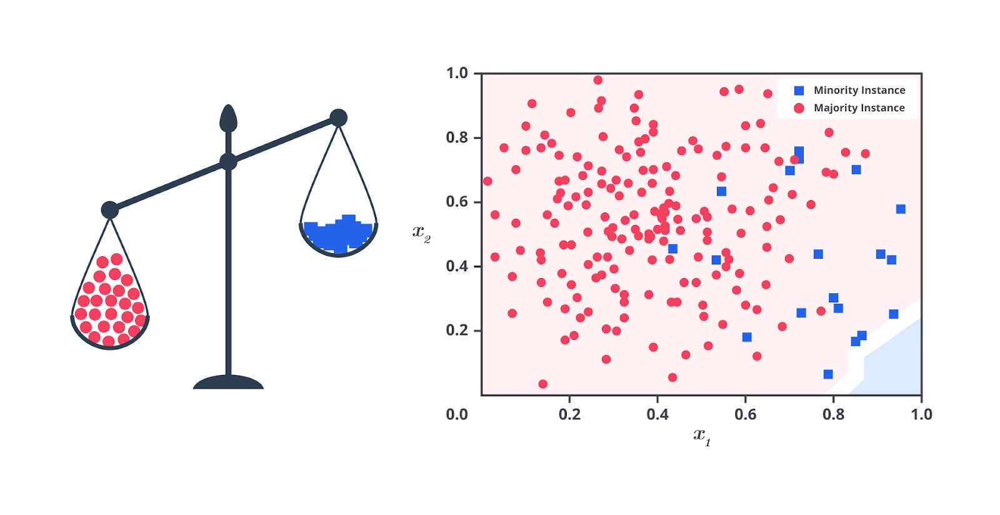

Permasalahan tersebut sangat wajar dan seringkali terjadi ketika Anda menggunakan data publik atau lebih parah ketika melakukan scraping secara mandiri karena dataset tersebut tidak sesuai dengan ekspektasi. Dataset yang memiliki masalah seperti ini biasanya disebut dengan imbalance dataset.

Imbalanced Dataset adalah situasi ketika jumlah data pada satu kelas jauh lebih sedikit atau lebih banyak dibandingkan dengan kelas lainnya. Ini sering terjadi dalam masalah klasifikasi, khususnya dalam binary classification (klasifikasi dua kelas) ketika satu kelas (sering disebut minoritas) memiliki jauh lebih sedikit sampel dibandingkan kelas lainnya (disebut mayoritas). Namun, masalah ini juga tidak menutup kemungkinan terjadi pada masalah klasifikasi lebih dari dua kelas atau multi kelas, ya.

Ketika dataset tidak seimbang, algoritma machine learning cenderung lebih baik dalam memprediksi kelas mayoritas dan mengabaikan atau salah mengklasifikasikan kelas minoritas. Ini terjadi karena sebagian besar algoritma secara alami berusaha memaksimalkan akurasi yang mungkin bukan metrik yang tepat untuk dataset yang tidak seimbang.

Misalnya, jika 95% dari data termasuk dalam kelas mayoritas dan hanya 5% dalam kelas minoritas, model yang selalu memprediksi kelas mayoritas dapat mencapai akurasi 95% tanpa pernah memprediksi kelas minoritas dengan benar.

Google secara resmi memberikan tiga buah level untuk kondisi imbalance yang berbeda-beda dihitung dari proporsi ketidakseimbangannya.

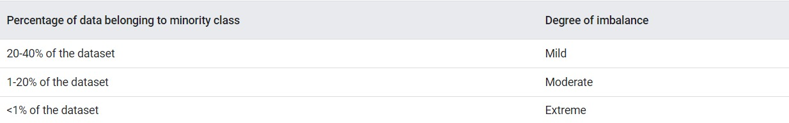

Pada situsnya, Google memberikan saran untuk tetap melakukan pembangunan model machine learning pada dataset yang tidak seimbang. Hal ini dibutuhkan agar Anda memiliki baseline model sehingga dapat membandingkan hasil dari dataset yang imbalance dengan eksperimen kedepannya. Setelah itu, Anda perlu mencoba beberapa teknik untuk mengatasi permasalahan imbalance dataset seperti oversampling atau undersampling.

## Oversampling

Oversampling adalah metode yang menambahkan sampel pada kelas minoritas sehingga jumlahnya menjadi seimbang dengan kelas mayoritas. Teknik ini bekerja dengan cara memperbanyak data dari kelas minoritas agar model memiliki kesempatan yang lebih baik untuk belajar dari data tersebut.

Terdapat berbagai macam teknik oversampling yang dapat Anda gunakan seperti Random Oversampling atau Synthetic Minority Over-sampling Technique (SMOTE). Mari kita bahas perbedaan dari kedua metode yang sering digunakan untuk melakukan oversampling.

### Random Oversampling

Dalam teknik ini, data dari kelas minoritas secara acak di-duplicate atau digandakan hingga jumlahnya seimbang dengan kelas mayoritas. Ini adalah teknik sederhana dan sering kali efektif. Contohnya jika Anda memiliki 100 data pada kelas mayoritas dan 10 data pada kelas minoritas, random oversampling akan memilih beberapa sampel dari kelas minoritas dan menambahkannya ke dataset hingga kelas minoritas juga memiliki 100 sampel.

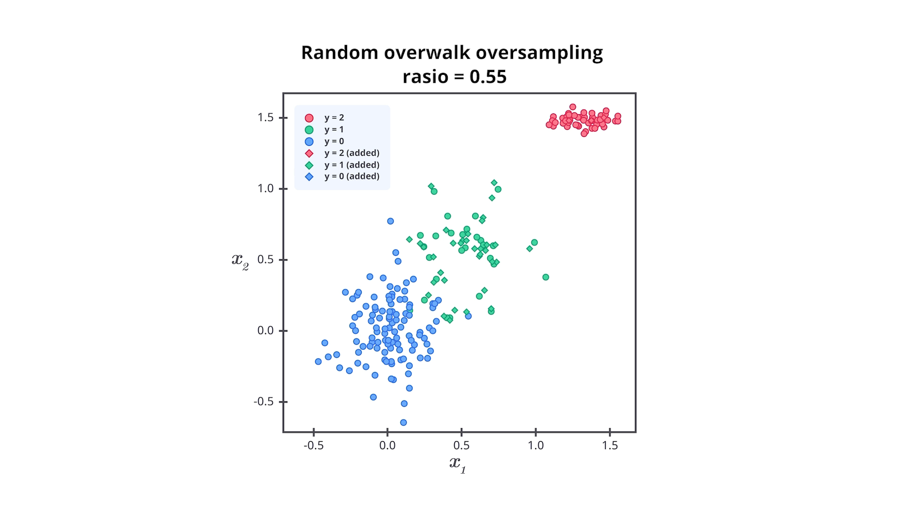

Metode ini sangat mudah digunakan dan tidak memerlukan komputasi yang terlalu besar, tetapi perlu Anda ingat metode ini juga memiliki kekurangan yaitu dapat menyebabkan overfitting karena sampel yang sama di-duplicate berkali-kali, membuat model terlalu "mengingat" data daripada belajar dari pola yang sebenarnya.

### Synthetic Minority Over-sampling Technique (SMOTE)

SMOTE adalah teknik oversampling yang lebih canggih dan kompleks, di mana data sintetis (baru) dibuat untuk kelas minoritas daripada hanya menduplikasi sampel yang ada. Teknik ini menghasilkan sampel baru dengan melakukan interpolasi antara dua data minoritas yang ada untuk membuat data yang baru. SMOTE akan membantu mengatasi masalah overfitting yang umum pada random oversampling.

Contohnya, jika Anda memiliki dua titik data minoritas di suatu ruang fitur, SMOTE akan menghasilkan sampel baru yang berada di antara kedua titik tersebut sehingga menciptakan variasi baru.

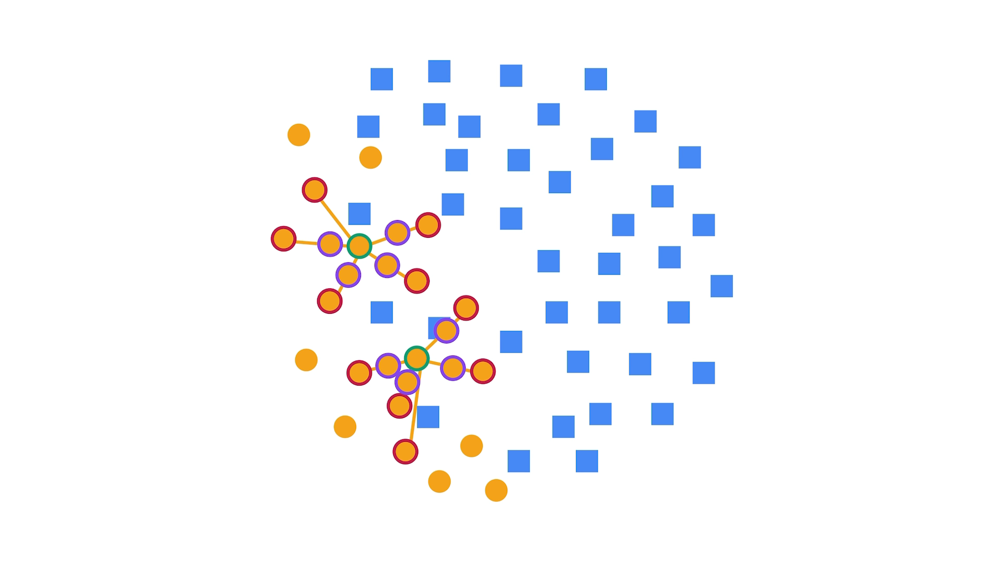

### Undersampling

Berbanding terbalik dengan oversampling, undersampling adalah metode yang mengurangi jumlah sampel dari kelas mayoritas agar sesuai dengan jumlah sampel di kelas minoritas. Teknik ini bekerja dengan menghapus sebagian data dari kelas mayoritas untuk menciptakan keseimbangan antara kelas-kelas.

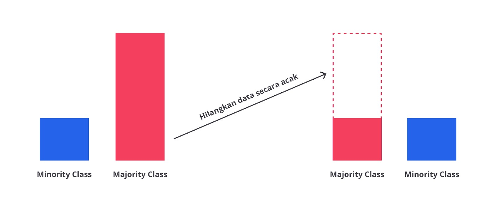

Sama halnya dengan oversampling, metode ini juga memiliki beberapa teknik yang biasanya digunakan ketika Anda ingin mengatasi permasalahan imbalance dataset dengan cara mengurangi data mayoritas seperti random undersampling atau cluster centroids.

- Random Undersampling
  Random undersampling adalah metode sederhana yang menghapus sejumlah sampel dari kelas mayoritas secara acak hingga jumlahnya seimbang dengan kelas minoritas. Contohnya, jika Anda memiliki 100 sampel pada kelas mayoritas dan hanya 10 sampel pada kelas minoritas, random undersampling akan menghapus 90 sampel dari kelas mayoritas sehingga kedua kelas memiliki jumlah yang seimbang.

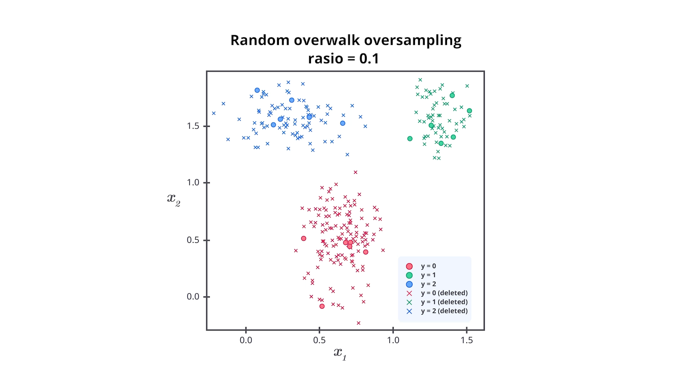

Metode ini memiliki kekurangan karena berpotensi menghilangkan informasi penting dari kelas mayoritas karena menghapus data yang relevan. Selain itu, metode ini dapat menyebabkan underfitting jika terlalu banyak data mayoritas dihapus sehingga model kehilangan kemampuan untuk memahami pola dalam kelas mayoritas.

- Cluster Centroids
  Cluster centroids adalah teknik undersampling yang lebih kompleks. Alih-alih secara acak menghapus sampel dari kelas mayoritas, teknik ini menggunakan algoritma clustering (seperti K-Means) untuk mengelompokkan data mayoritas, lalu memilih centroid dari setiap cluster sebagai representasi dari kelas mayoritas.

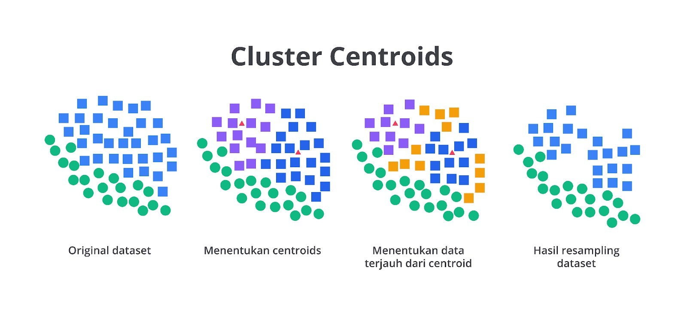

Konsep yang digunakan oleh cluster centroids ini sama halnya dengan metode clustering yang telah Anda pelajari sebelumnya pada materi Unsupervised Learning - Clustering. Namun, tujuan dari pengelompokkan ini untuk mengurangi dataset dengan memilih anggota terdekat dengan centroids.

Dengan menggunakan metode ini, dataset akan mempertahankan representasi data mayoritas dengan lebih baik daripada random undersampling karena tidak sepenuhnya menghapus sampel, tetapi memilih representasi yang lebih penting dan serupa dengan centroids.

Bagai belati bermata dua, metode ini juga memiliki kekurangan yang perlu Anda ketahui. Pertama, metode ini lebih kompleks dan membutuhkan lebih banyak komputasi dibandingkan random undersampling. Kedua, jika data mayoritas memiliki pola yang sangat beragam, teknik ini mungkin tidak selalu mencerminkan keanekaragaman pola tersebut dengan baik (bias sampling).

Sampai di sini, Anda sudah mengetahui metode penanganan ketika menghadapi permasalahan imbalance dataset. Seperti yang Anda sudah pelajari, imbalanced dataset merupakan masalah umum dalam machine learning yang dapat mengakibatkan model yang bias terhadap kelas mayoritas.

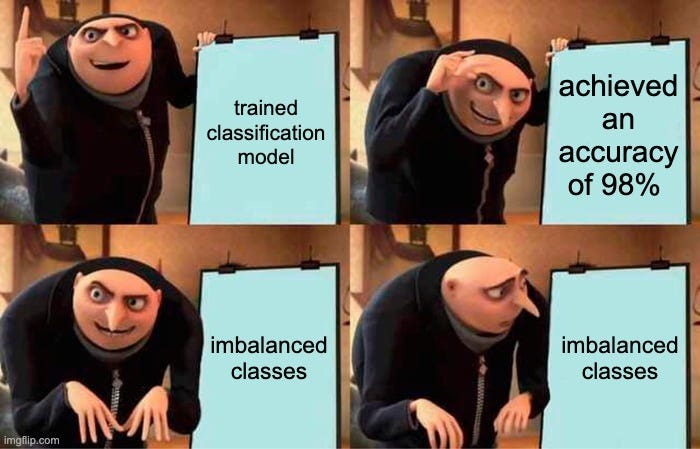

Teknik-teknik seperti oversampling dan undersampling adalah solusi umum untuk menangani ketidakseimbangan ini, dengan oversampling menambah sampel di kelas minoritas dan undersampling mengurangi sampel dari kelas mayoritas. Selain itu, teknik seperti SMOTE, Random Undersampling, dan Cluster Centroids memberikan pendekatan yang lebih kompleks untuk menangani ketidakseimbangan ini. Pemilihan teknik yang tepat tergantung pada karakteristik data dan tujuan analisis.

Eitss, walaupun Anda sudah mengetahui berbagai metode untuk penanganan kasus imbalance dataset, tetapi kami tetap menyarankan untuk melakukan pengumpulan data agar data yang Anda gunakan sepenuhnya asli (terjadi di dunia nyata) dan bukan data sintetis. Namun, jika hal tersebut tidak memungkinkan, jangan sungkan untuk melakukan sampling, ya.

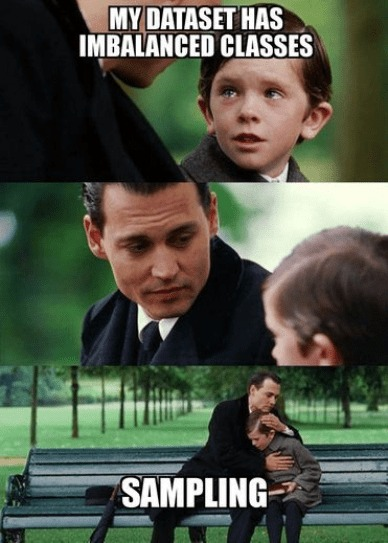
