# Latihan: Studi Kasus Feature Engineering

Selamat datang kembali! Akhirnya Anda sampai di penghujung materi modul Teknik Feature Engineering. Walaupun sudah memahami berbagai macam teori, Anda perlu melakukan berbagai macam praktik agar ilmu yang dimiliki dapat digunakan dengan sangat baik. Hal ini diharapkan dapat meningkatkan progress belajar dengan signifikan sehingga Anda memiliki kemampuan yang lebih baik dari pada sebelumnya.

Setelah sekian purnama Anda mencari ilmu terkait feature engineering, inilah saat yang tepat untuk berlatih membangun model machine learning yang lebih optimal.

Tidak seperti latihan-latihan yang telah Anda lalui di modul sebelumnya, pada modul ini, Anda akan berlatih menggunakan data dummy yang dihasilkan oleh fungsi make_classification(). Fungsi tersebut bertugas untuk menghasilkan data secara acak dengan karakteristik yang dapat disesuaikan.

Seperti biasa, untuk menunjang materi ini silakan import beberapa library berikut.

```bash
import pandas as pd
import numpy as np
from sklearn.datasets import make_classification
from sklearn.model_selection import train_test_split
from sklearn.feature_selection import SelectKBest, f_classif
from sklearn.preprocessing import OneHotEncoder, StandardScaler, KBinsDiscretizer
from sklearn.compose import ColumnTransformer
from sklearn.pipeline import Pipeline
from imblearn.over_sampling import SMOTE
from collections import Counter
from sklearn.ensemble import RandomForestClassifier
```

Pada kasus ini, tulislah kode berikut untuk membuat dataset yang akan digunakan pada latihan.

```bash
X, y = make_classification(n_samples=1000, n_features=15, n_informative=10, n_redundant=2,n_clusters_per_class=1, weights=[0.9], flip_y=0, random_state=42)
```

Alasan penggunaan fungsi tersebut agar Anda dapat mengenal kondisi dataset lainnya berbeda dari data yang sudah disediakan open data seperti Kaggle. Namun, Anda juga dapat melakukan latihan ini pada dataset yang berbeda jika ingin mendapatkan pengalaman yang lebih maksimal.

Setelah menjalankan kode di atas, Anda akan memiliki 1000 data dengan 15 fitur independen dan satu fitur dependen yang berbeda-beda. By default, fungsi ini akan membuat dua buah kelas yang berbeda, tetapi Anda juga bisa menentukan jumlah kelas dengan mengatur nilai n_classes, ya.

Karena pada akhir materi ini kita akan belajar mengenai salah satu metode oversampling, Anda perlu mengatur nilai weights (rasio) untuk membagi jumlah data pada masing-masing kelas. Pada kasus ini, kita akan membagi 90% data untuk kelas pertama, dan 10% data untuk kelas kedua.

Selanjutnya, Anda perlu mengubah nilai acak yang yang tersimpan dengan tipe data array menjadi DataFrame agar lebih mudah diolah dan dicerna oleh orang lain.

```bash
# Menyusun dataset menjadi DataFrame untuk kemudahan
df = pd.DataFrame(X, columns=[f'Fitur_{i}' for i in range(1, 16)])
df['Target'] = y

# Misalkan kita punya beberapa fitur kategorikal (simulasi fitur kategorikal)
df['Fitur_12'] = np.random.choice(['A', 'B', 'C'], size=1000)
df['Fitur_13'] = np.random.choice(['X', 'Y', 'Z'], size=1000)

df
```

Kode di atas akan memetakan nilai acak yang dihasilkan oleh fungsi make_classification() ke DataFrame yang sudah dibangun sehingga akan menghasilkan dataset seperti berikut.

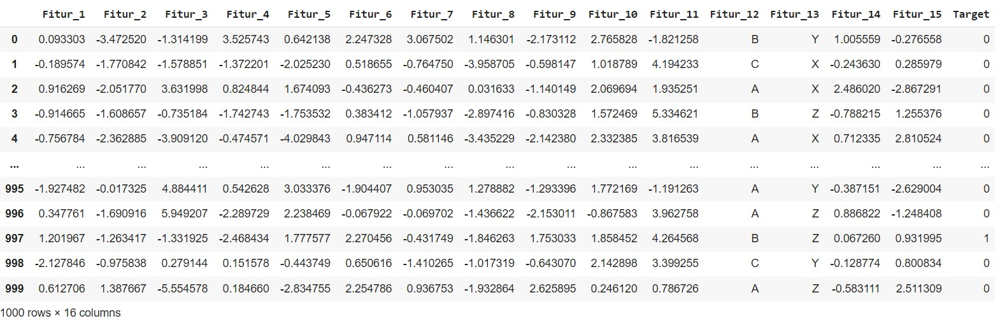

Selanjutnya, Anda perlu memisahkan fitur independen dan dependen untuk mempermudah proses feature engineering yang akan dilakukan.

```bash
# Memisahkan fitur dan target
X = df.drop('Target', axis=1)
y = df['Target']
```

Saat ini, Anda sudah memiliki sebuah dataset yang siap untuk digunakan pada proses feature engineering. Untuk memastikan proporsi data yang ada, silakan cek menggunakan kode berikut.

```bash
# Melihat distribusi kelas
print("Distribusi kelas sebelum SMOTE:", Counter(y))
```

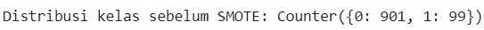

Karena dataset ini memiliki fitur yang cukup banyak, pilihlah fitur (feature selection). Anda dapat menggunakan berbagai macam teknik feature selection yang sebelumnya sudah dipelajari pada materi feature selection. Namun, pada latihan ini mari kita gunakan teknik embedded agar terbiasa dengan teknik yang paling kompleks.

```bash
# ------------------- Embedded Methods -------------------
# Menggunakan Random Forest untuk mendapatkan fitur penting
rf_model = RandomForestClassifier(n_estimators=100, random_state=42)
X_integer = X.drop(['Fitur_12', 'Fitur_13'], axis=1)
rf_model.fit(X_integer, y)

# Mendapatkan fitur penting
importances = rf_model.feature_importances_
indices = np.argsort(importances)[::-1]

# Menentukan ambang batas untuk fitur penting
threshold = 0.05  # Misalnya, ambang batas 5%
important_features_indices = [i for i in range(len(importances)) if importances[i] >= threshold]

# Menampilkan fitur penting beserta nilainya
print("Fitur yang dipilih dengan Embedded Methods (di atas ambang batas):")
for i in important_features_indices:
    # Jika X asli berbentuk DataFrame, maka kita ambil nama kolom
    print(f"{X.columns[i]}: {importances[i]}")

# Mendapatkan nama kolom penting berdasarkan importance
important_features = X_integer.columns[important_features_indices]

# Memindahkan fitur penting ke variabel baru
X_important = X_integer[important_features]  # Hanya fitur penting dari data pelatihan

# X_important sekarang berisi hanya fitur penting
print("\nDimensi data pelatihan dengan fitur penting:", X_important.shape)
```

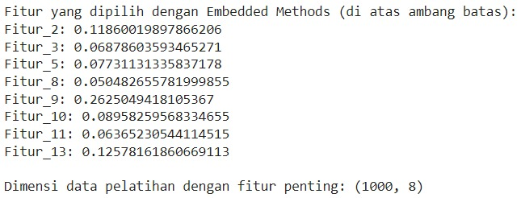

Kode di atas memiliki karakteristik yang sangat mirip dengan contoh kode pada materi feature selection. Di sini, kita menentukan ambang batas hubungan antara variabel sebesar 5% sehingga mendapatkan delapan fitur dengan tipe data numerik. Eiitts, jika Anda penasaran terkait penjelasan kode di atas secara lebih detail, silakan ulas kembali materi feature selection, ya.

Lalu, bagaimana dengan nasib data yang bertipe kategorikal? Tenang, kita tidak akan melupakan mereka. Setelah proses pemilihan fitur numerik dilakukan, Anda perlu menggabungkan data numerik dan kategorikal seperti semula.

```bash
X_Selected = pd.concat([X_important, X['Fitur_12']], axis=1)
X_Selected = pd.concat([X_Selected, X['Fitur_13']], axis=1)
X_Selected
```

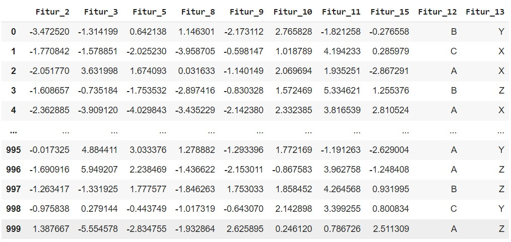

Waiit, apakah Anda menyadari keanehan dari output di atas? Yup, masih terdapat data kategorikal pada dataset di atas. Apakah itu sebuah masalah? Jelas itu sebuah masalah. karena seperti yang sudah Anda pelajari di awal kelas ini bahwa machine learning tidak menerima input berupa kategorikal atau string.

Untuk menyelesaikan permasalahan tersebut, Anda dapat melakukan encoding terhadap fitur dengan tipe data kategorikal. Pada latihan ini, mari kita gunakan Label Encoding karena berasumsi bahwa kategori yang ada memiliki urutan yang logis (hal ini karena kita menggunakan dummy dataset).

```bash
from sklearn.preprocessing import LabelEncoder

label_encoder = LabelEncoder()
# Melakukan Encoding untuk fitur 12
X_Selected['Fitur_12'] = label_encoder.fit_transform(X_Selected['Fitur_12'])
# print(label_encoder.inverse_transform(X_Selected[['Fitur_12']]))
# Melakukan Encoding untuk fitur 13
X_Selected['Fitur_13'] = label_encoder.fit_transform(X_Selected['Fitur_13'])
# print(label_encoder.inverse_transform(X_Selected[['Fitur_13']]))

print(X_Selected)
```

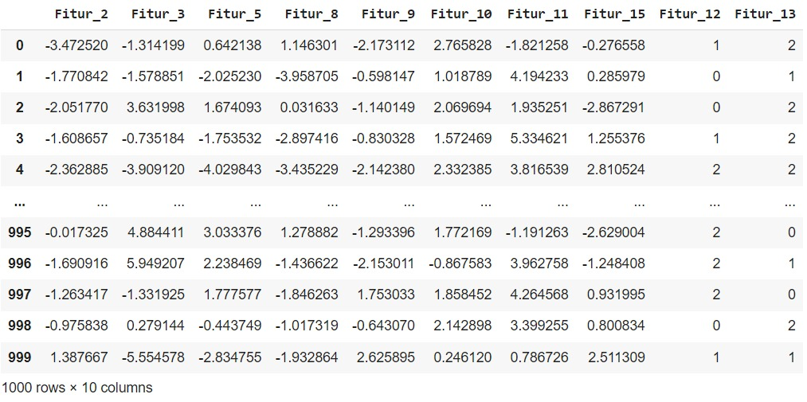

Sampai di sini, semua fitur yang Anda miliki sudah bertipe integer atau numerik. Dengan kondisi seperti ini, dataset yang Anda gunakan sebenarnya sudah siap untuk dilatih. Namun, sebelum melatih dataset tersebut, alangkah baiknya Anda melakukan pengecekan outlier agar model yang dibangun memiliki performa optimal.

Agar lebih terbayang proses pembelajaran ini, salinlah terlebih dahulu dataset yang akan digunakan sebelum mengubahnya. Tujuannya agar Anda dapat membandingkan karakteristik sebelum dan sesudah menangani outlier. Pertama-tama, mari kita mulai dengan menyalin dataset dan menghapus Fitur_12 dan Fitur_13 yang merupakan data hasil encoding.

```bash
import matplotlib.pyplot as plt
import seaborn as sns
import pandas as pd

# Memilih kolom numerik
numeric_columns = X_Selected.select_dtypes(include=['float64', 'int64']).columns
numeric_columns = numeric_columns.drop(['Fitur_12', 'Fitur_13'])

# Membuat salinan data untuk menjaga data asli tetap utuh
X_cleaned = X_important.copy()
```

Selanjutnya, mari kita deteksi outlier dengan menggunakan visualisasi data BoxPlot. Dengan menggunakan visualisasi, Anda tidak perlu memberikan effort yang besar kepada otak (beban kognitif) karena pada dasarnya hanya dengan melihat visualisasi Anda sudah dapat mendeteksi outliers.

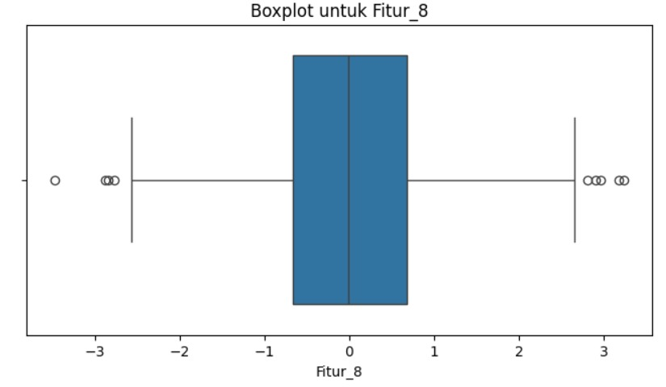

Seperti yang dapat dilihat pada visualisasi di atas, secara langsung dapat disimpulkan bahwa terdapat beberapa nilai outlier pada Fitur_8. Untuk melihat data lengkapnya, silakan ikuti dan jalankan kodenya secara mandiri karena output yang dihasilkan berupa gambar yang cukup besar.

Masih ingatkah Anda bagaimana cara mengatasi outlier pada materi sebelumnya? Benar, salah satu caranya adalah menggunakan teknik interquartile range (IQR). Teknik ini akan mencari nilai batas bawah dan batas atas sehingga Anda dapat menghapus nilai yang berada di luar jangkauan.

```bash
for col in numeric_columns:
    # Melihat outlier dengan IQR (Interquartile Range)
    Q1 = X_important[col].quantile(0.25)
    Q3 = X_important[col].quantile(0.75)
    IQR = Q3 - Q1
    lower_bound = Q1 - 1.5 * IQR
    upper_bound = Q3 + 1.5 * IQR

    # Identifikasi outlier
    outliers = X_cleaned[(X_cleaned[col] < lower_bound) | (X_cleaned[col] > upper_bound)]

    # Menghapus outlier dari DataFrame
    X_cleaned = X_cleaned.drop(outliers.index)
```

Dengan menghapus nilai outlier, Anda memiliki rentang data yang lebih baik dibandingkan dengan sebelum dihilangkan. Untuk memvalidasi perbedaan tersebut, mari kita visualisasikan sekali lagi kolom Fitur_8, lalu bandingkan dengan BoxPlot sebelum outlier dihapus.

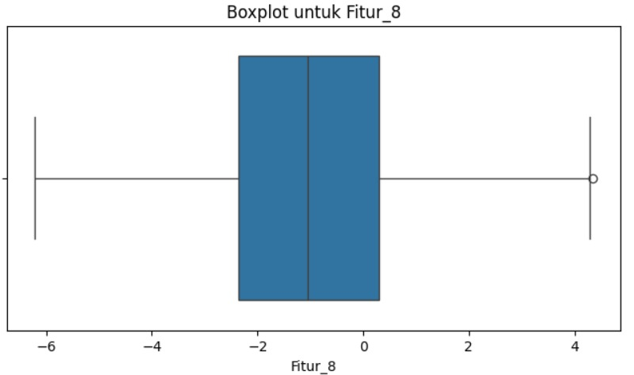

Dari gambar di atas, cukup menggambarkan perbedaannya ‘kan? Jika Anda masih belum yakin, mari kita lihat jumlah data setelah outlier dihilangkan menggunakan kode berikut.

```bash
X_cleaned
```

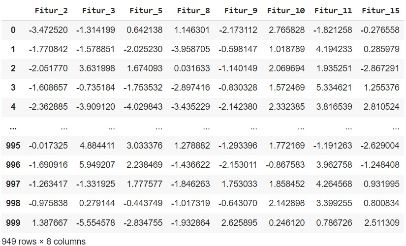

Jumlah data yang Anda miliki sekarang berjumlah 949 data, jumlah ini mungkin akan berbeda dengan latihan mandiri yang dilakukan karena menggunakan fungsi yang menghasilkan data berbeda. Setidaknya, Anda sudah mengetahui bahwa kode sebelumnya dapat menghilangkan outlier yang ada pada dataset.

Setelah berhasil menghilangkan outlier, mungkin Anda merasa bahwa dataset sudah siap untuk dilatih. Eits, sampai di sini, Anda belum melihat distribusi data. Karena data yang kita gunakan merupakan hasil randomize dari fungsi make_classification(), distribusi data yang dihasilkan belum tentu baik. Selain itu, terdapat permasalahan yang sudah kita tentukan sejak awal pembuatan dataset ini yaitu imbalance dataset.

Seperti yang sudah Anda ketahui, kita sudah menentukan pembagian dataset pada pada kasus ini dengan proporsi 90-10, 90% untuk kelas pertama dan 10% untuk kelas kedua. Permasalahan ini perlu Anda selesaikan dengan melakukan oversampling atau undersampling sehingga dataset yang digunakan memiliki proporsi yang seimbang.

Pada kasus ini, kita akan menggunakan teknik SMOTE yang sebelumnya sudah Anda pelajari pada materi Synthetic Minority Oversampling Technique.

```bash
# Inisialisasi SMOTE
smote = SMOTE(random_state=42)

# 3. Melakukan oversampling pada dataset
X_resampled, y_resampled = smote.fit_resample(X_cleaned, y)

# Menampilkan distribusi kelas setelah SMOTE
print("Distribusi kelas setelah SMOTE:", Counter(y_resampled))

# Mengubah hasil menjadi DataFrame untuk visualisasi atau analisis lebih lanjut
X_resampled = pd.DataFrame(X_resampled)
y_resampled = pd.Series(y_resampled, name='Target')
```

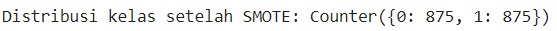

Seperti yang dapat Anda lihat, dataset yang digunakan sudah memiliki proporsi yang seimbang ditandai dengan kedua kelas memiliki jumlah yang sama yaitu 875 data. Selanjutnya, Anda perlu mengecek distribusi data dari kedua kelas tersebut agar dapat mengidentifikasi distribusi data dengan lebih baik.

Pada latihan kali ini, Anda dapat menggunakan kode berikut untuk membuat visualisasi distribusi data.

```bash
# 1. Visualisasi distribusi data sebelum scaling menggunakan histogram
plt.figure(figsize=(10, 6))
for col in X_resampled.columns:
    sns.histplot(X_resampled[col], kde=True, label=col, bins=30, element='step')
plt.title('Distribusi Data Sebelum Scaling (Histogram)')
plt.legend()
plt.show()
```

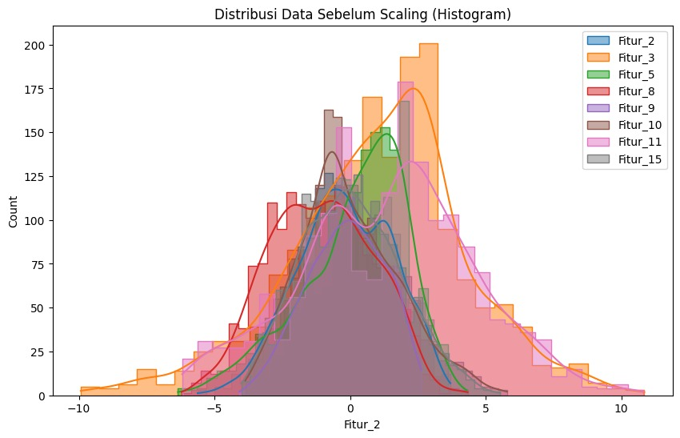

Ternyata distribusi data yang dihasilkan memiliki rentang yang berbeda-beda. Hal ini akan menjadi sebuah masalah karena masing-masing fitur memiliki skala yang berbeda juga. Untuk mengatasi permasalahan tersebut, Anda dapat menggunakan scaling fitur seperti normalisasi atau standardisasi agar distribusi data menjadi lebih baik. Pada kesempatan kali ini, kita akan menggunakan standardisasi agar skala data memiliki skala yang sama serta standar deviasi mendekati satu.

```bash
# Scaling: Standarisasi fitur numerik menggunakan StandardScaler
scaler = StandardScaler()

# Melakukan scaling pada fitur penting
X_resampled[important_features] = scaler.fit_transform(X_resampled[important_features])
```

Setelah Anda melakukan standardisasi seharusnya distribusi data menjadi lebih baik. Untuk melihat perbedaannya, mari kita buat sebuah visualisasi seperti sebelumnya agar dapat melakukan perbandingan.

```bash
# 1. Visualisasi distribusi data sebelum scaling menggunakan histogram
plt.figure(figsize=(10, 6))
for col in X_resampled.columns:
    sns.histplot(X_resampled[col], kde=True, label=col, bins=30, element='step')
plt.title('Distribusi Data Setelah Scaling (Histogram)')
plt.legend()
plt.show()
```

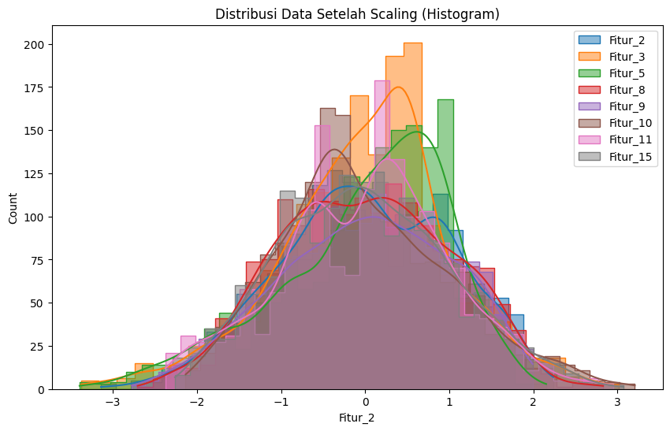

Sampai di sini sudah sangat terlihat ‘kan perbedaannya? Untuk memastikan kembali standardisasi dilakukan dengan baik, silakan Anda gunakan kode berikut untuk melihat karakteristik data dengan lebih detail.

```bash
X_resampled.describe(include='all')
```

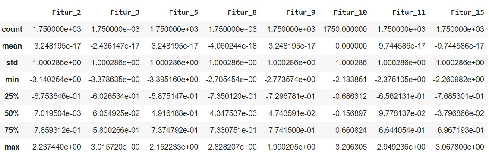

Seluruh fitur yang ada kini sudah memiliki rentang yang serupa dan memiliki standar deviasi mendekati satu. Hal ini berarti proses standardisasi yang Anda lakukan sudah berjalan dengan baik.

Pheew, perjalanan yang cukup panjang ‘kan? Sampai di titik ini, dataset yang Anda miliki sudah lebih siap untuk dilatih menggunakan berbagai macam algoritma klasifikasi. Sebagai penutupan, kami sangat menyarankan untuk terus berlatih menggunakan berbagai macam dataset yang ada di dunia ini. Hal tersebut berguna untuk meningkatkan intuisi sebagai seorang machine learning engineer sehingga kelak Anda dapat menghadapi berbagai macam rintangan yang ada ketika membangun model machine learning.

Tidak terasa saat ini kita sudah berada di penghujung modul feature engineering. Sungguh perjalanan yang luar biasa karena Anda sudah mempelajari berbagai macam metode yang dapat mengoptimalkan proses pembangunan model machine learning.

Proses pembelajaran merupakan kegiatan yang dilakukan seumur hidup. Walaupun Anda sudah menyelesaikan modul ini, bukan berarti semuanya telah berakhir. Pada modul berikutnya, Anda akan mempelajari metode lain untuk mengoptimalkan model machine learning yaitu mengatasi overfitting dan underfitting. Permasalahan tersebut sering kali terjadi ketika Anda tidak melakukan feature engineering dengan baik. Oleh karena itu, jangan sungkan untuk kembali melihat-lihat materi pada modul ini kelak, ya.

Selamat bersenang-senang di modul berikutnya. Sampai jumpa!