# Pengantar Machine Learning

Dalam puluhan tahun terakhir, machine learning telah mengalami kemajuan luar biasa dan terus berkembang berkat upaya para ilmuwan di seluruh dunia. Teknologi ini telah menjadi pusat dari berbagai inovasi teknologi mutakhir dan memainkan peran penting dalam revolusi industri 4.0, yang dipenuhi dengan perubahan digital secara signifikan.

Machine learning bukan hanya mendukung produk-produk canggih, tetapi mengubah cara interaksi dengan teknologi, meningkatkan efisiensi operasional dan membuka peluang baru dalam berbagai sektor industri.


Tahukah Anda, apa itu machine learning?

“A field of study that gives computers the ability to learn without being explicitly programmed.”

– Arthur Samuel, 1959.

Istilah machine learning pertama kali dipopulerkan oleh Arthur Samuel, seorang ahli dalam bidang kecerdasan buatan pada tahun 1959. Samuel mendefinisikan machine learning sebagai cabang ilmu yang memberikan komputer kemampuan untuk belajar dan berkembang tanpa perlu diprogram secara eksplisit untuk setiap tugas.

Artinya, alih-alih memerlukan serangkaian aturan yang ditulis oleh manusia untuk menjalankan suatu tugas, mesin dapat mempelajari pola dari data dan membuat keputusan atau prediksi berdasarkan pembelajaran tersebut. Konsep ini mengubah cara kita mendekati masalah pemrograman, menjadikannya lebih fleksibel dan adaptif terhadap data yang terus berkembang.

Sebelum kita menyelami machine learning lebih dalam, mari kita terlebih dahulu memahami taksonomi artificial intelligence atau kecerdasan buatan. Ini akan memberikan gambaran yang jelas tentang posisi machine learning dalam konteks kecerdasan buatan secara keseluruhan.

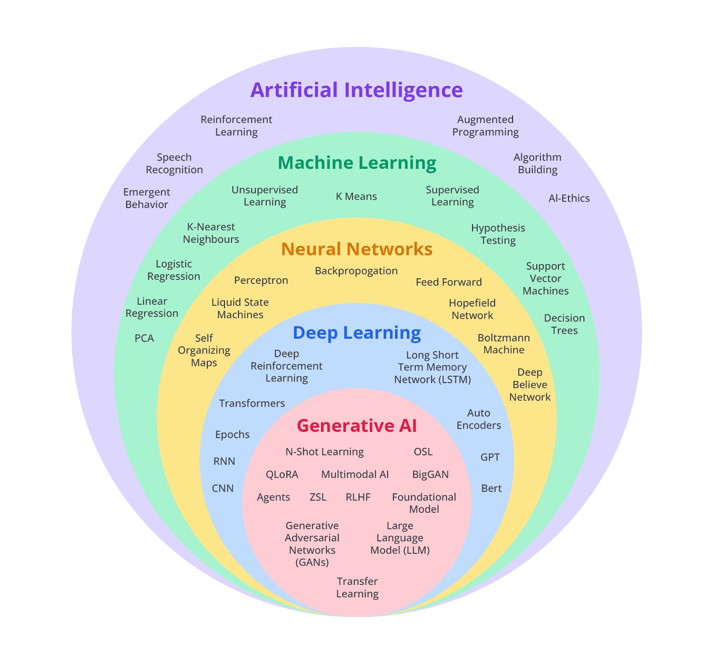

Berikut adalah urutan taksonomi AI secara lebih rinci.

- Artificial Intelligence (AI)
  Artificial intelligence adalah konsep yang mendasari seluruh bidang kecerdasan buatan. Pada tingkat paling dasar, AI mencakup penggunaan komputer atau mesin untuk melakukan tugas yang membutuhkan kecerdasan manusia, seperti pengambilan keputusan, pengenalan pola, dan pemecahan masalah.

- Machine Learning (ML)
  Machine learning adalah cabang dari AI, yaitu sebuah kemampuan ketika komputer dapat belajar dari data tanpa perlu diprogram secara eksplisit. Teknik-teknik ML memungkinkan komputer untuk mengenali pola dalam data, membuat prediksi, dan mengambil keputusan berdasarkan informasi yang dipelajari dari pengalaman atau data latihan.

- Neural Network (NN)
  Neural network adalah model matematis yang terinspirasi dari struktur jaringan saraf manusia. Dalam konteks ML, NN digunakan untuk memproses informasi dan belajar dari data. Model ini terdiri atas neuron-neuron buatan yang saling terhubung dalam lapisan-lapisan dan mampu mempelajari representasi yang semakin abstrak dari data.

- Deep Learning (DL)
  Deep learning adalah sub-bidang dari ML yang menggunakan NN dengan banyak lapisan atau deep neural network (DNN) untuk memahami representasi data yang abstrak dan kompleks. DL telah menghasilkan kemajuan besar dalam bidang pengenalan gambar, pemrosesan bahasa alami, dan berbagai aplikasi AI lainnya.

- Gen AI
  Generative AI adalah cabang dari AI yang berfokus pada penciptaan konten baru dan orisinal. Generative AI memiliki kemampuan untuk menghasilkan teks, gambar, musik, video, dan bentuk konten lainnya yang belum pernah ada sebelumnya. Ini berbeda dengan AI tradisional yang biasanya beroperasi berdasarkan aturan dan data.

Nah, setelah Anda mempelajari konsep dasar AI dalam kelas Belajar Dasar AI, kini saatnya bagi kita melanjutkan pembelajaran ke bagian machine learning.

Mari kita mundur sejenak ke masa sebelum machine learning belum begitu hype. Seperti dikemukakan oleh Moroney, prinsip atau paradigma pemrograman sejak permulaan era komputasi direpresentasikan dalam diagram berikut.

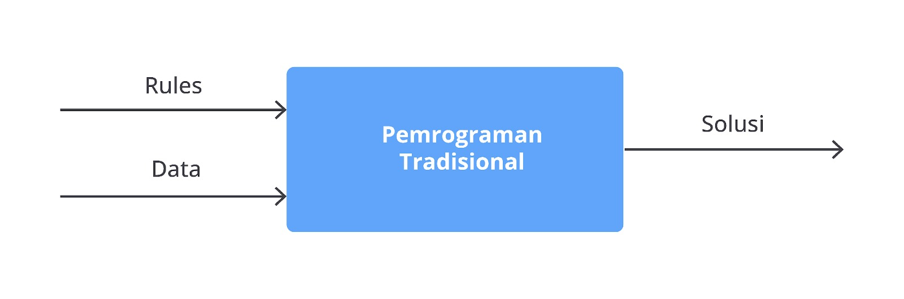

Aturan dan data berfungsi sebagai input untuk sistem. Aturan tersebut secara eksplisit dinyatakan dalam bahasa pemrograman dan data tambahan yang dimasukkan akan menghasilkan solusi sebagai output. Paradigma pemrograman yang menggambarkan proses ini sering disebut sebagai pemrograman tradisional.

Pemrograman tradisional memiliki beberapa keterbatasan. Sistem ini cenderung kaku karena tergantung pada serangkaian aturan “if” dan “else” untuk memproses data atau merespons input. Sebagai contoh, dalam membuat program untuk mendeteksi aktivitas fisik, kita dapat menggunakan parameter, seperti "kecepatan" dalam membedakan berbagai jenis aktivitas.

Misalnya, untuk mendeteksi aktivitas seperti berjalan, kita bisa membuat algoritma sederhana menggunakan bahasa pemrograman Python. Logika yang digunakan adalah membandingkan nilai kecepatan dengan nilai ambang batas yang sudah ditentukan.

Pertama, kita bisa menetapkan bahwa kecepatan kurang dari 4 km/jam mengindikasikan seseorang sedang berjalan. Algoritma untuk mendeteksi aktivitas berjalan sebagai berikut.

```bash
if kecepatan < 4:
    aktivitas = BERJALAN
```

Dalam contoh ini, ketika variabel kecepatan memiliki nilai di bawah 4 km/jam, program pun akan menetapkan nilai aktivitas menjadi "BERJALAN".

Untuk aktivitas berlari, kecepatannya biasanya lebih tinggi, misalnya 4 km/jam. Oleh karena itu, algoritmanya dapat ditulis seperti ini. Algoritma ini digunakan untuk mengidentifikasi aktivitas fisik berdasarkan kecepatan yang diukur. Pertama, algoritma memeriksa bahwa nilai kecepatan kurang dari 4 km/jam.

Jika kondisi ini benar, yaitu kecepatan di bawah 4 km/jam, maka aktivitas akan diklasifikasikan sebagai "BERJALAN". Ini menunjukkan bahwa jika seseorang bergerak dengan kecepatan di bawah 4 km/jam, program akan menganggap aktivitas tersebut sebagai berjalan.

```bash
if kecepatan < 4:
    Aktivitas = BERJALAN
else:
   Aktivitas = BERLARI
```

Namun, jika kecepatan sama dengan atau lebih besar dari 4 km/jam, algoritma akan melanjutkan ke bagian else. Dalam bagian ini, aktivitas akan diklasifikasikan sebagai "BERLARI".

Jika kecepatan melebihi 12 km/jam, kita bisa menganggap aktivitas tersebut sebagai bersepeda. Logika untuk mendeteksi aktivitas bersepeda telah ditambahkan pada algoritma sebelumnya.

```bash
if kecepatan < 4:
    aktivitas = BERJALAN
elif kecepatan < 12:
    aktivitas = BERLARI
else
    aktivitas = BERSEPEDA
```

Sekarang, algoritma ini dapat mendeteksi tiga jenis aktivitas. Jika kecepatan di bawah 4 km/jam, aktivitas diidentifikasi sebagai "BERJALAN". Jika kecepatan berada antara 4 km/jam dan 12 km/jam, aktivitas diidentifikasi sebagai "BERLARI". Lalu, jika kecepatan lebih dari 12 km/jam, program akan mengklasifikasikan aktivitas sebagai "BERSEPEDA".

Namun, masalah muncul ketika kita mencoba mendeteksi aktivitas yang lebih rumit, seperti bermain basket. Aktivitas ini melibatkan berbagai jenis gerakan, seperti berjalan, berlari, dan berhenti yang sulit dijelaskan hanya dengan aturan sederhana. Pemrograman tradisional menjadi sangat rumit karena harus membuat aturan khusus untuk setiap jenis aktivitas yang mungkin terjadi.

Di sinilah machine learning hadir sebagai solusi. Berbeda dari pemrograman tradisional, machine learning memberikan kemampuan kepada komputer untuk belajar dari data tanpa perlu menulis aturan secara manual.

Misalnya, dengan machine learning, kita bisa memberikan data yang berisi berbagai aktivitas—seperti berjalan, berlari, bersepeda, dan bermain basket—serta fitur-fitur seperti kecepatan dan pola gerakan.

Model machine learning akan menganalisis data ini untuk menemukan pola-pola yang membantu dalam mendeteksi jenis aktivitas. Jadi, alih-alih menulis aturan satu per satu, kita cukup melatih model dengan data dan model ini akan belajar mengenali berbagai aktivitas berdasarkan pola yang ada.


Dalam machine learning, kita berurusan dengan sejumlah besar data dan label terkait. Data adalah informasi yang kita miliki dan gunakan, sedangkan rules adalah informasi yang ingin kita prediksi atau klasifikasikan. Dengan memahami hubungan antara data dan label, kita dapat memanfaatkan machine learning untuk mengidentifikasi pola-pola dalam data tersebut.

# Komponen Utama dalam Machine Learning

Pada machine learning, terdapat beberapa komponen utama yang sangat penting dalam proses pembangunan model yang efektif. Setiap komponen memainkan peran krusial untuk memastikan bahwa model tidak hanya akurat, tetapi juga dapat diandalkan dalam situasi nyata.

Berikut adalah penjelasan dari setiap komponen utama tersebut.

## Data

Data adalah bahan dasar dalam machine learning. Tanpa data, model tidak bisa dilatih atau dipelajari. Data terdiri dari fitur (atribut atau variabel input) dan label (hasil yang ingin diprediksi). Kualitas dan kuantitas data memengaruhi kinerja model. Data juga harus bersih, relevan, dan cukup representatif untuk masalah yang dihadapi.


Untuk model klasifikasi, data bisa berupa kumpulan gambar bunga iris yang masing-masing diberi label dengan jenis spesiesnya, seperti "Setosa," "Versicolor." atau "Virginica."

## Algoritma

Algoritma adalah prosedur atau metode yang digunakan untuk melatih model dengan data. Algoritma menentukan cara model akan belajar dari data dan mengoptimalkan proses pembelajaran. Setiap algoritma memiliki cara kerja dan teknik optimasi yang berbeda.


Contoh: Algorima Gradient Descent digunakan untuk mengoptimalkan parameter model dalam jaringan syaraf tiruan.

## Model

Model adalah kumpulan perhitungan matematis atau aturan yang dihasilkan dari proses mempelajari pola dari data. Model dapat berupa berbagai jenis algoritma, seperti regresi linier, decision tree, atau jaringan syaraf tiruan (neural networks). Model ini dilatih menggunakan data untuk membuat prediksi atau klasifikasi.

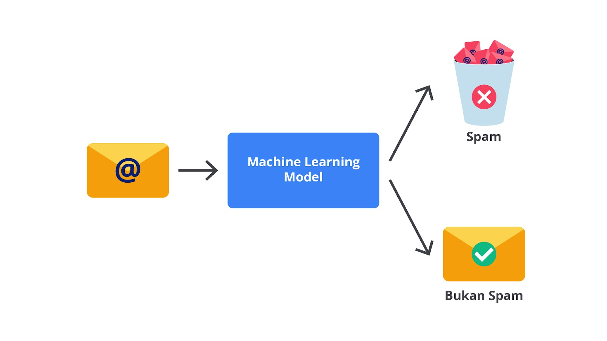

Contoh: Dalam model klasifikasi email spam, model bisa menggunakan algoritma Naive Bayes atau Support Vector Machine (SVM).

## Feature Engineering

Feature engineering adalah proses mengubah data mentah menjadi fitur yang lebih relevan dan informatif untuk model. Ini melibatkan pemilihan, transformasi, dan pembuatan fitur baru dari data yang ada. Fitur engineering penting untuk meningkatkan kinerja model.


Contoh: Dalam analisis sentimen, fitur engineering bisa mencakup ekstraksi kata-kata kunci dari teks dan konversi ke bentuk numerik, seperti frekuensi kata.

## Training

Training adalah proses model belajar dari data. Selama pelatihan, model memproses data dan memperbarui parameter untuk meminimalkan kesalahan atau meningkatkan akurasi. Proses ini melibatkan penggunaan data latih dan sering kali melibatkan pembagian data menjadi set pelatihan dan set validasi.

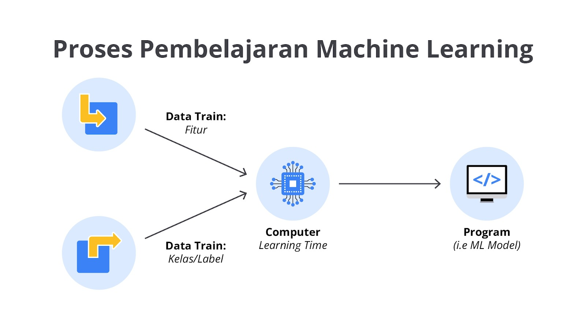

Contoh: Melatih model regresi linier untuk memprediksi harga rumah berdasarkan fitur seperti ukuran rumah dan lokasi.

## Evaluation

Evaluation adalah proses menilai kinerja model menggunakan data yang tidak digunakan selama pelatihan (data uji). Ini melibatkan metrik evaluasi, seperti akurasi, precision, recall, dan F1-score untuk menentukan seberapa baik model dalam membuat prediksi atau klasifikasi.

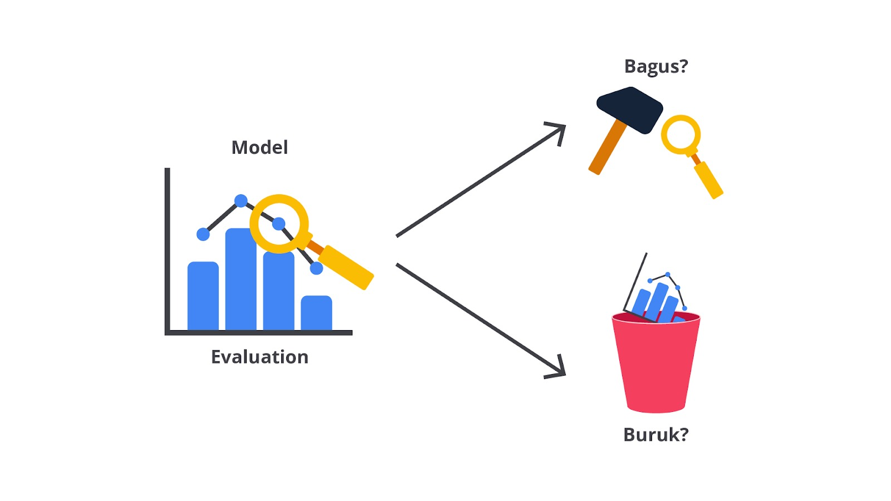

Contoh: Menggunakan confusion matrix untuk mengevaluasi kinerja model klasifikasi email spam.

## Hyperparameter Tuning

Hyperparameter tuning adalah proses mengoptimalkan parameter-parameter di luar model yang dapat memengaruhi kinerja model. Hyperparameter tidak dipelajari selama pelatihan, tetapi disetel secara manual atau menggunakan teknik pencarian otomatis.

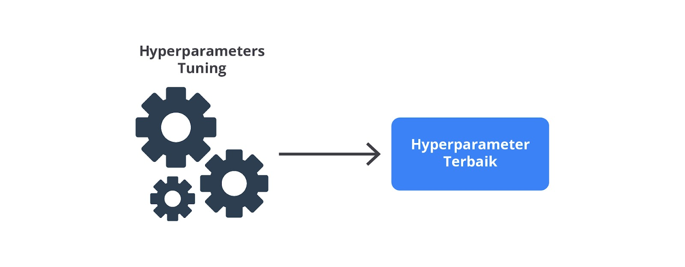

Contoh: Mengatur jumlah “pohon” dan maximum depth dalam algoritma Random Forest untuk meningkatkan akurasi model.

## Deployment

Deployment adalah tahap akhir saat model yang sudah dilatih dan dievaluasi diterapkan dalam lingkungan produksi untuk digunakan pada aplikasi nyata. Ini melibatkan integrasi model ke dalam sistem atau aplikasi yang akan memanfaatkan model untuk membuat prediksi atau keputusan.


Contoh: Mengintegrasikan model prediksi harga saham ke dalam aplikasi trading untuk memberikan rekomendasi kepada pengguna.

Dengan memahami dan mengelola komponen-komponen ini dengan baik, Anda bisa membangun dan menerapkan model machine learning yang efektif serta efisien.

# Jenis-Jenis Machine Learning

Pada materi sebelumnya, kita telah membahas definisi machine learning. Apakah kamu sudah memahaminya dengan baik? Jika iya, sekarang saatnya kita melanjutkan kepada penjelasan berikutnya.

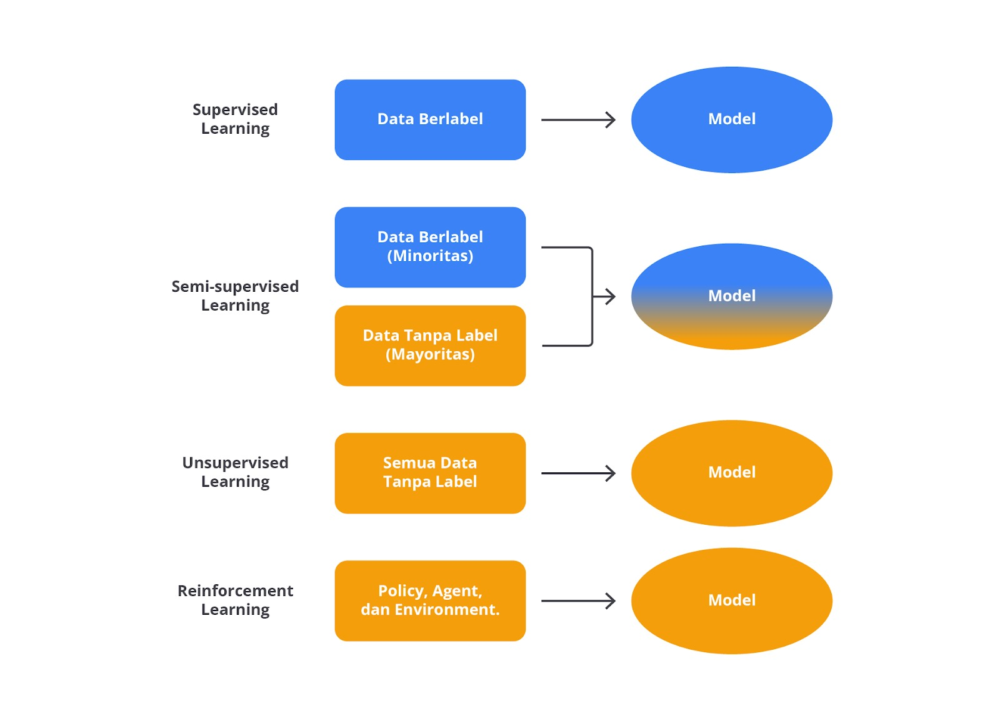

## Supervised Learning

Supervised learning, atau pembelajaran terawasi, merupakan jenis machine learning dengan melibatkan pelatihan model menggunakan data yang sudah diberi label. Setiap contoh dalam data pelatihan memiliki input dan output yang diketahui.

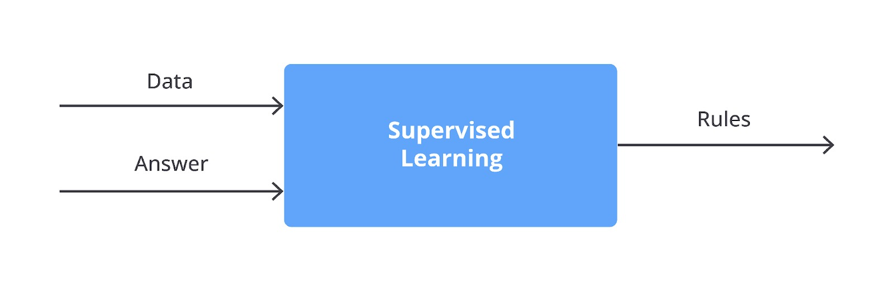

Tujuan supervised learning adalah mempelajari hubungan atau fungsi yang menghubungkan input dengan output. Jadi, model dapat membuat prediksi akurat untuk data baru yang belum pernah dilihat sebelumnya.

Dalam supervised learning, input adalah data dengan fitur-fitur tertentu dan jawaban adalah hasil atau label yang diketahui untuk data tersebut. Model belajar dari input dan jawaban untuk mengembangkan aturan atau pola yang menghubungkan fitur dengan hasil. Aturan ini kemudian digunakan untuk memprediksi hasil dari data baru.

Supervised learning bisa diibaratkan seperti seorang guru yang mengajarkan murid cara menyelesaikan tugas tertentu. Mesin atau komputer berperan sebagai murid yang belajar dari contoh-contoh yang diberikan oleh guru, yaitu data yang sudah diberi label dengan benar.


Misalnya, kita memiliki dataset berisi informasi tentang rumah, seperti ukuran rumah, jumlah kamar tidur, dan lokasi, yang kita sebut sebagai data latih. Setiap baris data ini sudah dilabeli dengan harga rumah yang sesuai.

Dalam hal ini, ukuran rumah, jumlah kamar tidur, dan lokasi adalah fitur, sementara harga rumah adalah label/target yang kita ingin prediksi.

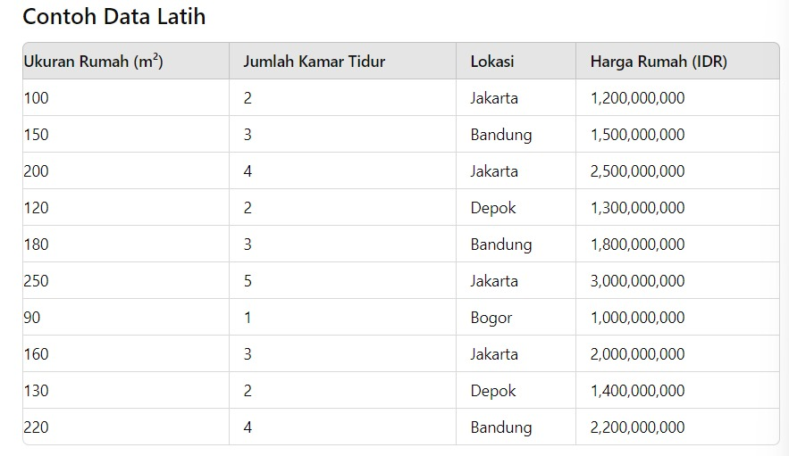

Model machine learning mempelajari data latih untuk memahami pengaruh setiap fitur, seperti ukuran rumah dan jumlah kamar tidur terhadap harga rumah. Setelah latihan selesai, model diuji menggunakan data baru, dikenal sebagai data uji, yang belum pernah dilihat sebelumnya dan tidak memiliki harga yang diketahui.

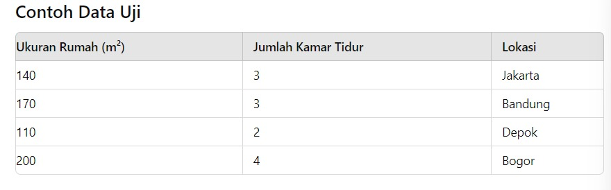

Data uji, seperti rumah berukuran 140 m² dengan 3 kamar tidur di Jakarta, digunakan untuk memprediksi harga berdasarkan pola yang dipelajari dari data latih. Jika data uji mirip dengan data latih, model akan memprediksi harga dalam kisaran yang sama. Jika ada perbedaan, seperti ukuran yang lebih besar atau lokasi yang berbeda, model akan menyesuaikan prediksinya.

Dengan cara ini, model supervised learning dapat memprediksi harga rumah baru menggunakan informasi dari data latih.

## Unsupervised Learning

Unsupervised learning, atau pembelajaran tak terawasi, melibatkan pelatihan model menggunakan data yang tidak memiliki label atau hasil yang sudah ditentukan. Data ini hanya berisi fitur-fitur yang mendeskripsikan informasi, tanpa informasi tentang hasil yang seharusnya.

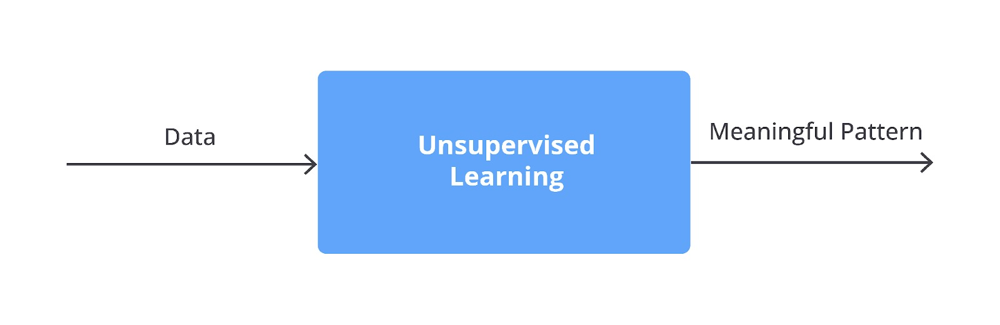

Tujuan dari unsupervised learning adalah mengidentifikasi pola, struktur, atau hubungan yang tidak langsung terlihat dalam data. Model mencari cara untuk mengelompokkan, mengidentifikasi, atau mengurangi dimensi data tanpa arahan eksplisit tentang hasil yang diinginkan.

Unsupervised learning bekerja ibarat mencari pola tanpa petunjuk khusus. Bayangkan kita memiliki data tentang mobil, seperti merek, tahun pembuatan, dan jarak tempuh, tetapi tidak ada label harga atau kategori yang sudah ditentukan.


Ketika kita menggunakan unsupervised learning, model tidak diberi tahu tentang hal yang harus dicari atau cara mengelompokkan data. Sebagai gantinya, model mencari pola atau struktur dalam data itu sendiri.

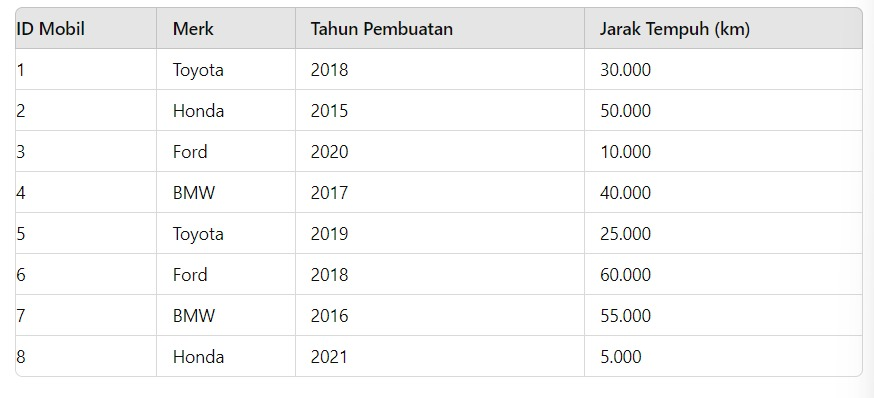

Misalnya, model clustering akan menghasilkan hasil berikut.

- Kelompok 1: Mobil dengan merek Toyota dan jarak tempuh rendah.

Contoh mobil: ID 1, ID 5

- Kelompok 2: Mobil dengan merek Ford dan jarak tempuh tinggi.

Contoh mobil: ID 3, ID 6

- Kelompok 3: Mobil dengan merek BMW dan jarak tempuh menengah.

Contoh mobil: ID 4, ID 7

Kelompok-kelompok ini adalah hasil dari analisis clustering dan sekarang berfungsi sebagai label baru untuk data. Misalnya, jika ada mobil baru yang memiliki karakteristik mirip dengan mobil pada Kelompok 1, ia akan digolongkan dalam kelompok yang sama.

Dengan demikian, kelompok-kelompok ini menyediakan cara untuk mengelompokkan data berdasarkan pola yang ditemukan oleh model meskipun sebelumnya data tidak memiliki label yang jelas.

Data uji berisi informasi mobil yang belum pernah dilihat oleh model selama pelatihan dan juga tidak memiliki label. Data ini digunakan untuk menguji kemampuan model clustering dalam mengelompokkan mobil baru berdasarkan fitur yang ada.

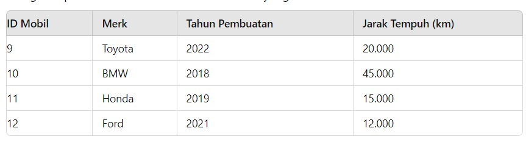

Kemudian, ketika kita memperkenalkan data baru tentang mobil yang belum pernah dilihat sebelumnya, seperti mobil Toyota tahun 2022 atau BMW tahun 2018, model akan mengelompokkan mobil-mobil ini dalam kelompok berdasarkan pola yang sudah dipelajari.

## Semi-Supervised Learning

Semi-supervised learning (SSL) adalah pendekatan dalam machine learning yang menggabungkan elemen dari supervised learning dan unsupervised learning. Dalam metode ini, model dilatih menggunakan data yang terdiri dari sebagian data berlabel (supervised) dan sebagian data tidak berlabel (unsupervised).

Tujuan utama dari semi-supervised learning adalah memanfaatkan data tidak berlabel untuk meningkatkan akurasi model dengan meminimalkan ketergantungan pada data berlabel yang mungkin terbatas.

Semi-supervised learning berguna ketika kita memiliki sedikit data yang sudah diberi label dan banyak data yang belum diberi label. Bayangkan kamu memiliki beberapa gambar hewan dengan label, seperti "anjing", "kucing", dan "kelinci" serta banyak gambar lainnya tanpa label.

Langkah pertama adalah melatih model dengan gambar yang sudah diberi label untuk mengenali ciri-ciri, seperti bentuk telinga atau pola bulu dari masing-masing kategori. Setelah memahami ciri-ciri ini, model kemudian memeriksa gambar-gambar yang belum diberi label dan mencari pola mirip dengan yang sudah dikenali sebelumnya.

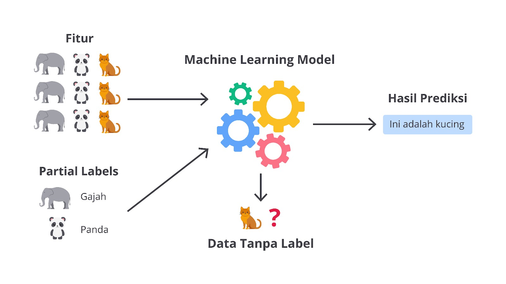

Misalnya, jika kamu memiliki 20 gambar yang sudah diberi label serta 200 gambar tanpa label, model akan belajar dari gambar-gambar berlabel untuk memahami perbedaan antara "anjing", "kucing", dan "kelinci". Kemudian, model akan mencoba menebak label untuk gambar tanpa label berdasarkan hal yang telah dipelajarinya. Jika melihat gambar dengan telinga panjang dan berbulu, model mungkin akan mengidentifikasinya sebagai "kelinci".

Dengan metode ini, model semi-supervised learning memanfaatkan data yang belum diberi label untuk membuat prediksi lebih akurat dan efisien berdasarkan informasi yang ada dalam memperbaiki kemampuan prediksinya.

Dalam semi-supervised learning, kita sering memiliki kombinasi data yang sudah diberi label dan data yang belum diberi label. Misalnya, bayangkan kita punya tabel berisi informasi tentang rumah dengan beberapa baris yang sudah lengkap termasuk ukuran rumah, jumlah kamar, lokasi, dan harga, serta beberapa baris lainnya yang hanya mencantumkan ukuran, jumlah kamar, dan lokasi tanpa harga.

Data yang sudah diberi label (misalnya harga rumah sudah diketahui) digunakan untuk melatih model agar bisa memahami hubungan antara ukuran rumah, jumlah kamar, lokasi, dan harga. Setelah model belajar dari data ini, kita kemudian menggunakan model untuk memprediksi harga rumah pada baris yang belum diberi label.

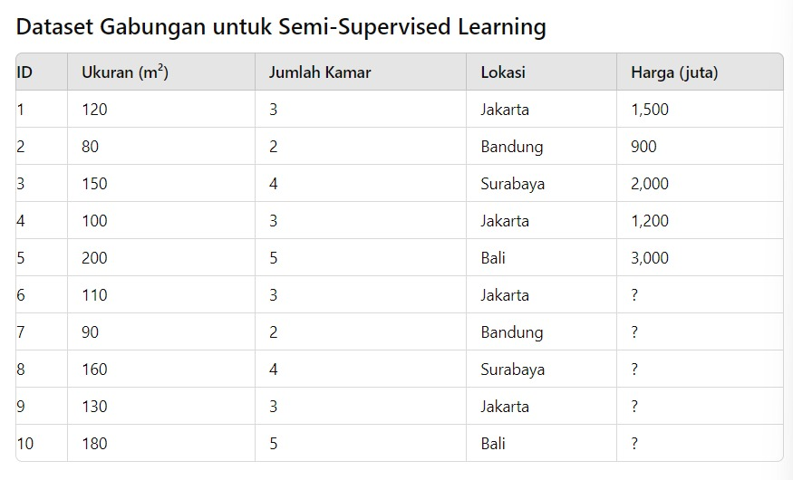

Misalnya, kita memiliki lima rumah dengan harga yang sudah diketahui dan lima rumah lain tanpa harga. Model akan belajar dari rumah yang harganya sudah ada untuk memperkirakan harga rumah yang belum diberi label. Dengan cara ini, model dapat menggunakan informasi dari data yang sudah ada untuk memberikan prediksi lebih baik untuk data tidak lengkap.

## Reinforcement Learning

Reinforcement learning (RL) adalah salah satu cabang pembelajaran mesin (machine learning) berfokus pada cara agen belajar mengambil tindakan dalam lingkungan tertentu agar memaksimalkan hadiah (reward) yang diterima lingkungan itu sendiri. Dalam RL, agen belajar melalui percobaan dan kesalahan; agen mencoba tindakan tertentu, melihat hasilnya (reward), serta memperbarui pengetahuannya tentang tindakan yang lebih baik pada situasi tertentu.

Di dunia RL, terdapat empat komponen utama yang membentuk inti dari cara agen belajar dan berinteraksi dengan lingkungan. Pertama, agent adalah entitas yang belajar dan bertindak. Kedua, environment adalah dunia tempat agen beroperasi. Ketiga, action adalah pilihan yang tersedia bagi agen. Keempat, state (keadaan) yang menggambarkan keadaan awal agen sebelum melakukan tindakan atau keadaan agen setelah melakukan tindakan. Terakhir, reward atau reinforcement adalah memberikan umpan balik kepada agen berdasarkan tindakan yang diambilnya.

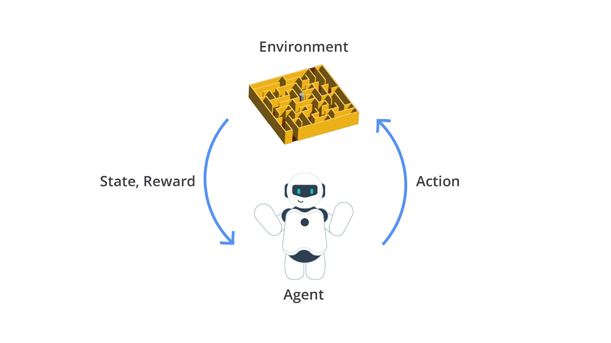

Materi ini dibahas tuntas pada kelas Belajar Pengembangan Machine Learning. Jangan lupa untuk enroll kelasnya, ya!

Dengan mempelajari dan menerapkan jenis-jenis machine learning ini secara tepat, Anda dapat mengembangkan solusi yang lebih efektif dan efisien, serta membuat keputusan lebih cerdas dalam berbagai konteks. Selamat belajar dan semoga pengetahuan ini membantu Anda dalam memahami machine learning lebih baik lagi!

# Machine Learning Use Case

Machine learning telah menjadi bagian integral dari kehidupan sehari-hari tanpa kita sadari. Dari aplikasi yang mempersonalisasi pengalaman digital kita hingga sistem yang menjaga keamanan dan kenyamanan, machine learning memainkan peran penting dalam berbagai aspek kehidupan.

Penggunaan machine learning sehari-hari mencakup berbagai aplikasi, yakni rekomendasi produk, penyaringan email spam, asisten suara, dan banyak lagi. Dalam setiap kasus ini, algoritma machine learning diterapkan untuk menganalisis data, mengidentifikasi pola, serta membuat prediksi atau keputusan yang meningkatkan efisiensi dan pengalaman pengguna.

Untuk memahaminya lebih lanjut, mari kita lihat secara rinci penerapan machine learning dalam sepuluh contoh penggunaan sehari-hari serta jenis pembelajaran yang digunakan pada setiap kasus.

# Sistem Rekomendasi

Layanan seperti Netflix atau Amazon menggunakan machine learning untuk merekomendasikan film, acara, atau produk berdasarkan riwayat aktivitas pengguna. Algoritma machine learning mempelajari preferensi Anda dari pengumpulan data, seperti film yang ditonton sebelumnya atau riwayat pembelian produk, dan mencocokkannya dengan preferensi pengguna lain yang serupa.


Algoritma ini bisa menggunakan teknik supervised learning atau unsupervised learning, seperti regresi atau klasifikasi, untuk memprediksi hal yang mungkin Anda suka berdasarkan data historis dan perolehan umpan balik. Ini karena algoritma dilatih menggunakan data yang telah diberi label (misalnya, film yang Anda suka atau tidak suka) untuk membuat prediksi.

## Penyaringan Email Spam

Pada layanan email, seperti Gmail, machine learning digunakan untuk mengidentifikasi dan memfilter email spam. Algoritma ML menganalisis pola dan konten email, seperti kata-kata yang sering muncul dalam email spam dan membandingkannya dengan email yang Anda tandai sebagai spam.

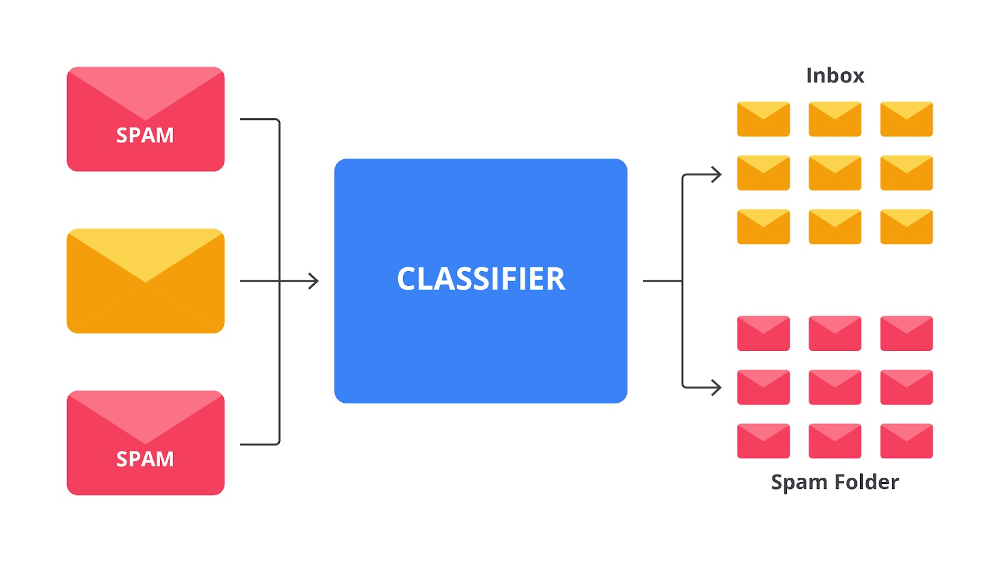

Dengan menggunakan teknik supervised learning, algoritma dilatih pada data email yang sudah diberi label (spam atau tidak spam) untuk mengklasifikasikan email baru. Data pelatihan terdiri dari email yang sudah diberi label sebagai spam atau tidak spam dan model dilatih untuk mengklasifikasikan email baru berdasarkan label ini.

## Asisten Suara

Asisten suara, seperti Siri atau Google Assistant menggunakan machine learning untuk memahami dan merespons perintah suara. Algoritma machine learning memproses bahasa alami dengan menganalisis data suara dan konteks untuk memberikan jawaban atau melakukan tindakan.


Ini melibatkan teknik supervised learning dalam melatih model menggunakan data percakapan berlabel dan teknik unsupervised learning untuk memahami konteks serta makna dari data suara yang tidak terstruktur.

## Pengenalan Gambar atau Face Detection

Facebook menggunakan machine learning untuk menandai wajah dalam foto. Algoritma pengenalan gambar mempelajari fitur wajah dari banyak foto yang telah diberi label, seperti nama orang dalam foto. Algoritma ini kemudian dapat mengenali wajah baru dan mencocokkannya dengan profil yang ada.


Proses ini termasuk teknik supervised learning karena model dilatih dengan data gambar berlabel. Data pelatihan berisi gambar yang sudah diberi label dengan nama orang dan model dilatih untuk mengenali wajah berdasarkan label tersebut.

## Deteksi Penipuan

Bank menggunakan machine learning untuk mendeteksi transaksi yang mencurigakan. Algoritma menganalisis pola transaksi normal dan menyimpang untuk mendeteksi aktivitas yang tidak biasa. Algoritma ini sering menggunakan unsupervised learning untuk menemukan pola yang tidak diketahui dalam data transaksi dan supervised learning jika data historis dengan label penipuan digunakan.


Unsupervised learning digunakan untuk menemukan pola baru tanpa label, sedangkan supervised learning dimanfaatkan jika data penipuan yang sudah diberi label tersedia.

## Chatbot Layanan Pelanggan

Chatbot menggunakan ML untuk memahami dan merespons pertanyaan pelanggan. Algoritma ini dilatih menggunakan data percakapan yang telah diberi label untuk belajar cara menjawab berbagai jenis pertanyaan.


Supervised learning digunakan dalam melatih model dengan data percakapan yang sudah diberi label dan unsupervised learning untuk memahami pola dari data percakapan yang lebih luas. Supervised learning berguna dalam pelatihan awal dengan data yang diberi label serta unsupervised learning dipakai untuk memahami variasi dan konteks dalam data percakapan.

## Diagnostik Kesehatan

Machine learning digunakan dalam analisis gambar medis, seperti MRI untuk membantu mendiagnosis penyakit. Algoritma ML dilatih dengan gambar medis yang sudah diberi label dengan kondisi kesehatan tertentu untuk mendeteksi penyakit atau kelainan.


Supervised learning digunakan karena model dilatih menggunakan data gambar yang sudah diberi label dengan diagnosis medis. Data pelatihan berupa gambar medis yang telah diberi label dengan kondisi kesehatan dan model dilatih untuk mengenali pola dalam gambar berdasarkan label ini.

Dengan penjelasan ini, Anda dapat memahami penerapan machine learning dalam berbagai aplikasi sehari-hari dan jenis pembelajaran yang digunakan untuk masing-masing kasus.
