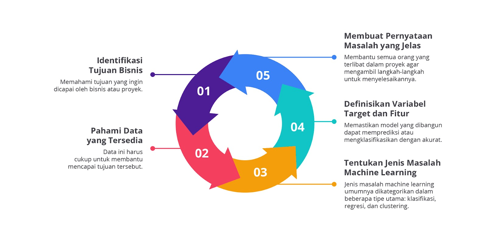
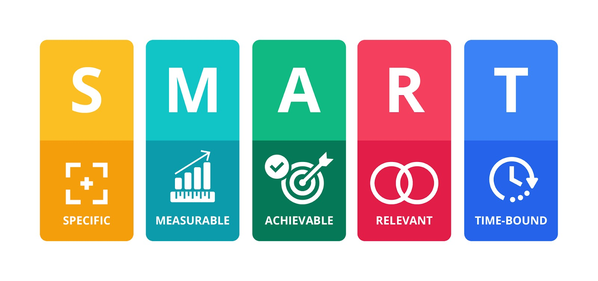
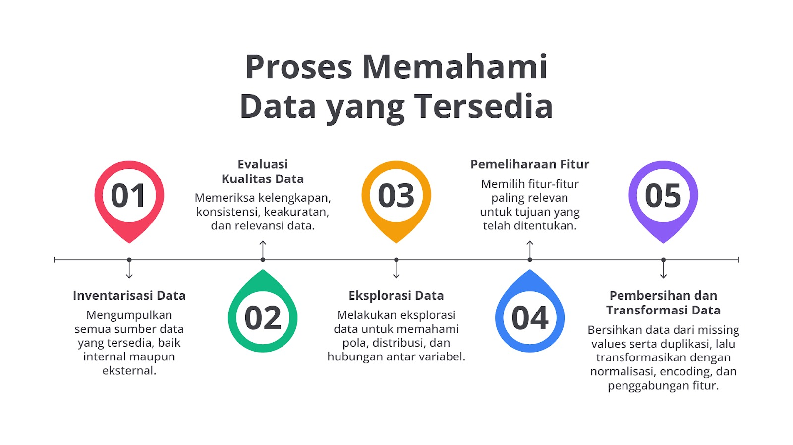
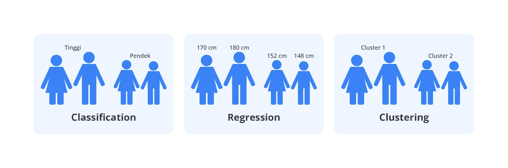
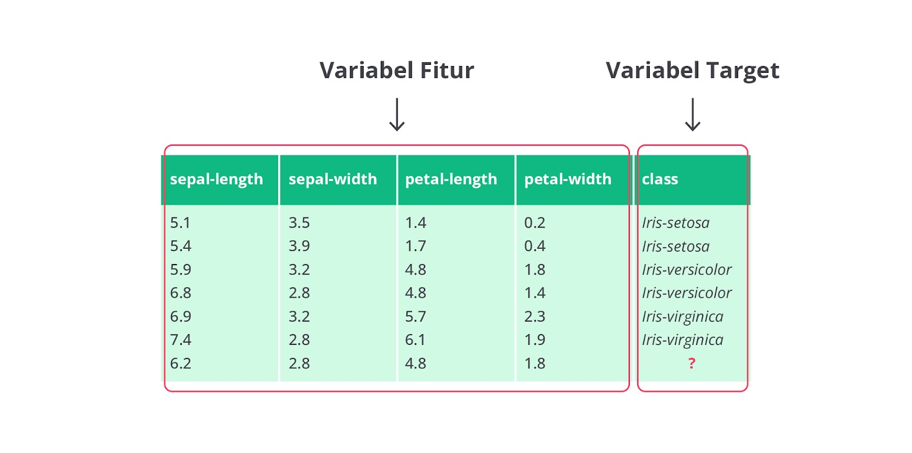
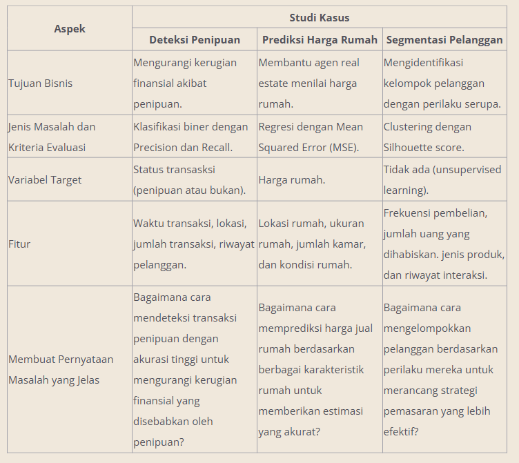
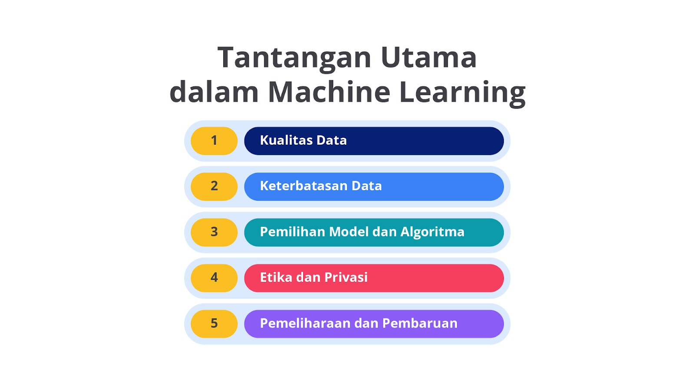

# Merumuskan Masalah dalam Machine Learning

Merumuskan masalah dalam machine learning adalah langkah awal yang sangat penting dan bisa dibilang paling krusial dalam proses pengembangan model. Ini mirip dengan merancang sebuah rencana besar sebelum membangun rumah; tanpa rencana yang jelas, kita bisa tersesat atau membuat kesalahan di sepanjang jalan.

Berikut adalah langkah-langkah dan pertimbangan utama dalam merumuskan masalah machine learning.

## Identifikasi Tujuan Bisnis

Langkah pertama adalah memahami tujuan yang ingin dicapai oleh bisnis atau proyek. Misalnya, sebuah perusahaan mungkin ingin meningkatkan penjualan produk mereka, mengurangi jumlah pelanggan yang berhenti berlangganan (churn), atau meningkatkan efisiensi operasional. Mengetahui tujuan akhir sangat penting karena ini akan memandu seluruh proses machine learning. Tanpa tujuan yang jelas, kita bisa kehilangan arah dalam pengembangan model.

## Identifikasi Tujuan Bisnis dengan Metode SMART

Menentukan tujuan bisnis dengan metode SMART adalah cara yang efektif untuk memastikan bahwa tujuan tersebut jelas, dapat dicapai, dan relevan dengan strategi perusahaan. Metode SMART adalah singkatan dari specific, measurable, achievable, relevant, dan time-bound. Berikut adalah penjelasan dan contoh penggunaan metode SMART untuk mengidentifikasi tujuan bisnis dalam konteks machine learning.

### Specific (Spesifik)

Tujuan harus jelas dan spesifik sehingga semua orang yang terlibat memahami hal yang ingin dicapai. Tujuan yang spesifik menjawab pertanyaan seperti berikut: (1) Apa yang ingin dicapai? (2) Mengapa tujuan ini penting? (3) Siapa yang terlibat? (4) Di mana tujuan ini akan dicapai?

Contoh: Meningkatkan tingkat retensi pelanggan PT XYZ dengan mengurangi churn sebesar 15% dalam 12 bulan ke depan.

### Measurable (Terukur)

Tujuan harus dapat diukur sehingga kita bisa melacak kemajuan dan mengetahui target tujuan tersebut tercapai. Metrik atau indikator kinerja harus ditentukan untuk mengukur kemajuan.

Contoh: Menggunakan metrik churn rate untuk mengukur jumlah pelanggan yang berhenti berlangganan setiap bulan. Targetnya adalah mengurangi churn rate dari 20% menjadi 17%.

### Achievable (Dapat Dicapai)

Tujuan harus realistis dan dapat dicapai dengan sumber daya yang tersedia. Ini berarti menetapkan tujuan yang menantang, tetapi tetap mungkin dicapai.

Contoh: Menyediakan pelatihan tambahan untuk tim layanan pelanggan dan meningkatkan dukungan teknis untuk membantu mengurangi churn. Mengalokasikan anggaran yang cukup untuk inisiatif ini.

### Relevant (Relevan)

Tujuan harus relevan dengan strategi bisnis keseluruhan dan memberikan kontribusi yang signifikan terhadap pencapaian tujuan jangka panjang perusahaan.

Contoh: Mengurangi churn relevan karena mempertahankan pelanggan lebih murah daripada memperoleh pelanggan baru dan pelanggan yang setia cenderung lebih menguntungkan dalam jangka panjang.

### Time-bound (Terikat Waktu)

Tujuan harus memiliki batas waktu yang jelas sehingga ada tenggat waktu untuk bekerja menuju pencapaian tujuan tersebut. Batas waktu membantu menjaga fokus dan rasa urgensi.

Contoh: Mengurangi churn sebesar 15% dalam 12 bulan ke depan dengan evaluasi bulanan untuk memantau kemajuan dan menyesuaikan strategi jika diperlukan.

## Pahami Data yang Tersedia

Setelah menentukan tujuan, langkah berikutnya adalah meninjau data yang tersedia. Data ini harus cukup untuk membantu mencapai tujuan tersebut. Misalnya, jika ingin memprediksi churn pelanggan, kita perlu data seperti riwayat transaksi, interaksi pelanggan, dan informasi demografis. Selain itu, data harus bersih dan relevan. Data kotor atau tidak relevan dapat menghasilkan model yang tidak akurat dan tidak bisa diandalkan.

Berikut adalah langkah-langkah utama dalam memahami data.

### Inventarisasi Data

Mengidentifikasi semua sumber data yang tersedia, baik internal maupun eksternal, adalah langkah pertama yang krusial dalam proses analisis data. Pastikan untuk mencakup data yang diperoleh dari sistem internal perusahaan, seperti database operasional dan laporan keuangan serta data eksternal yang relevan, seperti data pasar atau data dari mitra bisnis.

Dengan mengumpulkan semua data yang relevan, Anda memastikan bahwa tidak ada informasi penting terlewat yang dapat memengaruhi keakuratan dan kelengkapan analisis. Proses ini juga membantu dalam mengidentifikasi potensi kesenjangan data dan merencanakan strategi untuk mengatasinya.

Oh, ya, jangan lupa untuk selalu dokumentasikan sumber data serta metodenya untuk memudahkan akses dan referensi di masa depan, ya!

### Evaluasi Kualitas Data

Ini adalah memeriksa kelengkapan, konsistensi, keakuratan, dan relevansi data. Langkah ini mencakup pengecekan nilai yang hilang (missing values), duplikasi data, kesalahan penulisan, dan data yang tidak masuk akal. Pastikan data konsisten pada seluruh dataset, misalnya format tanggal yang sama. Evaluasi ini penting untuk menghindari hasil model yang tidak akurat akibat buruknya data.

Contoh

- Kelengkapan: mengisi missing values dengan mean, median, atau metode lain.
- Konsistensi: memastikan semua entri tanggal menggunakan format yang sama, misalnya YYYY-MM-DD.
- Keakuratan: menghapus atau memperbaiki data yang tidak masuk akal, seperti usia pelanggan bernilai negatif.
- Relevansi: memastikan fitur yang digunakan relevan dengan tujuan prediksi.

### Eksplorasi Data

Melakukan eksplorasi data untuk memahami pola, distribusi, dan hubungan antar variabel. Ini dilakukan melalui visualisasi data, seperti histogram, scatter plot, dan box plot, serta analisis statistik. Eksplorasi data membantu mengidentifikasi outliers, memahami distribusi variabel, dan menemukan hubungan penting antar fitur.

Contoh

- Histogram: untuk melihat distribusi usia pelanggan.
- Scatter Plot: untuk memahami hubungan antara pendapatan dan pengeluaran.
- Matriks Korelasi: untuk melihat korelasi antara berbagai fitur, seperti pendapatan dan frekuensi belanja.

### Pemilihan Fitur

Memilih fitur-fitur paling relevan untuk tujuan yang telah ditentukan. Pemilihan fitur yang tepat dapat meningkatkan kinerja model dan mengurangi kompleksitas. Fitur yang tidak relevan atau memiliki sedikit informasi harus diabaikan.

Contoh

- Fitur Relevan: jumlah transaksi bulanan, total pengeluaran tahunan, frekuensi interaksi dengan layanan pelanggan untuk memprediksi churn.
- Fitur Tidak Relevan: nomor telepon atau alamat email yang tidak memengaruhi prediksi churn.

### Pembersihan dan Transformasi Data

Pertama, atasi masalah, seperti missing values, duplikasi, dan inkonsistensi dengan mengisi nilai hilang, menghapus duplikasi, serta menstandarkan format data. Selanjutnya, lakukan transformasi data dengan normalisasi variabel numerik, encoding variabel kategorikal, dan penggabungan fitur terkait untuk mempersiapkan data bagi algoritma machine learning.

Contoh

- Missing Values: mengisi nilai yang hilang pada kolom pendapatan dengan median pendapatan dari seluruh data.
- Duplikasi: menghapus entri duplikat pada riwayat transaksi pelanggan.
- Standarisasi Format: menstandarkan format tanggal pada semua data transaksi.
- Normalisasi: skala variabel jumlah transaksi.
- Encoding: gunakan one-hot encoding untuk variabel kategorikal.
- Penggabungan Fitur: gabungkan total pengeluaran bulanan dan tahunan.

Penjelasan lebih lanjut akan kita bahas pada modul 2, ya! Stay tuned!

## Tentukan Jenis Masalah Machine Learning

Menentukan jenis masalah machine learning yang dihadapi sangat penting karena akan memengaruhi pendekatan yang akan digunakan serta pilihan algoritma. Jenis masalah machine learning umumnya dikategorikan dalam beberapa tipe utama: klasifikasi, regresi, dan clustering. Setiap jenis masalah memiliki karakteristik dan tujuan spesifik, yang pada gilirannya menentukan metode yang paling sesuai untuk diterapkan.

### Klasifikasi

Pada kasus klasifikasi, kita mengelompokkan data dalam kategori yang sudah ditentukan. Misalnya, jika kita memiliki data tinggi badan seseorang dan ingin mengklasifikasikan mereka dalam dua kategori: "Tinggi" dan "Rendah", kita akan menentukan batasan tinggi tertentu untuk setiap kategori.

Sebagai contoh, kita menetapkan seseorang yang tingginya 170 cm atau lebih diklasifikasikan sebagai "Tinggi", sementara yang tingginya kurang dari 170 cm dikategorikan sebagai "Rendah".

### Algoritma yang digunakan

- K-Nearest Neighbors (KNN)
- Decision Trees
- Random Forests
- Support Vector Machines (SVM)
- Logistic Regression

### Kriteria Evaluasi

- Akurasi
- Precision dan Recall
- F1-Score
- ROC-AUC Score

### Regresi

Regresi digunakan untuk memprediksi nilai numerik kontinu. Jika ingin menentukan ukuran tinggi seseorang dalam sentimeter, kita akan menggunakan regresi. Contoh datanya bisa berupa tinggi 170 cm, 180 cm, 152 cm, dan 148 cm. Model regresi akan membantu kita memahami hubungan antara variabel dan membuat prediksi tinggi badan berdasarkan data yang ada.

### Algoritma yang digunakan

- Linear Regression
- Polynomial Regression
- Support Vector Regression (SVR)
- Random Forest Regression
- Gradient Boosting Regression

### Kriteria Evaluasi

- Mean Squared Error (MSE)
- Mean Absolute Error (MAE)
- R-squared (R²) Score

### Clustering

Dalam clustering, data dikelompokkan berdasarkan kesamaan karakteristik tanpa label yang sudah ditentukan. Misalnya, kita dapat mengelompokkan orang berdasarkan tinggi badan mereka dalam beberapa cluster, seperti Cluster 1 dan Cluster 2.

Setiap cluster mungkin mewakili kelompok dengan rentang tinggi yang mirip. Misalnya, Cluster 1 bisa mencakup orang dengan tinggi 150–160 cm, sedangkan Cluster 2 bisa mencakup orang dengan tinggi 170–180 cm.

### Algoritma yang digunakan

- K-Means Clustering
- Hierarchical Clustering
- DBSCAN (Density-Based Spatial Clustering of Applications with Noise)
- Gaussian Mixture Models

### Kriteria Evaluasi

- Silhouette Score
- Davies-Bouldin Index
- Inertia (untuk K-Means)

Langkah ini memastikan bahwa kita menggunakan teknik yang tepat untuk mendapatkan hasil akurat dan dapat diandalkan sesuai dengan tujuan bisnis.

## Definisikan Variabel Target dan Fitur

Pada machine learning, istilah fitur dan target memiliki peran yang sangat penting dalam proses pembelajaran model. Mari kita bahas perbedaan antara keduanya dengan menggunakan contoh kasus klasifikasi bunga iris.

Fitur adalah variabel atau atribut yang digunakan untuk menggambarkan setiap baris atau instance data. Dalam kasus klasifikasi bunga iris, fitur-fitur yang digunakan meliputi hal berikut.

- Sepal Length
- Sepal Width
- Petal Length
- Petal Width

Setiap fitur ini memberikan informasi terperinci tentang karakteristik fisik bunga iris. Misalnya, panjang dan lebar sepal serta panjang dan lebar petal dapat diukur dari bunga iris yang berbeda dan data ini digunakan untuk memahami serta membedakan variasi antara spesies bunga iris.

Di sisi lain, target adalah variabel yang ingin kita prediksi atau klasifikasikan berdasarkan fitur. Pada kasus bunga iris, targetnya adalah spesies bunga yang termasuk dalam tiga kategori sebagai berikut.

- Iris Setosa
- Iris Versicolor
- Iris Virginica

Target ini adalah label atau kelas yang ingin kita tentukan untuk setiap bunga iris berdasarkan fitur-fitur. Jadi, setelah kita memiliki data tentang panjang dan lebar sepal serta petal, model machine learning akan menggunakan informasi ini untuk memprediksi spesies bunga iris yang dimiliki oleh setiap instance.

## Membuat Pernyataan Masalah yang Jelas

Langkah terakhir adalah merumuskan masalah dalam bentuk pernyataan yang jelas dan spesifik. Misalnya, "Memprediksi apakah pelanggan akan churn dalam 3 bulan ke depan berdasarkan riwayat transaksi dan interaksi pelanggan." Pernyataan ini membantu semua orang yang terlibat dalam proyek untuk memahami tujuan dan ruang lingkup masalah serta langkah-langkah yang akan diambil untuk menyelesaikannya.

## Contoh Studi Kasus

Dalam machine learning, setiap jenis masalah memerlukan pendekatan dan kriteria evaluasi yang spesifik. Berikut adalah tiga contoh kasus yang menjelaskan perbedaan dalam jenis masalah, kriteria evaluasi, dan tujuan bisnisnya.

# Tantangan dalam Machine Learning

Machine learning menawarkan peluang besar untuk menganalisis data dan membuat keputusan yang lebih baik, tetapi prosesnya tidak bebas tantangan. Dari memastikan kualitas data yang bersih dan akurat hingga memilih model secara tepat serta menangani data berskala besar, setiap langkah dalam machine learning memerlukan perhatian khusus.

Selain itu, tantangan seperti interpretabilitas model yang kompleks, masalah etika dan privasi, serta kepatuhan terhadap regulasi dapat menambah kerumitan. Memahami serta mengatasi tantangan-tantangan ini adalah kunci mengembangkan solusi machine learning yang efektif dan andal.

Beberapa tantangan utama dalam machine learning meliputi hal berikut.

## Kualitas Data

Data yang digunakan dalam machine learning harus bersih dan bebas dari kesalahan. Jika data mengandung nilai yang hilang, duplikasi, atau kesalahan penulisan, ini dapat memengaruhi akurasi model. Misalnya, jika data pelanggan tidak lengkap, seperti hilangnya informasi kontak, model yang dilatih dengan data tersebut bisa memberikan hasil kurang akurat. Oleh karena itu, penting untuk melakukan proses pembersihan data secara menyeluruh sebelum melatih model.

## Keterbatasan Data

Terkadang, data yang tersedia tidak mencukupi untuk memodelkan masalah dengan baik. Misalnya, jika kita memiliki terlalu sedikit data dalam suatu kategori tertentu, model mungkin tidak dapat belajar dengan efektif untuk kategori tersebut. Selain itu, ketidakseimbangan antara kategori dalam dataset (misalnya, jumlah kasus fraud yang jauh lebih sedikit dibandingkan transaksi normal) dapat menyebabkan model cenderung untuk mengabaikan kategori minoritas dan menghasilkan performa buruk.

## Pemilihan Model dan Algoritma

Memilih model yang tepat untuk masalah yang dihadapi adalah kunci keberhasilan machine learning. Model yang tidak sesuai dengan data atau jenis masalah bisa menghasilkan prediksi buruk. Misalnya, model regresi digunakan untuk prediksi nilai kontinu, sedangkan model klasifikasi dimanfaatkan dalam menentukan kategori. Selain itu, pengaturan hyperparameter, sebagai parameter tambahan dalam model, juga memerlukan penyesuaian yang tepat untuk mencapai performa optimal.

## Etika dan Privasi

Menggunakan data pribadi harus dilakukan dengan perhatian penuh terhadap privasi individu dan pertimbangan etika. Misalnya, data sensitif, seperti informasi kesehatan atau keuangan harus dilindungi untuk mencegah penyalahgunaan atau pelanggaran privasi. Bias dalam data juga harus diperhatikan, ini karena model yang dilatih dengan data yang bias dapat menghasilkan keputusan diskriminatif.

## Pemeliharaan dan Pembaruan

Model machine learning memerlukan pemeliharaan dan pembaruan secara berkala agar tetap relevan. Data dan pola dalam data bisa berubah seiring waktu sehingga model yang sudah ada mungkin menjadi usang jika tidak diperbarui. Proses pembaruan model melibatkan pelatihan ulang dengan data terbaru serta penyesuaian untuk memastikan model tetap efektif dan akurat dalam kondisi yang berubah.
