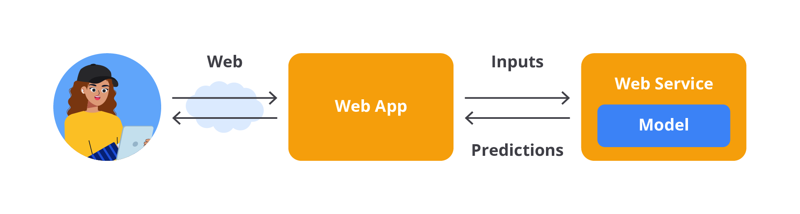

# Pengantar Machine Learning Workflow

Selamat datang kembali wahai para engineer masa depan!

Sungguh tidak terasa perjalanan Anda untuk menjadi seorang Machine Learning Engineer atau Data Scientist sudah makin dekat. Setelah resmi menamatkan modul sebelumnya, tentunya Anda sudah memahami pengertian machine learning, tipe-tipenya, contoh studi kasus hingga memecahkan permasalahan menggunakan machine learning. Namun, masih banyak sekali hal yang harus Anda taklukan, salah satunya adalah ketekunan.

"As long as we are persistence in our pursuit of our deepest destiny, we will continue to grow. We cannot choose the day or time when we will fully bloom. It happens in its own time."

— Denis Waitley, American motivational speaker and writer —

Walaupun sudah makin dekat, bukan berarti ini waktunya berpuas diri. Saat ini, Anda sudah memasuki babak kedua dalam mempelajari kelas machine learning untuk pemula. Nah, pada tahap ini, Anda akan mempelajari urutan dalam membangun machine learning dari dasar hingga menjadi sebuah model yang bisa digunakan.

Awali hari dengan ceria,
Machine Learning kita jelajahi bersama.
Data dan model jadi sahabat setia,
Membuka jalan, mengejar cita.

Setiap langkah, tantangan menanti,
Dengan tekad kuat, kita hadapi.
Belajar dan berusaha tiada henti,
Meraih mimpi, wujudkan ambisi.

Mari melangkah dengan percaya diri,
Di dunia ilmu, kita berkreasi.
Semangat membara, teruslah berlari,
Kita bisa, masa depan berseri!

Mari kita mulai petualangan ini dengan semangat yang menggebu dan tekad yang kokoh. Setiap tantangan adalah peluang untuk berkembang dan maju. Semangat!

# [Story] Membuat Tujuan, Mengejar Impian!

Hari demi hari, Diana menjalani kehidupannya bersama Bilqis. Mereka tidak hanya sekadar teman kuliah, tetapi juga rekan dalam mengejar mimpi. Mulai dari mengikuti kegiatan perkuliahan, makan siang bersama hingga belajar di luar jam kuliah, mereka selalu bersama. Persahabatan ini membuat Diana makin bersemangat dan terdorong untuk menjadi seorang generalis seperti mahasiswa benar pada umumnya.

Diana dan Bilqis bukanlah tipe mahasiswa yang hanya mengejar nilai. Mereka benar-benar mendalami setiap mata kuliah yang diberikan, salah satunya Algoritma Pemrograman. Mata kuliah ini mengajarkan mereka tentang cara memecahkan masalah secara sistematis, dan dari sinilah mereka mulai menyadari pentingnya menguasai satu bidang tertentu sebelum mencoba menguasai semuanya, atau biasa disebut dengan spesialis.

Diana akhirnya mengingat kembali diskusi terakhir bersama Bilqis yang membicarakan terkait Python, analisis data dan machine learning. Dengan bekal dasar tersebut, ia akhirnya memutuskan untuk mempelajari machine learning dan ingin menjadi seorang machine learning engineer masa depan.

Setelah berdiskusi panjang lebar akhirnya mereka memutuskan bekerja sama untuk menjadi seorang Machine Learning Engineer dan Data Scientist di masa depan. Namun, mereka sadar bahwa saat ini bekal ilmu yang dimiliki hanya sebatas dasar machine learning tanpa ada hal lainnya.

Mata kuliah Algoritma Pemrograman kembali mengingatkan Diana bahwa memahami langkah-langkah adalah kunci dalam mengembangkan sesuatu. Dengan semangat baru, mereka mulai merencanakan langkah-langkah konkret untuk menguasai machine learning.

Tentunya dengan bekal pengetahuan dari perkuliahan akhirnya mereka melakukan riset terkait langkah-langkah yang harus dipelajari untuk membangun machine learning dari dasar hingga bisa digunakan.

Sampai di sini mungkin Anda juga ikut penasaran dan bertanya-tanya, “Dari mana kita harus memulai belajar machine learning?” Tenang kawan, pada modul ini, kita akan menemani Diana dan Bilqis untuk menemukan jalan menuju predikat Machine Learning Engineer. Eitss, bukan hanya Diana dan Bilqis, modul ini juga akan menuntun Anda ke masa depan yang lebih terarah. Oleh karena itu, kencangkan sabuk pengaman, jangan sampai ketinggalan oleh Diana dan Bilqis ya, semangat!

# Pendahuluan Machine Learning Workflow

Tahukah Anda bahwa setiap manusia ketika bepergian akan menyiapkan sebuah rute, baik itu dalam bentuk peta konvensional ataupun peta digital. Di lain sisi, jika kita sudah hafal atau dalam kata lain sudah menguasai rutenya, kita malah bisa memberikan informasi kepada orang lain juga, ‘kan?

Lalu, apa sebenarnya fungsi peta? Dalam konteks perjalanan, peta memiliki makna yang sangat penting dan simbolis. Sebagai panduan dan alat navigasi, peta memberikan arah yang jelas dan membantu kita merencanakan rute terbaik, serta dapat membantu untuk mencapai tujuan dengan efisien dan aman.

Sama halnya dengan perjalanan Anda dalam membangun sebuah project machine learning yang membutuhkan arah yang jelas sehingga dapat membantu merancang model terbaik. Nah, biasanya untuk membangun model machine learning, kita memerlukan alur kerja yang biasa disebut machine learning workflow.

Machine learning workflow berisikan tahapan-tahapan yang perlu dilalui sebelum project tersebut bisa diimplementasikan di tahap produksi. Aurélien Géron dalam bukunya "Hands-On Machine Learning with Scikit-Learn & TensorFlow" [4] menjelaskan alur kerja machine learning sebagai serangkaian langkah sistematis yang dimulai dari definisi masalah hingga penerapan model yang jika kita rangkum akan menghasilkan diagram seperti berikut.

Alur kerja machine learning menurut buku tersebut melibatkan serangkaian langkah yang sistematis dan iteratif. Setiap langkah membutuhkan evaluasi dan penyesuaian untuk memastikan model yang dihasilkan dapat memberikan hasil yang akurat dan andal dalam lingkungan produksi. Buku ini juga menekankan pentingnya pemahaman mendalam terhadap data dan masalah yang dihadapi serta penggunaan alat dan teknik yang tepat untuk mencapai tujuan machine learning.

Seperti yang Anda lihat pada diagram di atas, tentunya tahapannya tidak sedikit, ‘kan? Tenang saja, sebagai bekal dasar, Anda akan mempelajari semuanya benar-benar dari nol dengan tujuan bisa memperkaya pengetahuan dasar sehingga akan mempermudah pengerjaan proyek Anda kelak.

Tanpa berlama-lama lagi, mari kita bahas diagram di atas secara saksama.

## Proses Pengumpulan Data

Langkah pertama dalam alur kerja machine learning adalah memahami masalah yang ingin diselesaikan dan tujuan bisnis yang ingin dicapai. Setelah masalah dipahami, langkah berikutnya adalah mengumpulkan data yang relevan dari berbagai sumber, seperti basis data, API, atau data publik.

Saat ini banyak sekali data yang bisa kita akses kapan pun dan di mana pun, bahkan beberapa data penting dijual secara cuma-cuma. Dari sumber-sumber tersebut, Anda dapat memilih, mengunduh, dan menggunakan dataset yang sesuai dengan kebutuhan Anda kapan saja. Proses ini relatif mudah tetapi tantangannya adalah memilih dataset yang tepat untuk model Anda.

Jika Anda adalah seorang Machine Learning Engineer pada sebuah perusahaan yang bertugas untuk membangun model machine learning untuk keperluan internal, tentu proses pengumpulan datanya tidak semudah Anda mengunduh dataset yang sudah tersedia. Anda perlu mengumpulkan dan mengekstrak sendiri data dari berbagai sumber misalnya database, file, data sensor, dan sumber lainnya.

Salah satu cara untuk mendapatkan data yang tidak dimiliki perusahaan dengan cara scraping. Scraping atau lebih tepatnya web scraping adalah proses otomatis untuk mengumpulkan data atau informasi dari situs web. Proses ini melibatkan penggunaan skrip atau perangkat lunak untuk mengekstrak data yang diinginkan dari halaman web tertentu, yang kemudian dapat diolah atau dianalisis lebih lanjut. Web scraping dapat dilakukan dengan berbagai cara, mulai dari menggunakan alat-alat sederhana hingga membangun skrip atau program yang kompleks.

Proses scraping bisa memakan waktu yang cukup lama karena Anda perlu menentukan data yang sesuai dan mengolah semuanya dari nol. Namun, tenang saja pada modul ini, kita tidak akan melakukan hal tersebut. Jika Anda penasaran dengan teknik tersebut, silakan lanjutkan petualangan ini sampai kelas berikutnya ya.

Sebagai informasi pada tahap ini Anda juga perlu berurusan dengan berbagai jenis tipe data dari mulai structured data (seperti excel file atau database SQL), sampai unstructured data (seperti text file, email, video, audio, gambar, data sensor, dan lainnya). By the way, menurut Gartner lebih dari 80% data perusahaan adalah unstructured data.

## Exploratory Data Analysis

Setelah data terkumpul, kita perlu memahami struktur dan karakteristik data. Ini termasuk melakukan analisis deskriptif dan visualisasi data untuk menemukan pola atau anomali tertentu.

Tahapan tersebut disebut exploratory data analysis atau EDA yang bertujuan sebagai analisis awal terhadap data dan melihat bagaimana kualitas data untuk meminimalkan potensi kesalahan di kemudian hari. Pada proses ini dilakukan investigasi awal pada data untuk memahami data, menemukan pola, anomali, menguji hipotesis, memahami distribusi, frekuensi, hubungan antara variabel, dan memeriksa asumsi dengan teknik statistik dan representasi grafik.

Pada umumnya, EDA dilakukan dengan dua cara, yaitu univariate analysis, dan multivariate analysis. Univariate analysis adalah analisis deskriptif yang memeriksa pola dengan satu variabel pada modelnya. Multivariate analysis merupakan analisis deskriptif yang memeriksa pola dalam data multidimensi dengan membertimbangkan dua atau lebih variabel. Jika terdapat dua variabel yang akan dianalisis, ia disebut bivariate analysis.

Karena multivariate analysis mempertimbangkan lebih banyak variabel, ia dapat memeriksa fenomena yang lebih kompleks dan menemukan pola data yang mewakili dunia nyata dengan lebih akurat.

“Bentar-bentar, lalu apa maksud dan tujuan dari ketiga cara analisis di atas?”

Pertanyaan yang menarik, mari kita jabarkan sekali lagi terkait ketiga cara analisis tersebut.

- Univariate Analysis
  Seperti penjelasan di atas, univariate adalah analisis yang melibatkan hanya satu variabel dalam satu waktu tertentu. Tujuan dari analisis univariate ini untuk memahami distribusi, central tendency (contoh: mean, median) dan penyebaran data (contoh: varians, standar deviasi) dari satu variabel. Contoh eksplorasi yang dapat dilakukan berupa histogram, box plot, bar plot, dan lain sebagainya.

- Bivariate Analysis
  Seperti namanya bivariate analisis melibatkan dua variabel pada satu waktu tertentu untuk memahami hubungan atau asosiasi antar variabel yang digunakan. Analisis ini bertujuan untuk mengeksplorasi adanya hubungan antara dua variabel, apakah salah satunya memengaruhi yang lain, atau bagaimana kedua variabel tersebut berinteraksi. Biasanya analisis ini menggunakan visualisasi scatter plot, crosstab, box plot, dan lain sebagainya.

- Multivariate Analysis
  Last but not least, multivariate analisis akan melibatkan lebih dari dua variabel pada satu waktu tertentu. Ini bisa mencakup tiga atau lebih variabel sekaligus yang tidak bisa dijelaskan dengan analisis univariate ataupun bivariate. Cara ini akan membantu dalam mengidentifikasi pola tersembunyi atau interaksi antara variabel yang mungkin akan memengaruhi hasil. Cara ini bisa divisualkan dengan menggunakan pair plot, heatmap, principal component analysis, dan lain sebagainya.

Dari penjelasan tersebut akan memberikan garis besar bahwa EDA merupakan langkah penting dalam proses pembangunan machine learning karena dapat memastikan bahwa setiap langkah berikutnya dalam alur kerja data didasarkan pada pemahaman yang kuat tentang data itu sendiri.

## Data Preprocessing

Data preprocessing adalah langkah penting dalam alur kerja machine learning yang bertujuan untuk mempersiapkan data mentah agar dapat digunakan secara efektif oleh model machine learning.

Proses ini mencakup serangkaian teknik dan transformasi untuk memastikan data yang digunakan berkualitas tinggi, konsisten, dan relevan dengan tujuan analisis atau pemodelan. Dengan kata lain, proses ini mengubah dan mentransformasi fitur-fitur data ke dalam bentuk yang mudah diinterpretasikan dan diproses oleh algoritma machine learning.

Beberapa hal yang bisa dilakukan dalam proses data cleaning seperti berikut.

- Mengidentifikasi dan Menangani Data yang Hilang
  Data yang hilang atau missing value adalah masalah umum dalam dataset yang harus ditangani. Beberapa cara penanganannya dengan cara menghapus data yang hilang atau melakukan imputasi data. Imputasi adalah mengganti data yang hilang dengan nilai lain (contoh: mean, median, modus dan lain sebagainya).

- Mengidentifikasi dan Menangani Outliers
  Outlier adalah data yang jauh berbeda dari mayoritas data lainnya. Outlier dapat memengaruhi performa model, terutama pada algoritma yang sensitif seperti regresi linear. Beberapa cara menanganinya dengan cara menghapus outlier, melakukan transformasi data, atau mengubah nilai menjadi lebih dekat ke distribusi normal.

Di lain sisi, kita juga terkadang perlu melakukan transformasi data, hal ini diperlukan untuk memastikan data sesuai dengan format atau skala yang dapat digunakan oleh model machine learning. Berikut beberapa cara untuk melakukan transformasi data.

- Normalisasi (Normalization)
  Mengubah skala data sehingga berada dalam rentang tertentu, biasanya antara 0 dan 1.

- Standardisasi (Standardization)
  Mengubah data sehingga memiliki distribusi dengan mean 0 dan standar deviasi 1. Ini sering digunakan ketika data memiliki distribusi Gaussian.

- Transformasi Log atau Sqrt
  Menggunakan transformasi logaritmik atau akar kuadrat untuk mengurangi skewness data.

- Encoding Variabel Kategorikal (Categorical Encoding)
  For your information, model machine learning itu hanya dapat bekerja dengan data numerik sehingga variabel kategorikal harus diubah menjadi bentuk numerik. Beberapa cara yang bisa Anda lakukan untuk menyelesaikan permasalahan tersebut antara lain

  - Label Encoding: mengubah kategori menjadi label numerik. Ini cocok untuk variabel dengan hubungan ordinal.
  - One-Hot Encoding: mengubah setiap kategori menjadi kolom biner terpisah (0 atau 1). Ini digunakan ketika tidak ada hubungan ordinal di antara kategori.
  - Ordinal Encoding: mengubah kategori ke dalam bentuk label numerik berdasarkan urutan atau tingkatan.

- Feature Scaling
  Ketika data memiliki fitur dengan skala yang berbeda-beda, fitur dengan skala lebih besar bisa mendominasi algoritma machine learning tertentu seperti K-Nearest Neighbors atau Support Vector Machines. Untuk itulah fitur scaling diperlukan karena dapat mengatasi permasalahan tersebut. Berikut beberapa cara untuk melakukan feature scaling.
  - Min-Max Scaling: mengubah fitur ke dalam rentang antara nilai minimum dan maksimum yang diinginkan.
  - Standardization: skala fitur ke dalam distribusi Gaussian dengan mean 0 dan standar deviasi 1.

Tidak lupa pula, proses train-test split juga merupakan bagian dari data preprocessing. Ini merupakan langkah terakhir dalam preprocessing dengan membagi data menjadi set pelatihan (training set), set pengujian (test set), dan kadang-kadang set validasi (validation set). Hal tersebut memastikan bahwa model dievaluasi pada data yang tidak pernah dilihat sebelumnya untuk mengukur kinerja yang sebenarnya.

Kesimpulannya, data preprocessing adalah proses kompleks dan kritis yang memastikan data siap untuk dimodelkan. Tahap ini mencakup pembersihan, transformasi, encoding, scaling, feature engineering, dan pengurangan dimensi. Tujuannya adalah untuk memastikan bahwa data yang diberikan ke model machine learning berkualitas tinggi, terstruktur dengan baik, dan siap untuk dianalisis sehingga model dapat menghasilkan prediksi yang akurat dan andal.

Disclaimer

Proses data preprocessing bisa sangat dinamis dan tidak ada kontrak untuk melakukan semua tahapannya, bahkan suatu saat Anda bisa saja melakukan preprocessing lainnya yang tidak disebutkan di atas. Semuanya tergantung dengan kasus dan karakteristik data yang Anda hadapi.

## Model Selection

Model selection adalah langkah penting dalam alur kerja machine learning yang melibatkan pemilihan algoritma terbaik untuk memecahkan masalah spesifik berdasarkan data yang tersedia. Pemilihan model yang tepat dapat secara signifikan memengaruhi kinerja akhir dari solusi machine learning.

K. P. Murphy dalam bukunya yang berjudul Machine Learning: a Probabilistic Perspective [16] menuliskan kalimat berikut: “when we have a variety of models of different complexity (e.g., linear or logistic regression models with different degree polynomials, or KNN classifiers with different values of K), how should we pick the right one?” Berangkat dari pertanyaan ini, menentukan model yang sesuai dengan data merupakan tahapan yang penting dalam machine learning workflow.

Selain itu, Jie Ding, et al dalam tulisannya “Model Selection Techniques -An Overview” [17] menyatakan bahwa tidak ada model yang cocok secara universal untuk data dan tujuan apa pun. Pilihan model atau metode yang tidak tepat dapat menyebabkan kesimpulan yang menyesatkan atau performa prediksi yang mengecewakan. Sebagai contoh, saat memiliki kasus klasifikasi biner, kita perlu mempertimbangkan model terbaik untuk data kita, apakah logistic regression atau SVM classifier.

Langkah pertama dalam model selection adalah memahami jenis masalah yang ingin diselesaikan. Masalah machine learning biasanya dapat dibagi menjadi beberapa kategori utama seperti berikut.

- Masalah Klasifikasi dengan tujuan untuk mengkategorikan input ke dalam kelas tertentu. Misalnya, spam vs non-spam.
- Masalah Regresi dengan tujuan untuk memprediksi nilai kontinu. Misalnya, harga rumah berdasarkan fitur-fitur tertentu.
- Masalah Clustering dengan tujuan untuk mengelompokkan data ke dalam grup yang tidak diketahui sebelumnya.
- Masalah Dimensionality Reduction dengan tujuan untuk mengurangi jumlah fitur dalam dataset tanpa kehilangan informasi penting.
- Masalah Time Series dengan tujuan untuk memprediksi nilai masa depan berdasarkan data historis.

Setelah menentukan kategori utama yang cocok untuk permasalahan yang ingin diselesaikan, Anda perlu melakukan eksplorasi algoritma untuk kategori yang sudah ditentukan.

Pada tahap ini, Anda perlu melakukan pengujian awal atau baseline model dengan tujuan untuk menguji beberapa algoritma secara cepat sehingga mendapatkan gambaran awal tentang kinerja mereka pada dataset. Hal ini bisa dilakukan dengan menggunakan default hyperparameters tanpa penyesuaian khusus. Hasil baseline ini membantu dalam mengevaluasi seberapa kompleks atau sederhana model yang diperlukan.

Setelah menentukan algoritma yang cocok untuk data yang ada, langkah berikutnya adalah menyesuaikan hyperparameter untuk mengoptimalkan kinerja model. Hyperparameter adalah parameter yang ditentukan sebelum proses pelatihan dan tidak dipelajari dari data. Contoh hyperparameter termasuk jumlah tree dalam Random Forest, nilai C dalam SVM, atau learning rate dalam Gradient Boosting. Proses menemukan performa terbaik model dengan pengaturan hyperparameter yang berbeda ini juga disebut model selection.

Dengan demikian, dalam konteks machine learning, model selection bisa berarti dua hal, yaitu pemilihan learning method atau algoritma machine learning dan pemilihan hyperparameter terbaik untuk metode machine learning yang dipilih.

## Model Evaluation

Setelah mengotak-atik model Anda dengan hyperparameter yang berbeda, akhirnya Anda mendapatkan model yang kinerjanya cukup baik. Langkah selanjutnya adalah mengevaluasi model akhir pada data uji. Sederhananya, langkah evaluasi model dapat dijabarkan sebagai berikut.

- Memprediksi label pada data uji.
- Menghitung jumlah prediksi yang salah (error) kemudian membandingkannya dengan data label yang kita miliki.
- Dari data perbandingan ini, kita dapat menghitung akurasi atau performa model.

Beberapa metrik evaluasi yang umum digunakan tergantung pada jenis masalah yang dihadapi, contohnya seperti berikut.

- Akurasi: persentase prediksi yang benar dari total prediksi (digunakan untuk klasifikasi).
- Precision dan Recall: digunakan untuk masalah klasifikasi, terutama ketika data tidak seimbang.
- F1-Score: kombinasi precision dan recall yang lebih detail.
- Mean Squared Error (MSE) atau Mean Absolute Error (MAE): digunakan untuk regresi untuk mengukur seberapa jauh prediksi dari nilai sebenarnya.
- ROC-AUC Score: digunakan untuk mengevaluasi kinerja klasifikasi pada berbagai threshold.
- Dan lain sebagainya.

Pada prinsipnya proses model evaluation adalah menilai kinerja model ML pada data baru, yaitu data yang belum pernah “dilihat” oleh model sebelumnya.

Evaluasi model bertujuan untuk membuat estimasi generalisasi error (kesalahan) dari model yang dipilih, yaitu seberapa baik kinerja model tersebut pada data baru. Idealnya, model machine learning yang baik adalah model yang tidak hanya bekerja dengan baik pada data training, tetapi juga pada data baru.

Oleh karena itu, sebelum mengirimkan model ke tahap produksi, Anda harus cukup yakin bahwa performa model akan tetap baik dan tidak menurun saat dihadapkan dengan data baru. Psstt, sedikit spoiler jangan biarkan model Anda overfitting atau underfitting, ya!

## Deployment

Pada umumnya, Anda akan sangat sibuk dan menghabiskan waktu hingga tahap evaluation, tetapi usaha itu akan menjadi sia-sia karena model yang dibangun tidak bisa digunakan oleh khalayak ramai (end-user). Tentunya itu akan sangat merugikan, ‘kan?

Model deployment adalah salah satu langkah terpenting dalam alur kerja machine learning. Model yang telah dilatih dan diuji diterapkan ke dalam lingkungan produksi sehingga dapat digunakan oleh pengguna akhir atau sistem untuk membuat prediksi pada data baru.

Proses ini tidak hanya mencakup memindahkan model dari fase pengembangan ke fase produksi, tetapi juga memastikan bahwa model berjalan dengan andal, cepat, dan aman dalam skala besar.

Lalu bagaimana cara melakukan deployment model tersebut? Caranya adalah dengan menyimpan model yang telah dilatih dari tahap preprocessing hingga pipeline prediksi. Kemudian, deploy model tersebut ke tahap produksi untuk membuat prediksi dengan memanggil kode predict()-nya. Sederhananya Geron [4] memberikan contoh ilustrasi model deployment seperti tampak dalam gambar berikut.

Bayangkan Anda sedang menggunakan sebuah situs web untuk memprediksi harga rumah. Di situs tersebut, Anda akan melihat sebuah formulir yang bisa memasukkan beberapa informasi, seperti lokasi rumah, luas rumah, jumlah kamar tidur, dan fasilitas lainnya. Setelah Anda memasukkan semua data yang diperlukan, Anda akan mengeklik tombol yang bertuliskan "Prediksi Harga".

Ketika Anda mengeklik tombol tersebut, berikut adalah proses yang terjadi di belakang layar.

- Saat Anda mengeklik tombol "Prediksi Harga", semua informasi yang telah Anda masukkan (misalnya, lokasi, ukuran rumah, dan jumlah kamar tidur) dikemas menjadi sebuah paket data yang disebut "input". Input ini kemudian dikirim dari browser Anda ke server yang menjalankan aplikasi web.
- Setelah server menerima input dari Anda, server tersebut akan mengarahkan data ini ke aplikasi web yang menjalankan model prediksi harga rumah. Aplikasi web ini telah dilengkapi dengan model machine learning, yaitu model regresi yang sebelumnya telah dilatih menggunakan data tentang harga rumah.
- Di dalam aplikasi web, data yang Anda kirimkan akan diproses oleh kode program yang ada. Kode program ini akan memanggil sebuah fungsi khusus yang disebut predict(). Fungsi predict() ini bekerja dengan memasukkan data yang Anda berikan ke dalam model regresi. Model ini kemudian akan menganalisis data tersebut—misalnya, mempertimbangkan lokasi rumah, ukuran, dan jumlah kamar tidur—untuk memperkirakan harga rumah yang sesuai berdasarkan pola-pola yang telah dipelajari sebelumnya.
- Setelah model menghasilkan prediksi harga, hasil tersebut akan dikirim kembali oleh server ke browser Anda. Dalam hitungan detik, Anda akan melihat hasil prediksi harga rumah yang muncul di layar situs web, berdasarkan data yang Anda masukkan.

Dengan demikian, proses ini memungkinkan Anda untuk mendapatkan estimasi harga rumah hanya dengan beberapa klik, dan semua pekerjaan berat dilakukan oleh model machine learning yang berjalan di server di belakang layar.

## Monitoring

Ketika sebuah model machine learning sudah diterapkan dalam produksi dan digunakan oleh pengguna, pekerjaan belum selesai. Model ini masih perlu terus dipantau untuk memastikan bahwa ia tetap berfungsi dengan baik dan memberikan hasil yang akurat.

Hal ini sangat penting karena data yang dihadapi oleh model dalam tahap produksi bisa berbeda dari data yang digunakan saat model dilatih. Jika model bertemu dengan data yang tidak dikenali atau berbeda dari pola yang telah dipelajari, performanya bisa menurun seiring berjalannya waktu.

Contoh kasus misalnya jika Anda memiliki model machine learning yang digunakan dalam sistem rekomendasi produk di sebuah situs e-commerce. Model ini bertugas merekomendasikan produk kepada pengguna berdasarkan perilaku belanja mereka sebelumnya.

Untuk memastikan model ini bekerja dengan baik, Anda bisa memantau performanya dengan menghitung banyaknya produk rekomendasi yang benar-benar terjual setiap hari. Jika angka ini turun (dibandingkan dengan produk yang tidak direkomendasikan), kemungkinan model kita perlu dilatih ulang menggunakan data-data baru.

Jika Anda bekerja dalam lingkungan di mana data selalu berubah—seperti dalam e-commerce, media sosial, atau layanan streaming—melakukan update dataset dan melatih ulang model secara manual bisa menjadi pekerjaan yang berat dan tidak efisien.

Oleh karena itu, Anda mungkin perlu membangun sistem yang dapat melakukan pembaruan dataset dan pelatihan ulang model secara otomatis. Sistem ini bisa dijadwalkan untuk memproses data baru setiap minggu atau bulan, melatih model dengan data tersebut, dan kemudian menerapkan model yang telah diperbarui ke dalam produksi.

Dengan begitu, model Anda akan selalu up-to-date dan siap untuk memberikan hasil yang relevan meskipun lingkungan data di sekitar terus berubah. Sistem otomatis ini tidak hanya meningkatkan efisiensi, tetapi juga memastikan bahwa kualitas model tetap terjaga sepanjang waktu tanpa perlu intervensi manual yang sering.

Apakah sudah mulai terbayangkan portofolio yang akan Anda bangun di kemudian hari? Relaks saja tidak usah terburu-buru karena semua orang memiliki start yang berbeda-beda, tetapi bukan berarti Anda bisa berleha-leha, ya.

Machine learning adalah petualangan seru yang melibatkan banyak proses dan infrastruktur untuk membangun model yang hebat. Memahami algoritma itu penting, tetapi menguasai keseluruhan proses pembangunan machine learning hingga model siap digunakan di dunia nyata merupakan hal yang membuat Anda jadi master sejati!

Nantinya di kelas Belajar Pengembangan Machine Learning, Anda akan diajak lebih jauh untuk belajar cara men-deploy model machine learning Anda ke tahap produksi. Jadi, siap-siap saja untuk melangkah lebih jauh! Terus semangat belajarnya, ya. Ciao!
