# Pendahuluan Hyperparameter Tuning

Hai hai hai!

Selamat datang kembali di kelas Machine Learning untuk Pemula, terima kasih telah berjuang sejauh ini dan memberanikan diri untuk terus melangkah. Jangan lupa untuk mengapresiasi diri sendiri, ya. Namun, jangan berlebihan juga karena masih banyak ilmu yang perlu kita cari.

Seperti yang sudah Anda pelajari pada modul Overfitting dan Underfitting, hyperparameter tuning merupakan langkah yang sangat penting untuk menghasilkan model machine learning yang andal.

Ngomong-ngomong, apakah Anda masih ingat apa itu hyperparameter tuning pada modul Overfitting dan Underfitting? Yup, ingatan Anda sangat baik. Hyperparameter tuning adalah proses dalam machine learning untuk mengoptimalkan kinerja model berdasarkan suatu nilai tertentu. For your information, pada machine learning terdapat dua jenis parameter yaitu parameter model dan hyperparameter. Apa sih bedanya? Sini, mari kita jelaskan secara saksama.

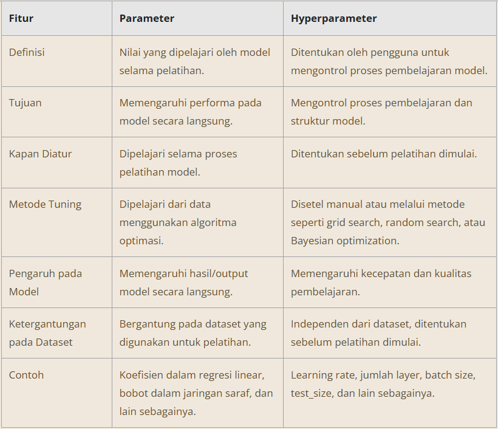

Kesimpulannya, parameter model adalah nilai yang dipelajari oleh model selama proses pelatihan, seperti bobot (weight) dalam jaringan saraf tiruan. Di lain sisi, hyperparameter merupakan nilai yang tidak dipelajari selama pelatihan, tetapi dapat ditentukan sebelum pelatihan model dimulai.

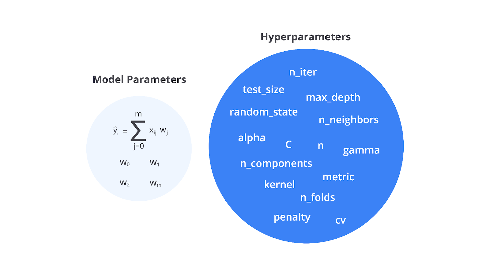

Jika Anda memperhatikan gambar di atas, terdapat banyak sekali hyperparameter yang dapat diatur. Beberapa contoh penerapan hyperparameter adalah jumlah pohon dalam algoritma Random Forest, learning rate dalam gradient boosting, atau jumlah neuron dalam hidden layer pada jaringan saraf tiruan.

Sebenarnya apa sih fungsi dari hyperparameter ini secara nyata? Berikut salah satu contoh dari penerapan learning rate yang dapat memengaruhi performa model.

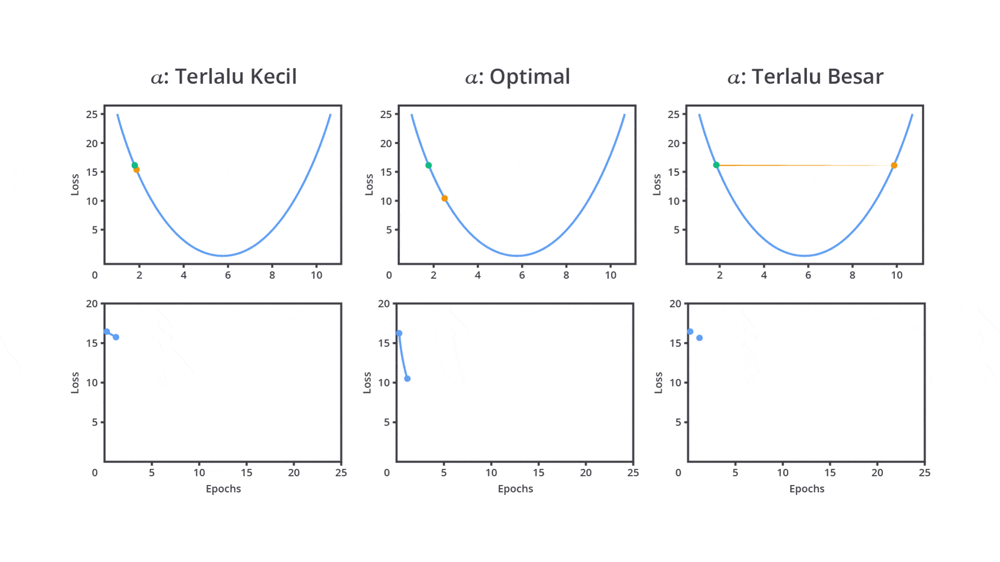

Berdasarkan gambar di atas, tentunya hyperparameter memiliki peran penting dalam menentukan bagaimana model akan belajar (dilatih) dan seberapa baik model tersebut menggeneralisasi data yang belum pernah dilihat sebelumnya. Dengan pemilihan nilai yang tepat, model yang Anda bangun akan menghasilkan performa terbaik dan dapat diandalkan pada lingkungan produksi.

Lalu, bagaimana dengan parameter? Seperti yang Anda tahu, parameter merupakan nilai yang dihasilkan ketika model dilatih. Nilai tersebut dihasilkan dari perhitungan weight, bias, input, dan lain sebagainya. Sehingga, jika kita simpulkan, keduanya memiliki hubungan yang erat. Dengan pemilihan hyperparameter yang tepat Anda juga dapat menghasilkan parameter yang efisien. Agar lebih memahami hubungan antara keduanya tersebut, silakan perhatikan gambar proses pelatihan model berikut, ya.

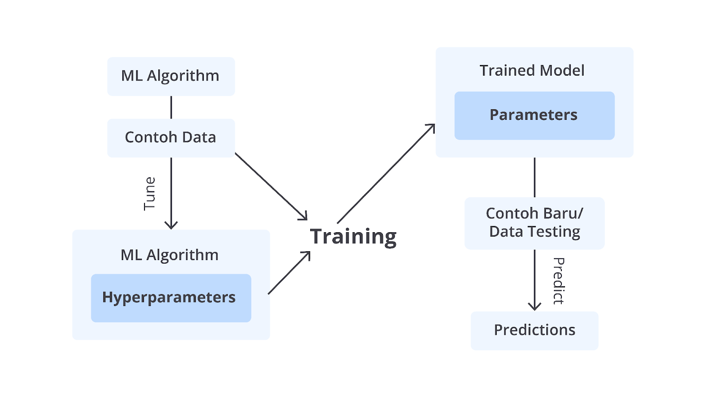

Berangkat dari gambar di atas maka proses hyperparameter tuning bertujuan untuk menemukan kombinasi hyperparameter yang menghasilkan kinerja model terbaik pada dataset tertentu. Hal ini dilakukan dengan menguji berbagai nilai hyperparameter, kemudian memilih yang memberikan hasil paling optimal berdasarkan metriks evaluasi.

Mari sedikit flashback pada modul Machine Learning Workflow. Masih ingatkah Anda bagaimana proses pembangunan model machine learning? Yes, proses tersebut diulang berkali-kali (iteratif) hingga menghasilkan performa terbaik.

Jika Anda telisik, proses hyperparameter tuning ini merupakan bagian dari salah satu tahapan model selection. Proses yang terjadi pada tahapan tersebut akan terlihat seperti gambar di bawah ketika dijelaskan dengan lebih detail.

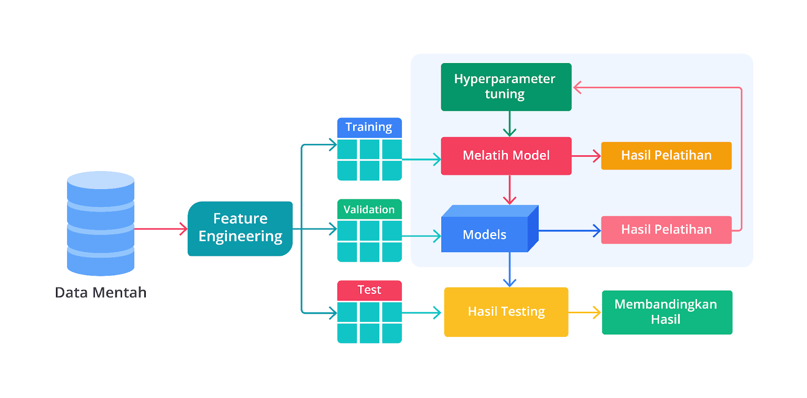

Seperti yang Anda tahu, pemilihan fitur atau hyperparameter tuning menggunakan langkah iteratif untuk menghasilkan parameter terbaiknya. Sayangnya, sampai saat ini belum ada guideline khusus untuk menentukan nilai dari masing-masing hyperparameter.

Biasanya, Anda perlu berlatih sebanyak mungkin untuk meningkatkan intuisi dalam mengatur hyperparameter. Sehingga, dari proses trial and error tersebut, Anda memiliki pengalaman yang baik ketika menginisialisasi nilai hyperparameter.

Walaupun sudah mempelajari berbagai macam hyperparameter Anda tetap harus mencari nilai hyperparameter terbaik secara manual. Hal tersebut karena machine learning tidak dapat dibangun menggunakan penyelesaian yang sama. Hal ini berlandaskan dari materi yang sudah Anda ketahui pada modul Machine Learning Workflow bahwa tidak ada model yang cocok secara universal untuk data dan tujuan apa pun.

Sampai di sini harusnya Anda sudah mengetahui peran dan alasan mengapa hyperparameter tuning ini menjadi salah satu tahapan yang cukup krusial.

Secara garis besar, hyperparameter tuning ini menjadi penting karena setiap algoritma machine learning memiliki hyperparameter yang berbeda dan pilihan hyperparameter yang tepat dapat secara signifikan meningkatkan performa model. Perhatikan beberapa contoh hyperparameter dari algoritma di bawah.

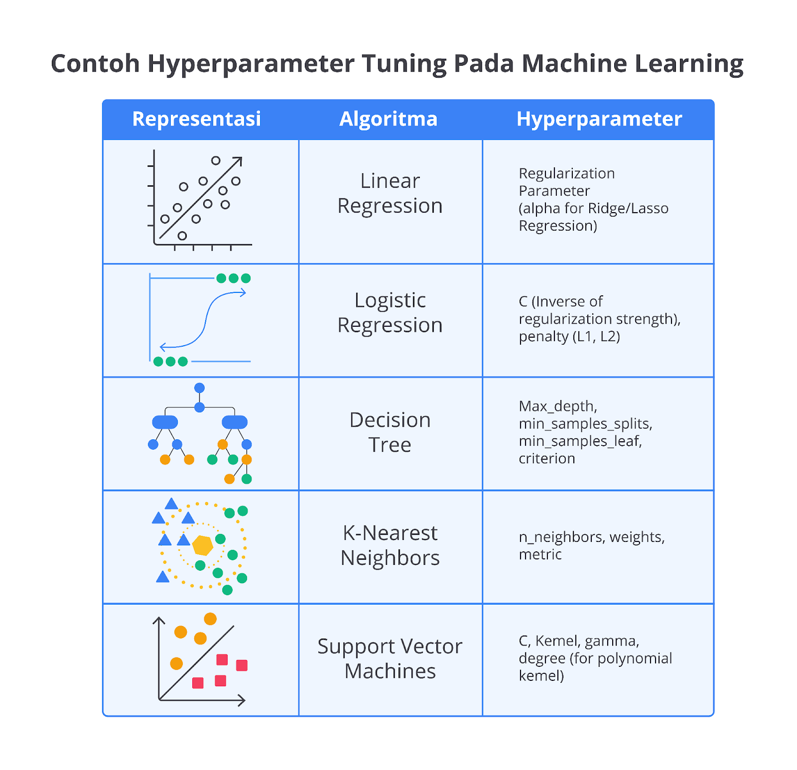

Jadi, permasalahan akan muncul ketika hyperparameter tidak diatur dengan baik sehingga model cenderung mengalami overfitting atau underfitting. Masih ingatkan apa itu overfitting atau underfitting? Tenang, salah satu pionir machine learning yaitu Andrew N.G pernah berkata, “Don’t worry if you don’t understand.”

Oleh karena itu, kita akan sedikit me-refresh materi tersebut agar Anda dapat belajar dengan lebih santai. Berikut penjelasan singkat dari overfitting dan underfitting.

Overfitting terjadi ketika model terlalu kompleks dan terlalu "menghafal" data latih sehingga tidak dapat menggeneralisasi pada data baru.
Underfitting terjadi ketika model terlalu sederhana sehingga tidak cukup menangkap pola-pola dalam data.
Dengan demikian, tujuan utama hyperparameter tuning adalah untuk menemukan keseimbangan yang tepat antara bias dan varians (bias-variance tradeoff) sehingga model mampu mempelajari pola dengan baik tanpa kehilangan kemampuan untuk menggeneralisasi pada data baru.

# Strategi Hyperparameter Tuning

Sebelum Anda mengetahui langkah-langkah yang biasanya dilakukan pada tahap hyperparameter tuning, alangkah lebih baiknya Anda memahami dahulu bagaimana memilih hyperparameter yang tepat untuk model machine learning yang akan dibangun. Pemilihan hyperparameter ini bertujuan untuk meminimalisasi ukuran dan komputasi yang dilakukan oleh komputer.

Bayangkan jika Anda melakukan metode brute force terhadap seluruh hyperparameter pada suatu algoritma, tentunya akan memakan biaya komputasi dan waktu yang cukup banyak ‘kan? Oleh karena itu, Anda perlu memilih hyperparameter terbaik dari masing-masing algoritma yang akan digunakan.

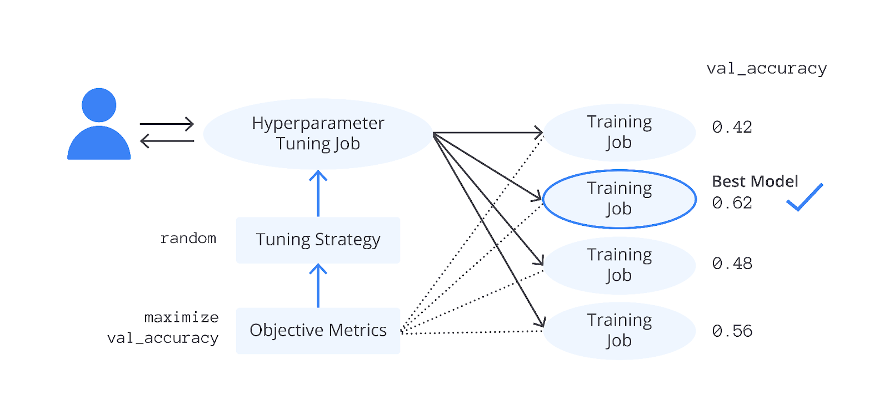

Dari sekian banyak hyperparameter tentunya tidak semuanya memiliki dampak yang sama pada model tertentu sehingga penting untuk memilih dan mengatur hyperparameter yang relevan untuk mencapai performa optimal.

Berikut adalah panduan umum tentang pemilihan hyperparameter yang relevan, termasuk cara untuk mengidentifikasi dan mengatur prioritas dalam tuning.

## Penggunaan Default Hyperparameter

Pada tahap awal, Anda dapat memulai dengan nilai default dari hyperparameter yang sering kali sudah diatur sedemikian rupa oleh library yang digunakan agar memberikan hasil yang baik pada kebanyakan kasus. Nilai ini dapat memberikan baseline yang cukup baik sebelum mulai melakukan tuning secara manual maupun otomatis.

Namun, penting untuk diingat bahwa nilai default cenderung tidak selalu optimal untuk dataset tertentu sehingga tetap diperlukan tuning terutama jika hasil baseline tidak memadai.

## Memahami Algoritma yang Digunakan

Setiap algoritma machine learning memiliki hyperparameter yang berbeda-beda dan dapat memengaruhi model machine learning. Oleh karena itu, langkah pertama dalam pemilihan hyperparameter yang relevan adalah memahami algoritma yang digunakan, termasuk apa saja hyperparameter penting yang tersedia.

Selain hyperparameter yang sudah Anda ketahui pada materi sebelumnya, berikut adalah beberapa contoh hyperparameter yang sering kali Anda temui ketika mempelajari dasar machine learning.

Regresi Linier / Regresi Logistik
Regularisasi (L2 atau L1) dan C atau lambda adalah hyperparameter utama yang perlu diperhatikan.

K-Nearest Neighbors (KNN)
Jumlah tetangga terdekat (k) dan jarak metrik (Euclidean, Manhattan) adalah hyperparameter yang paling penting.

Decision Tree
Kedalaman pohon (max_depth), jumlah sampel minimum untuk membagi simpul (min_samples_split), dan criterion (impurity measure seperti Gini atau Entropy) sangat memengaruhi performa model.

Random Forest
Jumlah pohon (n_estimators), kedalaman pohon (max_depth), dan ukuran minimum sampel di setiap daun (min_samples_leaf) adalah hyperparameter yang perlu dipertimbangkan.

Support Vector Machine (SVM)
Regularisasi parameter (C) dan jenis kernel (linear, rbf, polynomial), serta parameter kernel seperti gamma (untuk rbf kernel) sangat penting.

Neural Networks (Jaringan Saraf Tiruan)
Jumlah lapisan tersembunyi (hidden layer), jumlah neuron (units) di setiap lapisan, learning rate, batch size, dan optimizer sangat memengaruhi kinerja model.

## Identifikasi Hyperparameter yang Paling Berpengaruh

Tidak semua hyperparameter memiliki pengaruh besar terhadap performa model. Oleh karena itu, langkah kedua adalah mengidentifikasi hyperparameter mana yang paling berpengaruh secara signifikan terhadap kinerja model. Fokus pada hyperparameter yang paling penting akan menghemat waktu dan sumber daya selama proses tuning. Salah satu cara terbaik untuk mengidentifikasi hyperparameter yang relevan adalah sebagai berikut.

Riset Literatur dan Dokumentasi: memahami dari dokumentasi atau penelitian yang relevan untuk mencari hyperparameter terpenting pada algoritma yang digunakan.

Pengalaman adalah Guru Terbaik: pengalaman mengembangkan model sering kali memberikan wawasan tentang hyperparameter mana yang layak untuk difokuskan.

Eksperimen Awal: lakukan eksperimen awal dengan nilai default untuk semua hyperparameter, kemudian lakukan analisis untuk memahami hyperparameter mana yang paling memengaruhi kinerja.

## Prioritaskan Tuning Hyperparameter yang Krusial

Setelah mengidentifikasi hyperparameter yang relevan, langkah selanjutnya adalah memprioritaskan tuning hyperparameter yang paling krusial. Ini berarti, Anda sebaiknya tidak mencoba menyetel semua hyperparameter sekaligus, tetapi memfokuskan eksplorasi pada hyperparameter yang berpotensi memberikan dampak paling besar terlebih dahulu.

Sebagai contoh pada model Random Forest, Anda bisa mulai dengan tuning n_estimators dan max_depth terlebih dahulu karena kedua parameter ini biasanya berpengaruh besar pada kompleksitas dan kinerja model.

## Memahami Hubungan antara Hyperparameter

Beberapa hyperparameter memiliki hubungan yang saling terkait sehingga pengaruhnya pada model tergantung pada pengaturan hyperparameter lainnya. Misalnya, dalam jaringan saraf tiruan, learning rate dan momentum sering kali berinteraksi bersamaan.

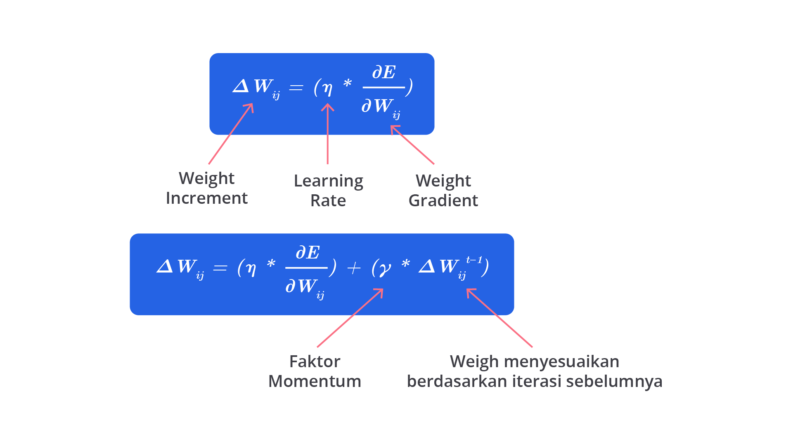

Dari salah satu contoh di atas, dengan melakukan tuning salah satu hyperparameter tanpa mempertimbangkan yang lain, dapat menyebabkan kinerja buruk karena keduanya saling berkaitan.

## Menyesuaikan Hyperparameter Berdasarkan Data

Hyperparameter yang relevan tidak hanya bergantung pada algoritma yang digunakan tetapi juga pada karakteristik data yang dilatih. Beberapa pertimbangan yang biasanya dilakukan yaitu seperti berikut.

Ukuran Dataset: pada dataset besar, batch size yang lebih besar bisa membuat pelatihan lebih efisien. Sementara pada dataset kecil, batch size yang kecil mungkin lebih tepat untuk mencegah overfitting.

Dimensi Data: pada dataset berdimensi tinggi, model seperti SVM sering kali membutuhkan tuning yang lebih intensif pada hyperparameter gamma untuk menangani kompleksitas data.

Jumlah Noise: jika data mengandung banyak noise, regularization parameter misalnya C pada SVM atau alpha pada Ridge Regression mungkin harus diperhatikan supaya terhindar dari overfitting.

## Evaluasi Kinerja Model dengan Cross-Validation

Untuk setiap kombinasi hyperparameter yang diuji, Anda perlu melakukan evaluasi kinerja model secara menyeluruh (tidak hanya satu kali pengujian). Penggunaan teknik seperti cross-validation akan sangat membantu karena memungkinkan mengevaluasi performa model pada berbagai subset data dalam satu waktu sehingga hasil tuning hyperparameter dapat divalidasi dengan lebih cermat.

Dengan pendekatan yang tepat, tahapan hyperparameter tuning dapat membantu model menghindari masalah seperti overfitting atau underfitting sehingga menghasilkan prediksi yang lebih akurat dan model yang dapat diandalkan.

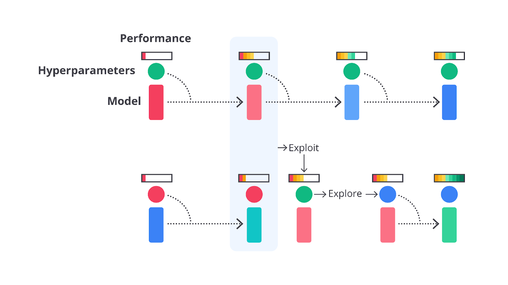

Memilih hyperparameter yang tepat sangat penting karena hyperparameter memiliki pengaruh langsung terhadap seberapa baik model dapat belajar dari data, kecepatan proses pelatihan, dan kemampuan model untuk menggeneralisasi pada data yang belum pernah dilihat sebelumnya.

Lalu, apa sih sebenarnya pengaruh dari hyperparameter tuning ini? Sedari tadi, kita hanya berbicara perihal peningkatan performa, tetapi kita tidak mengetahui apa yang terjadi di baliknya. Oleh karena itu, mari kita bahas sedikit lebih dalam pengaruh hyperparameter tuning.

Salah satu hyperparameter paling penting dalam banyak algoritma machine learning terutama dalam jaringan saraf tiruan dan gradient-based learning adalah learning rate. Learning rate menentukan seberapa besar langkah yang diambil oleh algoritma optimasi setiap kali memperbarui bobot atau parameter model berdasarkan gradient error.

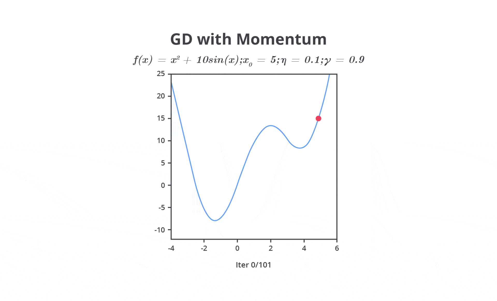

Pada tahap ini, Anda perlu mengatur learning rate dengan mempertimbangkan dua pilihan yaitu nilai learning rate yang besar atau kecil. Keduanya tentu memiliki kelebihan dan kekurangannya masing-masing.

Nilai learning rate yang cenderung besar dapat menyebabkan model belajar terlalu cepat sehingga memungkinkan model melewati performa optimal. Hal ini dapat menyebabkan osilasi dalam proses optimasi, di mana model tidak dapat menemukan titik minimum dari fungsi kerugian (loss function).

Sebaliknya, jika Anda mengatur nilai learning rate terlalu kecil akan menyebabkan pelatihan menjadi sangat lambat karena langkah yang terlalu kecil untuk menghasilkan perubahan sehingga tidak memberikan pembaharuan yang signifikan pada parameter. Meskipun ini dapat membantu model lebih mendekati solusi optimal, waktu pelatihan yang dibutuhkan akan sangat lama atau bahkan tidak sama sekali.

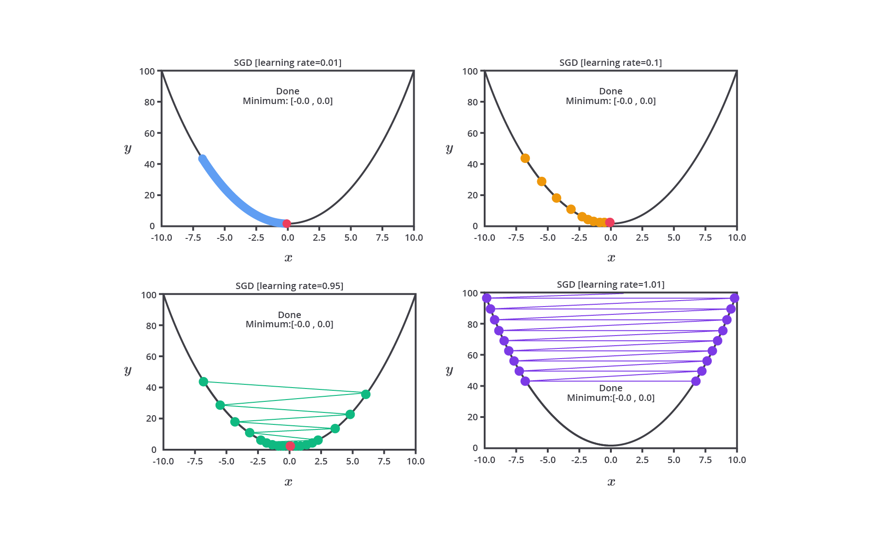

Oleh karena itu, learning rate perlu diatur dengan cermat untuk mencapai keseimbangan antara kecepatan konvergensi dan kualitas model machine learning yang dibangun. Psstt, tenang kita tidak perlu melakukan semuanya secara manual karena pada kelas ini kita juga akan mempelajari materi optimasi dengan menggunakan library yang sudah ada.

Selain memengaruhi proses pembelajaran, Anda juga dapat menghindari permasalahan overfitting atau underfitting dengan melakukan hyperparameter tuning. Salah satu alasannya karena Anda juga dapat mengatur variabel regularisasi ketika melakukan hyperparameter tuning. Regularisasi melibatkan penambahan penalti terhadap loss function untuk mencegah model menjadi terlalu rumit. Ada berbagai macam teknik regularisasi yang sudah Anda pelajari pada kelas ini, tetapi Anda tidak perlu kembali ke modul sebelumnya. Mari kita recap sedikit materi yang sudah Anda kuasai pada modul sebelumnya.

- L1 Regularization (Lasso): menambahkan penalti terhadap nilai absolut dari bobot parameter. Hal ini menyebabkan banyak parameter menjadi nol, sehingga menciptakan model yang lebih sederhana dan mengurangi overfitting. L1 juga berguna untuk seleksi fitur karena secara efektif menghilangkan fitur-fitur yang kurang penting.
- L2 Regularization (Ridge): menambahkan penalti dengan melakukan perhitungan kuadrat dari bobot parameter. L2 mendorong bobot parameter untuk menjadi kecil, tetapi tidak menjadi nol sehingga membantu mengurangi varian tanpa kehilangan informasi penting.
- Dropout (untuk jaringan saraf tiruan): pada setiap iterasi pelatihan, sebagian neuron akan dihilangkan secara acak dari jaringan untuk mencegah keterhubungan berlebih (co-adaptation) antar neuron. Dropout secara efektif mencegah overfitting dan menghasilkan jaringan yang lebih kuat dalam menggeneralisasi data baru.

Namun, ada dua hal yang perlu Anda pertimbangkan ketika mengatur nilai regularisasi yaitu kondisi ketika pengaturan terlalu tinggi atau pun terlalu rendah.

- Pengaturan Terlalu Tinggi: jika tingkat regularisasi terlalu tinggi, model mungkin tidak memiliki cukup kapasitas untuk mempelajari pola dalam data, menyebabkan underfitting.
- Pengaturan Terlalu Rendah: jika regularisasi terlalu rendah atau tidak diterapkan sama sekali, model mungkin menjadi sangat kompleks, yang menyebabkan overfitting pada data pelatihan dan kinerja yang buruk pada data pengujian.

Parameter selanjutnya yaitu ukuran dari batch_size yang Anda tentukan. Parameter ini memiliki peran yang cukup krusial karena berdampak terhadap penggunaan memori dari komputer yang Anda gunakan. Wait wait wait, jangan bilang Anda lupa apa itu batch_size? Agar kita memiliki pemahaman yang sama mari kita ulas sedikit penjelasannya terlebih dahulu.

Batch size adalah jumlah sampel yang diproses sebelum model memperbarui bobotnya dalam setiap iterasi pelatihan. Bayangkan Anda memiliki 1000 data yang akan dilatih, untuk mempermudah pemahaman, perhatikan visualisasi pembagian batch_size dengan nilai yang berbeda-beda.

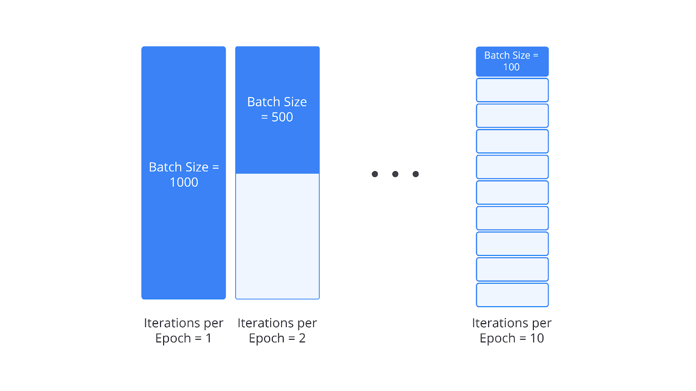

Lalu, apa hubungannya jumlah sampel dengan penggunaan memori? Tenang, mari kita pelajari penjelasan singkat terkait pengaruh nilai batch_size terhadap memori dan proses pelatihan.

### Batch size kecil

Memperbarui bobot lebih sering sehingga memberikan perubahan parameter yang lebih granular dan memungkinkan model untuk lebih cepat merespons terhadap setiap data sampel.

Pelatihan menjadi lebih tidak stabil, karena setiap batch kecil dapat menghasilkan estimasi gradient yang sangat bervariasi.

Membutuhkan lebih sedikit memori sehingga cocok untuk sistem dengan keterbatasan memori.

### Batch size besar

Memberikan estimasi gradient yang lebih stabil dan cenderung membuat pembaruan bobot lebih halus dan stabil.

Membutuhkan lebih banyak memori dan waktu komputasi, tetapi dapat mempercepat proses pelatihan dalam hal iterasi per epoch.

Setelah menentukan ukuran batch_size, tentunya Anda sudah paham tahapan yang akan kita lakukan berikutnya, ‘kan? Benar, kita akan mengatur nilai epochs pada proses pelatihan machine learning. Epoch adalah jumlah perulangan yang dilakukan selama proses pelatihan model machine learning atau deep learning. Hyperparameter ini penting dalam mengatur kapan proses pelatihan dihentikan.

Umumnya ketika menggunakan library Scikit-Learn, Anda tidak akan bertemu dengan variabel epochs karena biasanya namanya akan berganti menjadi max_iter tergantung pada algoritma yang Anda gunakan.

Woah, banyak sekali istilah baru pada materi kali ini. Sampai di sini mungkin tebersit di benak Anda sebuah pertanyaan, “Apa sih bedanya batch_size, iteration, dan epochs?” Wajar, karena ketiganya memiliki dependensi yang berhubungan. Simak gambar berikut untuk melihat perbedaannya secara detail.

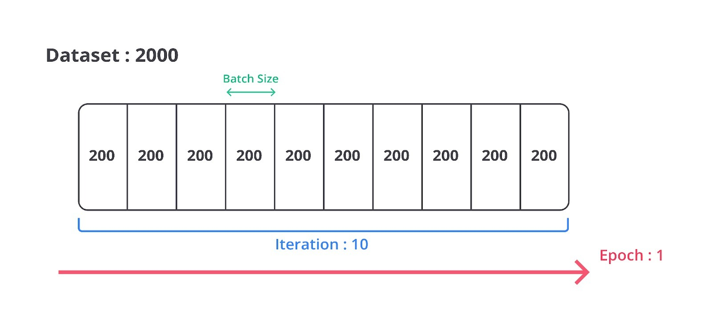

Ketika Anda memiliki 2000 data kemudian membagi dataset menjadi 10 iterasi, ukuran batch_size akan menjadi 200 data, begitu juga sebaliknya. Nah, proses pelatihan machine learning akan dilakukan sebanyak x epochs dengan ketentuan satu epochs harus mengulang sebanyak 10 iterasi di mana satu iterasi berisikan 200 buah data.

Ketika Anda mengatur jumlah epochs terlalu kecil, model cenderung memiliki performa yang tidak cukup baik. Hal ini dapat menyebabkan underfitting karena parameter belum mencapai nilai optimal. Sebaliknya, Anda juga tidak dapat mengatur epochs setinggi-tingginya karena model berpotensi overfitting pada data pelatihan karena terus belajar bahkan setelah mencapai titik optimal. Ini akan membuat model kurang mampu menggeneralisasi pada data baru.

“Serba salah dong, ya?” Tentu, tetapi tenang saja karena permasalahan tersebut dapat diselesaikan dengan menggunakan callbacks. Salah satu callbacks yang sering digunakan pada proses pembangunan model machine learning adalah early stopping. Early stopping adalah teknik untuk menghentikan pelatihan lebih awal ketika kinerja pada data validasi mulai menurun yang menunjukkan bahwa model mulai overfitting. Early stopping memungkinkan kita untuk menyetel jumlah epoch yang tepat secara otomatis.

Materi di atas merupakan contoh-contoh pengaruh hyperparameter tuning mulai dari pengaruh terhadap penggunaan memori, kompleksitas model, optimisasi model, hingga cara mengatasi overfitting atau underfitting.

Sejujurnya, di luar sana masih banyak sekali pengaruh hyperparameter tuning berdasarkan pengaturan yang Anda lakukan. Namun, tenang saja, dari berbagai macam hyperparameter tuning yang Anda lakukan kelak semuanya memiliki dampak yang sama dari materi yang sudah dipelajari pada kelas ini. Oleh karena itu, kami sangat menyarankan Anda untuk melakukan eksplorasi menggunakan algoritma lainnya dan temukan sensasi kebahagiaan ketika menemukan kombinasi terbaik pada model machine learning yang Anda buat.

Untuk memperdalam pengetahuan dan pengalaman Anda dalam proses hyperparameter tuning, mari kita pelajari beberapa metode untuk melakukan hyperparameter tuning sehingga tidak lagi menggunakan metode brute force.

Mari asumsikan brute force ini seperti Anda sedang mencari tahu kombinasi kata sandi pada laptop orang tua yang sudah lama tidak digunakan.

Tentunya semakin panjang kata sandi yang diatur, semakin lama juga proses yang dilalui dengan metode brute force ‘kan? Nah! Begitu juga pada kasus pemilihan hyperparameter ketika Anda membangun model machine learning.

Semakin banyak hyperparameter yang Anda gunakan pada suatu algoritma, semakin banyak juga kemungkinan yang bisa Anda implementasikan. Tentunya, proses tersebut akan memakan waktu yang sangat lama ‘kan?

Bayangkan juga ketika Anda membangun sebuah model yang memakan waktu 30 menit sekali pelatihan, lalu butuh waktu berapa lama untuk Anda mencoba semua kemungkinan yang ada? Mungkin selamanya jika Anda merupakan tipe orang yang tidak cepat puas dan selalu ingin mencoba.

Nah, dengan menggunakan metode optimasi pada hyperparameter tuning Anda dapat menghemat banyak waktu karena metode seperti grid search, random search, dan bayesian optimization akan mencari hyperparameter yang paling cocok untuk data yang Anda gunakan.

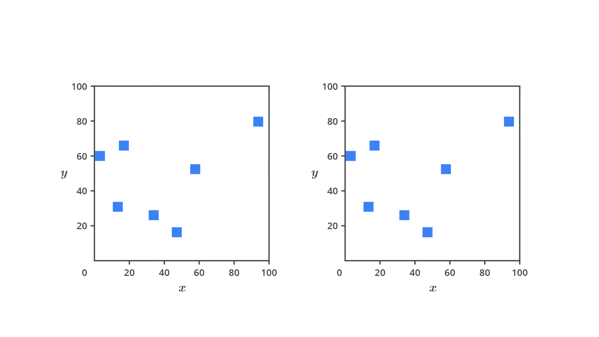

Alih-alih mencari semua kemungkinan yang ada, metode tersebut akan mencari hyperparameter terbaik dengan efisien. Tidak sabar, bukan? Tanpa berlama-lama mari kita pelajari satu per satu metode yang umum digunakan untuk melakukan hyperparameter tuning.
