# Studi Kasus Hyperparameter Tuning

Pada modul-modul sebelumnya, kita telah mempelajari penggunaan test set untuk mengevaluasi model sebelum masuk ke tahap produksi.

Sekarang bayangkan ketika kita bertugas untuk mengembangkan sebuah proyek machine learning. Kita bimbang kala memilih model yang akan dipakai dari 10 jenis model yang tersedia. Salah satu opsinya adalah dengan melatih semua model tersebut lalu membandingkan tingkat errornya pada test set. Setelah membandingkan performa semua model, Anda mendapati model regresi linier memiliki tingkat error yang paling kecil katakanlah sebesar 5% dan membawa model tersebut ke tahap produksi.

Kemudian ketika model diuji pada tahap produksi, tingkat error ternyata sebesar 15%. Kenapa ini terjadi? Masalah ini terjadi karena kita mengukur tingkat error berulang kali pada test set. Secara tidak sadar, kita telah memilih model yang hanya bekerja dengan baik pada test set tersebut. Hal ini menyebabkan model tidak bekerja dengan baik ketika menemui data baru. Solusi paling umum dari masalah ini adalah dengan melakukan hyperparameter tuning pada model machine learning.

Untuk memperdalam pengetahuan Anda, pada materi ini kita akan melakukan dua percobaan hyperparameter tuning pada kasus regresi dan klasifikasi.

## Latihan Regresi

Pada latihan pertama kita akan menggunakan dataset fetch_california_housing dari Scikit-learn untuk melakukan regresi menggunakan Random Forest Regressor. Dataset California Housing adalah dataset yang berisi informasi harga rumah berdasarkan berbagai fitur, dan tujuan model ini adalah memprediksi harga rata-rata rumah di wilayah tertentu.

Dalam studi kasus ini, kita akan melakukan hyperparameter tuning pada model Random Forest Regressor dan membandingkan performa serta efisiensi antara Grid Search, Random Search, dan Bayesian Optimization.

Pertama-tama, mari kita muat dataset yang akan digunakan. Pada latihan ini, kita tidak akan membahas pre-processing terlalu dalam dengan anggapan Anda sudah menguasai materi tersebut pada modul-modul sebelumnya.

```bash
from sklearn.datasets import fetch_california_housing
from sklearn.model_selection import train_test_split
from sklearn.preprocessing import StandardScaler

# Mengunduh dataset California Housing
X, y = fetch_california_housing(return_X_y=True)

# Membagi dataset menjadi training set dan testing set (70% training, 30% testing)
X_train, X_test, y_train, y_test = train_test_split(X, y, test_size=0.3, random_state=42)

# Melakukan scaling pada data (penting untuk regresi)
scaler = StandardScaler()
X_train = scaler.fit_transform(X_train)
X_test = scaler.transform(X_test)

print("Shape of training data:", X_train.shape)
print("Shape of testing data:", X_test.shape)
```

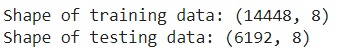

Output di atas memiliki 14.448 data latih dan 6192 data uji. Kemudian, mari kita latih model machine learning agar dapat memprediksi nilai kontinu karena kita akan membuat sebuah model regresi.

```bash
from sklearn.ensemble import RandomForestRegressor
from sklearn.metrics import mean_squared_error

# Inisialisasi model Random Forest Regressor
rf = RandomForestRegressor(random_state=42)
rf.fit(X_train, y_train)

# Evaluasi awal model tanpa tuning
y_pred = rf.predict(X_test)
initial_mse = mean_squared_error(y_test, y_pred)
print(f"Initial MSE on test set (without tuning): {initial_mse:.2f}")
```

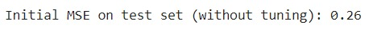

Nilai MSE pada model regresi ini 0.26 tanpa melakukan hyperparameter tuning. Nilai ini sudah cukup bagus mengingat kita menggunakan salah satu algoritma ensemble yaitu RandomForestRegressor. Anda dapat melakukan eksplorasi menggunakan algoritma lainnya juga, ya.

Selanjutnya, mari kita lakukan hyperparameter tuning dimulai dengan grid search.

```bash
from sklearn.model_selection import GridSearchCV

start_time = time.time()  # Mencatat waktu mulai

# Definisikan parameter grid untuk Grid Search
param_grid = {
    'n_estimators': [100, 200, 300],
    'max_depth': [10, 20, 30],
    'min_samples_split': [2, 5, 10],
    'min_samples_leaf': [1, 2, 4],
    'bootstrap': [True, False]
}

# Inisialisasi GridSearchCV
grid_search = GridSearchCV(estimator=rf, param_grid=param_grid, cv=3, n_jobs=-1, verbose=2)
grid_search.fit(X_train, y_train)

# Output hasil terbaik
print(f"Best parameters (Grid Search): {grid_search.best_params_}")
best_rf_grid = grid_search.best_estimator_

# Evaluasi performa model setelah Grid Search
y_pred_grid = best_rf_grid.predict(X_test)
grid_search_mse = mean_squared_error(y_test, y_pred_grid)
print(f"MSE after Grid Search: {grid_search_mse:.2f}")
end_time = time.time()  # Mencatat waktu selesai
execution_time = end_time - start_time  # Menghitung selisih waktu
print(f"Waktu eksekusi: {execution_time:.4f} detik")
```

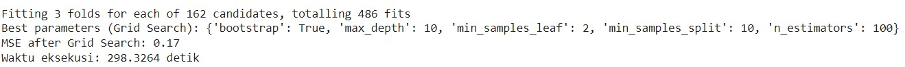

Nilai MSE setelah melalui grid search berkurang 0.02 menjadi 0.21, hal ini berarti hyperparameter pada foundation model belum mencapai titik optimalnya. Sebagai catatan, Anda juga dapat menambahkan lebih banyak kombinasi hyperparameter seperti berikut.

```bash
param_grid = {
    'n_estimators': [100, 200, 300, 400],
    'max_depth': [10, 20, 30, 40],
    'min_samples_split': [2, 5, 10, 15],
    'min_samples_leaf': [1, 2, 4, 8],
    'bootstrap': [True, False]
}
```

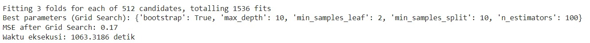

Namun, perlu Anda ingat dengan menambahkan kombinasi hyperparameter akan meningkatkan jumlah kombinasi secara signifikan. Hal ini menyebabkan konsumsi memori akan meningkat jauh lebih besar bahkan dapat menyebabkan crash atau error ketika proses tuning dilakukan.

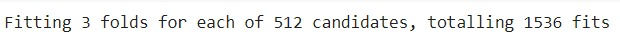

Ini menjadi salah satu kelemahan grid search yang sudah kita bahas pada materi sebelumnya karena metode ini akan melatih seluruh kombinasi dari hyperparameter yang kita tentukan.

Selanjutnya, mari kita lakukan optimasi dengan menggunakan random search menggunakan kode berikut.

```bash
from sklearn.model_selection import RandomizedSearchCV
import numpy as np

start_time = time.time()  # Mencatat waktu mulai
# Definisikan ruang pencarian untuk Random Search
param_dist = {
    'n_estimators': np.arange(100, 500, 100),
    'max_depth': [None] + list(np.arange(10, 50, 10)),
    'min_samples_split': np.arange(2, 11, 2),
    'min_samples_leaf': np.arange(1, 5),
    'bootstrap': [True, False]
}

# Inisialisasi RandomizedSearchCV
random_search = RandomizedSearchCV(estimator=rf, param_distributions=param_dist, n_iter=5, cv=3, n_jobs=-1, verbose=2, random_state=42)
random_search.fit(X_train, y_train)

# Output hasil terbaik
print(f"Best parameters (Random Search): {random_search.best_params_}")
best_rf_random = random_search.best_estimator_

# Evaluasi performa model setelah Random Search
y_pred_random = best_rf_random.predict(X_test)
random_search_mse = mean_squared_error(y_test, y_pred_random)
print(f"MSE after Grid Search: {random_search_mse:.2f}")
end_time = time.time()  # Mencatat waktu selesai
execution_time = end_time - start_time  # Menghitung selisih waktu
print(f"Waktu eksekusi: {execution_time:.4f} detik")
```

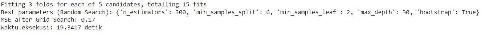

Pada output di atas nampak jelas sebuah perbedaan yang signifikan yaitu pada waktu eksekusi. Dengan menggunakan random search, komputer hanya mencari n kombinasi sesuai jumlah kombinasi yang ingin dicari. Semakin banyak nilai yang Anda tentukan, semakin lama juga waktu yang diperlukan, begitu juga sebaliknya.

Last but not least, mari kita lakukan optimasi dengan menggunakan bayesian optimization.

```bash
from skopt import BayesSearchCV

start_time = time.time()  # Mencatat waktu mulai

# Definisikan ruang pencarian untuk Bayesian Optimization
param_space = {
    'n_estimators': (100, 500),
    'max_depth': (10, 50),
    'min_samples_split': (2, 10),
    'min_samples_leaf': (1, 4),
    'bootstrap': [True, False]
}

# Inisialisasi BayesSearchCV
bayes_search = BayesSearchCV(estimator=rf, search_spaces=param_space, n_iter=32, cv=3, n_jobs=-1, verbose=2, random_state=42)
bayes_search.fit(X_train, y_train)

# Output hasil terbaik
print(f"Best parameters (Bayesian Optimization): {bayes_search.best_params_}")
best_rf_bayes = bayes_search.best_estimator_

# Evaluasi performa model setelah Random Search
y_pred_bayes = best_rf_bayes.predict(X_test)
bayes_mse = mean_squared_error(y_test, y_pred_bayes)
print(f"MSE after Grid Search: {bayes_mse:.2f}")
end_time = time.time()  # Mencatat waktu selesai
execution_time = end_time - start_time  # Menghitung selisih waktu
print(f"Waktu eksekusi: {execution_time:.4f} detik")
```

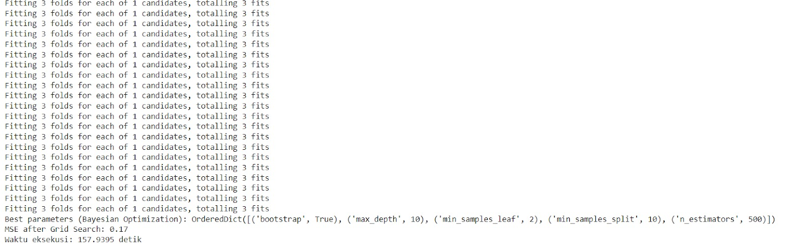

Berbeda dengan grid search dan random search, output yang diberikan oleh bayesian optimization hanya memiliki satu kandidat kombinasi yang berulang kali dihitung. Perulangan ini akan terus dilakukan hingga performa model machine learning sudah tidak ada perubahan.

Kesimpulan dari ketiga metode ini dapat kita rangkum seperti berikut.

- Grid Search memberikan hasil optimal tetapi membutuhkan waktu komputasi yang lebih lama karena mencoba semua kombinasi hyperparameter yang ada.
- Random Search memberikan hasil yang baik dengan waktu komputasi yang lebih cepat, tetapi bisa saja kehilangan kombinasi hyperparameter yang optimal.
- Bayesian Optimization memberikan keseimbangan terbaik antara efisiensi komputasi dan hasil optimal, memanfaatkan informasi dari iterasi sebelumnya untuk mencari kombinasi hyperparameter terbaik.

Dengan dataset California Housing, kita dapat melihat perbedaan performa model secara lebih signifikan setelah dilakukan hyperparameter tuning. Bayesian Optimization adalah pilihan yang baik jika Anda ingin mengoptimalkan model secara lebih efisien, sementara Grid Search memberikan hasil yang lebih pasti dengan menguji semua kombinasi.

Ada sebuah fun fact ketika Anda mencoba mengimplementasikan hyperparameter tuning terhadap sebuah model machine learning. Kelak ketika Anda mencoba melakukan tuning jangan heran jika performa model tidak berubah sama sekali atau bahkan menurun.

Penurunan akurasi setelah hyperparameter tuning adalah hal yang umum terjadi dalam pembangunan model machine learning. Agar Anda memahami perbedaan tersebut, mari kita coba gunakan latihan klasifikasi sebagai playground untuk eksplorasi segala kemungkinan yang bisa terjadi ketika melakukan hyperparameter tuning.

## Latihan Klasifikasi

Pada latihan kedua ini, Anda akan membangun sebuah model klasifikasi dengan dataset yang berisi informasi tentang klasifikasi kredit. Dataset ini memiliki sekitar 1.000 baris dan sejumlah fitur yang menjelaskan profil pelanggan, seperti riwayat kredit, status pekerjaan, pendapatan, dan sebagainya. Seperti biasa, mari kita lakukan loading dataset dan sedikit preprocessing agar data dapat dilatih dengan baik.

```bash
from sklearn.datasets import fetch_openml
import pandas as pd
from sklearn.model_selection import train_test_split
from sklearn.preprocessing import LabelEncoder

# Mengunduh dataset German Credit dari OpenML
X, y = fetch_openml(name='credit-g', version=1, return_X_y=True, as_frame=True)

# Konversi target menjadi numerik
le = LabelEncoder()
y = le.fit_transform(y)  # Mengubah 'good' menjadi 1 dan 'bad' menjadi 0

# Melakukan One-Hot Encoding pada fitur kategorikal
X_encoded = pd.get_dummies(X, drop_first=True)  # Konversi fitur kategorikal menjadi numerik

# Membagi dataset menjadi training set dan testing set (70% training, 30% testing)
X_train, X_test, y_train, y_test = train_test_split(X_encoded, y, test_size=0.3, random_state=42)

print("Shape of training data:", X_train.shape)
print("Shape of testing data:", X_test.shape)
```

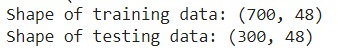

Mari kita asumsikan sampai pada titik ini dataset yang digunakan sudah siap dilatih sehingga Anda hanya perlu membangun sebuah foundation model dengan menggunakan kode berikut.

```bash
from sklearn.ensemble import RandomForestClassifier

# Inisialisasi model Random Forest tanpa hyperparameter tuning
rf = RandomForestClassifier(random_state=42)
rf.fit(X_train, y_train)

# Evaluasi awal model tanpa tuning
initial_score = rf.score(X_test, y_test)
print(f"Initial accuracy on test set (without tuning): {initial_score:.2f}")
```

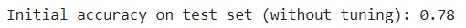

Sama halnya dengan latihan pada kasus regresi tahap berikutnya Anda hanya perlu membangun sebuah model dengan menggunakan hyperparameter tuning dimulai dari grid search.

```bash
from sklearn.model_selection import GridSearchCV

# Definisikan parameter grid untuk Grid Search
param_grid = {
    'n_estimators': [100, 200, 300],
    'max_depth': [10, 20, 30],
    'min_samples_split': [2, 5, 10],
    'criterion': ['gini', 'entropy']
}

# Inisialisasi GridSearchCV
grid_search = GridSearchCV(estimator=rf, param_grid=param_grid, cv=3, n_jobs=-1, verbose=2)
grid_search.fit(X_train, y_train)

# Output hasil terbaik
print(f"Best parameters (Grid Search): {grid_search.best_params_}")
best_rf_grid = grid_search.best_estimator_

# Evaluasi performa model pada test set
grid_search_score = best_rf_grid.score(X_test, y_test)
print(f"Accuracy after Grid Search: {grid_search_score:.2f}")
```

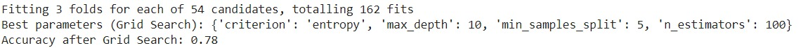

Langkah berikutnya, lakukan hal yang sama dengan sebelumnya, tetapi menggunakan random search.

```bash
from sklearn.model_selection import RandomizedSearchCV
import numpy as np

# Definisikan ruang pencarian untuk Random Search
param_dist = {
    'n_estimators': np.linspace(100, 500, 5, dtype=int),
    'max_depth': np.linspace(10, 50, 5, dtype=int),
    'min_samples_split': [2, 5, 10],
    'criterion': ['gini', 'entropy']
}

# Inisialisasi RandomizedSearchCV
random_search = RandomizedSearchCV(estimator=rf, param_distributions=param_dist, n_iter=20, cv=3, n_jobs=-1, verbose=2, random_state=42)
random_search.fit(X_train, y_train)

# Output hasil terbaik
print(f"Best parameters (Random Search): {random_search.best_params_}")
best_rf_random = random_search.best_estimator_

# Evaluasi performa model pada test set
random_search_score = best_rf_random.score(X_test, y_test)
print(f"Accuracy after Random Search: {random_search_score:.2f}")
```

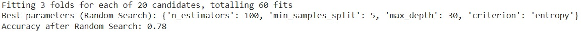

Whoops, jika Anda perhatikan, kedua metode di atas memiliki performa yang sama dengan foundation model yang sudah kita bangun di awal latihan. Sebagai pembuktian, mari kita gunakan bayesian optimization untuk melakukan hyperparameter tuning.

```bash
from skopt import BayesSearchCV

# Definisikan ruang pencarian untuk Bayesian Optimization
param_space = {
    'n_estimators': (100, 500),
    'max_depth': (10, 50),
    'min_samples_split': (2, 10),
    'criterion': ['gini', 'entropy']
}

# Inisialisasi BayesSearchCV
bayes_search = BayesSearchCV(estimator=rf, search_spaces=param_space, n_iter=32, cv=3, n_jobs=-1, verbose=2, random_state=42)
bayes_search.fit(X_train, y_train)

# Output hasil terbaik
print(f"Best parameters (Bayesian Optimization): {bayes_search.best_params_}")
best_rf_bayes = bayes_search.best_estimator_

# Evaluasi performa model pada test set
bayes_search_score = best_rf_bayes.score(X_test, y_test)
print(f"Accuracy after Bayesian Optimization: {bayes_search_score:.2f}")
```

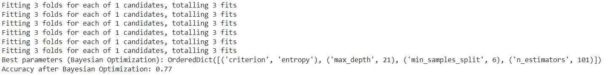

Voilaa, ternyata dengan menggunakan metode apa pun, hasil yang diberikan cenderung sama saja dan bahkan terdapat performa yang menurun. Hal ini merupakan fun fact yang telah kita bahas sebelumnya. Pertanyaannya, mengapa hal ini bisa terjadi?

Seperti yang sudah kita bahas penurunan akurasi setelah hyperparameter tuning adalah hal yang umum terjadi dalam pembangunan model machine learning, dan beberapa faktor yang berkontribusi terhadap masalah ini antara lain seperti berikut.

- Overfitting: tuning hyperparameter secara berlebihan bisa menyebabkan model terlalu sesuai dengan data pelatihan (overfit). Hal ini dapat menyebabkan performa model yang baik pada data pelatihan tetapi buruk pada data pengujian.
- Underfitting: sebaliknya, jika model tidak cukup kompleks setelah tuning, model bisa gagal menangkap pola penting dari data (underfit).
- Pemilihan Ruang Pencarian yang Tidak Tepat: jika rentang atau ruang hyperparameter yang dicari terlalu kecil atau tidak mencakup area yang optimal, hasil tuning dapat merugikan performa model.
- Evaluasi yang Tidak Konsisten: cross-validation yang kurang efektif atau ruang pencarian hyperparameter yang terlalu besar juga dapat membuat tuning kurang efektif.

Dari berbagai macam penjelasan di atas, salah satu alasan model yang kita bangun tidak berubah karena dataset yang digunakan terlalu kecil atau dummy. Hal ini sengaja kami lakukan agar Anda dapat memahami perbedaan dari kedua latihan yang telah dilakukan.

Untuk melakukan tuning yang lebih baik, Anda dapat menerapkan beberapa saran berikut.

- Memastikan bahwa dataset yang digunakan sudah baik.
- Memperluas ruang pencarian hyperparameter.
- Memfokuskan tuning pada hyperparameter kunci yang paling berdampak pada performa model, seperti n_estimators, max_depth, dan min_samples_split.
- Menggunakan cross-validation dengan lebih banyak fold untuk membuat evaluasi performa lebih stabil.
- Memperhatikan keseimbangan antara eksplorasi dan eksploitasi hyperparameter dengan menggunakan metode seperti Bayesian Optimization yang lebih efisien dalam memprediksi kombinasi optimal.

Sebagai bentuk eksplorasi, Anda dapat melihat beberapa contoh penerapan hyperparameter tuning pada notebook berikut: Update MLP - Modul 8 Optimasi dengan Hyperparameter Tuning. Selain itu, Anda juga dapat menerapkan metode ini pada studi kasus lainnya ya. Psst, jangan lupa juga untuk menerapkan hyperparameter tuning pada submission akhir, ya!

Sungguh tidak terasa sekarang Anda sudah mencapai akhir dari pembelajaran yang ada di kelas ini. Lika-liku pembangunan model machine learning telah Anda lewati dimulai dari pembangunan model, ragam model machine learning hingga bersahabat dengan error yang terjadi. Semua itu Anda lalui dengan gagah dan berani hingga akhirnya dapat membangun beragam model machine learning yang andal.

Selamat, Anda telah menyelesaikan kelas Machine Learning untuk Pemula, You did something big! Jika Anda masih ingin bermain-main di kelas ini, silakan baca-baca kembali modul yang sudah ada, ya. Oiya, kami juga sangat menanti cerita sukses Anda dalam perjalanan sebagai seorang machine learning engineer yang andal. Jangan lupa untuk membagikan cerita sukses Anda kelak, ya. Sampai jumpa lagi champs!
