# Grid Search

Grid Search adalah salah satu metode hyperparameter tuning yang digunakan untuk menemukan kombinasi hyperparameter optimal pada model machine learning. Grid Search bekerja dengan mencoba semua kombinasi dari nilai hyperparameter yang telah Anda tentukan dan mengevaluasi performa model untuk setiap kombinasi tersebut.

Tujuan dari Grid Search adalah untuk mengidentifikasi set hyperparameter yang menghasilkan performa terbaik berdasarkan metrik evaluasi yang dipilih (misalnya akurasi, F1-score, atau MSE).

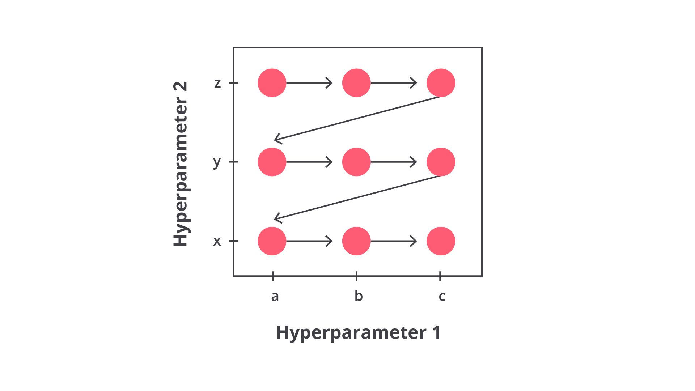

Grid Search dikenal karena pendekatannya yang komprehensif, di mana setiap kombinasi hyperparameter akan di coba berurutan tanpa pengaturan manual. Meskipun ini memberikan hasil yang terjamin, tetapi metode ini bisa sangat lambat dan memakan banyak sumber daya saat jumlah pencarian hyperparameter besar.

Metode Grid Search sebenarnya memiliki tahapan yang sederhana layaknya pencarian manual. Alih-alih mengubah satu per satu hyperparameter dan melatih model, Grid Search akan melakukan semua tahapan secara otomatis. Kurang lebih tahapan yang dilakukan Grid Search mencakup hal berikut.

- Menentukan Ruang Hyperparameter: pengguna menentukan hyperparameter yang ingin diatur dan menetapkan rentang nilai untuk setiap hyperparameter. Nilai-nilai ini akan membentuk grid (sebuah "tabel kombinasi" dari semua kemungkinan).
- Mencoba Semua Kombinasi: Grid Search mencoba semua kombinasi hyperparameter yang mungkin, melatih model dengan setiap kombinasi tersebut, dan mengevaluasi performa berdasarkan metrik tertentu.
- Memilih Kombinasi Terbaik: setelah semua kombinasi diuji, Grid Search akan memilih kombinasi hyperparameter yang menghasilkan performa terbaik.

Misalnya, jika Anda memiliki dua hyperparameter yaitu learning rate dan jumlah neuron. Lalu Anda menentukan masing-masing 3 nilai yang ingin diuji seperti data berikut.

```bash
param_grid = {
    'Learning Rate': [0.01, 0.1, 1],
    'Jumlah Neuron': [10, 50, 100]
}
```

Sehingga, grid search akan menghasilkan 9 kombinasi yang harus diuji kurang lebih seperti berikut.

Learning Rate = 0.01, Jumlah Neuron = 10
Learning Rate = 0.01, Jumlah Neuron = 50
Learning Rate = 0.01, Jumlah Neuron = 100
Learning Rate = 0.1, Jumlah Neuron = 10
Learning Rate = 0.1, Jumlah Neuron = 50
Learning Rate = 0.1, Jumlah Neuron = 100
Learning Rate = 1, Jumlah Neuron = 10
Learning Rate = 1, Jumlah Neuron = 50
Learning Rate = 1, Jumlah Neuron = 100

Berdasarkan seluruh kemungkinan yang dapat terjadi di atas, model machine learning akan menyimpan kombinasi terbaik sehingga Anda tidak perlu melatih model secara manual. Dengan kata lain, metode ini cenderung lebih cocok digunakan ketika memenuhi setidaknya tiga kriteria berikut.

- Ruang hyperparameter relatif kecil. Artinya, jumlah hyperparameter yang perlu disetel tidak terlalu banyak, dan setiap hyperparameter memiliki beberapa nilai yang bisa dicoba.
- Karena Grid Search mencoba semua kombinasi, ini memerlukan waktu dan komputasi yang lebih besar daripada metode lain seperti Random Search. Sehingga, Anda perlu mengalokasikan sumber daya komputasi yang cukup besar.
- Untuk model yang kompleks dengan banyak hyperparameter, metode ini bisa tidak praktis karena waktu pelatihan yang meningkat secara eksponensial dengan jumlah kombinasi hyperparameter.

Tentunya metode ini akan memberikan beberapa keuntungan ketika Anda membangun sebuah model machine learning. Salah satunya karena Grid Search memastikan bahwa setiap kombinasi hyperparameter yang mungkin diuji akan dilatih sehingga kita bisa yakin bahwa tidak ada kombinasi yang terlewat dan memberikan performa yang terbaik. Selain itu, meskipun membutuhkan waktu yang cenderung lebih lama Grid Search sangat mudah digunakan dan diimplementasikan, terutama dengan bantuan library seperti Scikit-learn.

Namun, di dunia ini tidak ada yang sempurna begitu juga dengan metode ini. Seperti yang sudah Anda ketahui bahwa Grid Search membutuhkan komputasi yang cukup besar dan waktu yang cenderung lebih lama terutama jika ruang pencarian hyperparameter luas dan model yang digunakan sangat kompleks. Di lain sisi, metode ini juga memiliki risiko overfitting ketika Anda terlalu banyak menguji kombinasi hyperparameter yang berbeda pada dataset pelatihan karena model bisa saja membuat pola yang terlalu cocok dengan data pelatihan.

Berdasarkan kekurangan tersebut maka bisa kita simpulkan bahwa metode ini kurang efisien jika memiliki jumlah hyperparameter yang banyak. Misalnya, jika ada 3 hyperparameter yang masing-masing memiliki 10 nilai, ini berarti 1000 kombinasi yang harus diuji. Proses ini bisa memakan banyak waktu dan sumber daya, terlebih jika Anda tidak memiliki komputer yang memadai.

Sampai di sini, Anda sudah memahami salah satu metode untuk melakukan hyperparameter tuning. Bagaimana sangat menarik ‘kan? Harapannya dengan memahami bagaimana Grid Search bekerja dan kapan sebaiknya digunakan, Anda dapat mengoptimalkan model machine learning secara lebih efektif untuk meningkatkan performa tanpa perlu mencoba hyperparameter secara manual.

# Random Search

Random Search adalah salah satu metode hyperparameter tuning yang cenderung lebih efisien dibandingkan Grid Search. Alih-alih mencoba semua kombinasi hyperparameter seperti dalam Grid Search, Random Search memilih beberapa kombinasi hyperparameter secara acak dari ruang pencarian yang sudah ditentukan. Proses ini memungkinkan model untuk diuji dengan kombinasi acak yang dipilih secara independen untuk setiap iterasi.

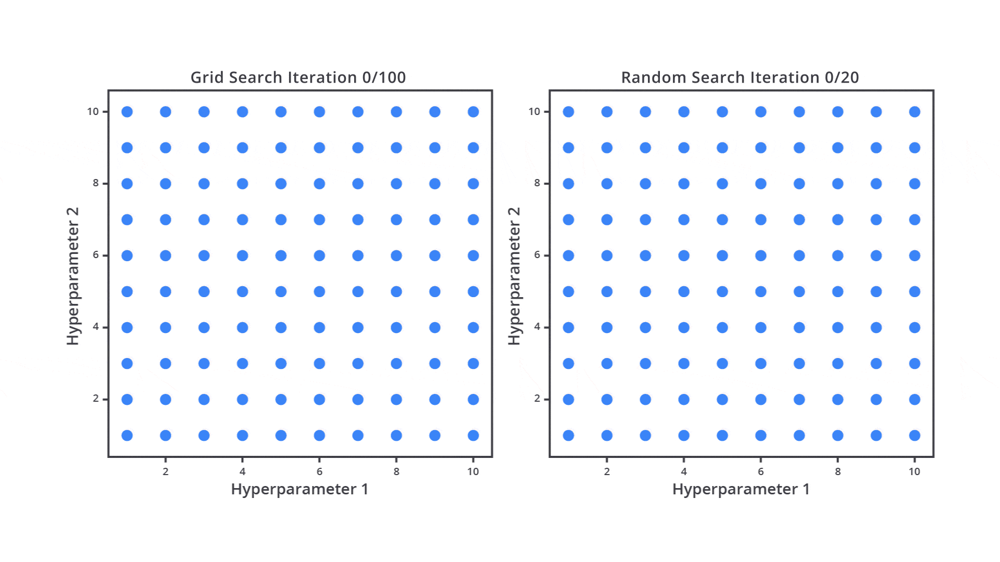

Tujuan Random Search adalah menghemat waktu dan sumber daya dengan tetap melatih sejumlah kombinasi yang cukup representatif dari ruang pencarian, tanpa perlu menguji semua kombinasi yang mungkin terjadi.

Berbeda dari Grid Search yang mencoba semua kombinasi hyperparameter, Random Search hanya memilih sejumlah kombinasi yang dipilih secara acak dari ruang pencarian hyperparameter. Ini berarti kita menentukan jumlah iterasi (kombinasi) yang ingin dicoba, dan setiap iterasi memilih satu set hyperparameter secara acak.

Misalnya, jika Anda memiliki dua hyperparameter, learning rate dan jumlah neuron, Anda bisa mendefinisikan ruang pencarian yang besar tanpa perlu mengatur nilainya satu per satu. Random Search kemudian memilih beberapa kombinasi secara acak dan menguji model untuk setiap kombinasi tersebut.

Mari kita asumsikan Anda memiliki tiga buah hyperparameter yaitu C, gamma, dan kernel dengan ketentuan seperti berikut.

```bash
param_dist = {
    'C': np.logspace(-2, 2, 10),  # C = 0.01 sampai 100
    'gamma': np.logspace(-4, 1, 10),  # Gamma = 0.0001 sampai 10
    'kernel': ['rbf']  # Kernel tetap menggunakan 'rbf'
}
```

Rentang nilai C didefinisikan sebagai logaritmik menggunakan np.logspace(-2, 2, 10), yang berarti kita mencari nilai C dalam rentang dari 10-2 hingga 102. Nilai tersebut akan menghasilkan 10 nilai yang dipilih dalam rentang logaritmik dari 0.01 hingga 100. Nilai yang mungkin untuk C adalah [0.01, 0.027, 0.072, 0.193, 0.52, 1.38, 3.59, 9.33, 24.59, 100.0].

Gamma juga didefinisikan dalam rentang logaritmik menggunakan np.logspace(-4, 1, 10), yang berarti nilai gamma akan berkisar dari 10-4 hingga 101. Nilai yang mungkin untuk gamma adalah [0.0001, 0.000278, 0.000774, 0.00215, 0.00599, 0.01668, 0.04642, 0.12915, 0.35938, 10.0]

Terakhir hanya ada satu nilai untuk kernel, yaitu ‘rbf’. Jadi, kernel selalu akan menggunakan Radial Basis Function (RBF) yang merupakan jenis kernel yang populer untuk SVM (algoritma yang akan kita coba pada kasus ini).

Jika Anda perhatikan saat ini Anda memiliki 100 kombinasi yang terdiri dari C dan gamma masing-masing memiliki 10 nilai. Dari mana 100 kombinasi tersebut didapat? Tenang, Anda dapat menghitung jumlah kombinasi dengan sederhana menggunakan rumus berikut.

```bash
Total Kombinasi = Jumlah Nilai C * Jumlah Nilai Gamma * Jumlah Nilai Kernel
Total Kombinasi = 10 * 10 * 1
Total Kombinasi = 100
```

Dengan menggunakan Random Search komputer tidak mencoba semua kombinasi seperti yang dilakukan pada Grid Search. Sebaliknya, kita menentukan berapa banyak kombinasi yang ingin diuji. Salah satunya dengan menentukan nilai parameter n_iter dalam RandomizedSearchCV. Sehingga, setiap iterasi dalam Random Search memilih satu kombinasi hyperparameter secara acak dari ruang pencarian yang tersedia.

Misalnya, jika Anda menetapkan n_iter=10, Random Search akan secara acak memilih 10 kombinasi dari total 100 kombinasi yang mungkin terjadi di ruang pencarian. Tidak semua kombinasi akan dicoba sehingga kita bisa menghemat waktu komputasi.

Dari penjelasan di atas, tentunya sudah terlihat jelas kan salah satu kelebihan dari Random Search ini? Agar kita memiliki pemahaman yang sama, mari kita bahas bersama beberapa kelebihan Random Search.

- Efisiensi Waktu: pada penggunaan Grid Search komputer akan menguji semua kombinasi. Namun, dengan Random Search, Anda bisa menentukan untuk mencoba sebagian dari kombinasi tersebut misalnya 10, 20, 30, atau x kombinasi.
- Kecepatan Komputasi: Random Search lebih cepat jika waktu dan sumber daya komputasi terbatas, karena kita hanya mencoba sejumlah iterasi yang sudah ditetapkan.
- Fleksibilitas: kita dapat mengontrol seberapa banyak kombinasi yang ingin diuji tanpa perlu menguji setiap kemungkinan kombinasi sehingga bisa menghemat waktu. Kekurangannya, Anda bisa saja kehilangan peluang untuk menemukan kombinasi hyperparameter terbaik.

Meskipun lebih cepat dan efisien daripada Grid Search, Random Search juga memiliki keterbatasan seperti berikut.

- Tidak Menjamin Hasil Terbaik: karena hanya beberapa kombinasi yang diuji, tidak ada jaminan bahwa Random Search akan menemukan kombinasi hyperparameter terbaik.
- Ketergantungan pada Jumlah Iterasi: semakin sedikit iterasi yang dilakukan, semakin kecil kemungkinan Random Search menemukan hyperparameter yang optimal. Jika n_iter terlalu kecil, kemungkinan mendapatkan hasil suboptimal lebih besar.

Berangkat dari kekurangan dan kelebihan Random Search di atas, kita tidak bisa menggunakan salah satu metode hyperparameter tuning untuk seluruh proyek yang sedang dibangun. Jika kita bandingkan secara garis besar, perbedaan dari Grid Search dan Random Search dapat disimpulkan sebagai berikut.

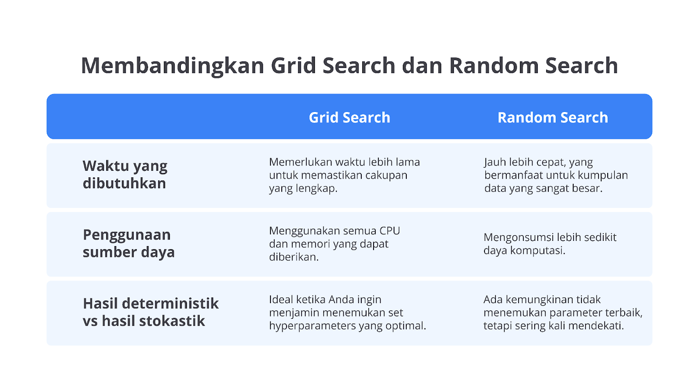

Walaupun Random Search membutuhkan komputasi yang lebih ringan, terkadang untuk beberapa kasus tertentu seperti skripsi Anda perlu menggunakan Grid Search. Hal itu karena ketika menulis thesis, Anda perlu mendapatkan performa terbaik dari penelitian sebelumnya atau penelitian baru yang sedang dilakukan.

Dengan menggunakan Grid Search Anda akan lebih mudah menemukan kombinasi hyperparameter terbaik pada algoritma yang digunakan. Dengan begitu, Anda bisa menjawab dengan yakin bahwa model machine learning yang dibangun sudah optimal dan memiliki performa terbaik.

Namun, perlu Anda ingat contoh di atas hanya salah satu dari berbagai kasus yang biasa terjadi. Oleh karena itu, Anda perlu menentukan sendiri metode yang paling relevan dengan studi kasus dan objektif yang akan dicapai.

Anyway, jangan overthinking memikirkan kedua metode tersebut, ya. Pada materi berikutnya, kita akan mempelajari salah satu metode yang memiliki beberapa kelebihan signifikan dibandingkan dengan Grid Search dan Random Search dalam proses hyperparameter tuning. Penasaran dengan metode tersebut? Kuy, tanpa berlama-lama lagi, mari kita melangkah ke materi berikutnya, yaitu Bayesian Optimization.

# Bayesian Optimization

Bayesian Optimization adalah salah satu teknik hyperparameter tuning yang efisien dan kompleks. Metode ini digunakan untuk menemukan kombinasi hyperparameter yang optimal dengan melakukan lebih sedikit percobaan dibandingkan Grid Search atau Random Search.

Bayesian Optimization sangat berguna untuk masalah yang memerlukan tuning hyperparameter pada ruang pencarian yang besar, di mana mencoba semua kombinasi hyperparameter akan sangat tidak efisien dan memakan waktu.

Bayesian Optimization tidak melakukan pencarian secara acak atau mencoba semua kombinasi, melainkan menggunakan pendekatan probabilistik untuk secara cermat memilih kombinasi hyperparameter yang paling mungkin memberikan hasil terbaik berdasarkan percobaan sebelumnya. Dengan demikian, metode ini sangat efektif dalam mengurangi jumlah percobaan yang diperlukan untuk menemukan hyperparameter terbaik.

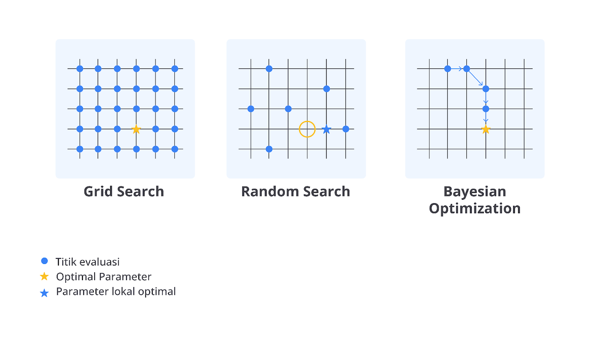

Bayesian Optimization bekerja dengan membangun model probabilistik dari fungsi objektif yang ingin kita optimalkan, misalnya akurasi model atau nilai error. Model probabilistik ini digunakan untuk memperkirakan bagaimana performa model akan berubah dengan kombinasi hyperparameter yang berbeda. Bayesian Optimization kemudian menggunakan prediksi ini untuk memilih kombinasi hyperparameter berikutnya yang memiliki performa lebih baik.

Alih-alih mencoba kombinasi hyperparameter secara acak, Bayesian Optimization menggunakan pendekatan berdasarkan data. Metode ini memanfaatkan informasi dari percobaan sebelumnya untuk terus memperbaiki pencarian sehingga hanya kombinasi terbaik yang diuji.

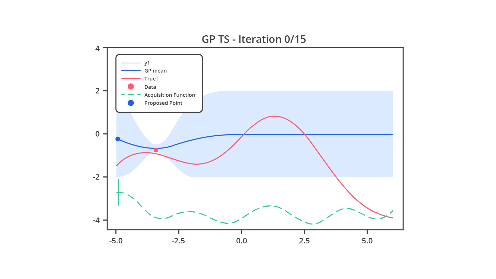

Pada intinya, Bayesian Optimization menggunakan model probabilistik yang disebut surrogate model untuk memperkirakan fungsi objektif yang tidak diketahui. Model surrogate biasanya adalah Gaussian Process (GP) atau kadang Random Forest. Fungsi ini digunakan karena evaluasi langsung dari fungsi objektif bisa sangat mahal secara komputasi.

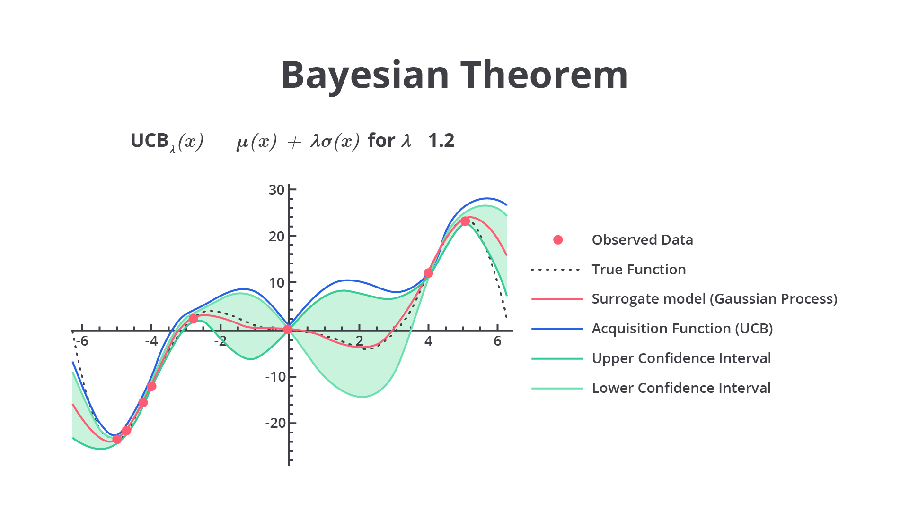

Setelah model probabilistik dibangun, Bayesian Optimization menggunakan fungsi akuisisi untuk menentukan hyperparameter mana yang akan diuji pada iterasi berikutnya. Fungsi akuisisi menentukan trade-off antara eksploitasi dan eksplorasi. Mari kita bahas sedikit terkait kedua nilai trade-off tersebut.

- Eksploitasi: mencoba kombinasi hyperparameter yang sudah diketahui memberikan hasil yang baik (berdasarkan model probabilistik).
- Eksplorasi: mencoba kombinasi hyperparameter baru yang belum pernah diuji sebelumnya.

Fungsi akuisisi mengukur potensi performa dengan cara menguji hyperparameter baru menggunakan estimasi dari model probabilistik. Secara umum terdapat tiga fungsi akuisisi yang biasa digunakan yaitu Expected Improvement, Probability of Improvement, dan Upper Confidence Bound.

- Expected Improvement (EI): mengukur ekspektasi peningkatan performa model.
- Probability of Improvement (PI): mengukur probabilitas bahwa percobaan berikutnya akan meningkatkan kinerja.
- Upper Confidence Bound (UCB): menggabungkan perkiraan performa dan kesalahan untuk mengeksplorasi dan mengeksploitasi secara bersamaan.

Setelah Anda menentukan fungsi akuisisi yang akan digunakan, Bayesian Optimization akan menerapkan fungsi tersebut untuk menentukan hyperparameter berikutnya yang akan diuji. Kombinasi hyperparameter ini dipilih berdasarkan estimasi dari model probabilistik (Gaussian Process) yang dibangun dari percobaan sebelumnya.

Lalu, apa kelebihan metode ini? Tenang, pada tahap ini Anda akan memahami kelebihan utama dari metode ini. Pada metode ini, setiap kali sebuah kombinasi hyperparameter baru diuji, hasil dari percobaan tersebut akan digunakan untuk memperbarui model probabilistik (Gaussian Process). Hal ini memastikan bahwa model terus belajar dari setiap percobaan dan dapat memberikan estimasi yang lebih baik pada iterasi berikutnya.

Proses ini berulang hingga tercapai jumlah percobaan yang diinginkan atau performa model sudah tidak mengalami peningkatan yang signifikan.

Sedari tadi kita membahas dan menyebutkan Gaussian Process, tetapi tahukah Anda apa itu Gaussian Process? Gaussian Process (GP) adalah model yang digunakan untuk memperkirakan hubungan antara hyperparameter dan kinerja model. Gaussian Process menghasilkan distribusi probabilistik dari fungsi yang diperkirakan, bukan hanya nilai tunggal.

Setiap kali kita memberikan input (kombinasi hyperparameter), Gaussian Process memperkirakan distribusi kemungkinan nilai keluaran dan kesalahan terkait.

Ini memungkinkan Gaussian Process untuk memperhitungkan kesalahan dalam prediksinya. Jika kesalahan tinggi, fungsi akuisisi mungkin memilih untuk mengeksplorasi kombinasi baru untuk mengurangi kesalahan tersebut.

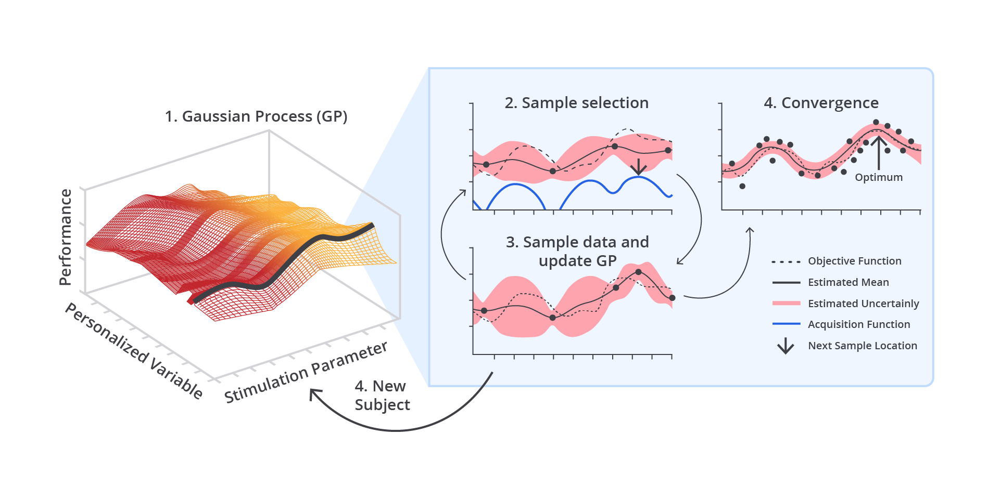

Jika dibandingkan dengan Grid Search dan Random Search, metode ini memiliki beragam kelebihan yang dapat Anda pertimbangkan ketika memilih metode optimasi model machine learning.

1. Efisiensi Komputasi
   Seperti yang Anda tahu bahwa metode ini sangat efisien dalam menemukan hyperparameter optimal, terutama untuk ruang pencarian yang besar. Dibandingkan dengan Grid Search yang memerlukan evaluasi setiap kombinasi dan Random Search yang memilih kombinasi secara acak, Bayesian Optimization secara otomatis memilih kombinasi terbaik berdasarkan hasil percobaan sebelumnya. Ini mengurangi jumlah percobaan yang diperlukan untuk menemukan hyperparameter terbaik.

2. Memanfaatkan Informasi dari Percobaan Sebelumnya
   Tidak seperti Random Search yang mengabaikan hasil percobaan sebelumnya, Bayesian Optimization menggunakan model probabilistik yang diperbarui pada setiap iterasi. Setiap percobaan baru menambah informasi yang digunakan untuk memprediksi kombinasi hyperparameter berikutnya, sehingga pencarian lebih terarah.

3. Fleksibel untuk Ruang Pencarian Kompleks
   Karena metode ini memanfaatkan model probabilistik untuk memperkirakan hasil, ia dapat mengeksplorasi dan mengeksploitasi ruang pencarian dengan lebih efisien.

4. Kemampuan Menangani Ketidakpastian
   Dengan menggunakan Gaussian Process, Bayesian Optimization tidak hanya memberikan perkiraan nilai kinerja model, tetapi juga membantu mengurangi kesalahan dalam prediksi. Hal ini memungkinkan algoritma untuk secara otomatis mengeksplorasi area ruang pencarian yang belum pasti sehingga dapat memberikan peningkatan kinerja yang signifikan.

Namun, seperti metode lainnya yang memiliki kekurangan, Bayesian Optimization juga tak luput dari kekurangan. Dengan metode yang powerful, bukan berarti Anda juga bisa menggunakan Bayesian Optimization terhadap semua kasus yang dihadapi. Berikut beberapa kekurangan dari metode ini.

1. Kompleksitas Implementasi
   Gaussian Process yang sering digunakan sebagai model probabilistik memerlukan pengetahuan teknis yang lebih dalam untuk diimplementasikan dengan benar, terutama pada ruang pencarian yang besar.

2. Waktu Komputasi untuk Gaussian Process
   Walaupun Bayesian Optimization membutuhkan lebih sedikit percobaan secara keseluruhan, waktu komputasi untuk membangun dan memperbarui model Gaussian Process bisa meningkat ketika jumlah hyperparameter dan datanya juga meningkat. Ini bisa menjadi kendala jika ruang pencarian terlalu besar atau terlalu banyak data yang harus diproses.

3. Efisiensi Berkurang untuk Hyperparameter dalam Dimensi Tinggi
   Untuk masalah dengan dimensi hyperparameter yang sangat tinggi, Bayesian Optimization bisa menjadi kurang efisien karena model probabilistik cenderung bekerja lebih baik pada ruang pencarian yang lebih kecil atau dengan dimensi yang lebih rendah. Dalam kasus seperti ini, metode lain seperti Random Search mungkin lebih cocok.

Sampai di sini, Anda sudah mengetahui kelebihan serta kekurangan dari metode ketiga yaitu Bayesian Optimization.

Meskipun lebih kompleks dalam hal implementasi, keunggulannya dalam efisiensi komputasi dan waktu membuatnya menjadi pilihan yang sangat baik untuk masalah tuning hyperparameter pada model yang kompleks. Kedepannya, Anda perlu menentukan sendiri metode mana yang cocok dengan kasus yang sedang dihadapi.

Hufftt, akhirnya Anda selesai mempelajari berbagai macam metode hyperparameter tuning dengan lancar. Mungkin setelah ini tebersit sebuah pertanyaan di benak Anda, “Lalu, bagaimana cara kita mengevaluasi model machine learning setelah melakukan hyperparameter tuning?” Pertanyaan yang bagus karena selanjutnya kita akan mengulas materi evaluasi model machine learning untuk membedakan model dasar dengan model yang telah melalui proses hyperparameter tuning.

# Evaluasi Model setelah Hyperparameter Tuning

Setelah proses hyperparameter tuning selesai dan kita telah menemukan kombinasi hyperparameter optimal, langkah berikutnya yang sangat penting adalah melakukan evaluasi model. Evaluasi model bertujuan untuk mengukur performa model setelah tuning dilakukan dan memastikan bahwa model menggeneralisasi dengan baik pada data baru (data yang belum pernah dilihat oleh model). Evaluasi ini tidak hanya mengukur akurasi atau performa di data pelatihan, tetapi juga kemampuan model dalam memprediksi hasil pada data pengujian.

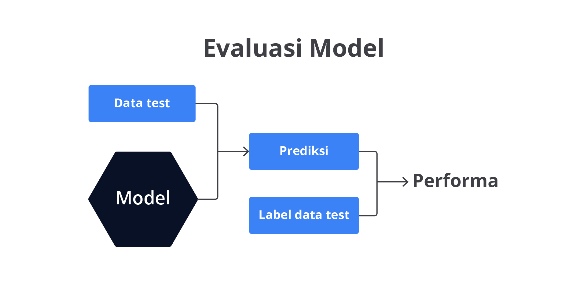

Pada materi ini, kita akan membahas tujuan evaluasi, metrik evaluasi umum, teknik evaluasi yang sering digunakan, dan bagaimana memastikan bahwa model tidak overfitting setelah tuning hyperparameter.

Selain bertujuan mengetahui performa model terdapat dua objektif atau tujuan yang membuat proses evaluasi menjadi sangat penting yaitu menguji generalisasi model dan memastikan model tidak overfitting atau underfitting.

Model harus diuji pada data baru (data uji) untuk memastikan bahwa model tidak hanya bekerja baik pada data latih tetapi juga dapat menggeneralisasi dengan baik pada data yang belum pernah dilihat. Selain itu, evaluasi bertugas untuk memastikan model tidak overfitting atau underfitting: Hyperparameter tuning yang buruk dapat menyebabkan model overfitting (terlalu cocok dengan data latih dan berkinerja buruk pada data uji) atau underfitting (tidak mampu menangkap pola dalam data latih maupun data uji).

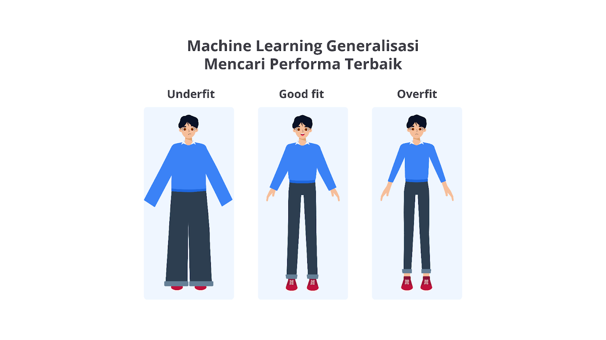

Secara umum evaluasi model machine learning dapat dilakukan terhadap dua data yaitu data training dan data testing.

- Data Latih (Training Data): data yang digunakan untuk melatih model. Evaluasi pada data latih menunjukkan seberapa baik model belajar dari data ini.
- Data Uji (Testing Data): data yang tidak digunakan selama pelatihan, yang digunakan untuk mengevaluasi generalisasi model. Evaluasi pada data uji menunjukkan seberapa baik model mampu bekerja pada data baru yang tidak pernah dilihat.

Lalu, bagaimana cara kita menguji model machine learning terhadap dua data tersebut? Cara paling umum yang biasa dilakukan yaitu dengan menggunakan train_test_split. Teknik ini akan membagi data menjadi dua bagian yaitu training set dan testing set.

Model dilatih pada training set, kemudian performanya diuji pada testing set. Ini adalah teknik evaluasi yang paling sederhana tetapi bisa menghasilkan hasil yang lebih variatif, terutama jika dataset kecil. Kekurangannya, Anda perlu mengatur proporsi data secara manual walaupun terdapat rule of thumb atau nilai rekomendasi yaitu 80% untuk data latih dan 20% untuk data uji. Sayangnya, angka tersebut bukanlah angka pasti yang dapat Anda gunakan terhadap seluruh permasalahan pada machine learning.

Selain menggunakan train_test_split, Scikit Learn memiliki sebuah fungsi lain yang dapat membantu proses evaluasi mampu memberikan informasi performa dengan lebih baik yaitu cross-validation atau K-fold cross-validation. cross-validation adalah metode pembagian dataset menjadi beberapa subset (folds). Model dilatih pada sebagian dari subset ini dan diuji pada subset yang tersisa. Proses ini diulang hingga setiap subset digunakan sebagai set uji, dan hasil akhirnya adalah rata-rata dari semua evaluasi.

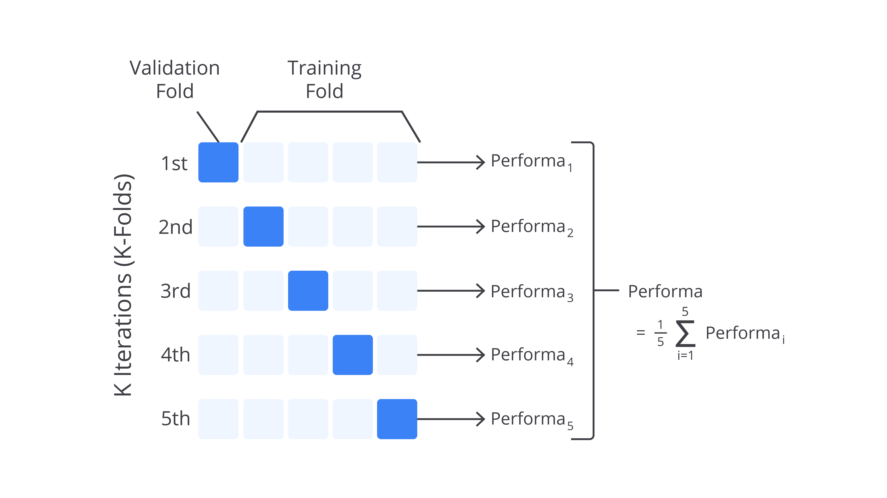

Metode ini memiliki kelebihan untuk mengurangi bias evaluasi dan membagi data dengan lebih efisien. Dengan menggunakan cross-validation, model akan dievaluasi pada berbagai subset sehingga hasilnya lebih stabil. Selain itu, cross-validation dapat memaksimalkan penggunaan dataset kecil dengan mengevaluasi model pada beberapa bagian dataset.

Namun, metode ini memiliki satu kekurangan yang cukup fatal. Metode cross-validation akan membagi data apa adanya. Lalu, apa masalahnya? Jika Anda memiliki data yang tidak seimbang atau imbalance dataset, metode ini tidak akan berjalan dengan baik karena pembagian yang tidak pasti.

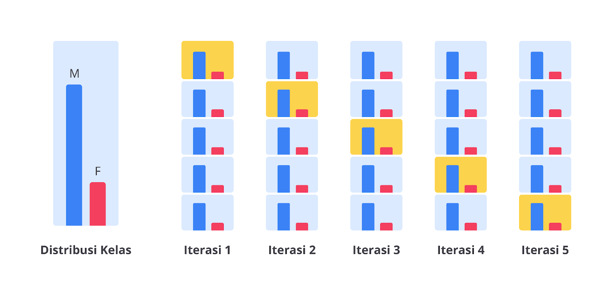

Sehingga, performa yang diuji bisa saja mengalami overfitting atau underfitting karena bias ketika proses pelatihan. Lalu bagaimana cara mengatasinya? Chill out, Scikit Learn saat ini menyediakan sebuah fungsi lanjutan dari cross-validation yang bernama stratified cross-validation. Teknik ini memastikan bahwa proporsi kelas di setiap fold tetap terjaga sehingga memberikan evaluasi yang lebih representatif.

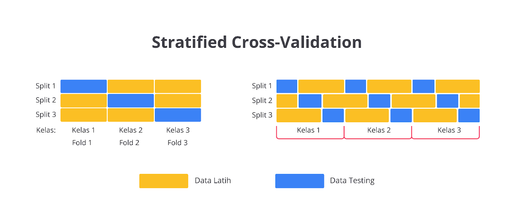

Setelah memilih metode yang cocok Anda perlu melakukan menguji performa dengan menggunakan metrik evaluasi yang sering digunakan pada model machine learning. Metrik ini bergantung pada jenis masalah yang kita hadapi (klasifikasi, regresi, atau lainnya), metrik evaluasi yang digunakan bisa berbeda-beda. Tentunya, Anda masih ingatkan berbagai macam metrik evaluasi yang sudah dipelajari pada modul-modul sebelumnya? Bagus. Kini, kita dapat melanjutkan proses belajar ke tahap berikutnya yaitu kesimpulan.

Setelah melakukan evaluasi model setelah hyperparameter tuning, Anda dapat membuat beberapa kesimpulan penting yang nantinya akan berguna untuk membantu membuat keputusan. Berikut beberapa hal yang dapat membantu Anda membuat kesimpulan.

- Apakah hyperparameter tuning meningkatkan performa model? Bandingkan metrik performa sebelum dan sesudah tuning untuk memastikan bahwa tuning memberikan peningkatan signifikan.
- Apakah model overfitting atau underfitting? Pastikan bahwa model bekerja baik pada data uji dan tidak hanya pada data latih.
- Apakah ada metrik lain yang harus dipertimbangkan? Terkadang, akurasi saja tidak cukup. Gunakan metrik lain seperti precision, recall, atau F1-score untuk mendapatkan gambaran performa model yang lebih lengkap.
- Evaluasi yang menyeluruh memastikan bahwa model yang dihasilkan setelah tuning tidak hanya bekerja baik pada dataset pelatihan, tetapi juga dapat menggeneralisasi dengan baik pada data baru.

Dengan melakukan evaluasi yang menyeluruh Anda dapat memastikan bahwa model yang dihasilkan setelah tuning tidak hanya bekerja baik pada dataset pelatihan, tetapi juga dapat menggeneralisasi dengan baik pada data baru.

Woaaaah, perjalanan panjang telah Anda lalui hingga akhir materi yang ada pada kelas Machine Learning untuk Pemula.

Semoga seluruh materi yang ada di kelas ini dapat membantu Anda untuk membuat model machine learning andal dan dapat digunakan oleh masyarakat umum baik itu dalam segi bisnis atau non-commercial purpose.

Eiitss sebelum melangkah ke kelas berikutnya, ada satu hal lagi yang perlu Anda lakukan. Kami sangat percaya bahwa teori akan membantu Anda membuka wawasan yang sangat luas, tetapi jangan lupakan praktikum karena hal tersebut harus dilakukan bersamaan agar Anda memiliki keterampilan yang sempurna.

Materi berikutnya merupakan langkah terakhir pada kelas ini. Mari kita bakar semangat sampai titik darah penghabisan karena Anda akan melakukan hyperparameter tuning pada sebuah studi kasus. Penasaran kan bagaimana praktiknya? Yuk, kita mulai praktiknya.
