# Proses Regresi: Langkah Demi Langkah

Proses regresi melibatkan beberapa tahapan penting yang perlu dipahami agar model yang dihasilkan dapat memberikan prediksi yang akurat. Berikut adalah langkah-langkah dalam proses regresi.

1. Pengumpulan Data
2. Pra-pemprosesan Data
3. Pembagian Data
4. Pemilihan Algoritma
5. Regresi
6. Pelatihan Model
7. Evaluasi Model
8. Deployment

## Pengumpulan Data

Langkah awal dalam membangun model regresi adalah mengumpulkan data yang akan digunakan untuk melatih dan menguji model tersebut. Data ini harus relevan dengan permasalahan yang ingin dipecahkan. Selain itu, kualitas data harus bagus, yang berarti data harus lengkap, tepat, dan menggambarkan kondisi sebenarnya dari populasi yang lebih luas.

Bayangkan kita sedang membangun model regresi untuk memprediksi gaji seseorang. Data yang kita kumpulkan bisa mencakup berbagai informasi penting, seperti lama bekerja, jenis industri tempat mereka bekerja, dan tingkat pendidikan.

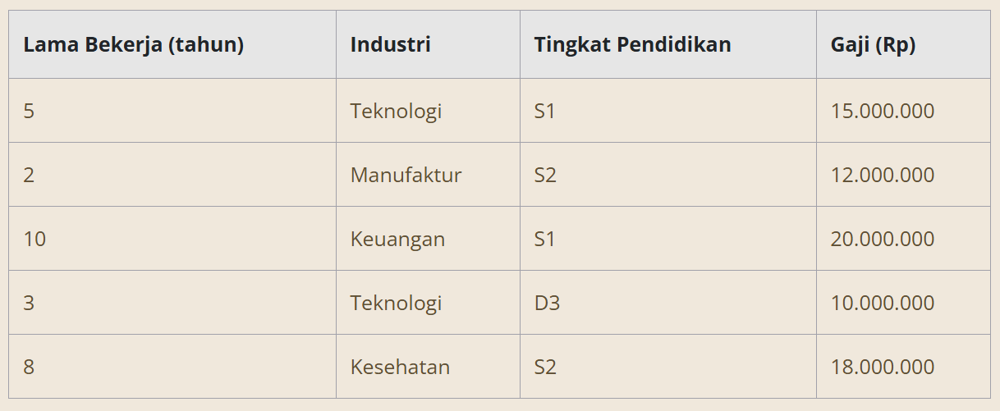

Setiap elemen data ini akan memainkan peran krusial dalam menentukan seberapa akurat prediksi gaji yang dihasilkan oleh model kita. Misalnya, jika kita hanya mengumpulkan data dari satu sektor industri atau hanya untuk individu dengan tingkat pendidikan tertentu, prediksi kita mungkin tidak mencerminkan gaji yang lebih beragam di seluruh industri dan tingkat pendidikan lainnya.

## Pra-Pemrosesan Data

Data yang sudah dikumpulkan biasanya masih kotor dan belum siap untuk digunakan oleh model. Pra-pemrosesan data adalah proses untuk memastikan bahwa data tersebut dalam kondisi yang optimal untuk digunakan. Tahap ini bisa melibatkan pembersihan data dari nilai-nilai yang hilang, penghapusan duplikasi, serta penyesuaian format data agar sesuai dengan kebutuhan algoritma yang akan digunakan. Normalisasi atau standardisasi data juga sering dilakukan pada tahap ini.

Dalam contoh prediksi gaji karyawan, jika ada data yang hilang atau tidak lengkap, kita perlu menangani masalah tersebut. Misalnya, jika data tentang lama bekerja hilang untuk satu karyawan, kita bisa menggunakan rata-rata dari data yang ada untuk mengisinya. Setelah itu, misalnya kita juga ingin mengonversi kategori seperti "Industri" dan "Tingkat Pendidikan" menjadi kode numerik agar lebih mudah diproses oleh model.

Catatan:
Teknologi = 1, Manufaktur = 2, Keuangan = 3, dan Kesehatan = 4.
D3 = 2, S1 = 3, S2 = 4

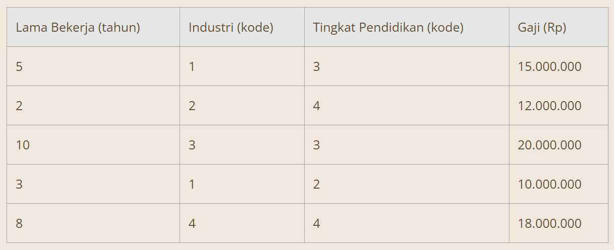

## Pembagian Data

Setelah data diproses, langkah berikutnya adalah membaginya menjadi dua set, yaitu data pelatihan dan data pengujian (bisa juga tiga set dengan data evaluasi). Data pelatihan digunakan untuk membangun model, sedangkan data pengujian digunakan untuk mengevaluasi keakuratan model. Biasanya, sekitar 70-80% data dialokasikan untuk pelatihan, dan sisanya untuk pengujian. Namun, dalam kasus tertentu seperti dataset yang sangat besar pembagian ini perlu disesuaikan dengan kemampuan dan kebutuhan perusahaan.

Misalnya, dari 100 data karyawan, Anda dapat membagi 80 data untuk pelatihan dan 20 data untuk pengujian. Ini membantu memastikan bahwa model yang Anda bangun dapat memberikan prediksi yang akurat tidak hanya untuk data yang sudah dikenal, tetapi juga untuk data baru yang belum pernah dilihat oleh model.

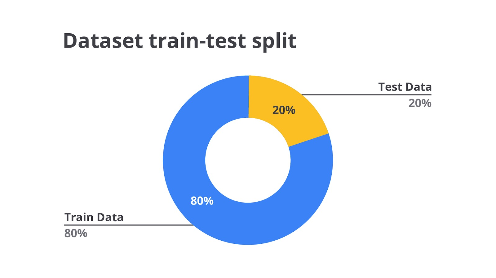

## Pemilihan Algoritma Regresi

Pemilihan algoritma regresi adalah langkah krusial dalam membangun model prediksi yang akurat. Algoritma yang tepat tidak hanya akan memberikan hasil yang baik pada data pelatihan, tetapi juga mampu melakukan generalisasi dengan baik pada data yang belum pernah dilihat sebelumnya. Memilih algoritma regresi yang tepat adalah proses yang melibatkan analisis mendalam terhadap karakteristik data yang Anda miliki serta tujuan prediksi yang ingin dicapai.

Berikut adalah langkah-langkah dan pertimbangan penting yang perlu Anda lakukan dalam pemilihan algoritma regresi tanpa langsung membahas jenis-jenis algoritmanya.

1. Pahami Hubungan antara Variabel
   Langkah pertama dalam memilih algoritma regresi adalah memahami hubungan antara variabel independen (fitur) dan variabel dependen (target). Apakah hubungan ini tampak linear, non-linear, atau mungkin kompleks dengan banyak interaksi? Anda dapat menggunakan visualisasi data seperti scatter plot atau pair plot untuk memeriksa pola hubungan ini.

2. Pertimbangkan Dimensi Data
   Dimensi data mengacu pada jumlah fitur (variabel independen) yang Anda miliki. Data dengan dimensi tinggi (banyak fitur) memerlukan algoritma yang dapat menangani kompleksitas ini, terutama jika ada risiko multikolinearitas yang berarti beberapa fitur saling berkorelasi kuat.

3. Evaluasi Ukuran Dataset
   Ukuran dataset, baik dari segi jumlah fitur maupun jumlah observasi (baris), sangat memengaruhi pemilihan algoritma. Beberapa algoritma mungkin bekerja lebih baik dengan data yang besar, sementara yang lain mungkin lebih efisien dengan dataset yang lebih kecil.

4. Analisis Multikolinearitas
   Multikolinearitas terjadi ketika beberapa variabel independen saling berkorelasi kuat sehingga bisa menyebabkan masalah dalam pemodelan jika menggunakan algoritma yang salah. Anda perlu mempertimbangkan algoritma yang dapat menangani atau mengurangi dampak dari multikolinearitas ini, seperti Ridge Regression, Lasso Regression, Elastic Net, dan lain sebagainya..

5. Identifikasi Kebutuhan Seleksi Fitur
   Jika Anda bekerja dengan dataset yang memiliki banyak fitur, tetapi hanya sebagian yang benar-benar penting untuk prediksi, Anda memerlukan algoritma yang dapat melakukan seleksi fitur secara otomatis. Ini akan membantu menyederhanakan model dan meningkatkan interpretabilitas.

6. Periksa Distribusi Data
   Memeriksa distribusi data, khususnya variabel dependen merupakan hal yang sangat penting. Jika distribusi data tidak normal atau memiliki outlier, Anda perlu memilih algoritma yang lebih robust terhadap outlier atau yang dapat memodelkan distribusi non-normal dengan baik.

7. Evaluasi Risiko Overfitting
   Overfitting terjadi ketika model terlalu kompleks dan sangat cocok dengan data pelatihan, tetapi performanya buruk pada data baru. Anda perlu mempertimbangkan apakah algoritma yang dipilih cenderung overfitting dan apakah ada teknik regularisasi yang bisa membantu mengurangi risiko ini.

8. Pertimbangkan Interpretabilitas
   Jika interpretabilitas model penting bagi Anda karena perlu menjelaskan hasil prediksi ke pemangku kepentingan secara non teknis, pemilihan model memiliki peran penting. Pada kasus-kasus tertentu, Anda mungkin ingin memilih algoritma yang menghasilkan model yang mudah dipahami dan diinterpretasikan.

9. Kecepatan dan Efisiensi
   Beberapa algoritma lebih cepat dan lebih efisien dalam hal waktu komputasi dan sumber daya. Jika Anda bekerja dengan dataset yang sangat besar atau perlu menjalankan model secara real-time, kecepatan, dan efisiensi algoritma menjadi faktor penting dalam pemilihan.

10. Tentukan Tujuan Prediksi
    Terakhir, pertimbangkan apa tujuan akhir dari prediksi Anda. Apakah Anda hanya perlu memprediksi nilai rata-rata atau ada kebutuhan untuk memahami distribusi yang lebih luas dari data? Apakah Anda ingin memprediksi nilai spesifik pada kuantil tertentu atau seluruh distribusi? Jawaban atas pertanyaan ini akan memandu Anda dalam memilih algoritma yang paling sesuai.

Dengan mengikuti langkah-langkah ini, Anda dapat membuat keputusan yang lebih tepat tentang algoritma regresi mana yang akan digunakan berdasarkan kebutuhan spesifik dan karakteristik dataset tanpa harus langsung terfokus pada jenis algoritma yang tersedia.

Jika data Anda menunjukkan hubungan linear antara variabel-variabel seperti lama bekerja, industri, dan tingkat pendidikan dengan gaji, regresi linear bisa menjadi pilihan yang tepat. Namun, jika hubungan tersebut tidak linear, Anda perlu mempertimbangkan penggunaan regresi polinomial atau algoritma lain yang lebih cocok. Apa sih regresi linear dan polinomial? Tenang saja, Anda akan mempelajari tentang jenis-jenis regresi tersebut di materi berikutnya.

## Pelatihan Model

Setelah algoritma dipilih, saatnya melatih model menggunakan data pelatihan. Pada tahap ini, algoritma akan menganalisis data untuk menemukan pola yang dapat digunakan untuk memprediksi gaji berdasarkan variabel-variabel yang ada. Proses ini akan melibatkan penyesuaian parameter model untuk memaksimalkan akurasi prediksi.

Misalnya, model regresi linear akan belajar menghubungkan variabel-variabel seperti lama bekerja, jenis industri, dan tingkat pendidikan dengan gaji karyawan. Model akan membangun persamaan yang paling sesuai dengan data pelatihan untuk memprediksi gaji.

## Evaluasi Model

Evaluasi model adalah langkah untuk mengukur seberapa baik model dapat memprediksi gaji berdasarkan data pengujian. Berbagai metrik seperti Mean Squared Error (MSE) dan R-squared digunakan untuk menilai performa model. Evaluasi ini penting untuk memastikan bahwa model tidak hanya baik pada data pelatihan, tetapi juga mampu melakukan generalisasi pada data baru.

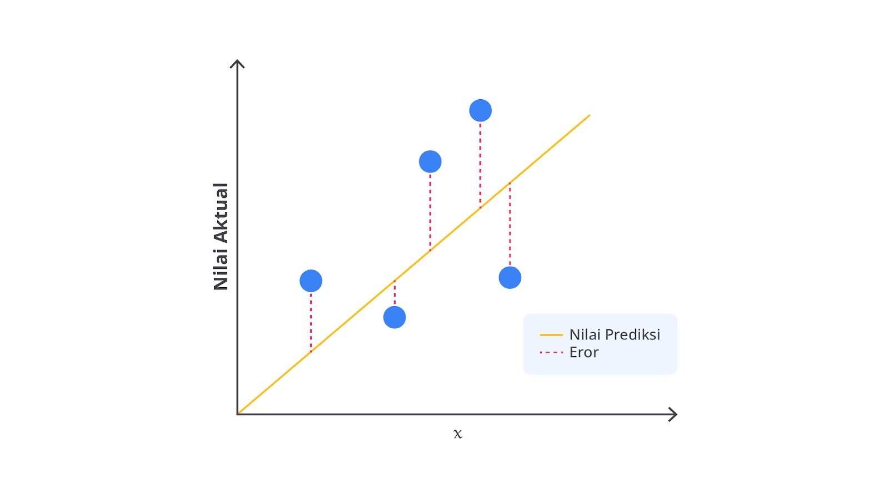

Jika model Anda memprediksi gaji karyawan dengan MSE yang rendah, ini berarti rata-rata kesalahan prediksinya kecil. Hal ini menunjukkan bahwa model bekerja dengan baik. Selain itu, nilai R-squared yang tinggi menandakan bahwa model dapat menjelaskan sebagian besar variasi dalam data gaji karyawan.

Misalkan kita memiliki lima data pengujian dengan nilai sebenarnya dan nilai prediksi sebagai berikut.

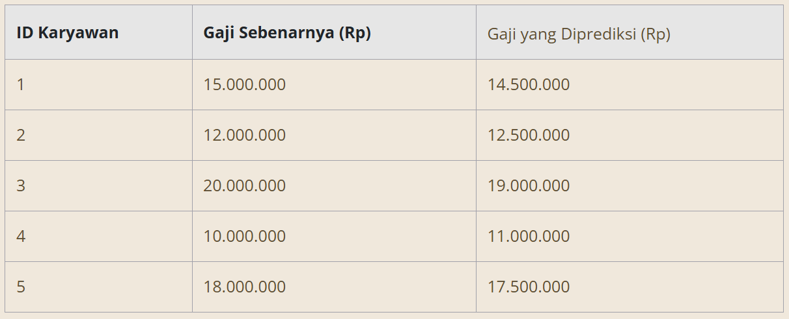

Kita dapat menghitung MSE sebagai berikut.

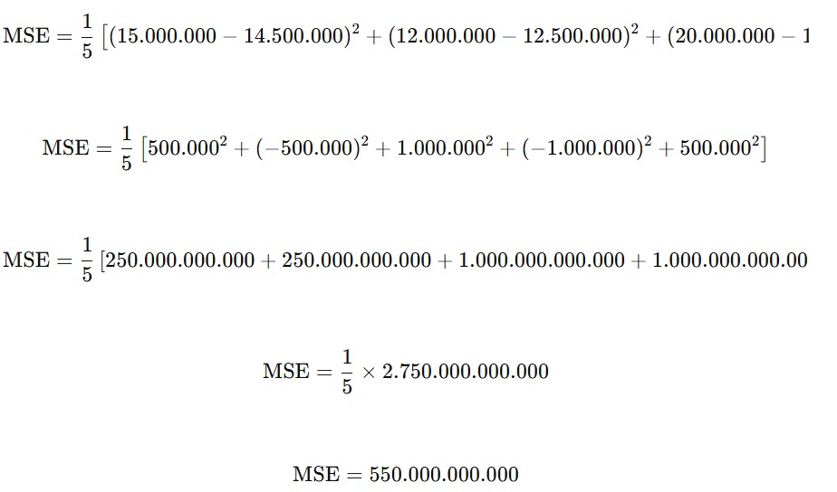

Jadi, MSE dari contoh di atas adalah 550.000.000.000. Dari mana rumus tersebut didapatkan? Tenang, pada modul ini kita akan membahas lebih detail beberapa metriks yang biasa digunakan untuk melakukan evaluasi pada model regresi.

## Deployment

Setelah model terbukti efektif, langkah terakhir adalah menerapkannya pada data baru untuk memprediksi gaji karyawan di masa depan. Model ini bisa digunakan oleh berbagai departemen. Misalnya, HR bisa menggunakannya untuk menetapkan gaji yang sesuai berdasarkan lama bekerja, industri, dan tingkat pendidikan karyawan. Dengan model ini, penentuan gaji dapat dilakukan dengan lebih efisien dan objektif, serta mengurangi bias dalam proses penentuan gaji.

Proses di atas merupakan penjelasan dari model deployment. Deployment adalah proses mengintegrasikan model machine learning yang telah dilatih dan diuji ke dalam lingkungan produksi sehingga dapat digunakan oleh aplikasi atau sistem yang membutuhkan prediksi secara real-time atau batch. Perhatikan gambar berikut secara saksama.

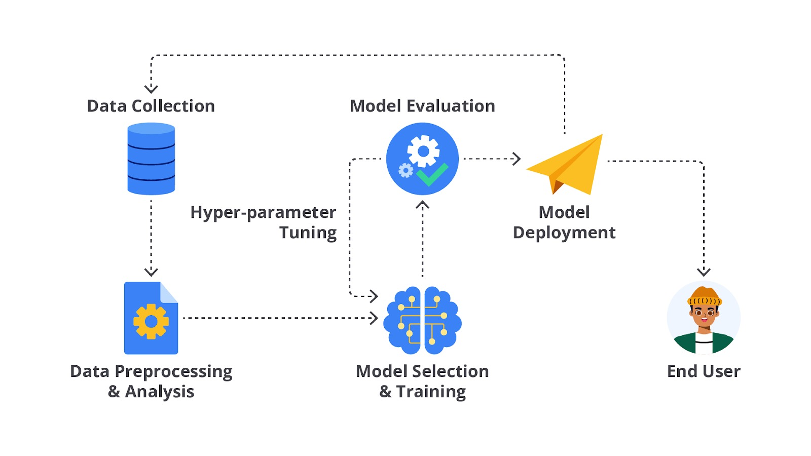

Tahapan model deployment merupakan hal yang paling penting dalam proses pembangunan machine learning, mengapa hal tersebut bisa terjadi? Sederhananya dengan melakukan model deployment, Anda bisa membuat sebuah “jembatan” dari kode yang dibangun dengan pengguna umum bahkan yang tidak memiliki latar belakang IT. Hal ini menjadi sangat penting karena tujuan akhir pembangunan model machine learning adalah dapat digunakan oleh pengguna dan menghasilkan revenue atau membantu proses bisnis bekerja.

Eitsss, setelah melakukan model deployment, bukan berarti tugas Anda sebagai machine learning engineer sudah selesai. Pada umumnya, tahapan deployment ini menjadi satu paket dengan model monitoring. Monitoring model adalah proses memantau kinerja model setelah deployment untuk memastikan model tetap memberikan hasil yang akurat dan relevan. Monitoring diperlukan karena model Machine Learning dapat mengalami penurunan kinerja seiring waktu akibat berbagai faktor, seperti perubahan dalam data input (data drift), perubahan pola pengguna, atau perubahan dalam lingkungan operasi.

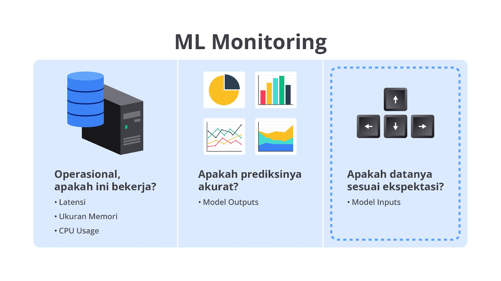

Kedua tahapan di atas adalah bagian integral dari siklus hidup model machine learning yang andal. Tanpa monitoring, kinerja model dapat menurun tanpa disadari sehingga dapat mengakibatkan keputusan bisnis yang salah atau pengalaman pengguna yang buruk.

Dengan deployment dan monitoring yang terstruktur dan cermat, developer dapat memastikan bahwa model machine learning mereka tidak hanya berhasil dibangun, tetapi juga terus memberikan nilai dalam lingkungan produksi.

# Jenis-Jenis Regression

Seperti yang sudah Anda pelajari, regresi adalah salah satu teknik dalam statistik dan machine learning yang digunakan untuk memodelkan hubungan antara satu atau lebih variabel independen (input) dan variabel dependen (output).

Tujuan utama regresi adalah untuk memprediksi nilai dari variabel dependen berdasarkan nilai dari variabel independen. Namun, tahukah Anda bahwa setiap jenis regresi memiliki cara kerja dan kegunaan yang berbeda?

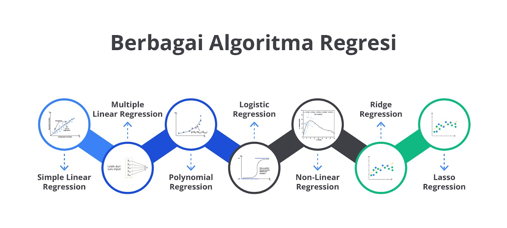

Mari kita bahas jenis-jenis regresi ini secara lebih detail dengan penjelasan yang mudah dipahami.

## Linear Regression

Linear regression (regresi linear) adalah jenis regresi yang paling sederhana, kita akan mencoba menemukan garis lurus terbaik yang menggambarkan hubungan antara variabel independen (X) dan variabel dependen (Y).

Misalnya, jika kita ingin memprediksi harga rumah berdasarkan ukuran rumah, kita bisa menggunakan regresi linear untuk menemukan garis yang paling cocok antara ukuran rumah (X) dan harga rumah (Y).

Misalkan kita punya data tentang ukuran rumah dan harga jualnya. Dengan regresi linear, kita bisa membuat persamaan garis seperti ini.

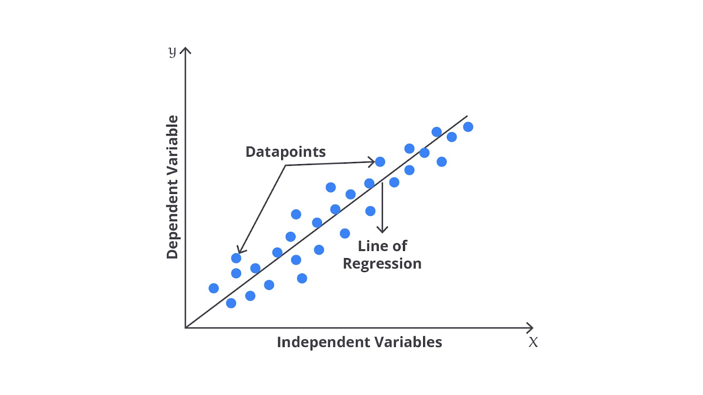

Harga Rumah = a + b\* (Ukuran Rumah) dengan catatan a adalah intercept (titik yang memotong sumbu Y) dan b adalah kemiringan garis (seberapa banyak harga berubah dengan setiap unit perubahan ukuran rumah).

Metode ini memiliki beberapa kelebihan dan kekurangan seperti.

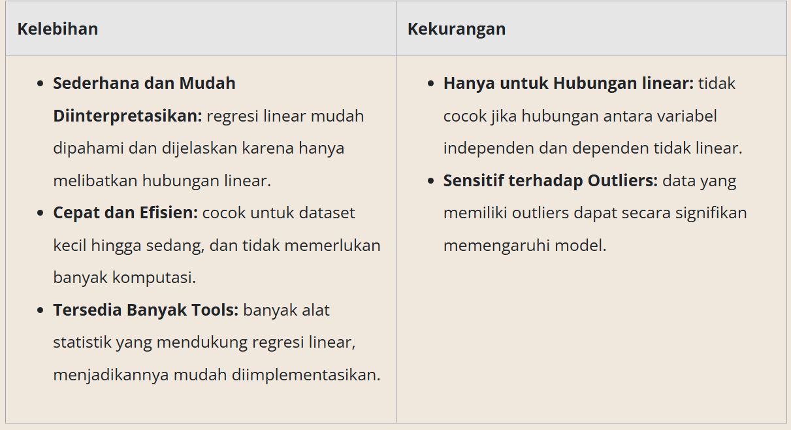

Mungkin tebersit sebuah pertanyaan di benak Anda, “Bagaimana cara mengetahui hubungan antara variabel? Apakah termasuk linear atau nonlinear?” Pertanyaan yang bagus. Mari kita bahas sekilas pada materi ini.

Salah satu cara paling mudah untuk mengetahui hubungan antar variabel adalah menggunakan visualisasi data seperti scatter plot. Dengan membuat scatter plot antara dua variabel, kita dapat langsung melihat pola hubungan mereka. Jika titik-titik data membentuk garis lurus (atau mendekati garis lurus), hubungan antara variabel tersebut adalah linear. Namun, jika titik-titik tersebut membentuk kurva atau pola yang melengkung, hubungan tersebut cenderung non-linear.

Contoh:

- Hubungan linear: titik-titik data cenderung membentuk garis lurus.
- Hubungan non-linear: titik-titik data membentuk pola melengkung atau berbentuk U.

## Multiple Linear Regression

Multiple Linear Regression (Regresi Linear Berganda) adalah pengembangan dari regresi linear sederhana yang digunakan untuk memodelkan hubungan antara satu variabel dependen (terkadang disebut variabel respons atau target) dan dua atau lebih variabel independen (juga disebut prediktor atau fitur). Model ini memungkinkan kita untuk memahami bagaimana beberapa faktor memengaruhi hasil yang diinginkan secara simultan.

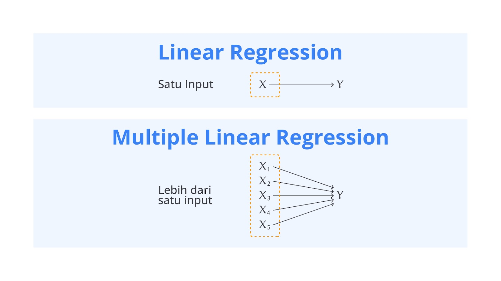

Persamaan umum untuk regresi linear berganda adalah seperti berikut.

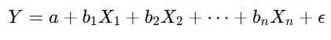

Rumus di atas dapat kita interpretasikan sebagai berikut.

- Y: variabel dependen (output yang ingin diprediksi).
- a: intercept atau konstanta, yaitu nilai Y saat semua X bernilai nol.
- b1, b2, ..., bn: koefisien regresi untuk setiap variabel independen X1,X2,...,Xn. Koefisien ini mengukur seberapa besar pengaruh masing-masing variabel independen terhadap variabel dependen.
- X1, X2, ..., Xn: variabel independen (input atau prediktor yang memengaruhi Y).
- ε: error term atau residu yang menangkap variasi dalam Y dan tidak bisa dijelaskan oleh variabel independen.

Misalkan, kita ingin memprediksi harga rumah berdasarkan beberapa variabel seperti ukuran rumah, jumlah kamar tidur, dan usia rumah. Model regresi linear berganda akan terlihat seperti ini:

Harga Rumah=a+b1(Ukuran Rumah)+b2(Jumlah Kamar Tidur)+b3(Usia Rumah)+ϵ

- Jika b1 positif, itu berarti semakin besar ukuran rumah, semakin tinggi harga rumah, dengan asumsi variabel lain tetap konstan.
- Jika b3 negatif, itu berarti semakin tua rumah, semakin rendah harga rumah, dengan asumsi variabel lain tetap konstan.

Dengan menggunakan multiple linear regression, kita bisa mendapatkan pemahaman yang lebih baik tentang bagaimana berbagai faktor memengaruhi variabel dependen, membantu dalam pengambilan keputusan, dan peramalan yang lebih akurat.

## Polynomial Regression

Polynomial Regression (regresi polinomial) adalah bentuk lanjutan dari regresi linear yang digunakan untuk memodelkan hubungan antara variabel independen dan variabel dependen ketika hubungan tersebut tidak linear. Sebagai pengembangan dari regresi linear, metode regresi polinomial memungkinkan hubungan antara variabel untuk berbentuk kurva dengan derajat yang lebih tinggi daripada garis lurus seperti parabola atau kurva lainnya.

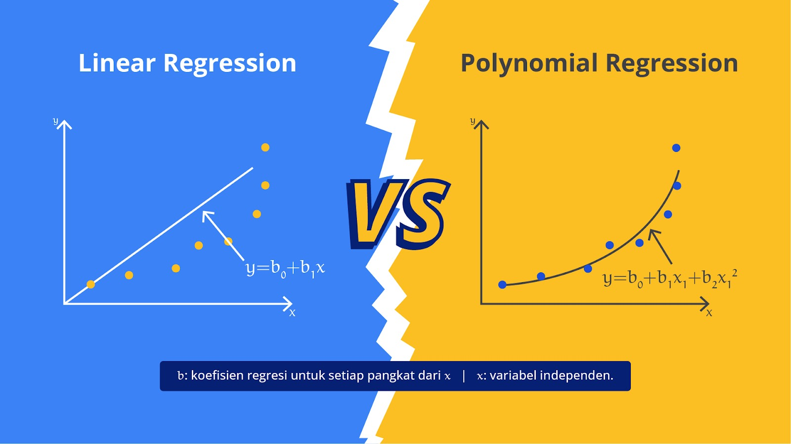

Dalam regresi polinomial Anda memodelkan hubungan antara variabel dependen Y dan satu atau lebih variabel independen X menggunakan polinomial dari derajat n. Persamaan umum untuk regresi polinomial adalah seperti di bawah ini.
Dalam regresi polinomial Anda memodelkan hubungan antara variabel dependen Y dan satu atau lebih variabel independen X menggunakan polinomial dari derajat n. Persamaan umum untuk regresi polinomial adalah seperti di bawah ini.

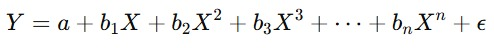

Rumus di atas dapat kita interpretasikan sebagai berikut.

- Y: variabel dependen yang ingin kita prediksi.
  a: intercept, yaitu nilai Y saat X memiliki nilai nol.
- b1, b2, ..., bn: koefisien regresi untuk setiap pangkat dari X. Koefisien ini menunjukkan kontribusi dari masing-masing pangkat X terhadap nilai prediksi Y.
- X: variabel independen.
- n: derajat dari polinomial.
- ε: error term atau residu yang menangkap variasi dalam Y dan tidak bisa dijelaskan oleh variabel independen.

Lalu, kapan Anda perlu menggunakan regresi polinomial? Ia digunakan ketika data menunjukkan hubungan non-linear antara variabel independen dan dependen. Jika kita mencoba menggunakan regresi linear pada data yang memiliki pola melengkung, model linear mungkin tidak memberikan hasil yang baik karena tidak dapat menangkap kompleksitas hubungan tersebut.

Misalnya, ketika hubungan antara variabel dependen dan independen berbentuk U atau terbalik (seperti kurva parabola). Selain itu Anda juga bisa menggunakan metode ini ketika data menunjukkan pola lebih kompleks yang melibatkan titik balik atau kurva ganda.

## Logistic Regression

Logistic Regression (regresi logistik) adalah salah satu teknik pemodelan statistik yang digunakan untuk memprediksi hasil biner, yaitu hasil dengan dua kemungkinan, seperti "ya" atau "tidak," "sukses" atau "gagal," dan lain sebagainya. Berbeda dengan regresi linear yang digunakan untuk memprediksi nilai numerik, regresi logistik digunakan untuk memodelkan probabilitas bahwa suatu kejadian akan terjadi (hasil biner).

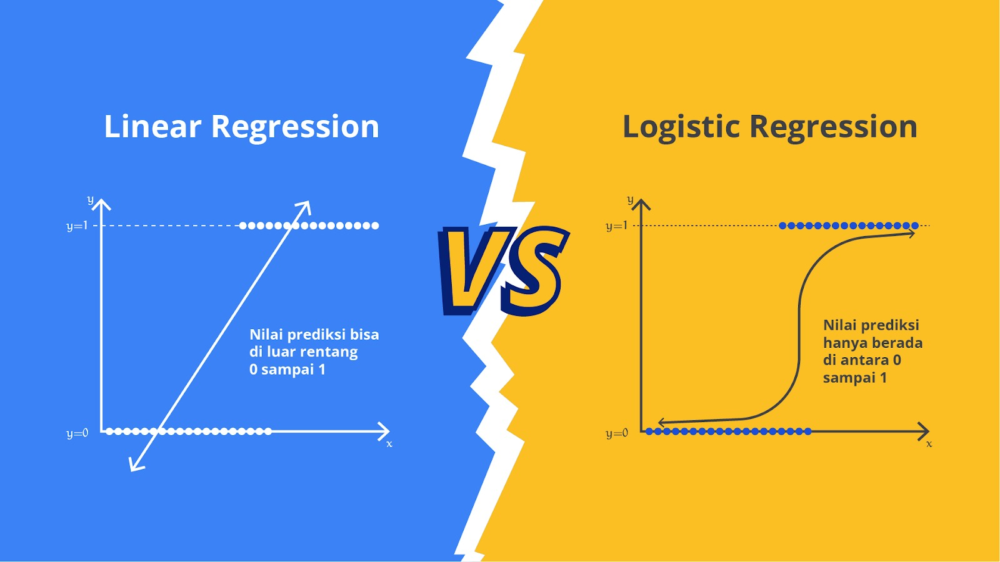

Fun fact-nya walaupun memiliki nama regresi, metode ini sering kali digunakan untuk masalah klasifikasi. Namun, tidak sepenuhnya akurat juga untuk menyebut regresi logistik sebagai klasifikasi karena regresi logistik adalah metode statistik yang memperkirakan probabilitas hasil biner, sedangkan klasifikasi adalah tugas memprediksi kategori atau kelas yang dimiliki oleh titik data baru berdasarkan sekumpulan fitur.

Meskipun regresi logistik dapat digunakan untuk tugas klasifikasi, tetapi pada intinya ia masih merupakan metode regresi dan terutama digunakan untuk memperkirakan probabilitas daripada membuat klasifikasi langsung.

Regresi logistik mengasumsikan bahwa hubungan antara variabel independen X dan variabel dependen Y dapat dimodelkan sebagai probabilitas yang dihasilkan dari fungsi logistik (sigmoid function). Fungsi ini mengubah input apa pun menjadi output antara 0 dan 1 yang dapat diinterpretasikan sebagai probabilitas. Persamaan dasar dari regresi logistik dapat dituliskan dengan rumus seperti berikut.

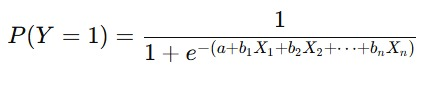

Rumus di atas dapat kita interpretasikan sebagai berikut.

- P(Y=1): probabilitas bahwa variabel dependen Y adalah 1 (kejadian yang diinginkan terjadi).
- a: intercept atau konstanta model.
  b1,b2,...,bn: koefisien regresi untuk setiap variabel independen.
- X1,X2,...,Xn: variabel independen yang memengaruhi hasil Y.
- e: basis dari logaritma natural (sekitar 2.718).

Pada intinya, logistik regresi ini merupakan salah satu algoritma yang sering digunakan untuk mengatasi permasalahan klasifikasi. So, jangan tertipu dengan namanya, ya!

## Non-Linear Regression

Non-linear regression adalah bentuk regresi yang digunakan untuk memodelkan hubungan antara variabel independen dan variabel dependen ketika hubungan tersebut tidak dapat dijelaskan dengan garis lurus atau fungsi linear. Dalam non-linear regression, model yang digunakan bisa berbentuk lebih kompleks, seperti eksponensial, logaritmik, kuadrat, kubik, atau bentuk fungsi lainnya.

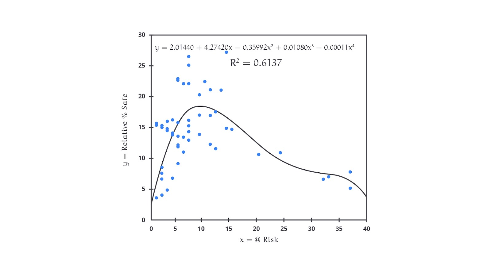

Berbeda dengan linear regression yang memiliki hubungan linear dalam bentuk Y=a+bX antara variabel independen X dan variabel dependen Y, non-linear regression memungkinkan untuk mencari hubungan yang lebih rumit dibandingkan hanya garis linear saja. Model non-linear bisa berupa hampir semua bentuk matematis seperti Y=f(X)+ϵ dengan ketentuan f(X) adalah fungsi non-linear dari variabel independen X, dan ϵ adalah error term atau residu.

Terdapat banyak sekali bentuk dari non-linear regression yang perlu Anda ketahui. Beberapa contohnya adalah eksponensial, logaritmik, power, polynomial (sudah kita bahas pada materi sebelumnya), kuadratik, dan lain sebagainya.

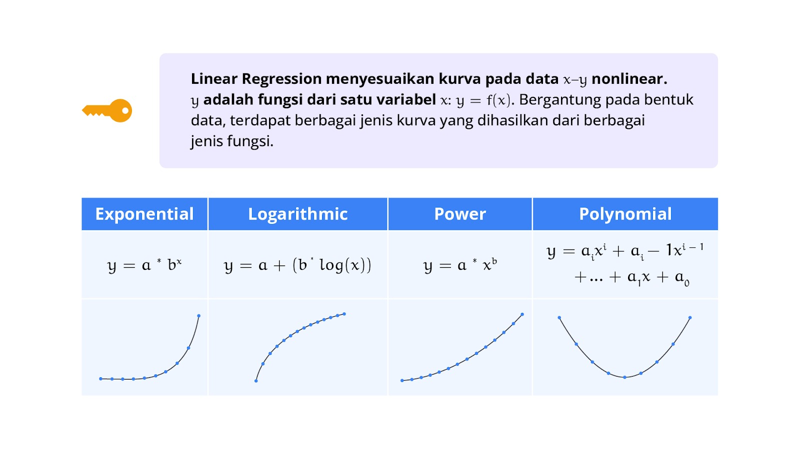

Berikut adalah beberapa contoh model non-linear yang sering digunakan.

- Model Eksponensial
  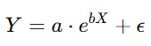
  Dengan ketentuan a dan b adalah parameter yang harus diestimasi. Model ini sering digunakan dalam situasi dengan kondisi perubahan dari Y bersifat konstan.

- Model Logaritmik
  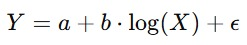
  Model ini sering digunakan ketika perubahan Y melambat seiring dengan bertambahnya X.
- Model Kuadrat (Quadratic Model)
  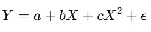
  Model ini berguna ketika hubungan antara variabel memiliki titik balik.
- Model Sigmoid (Logistik atau Gompertz)
  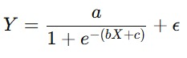
  Model sigmoid sering digunakan dalam biologi, ekonomi, dan ilmu sosial untuk memodelkan pertumbuhan populasi, difusi inovasi, dan fenomena lain yang menunjukkan saturasi.

## Ridge and Lasso Regression

Ridge Regression dan Lasso Regression adalah dua teknik regularisasi yang digunakan dalam regresi linear untuk mengatasi masalah multikolinearitas dan overfitting.

Refreshing Material

Multikolinearitas adalah kondisi dua atau lebih variabel independen dalam model regresi sangat berkorelasi satu sama lain. Ini berarti bahwa salah satu variabel independen dapat diprediksi secara linear dari variabel independen lainnya dengan tingkat akurasi yang tinggi.

Overfitting terjadi ketika model regresi terlalu kompleks dan terlalu fit terhadap data latih (training data) sehingga model tersebut menangkap "noise" atau fluktuasi acak dalam data selain pola yang sebenarnya. Akibatnya, model tidak bekerja dengan baik pada data baru atau data uji (test data).

Meskipun kedua teknik ini bertujuan untuk menstabilkan model dan meningkatkan performa prediksi, mereka melakukannya dengan cara yang berbeda, terutama dalam hal bagaimana mereka menerapkan penalti pada koefisien regresi.

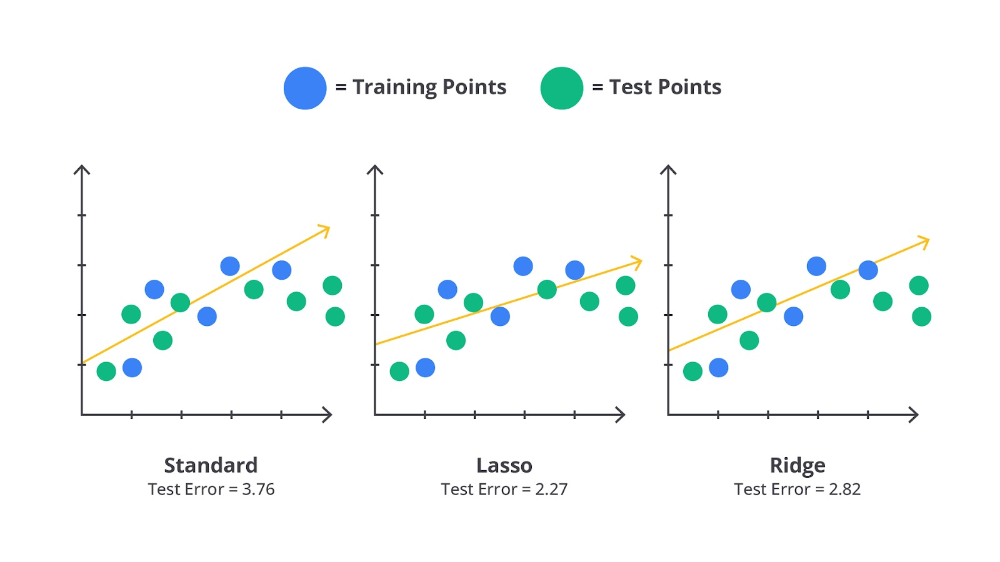

## Ridge Regression

Ridge regression menambahkan penalti berupa jumlah kuadrat dari koefisien regresi ke dalam fungsi loss. Fungsi objektif yang diminimalkan dalam ridge regression dapat ditulis dengan rumus seperti berikut.

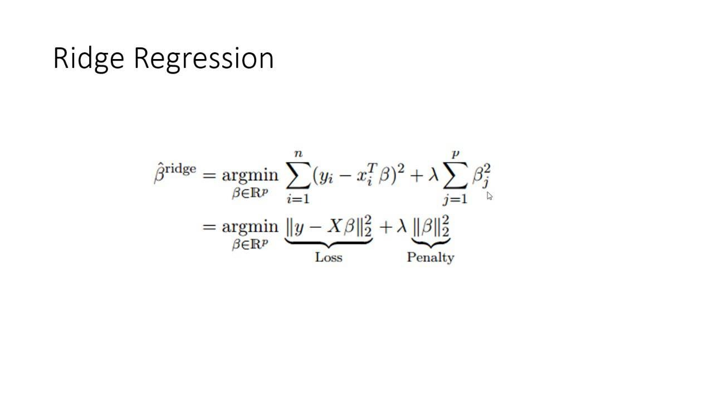

Penalti yang diterapkan membuat koefisien regresi menjadi lebih kecil (shrinkage), tetapi tidak pernah menyetel mereka menjadi nol. Ini berarti semua variabel tetap akan digunakan dalam pembangunan model, meskipun dengan koefisien yang lebih kecil. Karena tidak ada koefisien yang disetel menjadi nol, interpretasi model ridge regression lebih sederhana dalam hal mempertimbangkan kontribusi semua variabel. Namun, karena semua variabel tetap ada, interpretasi bisa menjadi sulit jika ada banyak variabel.

## Lasso Regression

Lasso regression menambahkan penalti berupa jumlah absolut dari koefisien regresi ke dalam fungsi loss. Fungsi objektif yang diminimalkan dalam lasso regression dapat ditulis dengan rumus seperti berikut.

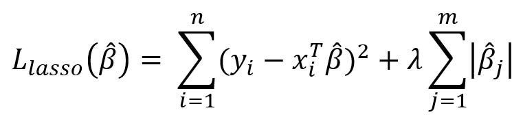

Penalti yang diterapkan tidak hanya mengecilkan koefisien, tetapi juga dapat menyetel beberapa koefisien menjadi nol. Ini berarti Lasso regression secara efektif dapat melakukan seleksi fitur, menghilangkan variabel yang dianggap tidak signifikan dan mempertahankan variabel yang memiliki peran signifikan.

Lalu, kapan waktu yang tepat untuk menggunakan ridge atau lasso regression?

Ridge regression lebih cocok digunakan ketika semua variabel diharapkan memiliki pengaruh yang kecil tetapi signifikan dan tidak ingin menghilangkan variabel dari model. Ini sangat berguna dalam situasi multikolinearitas tinggi dan kita ingin menjaga semua fitur dalam model dengan koefisien yang lebih stabil. Di lain sisi, lasso regression lebih cocok ketika kita memiliki banyak variabel, tetapi kita percaya bahwa hanya sebagian kecil dari mereka yang benar-benar signifikan. Lasso membantu menyederhanakan model dengan secara otomatis menghilangkan variabel yang tidak penting.

Di lain sisi, ketika memiliki kasus yang lebih kompleks, Anda dapat menggabungkan kedua metode regularisasi di atas dengan menggunakan metode Elastic Net. Elastic Net adalah teknik yang menggabungkan penalti dari Ridge dan Lasso (kombinasi L1 dan L2 regularization). Hal ini dapat memberikan fleksibilitas lebih ketika kita ingin mengontrol keduanya (jumlah fitur yang dipilih dan tingkat regularisasi).

