# Contoh Algoritma Regresi - Linear Regression

Linear Regression adalah salah satu teknik statistik yang paling sederhana dan banyak digunakan dalam analisis data untuk memodelkan hubungan antara satu variabel dependen (output) dan satu atau lebih variabel independen (input). Dalam bentuknya yang paling dasar, yaitu Simple Linear Regression, hanya ada satu variabel independen yang digunakan untuk memprediksi nilai variabel dependen. Jika ada lebih dari satu variabel independen, model tersebut disebut Multiple Linear Regression.

Linear regression bertujuan untuk menemukan garis lurus terbaik yang dapat menggambarkan hubungan antara variabel independen dan variabel dependen.

## Parameter Utama dalam Linear Regression

1. Intercept adalah nilai Y ketika semua variabel independen X1,X2,…,Xn bernilai nol. Sederhana, intercept adalah titik pada garis regresi yang memotong sumbu Y. Namun, interpretasi intercept bergantung pada apakah nilai X=0 masuk akal dalam konteks data tersebut atau tidak. Jika X=0 tidak relevan atau tidak mungkin, intercept mungkin tidak memiliki makna yang signifikan.
2. Koefisien regresi mewakili kemiringan atau slope garis regresi untuk masing-masing variabel independen. Ini menunjukkan perubahan yang diharapkan pada variabel dependen Y untuk setiap perubahan satu unit pada variabel independen Xi, dengan asumsi variabel lainnya tetap konstan.

Interpretasi:

- Positif: jika koefisien bi positif, peningkatan Xi akan menyebabkan peningkatan juga pada Y.

- Negatif: jika koefisien bi negatif, peningkatan Xi akan menyebabkan penurunan pada Y.

- Besarnya Nilai: besarnya nilai bi menunjukkan seberapa kuat pengaruh variabel independen tersebut terhadap variabel dependen.

3. Residual adalah selisih antara nilai yang diamati (aktual) dan nilai yang diprediksi oleh model regresi. Ini menggambarkan error atau kesalahan dalam prediksi model. Residual digunakan untuk menilai seberapa baik model sesuai dengan data yang ada. Jika residualnya kecil dan tersebar acak, ini menunjukkan bahwa model cukup baik dalam memprediksi variabel dependen.

Dalam penerapannya, Anda perlu memperhatikan beberapa hal agar dapat memastikan penggunaan linear regression sudah tepat, berikut beberapa hal yang perlu diperhatikan.

- Linearitas: hubungan antara variabel independen dan dependen harus linear. Ini berarti perubahan Y harus proporsional terhadap perubahan X.
- Independensi Residual: residual harus independen satu sama lain. Tidak boleh ada pola atau korelasi yang jelas antara residual.
- Homoskedastisitas: varians residual harus konstan di seluruh rentang nilai variabel independen. Jika varians residual berubah (heteroskedastisitas), hasil model bisa menjadi bias.
- Normalitas Residual: residual harus mengikuti distribusi normal. Ini penting untuk validitas uji statistik seperti pengujian signifikansi koefisien.
- Tidak Ada Multikolinearitas: dalam multiple linear regression, variabel independen tidak boleh terlalu berkorelasi satu sama lain. Jika ada multikolinearitas yang tinggi, koefisien regresi bisa menjadi tidak stabil dan sulit diinterpretasikan.

Sebagai contoh mari kita kembali ke contoh persoalan jual beli rumah agar semakin terbayang studi kasus yang tepat untuk menggunakan linear regression. Pada kasus ini, data yang akan kita gunakan adalah luas rumah dan harga.

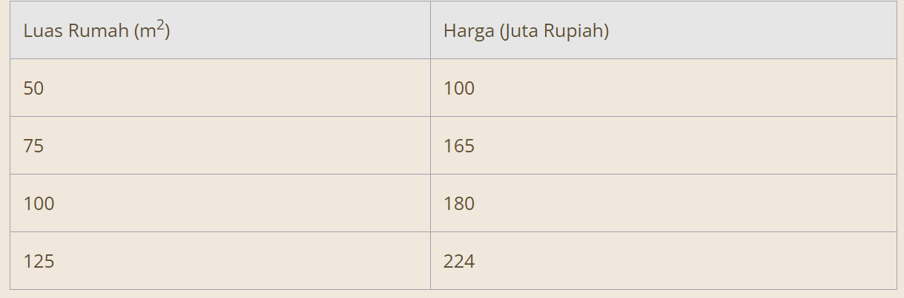

Jika kita memplot luas rumah pada sumbu X dan harga pada sumbu Y, sebuah garis dari sudut kiri bawah grafik ke kanan atas mewakili hubungan antara X dan Y. Saat memplot titik-titik data ini pada scatter plot, kita mendapatkan grafik berikut.

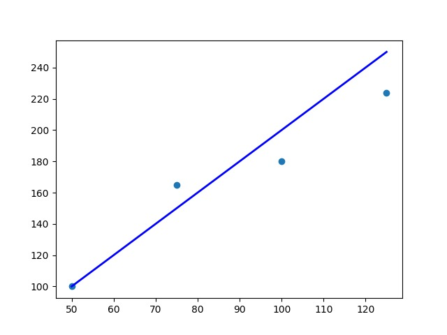

Dapat Anda lihat pada plot di atas, rasio luas rumah terhadap harga menunjukkan sebuah pola. Data di kiri bawah menunjukkan harga yang lebih murah dengan luas rumah yang lebih kecil, dan garis berlanjut ke sudut kanan atas grafik dengan artian luas rumah yang lebih besar menyebabkan harga rumah semakin mahal.

Model regresi mendefinisikan fungsi linear antara variabel X dan Y yang paling baik sehingga dapat menunjukkan hubungan antara keduanya. Hal ini diwakili oleh garis miring yang terlihat pada gambar di atas. Tujuannya adalah untuk menentukan 'garis regresi' optimal yang paling sesuai dengan semua titik data individu.

Setelah data sudah berhasil dikumpulkan dan memiliki karakteristik linear, selanjutnya model akan menghitung nilai error yang dihasilkan. Biasanya tahapan ini terjadi ketika Anda melakukan fitting atau melatih model berdasarkan data.

Model regresi linear biasanya dilatih menggunakan metode Ordinary Least Squares (OLS), yang bertujuan untuk meminimalkan jumlah kuadrat dari residuals (eror). Residual adalah perbedaan antara nilai yang diamati (aktual) dan nilai yang diprediksi oleh model. Dalam persamaan matematika, rumus OLS dapat dituliskan sebagai berikut.

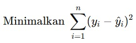

Rumus di atas dapat kita interpretasikan sebagai berikut.

- yi adalah nilai aktual dari variabel dependen untuk pengamatan ke-i.
- ŷ adalah nilai yang diprediksi oleh model untuk pengamatan ke-i.
- n adalah jumlah data.

Dalam proses pelatihan, OLS akan mencari nilai optimal untuk koefisien b1,b2,…,bn dan intercept yang meminimalkan error pada nilai prediksi. Ini dilakukan dengan mencari titik turunan pertama dari fungsi objektif (jumlah kuadrat error) terhadap masing-masing koefisien adalah nol yang merupakan minimum fungsi tersebut.

Setelah proses pelatihan selesai, model akan menghasilkan nilai koefisien regresi b1,b2,…,bn dan intercept. Koefisien ini menunjukkan seberapa besar dampak perubahan masing-masing variabel independen terhadap variabel dependen.

Dengan koefisien yang telah ditentukan, model dapat digunakan untuk membuat prediksi. Untuk setiap nilai baru dari X, model akan menghitung nilai Y yang diprediksi dengan memasukkan nilai X ke dalam persamaan regresi seperti berikut.

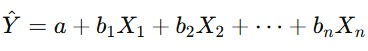

Hasil prediksi ini adalah nilai terbaik yang akan diprediksi oleh model berdasarkan hubungan linear yang dipelajari dari data latih.

Nah, sampai di sini mungkin terlihat mudah ya? Memang kok, teknik ini relatif sederhana, tetapi sangat berguna untuk memodelkan hubungan antara variabel.

Sederhananya, model ini bekerja hanya dengan menyesuaikan garis lurus yang menggambarkan hubungan antara variabel independen dan variabel dependen, lalu menggunakan metode seperti Ordinary Least Squares (OLS) untuk meminimalkan prediksi yang error.

Setelah model dilatih, koefisien regresi akan menunjukkan dampak dari variabel independen terhadap variabel dependen, dan model dapat digunakan untuk melakukan prediksi serta dievaluasi untuk validitas dan keandalannya.

Ini mungkin akan menjadi perjalanan yang cukup seru untuk Diana dan Bilqis karena di dalamnya terdapat banyak sekali rumus matematika yang menyenangkan. Namun, tentunya ini juga menjadi pengalaman yang penting untuk Anda karena sampai di sini pastinya sudah terbayang tentang penggunaan linear regression pada kehidupan sehari-hari.

Selanjutnya untuk memaksimalkan pengalaman belajar Anda mari kita bahas sedikit lebih dalam teknik regression lainnya pada materi berikutnya, yaitu polynomial regression. Cuss~

# Contoh Algoritma Regresi - Polynomial Regression

Halo, kembali lagi pada materi regression yang membuat gairah belajar Anda menggebu-gebu karena banyak sekali perhitungan dan persamaan matematika. Tentunya sampai, di sini Anda sudah memahami betul cara menangani permasalahan linear, tetapi bagaimana jika Anda dihadapkan dengan data yang tidak memiliki hubungan linear? Nah, jika data yang Anda miliki tidak bersifat linear, regresi polinomial merupakan solusi terbaik yang bisa digunakan.

Regresi linear bekerja dengan mengasumsikan hubungan antara variabel independen X dan variabel dependen Y bersifat linear. Hubungan tersebut dapat direpresentasikan dengan garis lurus pada visualisasi scatter plot. Hal itu akan menjadi sebuah masalah ketika data yang Anda miliki menunjukkan pola non-linear sehingga mengakibatkan linear regression tidak dapat menangkap pola tersebut dengan baik.

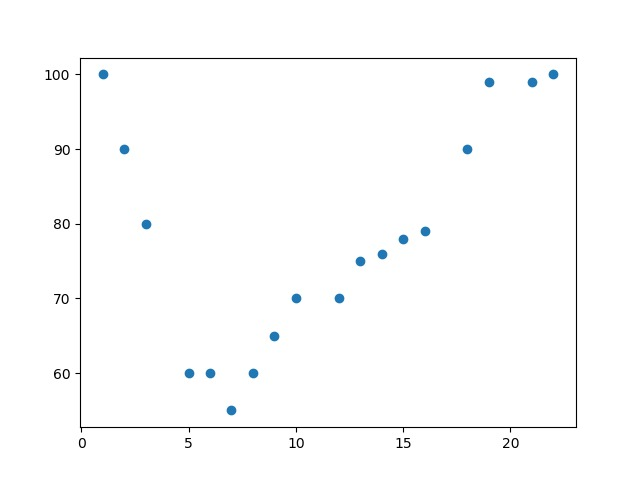

Regresi polinomial adalah bentuk lanjutan dari regresi linear yang digunakan untuk memodelkan hubungan antara variabel independen dan variabel dependen ketika hubungan tersebut tidak dapat dijelaskan dengan garis lurus, tetapi dengan kurva polinomial. Regresi polinomial memungkinkan hubungan antara variabel independen dan dependen untuk berbentuk lebih kompleks, seperti parabola, kurva kubik, atau bentuk polinomial lainnya.

Metode ini akan memperluas konsep regresi linear yang memungkinkan hubungan non-linear antara variabel independen X dan variabel dependen Y dengan menambahkan pangkat atau derajat X. Sehingga, persamaan matematikanya dapat ditulis seperti berikut.

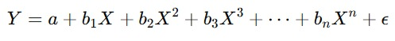

Seperti yang dapat Anda lihat pada persamaan di atas terdapat sebuah perbedaan yaitu nilai X2,X3,…,Xn. Nilai tersebut adalah variabel independen yang telah ditransformasikan menjadi bentuk polinomial.

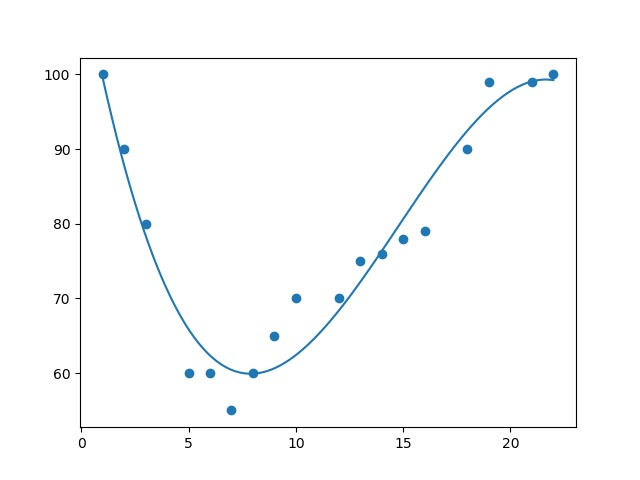

Pada metode ini, Anda juga perlu menentukan jumlah derajat polinomial (n) yang akan digunakan. Memilih derajat n yang tepat adalah langkah penting dalam regresi polinomial. Derajat n akan menentukan kompleksitas model sebagai berikut.

- Derajat rendah (n=1 atau 2): model sederhana yang mungkin tidak cukup untuk menangkap pola kompleks dalam data.
- Derajat tinggi (n ≥ 3): model yang lebih kompleks, mampu menangkap pola yang lebih rumit tetapi dengan risiko overfitting.

Tentunya hukum trade-off tetap berlaku pada proses pemilihan jumlah derajat polinomial yang Anda tentukan. Ada dua hal yang cukup penting ketika Anda menentukan jumlah derajat n, yaitu bias dan varians.

Model dengan derajat rendah mungkin memiliki bias tinggi karena tidak cukup fleksibel untuk menangkap hubungan non-linear. Sedangkan model dengan derajat tinggi mungkin memiliki varians tinggi, yang berarti model sangat sesuai dengan data latih tetapi tidak generalizable terhadap data baru yang dapat menyebabkan overfitting.

Setelah memilih derajat polinomial, variabel independen X akan diubah menjadi bentuk polinomial. Misalnya, jika X adalah luas rumah, dan kita memilih derajat n=3, kita akan memiliki variabel X (luas rumah), X2 (kuadrat dari luas rumah), dan X3 (kubik dari luas rumah).

Karena metode ini merupakan bentuk lanjutan dari linear regression, ada hal yang masih sama yaitu proses pelatihannya. Setelah variabel diubah menjadi bentuk polinomial, model regresi akan dilatih menggunakan metode OLS juga. Tujuannya adalah untuk menemukan koefisien b1,b2,…,bn yang akan meminimalkan jumlah kuadrat dari error (residual) antara nilai yang diprediksi oleh model dan nilai aktual. Bentuk persamaannya akan berubah sedikit (jika dibandingkan dengan regresi linear) menjadi seperti berikut.

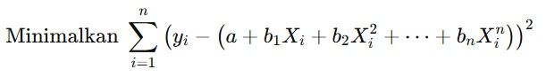

Fungsi OLS akan menentukan nilai optimal dari koefisien a, b1, b2, ..., bn yang meminimalkan nilai error.

Dengan persamaan matematika yang lebih kompleks jika dibandingkan dengan linear regression, bukan berarti semua permasalahan regresi ini dapat diselesaikan oleh polynomial regression. Ada beberapa kekurangan yang perlu diperhatikan ketika Anda memilih untuk menggunakan regresi polinomial.

Overfitting: semakin tinggi derajat polinomial, semakin besar risiko model menjadi overfit, terutama jika jumlah data yang tersedia terbatas.
Interpretasi yang Sulit: koefisien pada regresi polinomial tidak se-intuitif regresi linear, terutama untuk polinomial dengan derajat tinggi.
Ekstrapolasi yang Berbahaya: prediksi di luar rentang data (ekstrapolasi) bisa sangat tidak akurat dengan regresi polinomial, terutama pada derajat tinggi.
Di balik kekurangan pasti ada kelebihan ‘kan? Itu juga berlaku pada konteks machine learning. Berikut beberapa kelebihan dari regresi polinomial ketika permasalahan Anda tidak memiliki karakteristik linear.

Fleksibilitas Tinggi: mampu menangkap hubungan non-linear antara variabel independen dan dependen.
Lebih Akurat untuk Hubungan Non-linear: memberikan pelatihan yang lebih baik pada data yang memiliki pola non-linear dibandingkan regresi linear sederhana.
Sampai di sini, Anda sudah memiliki bekal yang cukup untuk mengatasi permasalahan regresi baik itu pada data linear hingga nonlinear. Namun, jangan cepat berpuas diri karena pada modul selanjutnya, kita akan mempelajari beberapa algoritma yang sering digunakan untuk menangani kasus regresi. Penasaran apa bedanya dan bagaimana proses perhitungan masing-masing algoritma regresi? Yuk, kita melangkah bersama agar bisa grow together, sampai jumpa!

# Contoh Algoritma Regresi - Decision Tree Regression

Decision Tree Regression adalah salah satu metode dalam machine learning yang digunakan untuk memprediksi nilai kontinu dari variabel dependen berdasarkan variabel independen. Berbeda dengan regresi linear atau polinomial yang berusaha menemukan hubungan matematis linear atau non-linear antara variabel, decision tree regression memprediksi nilai dengan cara mempartisi data ke dalam sub kelompok yang lebih homogen melalui serangkaian keputusan berbasis aturan.

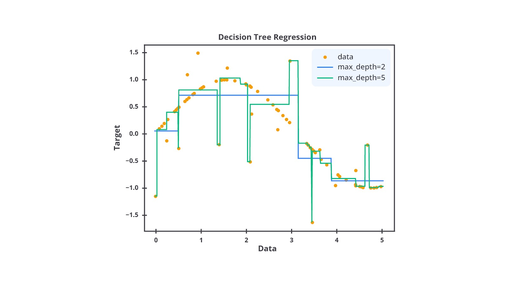

Metode ini menggunakan struktur pohon (tree structure) untuk memecah atau membagi dataset menjadi subset yang lebih kecil dan lebih kecil lagi secara rekursif. Struktur pohon yang dibangun akan memiliki tiga buah komponen yaitu root node , decision nodes, dan leaf nodes. Ketiga komponen tersebut memiliki perannya masing-masing, mari kita bahas satu per satu.

- Root Node: node awal yang mencakup seluruh dataset.
- Decision Nodes: titik percabangan yang membagi dataset berdasarkan kondisi tertentu pada variabel independen.
- Leaf Nodes: node terminal yang menunjukkan hasil prediksi, yaitu nilai yang diprediksi untuk observasi dalam kelompok tersebut.

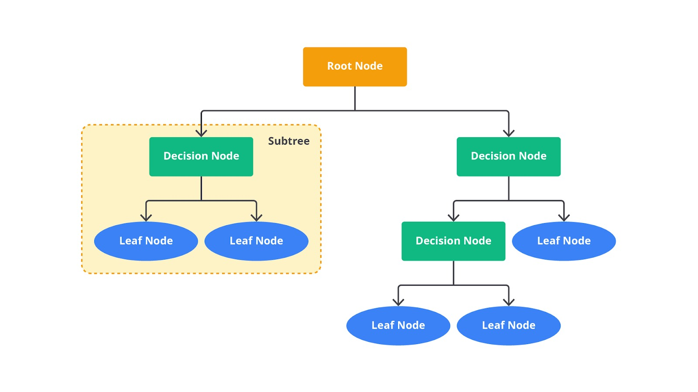

Setiap cabang dalam pohon mewakili keputusan berdasarkan kondisi yang diterapkan pada satu atau lebih fitur dan setiap leaf nodes memberikan prediksi yang merupakan rata-rata dari nilai target untuk observasi di dalam node tersebut.

Proses yang dilakukan pada metode ini sangatlah mudah, mari kita asumsikan data yang Anda gunakan sudah melewati tahapan data preprocessing dan siap digunakan sehingga kita akan memulai dari perhitungan decision node hingga menjadi leaf node.

Setiap langkah pembagian node pada decision tree akan memilih fitur (variabel independen) yang paling efektif dalam membagi dataset menjadi subset yang lebih homogen. Efektivitas fitur dalam pembagian dinilai menggunakan metrik tertentu, seperti Mean Squared Error (MSE) atau Variance Reduction.

Lalu, bagaimana cara menentukan node pada decision tree? Split yang dipilih merupakan fitur yang memiliki nilai MSE terkecil dalam subset yang dihasilkan. Sebaliknya dengan variance reduction, metode ini memilih pengurangan varians terbesar untuk dijadikan node.

Setelah node terbaik dipilih dan dataset dibagi, proses yang sama diterapkan pada setiap subset yang dihasilkan. Hal ini terus menerus dilakukan secara rekursif hingga kondisi tertentu terpenuhi, seperti mencapai kedalaman maksimum pohon, jumlah minimum sampel dalam node, atau MSE di bawah ambang batas tertentu.

Setelah pohon selesai “dibangun” dan memiliki pola tertentu akhirnya Anda dapat melakukan prediksi. Prediksi untuk setiap data baru dibuat dengan "menjatuhkan" observasi tersebut melalui pohon, mengikuti keputusan di setiap node hingga mencapai leaf node. Nilai yang diprediksi adalah rata-rata dari nilai target untuk semua observasi yang jatuh ke leaf node tersebut.

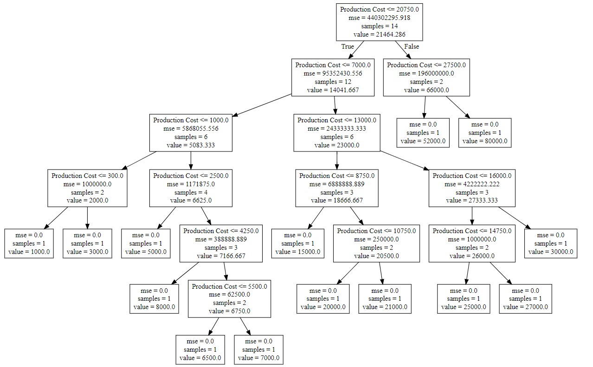

Pada proses pelatihannya algoritma ini memiliki beberapa hyperparameter penting yang bisa Anda atur sehingga mendapatkan hasil yang maksimal. Berikut adalah beberapa hyperparameter yang dapat mengontrol perilaku dan kinerja model decision tree regression:

- Max Depth: batasan pada kedalaman maksimum pohon. Membatasi kedalaman dapat mencegah overfitting. Artinya, pohon akan menjadi terlalu kompleks dan overfit terhadap data latih.

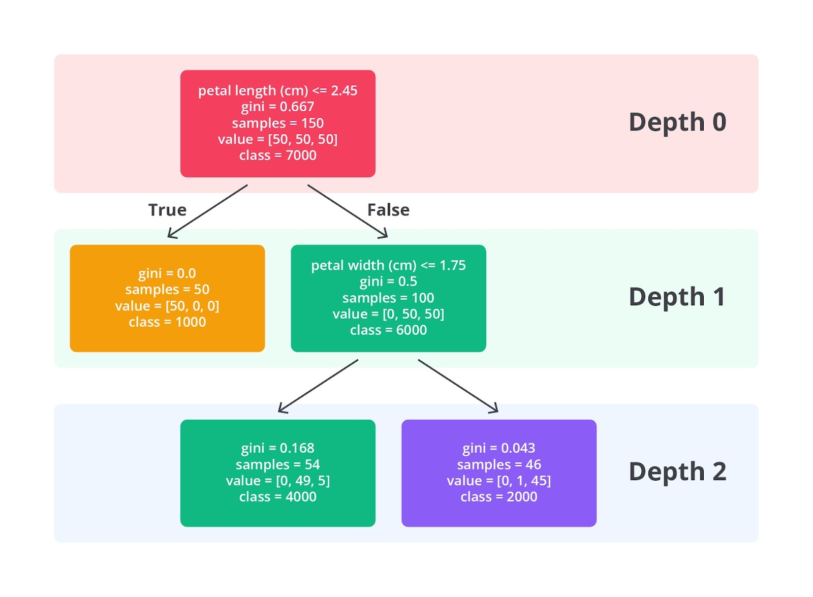

- Min Samples Split: jumlah minimum sampel yang dibutuhkan untuk membuat split pada node internal. Ini mencegah overfitting yang disebabkan oleh pembagian node yang terlalu kecil.

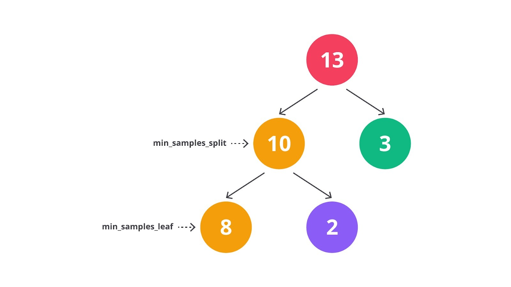

- Min Samples Leaf: jumlah minimum sampel yang dibutuhkan untuk membentuk leaf node. Ini mencegah pembentukan leaf node yang sangat kecil.

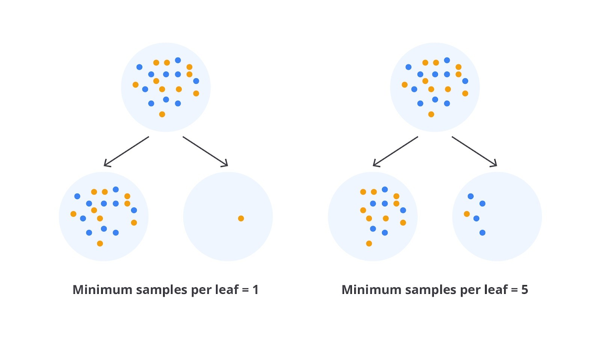

- Max Features: jumlah maksimum fitur yang dipertimbangkan untuk split di setiap node.

Di balik kesederhanaan decision tree regression ada banyak kelebihan yang ia miliki mulai dari interpretasi yang mudah dipahami, tidak membutuhkan prasyarat distribusi hingga dapat menangani berbagai macam fitur. Mari kita bahas satu per satu.

- Sederhana dan Mudah Diinterpretasikan: struktur pohon memiliki sifat yang intuitif dan mudah diinterpretasikan. Setiap keputusan dalam pohon dapat dilihat sebagai aturan sederhana yang menjelaskan proses pengolahan prediksi.
- Non-Linear Relationships: decision tree regression secara alami menangkap hubungan non-linear antara variabel independen dan dependen tanpa memerlukan transformasi fitur.
- Tidak Membutuhkan Prasyarat Distribusi: tidak seperti model regresi linear, decision tree regression tidak mengasumsikan hubungan linear atau distribusi tertentu pada data.
- Dapat Menangani Fitur Kategorikal dan Numerik: decision tree regression dapat bekerja dengan baik bersama fitur kategorikal dan numerik, serta mampu menangani data yang hilang dengan baik.

Sama seperti manusia, decision tree tidaklah sempurna. Dari berbagai kelebihannya, metode ini memiliki beberapa kekurangan yang mungkin menjadi pertimbangan bagi Anda. Mari kita bahas secara saksama.

- Overfitting: metode ini cenderung overfit jika tidak diatur dengan benar. Misalnya, tanpa batasan pada kedalaman maksimum atau jumlah sampel minimum. Overfitting menyebabkan model yang sangat sesuai dengan data latih, tetapi memiliki kinerja yang buruk pada data uji.
- Sensitif terhadap Perubahan Data: metode ini sangat sensitif terhadap perubahan kecil dalam data. Perubahan kecil dalam data bisa menghasilkan pohon yang sangat berbeda.
- Weak Learner: meskipun mudah diinterpretasikan, decision tree regression mungkin tidak sekuat model lain seperti ensemble methods (Random Forests dan Gradient Boosting). Namun, pohon tunggal seperti ini sering kali digunakan sebagai komponen dasar dari model ensemble yang lebih kompleks. Jadi, tidak ada salahnya untuk mempelajari dari dasar ‘kan?

Kekurangan yang dimiliki oleh metode ini sebenarnya masih bisa diminimalisasi kembali dengan menggunakan teknik pruning atau ensemble methods. Pruning adalah salah satu cara untuk menghindari overfitting adalah dengan “memangkas” pohon setelah proses pelatihan selesai. Pruning menghapus node yang tidak memberikan banyak informasi, berdasarkan kriteria tertentu seperti MSE. Namun, Ensemble Methods menggabungkan banyak pohon keputusan yang dilatih dan dikombinasikan untuk meningkatkan akurasi prediksi dan mengurangi overfitting.

# Contoh Algoritma Regresi - Support Vector Regression (SVR)

Support Vector Regression (SVR) adalah varian dari Support Vector Machines (SVM) yang digunakan untuk tugas regresi. Berbeda dengan regresi linear yang bertujuan meminimalkan prediksi error secara langsung, SVR mencari hyperplane terbaik yang memaksimalkan margin antara data dengan nilai prediksi dalam sebuah batasan error tertentu yang disebut epsilon-insensitive loss.

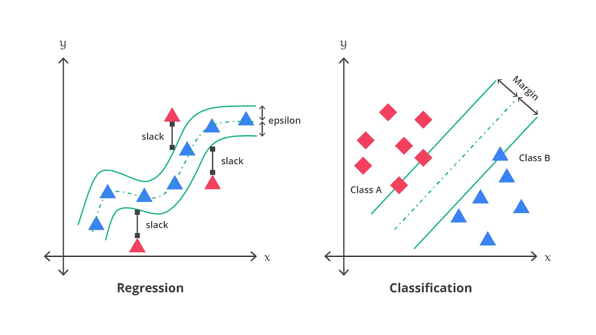

Jika Anda lihat pada gambar di atas sekilas terlihat mirip ‘kan? Walaupun SVR bekerja dengan cara yang mirip dengan SVM untuk klasifikasi tetapi terdapat sebuah perbedaan, alih-alih mencari garis pemisah (hyperplane) antara dua kelas, SVR mencoba menemukan garis atau hyperplane yang memprediksi nilai output dengan margin error yang diizinkan. Dalam SVR, hanya titik-titik data di luar margin error yang berkontribusi dalam menentukan hyperplane atau disebut dengan support vectors.

Dalam konteks SVR, hyperplane adalah fungsi linear yang memprediksi nilai target (variabel dependen) berdasarkan variabel input (variabel independen). Persamaan hyperplane dalam ruang dimensi tinggi dinyatakan sebagai berikut.

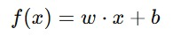

Rumus di atas dapat kita interpretasikan sebagai berikut.

- w adalah vektor bobot.
- x adalah vektor fitur input.
- b adalah bias atau intercept.

SVR secara umum dapat digunakan dalam dua konteks utama yaitu Linear SVR dan Nonlinear SVR, tetapi memiliki varian yang dikenal sebagai Epsilon-Support Vector Regression (ε-SVR). Masing-masing memiliki karakteristik dan penerapan yang berbeda sesuai dengan sifat data dan kebutuhan pemodelan. Penasaran dengan perbedaanya? Yuk, kita bahas bersama-sama.

## Linear SVR

Linear SVR adalah bentuk dasar dari Support Vector Regression yang digunakan ketika hubungan antara variabel independen (fitur) dan variabel dependen (target) bersifat linear. Artinya, SVR akan mencari hyperplane linear yang paling sesuai dengan data, di mana prediksi output (target) adalah fungsi linear dari input.

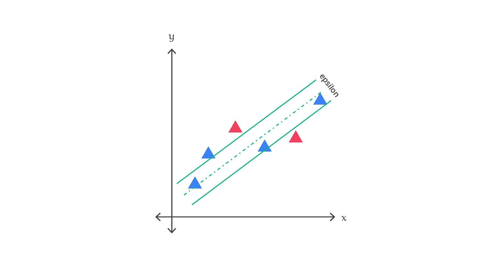

Cara kerja linear SVR kurang lebih seperti berikut.

1. Hyperplane: dalam Linear SVR, model mencari hyperplane linear dalam ruang fitur yang dapat memprediksi output dengan margin error yang minimum. Persamaannya seperti berikut.

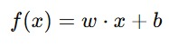

Rumus di atas dapat kita interpretasikan sebagai berikut.

- w adalah vektor bobot yang menunjukkan arah dan orientasi hyperplane.
- x adalah vektor input (fitur).
- b adalah bias atau intercept.

2. Margin (ϵ): linear SVR memperkenalkan margin ϵ, yang menentukan batas toleransi error. Data yang berada di dalam margin tidak dikenakan penalti, sementara data yang berada di luar margin dianggap sebagai eror.

3. Loss Function: model dioptimalkan dengan meminimalkan fungsi loss yang mencakup margin error (ϵ) dan regularisasi (C) untuk mengontrol kompleksitas model. Hanya data yang berada di luar margin (ϵ) yang berkontribusi terhadap fungsi loss.

## Nonlinear SVR

Nonlinear SVR digunakan ketika hubungan antara variabel independen dan dependen bersifat non-linear. Dalam kasus ini, SVR menggunakan kernel trick untuk memetakan data ke ruang dimensi lebih tinggi sehingga hubungan linear dapat ditemukan meskipun hubungan tersebut mungkin memiliki sifat non-linear dalam ruang asli.

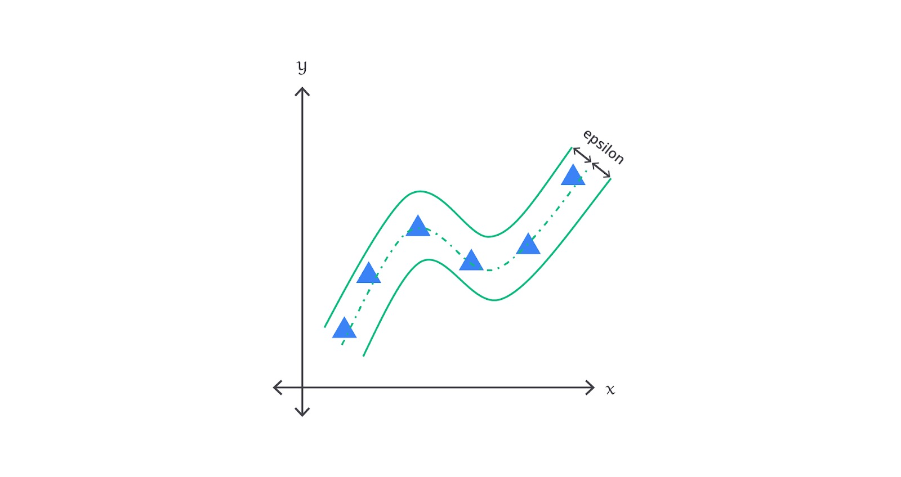

Cara Kerja Nonlinear SVR kurang lebih seperti berikut.

1. Kernel Trick: nonlinear SVR menggunakan fungsi kernel untuk memetakan data dari ruang asli ke ruang dimensi yang lebih tinggi. Fungsi kernel memungkinkan SVR untuk menemukan hyperplane linear dalam ruang dimensi tinggi ini tanpa perlu secara eksplisit melakukan transformasi.

Beberapa kernel yang umum digunakan dalam Nonlinear SVR adalah:

- Polynomial Kernel: memetakan data ke ruang polinomial yang lebih tinggi dan menangkap hubungan non-linear dengan kurva polinomial.

- Radial Basis Function (RBF) Kernel: kernel Gaussian yang populer karena memetakan data ke ruang dimensi sangat tinggi untuk menangkap hubungan non-linear yang kompleks.

2. Support Vectors: hanya titik data yang berada di luar margin ϵ (epsilon) dalam ruang dimensi tinggi yang memengaruhi posisi hyperplane sehingga menjadikannya support vectors.

3. Loss Function: sama seperti Linear SVR, tetapi dengan pemetaan kernel yang memungkinkan model menangkap hubungan non-linear.

## Epsilon-Support Vector Regression (ε-SVR)

Epsilon-Support Vector Regression (ε-SVR) adalah varian dari SVR yang menekankan penggunaan margin error ϵ dalam fungsi loss. Semua bentuk SVR, baik linear maupun non-linear, bisa dianggap sebagai bentuk ϵ-SVR jika mereka menggunakan margin ϵ untuk menentukan toleransi error.

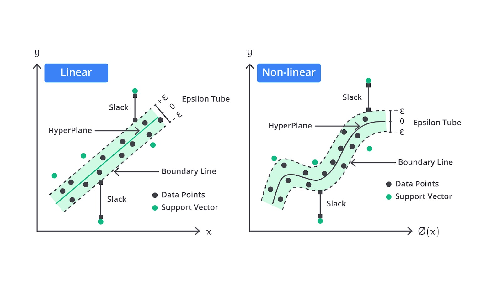

Tenang dahulu, sampai di sini kita hanya akan membahas konsep kerja epsilon secara singkat.

- Epsilon Margin (ϵ): parameter ϵ menentukan lebar margin di sekitar hyperplane atau kurva prediksi, sehingga prediksi tidak dikenakan penalti jika error berada dalam margin ini. Jika prediksi berada di luar margin ϵ nilai tersebut akan dikenakan penalti dan nilai error dihitung.
- Slack Variables (ξ): untuk data yang berada di luar margin ϵ, slack variables (ξ) digunakan untuk mengukur sejauh mana prediksi berada di luar margin ini. Slack variables memungkinkan beberapa eror berada di luar margin dengan penalti yang dikendalikan oleh parameter C.
- Objective Function: fungsi objektif dalam ε-SVR adalah untuk meminimalkan kombinasi dari error yang berada di luar margin ϵ dan regularisasi terhadap kompleksitas model. Ini memberikan kontrol yang baik atas trade-off antara error pada data latih dan generalisasi model.

Sampai di sini, materi yang perlu Anda ketahui cukup sampai konsep dasar. Jika Anda penasaran dengan perhitungan lebih dalamnya, kami tunggu di kelas Belajar Pengembangan Machine Learning, ya!

Eiitss jangan beranjak terlebih dahulu, sebagai materi tambahan untuk Anda yang penasaran dengan materi SVR mari kita tutup dengan kelebihan dan kekurangan dari SVR ini.

Kelebihan:

1. Kemampuan Menangani Hubungan Non-Linear: dengan kernel trick, SVR dapat menangkap hubungan non-linear antara fitur dan target.
2. Fleksibilitas dengan Parameter: parameter ϵ dan C memberikan fleksibilitas dalam mengontrol error dan kompleksitas model.
3. Robust terhadap Outliers: dengan memilih ϵ yang sesuai, SVR dapat menjadi robust terhadap outliers karena hanya eror di luar margin yang dihitung.

Kekurangan:

1. Komputasi yang Mahal: SVR, terutama dengan kernel non-linear bisa menjadi sangat mahal secara komputasi, terutama untuk dataset besar.
2. Pemilihan Parameter yang Sulit: memilih parameter yang tepat untuk ϵ, C, dan kernel bisa menjadi sulit dan memerlukan tuning yang ekstensif.
3. Kurangnya Interpretasi: model SVR, terutama dengan kernel non-linear, kurang intuitif dan lebih sulit diinterpretasikan dibandingkan dengan model regresi linear sederhana.

Bagaimana, mudah ‘kan materinya? Baguslah kalau begitu karena pada materi berikutnya, kita akan mempelajari salah satu bentuk regresi yang lebih seru yaitu neural network regression.

Dari namanya saja sudah menandakan banyak petualangan yang menunggu, tanpa berlama-lama mari kita berangkat!

# Contoh Algoritma Regresi - Neural Network Regression

Neural Network Regression adalah salah satu teknik lanjutan machine learning yang digunakan untuk memodelkan dan memprediksi nilai kontinu dari variabel dependen (target) berdasarkan variabel independen (fitur). Neural Network (NN) menggunakan struktur jaringan yang terinspirasi oleh otak manusia yang berarti neuron buatan akan dihubungkan dalam berbagai lapisan untuk memproses dan mengubah input menjadi output.

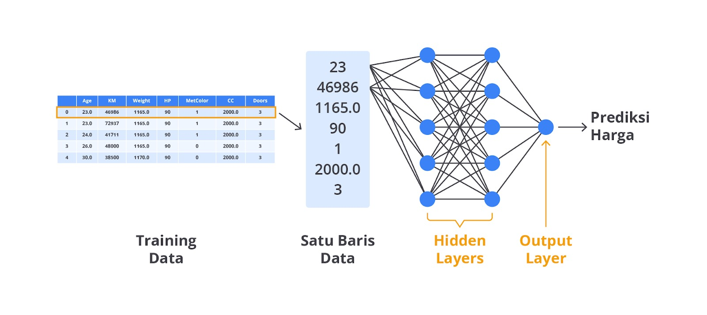

To be honest, materi ini seharusnya terdapat di materi deep learning. Namun, sebagai calon praktisi machine learning setidaknya Anda mengetahui materi selanjutnya yang akan dipelajari. Pada materi ini, kita tidak akan terlalu jauh bermain-main dengan neural network karena sejatinya materi ini akan Anda pelajari dengan sangat detail dan komprehensif pada kelas Belajar Pengembangan Machine Learning. Anggap saja materi ini sebagai sneek peek ya teman-teman!

Pada dasarnya, Neural Network Regression berfungsi dengan cara yang mirip dengan model regresi tradisional tetapi dengan pendekatan yang jauh lebih fleksibel dan kuat. Neural network dapat menangkap hubungan yang sangat kompleks antara input dan output, termasuk hubungan non-linear yang sulit diidentifikasi oleh model regresi sederhana seperti linear regression.

Dengan keandalan metode ini, untuk menangkap hubungan antara input dan output dari sebuah kasus regresi tentu saja tidak lepas dari arsitektur dasarnya yang sangat powerfull. By default satu buah neuron akan memiliki arsitektur yang meliputi input, bias, weight, activation function, dan output.

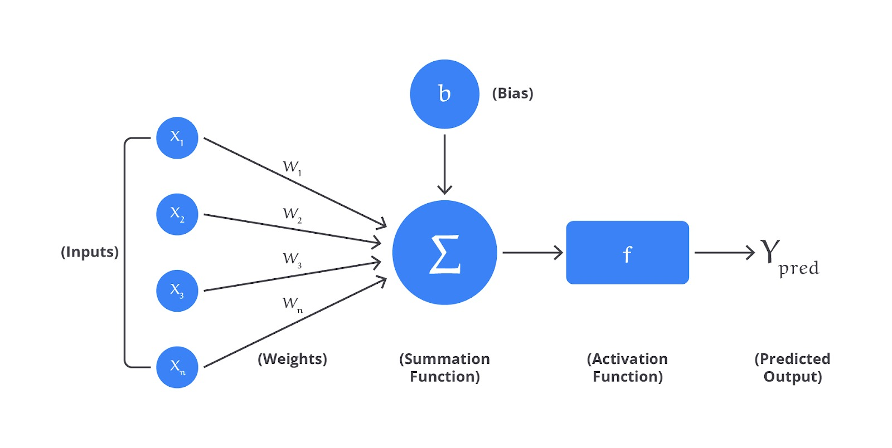

“Hah, apa artinya semua istilah itu?” Mari kita bahas sedikit pada materi ini.

1. Neuron: unit dasar dari neural network adalah neuron buatan, yang juga disebut sebagai node atau unit. Setiap neuron menerima satu atau lebih input, memproses input tersebut, dan menghasilkan output yang diteruskan ke neuron berikutnya.
2. Lapisan (Layers): satu arsitektur neural network setidaknya terdiri dari tiga jenis lapisan yaitu input layer, hidden layer, dan output layer. Ketiganya memiliki peran yang berbeda-beda, berikut penjelasan singkat dari masing-masing layer.

- Input Layer: lapisan pertama yang menerima input dari data. Setiap neuron dalam lapisan ini mewakili satu fitur dari data input.
- Hidden Layers: lapisan-lapisan di antara input dan output yang memproses input menggunakan bobot dan fungsi aktivasi. Neural network bisa memiliki satu atau lebih hidden layers, dan semakin banyak hidden layers yang dimiliki, semakin dalam jaringan tersebut.
- Output Layer: lapisan terakhir yang menghasilkan output dari network yang dibangun, dalam kasus regresi output ini adalah nilai kontinu yang diprediksi.

3. Bobot (Weights): setiap koneksi antara neuron memiliki bobot, yang menentukan seberapa besar pengaruh input tertentu terhadap output neuron. Bobot ini diubah selama pelatihan untuk meminimalkan error prediksi.
4. Bias: bias adalah nilai tambahan yang membantu model menangkap pola yang lebih kompleks. Bias ditambahkan ke input neuron sebelum melewati fungsi aktivasi.
5. Fungsi Aktivasi (Activation Function): fungsi aktivasi mengubah input ke neuron menjadi output non-linear. Beberapa fungsi aktivasi yang umum digunakan dalam neural network regression termasuk ReLU (Rectified Linear Unit), Sigmoid, dan Tanh.

Penjelasan di atas merupakan bekal Anda untuk memperdalam materi tentang deep learning pada kelas berikutnya. Sampai di sini, bekal materi di atas akan menjadi sangat berarti ketika Anda memulai kelas berikutnya. Agar tetap semangat melanjutkan kelas berikutnya, mari kita bahas kelebihan neural network regression ini sebagai pemantik rasa penasaran.

Neural network atau bagian dari deep learning ini memiliki kelebihan yang sangat menguntungkan, dalam konteks regresi neural network dapat menangkap hubungan non-linear yang kompleks antara input dan output. Di lain sisi, neural network dapat digunakan untuk berbagai jenis data dan masalah, termasuk data yang besar dan beragam (bahkan unstructured data loh). Dan salah satu kelebihan yang dapat di highlight adalah kemampuan generalisasi.

Bagaikan pisau bermata dua, tentunya tidak semua permasalahan yang diselesaikan oleh neural network akan memberikan hasil yang lebih baik karena selain performa Anda juga perlu memperhatikan parameter lainnya seperti harga, waktu, dan kesulitan.

Neural network terutama deep learning, memerlukan komputasi yang intensif dan waktu pelatihan yang lama hal ini menjadi penting ketika Anda bekerja di sebuah perusahaan startup. Dengan harga dan waktu yang cukup besar neural network juga rentan terhadap overfitting jika tidak diatur dengan baik, terutama dengan jumlah parameter yang besar. Dan yang terakhir, neural network sering dianggap sebagai "black box" karena sulit untuk diinterpretasikan dibandingkan dengan model yang lebih sederhana seperti linear regression.

Dengan beragam kelebihan dan kekurangan dari neural network regression tentunya Anda sudah dapat menentukan metode yang tepat untuk menyelesaikan permasalahan yang akan dihadapi. Oiya, sebagai catatan walaupun neural network ini merupakan metode yang powerfull dan dapat menyelesaikan permasalahan yang lebih kompleks bukan berarti metode ini menjadi solusi all in one ya. Karena selain performa, ada beberapa hal yang nantinya akan menjadi pertimbangan Anda dalam membangun model machine learning, seperti waktu, biaya, dan usaha.

Ngomong-ngomong all in one method, pernahkah Anda mendengar kutipan seperti "kita tidak perlu menggunakan palu besar untuk memukul paku kecil" atau "jangan gunakan meriam untuk membunuh lalat"? Gagasan tersebut memiliki arti bahwa kita tidak perlu menggunakan alat yang terlalu kuat atau kompleks untuk menyelesaikan masalah yang sederhana.

Kutipan-kutipan semacam itu mengandung pesan bahwa penggunaan sesuatu yang lebih sederhana dan lebih sesuai dengan konteks dapat sama efektifnya, atau bahkan lebih efisien, daripada menggunakan solusi yang berlebihan atau berdaya terlalu besar.

Yup, permasalahan di atas juga sangat relevan pada konteks machine learning. Karena at the end of the day, Anda ditugaskan untuk menyelesaikan masalah dengan efisien, baik itu dalam segi kemampuan (performa), biaya, usaha, bahkan hingga maintenance.

Dengan perkembangan AI yang sangat pesat hingga saat ini, deep learning tentunya dapat menyelesaikan permasalahan dengan lebih baik. Bahkan dengan hadirnya Generative AI, permasalahan regresi, klasifikasi, sentimen analisis dan lain sebagainya dapat diselesaikan dengan model yang sama. Apa itu Generative AI dan mengapa sangat powerful? Tenang-tenang, kita juga akan mempelajari materi tersebut di kelas selanjutnya ya.

Walaupun Generative AI memiliki berbagai macam kemampuan, tetapi hal itu bukanlah pilihan yang bijak ketika Anda hanya ingin melakukan klasifikasi atau regresi sederhana. “You don't need a sledgehammer to crack a nut.” Yang berarti dengan model machine learning sederhana Anda dapat menyelesaikan permasalahan tersebut dengan lebih tepat, murah, fleksibel, dan tidak mubazir sumber daya.

Huftt, bagaimana perjalanan yang Anda lalui sangat menyenangkan ‘kan? Pada materi ini, Anda bertemu dengan istilah baru seperti deep learning dan generative AI. Tentunya kita belum membahas keduanya dengan sangat detail karena ini merupakan awal perjalanan Anda.

Setelah mempelajari berbagai metode regresi tentunya Anda sudah bisa menentukan metode yang paling cocok untuk permasalahan Anda kelak. Namun, sebenarnya di luar materi kelas ini, masih terdapat banyak sekali metode atau algoritma baik itu untuk klasifikasi atau regresi. Dengan perkembangan yang sangat cepat, kami menyarankan Anda tetap melakukan eksplorasi secara mandiri. Karena sebaik-baiknya materi, akan jauh lebih baik jika itu didorong dari diri kita sendiri.

Pada materi berikutnya, kita akan mempelajari teknik evaluasi pada permasalahan regresi. Hal ini akan membantu untuk mengetahui performa model yang dibangun sehingga nantinya Anda dapat menentukan metode mana yang akan digunakan untuk menyelesaikan permasalahan yang ada.

# Evaluasi Model Regresi

Evaluasi model regresi adalah langkah penting dalam proses membangun model prediksi. Dengan evaluasi yang baik, kita bisa mengetahui seberapa akurat model dalam memprediksi data yang belum pernah dilihat. Untuk membantu siswa pemula memahami proses ini, kami akan menjelaskan konsep dasar, metrik evaluasi utama, dan cara menginterpretasinya.

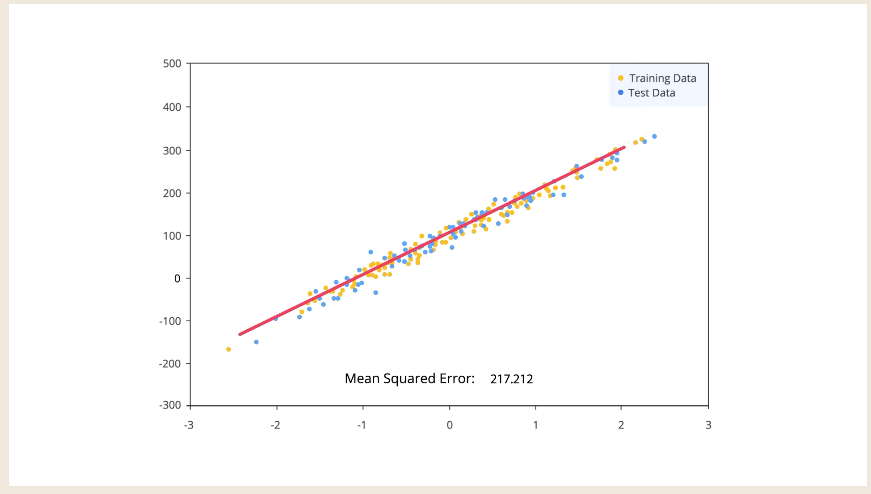

Setelah membangun model, penting untuk mengevaluasi seberapa baik model tersebut bekerja. Evaluasi ini membantu kita untuk memahami seberapa akurat prediksi model, mengetahui jika model terlalu rumit atau terlalu sederhana, dan memastikan bahwa model tidak hanya baik pada data latihan tetapi juga pada data baru.

Mari kita membahas evaluasi model regresi dengan lebih detail menggunakan contoh perhitungan pada kasus jual beli rumah. Dalam kasus ini, kita akan menggunakan fitur luas rumah (dalam meter persegi) untuk memprediksi harga rumah (dalam juta Rupiah).

Misalkan kita memiliki data berikut.

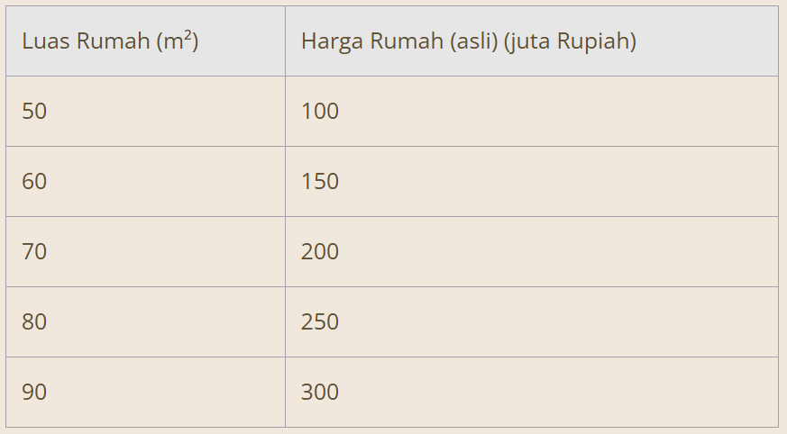

Kita ingin membangun model regresi sederhana yang memprediksi harga rumah berdasarkan luas rumah. Katakanlah setelah melatih model, kita mendapatkan persamaan regresi sebagai berikut.

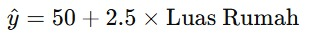

Kita akan menghitung prediksi harga rumah untuk masing-masing luas rumah yang ada di dataset sehingga jika divisualisasikan hasilnya akan seperti berikut.

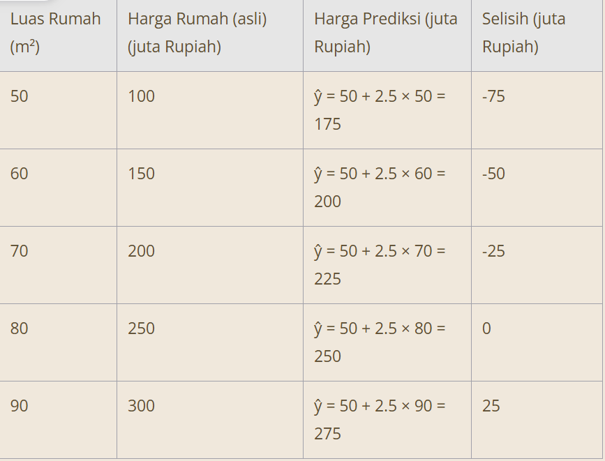

Jika Anda perhatikan kolom selisih pada tabel di atas, kita sudah menemukan nilai selisih hanya dengan mengurangi harga prediksi dengan harga asli, mudah sekali ‘kan? Menghitung selisih antara nilai aktual dan prediksi memang merupakan langkah dasar dalam evaluasi model regresi, tetapi ada beberapa alasan mengapa kita tidak cukup hanya menghitung selisih tersebut secara langsung tanpa menggunakan metrik lain.

Jika hanya menghitung selisih antara nilai aktual dan nilai prediksi, kita akan mendapatkan serangkaian nilai selisih (residual) dengan nilai positif atau negatif. Selisih ini bisa membantu kita melihat performa model overestimate (terlalu tinggi) atau underestimate (terlalu rendah), tetapi mereka tidak memberikan gambaran yang jelas tentang performa keseluruhan model.

Perhatikan data terakhir pada tabel di atas yang memiliki nilai selisih -25, nilai selisih ini bisa saling membingungkan ketika kita menghitung rata-rata dan memberi kesan bahwa tidak ada kesalahan. Namun, jelas bahwa model tidak akurat dalam kedua prediksi tersebut karena terdapat selisih positif dan negatif.

Solusi dari permasalahan di atas kita dapat menggunakan perhitungan metriks yang lebih andal. Beberapa contoh nya dengan menggunakan nilai absolut seperti pada MAE atau kuadrat dari selisih seperti pada MSE kita memastikan bahwa semua kesalahan diperhitungkan secara positif sehingga kesalahan besar tidak terabaikan.

Tahukah Anda walaupun regresi dan klasifikasi memiliki induk yang sama yaitu supervised learning, tetapi mereka memiliki metriks evaluasi yang berbeda.

Hayoo, apakah Anda masih ingat dengan metriks evaluasi pada kasus klasifikasi di modul sebelumnya atau sedikit lupa karena terlalu asyik dengan materi di modul ini? Tenang, mari kita lihat perbedaannya melalui diagram berikut.

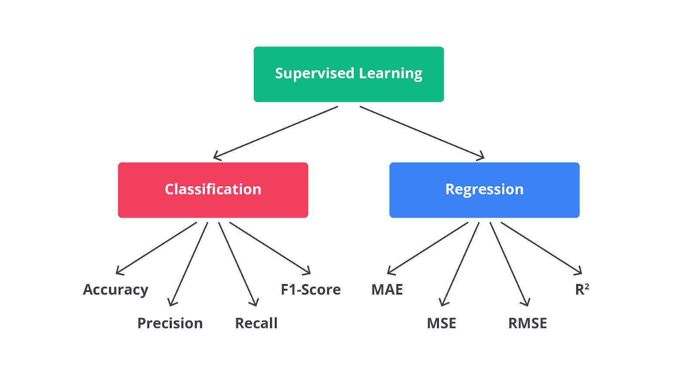

Serupa tapi tak sama, begitulah kira-kira yang bisa kita pelajari bersama untuk klasifikasi dan regresi. Kesamaan dari keduanya adalah harus memiliki fitur atau variabel target sebagai jawabannya, tetapi memiliki output yang sangat berbeda.

Setelah Anda memahami proses evaluasi pada kasus klasifikasi, sekarang saatnya kita melangkah sedikit lebih jauh untuk mencoba memahami proses evaluasi pada kasus regresi.

Secara umum ada empat dasar metriks evaluasi yang biasa digunakan dalam kasus regresi yaitu MAE, MSE, RMSE, dan R2. Namun, di luar metriks tersebut ada banyak metriks lainnya baik itu turunan dari keempat metode yang sudah disebutkan atau perhitungan yang lainnya.

Pada penjelasan ini, kita akan mempelajari metrics dasar terlebih dahulu hingga Anda memahami sepenuhnya dasar dari proses evaluasi regresi.

## Mean Absolute Error (MAE)

MAE adalah rata-rata dari kesalahan dengan nilai absolut antara nilai sebenarnya dan nilai prediksi.

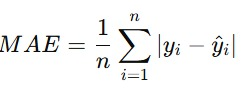

Mari kita hitung untuk setiap titik data yang ada pada tabel perhitungan yang sudah kita buat di awal materi ini.

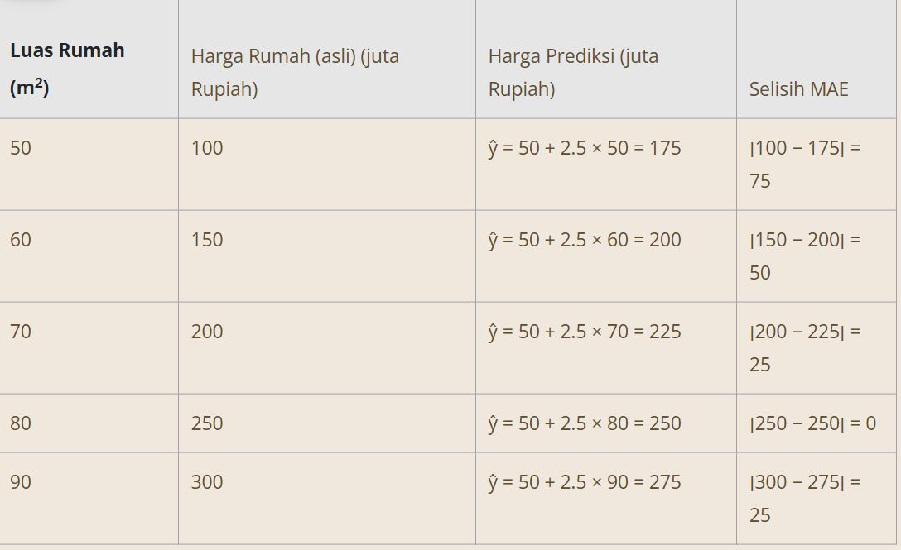

Terlihat jelas ‘kan perbedaannya dengan selisih awal tanpa menggunakan metode apa pun? Hasil akhirnya akan membuat model lebih bagus karena dengan menggunakan MAE Anda akan mendapatkan nilai error seperti berikut.

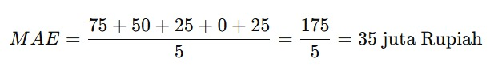

## Mean Squared Error (MSE)

MSE adalah nilai rata-rata dari kuadrat kesalahan antara nilai sebenarnya dan nilai prediksi. MSE dapat digambarkan dengan rumus matematika seperti berikut.

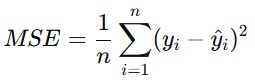

Mari kita hitung untuk setiap titik data yang ada pada tabel perhitungan yang sudah kita buat di awal materi ini.

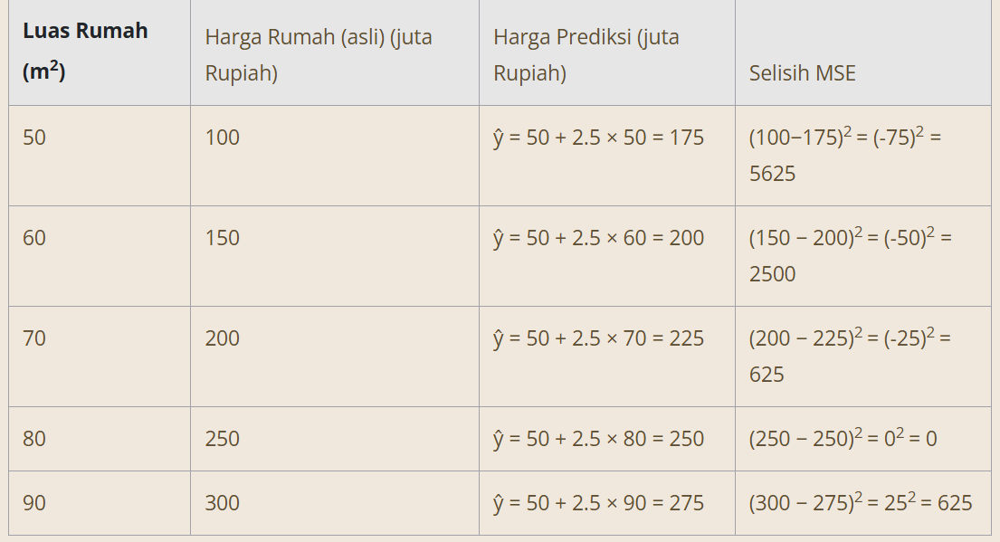

Dengan perhitungan di atas, Anda akan mendapatkan nilai MSE seperti berikut.

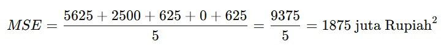

## Root Mean Squared Error (RMSE)

RMSE adalah akar kuadrat dari MSE. Ini mengembalikan kesalahan ke dalam satuan yang sama dengan data sehingga lebih mudah diinterpretasikan. Karena Anda sudah melakukan perhitungan MSE, pada kesempatan kali ini, kita hanya perlu melanjutkannya sehingga hasilnya akan menjadi seperti berikut.

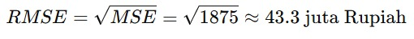

## R-squared (R²)

R-squared juga dikenal sebagai coefficient of determination adalah salah satu metrik yang digunakan untuk mengevaluasi seberapa baik model regresi linear menjelaskan variasi dalam data. R-squared memberikan ukuran proporsi variasi dalam variabel dependen (output) yang dapat dijelaskan oleh variabel independen (input) dalam model.

R-squared dihitung dengan menggunakan perbandingan antara variasi total dalam data dan variasi yang dapat dijelaskan oleh model regresi. Secara matematis, R-squared dapat ditulis sebagai berikut.

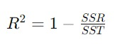

Rumus di atas dapat kita interpretasikan sebagai berikut.

- SSR (Sum of Squared Residuals) adalah jumlah kuadrat dari selisih antara nilai observasi dengan nilai prediksi model. Ini adalah kesalahan yang dibuat oleh model.
- SST (Total Sum of Squares) adalah jumlah kuadrat dari selisih antara nilai observasi dengan rata-rata nilai observasi. Ini mengukur variasi total dalam data.

Sehingga, jika kita jabarkan rumus matematis untuk R2 dapat ditulis sebagai berikut.

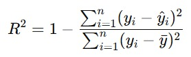

Langkah pertama yang perlu Anda lakukan adalah menghitung ȳ yang merupakan rata-rata dari harga rumah aktual.

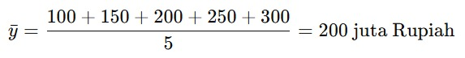

Lalu, kita hitung jumlah kuadrat total untuk nilai SST dengan rumus nilai aktual dikurangi nilai ȳ.

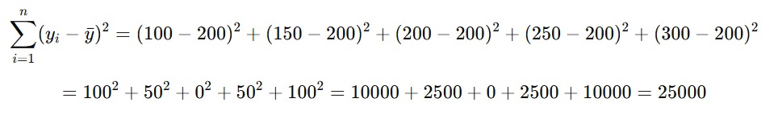

Sehingga, nilai SST pada kasus ini adalah 25000. Lalu, bagaimana dengan nilai SSR? Nilai SSR didapat dari nilai aktual dikurangi nilai prediksi lalu dikuadratkan. Sehingga, jika kita hitung berdasarkan tabel di atas akan menghasilkan perhitungan seperti berikut.

Nah setelah kedua parameter terpenuhi Anda bisa langsung menghitung nilai R2 dengan memasukkan nilai SSR dan SST yang sudah dihitung sehingga hasil akhirnya akan mendapatkan nilai R2 seperti berikut.

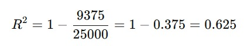

Sampai di sini, mungkin Anda masih meraba-raba interpretasi dari masing-masing evaluasi ‘kan? Sini kita jelaskan sekali lagi agar Anda bisa memahaminya dengan lebih baik.

- MAE = 35 juta Rupiah berarti rata-rata prediksi kita meleset sebesar 35 juta Rupiah dari harga sebenarnya.

- MSE = 1875 juta Rupiah² ini menunjukkan bahwa ada beberapa prediksi yang cukup jauh dari nilai sebenarnya.

- RMSE ≈ 43.3 juta Rupiah yang berarti kesalahan prediksi rata-rata sekitar 43.3 juta Rupiah.

- R² = 0.625 yaitu ketika model kita mampu menjelaskan 62.5% variabilitas harga rumah berdasarkan luas rumah. Ini berarti ada variabel lain selain luas rumah yang mungkin memengaruhi harga, dan model kita tidak menangkap semua variasi tersebut.

Dengan contoh di atas, kita dapat melihat bahwa evaluasi model regresi memberikan wawasan penting tentang bagaimana model kita bekerja. MAE dan RMSE menunjukkan seberapa besar kesalahan rata-rata, sedangkan R² menunjukkan seberapa baik model kita menjelaskan hubungan antara variabel independen dan dependen. Dengan memahami dan menggunakan metrik-metrik ini, kita bisa mengevaluasi dan memperbaiki model prediksi kita sehingga lebih akurat.

Kita telah sampai di penghujung materi modul regresi, jangan terburu-buru untuk menyelesaikan kelas ini. Karena objektif sesungguhnya adalah menguasai materi yang ada, bukan hanya sekadar lulus dan menghilang.

Nikmatilah masa-masa belajar di kelas pemula ini. Anda dapat mengulas kembali dan memahami materi dengan lebih baik. Jika ada pertanyaan, silakan berkunjung ke forum diskusi, ya.
