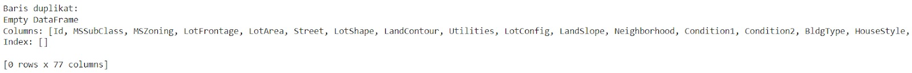

# Data Collecting

Perjalanan Diana dan Bilqis sudah mencapai babak yang baru karena pada tahap ini mereka akan memulai tahapan nyata dalam pembangunan model machine learning. Pada materi sebelumnya mereka telah belajar tentang pengenalan machine learning dan proses pengembangan machine learning. Namun, semua hal itu tidak akan ada artinya jika tidak memulai terjun ke lapangan ‘kan?

Jangan khawatir kita akan menemani perjalanan mereka sedikit demi sedikit. Mari kita mulai dengan membayangkan Anda sedang membangun sebuah gedung pencakar langit yang megah. Sebelum mulai mendirikan bangunan, Anda tentu membutuhkan fondasi yang kuat.

Dalam machine learning, data collecting adalah fondasi tersebut. Tanpa data yang tepat dan berkualitas, model machine learning Anda tidak akan mampu berdiri kokoh, apalagi memberikan hasil yang andal.

“Data is the new oil. It’s valuable, but if unrefined it cannot really be used. It has to be changed into gas, plastic, chemicals, etc to create a valuable entity that drives profitable activity; so must data be broken down, analyzed for it to have value.”

— Clive Humby —

Kutipan di atas adalah kalimat terkenal tentang data yang pertama kali disampaikan oleh Clive Humby, seorang matematikawan asal Inggris pada tahun 2006. Kutipan tersebut menjadi sangat populer setelah The Economist memublikasikan laporan tahun 2017 yang berjudul The World’s most valuable resource is no longer oil, but data.


Perangkat cerdas dan internet telah membuat data menjadi berlimpah. Banjir arus data yang terjadi di era digital mengubah sifat persaingan. Perusahaan teknologi raksasa berlomba-lomba mengumpulkan banyak data untuk meningkatkan produknya, menarik lebih banyak pengguna, menghasilkan lebih banyak data, dan seterusnya.

Mereka menjangkau seluruh sektor ekonomi: Google bisa melihat apa yang ditelusuri dan dicari oleh orang-orang, Facebook bisa melihat apa yang mereka bagikan, dan Amazon mengetahui apa yang mereka beli. Mereka seolah memiliki “God’s eyes view” tentang aktivitas di pasar mereka sendiri dan sekitarnya.

Luar biasa, ya? Sekarang hampir semua perusahaan mengumpulkan data untuk sumber daya mereka.

Lantas apa itu data collecting atau pengumpulan data? Data collecting adalah langkah pertama dalam alur kerja machine learning di mana Anda mengumpulkan semua informasi yang dibutuhkan untuk melatih model. Data ini bisa datang dari berbagai sumber dan dalam berbagai bentuk—mulai dari data numerik, teks, gambar, hingga data kategori. Kualitas dan kuantitas data yang Anda kumpulkan akan sangat menentukan performa model machine learning yang Anda bangun.


Proses pengumpulan data adalah jantung dari proyek machine learning. Tanpa data yang cukup dan relevan, model Anda tidak akan bisa belajar dengan baik. Ibarat seorang murid yang mencoba memahami pelajaran baru, model machine learning juga membutuhkan banyak contoh (data) untuk bisa memahami pola dan membuat prediksi yang akurat. Hal ini sudah sangat sering dikumandangkan pada kutipan “Garbage In Garbage Out” yang secara singkat berarti data yang digunakan akan menghasilkan output yang serupa.


Berdasarkan penjelasan di atas, Diana masih memiliki sebuah pertanyaan “Mengapa data collecting sepenting itu, ya? Kan yang sulit pembuatan modelnya.” Pertanyaan tersebut merupakan hal umum yang sering terjadi ketika memulai belajar machine learning. Mari kita kupas tuntas beberapa alasan mengapa data collecting itu sangat penting.

- Menentukan Akurasi Model
  Makin banyak data relevan yang dikumpulkan, makin baik model Anda dalam memahami pola dan membuat prediksi. Namun, kualitas data juga penting—data yang penuh dengan noise atau outlier bisa mengaburkan pola sebenarnya dan menurunkan akurasi model.

- Mencegah Bias
  Data yang tidak lengkap atau tidak seimbang bisa menyebabkan model bias terhadap kelompok tertentu. Dengan mengumpulkan data dari berbagai sumber dan memastikan representasi yang seimbang, Anda dapat mengurangi risiko bias dalam model Anda.

- Mengakomodasi Variasi
  Dunia nyata penuh dengan variasi, dan model machine learning perlu dilatih dengan data yang mencerminkan variasi ini. Dengan mengumpulkan data dari berbagai kondisi, Anda membantu model Anda untuk lebih adaptif dan mampu menangani situasi yang berbeda-beda.

Lantas, bagaimana cara mengumpulkan data? Pertama-tama mari kita mundur sedikit dengan menentukan sumber data yang bisa kita gunakan mulai dari data internal, data eksternal, data sintetis hingga data yang dihasilkan dari pengguna. Tentunya ini akan sangat membantu Anda menentukan cara pengumpulan data kelak. Mari kita bahas satu per satu.

- Data Internal
  Banyak perusahaan memiliki data sendiri yang berasal dari operasional bisnis mereka, seperti data penjualan, data pelanggan, atau data log dari aplikasi. Data ini sangat berharga karena biasanya sudah terstruktur dan sesuai dengan kebutuhan bisnis.

- Data Eksternal
  Jika data internal tidak cukup, Anda bisa mencari data eksternal. Ini bisa berupa data publik dari pemerintah, data yang diambil dari internet (web scraping), atau data yang dibeli dari penyedia data.

- Data Sintetis
  Dalam beberapa kasus, data nyata mungkin sulit didapatkan. Di sini, data sintetis bisa digunakan. Ini adalah data yang dibuat secara artifisial berdasarkan karakteristik dari data nyata.

- Data yang Dihasilkan dari Pengguna
  Pengguna aplikasi atau platform Anda bisa menjadi sumber data yang sangat berharga. Data ini bisa berupa interaksi pengguna, ulasan produk, atau perilaku penelusuran.

Nah, sekarang Anda sudah mengetahui berbagai sumber data yang bisa digunakan. Selanjutnya, mari kita bahas tiga cara yang bisa kita lakukan untuk mengumpulkan data.

- Mengekstrak data (misal dari internet, riset, survei, dll).
  Biasanya hal ini disebut dengan scraping website. Teknik ini akan melakukan ekstraksi data secara otomatis dari situs website dengan struktur yang dapat Anda sesuaikan. Tenang saja, kita akan mempelajari tahapan ini secara detail pada kelas berikutnya.

- Mengumpulkan dan membuat dataset Anda sendiri dari nol.
  Anda juga dapat membuat dataset sendiri mulai dari melakukan survei, membuat sebuah aplikasi yang dapat mengolah data, atau menggabungkan beberapa dataset dari data internal perusahaan tempat Anda bekerja. Tentunya dengan membuat dataset dari nol, Anda memiliki keleluasaan sepenuhnya atas informasi dan struktur yang ingin dicapai.

- Menggunakan dataset yang telah ada.
  Saat ini ada berbagai macam penyimpanan data yang dibagikan secara publik mulai dari lisensi yang dapat digunakan secara bebas hingga terdapat beberapa batasan khusus. Tentunya dengan menggunakan dataset yang sudah ada Anda akan menghemat banyak waktu karena akan melewati tahapan data collecting yang memakan waktu.

Setelah memiliki bekal terkait pengumpulan alangkah lebih baiknya Anda juga mempelajari langkah-langkah yang umum dilakukan untuk melakukan pengumpulan data. Berangkat dari pengetahuan yang sudah dipelajari pada materi ini, mari kita bahas langkah-langkah dalam proses pengumpulan data.

- Menentukan Kebutuhan Data.
  Sebelum mengumpulkan data, Anda harus memperjelas objektif tentang apa yang ingin Anda prediksi atau analisis. Ini akan membantu Anda menentukan jenis data apa yang perlu dikumpulkan dan dalam jumlah berapa.

- Memilih Sumber Data.
  Setelah mengetahui kebutuhan Anda, langkah selanjutnya adalah memilih sumber data yang sesuai. Apakah Anda akan menggunakan data internal, mengunduh data publik, atau melakukan survei sendiri?

- Mengumpulkan dan Menyimpan Data.
  Setelah sumber data dipilih, Anda mulai mengumpulkan data. Ini bisa melalui API, survei, scraping web, atau impor data dari file. Pastikan data disimpan dengan baik dan aman, serta dalam format yang mudah diakses untuk analisis lebih lanjut.

- Validasi dan Pembersihan Data.
  Data yang terkumpul mungkin mengandung kesalahan atau data yang hilang. Oleh karena itu, proses validasi dan pembersihan data penting untuk memastikan data yang Anda gunakan berkualitas tinggi.

Sampai pada tahap ini Anda sudah mengetahui secara utuh tahapan pengumpulan data, tetapi untuk mempermudah pemahaman mari kita bayangkan beberapa studi kasus.

Bayangkan Anda ingin membangun model machine learning untuk memprediksi harga rumah. Langkah pertama yang Anda lakukan adalah mengumpulkan data. Anda bisa mengumpulkan data dari beberapa sumber berikut.

- Website properti untuk mendapatkan informasi harga, lokasi, ukuran rumah, dan tahun bangunan.
- Data ekonomi dari pemerintah yang memberikan informasi mengenai tingkat bunga hipotek dan tren pasar properti.
- Data survei pelanggan untuk mendapatkan preferensi dan kebutuhan dari calon pembeli rumah.

Setelah data terkumpul, Anda membersihkannya, memastikan tidak ada data yang hilang, dan mulai menggunakannya untuk melatih model prediksi harga rumah. Dengan data yang tepat, model Anda akan mampu memberikan estimasi harga rumah yang akurat.

Akhirnya Diana dan Bilqis telah menguasai teori pengumpulan data, tetapi pengetahuan tersebut masih terasa “pincang”. Mengapa hal itu bisa terjadi? Ada sebuah kalimat intermezzo yang menarik untuk Anda pelajari.


Dari kutipan di atas, tentunya kita tidak mendapatkan pengalaman yang maksimal ketika mengetahui salah satunya saja. Untuk memenuhi kebutuhan tersebut, mari kita lakukan praktik pada proses pengumpulan data pada materi berikutnya.

# Latihan: Mengumpulkan Data dari Sumber Terbuka

## Menentukan Sumber Dataset

Menemukan dataset yang tepat adalah salah satu langkah penting dalam proyek machine learning. Saat ini, tersedia banyak sumber data di internet yang dapat kita manfaatkan.

Mari kita bahas beberapa sumber yang perlu Anda ketahui sebagai seorang machine learning engineer atau data scientist.

### UC Irvine Machine Learning Repository


https://archive.ics.uci.edu/datasets UCI ML Repository adalah salah satu sumber daya paling populer di dunia untuk dataset yang digunakan dalam penelitian dan pengembangan machine learning. Repositori tersebut awalnya dibuat sebagai arsip ftp pada tahun 1987 oleh David Aha, seorang mahasiswa pascasarjana UC Irvine. Saat ini arsip ini dikelola oleh University of California, Irvine, repositori ini berisi berbagai dataset yang dapat digunakan oleh peneliti, akademisi, dan praktisi machine learning untuk mengembangkan, menguji, dan memvalidasi model mereka.

Repositori ini menawarkan dataset dari berbagai bidang yang memungkinkan eksplorasi dan penelitian dalam berbagai jenis masalah machine learning. Setiap dataset dilengkapi juga dengan deskripsi yang detail, termasuk atribut, ukuran, sumber, publikasi, dan lisensi terkait.

Salah satu keuntungan besar yang diberikan repositori ini adalah aksesnya. Semua dataset yang disediakan dapat diakses secara gratis, yang membuatnya menjadi sumber daya yang sangat berharga untuk penelitian akademis maupun pengembangan model komersial.

### Kaggle Dataset


https://www.kaggle.com/datasets Kaggle adalah platform online yang menyediakan lingkungan bagi para data scientist, peneliti, dan penggemar machine learning untuk berkolaborasi, berkompetisi, dan mempelajari berbagai aspek data science. Didirikan pada tahun 2010 dan sekarang dimiliki oleh Google, Kaggle dikenal sebagai salah satu komunitas terbesar di dunia bagi para praktisi data science dan machine learning.

Sedikit berbeda dengan UCI Repository, Kaggle terkenal karena kompetisi data science-nya, di mana perusahaan atau organisasi memberikan masalah nyata yang perlu dipecahkan. Peserta bersaing untuk menghasilkan model machine learning terbaik dengan hadiah yang menarik.

Kelebihan lainnya yang dimiliki Kaggle adalah kernels/notebook yang sudah built-in. Kaggle menyediakan platform untuk menulis dan menjalankan kode Python dan R secara langsung di browser melalui Kaggle Notebooks (dahulu dikenal sebagai Kaggle Kernels). Ini memudahkan pengguna untuk bereksperimen dengan dataset tanpa harus mengunduh atau menginstal software tambahan.

Terakhir untuk memaksimalkan pengalaman pengguna Kaggle menyediakan dua buah fitur yang sangat berguna, yaitu Discussion and Courses dan Community and Collaboration.

Kaggle memiliki forum diskusi yang aktif. Di sana,pengguna bisa bertanya, berdiskusi, dan berbagi pengetahuan. Selain itu, Kaggle juga menyediakan kursus online gratis untuk mempelajari dasar-dasar data science dan machine learning. Di lain sisi, Kaggle adalah tempat para data scientist dari seluruh dunia berkumpul, belajar, dan berkolaborasi. Anda bisa mengikuti user lain, belajar dari notebook mereka, atau, bahkan bergabung dalam tim untuk mengerjakan kompetisi bersama.

Dengan berbagai kelebihannya, Kaggle saat ini sangat mendominasi pengguna yang sedang belajar machine learning atau data science. Oleh karena itu, jangan sampai ketinggalan, silakan membuat akun Kaggle agar dapat menikmati semua fiturnya. Silakan eksplorasi Kaggle secara mandiri dan bersiap untuk membuat model machine learning pada submission kelas ini.

### Google Dataset Search Engine


https://datasetsearch.research.google.com/ Google Dataset Search Engine adalah alat pencarian yang dikembangkan oleh Google untuk membantu peneliti, data scientist, dan siapa saja yang membutuhkan data untuk menemukan dataset yang tersedia secara online. Dataset Search ini mirip dengan mesin pencari Google biasa, tetapi fokusnya adalah pada dataset yang disimpan pada berbagai platform, baik yang bersifat publik maupun dari organisasi atau institusi tertentu.

Kelebihan dari Dataset Search adalah dapat menyimpan metadata dari dataset yang dipublikasikan di web serta memungkinkan pengguna untuk menemukan dataset yang relevan berdasarkan kata kunci pencarian. Metadata yang diindeks mencakup informasi seperti judul dataset, deskripsi, penerbit, tanggal publikasi, dan lain-lain, yang memungkinkan pengguna untuk menilai relevansi dataset sebelum mengunduh atau mengaksesnya.

### TensorFlow Dataset


https://www.tensorflow.org/datasets Seperti yang telah dijelaskan pada materi sebelumnya, TensorFlow adalah framework open source untuk machine learning yang dikembangkan dan digunakan oleh Google. Selain menyediakan learning resources, tensorflow juga menyediakan data resources yang cukup lengkap di library-nya mulai dari audio data, images, text, video, dan lainnya yang tersimpan di TensorFlow Datasets.

TensorFlow Dataset (TFDS) adalah kumpulan koleksi dataset yang sudah diproses dan diformat khusus untuk digunakan dengan TensorFlow, sebuah framework open-source yang banyak digunakan untuk machine learning dan deep learning. TFDS menyediakan dataset yang siap digunakan untuk berbagai tugas seperti klasifikasi gambar, pemrosesan bahasa alami, dan lain-lain. Dataset yang disediakan oleh TFDS tersedia dalam berbagai ukuran dan kompleksitas, dan dapat diakses langsung di dalam TensorFlow tanpa perlu langkah preprocessing tambahan.

TFDS menyediakan dataset dalam format tf.data.Dataset, yang merupakan API TensorFlow untuk menangani input pipeline. Ini memudahkan pengguna untuk mengintegrasikan dataset ke dalam pipeline pelatihan model, termasuk pembagian dataset menjadi training, validation, dan test set. Simpan terlebih dahulu rasa penasaran karena Anda akan mempelajari TFDS secara lengkap pada kelas berikutnya, ya.

Jika Anda menggunakan TensorFlow sebagai framework utama pembangunan machine learning itu akan memberikan beberapa keuntungan yang sangat signifikan seperti preprocessing otomatis, terintegrasi dengan TensorFlow hingga augmentasi yang lebih mudah.

Sebagai informasi, dataset di TFDS sudah diatur dalam format yang siap digunakan, termasuk pembagian ke dalam training dan test set sehingga pengguna tidak perlu melakukan banyak preprocessing tambahan.

Selain itu, dataset yang diakses melalui TFDS disiapkan dalam format yang langsung kompatibel dengan TensorFlow, memudahkan pengguna untuk menggunakan dataset tersebut ke dalam model dengan lebih seamless.

Terakhir, TFDS mendukung augmentasi data yang memungkinkan pengguna untuk memperkaya dataset dengan variasi baru, seperti rotasi gambar, flipping, atau perubahan warna dengan lebih mudah menggunakan fungsi yang sudah disediakan.

### US Government Data


https://data.gov/ US Government Data mengacu pada berbagai dataset yang disediakan oleh pemerintah Amerika Serikat untuk publik. Bagi Anda yang tertarik untuk mempelajari fenomena yang terjadi di Amerika Serikat, ini bisa menjadi pilihan yang sangat baik. Data ini mencakup berbagai sektor, seperti kesehatan, pendidikan, ekonomi, lingkungan, transportasi, dan banyak lagi.

Sumber data ini disediakan melalui berbagai lembaga pemerintah dan sering kali tersedia secara gratis untuk digunakan oleh siapa saja, termasuk peneliti, data scientist, jurnalis, pengembang aplikasi, dan masyarakat umum.

Portal utama untuk mengakses data ini adalah Data.gov, yang merupakan situs web resmi pemerintah AS untuk memublikasikan data yang dikelola oleh berbagai badan pemerintah. Data ini didukung oleh prinsip transparansi dan partisipasi publik, dengan tujuan mendorong inovasi, penelitian, dan kebijakan berbasis data.

### Satu Data Indonesia


https://data.go.id/ Tentunya tidak hanya Amerika saja yang mendorong inovasi, penelitian, dan kebijakan berbasis data. Indonesia juga tidak tinggal diam akan hal itu dengan dukungan penuh dari pemerintah berupa penyediaan data yang bisa diakses oleh semua orang sehingga dapat mengakselerasi perkembangan digital di Indonesia.

Pemerintah Indonesia melalui portal resmi Satu Data Indonesia menjalankan kebijakan tata kelola data pemerintah yang bertujuan untuk menciptakan data berkualitas, mudah diakses, dapat dibagi, dan digunakan oleh instansi pusat serta daerah.

Data dalam portal ini dapat diakses secara terbuka dan dikategorikan sebagai data publik sehingga tidak memuat rahasia negara, rahasia pribadi, atau hal lain sejenisnya sebagaimana diatur dalam Undang-undang nomor 14 Tahun 2008 tentang Keterbukaan Informasi Publik.

### Open Data Pemerintah Jawa Barat


https://opendata.jabarprov.go.id/id/dataset Sedikit mengerucut dan lebih spesifik, salah satu pemerintah level provinsi membangun sebuah portal yang berisikan data di wilayah Jawa Barat melalui Open Data Jabar.

Open Data Jabar adalah portal resmi data terbuka milik Pemerintah Provinsi Jawa Barat yang berisikan data-data dari Perangkat Daerah di lingkungan Pemerintah Provinsi Jawa Barat. Open Data Jawa Barat hadir untuk memenuhi kebutuhan data publik bagi masyarakat. Data disajikan dengan akurat, akuntabel, valid, mudah diakses dan berkelanjutan.

### Menggunakan Dataset dari Sumber Terpilih

Setelah mengetahui berbagai macam sumber data tidak afdal rasanya jika tidak mengetahui cara mengakses sumber data tersebut.

Catatan

Untuk saat ini, kita akan menggunakan salah satu sumber data yang sudah ada dari platform penyedia data terkenal, yaitu Kaggle. Anda bisa melakukan eksplorasi secara mandiri untuk sumber data lainnya karena penggunaannya tidak jauh berbeda sehingga materi yang ada di sini masih sangat relevan.

Pada latihan ini, kita akan menggunakan Kaggle sebagai sumber open data dengan tema prediksi harga rumah. Setelah mengenal teori pengumpulan data, sekarang kita akan belajar mengumpulkan data dari sumber Kaggle.

Tahapan yang akan kita lalui adalah sebagai berikut.

- Menentukan kasus yang akan diselesaikan.
- Menentukan sumber data yang akan digunakan (pada kasus ini kita akan menggunakan Kaggle).
- Menggunakan dataset yang sudah ada dari open data.

Langkah pertama adalah mengidentifikasi dan mendefinisikan masalah yang ingin Anda selesaikan dengan machine learning. Misalnya, Anda bekerja di bidang real estate dan ingin membangun model machine learning untuk memprediksi harga rumah berdasarkan berbagai fitur, seperti lokasi, ukuran, jumlah kamar, dan lain-lain.

Setelah menentukan masalah, langkah selanjutnya adalah menentukan jenis data yang diperlukan untuk melatih model Anda. Sebagai contoh data yang Anda butuhkan adalah sebagai berikut.

- Fitur: lokasi (kode pos atau koordinat GPS), ukuran rumah (luas tanah dan bangunan), jumlah kamar tidur, jumlah kamar mandi, tahun dibangun, dll.
- Label (Target): harga jual rumah.

Berikutnya, Anda perlu mencari sumber data yang dapat menyediakan informasi yang dibutuhkan. Dalam contoh ini, Anda bisa mencari dataset yang sudah ada tentang harga rumah. Salah satu sumber yang terkenal dan dapat diandalkan adalah Kaggle.

Sekarang, Anda akan mencari dataset yang sesuai di Kaggle. Ikuti langkah-langkah berikut.

- Kunjungi situs Kaggle dengan membuka tautan berikut Kaggle.com.

- Cari dataset yang relevan dengan mengetikkan kata kunci seperti "house prices" atau "real estate data" di kotak pencarian pada halaman utama Kaggle.

- Pilih dataset yang sesuai. Misalnya, salah satu dataset populer adalah House Prices - Advanced Regression Techniques yang menyediakan data tentang harga rumah di beberapa daerah dengan berbagai fitur properti yang relevan.

- Terakhir, setelah memilih dataset yang dirasa sesuai dengan permasalahan yang akan diselesaikan, Anda bisa mengunduhnya dengan mengeklik tombol Download.

Setelah mengunduh dataset, pahami dan pastikan dataset tersebut sudah sesuai dengan kebutuhan Anda. Biasanya, dataset dari Kaggle sudah terstruktur dengan baik, tetapi Anda tetap harus memahami struktur data dan mempersiapkannya sebelum digunakan dalam model machine learning. Untuk mengetahui langkah selanjutnya, mari kita lanjutkan perjalanan yang menyenangkan ini pada materi berikutnya, yaitu tentang Data Loading.

# Data Loading

Sampai pada tahap ini jangan biarkan data yang sudah dikumpulkan menjadi sia-sia. Agar data yang sudah siap diolah dapat digunakan, Diana perlu melakukan loading atau memuat dataset.


Loading dataset dalam konteks machine learning adalah proses mengimpor atau memasukkan data ke dalam lingkungan pemrograman atau sistem yang digunakan untuk pengembangan model machine learning. Dataset ini berfungsi sebagai input yang akan digunakan oleh model untuk belajar dan membuat prediksi.

Proses loading dataset biasanya mencakup pengambilan data dari sumber eksternal (seperti file CSV, database, API, atau sumber lain) lalu memuatnya ke dalam struktur data yang sesuai di dalam bahasa pemrograman atau framework yang digunakan. Dalam banyak kasus, bahasa pemrograman seperti Python menggunakan library Pandas untuk memuat dataset ke dalam format yang mudah disesuaikan, seperti DataFrame.

Ada beberapa hal yang perlu Anda ketahui terkait pentingnya data loading.

- Sebagai Langkah Awal: loading dataset adalah langkah pertama yang sangat penting dalam alur kerja machine learning. Tanpa data, Anda tidak bisa melatih atau menguji model.
- Memastikan Integritas Data: proses loading juga memberikan kesempatan untuk memverifikasi bahwa data dimuat dengan benar dan sesuai dengan harapan. Misalnya, memeriksa apakah semua kolom dimuat dengan tipe data yang benar dan apakah ada data yang hilang atau tidak.
- Verifikasi Kesiapan Data: dataset yang sudah di-load ke dalam struktur data yang sesuai akan memudahkan proses berikutnya, seperti eksplorasi, pembersihan data, transformasi, dan pelatihan model.

Pandas mendukung berbagai ekstensi file yang digunakan untuk menyimpan dan memanipulasi data. Dengan kemampuannya untuk membaca berbagai format, Pandas memberikan fleksibilitas luar biasa dalam menangani data dari berbagai sumber dan memudahkan proses analisis data di Python. Berikut adalah tipe file yang dapat diolah menggunakan Pandas.

## CSV (Comma-Separated Values)

Ekstensi: .csv
Cara Load: pd.read_csv('file.csv')
Deskripsi: CSV adalah format file yang sangat umum digunakan untuk menyimpan data tabular. Setiap baris dalam file CSV mewakili satu record, dan setiap nilai dalam baris dipisahkan oleh koma (atau delimiter lainnya seperti titik koma).

## Excel Files

Ekstensi: .xls, .xlsx
Cara Load: pd.read_excel('file.xlsx')
Deskripsi: Excel adalah format file yang sering digunakan untuk spreadsheet dan data tabular. Pandas dapat membaca berbagai sheet dalam file Excel dan mengonversinya menjadi DataFrame.

## JSON (JavaScript Object Notation)

Ekstensi: .json
Cara Load: pd.read_json('file.json')
Deskripsi: JSON adalah format file yang sering digunakan untuk menyimpan dan mentransfer data berbasis objek. Pandas dapat mengonversi JSON yang terstruktur dengan baik menjadi DataFrame.

## HTML

Ekstensi: .html
Cara Load: pd.read_html('file.html')
Deskripsi: Pandas dapat membaca tabel data yang ada di dalam file HTML dan mengonversinya menjadi DataFrame. Ini sering digunakan untuk scraping data dari web.

## SQL Database

Ekstensi: Tidak ada ekstensi khusus, data diambil dari database.
Cara Load: pd.read_sql_query('SELECT \* FROM table_name', connection)
Deskripsi: Pandas dapat mengakses data yang disimpan dalam tabel SQL dan mengonversinya menjadi DataFrame, dengan koneksi ke database seperti SQLite, MySQL, PostgreSQL, dll.

## Parquet

Ekstensi: .parquet
Cara Load: pd.read_parquet('file.parquet')
Deskripsi: Parquet adalah format file yang sangat efisien untuk menyimpan data kolumnar yang sering digunakan dalam big data analytics. Pandas mendukung pembacaan dan penulisan file Parquet.

## HDF5 (Hierarchical Data Format)

Ekstensi: .h5, .hdf5
Cara Load: pd.read_hdf('file.h5')
Deskripsi: HDF5 adalah format file yang dirancang untuk menyimpan data besar dalam struktur yang terorganisir. Pandas dapat membaca dan menulis data ke file HDF5.

## Feather

Ekstensi: .feather
Cara Load: pd.read_feather('file.feather')
Deskripsi: Feather adalah format file yang dioptimalkan untuk penyimpanan data tabular yang sangat cepat dan efisien, baik dalam hal pembacaan maupun penulisan.

## Stata

Ekstensi: .dta
Cara Load: pd.read_stata('file.dta')
Deskripsi: Stata adalah software statistik, dan Pandas mendukung pembacaan file .dta yang digunakan oleh Stata.

## SAS (Statistical Analysis System)

Ekstensi: .sas7bdat
Cara Load: pd.read_sas('file.sas7bdat')
Deskripsi: SAS adalah software analisis data yang digunakan untuk statistik. Pandas mendukung pembacaan file SAS.

## SPSS (Statistical Package for the Social Sciences)

Ekstensi: .sav
Cara Load: pd.read_spss('file.sav')
Deskripsi: SPSS adalah software statistik yang sering digunakan dalam ilmu sosial. Pandas dapat membaca file .sav yang digunakan oleh SPSS.

## Pickle

Ekstensi: .pkl
Cara Load: pd.read_pickle('file.pkl')
Deskripsi: Pickle adalah format serialisasi Python yang digunakan untuk menyimpan objek Python ke dalam file. Pandas dapat memuat objek DataFrame yang disimpan dalam format Pickle.

## ORC (Optimized Row Columnar)

Ekstensi: .orc
Cara Load: pd.read_orc('file.orc')
Deskripsi: ORC adalah format file yang dirancang untuk penyimpanan data kolumnar yang digunakan dalam Hadoop. Pandas mendukung pembacaan file ORC.

## SQL Lite

Ekstensi: .db atau .sqlite
Cara Load: pd.read_sql_table('table_name', connection)
Deskripsi: SQLite adalah database yang ringan dan file-based. Selain itu, Pandas juga dapat membaca tabel dari database SQLite langsung ke dalam DataFrame.

## LaTeX

Ekstensi: .tex
Cara Load: pd.read_stata('file.tex')
Deskripsi: Pandas bisa membaca dan menulis tabel LaTeX yang sering digunakan dalam dokumen akademik untuk pemformatan tabel.

## Clipboard

Ekstensi: Tidak ada ekstensi, data diambil dari clipboard.
Cara Load: pd.read_clipboard()
Deskripsi: Pandas dapat membaca data langsung dari clipboard (misalnya, hasil copy-paste dari spreadsheet) yang memudahkan pengambilan data cepat untuk analisis.

Selain tipe-tipe data di atas, ada berbagai macam file yang bisa diolah menggunakan Pandas. Anda bisa membaca lebih lengkapnya pada Pandas Documentation https://pandas.pydata.org/pandas-docs/stable/reference/io.html, ya. Ngomong-ngomong pada kelas ini kita akan sering menggunakan data csv dan excel, jadi silakan kuasai kedua tipe tersebut ya.

# Latihan: Data Loading

Masih ingatkah tentang data yang telah Anda unduh sebelumnya pada materi Data Collecting terkait housing price? Jika Anda telisik lebih dalam pada file zip (sebuah file ekstensi) terdapat beberapa file seperti data_description.txt, sample_submission.csv, test.csv dan train.csv. Seluruh file yang akan kita gunakan bertipe CSV (Comma Separated Value(s)) sehingga Anda dapat menggunakan Pandas seperti berikut.


Jika kita konversi pada studi kasus yang akan diselesaikan, kode yang dibuat akan seperti berikut.

```bash
import pandas as pd
test = pd.read_csv("/content/test.csv")
test.head()
```


```bash
train = pd.read_csv("/content/train.csv")
train.head()
```


Setelah dataset dimuat, langkah berikutnya biasanya adalah pembersihan data (data cleaning), eksplorasi data (data exploration), dan preprocessing sebelum akhirnya Anda melanjutkan ke tahap pelatihan model. Sampai pada tahap ini, Anda akan memastikan bahwa dataset sudah sesuai dengan format dan struktur yang dibutuhkan oleh algoritma machine learning yang akan digunakan.

Catatan
Walaupun terlihat sangat sederhana dan mudah loading dataset adalah langkah pertama dan esensial dalam proses machine learning. Proses ini melibatkan pengambilan data dari sumber eksternal dan memuatnya ke dalam lingkungan kerja untuk dianalisis lebih lanjut. Dengan dataset yang sudah dimuat, Anda bisa memulai proses eksplorasi, pembersihan, dan pelatihan model machine learning, yang semuanya bergantung pada kualitas dan kesiapan data yang Anda miliki.

# Data Cleaning dan Transformation

Anda mungkin berpikir pekerjaan data scientist atau machine learning engineer adalah membuat algoritma, mengeksplor data, membuat analisis, dan prediksi. Padahal faktanya, seseorang yang bekerja di bidang data menghabiskan sebagian besar waktunya untuk melakukan proses data cleaning. Hasil penelitian CrowdFlower dalam 2016 Data Science Report menyatakan bahwa 3 dari 5 data scientist yang disurvei menggunakan sebagian besar waktunya untuk membersihkan dan mengatur data.


Data Cleaning atau pembersihan data adalah proses penting dalam alur kerja machine learning yang bertujuan untuk meningkatkan kualitas dataset sebelum digunakan untuk pelatihan model. Dalam konteks machine learning, data cleaning mencakup serangkaian langkah yang dirancang untuk mendeteksi, memperbaiki, atau menghapus data yang tidak valid, tidak lengkap, tidak akurat, atau tidak relevan. Silakan simak gambar berikut dan perhatikan secara saksama.


Dari gambar di atas mungkin tebersit dipikiran Anda sebuah pertanyaan “mengapa data cleaning begitu penting sehingga sebagian besar waktu digunakan untuk menyelesaikan proses ini?”


Data cleaning memiliki peran yang vital sebab proses ini meningkatkan kualitas data yang juga berpengaruh terhadap produktivitas kerja secara keseluruhan. Data yang tidak akurat bisa berpengaruh buruk terhadap akurasi dan performa model. Saat kita melakukan proses data cleaning, kita membuang data dan informasi yang tidak dibutuhkan sehingga kita akan mendapatkan data yang berkualitas.

Data yang akurat dan berkualitas akan berpengaruh positif terhadap proses pengambilan keputusan. Kita sudah familier mendengar ungkapan “Garbage In - Garbage Out?” Dalam konteks machine learning, jika input yang Anda masukkan itu buruk, sudah pasti hasil olah data pun akan buruk.

Secara umum, jika kita ringkas terdapat beberapa poin penting yang perlu diketahui ketika melakukan data cleaning.

- Meningkatkan Akurasi Model: data yang bersih dan berkualitas tinggi memungkinkan model untuk belajar pola yang sebenarnya dalam data, yang pada prosesnya akan meningkatkan akurasi dan kinerja model.
- Mencegah Overfitting: data yang tidak akurat atau penuh noise bisa menyebabkan model overfitting, di mana model belajar dari data yang salah dan tidak mampu membuat prediksi yang baik pada data baru.
- Meningkatkan Efisiensi: data yang bersih mempermudah proses analisis dan pemodelan, mengurangi kebutuhan untuk debugging atau penyesuaian model yang ekstensif di kemudian hari.
- Memastikan Keandalan: data yang tidak bersih dapat memperkenalkan bias atau kesalahan sistematis dalam model yang dapat menyesatkan dalam pengambilan keputusan berbasis data.

Sampai di sini tentu Anda sudah paham ‘kan mengapa data cleaning itu sangat penting? Oleh karena itu, data cleaning merupakan tahapan yang tidak boleh Anda lewatkan.

Berdasarkan data di atas, ada beberapa tahapan umum yang harus dilakukan dalam proses data cleaning.

- Mengidentifikasi dan Menangani Nilai yang Hilang (Missing Values)
  Nilai yang hilang adalah salah satu masalah paling umum dalam data. Missing value terjadi ketika data dari sebuah record tidak lengkap. Missing value sangat memengaruhi performa model machine learning. Umumnya ada 2 (dua) opsi untuk mengatasi missing value, yaitu menghilangkan data missing value atau mengganti nilai yang hilang dengan nilai lain, seperti rata-rata dari kolom tersebut (mean) atau nilai yang paling sering muncul (modus), atau nilai tengah (median).

  Jika terlalu banyak data yang hilang dalam suatu baris atau kolom, Anda mungkin memilih untuk menghapusnya. Namun, ini hanya disarankan jika data yang hilang tidak signifikan secara statistik. Di lain sisi, mengisi nilai yang hilang dengan nilai rata-rata, median, modus, atau menggunakan metode lebih canggih seperti K-Nearest Neighbors (KNN) atau regresi untuk memperkirakan nilai yang hilang menjadi pilihan yang baik ketika data yang hilang memiliki peran yang penting.

- Mengidentifikasi dan Menangani Outliers
  Outliers adalah data yang secara signifikan berbeda dari mayoritas data lainnya. Mereka bisa disebabkan oleh kesalahan pengukuran atau fenomena yang sebenarnya terjadi. Jika outliers disebabkan oleh kesalahan atau tidak relevan, mereka dapat dihapus. Namun, jika outliers merupakan bagian dari distribusi normal, transformasi seperti log transformation dapat dilakukan untuk mengurangi dampaknya.

- Normalisasi dan Standardisasi Data
  Data sering kali perlu dinormalisasi atau distandardisasi untuk memastikan bahwa fitur-fitur memiliki skala yang sama dan penting untuk algoritma tertentu seperti K-Nearest Neighbors atau Support Vector Machines.

- Menangani Duplikasi Data
  Data yang memiliki duplikat akan memengaruhi model machine learning, apalagi jika data duplikat tersebut besar jumlahnya. Untuk itu, kita harus memastikan tidak ada data yang terduplikasi.

  Duplikasi dalam data dapat terjadi karena berbagai alasan, seperti kesalahan input atau penggabungan dataset dari sumber yang berbeda. Data yang diduplikasi dapat menyebabkan model memberikan bobot berlebihan pada contoh yang sama sehingga dapat memengaruhi kinerjanya.

- Mengonversi Tipe Data dan Menangani Inkonsistensi Data
  Data sering kali memiliki inkonsistensi, seperti ejaan yang berbeda untuk kategori yang sama atau format data yang tidak konsisten. Menangani inkonsistensi ini sangat penting untuk memastikan data yang bersih dan akurat.

  Misalnya, sebuah variabel mungkin tidak memiliki format yang konsisten seperti penulisan tanggal 10-Okt-2020 versus 10/10/20. Format jam yang berbeda seperti 17.10 versus 5.10 pm. Penulisan uang seperti 17000 versus Rp17.000. Data dengan format berbeda tidak akan bisa diolah oleh model machine learning. Solusinya, format data harus disamakan dan dibuat konsisten terlebih dahulu.

  Selain tipe data yang harus seragam, Anda perlu memastikan bahwa tipe data yang ada pada dataset sesuai dengan kebutuhan model machine learning. Terkadang, tipe data dalam dataset mungkin tidak sesuai dengan kebutuhan model. Misalnya, variabel kategorikal mungkin perlu dikonversi ke format numerik melalui teknik seperti one-hot encoding.

  Terakhir, Anda perlu memastikan skala data pada setiap variabel yang ada. Sebagai contoh jika sebuah variabel memiliki jangka dari 1 sampai 100, pastikan tidak ada data yang lebih dari 100. Untuk data numerik, jika sebuah variabel merupakan bilangan positif, pastikan tidak ada bilangan negatif.

Intinya data cleaning adalah langkah vital yang berfungsi untuk memastikan bahwa data yang digunakan membangun model machine learning memiliki sifat akurat, relevan, dan bebas dari kesalahan yang bisa merusak kualitas model.

Dengan melakukan data cleaning secara hati-hati, Anda meningkatkan peluang untuk membangun model machine learning yang lebih baik, andal, dan mampu membuat prediksi yang akurat. Namun, perlu Anda catat bahwa proses cleaning data ini tidak bersifat wajib dilakukan semuanya. Tahapan tersebut perlu Anda cek secara mandiri karena bisa saja data yang digunakan sudah bersih karena mengambil dari pustaka open data dan sudah dibersihkan oleh author (pemilik) data.

Di waktu yang akan datang, mungkin Anda akan menemukan proses atau tahapan baru karena menghadapi karakteristik yang beragam. Oleh karena itu, kuasai fondasi atau dasar proses cleaning sehingga kelak Anda bisa menghadapi semua permasalahan yang ada.

# Latihan: Data Cleaning dan Transformation

Pada latihan sebelumnya, Anda telah berhasil memuat data (data loading) train.csv dan test.csv. Namun, data tersebut masih perlu Anda lakukan pemeriksaan untuk mengetahui kualitas data yang digunakan.

Catatan
Proses data cleaning ini tidak perlu dilakukan semuanya karena tidak semua data memiliki karakteristik yang sama. Pada latihan ini, Anda akan melakukan cleaning terhadap train.csv, silakan lakukan secara mandiri untuk data test.csv, ya.

## Mengidentifikasi Informasi Dataset

Kita akan melihat informasi dasar tentang dataset, seperti jumlah baris, kolom, tipe data, dan jumlah nilai yang hilang.

Pertama-tama, mari kita periksa tipe data dari masing-masing fitur yang ada di dataset. Tujuan dari pemeriksaan tipe data ini adalah untuk memastikan seluruh tipe data yang ada sudah sesuai dan tidak ada kekeliruan (contoh: data numerik terdeteksi str (string)). Sehingga, pada akhirnya Anda tidak akan mengalami kesulitan ketika melakukan preprocessing data karena tipe data yang ada sudah sesuai dan bisa melalui proses dengan lebih seamless.

```bash
# Menampilkan ringkasan informasi dari dataset
train.info()
```


Selanjutnya, Anda perlu melakukan analisis statistik deskriptif dari dataset yang digunakan. Tujuan analisis statistik deskriptif dalam proses data cleaning pada machine learning adalah untuk memahami karakteristik dasar dari data yang sedang diproses. Beberapa tujuan utama dari proses ini adalah sebagai berikut.

- Memahami Distribusi Data: statistik deskriptif ini akan membantu Anda dalam memahami bagaimana data terdistribusi, termasuk melihat nilai rata-rata (mean), median, modus, rentang (range), dan variabilitas (standard deviation). Ini penting untuk mengidentifikasi data yang mungkin tidak seimbang (imbalance) atau memiliki distribusi yang tidak normal.
- Mengidentifikasi Anomali dan Outlier: analisis deskriptif dapat membantu dalam mendeteksi nilai-nilai yang tidak wajar atau outlier yang bisa memengaruhi performa model. Masih ingatkan penjelasan tentang outlier pada materi sebelumnya? Jika Anda ragu, jangan sungkan untuk me-review ulang kembali materinya, ya.
- Menilai Kualitas Data: dengan analisis deskriptif, dapat diketahui apakah ada missing values, data duplikat, atau inkonsistensi dalam dataset. Ini penting untuk memastikan bahwa data bersih dan siap digunakan untuk model machine learning.
- Mempermudah Pemahaman Data: statistik deskriptif menyajikan informasi data dalam bentuk yang lebih sederhana, seperti tabel, grafik, dan summary statistics, yang memudahkan pemahaman atas kondisi data yang ada.
- Menentukan Transformasi Data yang Diperlukan: dari hasil analisis deskriptif, bisa ditentukan apakah diperlukan transformasi data, seperti normalisasi atau standardisasi, agar data lebih sesuai untuk algoritma machine learning yang akan digunakan.

Dengan melakukan analisis statistik deskriptif, kita bisa memastikan bahwa data yang digunakan untuk melatih model machine learning adalah data yang representatif, berkualitas tinggi, dan bebas dari masalah yang dapat memengaruhi hasil akhir. Berikut adalah contoh kode untuk melakukan analisis deskriptif.

```bash
# Menampilkan statistik deskriptif dari dataset
train.describe(include="all")
```


Terakhir Anda perlu melakukan pemeriksaan terhadap data yang hilang (missing value). Tujuannya untuk mencegah kesalahan ketika melakukan analisis, mencegah error pada model, dan meningkatkan performa model. Dengan melakukan pemeriksaan missing value, Anda dapat memastikan bahwa proses analisis data dan pelatihan model machine learning berjalan dengan baik sehingga hasil yang diperoleh lebih valid dan akurat. Berikut salah satu contoh kode untuk melakukan pemeriksaan missing value.

```bash
# Memeriksa jumlah nilai yang hilang di setiap kolom
missing_values = train.isnull().sum()
missing_values[missing_values > 0]
```


## Menagatasi Missing Value

Perhatikan jumlah data yang hilang pada hasil kode sebelumnya, tentunya sangat banyak sekali data yang hilang ‘kan? Sebagai informasi jumlah data pada train.csv ini berjumlah 1460 baris sehingga jika salah satu fitur memiliki missing value lebih dari 1000, dapat kita asumsikan terlalu banyak data yang hilang. Lalu bagaimana solusinya?

Pertama-tama, mari kita pisahkan kolom yang memiliki missing value lebih dari 75% dan kurang dari 75%.

```bash
less = missing_values[missing_values < 1000].index
over = missing_values[missing_values >= 1000].index
```

Berdasarkan hasil dari langkah sebelumnya, kita akan memutuskan bagaimana menangani nilai yang hilang dengan dua cara.

- Mengisi Nilai yang Hilang: data di atas terdapat beberapa fitur yang memiliki missing value kurang dari 75% dari jumlah skala pada data. Namun, perlu Anda catat bahwa seluruh fitur tersebut memiliki tipe data yang berbeda. Sehingga penanganan missing value-nya pun perlu dibedakan.

Mari kita mulai dengan mengatasi missing value untuk tipe data numerik.

```bash
# Contoh mengisi nilai yang hilang dengan median untuk kolom numerik
numeric_features = train[less].select_dtypes(include=['number']).columns
train[numeric_features] = train[numeric_features].fillna(train[numeric_features].median())
```

Secara singkat kode di atas memiliki dua fungsi utama yaitu sebagai berikut.

- Baris pertama memilih nama-nama kolom dari DataFrame train yang memiliki tipe data numerik dari subset kolom yang ditentukan oleh less.

- Baris kedua kemudian mengisi semua nilai yang hilang (NaN) pada kolom-kolom numerik tersebut dengan nilai median dari masing-masing kolom.

Secara keseluruhan, kode ini bertujuan untuk membersihkan data dengan memastikan bahwa semua kolom numerik dalam subset tertentu (train[less]) tidak memiliki missing value (NaN) dengan menggantinya menggunakan nilai median kolom masing-masing.

Selanjutnya, kita perlu menangani permasalahan yang serupa pada data yang bertipe object atau string. Sedikit berbeda dengan kasus data numerik, pada kasus ini kita tidak bisa menggunakan median, mean, atau fungsi agregasi lainnya. Biasanya ada dua cara yang sering dilakukan untuk mengatasi permasalahan missing value pada data kategori.

- Mengisi Missing Value dengan Modus (Nilai yang Paling Sering Muncul): pendekatan ini cukup umum karena nilai modus sering kali merupakan representasi yang baik untuk data yang hilang dalam konteks kategorikal.
- Mengisi dengan Kategori Baru (Misalnya "Unknown" atau "Missing"): ini adalah cara lain untuk menangani missing value dengan menandai data yang hilang sebagai kategori baru.

Pada contoh kasus ini, mari kita atasi dengan mengisi missing value dengan modus atau nilai yang paling sering muncul pada masing-masing fitur.

```bash
# Contoh mengisi nilai yang hilang dengan mode untuk kolom kategori
kategorical_features = train[less].select_dtypes(include=['object']).columns

for column in kategorical_features:
    train[column] = train[column].fillna(train[column].mode()[0])
```

Kode di atas akan melakukan pengulangan pada setiap kolom yang berisi data kategori dalam DataFrame train. Selanjutnya, setiap kolom kategori akan melakukan proses pergantian untuk semua nilai yang hilang (NaN) dengan nilai modus dari kolom tersebut. Hasil akhirnya adalah semua kolom kategori dalam DataFrame train tidak lagi memiliki nilai yang hilang (NaN) karena semua NaN telah diisi dengan nilai modus dari kolom masing-masing.

- Menghapus Kolom dengan Banyak Nilai yang Hilang:jika ada kolom dengan terlalu banyak nilai yang hilang, kita bisa mempertimbangkan untuk menghapusnya (pada kasus ini kita mengambil batasan 75%). Untuk mengatasi kasus ini sangatlah mudah, pertama Anda perlu mengambil index atau nama kolom dari fitur yang memiliki missing value lebih dari batasan yang sudah ditentukan (Anda dapat lihat kode ketika memisahkan kolom di atas). Kemudian hal yang perlu dilakukan adalah menghapus kolom tersebut sesuai dengan nama fitur yang sudah ditentukan sebelumnya

```bash
# Menghapus kolom dengan terlalu banyak nilai yang hilang
df = train.drop(columns=over)
```

Jika Anda perhatikan kode di atas, ada sebuah perubahan nama DataFrame yang kita lakukan. Hal tersebut bertujuan supaya data asli tidak berubah dan dapat kita bandingkan sebelum dan sesudah proses mengisi missing value.

Terakhir, lakukan pemeriksaan terhadap data yang sudah melewati tahapan verifikasi missing value dengan kode berikut.

```bash
missing_values = df.isnull().sum()
missing_values[missing_values > 0]
```


## Mengatasi Outliers

Seperti yang Anda ketahui bahwa outliers merupakan salah satu blocker dalam membangun model machine learning yang optimal. Hal ini bisa disebabkan oleh berbagai hal seperti kesalahan pengisian data, error yang terjadi ketika pengumpulan data, dan lain sebagainya.

Salah satu cara mengatasi outliers adalah dengan menggunakan metode IQR (Interquartile Range) adalah salah satu pendekatan yang efektif. IQR adalah rentang antara kuartil pertama (Q1) dan kuartil ketiga (Q3) dalam data. Nilai yang terletak di luar batas IQR dianggap sebagai outlier.

Mari kita periksa terlebih dahulu apakah dataset yang digunakan memiliki outlier atau tidak menggunakan kode berikut.

```bash
import pandas as pd
import seaborn as sns
import matplotlib.pyplot as plt

for feature in numeric_features:
    plt.figure(figsize=(10, 6))
    sns.boxplot(x=df[feature])
    plt.title(f'Box Plot of {feature}')
    plt.show()
```


Catatan
Karena output dari kode di atas sangat banyak, kami hanya memperlihatkan salah satunya. Silakan ikuti latihan yang disediakan untuk melihat seluruh outputnya.

Perhatikan visualisasi data di atas, apakah Anda dapat menyimpulkan sesuatu? Yup, nilai yang berada di bawah batas bawah atau di atas batas atas dianggap sebagai outlier. Ada dua pilihan yang biasa dilakukan untuk mengatasi permasalahan ini.

- Anda dapat memilih untuk menghapus outlier.
- Menggantinya dengan nilai yang lebih moderat (seperti batas terdekat), atau menerapkan transformasi.

Nah, pada kasus ini, kita akan memilih untuk menghapus data outlier dengan asumsi bahwa outlier yang terjadi merupakan human error dan tidak ada pengaruh yang besar pada analisis deskriptif. Mari kita mulai pemeriksaan outlier menggunakan metode IQR.

Berikut adalah langkah-langkah umum untuk mendeteksi dan menangani outlier menggunakan metode IQR.

- Menghitung IQR, Q1, dan Q3
  Q1 (Quartile 1): Nilai di persentil ke-25 data.
  Q3 (Quartile 3): Nilai di persentil ke-75 data.
  IQR: Rentang antara Q3 dan Q1 (IQR = Q3 - Q1).

- Menentukan Batas Bawah dan Batas Atas
  Batas Bawah: Q1 - 1.5 \* IQR
  Batas Atas: Q3 + 1.5 \* IQR

Langkah di atas merupakan algoritma secara umum sehingga untuk memproses metode tersebut, Anda perlu mengonversi langkah-langkah yang ada pada bahasa pemrograman yang digunakan (pada kasus ini Python).

```bash
# Contoh sederhana untuk mengidentifikasi outliers menggunakan IQR
Q1 = df[numeric_features].quantile(0.25)
Q3 = df[numeric_features].quantile(0.75)
IQR = Q3 - Q1
```

Selanjutnya mari kita hapus outlier berdasarkan perhitungan di atas.

```bash
# Filter dataframe untuk hanya menyimpan baris yang tidak mengandung outliers pada kolom numerik
condition = ~((df[numeric_features] < (Q1 - 1.5 * IQR)) | (df[numeric_features] > (Q3 + 1.5 * IQR))).any(axis=1)
df_filtered_numeric = df.loc[condition, numeric_features]

# Menggabungkan kembali dengan kolom kategorikal
categorical_features = df.select_dtypes(include=['object']).columns
df = pd.concat([df_filtered_numeric, df.loc[condition, categorical_features]], axis=1)
```

Terakhir, mari kita bandingkan data yang telah melewati proses penanganan outliers dan sebelum melewati tahapan tersebut. Berikut adalah salah satu contoh visualisasi data yang telah melewati tahapan penanganan outliers.


Apakah Anda melihat perbedaannya? Benar sekali! Setelah penanganan outliers menggunakan IQR, distribusi data menjadi lebih merata dan terpusat, dengan mean dan median yang mendekati satu sama lain. Di lain sisi, varians dan standar deviasi akan berkurang, lalu rentang data menyusut karena nilai yang berbeda telah diatasi.

Pro Tips

Jika Anda tidak ingin menghapus outliers seperti contoh di atas, silakan gunakan metode agregasi seperti berikut.

```bash
median = df['column_name'].median()
df['column_name'] = df['column_name'].apply(lambda x: median if x < (Q1 - 1.5  IQR) or x > (Q3 + 1.5  IQR) else x)
```

atau

```bash
# Mengganti outlier dengan nilai batas terdekat
df['column_name'] = df['column_name'].apply(lambda x: (Q1 - 1.5  IQR) if x < lower_bound else (Q3 + 1.5  IQR) if x > (Q3 + 1.5 * IQR) else x)
```

## Normalisasi dan Standardisasi Data

Tahap selanjutnya dilakukan jika dataset memiliki fitur numerik dengan skala yang berbeda-beda, kita mungkin perlu melakukan normalisasi atau standardisasi. Normalisasi dan standardisasi adalah teknik preprocessing data yang digunakan untuk menyiapkan data sebelum analisis atau pemodelan. Keduanya bertujuan untuk membuat fitur memiliki skala yang seragam, tetapi mereka melakukannya dengan cara yang berbeda.

Sebuah pertanyaan klasik selalu muncul, “Bagaimana cara menentukan kapan harus menggunakan normalisasi atau standardisasi?”


Berikut adalah panduan umum untuk menentukan kapan Anda harus menggunakan normalisasi atau standardisasi.

## Normalisasi

Normalisasi (juga dikenal sebagai penskalaan min-max) bertugas untuk mengubah fitur sehingga nilainya berada dalam rentang tertentu, biasanya antara 0 dan 1.

Berikut poin-poin yang menjadi pertimbangan ketika akan melakukan normalisasi.

- Fitur dengan Skala Berbeda: ketika fitur memiliki skala yang sangat berbeda dan Anda ingin menyamakan rentangnya.

- Model Berbasis Jarak: jika Anda menggunakan algoritma yang bergantung pada jarak, seperti K-Nearest Neighbors (KNN) atau K-Means clustering, normalisasi dapat membantu karena model ini sensitif terhadap skala fitur.

- Data Tidak Terdistribusi Normal: jika data tidak terdistribusi normal dan Anda ingin mengubah data menjadi rentang yang lebih seragam.

## Standardisasi

Standardisasi (juga dikenal sebagai penskalaan Z-score) bertugas untuk mengubah skala pada suatu fitur sehingga memiliki rata-rata 0 dan standar deviasi 1.

Berikut poin-poin yang menjadi pertimbangan ketika akan melakukan standardisasi.

- Data Berdistribusi Normal: ketika data mengikuti distribusi normal (atau mendekati normal) dan Anda ingin mempertahankan informasi tentang distribusi data.
- Model Berbasis Regresi: untuk algoritma yang memerlukan asumsi distribusi normal atau model linier seperti Regresi Linier, Standar, atau Logistic Regression.
- Data dengan Skala Berbeda: ketika fitur memiliki skala yang berbeda tetapi Anda ingin memastikan bahwa setiap fitur berkontribusi secara proporsional tanpa mengubah distribusi data secara signifikan.

Jika kita tarik benang merah perbedaan dari standardisasi dengan normalisasi hanya pada rentangnya.

- Normalisasi: mengubah data ke dalam rentang [0, 1]. Ideal untuk model berbasis jarak dan data yang tidak terdistribusi normal.
- Standardisasi: mengubah data sehingga rata-rata menjadi atau mendekati 0 dan standar deviasi menjadi 1. Hal ini membantu model yang memerlukan distribusi normal atau data dengan skala berbeda menjadi lebih ideal pada proses pelatihannya.

Dalam praktiknya di dunia nyata, pemilihan antara normalisasi dan standardisasi sering bergantung pada algoritma yang akan digunakan dan karakteristik data. Anda perlu mempertimbangkan distribusi data dan jenis model untuk menentukan teknik preprocessing yang paling sesuai.

Mari kita kembali ke studi kasus yang sedang kita hadapi. Kita akan melakukan standardisasi karena membutuhkan distribusi normal dan tidak membutuhkan skala 0-1. Perhatikan kode berikut.

```bash
from sklearn.preprocessing import StandardScaler

# Standardisasi fitur numerik
scaler = StandardScaler()
df[numeric_features] = scaler.fit_transform(df[numeric_features])
```

Untuk melakukan perbandingan antara data sebelum dan sesudah dilakukan standardisasi, Anda dapat menggunakan kode berikut.

```bash
# Histogram Sebelum Standardisasi
plt.figure(figsize=(12, 5))
plt.subplot(1, 2, 1)
sns.histplot(train[numeric_features[3]], kde=True)
plt.title("Histogram Sebelum Standardisasi")
```


```bash
# Histogram Setelah Standardisasi
plt.subplot(1, 2, 2)
sns.histplot(df[numeric_features[3]], kde=True)
plt.title("Histogram Setelah Standardisasi")
```


Perhatikan distribusi data pada kedua visualisasi di atas (sebelum dan sesudah standardisasi), terlihat sangat berbeda, ‘kan? Kesimpulannya, standardisasi ini akan meningkatkan kinerja model dengan menyamakan skala fitur, mempercepat konvergensi algoritma optimasi, dan mengurangi risiko overfitting.

Proses ini juga mempermudah interpretasi koefisien dalam model linier, memastikan konsistensi dalam perbandingan data, dan membantu deteksi outliers. Selain itu, standardisasi merupakan prasyarat bagi beberapa algoritma statistik dan machine learning, serta memungkinkan model lebih generalizable dan transferable antar dataset, menjadikannya langkah penting dalam preprocessing data.

Catatan
Jika Anda menjalankan proses di atas terhadap semua fitur proses tersebut akan memakan waktu yang cukup lama, Anda dapat melewati tahapan tersebut atau disarankan menggunakan GPU agar proses yang dilakukan bisa berjalan lebih cepat.

Anda juga dapat menggunakan T4 GPU yang disediakan oleh Google Colab, ya.

Tenang saja, ini masih awal dari perjalanan yang lebih menegangkan. Pada materi berikutnya, Anda akan mempelajari kedua metode ini lebih detail.

## Menangani Duplikasi Data

Bagaimana sampai di sini apakah Anda menikmati petualangan ini? Jika iya, mari kita lanjutkan agar Anda tidak “setengah matang” menjadi seorang machine learning engineer.

Pada tahap ini, Anda perlu melakukan pemeriksaan kepada data yang sudah melewati tahapan-tahapan sebelumnya. Proses tersebut dapat Anda lakukan dengan menggunakan kode berikut.

```bash
# Mengidentifikasi baris duplikat
duplicates = df.duplicated()

print("Baris duplikat:")
print(df[duplicates])
```



Kode yang berperan untuk melakukan tugas itu adalah duplicated(). Fungsi ini mengembalikan Series boolean yang menunjukkan apakah sebuah baris adalah duplikat atau tidak. Sayangnya seperti yang dapat Anda lihat di atas, kasus ini tidak terdapat satu pun data yang terindikasi duplikat. Oleh karena itu, kita dapat melewati tahapan ini dan melanjutkan ke tahapan berikutnya.

Namun, sayang rasanya jika kita melewati begitu saja tahapan ini. Mari kita bahas sedikit saja dengan catatan kita tidak akan melakukan proses ini pada studi kasus yang sedang dilakukan, ya.

Jika Anda menemukan data duplikat ketika menggunakan kode di atas proses penanganannya sangat sederhana, Anda hanya perlu menghapus data tersebut dengan kode berikut.

```bash
# Menghapus baris duplikat
df = df.drop_duplicates()

print("DataFrame setelah menghapus duplikat:")
print(df)
```

Jika Anda sadar, kita hanya perlu menggunakan fungsi drop_duplicates() untuk menghapus baris yang teridentifikasi sebagai duplikat dari seluruh DataFrame.

## Mengonversi Tipe Data

Tahukah Anda bahwa model machine learning tidak bisa langsung menerima input kategorikal? Hal ini karena mereka bergantung pada operasi matematika yang memerlukan input numerik.

Sebagian besar algoritma machine learning didasarkan pada operasi matematika yang melibatkan perhitungan jarak, gradien, atau distribusi data. Misalnya, regresi linier menghitung persamaan garis menggunakan koefisien yang diterapkan pada fitur numerik. Jika data inputan berupa kategori (seperti "merah," "biru," "hijau"), tidak ada cara langsung untuk memasukkan nilai kategori tersebut ke dalam perhitungan matematika.

Di lain sisi, kategori seperti "merah," "biru," dan "hijau" tidak memiliki urutan atau nilai numerik inheren yang dapat dimengerti oleh model. Jika kategori diberi label numerik (misalnya, "merah" = 1, "biru" = 2, "hijau" = 3), model dapat salah menganggap bahwa ada hubungan matematis di antara kategori tersebut, seperti "biru" menjadi dua kali "merah" yang menghasilkan kesalahan persepsi sehingga mengakibatkan model tidak berjalan sesuai dengan harapan.

Banyak algoritma, terutama yang berbasis jarak (seperti KNN), memerlukan cara untuk mengukur jarak antar titik data. Oleh karena itu jika data bertipe kategori menyebabkan model tidak dapat mengukur jarak, misalnya, tidak ada jarak matematis yang berarti antara "merah" dan "biru."

Untuk mengatasi masalah ini, data kategorikal biasanya diubah menjadi bentuk numerik yang dapat dipahami oleh model yang biasa disebut encoding. Berikut beberapa contoh umum hal yang bisa kita lakukan untuk mengatasi permasalahan ini.

- One-Hot Encoding: mengubah setiap kategori menjadi kolom biner terpisah dengan nilai 0 atau 1 (bisa juga True atau False).


- Label Encoding: memberikan label numerik untuk setiap kategori, meskipun ini hanya cocok untuk data kategorikal ordinal.


- Ordinal Encoding: mengonversi kategori yang memiliki urutan menjadi nilai numerik yang mencerminkan urutan tersebut.


Sebelum kita melakukan encoding, silakan perhatikan data kategorikal yang ada pada dataset menggunakan kode berikut.

```bash
category_features = df.select_dtypes(include=['object']).columns
df[category_features]
```


Kita akan menggunakan metode one hot encoding dan label encoding karena data kategorikal yang ada pada dataset ini tidak memiliki urutan. Mari kita lakukan kedua pendekatan tersebut agar semakin terbayang perbedaannya.

## One Hot Encoding

Penggunaan one hot encoding sangatlah mudah terutama ketika Anda telah memisahkan nama kolom untuk data kategorikal. Perhatikan kode berikut.

```bash
df_one_hot = pd.get_dummies(df, columns=category_features)
df_one_hot
```

Kode di atas akan mengubah seluruh data yang ada pada kolom category_features menjadi numerik dengan memisahkan kolom berdasarkan value yang ada. Kurang lebih hasil dari one hot encoding akan seperti berikut.


Perhatikan jumlah rows dan columns dari output di atas, tentunya sudah terlihat ‘kan perbedaannya? Jumlah kolom yang Anda miliki bertambah sangat banyak yang asalnya berjumlah 77 menjadi 216. Hal ini karena one hot encoding akan memecah suatu fitur menjadi fitur baru dengan struktur “namakolom_value”.

## Label Encoding

Berbeda dengan one hot encoding, label encoding membutuhkan sebuah library lainnya untuk mempermudah proses pengerjaannya. Pada kasus ini, Anda akan menggunakan LabelEncoder dari sklearn sebagai senjata utama untuk melakukan encoding. Perhatikan kode berikut.

```bash
from sklearn.preprocessing import LabelEncoder

# Inisialisasi LabelEncoder
label_encoder = LabelEncoder()
df_lencoder = pd.DataFrame(df)

for col in category_features:
    df_lencoder[col] = label_encoder.fit_transform(df[col])

# Menampilkan hasil
df_lencoder
```


Dengan menggunakan LabelEncoder, jumlah kolom yang ada pada data tidak mengalami perubahan sama sekali. Hal ini karena LabelEncoder hanya mengubah value dari masing-masing fitur yang ia proses.

Sampai di sini Diana masih memiliki sebuah pertanyaan yang sangat membebani pikirannya, “Bagaimana cara menentukan encoder yang tepat untuk setiap kasus ya?” Dengan rasa penasaran tersebut Diana mencari Bilqis dan mengajaknya untuk riset bersama.

Sampai di sini, mari kita bahas bersama terkait kedua pendekatan tersebut. One hot encoding dan label encoding adalah dua teknik yang sering digunakan untuk mengubah data kategorikal menjadi format numerik yang dapat digunakan dalam algoritma machine learning. Keduanya memiliki kelebihan dan kekurangan tergantung pada konteks penggunaannya. Simak kelebihan dan kekurangan dari masing-masing encoder pada materi berikut.

## One-Hot Encoding

Kelebihan:

One-hot encoding tidak mengasumsikan adanya urutan atau hierarki di antara kategori, yang sangat cocok untuk data kategorikal nominal (misalnya, warna, jenis kelamin, dll.).
Karena setiap kategori diubah menjadi kolom terpisah dengan nilai biner (0 atau 1), tidak ada risiko bahwa model akan memperlakukan satu kategori sebagai lebih besar atau lebih kecil daripada yang lain.
Model yang sensitif terhadap skala numerik, seperti regresi linier, cenderung berfungsi lebih baik dengan one-hot encoding karena tidak ada hubungan numerik yang diciptakan antara kategori.
Kekurangan:

One-hot encoding dapat menghasilkan DataFrame dengan dimensi yang sangat tinggi jika ada banyak kategori. Hal ini bisa menyebabkan masalah "curse of dimensionality," yang membuat model lebih lambat dan memerlukan lebih banyak memori.
Hasil one-hot encoding sering kali menjadi sparse matrix, di mana sebagian besar nilainya adalah 0 atau False sehingga bisa memperlambat proses pelatihan.
Untuk fitur yang memiliki ribuan kategori (misalnya, kode pos), one-hot encoding bisa menjadi tidak praktis karena akan menghasilkan ribuan kolom baru.

## Label Encoding

Kelebihan:

Label encoding mudah diimplementasikan dan tidak menambah dimensi dataset karena setiap kategori diubah menjadi angka tunggal.
Tidak seperti one-hot encoding, label encoding tidak meningkatkan jumlah kolom dalam dataset, yang membuatnya lebih hemat memori dan lebih cepat untuk diproses.
Label encoding cocok untuk data kategorikal ordinal di mana ada urutan yang jelas antara kategori (misalnya, rendah, sedang, tinggi).
Kekurangan:

Label encoding mengasumsikan bahwa ada urutan atau hierarki antara kategori, yang tidak selalu sesuai dengan kenyataan untuk data nominal. Ini bisa menyebabkan model membuat kesimpulan yang salah karena satu kategori mungkin dianggap lebih besar atau lebih kecil dari yang lain.
Jika digunakan pada data kategorikal nominal, label encoding dapat memperkenalkan bias ke dalam model karena model dapat salah menganggap bahwa ada hubungan numerik antara kategori yang sebenarnya setara.
Label encoding kurang cocok untuk fitur dengan banyak kategori karena model bisa saja memberi terlalu banyak bobot pada satu kategori yang secara numerik lebih besar daripada yang lain.

Pada akhirnya, pemilihan antara kedua metode ini tergantung pada sifat data kategorikal yang Anda miliki serta kebutuhan spesifik model yang akan Anda bangun.

Pada kasus ini, Diana dan Bilqis akan menggunakan LabelEncoder karena memiliki keterbatasan infrastruktur dan value yang ada bertipe ordinal sehingga sampai pada tahap ini data yang dimiliki Diana seperti berikut.


Sampai di sini, Diana dan Bilqis sudah mengetahui tahapan-tahapan umum untuk melakukan data cleaning dan transformation. Sebetulnya tahapan ini termasuk pada tahapan preprocessing data yang mencakup data cleaning, data transformation, dan data reduction. Namun, pada modul ini, kita hanya memahami dasarnya sebagai fondasi awal. Anda akan menemani perjalanan Diana dalam memperdalam tahapan ini pada modul feature engineering di akhir kelas, ya. Sampai jumpa di sana!

Bacaan Tambahan

Tahapan pada data cleaning dan transformation sangatlah beragam tergantung pada kasus yang sedang dihadapi. Sebagai bekal tambahan, dosen Diana dan Bilqis yaitu Pak Fikri memberikan bacaan tambahan yaitu buku Data Preprocessing: Feature Engineering and Extracting Feature from Text.
