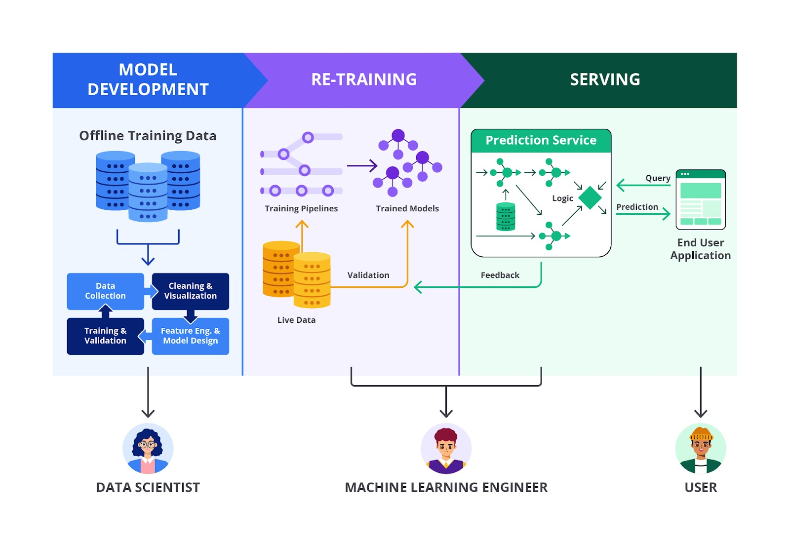
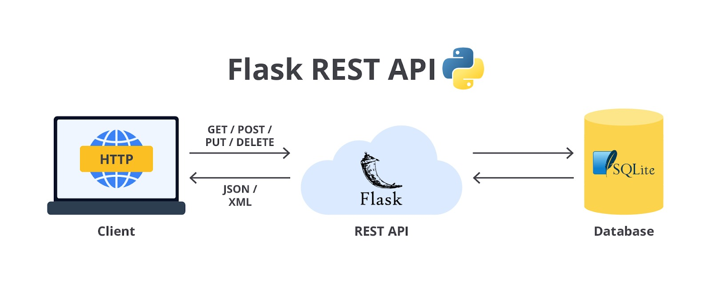
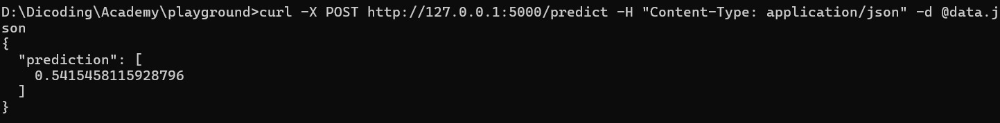

# Deployment dan Monitoring

Setelah model machine learning dilatih, diuji, dan dioptimalkan, langkah berikutnya adalah deployment (penerapan) dan monitoring (pemantauan) dari model tersebut. Hal ini menjadi penting dikarenakan tahapan ini satu-satunya cara agar model yang Anda bangun sebelumnya dapat dikonsumsi oleh masyarakat umum.



Deployment adalah proses pelatihan model dengan mengintegrasikannya ke dalam aplikasi atau sistem produksi, sehingga dapat digunakan oleh pengguna akhir (end user). Monitoring adalah proses untuk memastikan bahwa model bekerja dengan baik setelah deployment dan untuk mengidentifikasi jika ada degradasi kinerja atau masalah lain.

Pada latihan sebelumnya, kita memiliki sebuah model regresi yang disimpan menjadi dua ekstensi yang berbeda yaitu joblib dan pickle. Langkah pertama untuk melakukan deployment adalah memuat model yang sudah kita bangun.

```bash
# Memuat model dari file joblib
joblib_model = joblib.load('gbr_model.joblib')

# Memuat model dari file pickle
with open('gbr_model.pkl', 'rb') as file:
    pickle_model = pickle.load(file)
```

Setelah model dimuat, langkah berikutnya adalah mengintegrasikan model tersebut ke dalam aplikasi produksi. Ini bisa dilakukan dalam berbagai konteks, seperti web application, API, atau edge devices.

- Web Application: Anda dapat menggunakan framework seperti Flask atau Django untuk membuat API yang mengizinkan aplikasi web atau mobile untuk mengirim data ke model dan mendapatkan prediksi.
- Batch Processing: Model dapat digunakan untuk memproses data secara batch. Misalnya, dalam data pipeline yang berjalan secara terjadwal.
- Edge Deployment: Untuk model yang digunakan pada perangkat IoT atau perangkat edge lainnya, model bisa di-deploy langsung ke perangkat tersebut.

Pada contoh kasus modul ini, Anda akan berlatih untuk membuat sebuah API menggunakan Flask sehingga bisa digunakan oleh user melalui API.



Hal pertama yang perlu Anda lakukan pada tahap ini adalah menginstal Flask dan Joblib. Sebagai catatan, pastikan Anda menggunakan versi Joblib dan Python yang sama ketika menyimpan model machine learning sebelumnya. Hal ini bertujuan untuk menghindari konflik dependencies yang sering terjadi pada Python.

Setelah semuanya sudah siap, sekarang Anda perlu membangun sebuah kode yang dapat menjadi jembatan antara model machine learning dan pengguna. Buatlah sebuah file Python dengan nama testing_deploy.py dan masukkan kode berikut.

```bash
from flask import Flask, request, jsonify
import joblib

# Inisialisasi aplikasi Flask
app = Flask(__name__)

# Memuat model yang telah disimpan
joblib_model = joblib.load('gbr_model.joblib') # Pastikan path file sesuai dengan penyimpanan Anda

@app.route('/predict', methods=['POST'])
def predict():
    data = request.json['data']  # Mengambil data dari request JSON
    prediction = joblib_model.predict(data)  # Melakukan prediksi (harus dalam bentuk 2D array)
    return jsonify({'prediction': prediction.tolist()})

if __name__ == '__main__':
    app.run(debug=True)
```

Dengan kode di atas, model Anda bisa digunakan untuk melayani permintaan prediksi melalui API HTTP POST. Seperti yang Anda ketahui, jumlah fitur/variabel pada model machine learning ini sangatlah banyak. Untuk mempermudah proses input data mari kita buat sebuah file json yang menampung seluruh variabel/fitur untuk memprediksi rumah dengan nama data.json.

```bash
{
    "data": [[ 2.58814198e-02, -9.17637181e-01,  7.98581973e-01,
    4.65818252e-03, -1.90862680e-01, -5.23676539e-01,
    5.44502437e-01,  3.98055532e-01, -7.01765886e-01,
    1.84842886e+00,  0.00000000e+00, -7.99528238e-01,
    1.40061034e+00,  1.30453595e+00, -7.43485947e-01,
    0.00000000e+00,  1.75076143e-01,  1.15778146e+00,
    0.00000000e+00,  7.87362373e-01, -7.89877652e-01,
    2.94736730e-01,  0.00000000e+00, -2.35844028e-01,
   -9.44263321e-01,  4.99353260e-01,  2.73711363e-01,
    5.33168369e-01,  7.90365547e-01, -3.15583095e-01,
    0.00000000e+00,  0.00000000e+00,  0.00000000e+00,
    0.00000000e+00,  0.00000000e+00,  2.51894504e-01,
   -1.35256152e+00,  2.00000000e+00,  1.00000000e+00,
    0.00000000e+00,  3.00000000e+00,  0.00000000e+00,
    4.00000000e+00,  0.00000000e+00,  3.00000000e+00,
    2.00000000e+00,  0.00000000e+00,  0.00000000e+00,
    2.00000000e+00,  0.00000000e+00,  0.00000000e+00,
    7.00000000e+00,  9.00000000e+00,  1.00000000e+00,
    3.00000000e+00,  1.00000000e+00,  2.00000000e+00,
    2.00000000e+00,  2.00000000e+00,  1.00000000e+00,
    2.00000000e+00,  0.00000000e+00,  0.00000000e+00,
    0.00000000e+00,  1.00000000e+00,  2.00000000e+00,
    2.00000000e+00,  4.00000000e+00,  2.00000000e+00,
    0.00000000e+00,  1.00000000e+00,  2.00000000e+00,
    3.00000000e+00,  2.00000000e+00,  8.00000000e+00,
    3.00000000e+00]]
  }
```

Tahapan terakhir untuk memastikan API Anda berjalan sedemikian rupa adalah melakukan pemeriksaan. Mari kita lakukan salah satu percobaan menggunakan curl tanpa menggunakan postman. Yang perlu Anda lakukan adalah membuka terminal dan memasukkan command berikut.

```bash
curl -X POST http://127.0.0.1:5000/predict -H "Content-Type: application/json" -d @data.json
```

Pastikan path atau direktori yang Anda buka pada terminal sudah sesuai dengan penyimpanan data.json, ya. Jika sudah output dari model machine learning tersebut kurang lebih akan seperti ini.



Setelah model di-deploy ke dalam produksi, monitoring menjadi sangat penting untuk memastikan bahwa model terus bekerja dengan baik dan tetap relevan seiring waktu. Walaupun pada tahapan ini kita masih melakukan deployment di local, materi tentang monitoring ini masih sangat relevan. Karena Anda akan mempelajari Machine Learning Operations di kelas-kelas berikutnya. Sampai pada kelas tersebut, silakan reviu kembali kelas ini sebagai bekal utama, ya.

Mungkin muncul sebuah pertanyaan, “Mengapa monitoring penting?” Model machine learning dapat mengalami penurunan kinerja dari waktu ke waktu karena perubahan dalam data yang masuk (concept drift) atau perubahan dalam distribusi data (data drift). Selain itu, monitoring membantu mendeteksi anomali atau bug yang mungkin muncul saat model digunakan di dunia nyata. Dan yang paling penting monitoring juga berperan untuk memastikan bahwa model mematuhi regulasi atau kebijakan internal terkait privasi, keamanan, atau fairness.

Biasanya model machine learning memiliki metrik dan alat untuk membantu monitoring. Berikut adalah metrik dan alat yang bisa digunakan ketika Anda memonitoring model machine learning di lingkungan produksi.

Metrik yang Dimonitor:

- Accuracy, Precision, Recall, F1-Score: digunakan untuk memantau kinerja model klasifikasi.
- Mean Squared Error (MSE), R-squared: digunakan untuk model regresi.
- Data Drift Metrics: memantau perubahan distribusi data input dibandingkan dengan data yang digunakan saat pelatihan.
- Model Latency: mengukur waktu yang diperlukan model untuk memberikan prediksi. Hal ini penting untuk aplikasi real-time.

Alat Monitoring:

- Prometheus/Grafana: digunakan untuk memantau metrik dan membuat dashboard custom.- ELK Stack (Elasticsearch, Logstash, Kibana): digunakan untuk monitoring log dan menganalisis anomali.
- Sentry: digunakan untuk mendeteksi dan melaporkan error di aplikasi yang mengintegrasikan model.
- MLflow: alat khusus untuk tracking eksperimen dan monitoring model machine learning.

Sampai di sini Anda dapat memastikan bahwa model machine learning yang dibuat tidak hanya berguna pada saat dilatih, tetapi juga terus memberikan nilai saat digunakan di dunia nyata.

Sebagai penutup, Anda telah mencapai akhir babak dari materi ini yaitu Deployment dan Monitoring. Dengan pemahaman ini, Anda mampu memastikan model yang dibangun tidak hanya bekerja di lingkungan pengembangan, tetapi juga mampu bertahan dan beradaptasi dalam skenario dunia nyata.

Namun, perjalanan Anda belum selesai di sini. Di modul berikutnya, kita akan membahas lebih dalam tentang berbagai macam machine learning yang ada. Mulai dari supervised learning, unsupervised learning, hingga optimasi machine learning yang memiliki keunikan dan objektif masing-masing. Penasaran bagaimana algoritma-algoritma ini bekerja dan kapan waktu terbaik untuk menggunakannya? Jangan lewatkan pembahasan berikutnya yang akan membuka lebih banyak wawasan dan kemungkinan di dunia machine learning. Sampai jumpa!
