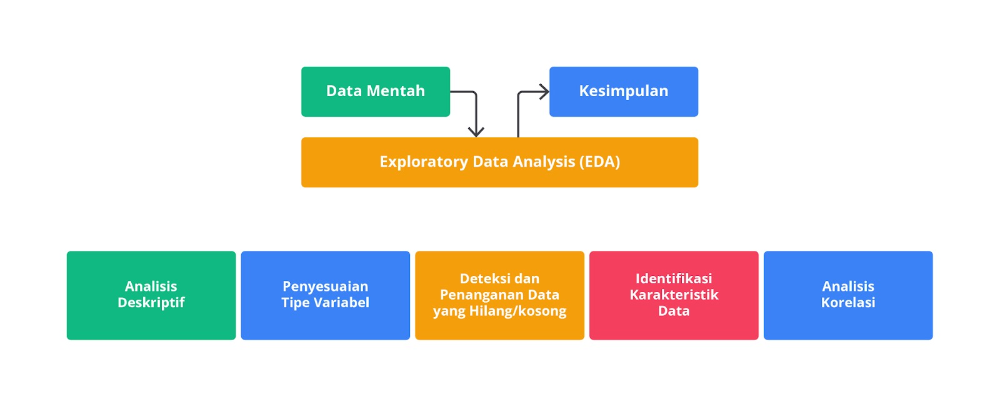
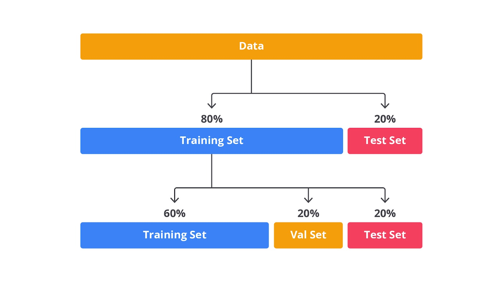
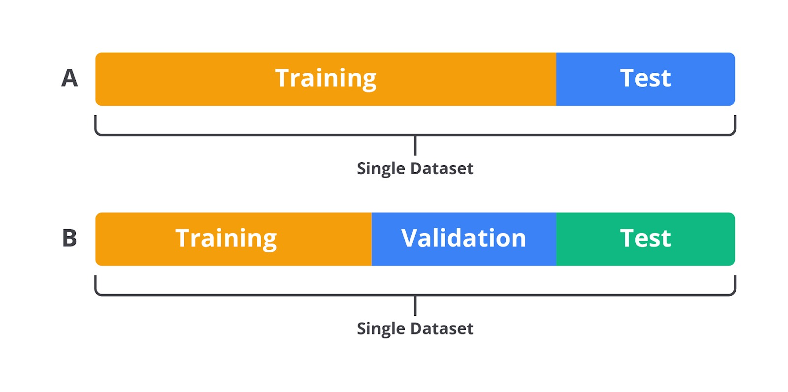
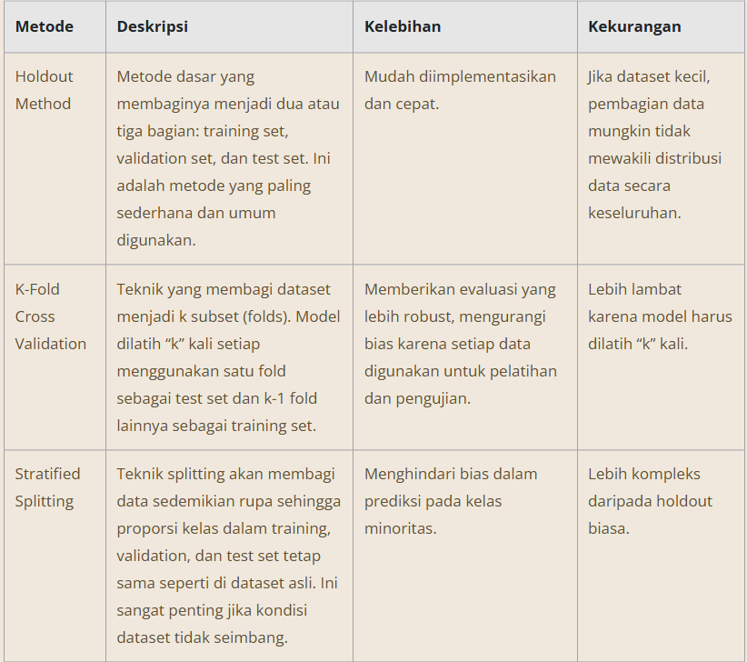
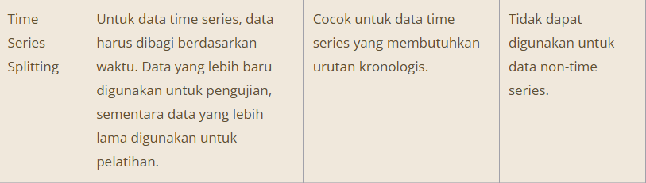

# Exploratory dan Explanatory Data Analysis

Halo, calon praktisi data masa depan!

Setelah Anda melewati tahapan yang cukup menantang pada materi sebelumnya, sekarang kita sudah sampai di pertengahan materi kelas yang tak kalah serunya. Sejauh ini, kita sudah mempelajari berbagai konsep dasar dalam machine learning workflow beserta teknik yang sering digunakan dalam proses pembangunan machine learning.

Nah, sekarang kita akan lanjut ke tahap berikutnya yang tidak kalah penting, yaitu Exploratory Data Analysis (EDA). EDA merupakan tahap eksplorasi data yang telah dibersihkan guna memperoleh insight dan menjawab pertanyaan analisis. Pada prosesnya, kita akan sering menggunakan berbagai teknik dan parameter dalam descriptive statistics yang bertujuan untuk menemukan pola, hubungan, serta membangun intuisi terkait data yang diolah. Selain itu, tidak jarang kita juga menggunakan visualisasi data untuk menemukan pola dan memvalidasi parameter descriptive statistics yang diperoleh.

## Tujuan

Exploratory Data Analysis (EDA):

Tujuan utama dari EDA adalah untuk memahami struktur, karakteristik, dan pola dalam data. Pada tahap ini, Anda memiliki misi untuk menemukan insight atau informasi yang tersembunyi dalam data, mengidentifikasi anomali, serta memahami hubungan antar variabel.

EDA bersifat eksploratif dan terbuka sehingga Anda tidak memiliki hipotesis yang pasti di awal prosesnya. Sebaliknya, Anda dapat menggunakan EDA untuk membangun hipotesis atau memahami lebih dalam data yang mereka miliki.

Explanatory Data Analysis (ExDA):

ExDA di sisi lain memiliki tujuan utama untuk mengomunikasikan temuan atau insight yang sudah didapatkan kepada audiens yang lebih luas, seperti stakeholder, tim eksekutif, atau klien.

Pada tahap ini, analisis data berfokus pada penyampaian informasi yang jelas, ringkas, dan meyakinkan, dengan dukungan visualisasi yang efektif dan narasi yang kuat.

## Pendekatan dan Metodologi

Exploratory Data Analysis (EDA):

EDA sering menggunakan berbagai teknik statistik deskriptif seperti mean, median, standar deviasi, dan distribusi frekuensi, serta visualisasi data seperti histogram, scatter plot, box plot, dan heatmap untuk mengeksplorasi data.
Metodologi dalam EDA bersifat iteratif dan fleksibel. Seorang analis dapat mencoba berbagai pendekatan, mengubah parameter, atau menggunakan berbagai visualisasi hingga mendapatkan insight yang mendalam.
EDA juga sering kali melibatkan proses pembersihan data sehingga data yang hilang, outlier, atau inkonsistensi diidentifikasi dan diperbaiki.
Explanatory Data Analysis (ExDA):

ExDA menggunakan visualisasi dan narasi yang sangat fokus dan terarah sehingga setiap elemen dalam presentasi atau laporan ditujukan untuk mendukung argumen atau kesimpulan yang ingin disampaikan.
Metodologi ExDA adalah terstruktur dan sistematis, biasanya dimulai dari pernyataan masalah atau hipotesis, kemudian mendukungnya dengan data yang telah dieksplorasi dan dianalisis, dan diakhiri dengan kesimpulan yang jelas.
ExDA juga sering menggunakan storytelling sebagai alat untuk menyampaikan temuan, memastikan bahwa audiens dapat memahami dan terhubung dengan informasi yang disampaikan.

## Visualisasi Data

Exploratory Data Analysis (EDA):

Visualisasi dalam EDA bersifat eksploratif dan sering digunakan untuk membantu analis memahami data. Visualisasi dapat berupa berbagai jenis grafik yang menunjukkan hubungan antar variabel, distribusi data, atau pola yang tidak terduga.
Karena sifatnya yang eksploratif, visualisasi dalam EDA tidak selalu rapi atau terstruktur, melainkan lebih banyak digunakan untuk mendukung pemahaman dan penggalian insight.
Explanatory Data Analysis (ExDA):

Visualisasi dalam ExDA dirancang untuk menghasilkan komunikasi yang efektif. Grafik dan visual yang digunakan dalam ExDA harus jelas, sederhana, dan langsung ke poin utama yang ingin disampaikan.
Contoh visualisasi yang sering digunakan dalam ExDA termasuk bar chart, line chart, atau pie chart yang sederhana, tetapi efektif, serta infografis yang dapat menyampaikan informasi dengan cara yang menarik dan mudah dipahami.

## Audiens

Exploratory Data Analysis (EDA):

Pengguna utama dari EDA adalah analis data, data scientist, atau researcher yang bekerja langsung dengan data untuk memahami dan mengembangkan hipotesis.
EDA adalah proses internal, sering kali dilakukan oleh individu atau tim yang bertanggung jawab atas pengolahan dan analisis data.
Explanatory Data Analysis (ExDA):

Audiens ExDA biasanya adalah stakeholder, pengambil keputusan, manajer, atau klien yang memerlukan informasi untuk membuat keputusan bisnis atau memahami hasil dari analisis yang dilakukan.
ExDA adalah proses eksternal yang fokus pada komunikasi dan presentasi hasil analisis kepada pihak yang mungkin tidak memiliki latar belakang teknis yang mendalam.

## Contoh Kasus

Exploratory Data Analysis (EDA):

Misalnya, dalam sebuah proyek penelitian yang bertujuan untuk menemukan faktor-faktor yang memengaruhi penjualan produk, EDA akan digunakan untuk memahami bagaimana variabel-variabel seperti harga, lokasi, waktu promosi, dan lainnya berhubungan dengan penjualan. Pada tahap ini, analis bisa menemukan pola-pola tak terduga atau anomali dalam data.

Explanatory Data Analysis (ExDA):

Setelah temuan signifikan diperoleh dari EDA, ExDA akan digunakan untuk menyusun laporan yang menjelaskan faktor-faktor yang memengaruhi penjualan kepada manajemen, dengan menggunakan grafik sederhana, tabel, dan narasi yang jelas sehingga manajemen dapat membuat keputusan yang tepat berdasarkan hasil analisis.

## Output

Exploratory Data Analysis (EDA):

Hasil dari EDA biasanya adalah insight, hipotesis baru, pemahaman yang lebih dalam tentang data, dan beberapa rekomendasi awal untuk analisis lebih lanjut.

Explanatory Data Analysis (ExDA):

Output dari ExDA adalah laporan akhir, presentasi, atau dashboard yang berfungsi untuk menyampaikan hasil analisis dengan cara yang informatif dan mudah dipahami oleh audiens non-teknis.

# Data Splitting

Data Splitting adalah proses membagi dataset menjadi beberapa subset yang terpisah untuk tujuan pelatihan, validasi, dan pengujian model machine learning. Proses ini merupakan langkah penting dalam pipeline machine learning karena membantu memastikan model yang dikembangkan mampu membuat prediksi yang baik tidak hanya pada data pelatihan, tetapi juga pada data baru yang belum pernah dilihat sebelumnya.

Lalu, mengapa data splitting itu penting? Walaupun terlihat sederhana, data splitting setidaknya memiliki peran untuk menghindari overfitting, menyediakan evaluasi yang akurat, dan memberikan validasi yang adil. Selain dari ketiga peran tersebut sebenarnya masih banyak hal yang membuat data splitting itu penting, tetapi pada kesempatan kali ini mari kita jabarkan terlebih dahulu ketiga peran tersebut sebagai dasar pengetahuan.

- Menghindari Overfitting:
  Tanpa data splitting, model machine learning mungkin belajar terlalu banyak dari data pelatihan, termasuk noise dan outliers, sehingga kinerjanya menurun pada data baru. Data splitting membantu menguji generalisasi model pada data yang belum pernah dilihat oleh model pada proses pelatihan.

- Menyediakan Evaluasi yang Akurat:
  Dengan memisahkan data untuk pelatihan, validasi, dan pengujian kita bisa mengevaluasi kinerja model secara lebih akurat. Proses ini dapat membantu dalam memilih model terbaik dan mengatur hyperparameter dengan lebih baik.

- Validasi yang Adil:
  Data splitting memungkinkan kita untuk melakukan validasi model secara adil dengan menggunakan bagian dari data yang tidak dilibatkan dalam proses pelatihan untuk mengukur kinerja model.

Lantas apa saja bagian yang perlu kita tentukan ketika melakukan splitting? Setelah melakukan splitting Anda akan memiliki beberapa set data yang berisikan kolom yang sama. Sebetulnya proses splitting ini terbagi menjadi dua kubu yang sama besar yaitu kubu dua jenis (training dan testing) dan kubu tiga jenis (training, testing dan validation). Namun, Anda tidak perlu bingung karena sejatinya kedua kubu tersebut sama dan memiliki tujuan yang serupa.

- Training Set

Deskripsi: subset data yang digunakan untuk melatih model. Model belajar pola dari data ini dan menyesuaikan parameternya.
Persentase Umum: biasanya 60-80% dari total dataset.

- Validation Set

Deskripsi: subset data yang digunakan untuk melakukan validasi selama proses pelatihan. Ini digunakan untuk tuning hyperparameter dan memilih model terbaik. Model tidak melihat data ini selama pelatihan.
Persentase Umum: biasanya 10-20% dari total dataset.

- Test Set

Deskripsi: subset data yang digunakan untuk melakukan pengujian akhir setelah model selesai dilatih dan di-tuning. Ini memberikan estimasi kinerja model pada data baru.
Persentase Umum: biasanya 10-20% dari total dataset.

Rasio yang paling umum digunakan untuk data splitting adalah 70:30 atau 80:20, di mana 70-80% data digunakan untuk pelatihan (training) dan 20-30% sisanya digunakan untuk pengujian (testing). Alternatif lain yang sering digunakan adalah 60:20:20, di mana 60% data digunakan untuk pelatihan, 20% untuk validasi, dan 20% untuk pengujian.

Anda perlu mempertimbangkan beberapa hal seperti berikut untuk menghasilkan pembagian yang optimal.

- Imbalance Data: jika dataset memiliki distribusi kelas yang tidak seimbang, teknik seperti stratified splitting sangat penting untuk memastikan bahwa model tidak bias terhadap kelas mayoritas.
- Data Leakage: data leakage terjadi ketika informasi dari luar set pelatihan "bocor" ke dalam proses pelatihan sehingga kinerja model di test set tampak lebih baik daripada yang sebenarnya. Splitting yang benar membantu menghindari masalah ini.
- Randomness: randomness dalam proses splitting penting untuk memastikan bahwa pembagian data tidak bias. Namun, untuk eksperimen yang dapat direproduksi, sangat penting untuk menetapkan random_state yang tetap.

## Perdebatan Mana yang Lebih Dahulu?

Ada beberapa jenis preprocessing yang sebaiknya dilakukan sebelum data splitting, terutama jika preprocessing tersebut memerlukan pengetahuan tentang keseluruhan dataset seperti berikut.

- Imputasi Missing Values: jika Anda memiliki missing values dalam dataset, biasanya Anda perlu mengisi nilai-nilai tersebut (misalnya, dengan rata-rata atau median) sebelum melakukan splitting. Ini karena Anda perlu mengisi missing value berdasarkan keseluruhan distribusi data, bukan hanya pada subset data tertentu.
- Encoding Kategorikal: jika Anda melakukan encoding pada variabel kategorikal (misalnya, one-hot encoding atau label encoding), sering kali lebih baik melakukannya sebelum splitting untuk memastikan bahwa encoding konsisten di seluruh dataset.
- Pembersihan Data Umum: pembersihan data yang melibatkan penghapusan outliers, menangani duplikasi, atau menyamakan format data juga sebaiknya dilakukan sebelum splitting. Ini memastikan bahwa data yang masuk ke proses splitting sudah dalam kondisi terbaiknya.

Namun, ada jenis preprocessing lain yang sebaiknya dilakukan setelah data splitting untuk menghindari data leakage (yaitu, informasi dari test set bocor ke dalam model pelatihan) seperti berikut.

- Standardisasi/Normalisasi: proses seperti standardisasi (mengubah data agar memiliki mean 0 dan standar deviasi 1) atau normalisasi (mengubah data agar berada dalam rentang tertentu) sebaiknya dilakukan setelah splitting. Ini karena Anda ingin memastikan bahwa test set benar-benar terpisah dari data pelatihan, dan standardisasi atau normalisasi dilakukan hanya berdasarkan data pelatihan.
- Feature Engineering: teknik seperti pembuatan fitur baru atau transformasi fitur (misalnya, log transform, polynomial features) sebaiknya dilakukan setelah data splitting untuk menghindari informasi dari test set yang memengaruhi model.
- Scaling dan PCA: teknik seperti scaling atau Principal Component Analysis (PCA) yang mengubah skala atau struktur data juga sebaiknya dilakukan setelah data splitting.
