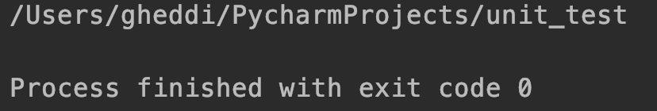

# PIP

pip --version

pip install <nama-package>
pip uninstall <nama-package>

pip install pipenv

# Conda

Kunjungi laman berikut: https://www.anaconda.com/download.
conda -V
https://conda.io/projects/conda/en/latest/user-guide/tasks/manage-environments.html.

# Library Text Processing

## String

String adalah salah satu modul bawaan Python yang tidak perlu dideklarasikan. Pada modul string ada fungsi-fungsi yang dapat dioperasikan pada variabel bertipe string seperti di bawah.
upper(): Ubah setiap huruf dalam string menjadi huruf kapital.
lower(): Ubah setiap huruf dalam string menjadi huruf kecil.
split(): Pisahkan teks berdasarkan delimiter (karakter pemisah).
title(): Jadikan setiap awal kata kapital.
zfill(): Tambahkan nol di awal string sebanyak nilai yang ada pada parameter

## 

## Regex

Regex atau regular expression adalah sebuah cara untuk mencari teks berdasarkan pola tertentu. Umpamanya, ketika ingin mencari sebuah kata dalam kamus, misalnya arti dari kata parsing, kita akan mencari kata tersebut di halaman yang memiliki kata dengan awalan p, lalu pa. Regex bekerja dengan konsep yang sama.

Pada regex, kita mencari sebuah kata atau kumpulan kata dengan memberikan pola yang diinginkan. Contoh umum regex adalah pada email. Kita dapat menggunakan regex untuk mengecek bahwa karakter @ ada pada email atau tidak.

Contoh di bawah menunjukkan penggunaan regex. Pada variabel pattern di bawah, ^a berarti kita ingin mencari teks dengan awalan 'a', dan s$ berarti kita ingin mencari string berakhiran 's'.

cara :

```bash
import re     # Import modul regex

pola= '^a...s$'
string_tes= 'abyss'
hasil= re.match(pola, string_tes)

if hasil:
    print("Pencarian berhasil.")
else:
    print("Pencarian gagal.")

"""
Output:
Pencarian berhasil.
"""
```

Perlu diperhatikan bahwa beberapa modul perlu diimpor terlebih dahulu untuk bisa digunakan. Pada contoh di atas, kita melakukan “import re” untuk mengimpor modul regex pada Python.

# Library Matematika

Selanjutnya adalah library math yang termasuk salah satu modul bawaan Python dan menyediakan berbagai fungsi dan konstanta matematika. Anda hanya perlu melakukan impor untuk modul math. Berikut contoh penerapannya.

## https://docs.python.org/3/library/math.html

```bash
import math

print(math.sqrt(25))
print(math.pi)

"""
Output:
5.0
3.141592653589793
"""
```

Pada contoh di atas, hal pertama yang dilakukan adalah melakukan impor modul math untuk menyediakan berbagai fungsi dan konstanta matematika. Di bawahnya, kita mencoba melakukan operasi akar dari bilangan 25 yang hasilnya adalah 5. Kemudian, kita mencoba mendapatkan nilai pi dalam modul math yang bernilai “3.141592653589793”.

# Library Parse

Library parser pada Python menyediakan fasilitas untuk menguraikan kode Python menjadi struktur data yang dapat diproses dan dianalisis. Anda dapat menggunakan Getopt https://docs.python.org/3.8/library/getopt.html atau ArgParse https://docs.python.org/3.8/library/argparse.html.

Argument parser bermanfaat jika kita ingin membuat program atau skrip kecil yang langsung menerima parameter pada saat pemanggilan program. Hal ini biasa digunakan dalam pemanggilan aplikasi atau skrip di CLI/terminal \*nix-based, misalnya Linux dan MacOS. Contoh perintah dimaksud adalah berikut.

```bash
python panggildicoding.py -o
```

Contoh tindakan menambahkan Argument yang bersifat opsional/tidak wajib dengan menggunakan ArgParse adalah berikut.

```bash
import argparse

parser = argparse.ArgumentParser()
parser.add_argument('-o', '--output', action='store_true', help="tampilkan output")
args = parser.parse_args()

if args.output:
   print("Halo, ini merupakan sebuah output dari panggildicoding.py")
```

Jadi, pada saat dijalankan, ada beberapa hal yang perlu diperhatikan, yaitu berikut.

Berkas panggildicoding.py dapat menerima parameter -o atau --output.
Jika kita memanggil berkas tanpa parameter -o, berkas tidak akan menampilkan apa pun.
Jika kita memanggil dengan -o atau --output, berkas akan menampilkan Halo, ini merupakan sebuah output dari panggildicoding.py.
Jika kita memanggil --help, tampil help dengan penjelasan "tampilkan output".

# Library Pengolahan Data

Library pengolahan data bertujuan untuk membantu dalam manipulasi, analisis, dan pemrosesan data. Library ini menyediakan berbagai fungsi dan metode yang memudahkan pengguna untuk melakukan operasi pengolahan data dengan lebih efisien dan cepat.

Tujuan dari library ini untuk menyederhanakan tugas-tugas kompleks yang berkaitan dengan pengolahan data sehingga Anda tidak perlu mengimplementasikan semuanya dari awal. Berikut adalah beberapa library populer yang digunakan untuk pengolahan data.

## Pandas

Pandas https://pandas.pydata.org/ adalah library populer yang digunakan untuk pengelolaan dan analisis data. Library ini menyediakan struktur data dan alat untuk membantu pengguna dalam melakukan manipulasi, pembersihan, transformasi, dan analisis data dengan mudah dan efisien.

Meskipun pandas sudah terinstal secara otomatis pada beberapa IDE dan versi Python, perlu diingat bahwa pandas bukan merupakan library bawaan Python. Oleh karena itu, Anda harus menginstal library ini terlebih dahulu sebelum dapat menggunakannya. Silakan buka command prompt dan jalankan kode berikut.

```bash
pip install pandas
```


Pada contoh di atas, kita membuat DataFrame dari dictionary dan menampilkannya ke layar. DataFrame merupakan struktur data utama dalam pandas yang mirip seperti tabel atau spreadsheet. DataFrame merupakan struktur dua dimensi yang menyimpan data dalam bentuk baris dan kolom.

## Numpy

Library NumPy https://numpy.org/ adalah package fundamental yang sering digunakan untuk scientific computing pada Python. Library ini menyediakan objek array multidimensi, berbagai jenis objek lainnya, seperti masked array dan matrix, dan sebagainya.

NumPy termasuk library eksternal, meskipun NumPy juga sudah terinstal secara otomatis pada beberapa IDE dan versi Python, perlu diingat bahwa NumPy bukan termasuk library bawaan Python. Oleh karena itu, Anda harus menginstal library ini terlebih dahulu sebelum dapat menggunakannya.

Silakan buka command prompt dan jalankan kode berikut.

```bash
pip install numpy
```

Berikut adalah contoh penggunaan NumPy.

```bash
import numpy

matriks = numpy.array([[1, 2, 3], [4, 5, 6], [7, 8 ,9]])
print(matriks)

"""
Output:
[[1 2 3]
 [4 5 6]
 [7 8 9]]
"""
```

Pada kode di atas, kita mengimpor library "numpy" terlebih dahulu untuk mengambil fungsi-fungsi atau kode yang berada pada library tersebut. Selanjutnya, mengubah nested list menjadi array dengan menggunakan fungsi “.array()”.

## Matplotlib

Selanjutnya adalah matplotlib https://matplotlib.org/ yang merupakan library untuk melakukan visualisasi data. Matplotlib termasuk jenis library eksternal sehingga Anda perlu melakukan instalasi matplotlib terlebih dahulu. Silakan jalankan kode berikut.

```bash
python -m pip install -U matplotlib
```

Berikut adalah contoh penerapan matplotlib.

```bash
import matplotlib.pyplot as plt

# Data
x = [1, 2, 3, 4, 5]
y = [2, 4, 6, 8, 10]

# Membuat plot garis
plt.plot(x, y)

# Menambahkan judul dan label sumbu
plt.title("Contoh Plot Garis")
plt.xlabel("Sumbu X")
plt.ylabel("Sumbu Y")

# Menampilkan plot
plt.show()
```

Pada kode di atas, kita akan membuat visualisasi berdasarkan data dari variabel x dan y. Hal pertama yang dilakukan adalah mengimpor library dengan menggunakan sintaks “import matplotlib.pyplot as plt".

Selanjutnya, ini adalah contoh sehingga kita perlu membuat variabel sebagai data yang akan digunakan. Di sini kita membuat variabel x dan y sebagai data yang akan divisualisasi.

Untuk membuat visualisasinya, kita menggunakan sintaks “plt.plot(x, y)” dengan argumennya adalah variabel x dan y. Lalu, kita menambahkan informasi tambahan seperti title, xlabel, dan ylabel. Terakhir, kita menampilkan visualisasi tersebut dengan sintaks “plt.show()”.

Berikut adalah output ketika kode di atas dijalankan.


## Seaborn

Terakhir adalah library seaborn https://seaborn.pydata.org/ yang termasuk jenis library dengan tujuan untuk visualisasi data sama seperti matplotlib. Bahkan library seaborn dibangun berdasarkan pada library matplotlib.

Seaborn termasuk library eksternal sehingga Anda perlu menginstalnya terlebih dahulu. Silakan jalankan kode berikut untuk menginstalnya menggunakan pip.

```bash
pip install seaborn
```

Berikut adalah contoh penerapan seaborn.

```bash
import seaborn as sns
import matplotlib.pyplot as plt

# Contoh data
tips = sns.load_dataset('tips')  # Memuat dataset tips dari Seaborn

# Contoh plot histogram
sns.histplot(tips['total_bill'], kde=True)
plt.title('Histogram Total Bill')
plt.xlabel('Total Bill')
plt.ylabel('Frequency')
plt.show()
```

Pada contoh di atas, kita menggunakan seaborn untuk melakukan visualisasi berdasarkan dataset tips. Dataset ini adalah bawaan dari library seaborn yang dapat Anda gunakan.

Hal pertama yang dilakukan adalah mengimpor modul seaborn. Selanjutnya, kita load dataset dan menyimpannya pada variabel tips.

Untuk membuat plot yang baik, di sini kita menggabungkan seaborn dan juga matplotlib. Library matplotlib digunakan untuk membuat title, xlabel, ylabel, dan menampilkannya ke layar.

Untuk membuat plot histogram pada seaborn, Anda dapat menggunakan sintaks “sns.histplot()” dengan sns adalah library seaborn dan histplot merupakan fungsinya. Jangan lupa untuk mengisikan value dalam fungsi tersebut. Pada contoh di atas kita menggunakan kolom total_bill yang ada dalam dataset tips.

Berikut adalah tampilannya ketika kode tersebut dijalankan.


# Library File Management

Library file management adalah kumpulan library yang dirancang untuk membantu pengguna dalam mengelola dan berinteraksi dengan berkas dan direktori pada sistem file. Beberapa library file management adalah berikut.

## OS

Modul OS https://docs.python.org/3/library/os.html pada Python berguna untuk fungsi-fungsi yang berkaitan dengan sistem operasi, misalnya open(), path(), getcwd(), dan fungsi lainnya. Modul ini memungkinkan Anda untuk memanfaatkan fungsi yang sama dan mengeksekusi fungsi terkait OS yang mungkin berbeda dalam setiap sistem operasi. Ada beberapa fitur yang hanya bekerja pada sistem operasi tertentu.

Contoh kode di bawah menunjukkan fungsi os.getcwd(). Fungsi ini akan mengembalikan string representasi dari Current Working Directory, yaitu direktori tempat program Python kita berada. Fungsi ini berlaku pada semua OS.

```bash
import os
print(os.getcwd())
```



## JSON

Untuk serialization dengan bahasa lain, umumnya kita menggunakan JSON(JavaScript Object Notation) yang memiliki beberapa perbedaan karakteristik dengan pickle, yakni berikut.

- JSON adalah format text-serialization dan umumnya menggunakan Unicode atau UTF-8. Sementara pickle bersifat binary serialization.
- JSON dapat dibaca dengan mudah oleh manusia, sementara pickle tidak.
- JSON dapat dioperasikan dan digunakan di luar ekosistem Python. Pickle adalah Python-specific.
- JSON secara default hanya dapat merepresentasikan subset dari built-in type pada Python.
- Pickle dapat merepresentasikan hampir (jika tidak seluruh) tipe Python dan secara default melakukan kompresi data.

Sebagaimana yang telah disebutkan sebelumnya, JSON adalah format text yang ditujukan untuk serialization. Agar data dapat dengan mudah ditransmisikan antar berbagai sumber tanpa khawatir bentuknya kacau, menggunakan JSON adalah salah satu pilihan yang tepat.

JSON memiliki format yang hampir mirip dengan dictionary, yakni data disimpan dengan format key dan value pair. Namun, tentunya JSON jauh lebih kompleks dari dictionary. Dapat dilihat dari contoh JSON untuk data pembelian di bawah.

Dengan JSON kita dapat menyimpan data dengan lebih teratur. Sebuah key seperti children di bawah dapat memiliki sebuah dictionary baru yang berisi informasi terkait objek children tersebut.


Untuk membuat JSON sederhana, ketik seperti kode di bawah.

```bash
import json

# contoh JSON:
x = '{ "nama":"Buchori", "umur":22, "Kota":"New York"}'

# parse  x:
y = json.loads(x)

print(y["umur"])
```

## Pickle

Jika Anda memiliki sebuah list yang ingin disimpan atau ditransmisikan tanpa khawatir bentuknya akan rusak atau kacau, fungsi dari library pickle dapat dimanfaatkan. Pickle termasuk fungsi Object Serialization pada Python. Pickling adalah istilah untuk mengubah objek menjadi byte stream, sedangkan unpickling adalah perlakuan sebaliknya.

Kode berikut adalah contoh cara melakukan proses pickle pada sebuah object dictionary dan menyimpannya pada sebuah file.

```bash
import pickle
contoh_dictionary = {1:"6", 2:"2", 3:"f"}
pickle_keluar = open("dict.pickle","wb")
pickle.dump(contoh_dictionary, pickle_keluar)
pickle_keluar.close()
```

Kode berikut adalah contoh untuk mengekstraksi berkas pickle dan menaruhnya pada sebuah variabel.

```bash
import pickle
pickle_masuk = open("dict.pickle", "rb")
contohDictionary = pickle.load(pickle_masuk)
pickle_masuk.close()

print(contohDictionary)
```

# Library Web Scraping

Library web scraping adalah jenis library untuk membantu pengguna mengumpulkan data dari halaman web. Proses ini disebut sebagai “web scraping” atau “web crawling”. Anda bisa menggunakan fungsi dan metode pada library ini untuk mengekstraksi informasi dari situs web dan menyimpannya dalam format yang dapat diakses dan digunakan dalam analisis atau aplikasi lainnya.

Beberapa library untuk melakukan web scraping adalah berikut.

## Beautifulsoup

Beautifulsoup adalah library untuk mengambil data dari halaman web dan mengekstrak informasi yang diperlukan. Untuk menggunakan beautifulsoup, Anda harus menginstalnya terlebih dahulu. Silakan jalankan kode pip berikut untuk menginstalnya.

```bash
pip install beautifulsoup4
```

Berikut adalah contoh penulisan kode beautifulsoup.

```bash
from urllib.request import urlopen
from bs4 import BeautifulSoup

# Pengambilan konten
url = "http://python.org/"
page = urlopen(url)
html = page.read().decode("utf-8")

# Membuat objek BeautifulSoup
soup = BeautifulSoup(html, "html.parser")

# Mencetak judul halaman
print(soup.title)
```

Pada contoh di atas, kita melakukan web scraping untuk mengambil judul dari laman web “http://python.org/”. Hal pertama yang dilakukan adalah mengimpor Beautifulsoup sebagai library yang akan kita gunakan. Selanjutnya kita mengambil konten dari url dengan menggunakan fungsi dari modul “urlopen”. Setelah konten diambil, kita membuat objek BeautifulSoup dan dari objek ini kita bisa memunculkan beberapa konten berdasarkan tag html. Pada contoh di atas, kita mengambil judul halaman dengan menggunakan method “title”.

## Urllib

Urllib adalah library bawaan dari Python yang bertujuan untuk scraping konten dari sebuah website. Penggunaan urllib berbeda dengan beautifulsoup. Bisa dikatakan bahwa cara penggunaan urllib sedikit kompleks dibandingkan beautifulsoup. Kode di bawah adalah contoh untuk memulai proses scraping pada situs dengan domain python.org dan menampilkan isi dari tag title dari situs tersebut.

```bash
from urllib.request import urlopen

# Pengambilan konten
url = "http://python.org/"
page = urlopen(url)
html = page.read().decode("utf-8")

# Mencari indeks awal dan akhir
start_index = html.find("<title>") + len("<title>")
end_index = html.find("</title>")

# Mengekstrak dan mencetak judul halaman
title = html[start_index:end_index]
print(title)
```

Pada kode di atas, kita melakukan scraping terhadap url yang sama seperti contoh sebelumnya. Namun, kali ini kita menggunakan urlopen untuk mengambil title dari laman “http://python/org/”

Hal pertama yang dilakukan adalah mengimpor urlopen dengan menggunakan “from urllib.request import urlopen”. Selanjutnya, kita mengambil konten dari url yang telah ditentukan.

Tahapan ketiga adalah kita mencari indeks awal dan akhir. Tujuan kita adalah mengambil title sehingga indeksnya ditentukan dari tag “<title>” dan “</title>”. Terakhir, kita mengekstrak dan mencetak judul halaman tersebut.

# Library Machine Learning

Selanjutnya adalah library yang digunakan untuk melakukan pemelajaran mesin. Anda dapat menggunakan library berikut untuk membantu Anda menyelesaikan permasalahan machine learning. Berikut adalah beberapa library populer untuk machine learning.

## scikit-learn

Pertama adalah scikit-learn yang menyediakan berbagai algoritma pemelajaran mesin siap pakai untuk membantu dalam pengembangan model pemelajaran mesin, pemrosesan data, dan evaluasi kinerja model.

Scikit-learn termasuk library eksternal sehingga Anda perlu menginstalnya terlebih dahulu untuk bisa menggunakannya. Silakan jalankan kode berikut untuk menginstalnya menggunakan pip.

```bash
pip install -U scikit-learn
```

https://scikit-learn.org/stable/auto_examples/index.html

## TensorFlow

Selanjutnya adalah TensorFlow sebagai salah satu library paling populer terkait machine learning. Dengan menggunakan TensorFlow, Anda bisa mengembangkan machine learning hingga tahap deployment.

Anda bisa menginstal TensorFlow menggunakan perintah pip berikut.

```bash
pip install tensorflow
```

Berikut adalah link dokumentasi yang bisa dijadikan rujukan untuk mempelajari machine learning menggunakan tensorflow https://www.tensorflow.org/tutorials.

## PyTorch

Terakhir ada PyTorch, yakni library machine learning yang dikembangkan oleh Facebook’s AI Research lab (FAIR). PyTorch menyediakan alat dan kerangka kerja yang kuat untuk mengembangkan model pemelajaran mesin, terutama dalam konteks jaringan saraf tiruan (neural networks).

Anda bisa menggunakan kode berikut untuk menginstal PyTorch versi stabil menggunakan pip di Windows dan Mac.

```bash
pip install torch torchvision torchaudio
```

Untuk Linux, Anda bisa menggunakan kode berikut.

```bash
pip3 install torch torchvision torchaudio --index-url https://download.pytorch.org/whl/cpu
```

Anda bisa melihat dokumentasi instalasi lebih dalam pada tautan ini. Selain itu, jika Anda ingin melihat berbagai contoh penerapannya, silakan merujuk pada tautan berikut https://docs.pytorch.org/tutorials/.

# Library Web Development

Terakhir, ada library yang bertujuan untuk pengembangan aplikasi web. Sebagaimana yang sudah dijelaskan dalam materi-materi sebelumnya, Python dapat digunakan untuk pengembangan aplikasi web pada sisi server. Berikut adalah library yang dapat digunakan untuk membantu Anda mengembangkan web.

## Django

Django adalah high-level Python web framework yang mendukung pengembangan secara cepat, bersih, serta pragmatis. Untuk menginstal Django, Anda bisa menggunakan pip berikut.

```bash
py -m pip install Django
```

Anda juga bisa merujuk pada dokumentasi berikut untuk melakukan instalasi https://docs.djangoproject.com/en/4.2/topics/install/ . Untuk melihat penerapannya, Anda bisa merujuk pada dokumentasi berikut https://docs.djangoproject.com/en/4.2/.

## Flask

Flask adalah web framework dalam Python yang ditujukan untuk membangun aplikasi web. Flask dirancang dengan tujuan menjadi ringan, fleksibel, dan sederhana. Dengan Flask, Anda bisa merancang aplikasi web dari yang sederhana hingga kompleks.

Anda bisa menginstal Flask menggunakan kode pip berikut.

```bash
pip install Flask
```

Untuk penerapan Flask, Anda dapat merujuk pada tautan ini https://flask.palletsprojects.com/en/stable/tutorial/.

## Fast API

FastAPI adalah web framework untuk Python yang tujuannya merancang dan membangun API dengan cepat, efisien, dan aman. FastAPI memberikan kinerja yang tinggi, sintaks yang intuitif, serta dukungan otomatisasi dokumentasi yang kuat. Jadi, ia cocok untuk pengembangan mikroservis, layanan web responsif, dan sebagainya.

Anda bisa menginstal FastAPI menggunakan kode pip berikut.

```bash
pip install fastapi
```

Anda bisa merujuk pada tautan berikut untuk melihat berbagai penerapan FastAPI https://fastapi.tiangolo.com/tutorial/.
