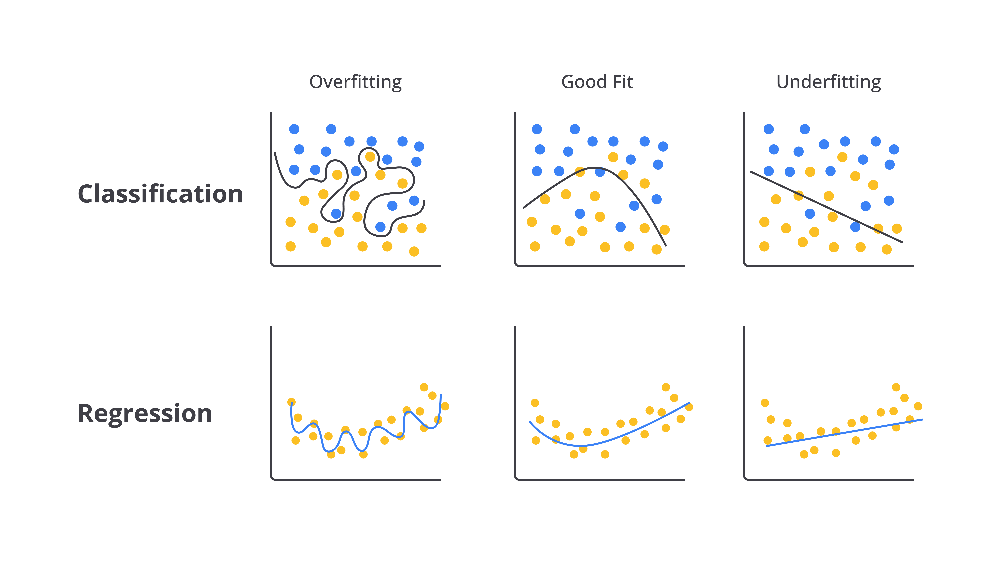
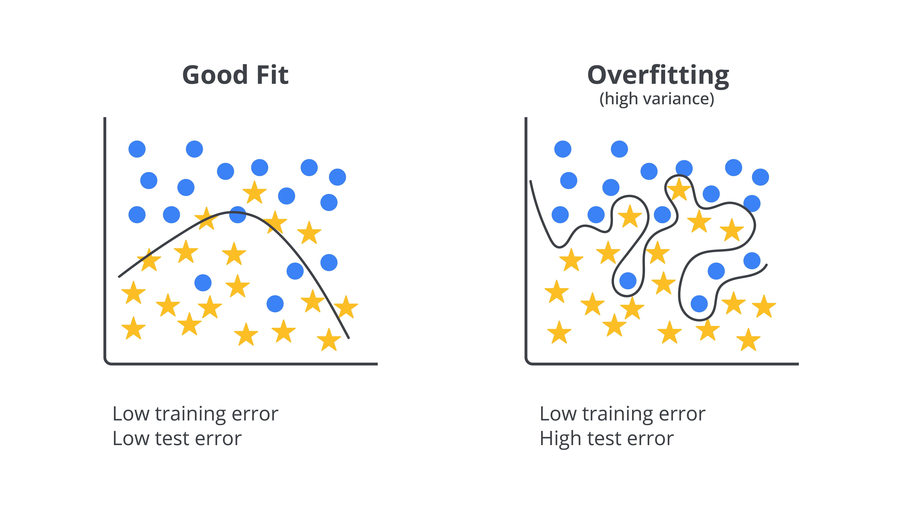
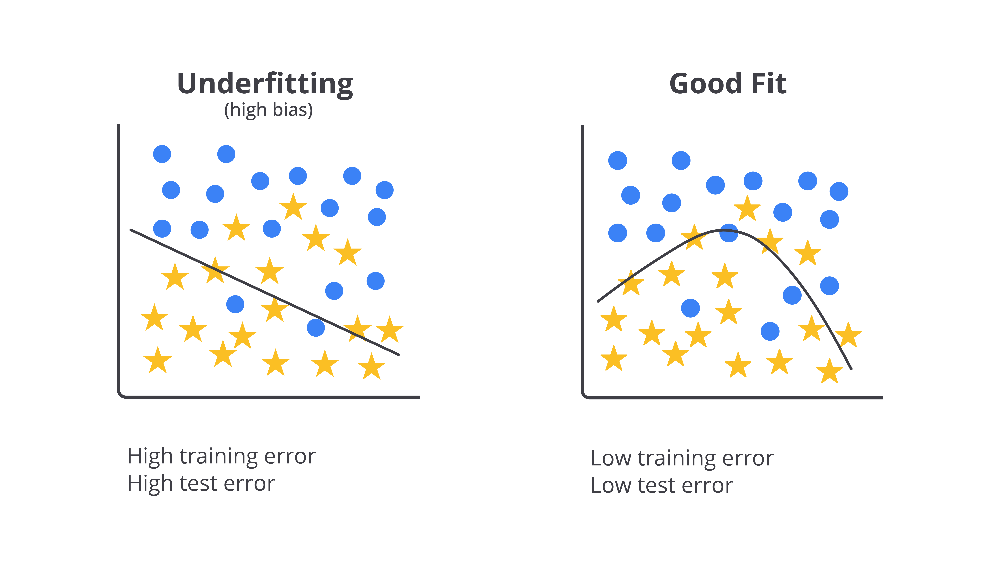
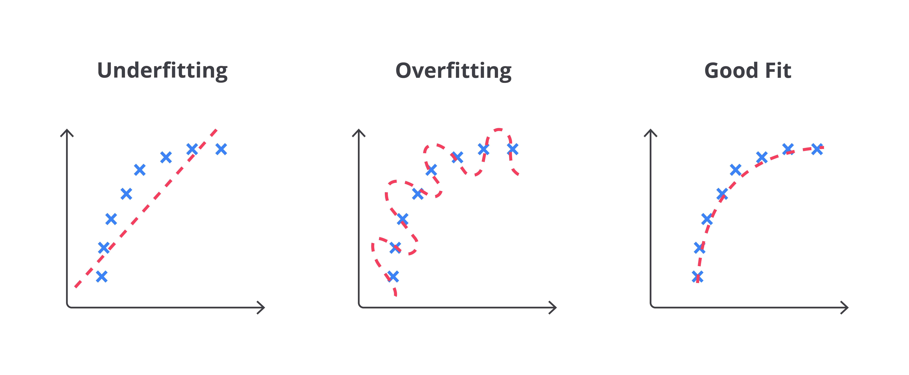
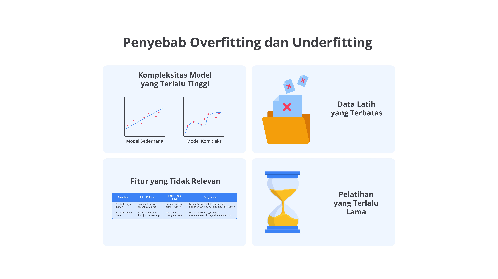
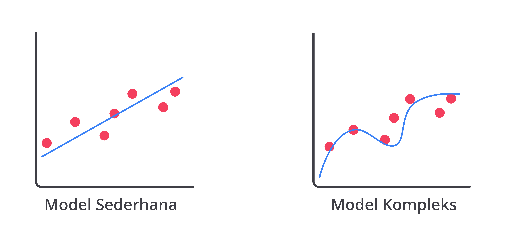
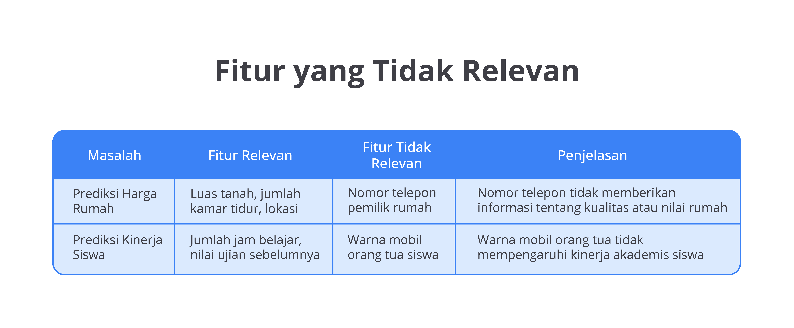
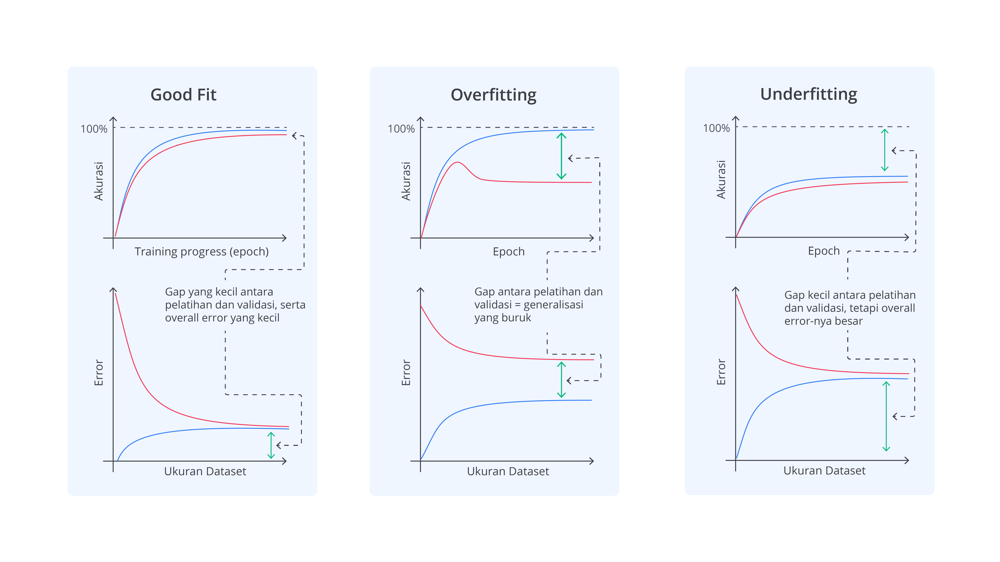
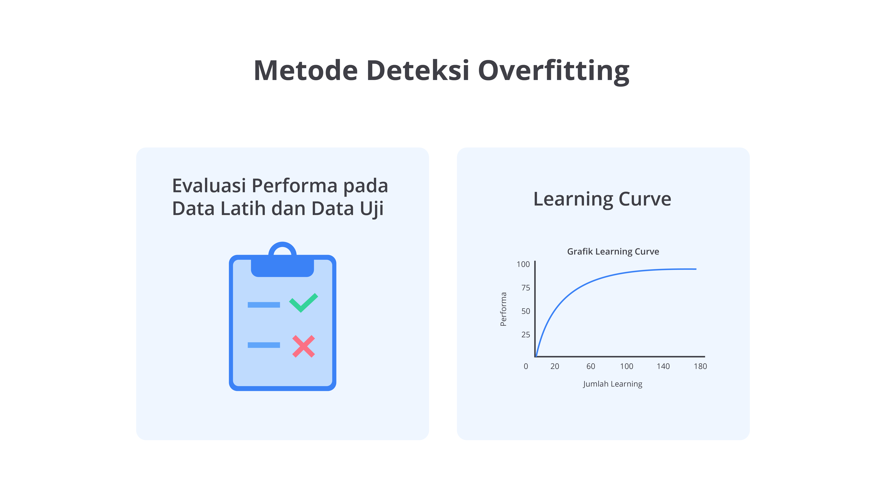
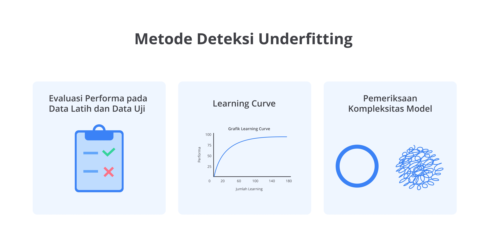

# Definisi dan Konsep Dasar

Dalam machine learning, tujuan utama kita adalah membangun model yang mampu menggeneralisasi dengan baik dari data yang telah dilatih untuk membuat prediksi akurat terhadap data yang belum pernah dilihat sebelumnya. Namun, sering kali model kita gagal dalam mencapai keseimbangan antara mempelajari pola-pola penting dari data dan menghindari pemahaman berlebihan terhadap data latih. Inilah yang memunculkan dua masalah umum dalam machine learning, yaitu overfitting dan underfitting.

Seperti gambar yang Anda lihat di atas, overfitting dan underfitting dapat terjadi pada berbagai jenis model, termasuk classification dan regression yang telah kita pelajari dalam modul sebelumnya. Namun, first thing first, apa perbedaan keduanya?

## Apa Itu Overfitting dan Underfitting?

Overfitting terjadi ketika model machine learning terlalu menyesuaikan diri dengan data latih sehingga ia tidak hanya menangkap pola utama, tetapi juga menangkap noise atau detail yang tidak relevan. Hal ini sering terjadi ketika data latih terlalu spesifik atau terbatas atau ketika model terlalu kompleks, misalnya menggunakan terlalu banyak fitur atau algoritma yang terlalu canggih untuk data yang ada. Akibatnya, model kehilangan kemampuan untuk melakukan generalisasi dengan baik terhadap data baru.

Model yang mengalami overfitting akan menunjukkan performa sangat baik pada data latih karena sudah "menghafal" setiap detail, termasuk anomali atau pola yang sebenarnya tidak signifikan. Namun, ketika diuji dengan data baru (data uji), model ini gagal memberikan prediksi akurat karena tidak mampu menggeneralisasi pola yang lebih umum. Dengan kata lain, model tersebut hanya bagus untuk data yang telah dilihatnya, tetapi buruk dalam menghadapi data yang belum pernah ditemui sebelumnya.

Bayangkan Anda sedang belajar untuk ujian matematika dengan menghafal semua soal latihan yang diberikan guru, termasuk soal-soal dengan angka sangat spesifik. Saat ujian tiba, soalnya memang mirip, tetapi angka-angkanya berbeda. Karena terlalu fokus menghafal angka-angka dari soal latihan, Anda kesulitan menyelesaikan soal ujian yang sedikit berbeda. Ini seperti overfitting—model terlalu "menghafal" data latih, termasuk detail-detail kecil yang sebenarnya tidak penting sehingga tidak bisa beradaptasi dengan data baru.

Misalnya, jika Anda membuat model untuk memprediksi harga makanan di pasar, model yang overfit akan mengingat seluruh harga-harga pada data latih. Itu termasuk harga yang mungkin tidak wajar, seperti harga makanan yang tiba-tiba sangat mahal atau sangat murah. Saat dihadapkan pada data uji yang baru, model tidak bisa membuat prediksi dengan baik karena terlalu fokus terhadap harga-harga spesifik dari data latih.

Underfitting, di sisi lain, adalah situasi ketika model gagal menangkap pola yang signifikan dalam data karena model tersebut terlalu sederhana. Ini terjadi ketika model memiliki kompleksitas yang terlalu rendah atau tidak dilatih dengan cukup baik. Model underfit sering kali tidak mampu mempelajari hubungan antara fitur-fitur dan target sehingga baik pada data latih maupun data uji, performanya sangat buruk. Model ini gagal mengenali pola penting dalam data dan hasilnya tidak dapat memberikan prediksi yang akurat.

Bayangkan Anda belajar untuk ujian matematika, tetapi hanya mempelajari konsep-konsep dasar tanpa berusaha memahami soal-soal yang lebih rumit. Saat ujian tiba, karena persiapan terlalu sederhana, Anda kesulitan menjawab soal-soal yang lebih sulit meskipun pola dan konsepnya sudah diajarkan. Ini seperti underfitting, yaitu ketika model terlalu sederhana dan gagal memahami pola penting dalam data sehingga tidak bisa memberikan jawaban yang baik saat dihadapkan pada data baru.

Misalnya, jika Anda membuat model untuk memprediksi harga makanan di pasar, tetapi hanya menggunakan satu fitur, seperti ukuran makanan, tanpa mempertimbangkan faktor lain, seperti kualitas atau lokasi, prediksi model akan sangat tidak akurat karena model tersebut tidak menangkap faktor-faktor penting untuk membuat prediksi secara tepat.

Good fit adalah kondisi ideal ketika model machine learning mampu menangkap pola signifikan dalam data tanpa terlalu terikat pada detail yang tidak relevan atau terlalu sederhana. Model dalam kondisi good fit akan menunjukkan performa yang baik pada data latih maupun data uji. Ini mengindikasikan bahwa model tersebut dapat menggeneralisasi pola dengan baik dari data yang telah dilatih dan tetap memberikan prediksi akurat dalam data baru.

Bayangkan Anda mempersiapkan diri untuk ujian matematika dengan cara yang seimbang: memahami konsep-konsep dasar, mengerjakan soal latihan, dan mempelajari berbagai variasi soal tanpa terlalu menghafal angka-angka spesifik. Ketika ujian tiba, Anda bisa menjawab soal-soal dengan baik karena mengerti pola dan konsep, serta menyesuaikan jawaban dengan soal yang sedikit berbeda. Ini seperti good fit—model belajar cukup dari data latih, menangkap pola penting, dan mampu membuat prediksi akurat pada data baru tanpa terganggu oleh detail yang tidak relevan.

Misalnya, jika Anda membuat model untuk memprediksi harga makanan di pasar, model good fit akan mempertimbangkan faktor-faktor penting, seperti ukuran, kualitas, dan lokasi, tanpa berlebihan dalam menghafal harga spesifik pada data latih. Saat dihadapkan pada data baru, model mampu membuat prediksi dengan tepat karena memahami pola umum yang relevan dari data tersebut.

# Penyebab Overfitting dan Underfitting

Ketika Anda berusaha mengembangkan model machine learning secara akurat serta efektif, memahami penyebab di balik masalah overfitting dan underfitting adalah hal yang sangat penting. Keduanya adalah tantangan umum yang dapat memengaruhi kualitas prediksi model.

Melalui penjelasan berikut, Anda akan menggali lebih dalam mengenai berbagai penyebab dari kedua masalah ini serta pengaruhnya pada kinerja model. Memahami penyebab-penyebab ini tentunya akan membantu Anda dalam mengidentifikasi dan memperbaiki masalah sehingga dapat membangun model yang lebih baik serta andal. Berikut adalah beberapa di antaranya.

## Kompleksitas Model yang Terlalu Tinggi

Overfitting sering kali terjadi ketika model machine learning memiliki terlalu banyak parameter atau fitur. Model yang terlalu kompleks mampu menangkap bahkan detail terkecil dan noise dalam data latih.

Misalnya, jika Anda menggunakan model yang sangat kompleks, seperti regresi polinomial dengan nilai degree tinggi untuk data yang sebenarnya hanya butuh model sederhana, seperti regresi linear, model tersebut bisa menjadi terlalu spesifik terhadap data latih. Artinya, model akan terlalu fokus pada detail-detail kecil dan kesalahan yang tidak penting. Hasilnya, meskipun model bekerja dengan baik pada data latih, ia tidak dapat memberikan prediksi yang akurat untuk data baru.

## Data Latih yang Terbatas

Jika kompleksitas model sangat besar dibandingkan dengan jumlah ketersediaan data latih, model tersebut mungkin akan terlalu menyesuaikan diri dengan data yang ada. Ini bisa menyebabkan model menangkap noise dan detail yang tidak penting. Model yang terlalu "fit" dengan data latih mungkin tidak dapat generalisasi secara baik pada data baru yang berbeda.

## Pelatihan yang Terlalu Lama

Pelatihan model yang terlalu lama dapat menyebabkan overfitting karena model terus-menerus menyesuaikan parameter untuk meminimalkan kesalahan pada data latih. Seiring berjalannya waktu, model dapat mulai mempelajari pola-pola spesifik yang tidak relevan dan tidak ada dalam data uji sehingga mengurangi kemampuannya untuk menggeneralisasi.

## Fitur yang Tidak Relevan

Penggunaan fitur yang banyak dan tidak relevan juga dapat menyebabkan overfitting. Fitur yang tidak penting dapat membuat model terlalu kompleks dan cenderung fokus pada pola-pola tidak signifikan atau acak dalam data latih.

Misalnya, bayangkan kamu membuat model untuk memprediksi hasil ujian dengan memasukkan banyak fitur, seperti waktu tidur, waktu belajar, dan jenis makanan. Jika model terlalu kompleks dengan banyak fitur tambahan yang tidak benar-benar berhubungan dengan hasil ujian, model mungkin hanya "mempelajari" pola-pola acak dari data latih, yang tidak akan berlaku pada data baru.

# Metode Deteksi Overfitting dan Underfitting

Memahami serta mengatasi overfitting dan underfitting adalah kunci untuk membangun model machine learning yang efektif serta akurat. Overfitting dan underfitting masing-masing mengindikasikan masalah dengan cara model beradaptasi terhadap data serta masing-masing memerlukan pendekatan yang berbeda untuk deteksi dan perbaikan. Metode deteksi ini membantu kita mengevaluasi cara model bekerja pada data latih dan data uji serta cara model dapat disesuaikan untuk mencapai performa yang optimal.

## Metode Deteksi Overfitting

Dalam pengembangan model machine learning, deteksi overfitting adalah langkah krusial untuk memastikan bahwa model yang dibangun tidak hanya berfungsi baik pada data latih, tetapi juga dapat menggeneralisasi dengan baik dalam data yang belum pernah dilihat sebelumnya. Untuk mendeteksi dan mengatasi masalah ini, berbagai metode dapat diterapkan. Berikut adalah di antaranya.

### Evaluasi Performa pada Data Latih dan Data Uji

Untuk mendeteksi overfitting, Anda perlu membandingkan performa model pada data latih dan data uji. Jika model menunjukkan kinerja yang sangat baik pada data latih, tetapi performanya menurun secara signifikan dalam data uji, ini menandakan bahwa model terlalu terlatih pada data latih dan gagal menggeneralisasi pola dalam data yang belum pernah dilihat. Perbedaan besar antara akurasi pada data latih dan data uji menunjukkan bahwa model telah "mengingat" data latih dengan terlalu detail.

### Learning Curve

Learning curve menunjukkan proses perubahan ataupun kesalahan model seiring dengan jumlah data pelatihan. Jika model menunjukkan kesalahan pelatihan yang sangat rendah, tetapi kesalahan validasi tetap tinggi atau meningkat, ini dapat menandakan overfitting. Kurva ini membantu memvisualisasikan bahwa model terlalu kompleks dan memerlukan penyederhanaan.

## Metode Deteksi Underfitting

Dalam pengembangan model machine learning, deteksi overfitting adalah langkah krusial untuk memastikan bahwa model yang dibangun tidak hanya berfungsi baik pada data latih, tetapi juga dapat menggeneralisasi dengan baik pada data yang belum pernah dilihat sebelumnya. Untuk mendeteksi dan mengatasi masalah ini, berbagai metode dapat diterapkan. Berikut adalah di antaranya.

### Evaluasi Performa pada Data Latih dan Data Uji

Sama seperti overfitting, untuk mendeteksi underfitting, perhatikan jika model menunjukkan performa yang buruk, baik pada data latih maupun data uji. Model yang terlalu sederhana akan tidak mampu menangkap pola kompleks dalam data sehingga menyebabkan kesalahan yang tinggi pada kedua set data. Ini menunjukkan bahwa model perlu diperbaiki untuk menangkap informasi yang lebih mendalam.

### Learning Curve

Learning curve juga berguna untuk mendeteksi underfitting. Jika kurva pembelajaran menunjukkan kesalahan tinggi pada data latih dan data uji yang tidak menurun meskipun jumlah data pelatihan meningkat, ini menandakan bahwa model mungkin terlalu sederhana untuk menangkap pola dalam data. Kurva ini membantu menentukan jika model perlu lebih kompleks.

### Pemeriksaan Kompleksitas Model

Tinjau kompleksitas model dengan memeriksa jenis model yang digunakan dan jumlah fitur tersedia. Model yang terlalu sederhana mungkin tidak dapat menangkap hubungan rumit dalam data. Misalnya, menggunakan regresi linear pada data dengan hubungan non-linear dapat mengakibatkan underfitting. Menyederhanakan model atau menambahkan fitur baru bisa membantu.

Dengan menggunakan metode deteksi ini, Anda dapat memastikan bahwa model machine learning tidak hanya berfungsi baik pada data latih, tetapi juga dapat menggeneralisasi dengan baik dalam data yang belum pernah dilihat sebelumnya sehingga meningkatkan akurasi dan efektivitas model secara keseluruhan.
