# Teknik Mengatasi Overfitting dan Underfitting

Untuk memastikan bahwa model machine learning dapat bekerja secara optimal tanpa terjebak dalam masalah overfitting atau underfitting, beberapa teknik penting dapat diterapkan. Mengatasi overfitting dan underfitting adalah langkah krusial dalam proses pembangunan model yang efektif. Berikut adalah beberapa di antaranya.

## Mengatasi Overfitting

Dalam bagian ini, kita akan menjelajahi beberapa metode efektif untuk mengatasi overfitting, termasuk early stopping, regularization, pruning, dropout, dan data augmentation. Teknik-teknik ini dirancang untuk membuat model lebih robust dan mampu beradaptasi dengan berbagai jenis data sehingga menghasilkan prediksi yang lebih akurat serta dapat diandalkan.

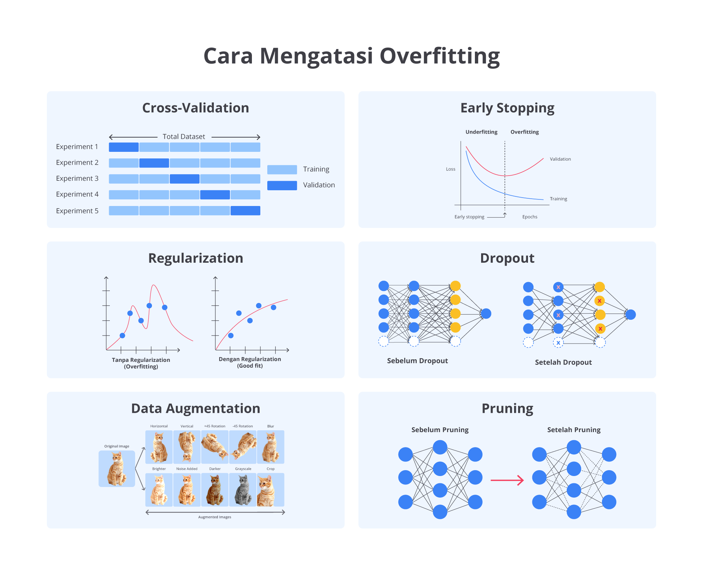

## Cross-Validation

Teknik ini membagi data menjadi beberapa subset yang dikenal sebagai fold. Model dilatih dalam beberapa subset serta diuji pada subset yang tersisa dan proses ini diulang beberapa kali. Jika performa model sangat bervariasi antara fold, ini menunjukkan bahwa model mengalami overfitting pada subset data tertentu dan tidak dapat menggeneralisasi dengan baik. Cross-validation membantu memastikan bahwa model dinilai secara lebih konsisten di seluruh data.

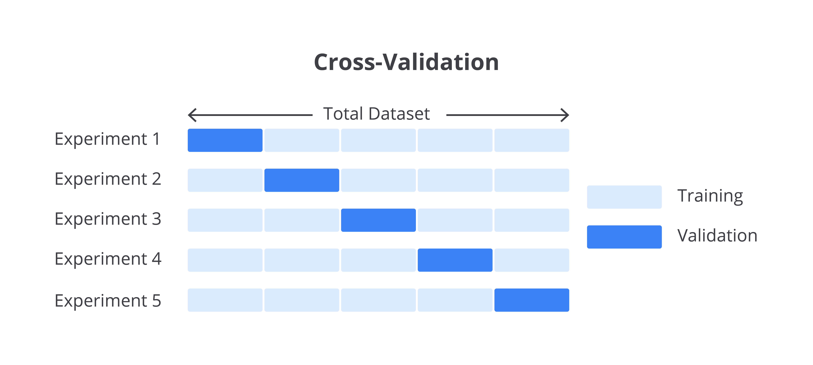

## Early Stopping

Early stopping adalah teknik yang digunakan dalam melatih model machine learning untuk mencegah overfitting. Overfitting terjadi ketika model belajar terlalu banyak dari data latih sampai-sampai tidak bisa bekerja dengan baik pada data baru.

Cara kerjanya cukup sederhana, yaitu ketika kita melatih model, data dibagi menjadi dua bagian, yaitu data training (data latih) dan data validation (data validasi). Model dilatih menggunakan data latih, sementara kita memantau kinerjanya menggunakan data validasi.

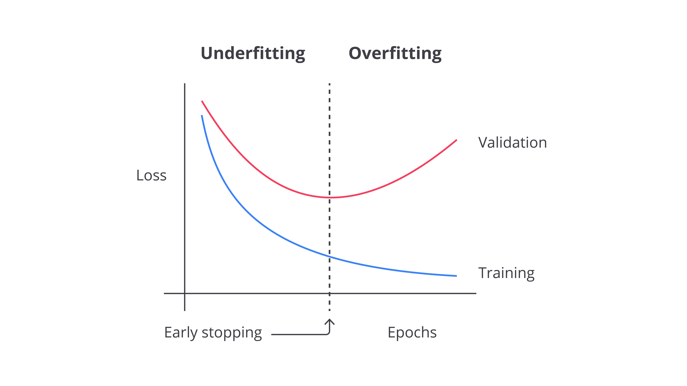

Jika performa model pada data validasi mulai memburuk (meskipun performanya dalam data latihan terus membaik), itu adalah tanda bahwa model mulai overfitting. Early stopping menghentikan pelatihan yang saat ini terjadi sehingga model tidak berlatih terlalu lama dan bisa bekerja lebih baik saat dihadapkan pada data baru.

Intinya, early stopping memastikan kita berhenti melatih model pada saat yang tepat sebelum performa model turun karena belajar terlalu berlebihan.

## Regularization

Regularization adalah teknik yang digunakan dalam machine learning untuk mengurangi kompleksitas model dan mencegah overfitting dengan menambahkan penalti pada ukuran koefisien model.

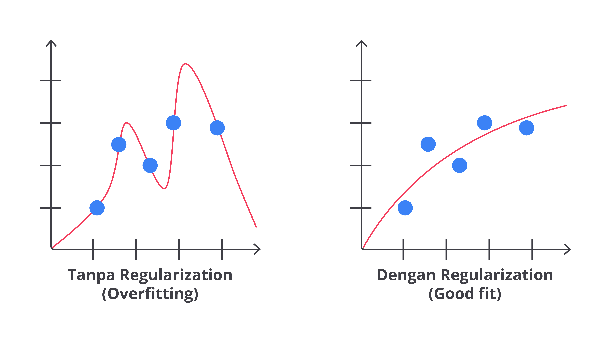

Tujuan utama dari regularisasi adalah menjaga model agar tetap sederhana dan menghindari penyesuaian yang berlebihan terhadap data pelatihan. Ini dilakukan dengan menambahkan suatu bentuk penalti terhadap ukuran atau kompleksitas model dalam fungsi biaya yang digunakan selama pelatihan. Berikut adalah penjelasan lebih rinci tentang teknik regularisasi yang umum digunakan.

## Jenis-Jenis Regularization

Dalam regularization, ada tiga teknik yang umum digunakan. Teknik-teknik ini meliputi L1 Regularization (Lasso), L2 Regularization (Ridge), dan Elastic Net. Masing-masing teknik ini menawarkan cara berbeda untuk mengontrol kompleksitas model dan meningkatkan kemampuannya dalam menggeneralisasi pada data baru. Berikut adalah penjelasan mendetail tentang masing-masing teknik tersebut.

### L1 Regularization (Lasso)

L1 Regularization, atau Lasso, adalah cara untuk menyederhanakan model dengan mengurangi koefisien fitur yang kurang penting hingga menjadi nol. Ini artinya, fitur-fitur yang tidak relevan akan diabaikan oleh model.

Teknik ini membantu memilih fitur yang paling penting saja. Misalnya, jika Anda membangun model untuk memprediksi harga rumah serta memiliki banyak fitur, seperti ukuran rumah, lokasi, dan jumlah kamar, L1 regularisasi akan membantu memilih hanya fitur-fitur yang benar-benar berpengaruh pada harga rumah serta mengabaikan fitur yang tidak penting.

### L2 Regularization (Ridge)

L2 Regularization, atau Ridge, menambahkan penalti untuk koefisien fitur yang terlalu besar. Dalam arti lain, teknik ini membuat model lebih sederhana dengan mengurangi ukuran koefisien, tetapi tidak menghilangkan fitur sama sekali.

L2 Regularization memastikan bahwa semua fitur berkontribusi pada model, tetapi tidak ada yang mendominasi terlalu banyak. Misalnya, dalam model harga rumah, L2 akan membantu memastikan bahwa tidak ada satu fitur yang terlalu berpengaruh dan menyebabkan model menjadi terlalu rumit.

### Elastic Net

Elastic Net adalah campuran dari L1 dan L2 Regularization. Ia tidak hanya memilih fitur penting, seperti L1, tetapi juga mencegah fitur menjadi terlalu dominan, seperti L2.

Mengapa ini berguna? Kadang-kadang, banyak fitur yang saling berhubungan dalam penggunaan data. Misalnya, dalam model untuk memprediksi harga rumah, ada fitur-fitur yang terkait erat, seperti ukuran rumah dan jumlah kamar.

Jika kita hanya menggunakan L1, fitur-fitur ini bisa saling bertentangan dan menyebabkan model menjadi tidak stabil. Dengan Elastic Net, kita bisa memilih fitur paling penting tanpa kehilangan informasi dari fitur yang saling berhubungan serta memastikan model tetap stabil dan efektif.

## Dropout

Dropout adalah penggunaan teknik untuk mencegah model neural network terlalu menyesuaikan diri dengan data latih, yang dikenal sebagai overfitting. Selama proses pelatihan, beberapa neuron dalam jaringan "dibuang" atau dinonaktifkan secara acak. Ini berarti neuron-neuron tidak berfungsi dalam perhitungan untuk sementara waktu.

Melalui cara ini, model tidak bergantung pada neuron tertentu dan harus belajar untuk bekerja dengan berbagai neuron yang tersedia. Hasilnya, model menjadi lebih fleksibel dan mampu mengenali pola yang lebih umum, bukan hanya detail spesifik dari data latih.

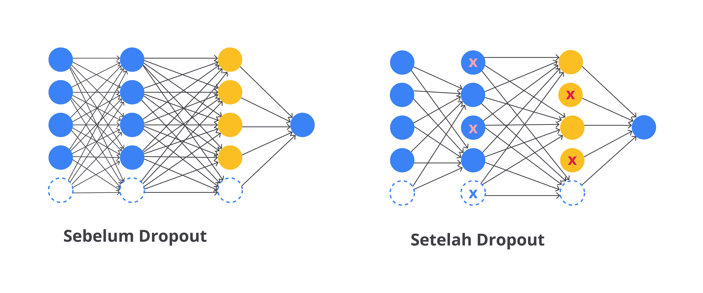

Ketika model siap digunakan untuk membuat prediksi, semua neuron akan diaktifkan kembali dan memungkinkan model menggunakan semua informasi yang dipelajari untuk membuat keputusan lebih akurat. Dropout membantu model belajar dengan lebih baik dan lebih tahan terhadap data baru yang mungkin berbeda dari data latih.

## Data Augmentation

Data augmentation adalah teknik penting yang digunakan untuk meningkatkan jumlah dan variasi data pelatihan tanpa harus mengumpulkan data baru. Dengan membuat modifikasi atau variasi pada data yang sudah ada, teknik ini membantu model machine learning menjadi lebih tangguh dan mampu menangani berbagai situasi berbeda di dunia nyata.

Tentunya ini sangat berguna, terutama ketika data latih terbatas. Sebab, model yang dilatih pada data beragam cenderung memiliki kemampuan generalisasi lebih baik dan tidak mudah terjebak dalam overfitting.

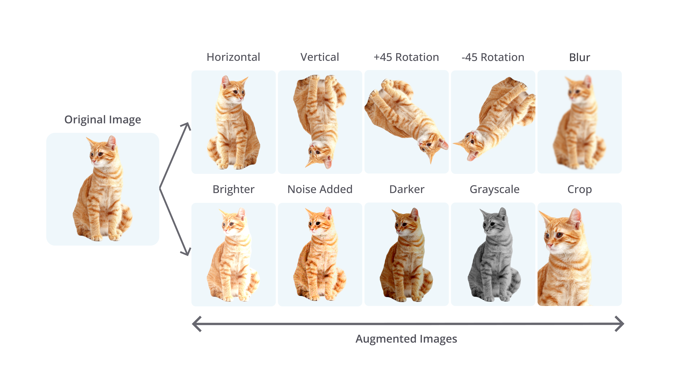

Keuntungan utama dari data augmentation adalah model menjadi lebih robust dan adaptif terhadap variasi data.

Ini membuat model lebih baik dalam menangani data baru yang mungkin berbeda dari data latih, mengurangi risiko overfitting, dan memperbaiki performa model secara keseluruhan. Data augmentation juga mengurangi kebutuhan pengumpulan data baru yang bisa menjadi proses mahal dan memakan waktu.

## Pruning

Pruning adalah teknik yang umumnya diterapkan pada pohon keputusan untuk menyederhanakan model dengan mengurangi kompleksitasnya. Tujuannya adalah meningkatkan kemampuan model dalam menggeneralisasi data baru dengan menghilangkan cabang-cabang pohon yang tidak memberikan kontribusi signifikan terhadap hasil akhir.

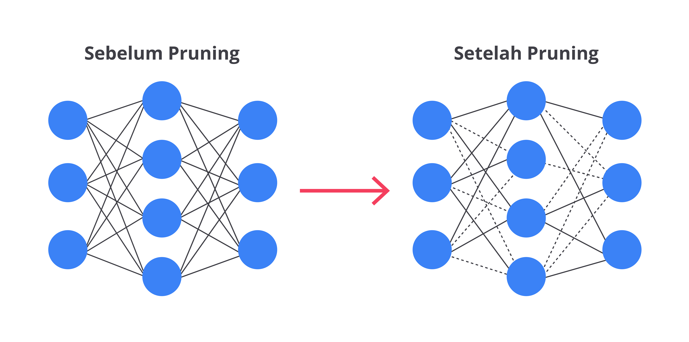

- Pre-Pruning: Dalam proses ini, kita menghentikan penambahan cabang baru ke pohon keputusan saat masa pelatihan. Misalnya, jika penambahan cabang baru tidak memberikan manfaat yang cukup atau kesalahan pada pohon tidak berkurang secara signifikan, kita akan menghentikan pembentukan cabang tersebut. Ini mencegah pohon tumbuh terlalu besar dan rumit. Dengan cara ini, kita membantu model agar tidak terlalu spesifik pada data latih sehingga mengurangi risiko overfitting.

- Post-Pruning: Setelah pohon keputusan selesai dibentuk, kita melakukan pemangkasan untuk menghapus cabang-cabang yang tidak banyak membantu dalam membuat keputusan. Caranya adalah memeriksa seberapa baik setiap cabang berkontribusi pada akurasi model. Cabang yang memberikan kontribusi kecil akan dihapus untuk menyederhanakan model.

Penerapan masing-masing metodenya akan kita bahas nanti dalam bagian Latihan, jadi jangan khawatir! Tetap semangat membaca materi ini, ya! Anda pasti bisa memahaminya dengan baik. Fighting!

## Mengatasi Underfitting

Model yang mengalami underfitting akan memiliki akurasi rendah karena tidak mampu mempelajari hubungan penting antar fitur sehingga hasil prediksi kurang tepat. Oleh karena itu, penting untuk memahami cara-cara mengatasi underfitting agar model bisa memberikan hasil yang lebih akurat dan dapat diandalkan. Berikut adalah beberapa di antaranya.

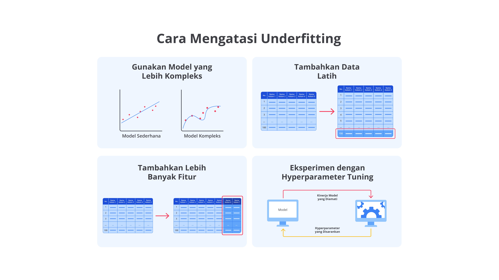

### Gunakan Model yang Lebih Kompleks

Salah satu cara utama untuk mengatasi underfitting adalah menggunakan model yang lebih kompleks. Model sederhana, seperti regresi linear sering kali tidak cukup untuk menangkap hubungan yang kompleks antara fitur dan target dalam data Anda.

Misalnya, jika data Anda menunjukkan pola non-linear yang tidak dapat dijelaskan dengan baik oleh regresi linear, model yang lebih canggih dapat memberikan harapan lebih baik. Pertimbangkan untuk beralih ke model yang lebih kompleks, seperti decision trees, random forests, atau neural networks.

Decision Trees, dengan kemampuannya membagi data ke dalam berbagai cabang keputusan, sangat efektif untuk menangani interaksi fitur yang kompleks. Random Forests, yang merupakan ensemble dari banyak Decision Trees, lebih robust dalam menangkap variasi data dan menangani kompleksitas. Sementara itu, neural networks, dengan arsitektur yang memiliki banyak layer dan neuron, mampu menangkap pola yang sangat rumit serta abstrak dalam data.

Namun, penting untuk diingat bahwa menambah kompleksitas model tidak boleh dilakukan secara sembarangan. Terlalu banyak layer atau neuron pada neural networks atau terlalu dalamnya Decision Trees bisa menyebabkan overfitting, terutama jika tidak diimbangi dengan jumlah data yang cukup.

Jadi, meskipun menggunakan model yang lebih kompleks dapat membantu mengatasi underfitting, pastikan Anda mempertimbangkan keseimbangan antara kompleksitas model dan kualitas serta kuantitas data.

### Tambahkan Data Latih

Menambahkan data latih adalah langkah penting untuk mengatasi underfitting dan ini dapat memberikan manfaat besar dalam meningkatkan kinerja model Anda. Jika model Anda mengalami underfitting, artinya ia tidak dapat menangkap pola atau hubungan yang relevan dalam data dengan baik. Salah satu cara untuk memperbaiki masalah ini adalah memberikan model lebih banyak data untuk dipelajari.

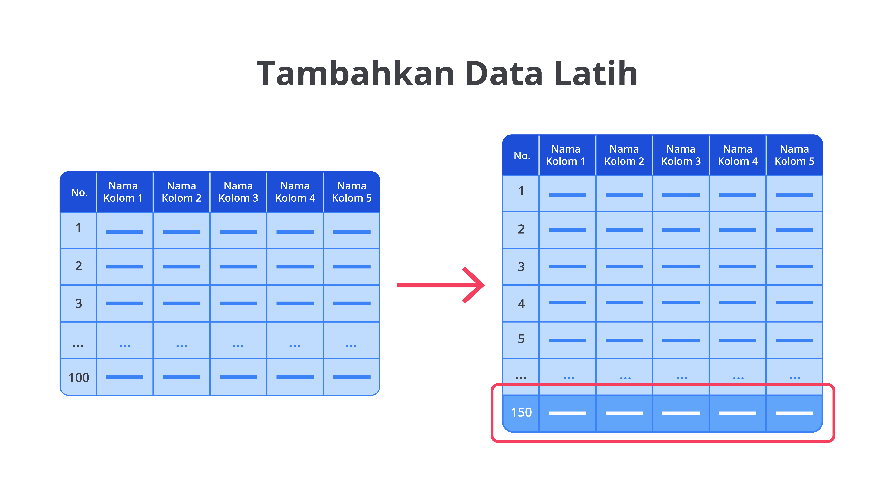

Ketika Anda menambahkan data latih, model memiliki kesempatan lebih besar untuk belajar dari berbagai variasi dan contoh dalam data. Ini memungkinkan model untuk menangkap pola lebih kompleks dan hubungan lebih detail yang mungkin terlewatkan ketika hanya memiliki data terbatas.

Menambahkan data latih untuk mengatasi underfitting bisa diibaratkan seperti seorang koki yang sedang belajar memasak hidangan baru. Bayangkan Anda adalah koki pemula yang hanya punya sedikit bahan dan instruksi sangat dasar. Dengan bahan terbatas, Anda hanya bisa membuat versi sangat sederhana dari hidangan tersebut, dan rasanya mungkin tidak memuaskan karena tidak punya cukup informasi tentang berbagai teknik atau bahan tambahan yang bisa membuat hidangan lebih lezat.

Sekarang, jika diberikan lebih banyak bahan dan kesempatan untuk berlatih dengan lebih banyak variasi resep, Anda akan lebih memahami cara mengombinasikan bahan, menyesuaikan rasa, serta mengenal lebih banyak teknik memasak. Setiap kali memasak dengan bahan berbeda, Anda mendapatkan lebih banyak wawasan tentang cara membuat hidangan yang lebih baik.

Hal ini serupa dengan menambahkan lebih banyak data latih ke model machine learning. Model Anda (seperti koki yang berlatih) dapat mempelajari lebih banyak pola serta hubungan dalam data yang akhirnya membantu model menjadi lebih akurat dan fleksibel.

Menambahkan data latih juga dapat membantu dalam mengurangi bias model dan meningkatkan kemampuannya untuk generalisasi. Dengan lebih banyak data, model tidak hanya belajar dari contoh tertentu, tetapi juga memahami tren umum dalam data. Jika menambahkan data latih tidak memungkinkan karena keterbatasan sumber daya atau waktu, Anda juga dapat menggunakan teknik augmentasi data, seperti rotasi atau flipping gambar untuk menciptakan variasi tambahan dari data yang sudah ada.

Penting untuk memastikan bahwa data yang Anda tambahkan relevan dan berkualitas tinggi. Data yang tidak relevan atau memiliki kualitas buruk dapat memperburuk masalah dan menyebabkan model belajar dari informasi tidak berguna. Jadi, pastikan Anda memeriksa dan memproses data tambahan dengan cermat sebelum digunakan untuk melatih model.

### Tambahkan Lebih Banyak Fitur

Menambahkan lebih banyak fitur adalah strategi efektif lainnya untuk mengatasi underfitting. Dalam konteks ini, fitur adalah variabel atau atribut yang digunakan oleh model machine learning untuk membuat prediksi. Semakin relevan serta informatif fitur yang Anda sediakan, semakin baik model dalam memahami dan memprediksi hasil. Jika model Anda mengalami underfitting, bisa jadi fitur tidak cukup memberikan informasi yang diperlukan.

Analogi sederhananya, menambahkan lebih banyak fitur bisa disamakan dengan memberi lebih banyak petunjuk kepada seseorang yang sedang mencoba memecahkan teka-teki. Bayangkan Anda sedang mencoba menebak lokasi harta karun hanya berdasarkan satu petunjuk: "lokasinya dekat dengan pohon". Informasi ini sangat terbatas dan mungkin tidak cukup membantu.

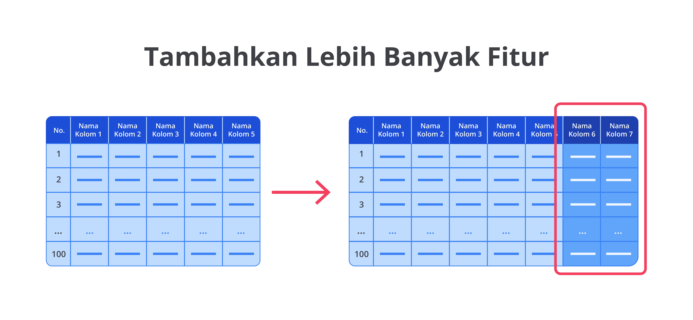

Namun, jika diberikan petunjuk tambahan, seperti "di dekat sungai" dan "terdapat batu besar di sekitar", Anda bisa mendapatkan gambaran yang lebih jelas dan lebih akurat tentang letak harta karun tersebut berada. Pada kasus machine learning, fitur tambahan berperan sebagai petunjuk tambahan untuk membantu model dalam menangkap hubungan yang lebih kompleks pada data.

Cara menambahkan fitur bisa dilakukan melalui teknik feature engineering, yaitu Anda menciptakan fitur baru dari fitur yang sudah ada. Namun, perlu diperhatikan bahwa menambah terlalu banyak fitur tanpa pemilihan yang tepat dapat menyebabkan model menjadi terlalu rumit dan sulit diinterpretasikan. Jika fitur yang tidak relevan ditambahkan, hal ini bisa mengganggu model dan malah menyebabkan overfitting, artinya model belajar terlalu spesifik dalam data latih serta tidak bisa digeneralisasi dengan baik pada data baru.

### Eksperimen dengan Hyperparameter Tuning

Eksperimen dengan hyperparameter tuning adalah langkah penting dalam mengoptimalkan model machine learning untuk mengatasi underfitting. Setiap model memiliki hyperparameter sebagai parameter eksternal yang tidak diatur langsung oleh data, seperti jumlah pohon dalam Random Forest atau jumlah neuron pada neural networks.

Jika hyperparameter tidak diatur dengan baik, model bisa menjadi terlalu sederhana (underfitting) atau terlalu rumit (overfitting). Oleh karena itu, menyesuaikan hyperparameter dengan tepat bisa meningkatkan kinerja model secara signifikan.

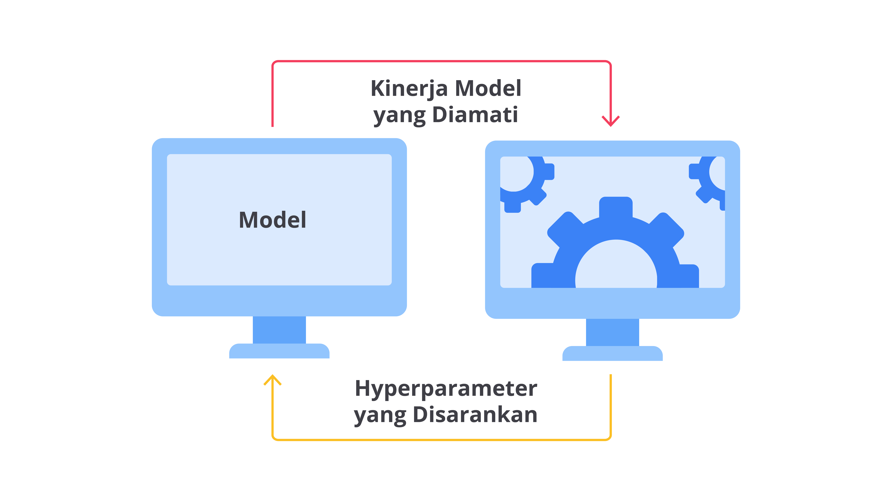

Disclaimer dulu, ya, hal ini akan kita bahas lebih dalam pada Modul 8. Di sana kita akan menjelajahi berbagai teknik hyperparameter tuning yang efektif. Kita juga akan membahas cara memilih nilai yang optimal untuk mencapai keseimbangan antara underfitting dan overfitting. Dengan begitu, kita dapat memastikan model berfungsi dengan baik dan memberikan hasil yang maksimal.

Ibaratnya, melakukan hyperparameter tuning seperti menyetel alat musik gitar. Jika senar gitar terlalu longgar, suara yang dihasilkan akan terlalu rendah, tetapi jika terlalu kencang, suaranya akan terlalu tinggi.

Demikian juga, jika hyperparameter seperti learning rate terlalu kecil, model akan belajar sangat lambat dan tidak akan menemukan pola yang kompleks dalam data; ini bisa menyebabkan underfitting. Sebaliknya, jika terlalu besar, model mungkin akan "melompat-lompat" melewatkan pola penting, bahkan bisa berujung pada overfitting.

Sebagai contoh, dalam neural networks, Anda bereksperimen dengan ukuran batch, jumlah epoch, dan learning rate untuk menemukan kombinasi yang memberikan hasil terbaik pada data validasi. Dalam SVM (Support Vector Machine), Anda mencoba berbagai nilai untuk C (regularization) dan gamma untuk mencapai performa optimal. Eksperimen dengan hyperparameter tuning bukan hanya soal meningkatkan akurasi, tetapi juga tentang membuat model lebih robust dan dapat digeneralisasi secara baik ke data baru.
