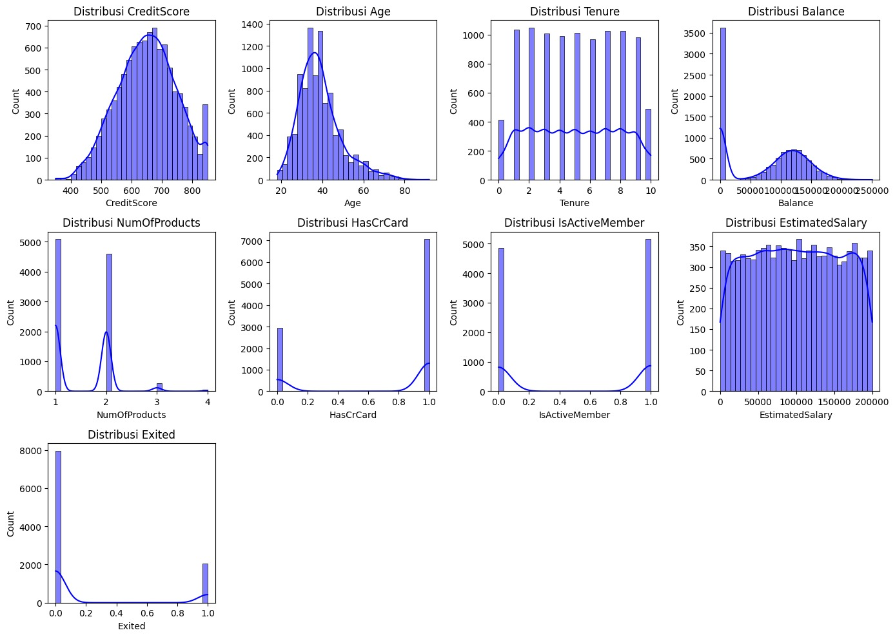
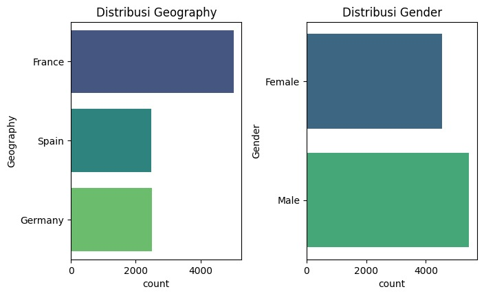
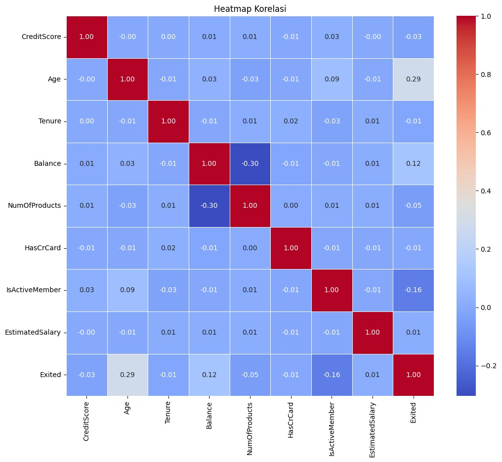
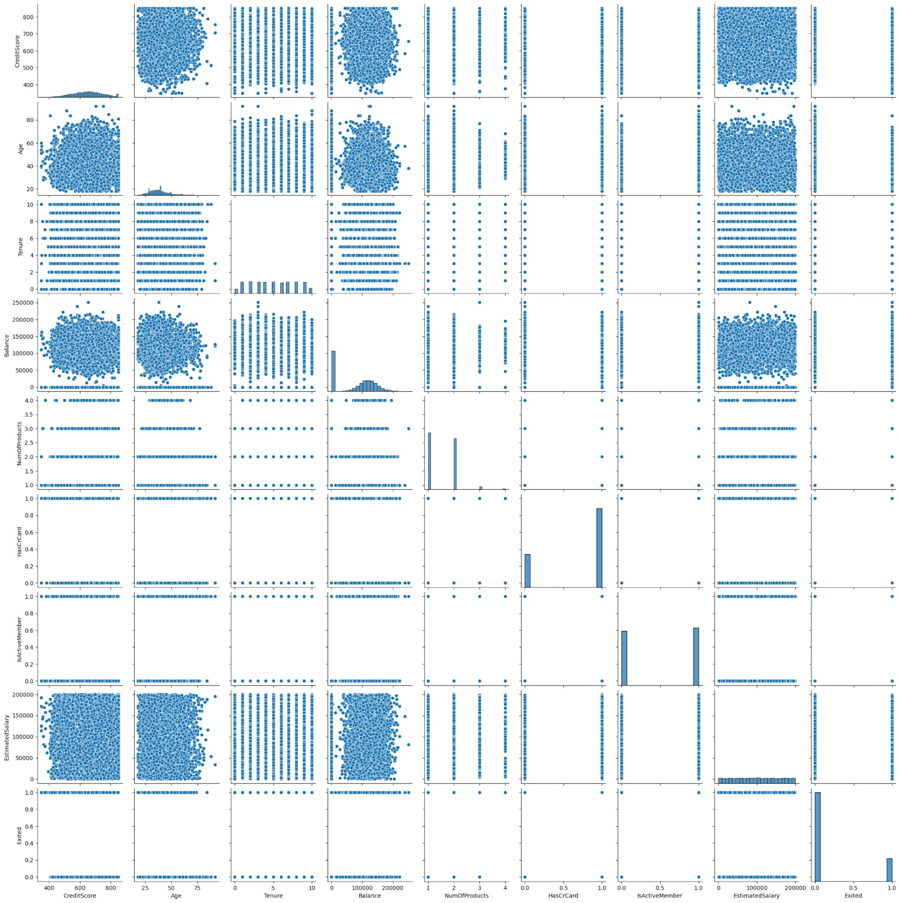
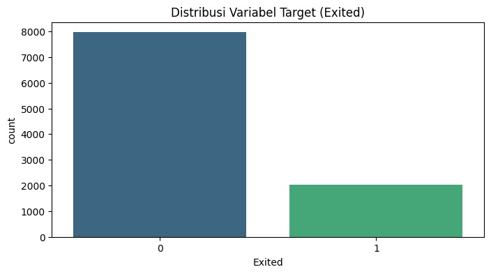
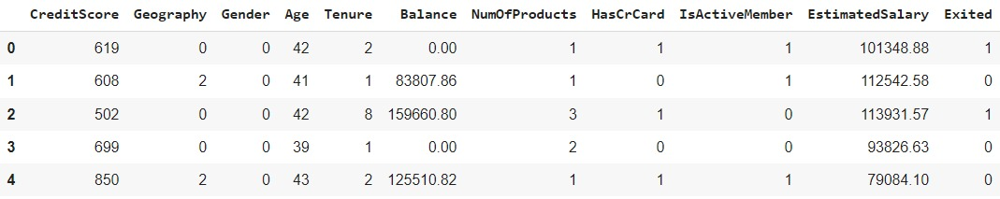
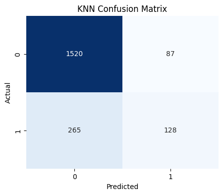
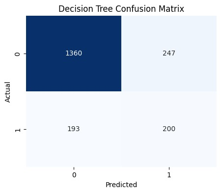
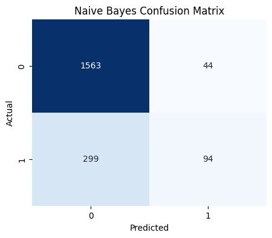
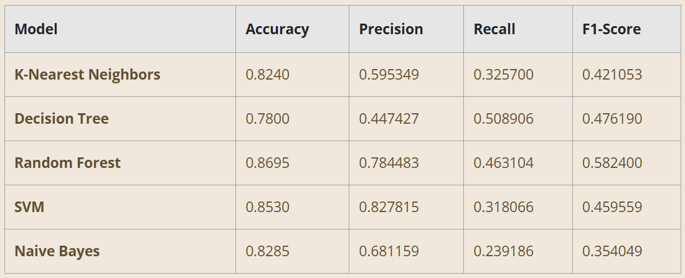

# Latihan Studi Kasus: Klasifikasi Pelanggan untuk Churn pada Perusahaan XYZ

## Langkah 1: Mengimpor Library

```bash
import pandas as pd
import numpy as np
import seaborn as sns
import matplotlib.pyplot as plt
from sklearn.model_selection import train_test_split
from sklearn.preprocessing import LabelEncoder, StandardScaler, MinMaxScaler
from sklearn.neighbors import KNeighborsClassifier
from sklearn.tree import DecisionTreeClassifier
from sklearn.ensemble import RandomForestClassifier
from sklearn.svm import SVC
from sklearn.naive_bayes import GaussianNB
from sklearn.metrics import confusion_matrix, accuracy_score, precision_score, recall_score, f1_score
```

Berikut adalah penjelasan singkat dari masing-masing library yang diimpor.

Pandas: Ini digunakan untuk memanipulasi dan menganalisis data dalam bentuk DataFrame. Library ini sangat berguna untuk membaca, menulis, dan mengelola data dalam berbagai format.
numpy: Ini menyediakan dukungan untuk array dan operasi matematika tingkat tinggi. numpy sangat penting untuk perhitungan numerik yang efisien dalam machine learning.
seaborn: seaborn adalah library untuk visualisasi data yang dibangun di atas matplotlib. Digunakan untuk membuat plot statistik yang lebih kompleks dan informatif.
matplotlib.pyplot: Library dasar untuk membuat visualisasi data, seperti grafik dan plot. Sering digunakan bersama seaborn untuk memperindah visualisasi.
sklearn.model_selection.train_test_split: Fungsi ini digunakan untuk membagi dataset menjadi data latih dan data uji, penting agar model yang dibangun dapat dievaluasi dengan data yang belum pernah dilihat sebelumnya.
sklearn.preprocessing.LabelEncoder: Ini digunakan untuk mengubah data kategori menjadi bentuk numerik yang dapat diproses oleh algoritma machine learning.
sklearn.preprocessing.StandardScaler: Ini digunakan untuk menstandardisasi fitur dengan menghilangkan rata-rata dan menyesuaikan skala ke unit varians. Ini sering diterapkan pada data sebelum dimasukkan ke model.
sklearn.preprocessing.MinMaxScaler: Ini digunakan untuk mengubah fitur dengan membuat skala dari setiap fitur setiap fitur ke rentang yang ditentukan (biasanya antara 0 dan 1).
sklearn.neighbors.KNeighborsClassifier: Ini merupakan algoritma K-Nearest Neighbors (KNN) yang digunakan untuk klasifikasi data berdasarkan kemiripan dengan tetangga terdekat.
sklearn.tree.DecisionTreeClassifier: Algoritma Decision Tree digunakan untuk membuat model klasifikasi atau regresi dalam bentuk struktur pohon keputusan.
sklearn.ensemble.RandomForestClassifier: Ini merupakan ensemble learning method yang menggabungkan beberapa Decision Tree untuk meningkatkan performa prediksi.
sklearn.svm.SVC: Support Vector Machine digunakan untuk klasifikasi dengan mencari hyperplane yang memisahkan kelas-kelas data dengan margin terbesar.
sklearn.naive_bayes.GaussianNB: Algoritma Naive Bayes digunakan untuk klasifikasi berdasarkan prinsip Teorema Bayes dengan asumsi sederhana bahwa fitur bersifat independen.
sklearn.metrics: Library ini menyediakan berbagai fungsi untuk mengevaluasi performa model, seperti confusion_matrix, accuracy_score, precision_score, recall_score, dan f1_score.
Dengan mengimpor library ini, lingkungan kerja telah dipersiapkan untuk menganalisis data, membangun model, dan mengevaluasi hasilnya.

## Langkah 2: Memuat Data

```bash
# Gantilah ID file dengan ID dari Google Drive URL
file_id = '19IfOP0QmCHccMu8A6B2fCUpFqZwCxuzO'

# Buat URL unduhan langsung
download_url = f'https://drive.google.com/uc?id={file_id}'

# Baca file CSV dari URL
data = pd.read_csv(download_url)

# Tampilkan DataFrame untuk memastikan telah dibaca dengan benar
data.head()

# Tampilkan informasi umum tentang dataset
print("\nInformasi dataset:")
data.info()

# Cek missing values
print("\nMissing values per fitur:")
print(data.isnull().sum())

# Hapus kolom 'RowNumber', 'CustomerId', dan 'Surname'
data = data.drop(columns=['RowNumber', 'CustomerId', 'Surname'])

# Tampilkan DataFrame untuk memastikan kolom telah dihapus
data.head()
```

Berikut adalah penjelasan singkat setiap fitur dalam dataset.

RowNumber: Nomor baris dalam dataset yang digunakan untuk identifikasi unik setiap entri. Fitur ini tidak memiliki makna analitis.
CustomerId: ID unik yang mengidentifikasi setiap pelanggan dalam sistem. Ini berguna untuk referensi dan penggabungan data.
Surname: Nama belakang pelanggan. Fitur ini tidak digunakan dalam analisis model karena tidak relevan.
CreditScore: Skor kredit yang menunjukkan kelayakan kredit pelanggan. Skor ini dapat memengaruhi keputusan mereka untuk tetap atau berhenti menggunakan layanan.
Geography: Lokasi geografis tempat tinggal pelanggan. Informasi ini dapat memengaruhi perilaku dan kebutuhan layanan pelanggan.
Gender: Jenis kelamin pelanggan. Meskipun tidak selalu memengaruhi churn secara langsung, informasi ini berguna untuk analisis demografis.
Age: Usia pelanggan. Usia dapat memengaruhi kebiasaan dan preferensi dalam menggunakan layanan.
Tenure: Lama berlangganan pelanggan. Durasi berlangganan ini sering kali berhubungan dengan kemungkinan pelanggan untuk churn.
Balance: Saldo rekening pelanggan. Saldo ini dapat memengaruhi kepuasan pelanggan dan kecenderungan mereka untuk tetap menggunakan layanan.
NumOfProducts: Jumlah produk yang dimiliki pelanggan. Fitur ini membantu memahami keterlibatan pelanggan dengan berbagai produk.
HasCrCard: Ini menunjukkan pelanggan memiliki kartu kredit atau tidak. Fitur ini dapat memengaruhi pengalaman pelanggan dengan layanan.
IsActiveMember: Status keanggotaan aktif pelanggan. Ini menunjukkan pelanggan masih aktif atau tidak dalam menggunakan layanan.
EstimatedSalary: Gaji yang diperkirakan dari pelanggan. Gaji dapat memengaruhi keputusan pelanggan untuk berlangganan atau berhenti dari layanan.
Exited: Label target yang menunjukkan pelanggan telah keluar dari layanan (1) atau tidak (0). Fitur ini merupakan variabel yang ingin diprediksi dalam model klasifikasi.

## Langkah 3: Exploratory Data Analysis (EDA)

```bash
# Distribusi fitur numerik
num_features = data.select_dtypes(include=[np.number])
plt.figure(figsize=(14, 10))
for i, column in enumerate(num_features.columns, 1):
    plt.subplot(3, 4, i)
    sns.histplot(data[column], bins=30, kde=True, color='blue')
    plt.title(f'Distribusi {column}')
plt.tight_layout()
plt.show()
```



```bash
# Distribusi fitur kategorikal
cat_features = data.select_dtypes(include=[object])
plt.figure(figsize=(14, 8))
for i, column in enumerate(cat_features.columns, 1):
    plt.subplot(2, 4, i)
    sns.countplot(y=data[column], palette='viridis')
    plt.title(f'Distribusi {column}')
plt.tight_layout()
plt.show()
```



```bash
# Heatmap korelasi untuk fitur numerik
plt.figure(figsize=(12, 10))
correlation_matrix = num_features.corr()
sns.heatmap(correlation_matrix, annot=True, cmap='coolwarm', fmt='.2f', linewidths=0.5)
plt.title('Heatmap Korelasi')
plt.show()
```



```bash
# Pairplot untuk fitur numerik
sns.pairplot(num_features)
plt.show()
```



```bash
# Visualisasi distribusi variabel target
plt.figure(figsize=(8, 4))
sns.countplot(x='Exited', data=data, palette='viridis')
plt.title('Distribusi Variabel Target (Exited)')
plt.show()
```



## Langkah 4: Label Encoder

```bash
# Buat instance LabelEncoder
label_encoder = LabelEncoder()

# List kolom kategorikal yang perlu di-encode
categorical_columns = ['Geography', 'Gender']

# Encode kolom kategorikal
for column in categorical_columns:
    data[column] = label_encoder.fit_transform(data[column])

# Tampilkan DataFrame untuk memastikan encoding telah diterapkan
data.head()
```



## Langkah 5: Data Splitting

```bash
# Buat instance MinMaxScaler
scaler = MinMaxScaler()

# Normalisasi semua kolom numerik
numeric_columns = data.select_dtypes(include=['int64', 'float64']).columns
data[numeric_columns] = scaler.fit_transform(data[numeric_columns])

# Pisahkan fitur (X) dan target (y)
X = data.drop(columns=['Exited'])
y = data['Exited']

# Split data menjadi set pelatihan dan set uji
X_train, X_test, y_train, y_test = train_test_split(X, y, test_size=0.2, random_state=42)

# Tampilkan bentuk set pelatihan dan set uji untuk memastikan split
print(f"Training set shape: X_train={X_train.shape}, y_train={y_train.shape}")
print(f"Test set shape: X_test={X_test.shape}, y_test={y_test.shape}")
```

## Langkah 6: Pelatihan Model

```bash
# Bagian 1: Pelatihan Model
# Definisikan setiap klasifikasi secara terpisah
knn = KNeighborsClassifier().fit(X_train, y_train)
dt = DecisionTreeClassifier().fit(X_train, y_train)
rf = RandomForestClassifier().fit(X_train, y_train)
svm = SVC().fit(X_train, y_train)
nb = GaussianNB().fit(X_train, y_train)

print("Model training selesai.")
```

## Langkah 7: Evaluasi Model

```bash
# Fungsi untuk mengevaluasi dan mengembalikan hasil sebagai kamus
def evaluate_model(model, X_test, y_test):
    y_pred = model.predict(X_test)
    cm = confusion_matrix(y_test, y_pred)
    tn, fp, fn, tp = cm.ravel()
    results = {
        'Confusion Matrix': cm,
        'True Positive (TP)': tp,
        'False Positive (FP)': fp,
        'False Negative (FN)': fn,
        'True Negative (TN)': tn,
        'Accuracy': accuracy_score(y_test, y_pred),
        'Precision': precision_score(y_test, y_pred),
        'Recall': recall_score(y_test, y_pred),
        'F1-Score': f1_score(y_test, y_pred)
    }
    return results

# Mengevaluasi setiap model dan mengumpulkan hasilnya
results = {
    'K-Nearest Neighbors (KNN)': evaluate_model(knn, X_test, y_test),
    'Decision Tree (DT)': evaluate_model(dt, X_test, y_test),
    'Random Forest (RF)': evaluate_model(rf, X_test, y_test),
    'Support Vector Machine (SVM)': evaluate_model(svm, X_test, y_test),
    'Naive Bayes (NB)': evaluate_model(nb, X_test, y_test)
}

# Buat DataFrame untuk meringkas hasil
summary_df = pd.DataFrame(columns=['Model', 'Accuracy', 'Precision', 'Recall', 'F1-Score'])

# Isi DataFrame dengan hasil
rows = []
for model_name, metrics in results.items():
    rows.append({
        'Model': model_name,
        'Accuracy': metrics['Accuracy'],
        'Precision': metrics['Precision'],
        'Recall': metrics['Recall'],
        'F1-Score': metrics['F1-Score']
    })

# Konversi daftar kamus ke DataFrame
summary_df = pd.DataFrame(rows)

# Tampilkan DataFrame
print(summary_df)
```

## Langkah 8: Rangkuman Hasil dan Analisis

Pada tahap ini, hasil dari evaluasi berbagai model klasifikasi yang telah diterapkan pada dataset pelanggan dirangkum untuk memahami kinerja masing-masing model. Evaluasi ini mencakup metrik-metrik penting, seperti akurasi, presisi, recall, dan F1-Score, yang memberikan gambaran menyeluruh tentang kemampuan model dalam memprediksi pelanggan berpotensi churn.

Dengan menganalisis metrik-metrik tersebut, dapat diketahui model yang paling efektif dalam mengidentifikasi pelanggan yang akan berhenti berlangganan, serta kekuatan dan kelemahan masing-masing model.

### Hasil Confusion Matrix Algoritma KNN

Model K-Nearest Neighbors (KNN) menunjukkan hasil evaluasi sebagai berikut. Matriks kebingungan mengungkapkan bahwa model berhasil mengidentifikasi 128 pelanggan yang sebenarnya churn (true positive) dengan benar, sementara 87 pelanggan yang sebenarnya tidak churn teridentifikasi sebagai churn (false positive).



Sebaliknya, ada 265 pelanggan yang sebenarnya churn, tetapi tidak terdeteksi oleh model (false negative) dan 1520 pelanggan yang benar-benar tidak churn dan diprediksi dengan benar (true negative). Hasil ini memberikan gambaran tentang kemampuan model KNN dalam mengklasifikasikan pelanggan dengan tepat.

### Hasil Confusion Matrix Algoritma Decision Tree

Untuk Decision Tree Classifier, hasil evaluasi menunjukkan distribusi prediksi sebagai berikut: ada 1360 true negative (TN) yang berarti pelanggan tidak churn terdeteksi dengan benar. Sebanyak 247 false positive (FP) menunjukkan bahwa pelanggan yang tidak churn salah diklasifikasikan sebagai churn.



Selain itu, 193 false negative (FN) menggambarkan pelanggan yang sebenarnya churn, tetapi tidak teridentifikasi oleh model. Akhirnya, model berhasil mendeteksi 200 true positive (TP), yaitu pelanggan yang benar-benar churn. Analisis ini memberikan wawasan tentang kinerja model dalam memprediksi churn dan area yang perlu diperbaiki.

### Hasil Confusion Matrix Algoritma Random Forest

Untuk Random Forest Classifier, hasil evaluasi menunjukkan distribusi prediksi sebagai berikut: ada 1557 true negative (TN) yang berarti pelanggan tidak churn terdeteksi dengan benar. Sebanyak 50 false positive (FP) menunjukkan pelanggan yang tidak churn salah diklasifikasikan sebagai churn.


Model ini juga menghasilkan 211 false negative (FN) yang menggambarkan pelanggan yang sebenarnya churn, tetapi tidak teridentifikasi oleh model. Terakhir, ada 182 true positive (TP), yaitu pelanggan benar-benar churn yang berhasil terdeteksi oleh model. Hasil ini memberikan gambaran tentang seberapa baik Random Forest dalam memprediksi churn dan menunjukkan bahwa model menangani masing-masing kelas.

### Hasil Confusion Matrix Algoritma SVM

Untuk Support Vector Machine (SVM) Classifier, hasil evaluasi menunjukkan distribusi prediksi sebagai berikut: ada 1581 true negative (TN), yang berarti pelanggan tidak churn terdeteksi dengan benar. Sebanyak 26 false positive (FP) menunjukkan pelanggan yang tidak churn salah diklasifikasikan sebagai churn.


Model ini juga menghasilkan 268 false negative (FN), menggambarkan pelanggan yang sebenarnya churn, tetapi tidak teridentifikasi oleh model. Terakhir, ada 125 true positive (TP), yaitu pelanggan benar-benar churn yang berhasil terdeteksi oleh model. Hasil ini mencerminkan bahwa SVM mengelola prediksi churn dan performanya dalam klasifikasi.

### Hasil Confusion Matrix Algoritma Naive Bayes

Untuk Naive Bayes Classifier, hasil evaluasi memberikan gambaran sebagai berikut: ada 1563 true negative (TN), menunjukkan jumlah pelanggan tidak churn yang terdeteksi dengan benar. Sebanyak 44 false positive (FP) menunjukkan pelanggan yang tidak churn salah diklasifikasikan sebagai churn.



Model ini juga menghasilkan 299 false negative (FN), menunjukkan pelanggan yang sebenarnya churn, tetapi tidak teridentifikasi sebagai churn. Terakhir, ada 94 true positive (TP), yaitu pelanggan benar-benar churn yang berhasil terdeteksi oleh model. Hasil ini menggambarkan performa Naive Bayes dalam mengidentifikasi pelanggan yang akan churn.

## Langkah 9: Rangkuman Hasil

Berikut adalah ringkasan hasil evaluasi untuk masing-masing model klasifikasi



1. K-Nearest Neighbors (KNN) menunjukkan akurasi sebesar 82.40%. Model ini memiliki precision 59.53%, recall 32.57%, dan F1-Score 42.11%. Angka precision yang relatif tinggi menunjukkan bahwa ketika model mengklasifikasikan seseorang sebagai churn, kemungkinan besar prediksi tersebut benar. Namun, recall yang rendah menunjukkan bahwa model ini sering gagal dalam mengidentifikasi pelanggan yang benar-benar churn.

2. Decision Tree memperoleh akurasi sebesar 78.00%. Precision-nya adalah 44.74%, recall 50.89%, dan F1-Score 47.62%. Precision yang lebih rendah dibandingkan dengan KNN menunjukkan bahwa model ini kurang efektif dalam menghindari false positives. Meskipun recall-nya lebih baik, model ini masih kurang dalam hal ketepatan keseluruhan.

3. Random Forest tampil dengan akurasi tertinggi sebesar 86.95%. Model ini memiliki precision 78.45%, recall 46.31%, dan F1-Score 58.24%. Tingginya precision menunjukkan model ini sangat baik dalam mengidentifikasi pelanggan yang churn dengan benar dan F1-Score yang baik menunjukkan keseimbangan yang baik antara precision dan recall.

4. Support Vector Machine (SVM) memiliki akurasi 85.30%. Precision-nya mencapai 82.78%, recall 31.81%, dan F1-Score 45.96%. Precision yang sangat tinggi menandakan bahwa SVM efektif dalam mengklasifikasikan pelanggan yang churn. Namun, rendahnya recall menunjukkan bahwa model ini mungkin melewatkan banyak pelanggan churn yang sebenarnya.

5. Naive Bayes menunjukkan akurasi 82.85%. Precision-nya adalah 68.12%, recall 23.92%, dan F1-Score 35.40%. Meskipun precision-nya relatif tinggi, recall yang sangat rendah menunjukkan bahwa model ini tidak efektif dalam mendeteksi banyak pelanggan churn.

Dalam rangkuman hasil evaluasi model, terlihat bahwa Random Forest adalah model dengan performa terbaik, mengungguli model lainnya dalam hal akurasi, precision, recall, dan F1-Score. Keunggulan ini menunjukkan kemampuannya dalam mengidentifikasi pelanggan yang churn dengan lebih baik dan akurat. Support Vector Machine (SVM) juga menunjukkan performa yang sangat baik dalam precision, tetapi memiliki recall lebih rendah, yang berarti model ini sering melewatkan beberapa pelanggan churn.

Sementara itu, K-Nearest Neighbors (KNN) dan Naive Bayes memiliki akurasi dan precision yang baik, tetapi kurang optimal dalam recall sehingga sering kali gagal dalam mendeteksi pelanggan churn yang sebenarnya. Decision Tree, meskipun memberikan hasil yang baik dalam recall, memiliki akurasi dan precision lebih rendah dibandingkan model-model lainnya.

Hasil ini memberikan wawasan berharga dalam memilih model yang paling sesuai untuk tugas klasifikasi churn dengan Random Forest sebagai kandidat utama pada implementasi lebih lanjut.

Sebagai penutup dari modul ini, berbagai aspek penting dalam klasifikasi data menggunakan algoritma machine learning telah dijelajahi.

Terima kasih sudah menyelesaikan modul klasifikasi ini dengan baik! Dalam modul dan latihan ini, berbagai algoritma klasifikasi serta cara menilai kinerja masing-masing model telah dipelajari.

Pengetahuan yang Anda dapatkan sangat berguna pada penerapan machine learning dalam kehidupan nyata dan akan menjadi fondasi kuat untuk eksplorasi lebih lanjut. Teruslah berlatih dan tingkatkan keterampilan Anda serta jangan ragu untuk mencoba teknik dan algoritma lainnya. Semangat terus dalam perjalanan belajar Anda! Sampai jumpa pada modul selanjutnya!
