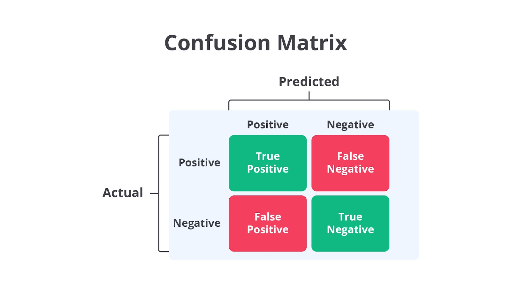
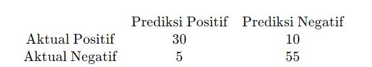
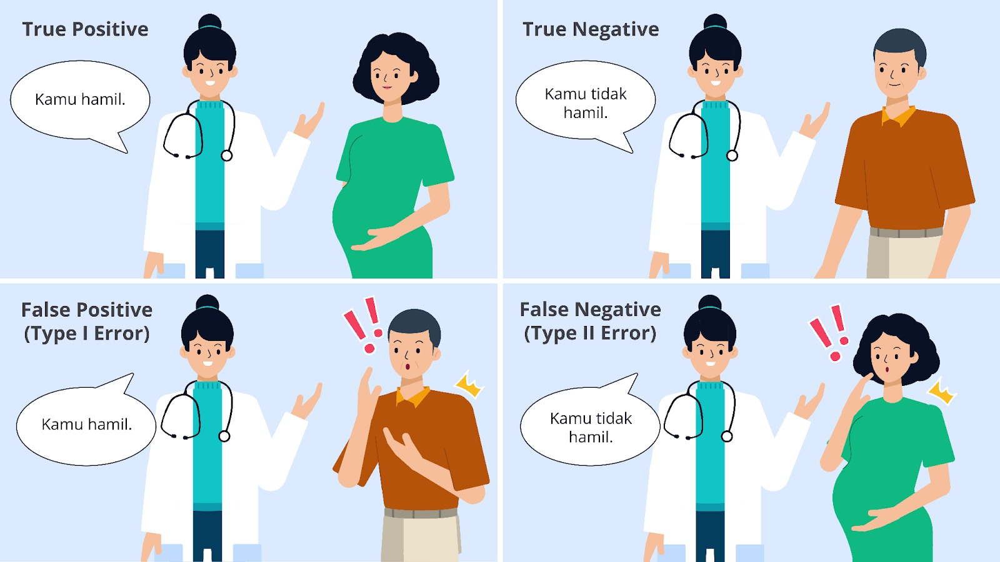
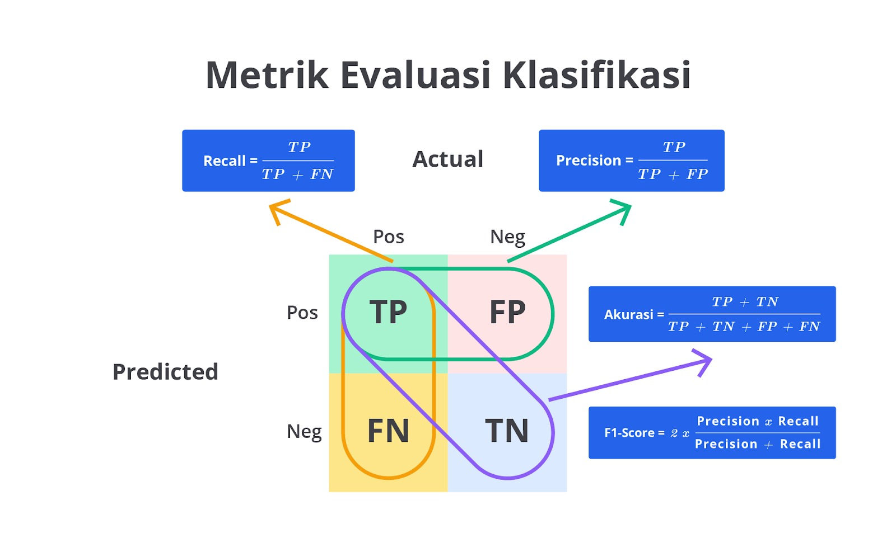
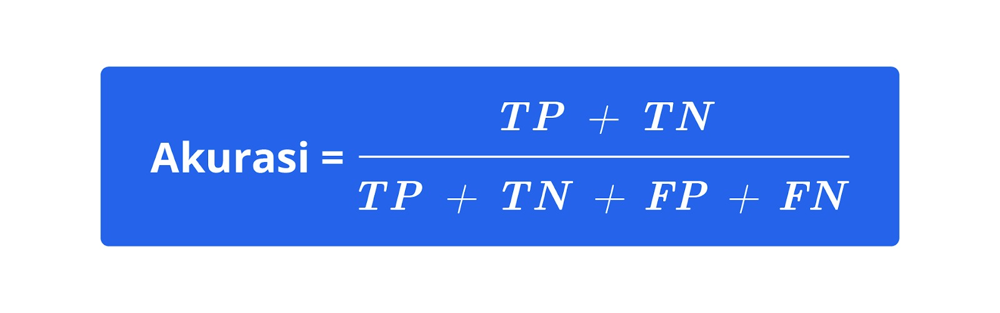
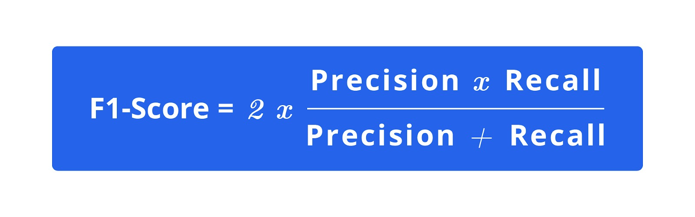
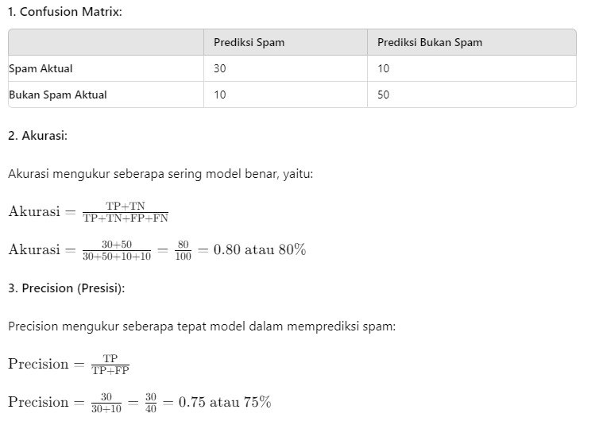
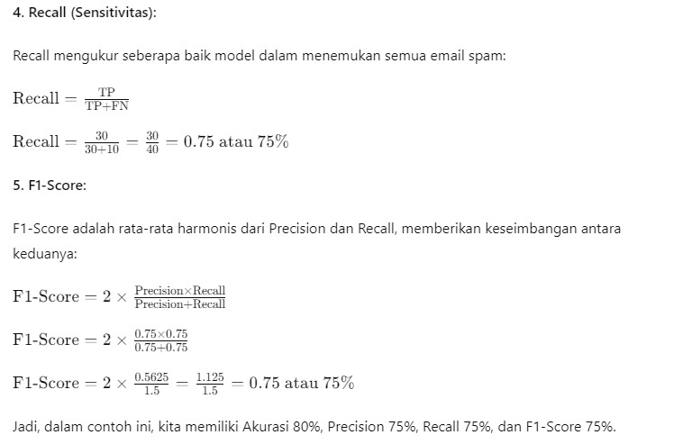

# Evaluasi Model Klasifikasi

Evaluasi model klasifikasi adalah proses penting untuk menilai seberapa baik model yang dibangun dapat memprediksi atau mengklasifikasikan data. Ini melibatkan berbagai metrik dan teknik untuk mengukur performa model serta memastikan bahwa ia bekerja dengan baik pada data yang belum pernah dilihat sebelumnya. Berikut adalah beberapa metode dan metrik yang umum digunakan dalam evaluasi model klasifikasi.

## Confusion Matrix

Confusion matrix adalah alat untuk mengevaluasi kinerja model klasifikasi dengan menunjukkan jumlah prediksi yang benar dan salah dalam format tabel. Ini memberikan pandangan yang lebih rinci tentang cara model berperforma di berbagai kelas.

Berikut adalah empat jenis evaluator dalam confusion matrix.

- True Positives (TP): jumlah kasus positif yang benar-benar diprediksi sebagai positif.
- True Negatives (TN): jumlah kasus negatif yang benar-benar diprediksi sebagai negatif.
- False Positives (FP): jumlah kasus negatif yang diprediksi sebagai positif (juga dikenal sebagai kesalahan tipe I).
- False Negatives (FN): jumlah kasus positif yang diprediksi sebagai negatif (juga dikenal sebagai kesalahan tipe II).

Contoh: Kita memiliki model untuk mendeteksi penyakit dan memiliki 100 sampel data dengan label sebenarnya sebagai positif atau negatif. Berikut adalah confusion matrix untuk model tersebut.

Di sini, model kita memprediksi 30 kasus sebagai positif dan benar-benar positif (TP), 10 kasus positif yang diprediksi sebagai negatif (FN), 55 kasus negatif yang diprediksi sebagai negatif (TN), dan 5 kasus negatif yang diprediksi sebagai positif (FP).

Berikut adalah analogi lainnya dari implementasi confusion matrix. Hehe, santai dulu dong!

Nah, bagaimana artinya?

- TP (True Positives): model benar memprediksi wanita yang hamil.
- TN (True Negatives): model benar memprediksi pria (atau wanita) yang tidak hamil.
- FP (False Positives): model salah memprediksi pria sebagai hamil atau wanita yang sebenarnya tidak hamil sebagai hamil.
- FN (False Negatives): model salah memprediksi wanita hamil sebagai tidak hamil.

Sampai di sini, apakah Anda sudah bisa memahami perbedaan masing-masing evaluatornya? Semoga lebih tercerahkan, ya!

## Metrik Evaluasi Klasifikasi

Metrik evaluasi klasifikasi digunakan untuk menilai kinerja model saat mengklasifikasikan data ke dalam kategori tertentu. Berikut adalah penjelasan rinci mengenai beberapa metrik evaluasi yang sering digunakan.

## Akurasi

Akurasi adalah metrik yang paling sederhana dan sering digunakan untuk mengukur kinerja model klasifikasi. Akurasi dihitung sebagai proporsi dari prediksi benar (baik positif maupun negatif) terhadap seluruh prediksi yang dilakukan oleh model.

Contoh: Jika model Anda membuat 100 prediksi dan 90 di antaranya benar (baik positif maupun negatif), akurasi model tersebut adalah 90%. Namun, akurasi bisa menyesatkan jika ada ketidakseimbangan kelas (misalnya, jika ada banyak lebih banyak contoh dari satu kelas dibandingkan dengan kelas lainnya).

## Precision

Precision mengukur seberapa baik model menghindari positif palsu (false positives, FP). Ini adalah rasio prediksi positif yang benar terhadap semua prediksi positif yang dibuat oleh model.

Contoh: Dalam sebuah model yang digunakan untuk mendeteksi penipuan, presisi tinggi berarti bahwa sebagian besar dari transaksi yang diklasifikasikan sebagai penipuan benar-benar merupakan penipuan, dan sangat sedikit transaksi yang tidak penipuan diklasifikasikan secara salah sebagai penipuan.

## Recall (Sensitivitas)

Recall atau sensitivitas adalah metrik yang mengukur seberapa baik model dapat menangkap semua contoh positif. Ini adalah rasio prediksi positif yang benar terhadap semua kasus positif yang sebenarnya ada dalam data.

Contoh: Dalam konteks skrining kanker, recall yang tinggi berarti model mampu mendeteksi sebagian besar dari semua kasus kanker yang ada sehingga mengurangi risiko terlewatnya diagnosis.

## F1-Score

F1-Score adalah metrik yang menggabungkan presisi dan recall menjadi satu nilai tunggal yang mempertimbangkan keduanya. F1-Score adalah rata-rata harmonis dari presisi dan recall, memberikan gambaran yang lebih baik ketika ada trade-off antara keduanya.

Contoh: F1-Score berguna dalam situasi jika ada ketidakseimbangan antara kelas positif dan negatif. Jika model memiliki presisi dan recall yang tidak seimbang, F1-Score dapat memberikan gambaran lebih akurat tentang performa keseluruhan model.

Memahami dan memilih metrik evaluasi yang tepat adalah langkah penting dalam menilai kinerja model klasifikasi. Setiap metrik, seperti akurasi, presisi, recall, dan F1-score, memberikan sudut pandang yang berbeda mengenai kinerja model dalam menangani data serta membuat prediksi. Menggunakan kombinasi metrik ini memungkinkan kita untuk mendapatkan gambaran yang lebih lengkap tentang kekuatan dan kelemahan model.

## Contoh Perhitungan Confusion Matrix, Akurasi, Recall, Precision, dan F1-Score

Misalkan kita memiliki hasil prediksi model untuk sebuah dataset dengan 100 email yang diklasifikasikan sebagai spam atau bukan spam (ham). Data aktual dan prediksi model sebagai berikut.

- True Positives (TP): 30 (Email yang benar-benar spam dan diprediksi sebagai spam.)
- False Positives (FP): 10 (Email yang sebenarnya bukan spam, tetapi diprediksi sebagai spam.)
- True Negatives (TN): 50 (Email yang benar-benar bukan spam dan diprediksi sebagai bukan spam.)
- False Negatives (FN): 10 (Email yang sebenarnya spam, tetapi diprediksi sebagai bukan spam.)

