# K-Nearest Neighbors (KNN)

Algoritma K-Nearest Neighbors (KNN) adalah metode supervised learning yang digunakan untuk mengatasi masalah klasifikasi dan regresi. Evelyn Fix dan Joseph Hodges mengembangkan algoritma ini pada tahun 1951 yang kemudian diperluas oleh Thomas Cover. KNN merupakan salah satu algoritma klasifikasi yang paling sederhana dan intuitif dalam machine learning.

Algoritma ini digunakan untuk mengklasifikasikan data baru berdasarkan kedekatannya dengan data yang sudah diberi label dalam dataset pelatihan. KNN sering digunakan karena kemudahannya dalam pemahaman dan implementasi meskipun pada praktiknya, ia dapat menjadi sangat efektif untuk berbagai masalah klasifikasi.

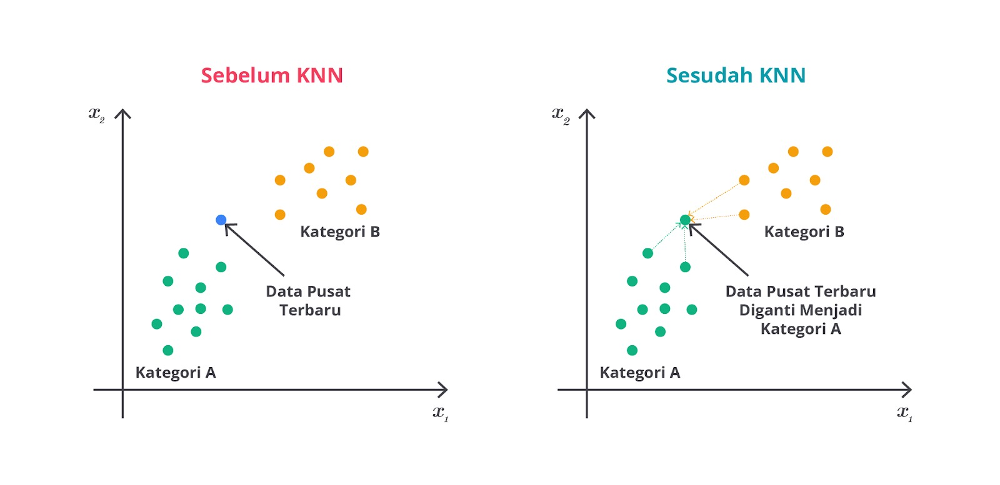

## Parameter Utama KNN

Dalam algoritma KNN, beberapa parameter utama perlu diatur untuk mengoptimalkan performa model. Inilah beberapa di antaranya.

Jumlah Tetangga (K)
Metric Jarak
Bobot (Weights)
Panjang Jarak (Distance Metric Parameters)
Normalisasi Data
Algoritma Pencarian Tetangga
Mari kita bahas lebih lengkap masing-masing parameternya!

### Jumlah Tetangga (K) atau n_neighbors (default = 5)

Parameter ini menentukan jumlah tetangga terdekat yang akan dipertimbangkan ketika membuat prediksi. Misalnya, K = 5 maka algoritma akan mencari lima tetangga terdekat dari data baru dan menggunakannya untuk menentukan kelas atau nilai prediksi.

Berikut adalah beberapa kategori jenis nilai K-nya.

- Nilai K Kecil: Jika K terlalu kecil (misalnya, K = 1), model akan sangat sensitif terhadap noise dan outlier karena hanya mempertimbangkan satu tetangga. Ini sering menyebabkan overfitting karena model terlalu sesuai dengan data pelatihan dan kurang mampu generalisasi pada data baru.
- Nilai K Besar: Jika K terlalu besar (misalnya, K = 20), model akan lebih stabil dan kurang terpengaruh oleh noise, tetapi dapat terlalu umum (underfitting). Ini akan memengaruhi hasil berdasarkan tetangga yang lebih jauh dan mengabaikan detail penting dari data pelatihan.

### Metric Jarak (default = minkowski)

Metrik jarak digunakan untuk mengukur seberapa dekat atau mirip dua titik dalam ruang fitur. Metrik yang berbeda dapat mengukur jarak atau kesamaan dengan cara berbeda. Ini memengaruhi pemilihan tetangga terdekat.

Pilihan metrik memengaruhi hasil jarak yang dihitung dari titik data dan tetangga terdekat. Metrik berbeda dapat memberikan hasil berbeda tergantung pada sifat data dan fitur yang ada.

Berikut adalah beberapa jenis metrik jarak pada KNN.

- Euclidean Distance: Ini mengukur jarak garis lurus antara dua titik dalam ruang fitur. Ini adalah jenis jarak yang paling umum digunakan. Berikut rumusnya.

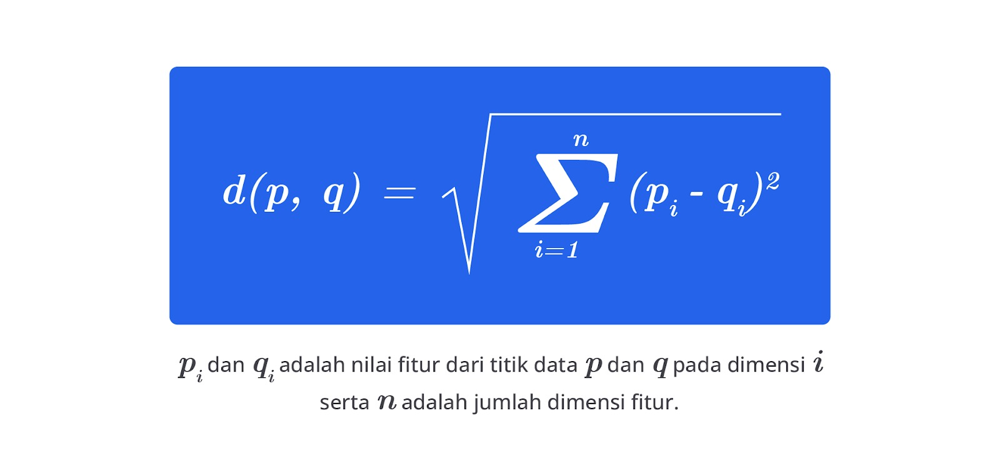

- Manhattan Distance: Ini mengukur jarak berdasarkan jumlah perbedaan sepanjang sumbu koordinat. Berikut rumusnya.

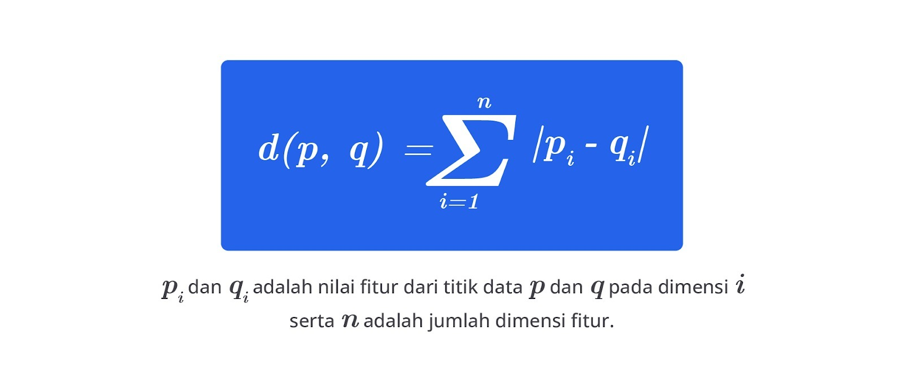

- Minkowski Distance: Generalisasi dari Euclidean dan Manhattan Distance yang bergantung pada parameter p. Berikut rumusnya.

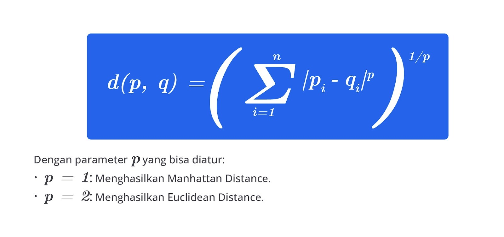

- Cosine Similarity: Ini mengukur kesamaan sudut antara dua vektor, biasanya digunakan untuk data teks. Berikut rumusnya.

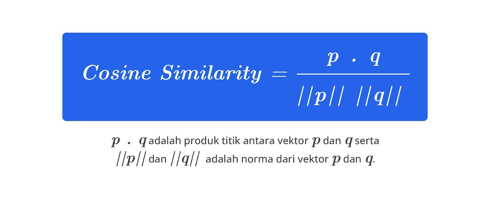

### Bobot (Weights) (default = uniform)

Bobot menentukan seberapa besar pengaruh setiap tetangga terdekat terhadap keputusan prediksi. Bobot yang diberikan akan memengaruhi keputusan akhir pada proses pelatihan. Ada dua jenis bobot yang umum digunakan.

- Uniform: Setiap tetangga dianggap memiliki pengaruh yang sama dalam menentukan hasil prediksi. Ini berarti semua tetangga, tidak peduli seberapa dekat atau jauhnya, memberikan kontribusi yang sama terhadap keputusan akhir.
- Distance: Tetangga yang lebih dekat mendapatkan bobot lebih besar, artinya, tetangga yang lebih dekat akan memberikan kontribusi lebih signifikan terhadap keputusan prediksi. Bobot dihitung terbalik sebanding dengan jarak sehingga semakin dekat tetangga, semakin besar pengaruhnya.

### Panjang Jarak (Distance Metric Parameters)

Beberapa metrik jarak menggunakan parameter tambahan untuk mengatur cara perhitungan jarak. Ini memungkinkan penyesuaian metrik jarak dengan karakteristik data. Salah satu parameter yang sering digunakan adalah parameter p (power parameter) dalam minkowski distance.

### Normalisasi Data

Normalisasi adalah proses menyesuaikan skala fitur sehingga fitur berada dalam rentang yang serupa agar perhitungan jarak menjadi adil. Normalisasi memastikan bahwa fitur dengan rentang nilai yang berbeda tidak mendominasi perhitungan jarak, yang membantu meningkatkan akurasi model KNN.

Ada dua teknik umum normalisasi data pada algoritma KNN sebagai berikut.

- Standardisasi: mengubah data sehingga memiliki mean 0 dan standar deviasi 1. Ini sering digunakan untuk membuat fitur memiliki skala yang konsisten.
- Normalisasi Min-Max: mengubah data sehingga berada dalam rentang 0 hingga 1. Ini berguna untuk data yang tidak terdistribusi secara normal.

### Algoritma Pencarian Tetangga (default = auto)

Memilih algoritma pencarian yang tepat dapat memengaruhi kecepatan dan efisiensi model KNN, terutama untuk dataset besar atau dengan banyak fitur. Jenis-jenisnya berikut.

- Brute Force: Metode sederhana yang menghitung jarak antara data baru dan setiap titik dalam dataset pelatihan secara langsung. Ini bisa sangat lambat untuk dataset besar karena kompleksitas waktu yang tinggi.
- KD-Tree: Struktur data yang membagi ruang fitur menjadi beberapa area berdasarkan dimensi fitur. Ini mempercepat pencarian tetangga terdekat dengan mengurangi jumlah perhitungan jarak yang diperlukan untuk dataset berdimensi rendah hingga sedang.
- Ball-Tree: Struktur data yang membagi ruang fitur menggunakan volume berbasis partisi, cocok untuk data berdimensi tinggi dengan performa pencarian yang lebih baik dibandingkan KD-Tree.

## Cara Kerja KNN

K-Nearest Neighbors (KNN) adalah algoritma yang sangat sederhana, tetapi efektif untuk masalah klasifikasi. KNN bekerja dengan cara mengklasifikasikan titik data baru berdasarkan mayoritas kelas dari beberapa tetangga terdekatnya dalam ruang fitur.

KNN efektif karena dapat digunakan dengan berbagai jenis data tanpa perlu asumsi rumit tentang distribusi data. Algoritma ini non-parametrik, artinya tidak perlu pelatihan khusus—hanya menyimpan data dan menghitung jarak saat prediksi. Hal ini membuat KNN fleksibel dan cocok untuk masalah klasifikasi dengan pola data yang beragam atau tidak linear.

Berikut adalah penjelasan cara kerja Algoritma KNN.

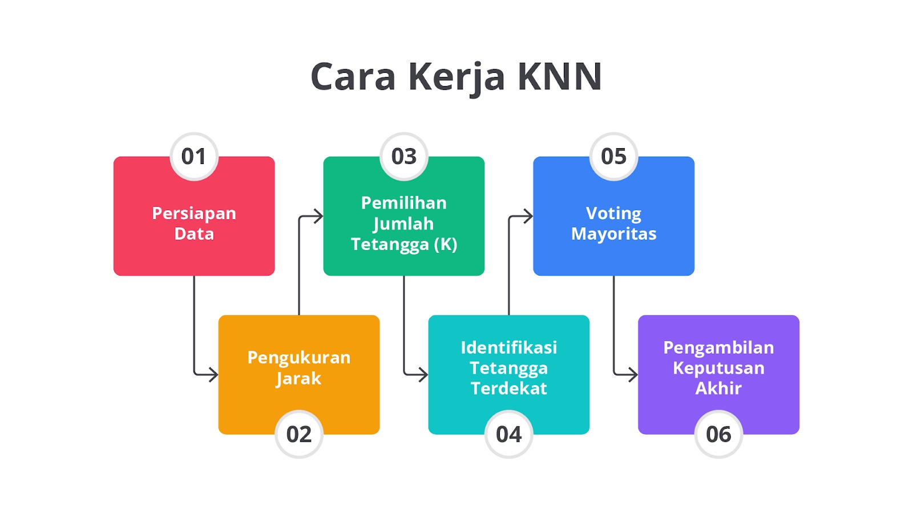

### Langkah 1: Persiapan Data

Sebelum algoritma KNN dapat digunakan, langkah pertama adalah mempersiapkan dataset. Dataset ini terdiri dari contoh-contoh data yang sudah diberi label. Setiap contoh memiliki sejumlah fitur (atribut) dan label kelas (kategori) yang diketahui.

Misalkan kita memiliki dataset yang mencakup tinggi dan berat dari beberapa individu, serta label yang menunjukkan bahwa individu tersebut tergolong sehat atau tidak sehat.

### Langkah 2: Pengukuran Jarak

Ketika ada data baru yang ingin diklasifikasikan, langkah pertama KNN adalah menghitung jarak antara data baru ini dengan setiap data lain dalam dataset pelatihan. Pengukuran jarak bertujuan untuk menentukan seberapa mirip data baru dengan data yang sudah ada.

Pengukuran jarak yang paling umum digunakan adalah euclidean distance, tetapi metode lain, seperti manhattan distance atau minkowski distance juga bisa digunakan tergantung pada jenis data.

### Langkah 3: Pemilihan Jumlah Tetangga (K)

Nilai K adalah parameter penting dalam KNN. Ini menentukan berapa banyak tetangga terdekat yang akan dipertimbangkan untuk mengklasifikasikan data baru. Pemilihan K yang tepat sangat penting untuk kinerja model.

### Langkah 4: Identifikasi Tetangga Terdekat

Setelah K ditentukan, KNN akan mengidentifikasi K tetangga terdekat dari data baru berdasarkan jarak yang telah dihitung. Tetangga terdekat adalah data-data dalam dataset pelatihan yang memiliki jarak paling kecil dengan data baru.

Contohnya, jika K = 3, KNN akan memilih tiga data yang paling dekat dengan data baru.

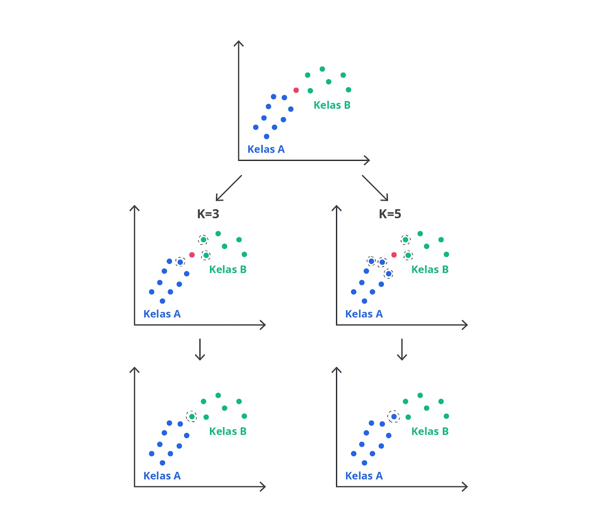

### Langkah 5: Voting Mayoritas

Setelah K tetangga terdekat diidentifikasi, langkah berikutnya adalah melakukan voting untuk menentukan kelas dari data baru. Setiap tetangga akan “memilih” kelasnya dan kelas yang mendapat suara terbanyak akan menjadi prediksi untuk data baru.

Contohnya, jika dua dari tiga tetangga terdekat memiliki label "Sehat" dan satu tetangga memiliki label "Tidak Sehat", data baru tersebut akan diklasifikasikan sebagai "Sehat" karena mayoritas tetangga terdekatnya memiliki label tersebut.

### Langkah 6: Pengambilan Keputusan Akhir

Kelas mayoritas dari tetangga terdekat inilah yang akan menjadi prediksi akhir KNN untuk data baru. Prediksi ini kemudian dapat digunakan untuk memberikan informasi atau mengambil tindakan lebih lanjut berdasarkan klasifikasi yang dilakukan.

## Kelebihan dan kekurangan KNN

Sebagaimana algoritma lainnya, KNN memiliki kelebihan dan kekurangan yang perlu dipertimbangkan sebelum diimplementasikan dalam suatu proyek. Memahami kekuatan dan kelemahan KNN sangat penting untuk menentukan algoritma ini sesuai atau tidak dengan kebutuhan spesifik dari masalah yang dihadapi.

| Kelebihan KNN                                                                                        | Kekurangan KNN                                                                                                                     |
| ---------------------------------------------------------------------------------------------------- | ---------------------------------------------------------------------------------------------------------------------------------- |
| Simpel dan Intuitif: mudah dipahami dan diimplementasikan tanpa banyak asumsi.                       | Komputasi Berat untuk Dataset Besar: perhitungan jarak untuk setiap prediksi membuat KNN lambat pada dataset besar.                |
| Non-parametrik: tidak mengasumsikan distribusi data tertentu, cocok untuk berbagai jenis data.       | Sensitif terhadap Noise: data yang tidak sesuai atau fitur yang tidak relevan dapat menurunkan akurasi prediksi.                   |
| Efektif untuk Dataset Kecil: ideal untuk dataset kecil dengan interpretasi langsung dan hasil cepat. | Memori Intensif: membutuhkan penyimpanan seluruh dataset pelatihan dalam memori, meningkatkan kebutuhan memori pada dataset besar. |

Dengan memahami waktu dan proses KNN bekerja dengan baik, pengguna dapat memanfaatkan kelebihan algoritma ini secara optimal sambil mengantisipasi tantangan yang mungkin timbul.

# Decision Tree

Decision Tree adalah algoritma machine learning yang sering digunakan dalam tugas klasifikasi dan regresi. Struktur dari algoritma ini mirip dengan bentuk pohon dengan setiap cabang mewakili keputusan atau percabangan dari data berdasarkan fitur-fitur yang ada.

Struktur dasar dari Decision Tree melibatkan tiga komponen utama, yaitu akar (root node), node (decision node), dan daun (leaf node). Root node mewakili seluruh dataset dan menjadi titik awal untuk pemisahan data. Node-node di sepanjang cabang pohon mewakili keputusan yang diambil berdasarkan fitur tertentu, sedangkan leaf node adalah hasil akhir dari proses klasifikasi atau regresi, seperti label kelas atau nilai numerik.

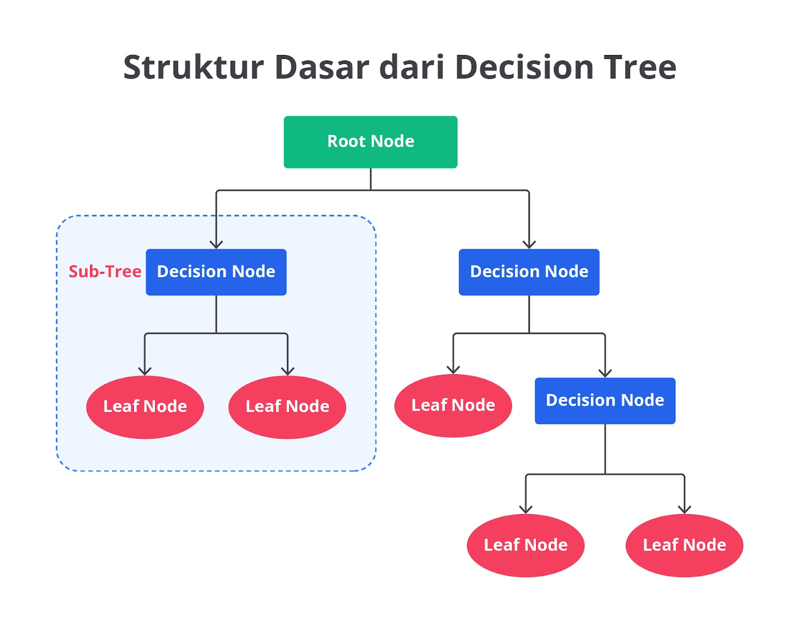

## Parameter Utama Decision Tree

Dalam algoritma Decision Tree, beberapa parameter utama perlu diatur untuk mengoptimalkan performa model. Inilah beberapa di antaranya.

- Kriteria (Criterion)
- Maksimal Kedalaman (max_depth)
- Jumlah Minimum Sampel untuk Split (min_samples_split)
- Jumlah Minimum Sampel untuk Daun (min_samples_leaf)
- Jumlah Maksimum Fitur untuk Pembagian (max_features)
- Splitter

### Kriteria (Criterion): {“gini”, “entropy”, “log_loss”}, default=”gini”

Kriteria (criterion) dalam algoritma Decision Tree adalah metode yang digunakan untuk menilai kualitas dari pembagian data pada setiap node dalam pohon keputusan. Kriteria ini membantu menentukan fitur yang harus digunakan untuk membagi data pada node tertentu dan cara terbaik pembagian tersebut dilakukan.

Ada dua jenis kriteria yang umum digunakan dan masing-masing memiliki cara unik dalam mengukur kualitas pembagian. Mari kita bahas lebih detail beberapa kriteria yang sering digunakan.

1. Gini Impurity mengukur seberapa sering suatu data dalam satu kelompok bisa salah diklasifikasikan jika kita memilih label secara acak. Gini Impurity digunakan karena mudah dan cepat dihitung serta membantu memastikan bahwa pembagian data dalam pohon keputusan (Decision Tree) menghasilkan kelompok yang paling murni atau pasti. Dengan kata lain, Gini Impurity berusaha meminimalkan kemungkinan kesalahan dalam klasifikasi pada setiap node setelah data dibagi.

Rumus Gini Impurity sebagai berikut.

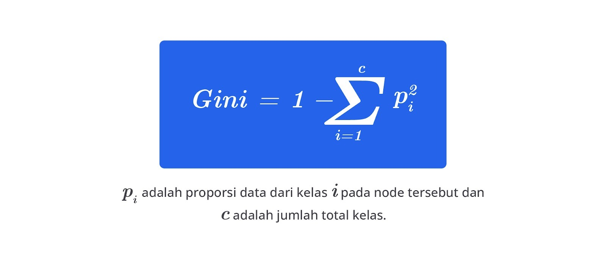

Dalam interpretasinya, Gini Impurity dibagi menjadi dua sebagai berikut.

- Gini = 0: node sepenuhnya murni (hanya memiliki satu kelas).
- Gini > 0: node mengandung campuran beberapa kelas.

2. Entropy mengukur tingkat ketidakpastian atau keacakan data dalam sebuah node. Jika data dalam node tersebar merata pada berbagai kelas, Entropy akan tinggi, menunjukkan bahwa sulit untuk memprediksi kelas data. Sebaliknya, jika data lebih terfokus pada satu kelas, Entropy rendah, artinya lebih mudah untuk memprediksi kelas data dari node tersebut.

Dalam algoritma ID3 dan C4.5, Entropy digunakan untuk menentukan cara terbaik membagi data dengan mengurangi ketidakpastian sebanyak mungkin. Jadi, algoritma akan memilih pembagian yang membuat data pada node lebih teratur dan mudah diprediksi.

Rumus Entropy sebagai berikut.

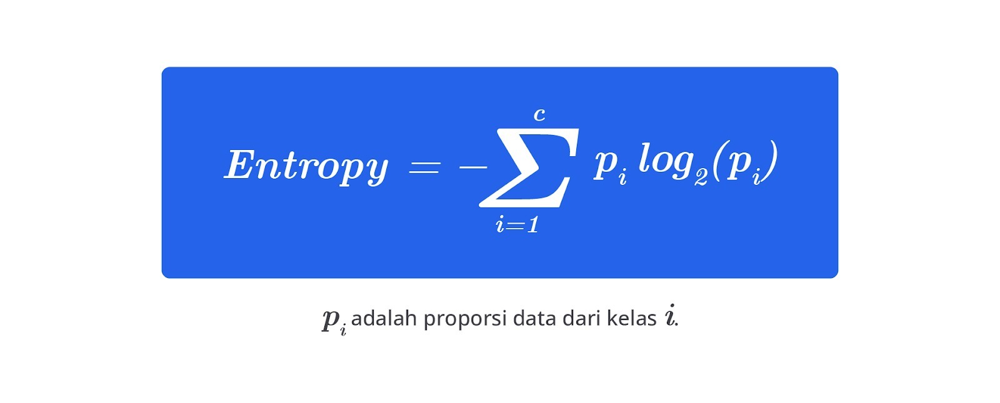

Dalam interpretasinya, Entropy dibagi menjadi dua sebagai berikut.

- Entropy = 0: node sepenuhnya murni (hanya memiliki satu kelas).
- Entropy > 0: node memiliki campuran beberapa kelas.

### Maksimal Kedalaman (max_depth): int, default=None

Parameter ini menentukan jumlah level atau "kedalaman" yang dapat dimiliki pohon keputusan. Jika nilai ini ditetapkan, pohon akan berhenti membelah data lebih lanjut setelah mencapai kedalaman yang ditentukan.

Max depth dibagi menjadi dua jenis sebagai berikut.

- Kedalaman Terbatas: Ini membatasi kedalaman pohon dapat membantu mencegah overfitting dengan menghindari pembelajaran yang terlalu spesifik terhadap data pelatihan.
- Kedalaman Tak Terbatas: Jika parameter ini diatur ke None, pohon keputusan akan terus tumbuh hingga mencapai batas alami, seperti ketika semua data pada node sudah berada di kelas yang sama atau tidak ada fitur lagi untuk dibagi.

### Jumlah Minimum Sampel untuk Split (min_samples_split): int or float, default=2

Parameter ini menentukan jumlah minimum sampel yang diperlukan pada sebuah node sebelum pembagian (split) dapat dilakukan. Dengan kata lain, sebelum pohon keputusan memutuskan untuk membagi node menjadi dua anak, node tersebut harus memiliki setidaknya jumlah sampel yang ditentukan oleh parameter ini.

Parameter ini mengatur batas minimum jumlah data yang harus ada pada sebuah node agar pohon keputusan dapat membaginya lebih lanjut. Misalnya, jika Min Samples Split diatur ke 10, sebuah node harus memiliki setidaknya 10 sampel sebelum pohon dapat membaginya.

Berikut adalah beberapa kategori jenis nilai min samples split.

- Nilai Kecil (misalnya, 2): Dengan nilai kecil, pohon keputusan bisa membagi node meskipun hanya memiliki sedikit sampel.
- Nilai Besar (misalnya, 20 atau lebih): Dengan nilai yang lebih besar, pohon keputusan akan memerlukan lebih banyak sampel pada setiap node sebelum dapat membaginya.

### Jumlah Minimum Sampel untuk Daun (min_samples_leaf): int or float, default=1

Parameter ini menentukan jumlah minimum sampel yang harus ada pada sebuah leaf node. Leaf node adalah node akhir dalam pohon keputusan yang memberikan prediksi akhir atau keputusan. Parameter ini membantu mengontrol ukuran minimum dari setiap ‘daun’.

Berikut adalah beberapa kategori jenis nilai min samples leaf.

- Nilai Kecil (misalnya, 1): Dengan nilai kecil, setiap leaf node bisa saja hanya berisi sedikit sampel, yang memungkinkan pohon untuk membagi data dengan sangat rinci.
- Nilai Besar (misalnya, 5 atau 10): Dengan nilai yang lebih besar, setiap leaf node harus berisi setidaknya jumlah sampel yang ditentukan.

### Jumlah Maksimum Fitur untuk Pembagian (max_features): int, float or {“sqrt”, “log2”}, default=None

Parameter ini menentukan jumlah maksimum fitur yang akan dipertimbangkan untuk pembagian pada setiap node. Ini mengontrol seberapa banyak fitur yang dipertimbangkan untuk menentukan pemisahan terbaik pada node tertentu.

Berikut adalah beberapa kategori jenis nilai max features.

- Nilai Kecil (misalnya, 3 atau 5): Dengan nilai kecil, hanya sebagian fitur yang dipertimbangkan saat memilih pembagian terbaik.
- Nilai Besar (misalnya, semua fitur): Dengan nilai yang lebih besar atau setara dengan jumlah fitur total, pohon akan mempertimbangkan semua fitur untuk menentukan pembagian terbaik.

### Splitter: {“best”, “random”}, default=”best”

Parameter ini menentukan metode yang digunakan untuk memilih pembagian terbaik pada setiap node. Berikut adalah beberapa kategori jenis nilai splitter.

- Best: Metode ini mencari pembagian yang memberikan hasil terbaik berdasarkan kriteria (seperti Gini Impurity atau Entropy). Ini memastikan bahwa setiap pembagian dilakukan untuk memaksimalkan informasi yang diperoleh dari split tersebut.
- Random: Metode ini memilih pembagian secara acak dari subset fitur. Ini bisa mempercepat proses pelatihan dengan mengurangi waktu yang diperlukan untuk memilih split terbaik, tetapi bisa kurang akurat dibandingkan dengan metode "Best".

## Cara Kerja Decision Tree

Decision Tree adalah algoritma machine learning yang populer digunakan untuk klasifikasi dan regresi. Algoritma ini bekerja dengan membagi data menjadi subset yang lebih kecil berdasarkan fitur tertentu hingga mencapai keputusan akhir pada node daun. Proses ini berlangsung secara bertahap dan sistematis, menjadikannya alat yang kuat untuk memahami struktur data serta membuat keputusan berdasarkan fitur yang relevan.

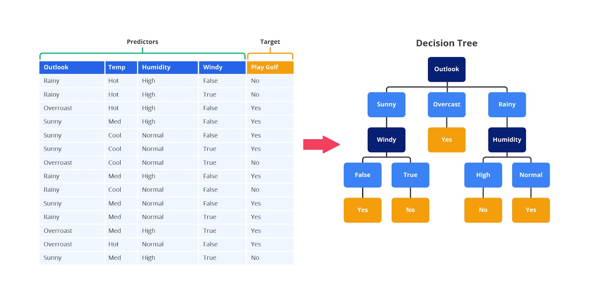

### Langkah 1: Pemisahan Data Awal

Proses dimulai dengan memuat seluruh dataset yang akan digunakan untuk pelatihan. Data ini terdiri dari berbagai fitur (seperti ukuran, warna, atau harga) dan label atau target yang ingin diprediksi (seperti jenis buah atau status kredit). Decision Tree memulai dengan membagi data ini berdasarkan fitur-fitur untuk membentuk pohon keputusan.

### Langkah 2: Pemilihan Fitur dan Pembagian Data

Setiap node dalam Decision Tree memilih fitur yang paling relevan untuk membagi data menjadi dua atau lebih subset. Pemilihan fitur ini dilakukan berdasarkan kriteria tertentu, seperti Gini Impurity, Entropy, atau variansi. Proses ini bertujuan untuk memaksimalkan pemisahan data yang bersih berdasarkan kelas atau nilai target.

Berikut adalah dua metode yang dapat digunakan.

- Gini Impurity: mengukur seberapa sering sampel yang dipilih secara acak dari subset akan dikelompokkan dengan salah jika label dipilih secara acak. Pohon akan memilih fitur yang meminimalkan Gini Impurity setelah split.
- Entropy: mengukur ketidakpastian dalam data. Pohon akan memilih fitur yang memaksimalkan pengurangan Entropy atau penurunan ketidakpastian.

### Langkah 3: Pembentukan Cabang dan Node

Setelah fitur yang paling relevan dipilih, data dibagi berdasarkan nilai fitur tersebut. Setiap cabang dari node mewakili satu hasil pembagian ini. Proses ini diulang secara rekursif pada setiap subset yang dihasilkan hingga kondisi berhenti terpenuhi, seperti berikut.

-Jumlah Minimum Sampel untuk Daun: ketika jumlah sampel pada node mencapai angka minimum yang telah ditentukan.

- Kedalaman Maksimum Pohon: ketika kedalaman pohon mencapai batas yang telah ditetapkan.
- Semua Sampel dalam Node Memiliki Kelas yang Sama: ketika semua sampel dalam node memiliki label yang sama.

### Langkah 4: Pembuatan Leaf Node

Setelah pohon mencapai kondisi berhenti, node terakhir pada pohon disebut leaf node. Leaf node memberikan hasil akhir dari prediksi atau keputusan. Untuk klasifikasi, ini adalah kelas yang paling sering muncul dalam data yang sampai pada node tersebut. Untuk regresi, ini adalah nilai rata-rata atau median dari target pada node tersebut.

### Langkah 5: Penggunaan Model untuk Prediksi

Ketika ingin menggunakan pohon keputusan untuk membuat prediksi, kita mengikuti langkah-langkah berikut. Pertama, data baru dimulai dari bagian paling atas pohon, yang disebut root node.

Kemudian, kita periksa nilai fitur dari data baru dan mengikuti cabang yang sesuai dengan pohon berdasarkan nilai tersebut. Proses ini dilanjutkan hingga data mencapai leaf node di bagian bawah pohon. Leaf node ini memberikan hasil akhir dari prediksi. Jadi, untuk setiap data baru, pohon keputusan membantu menentukan kategori atau nilai dengan melihat ke bagian akhir pohon.

### Langkah 6: Evaluasi dan Penyesuaian

Setelah pohon dibangun, model akan dievaluasi untuk memastikan bahwa ia memberikan hasil yang baik. Evaluasi dilakukan dengan menggunakan data uji dan berbagai metrik evaluasi, seperti akurasi, precision, recall, atau mean squared error.

Jika diperlukan, pohon dapat disesuaikan, misalnya, dengan melakukan pruning (memotong bagian pohon yang kurang penting) untuk meningkatkan generalisasi dan mengurangi risiko overfitting.

Dengan mengikuti langkah-langkah ini, Decision Tree dapat membagi data secara sistematis dan membuat keputusan yang didasarkan pada fitur-fitur paling relevan serta menghasilkan model untuk berbagai aplikasi dalam klasifikasi dan regresi.

## Kelebihan dan Kekurangan Decision Tree

Decision Tree adalah salah satu algoritma machine learning yang populer, digunakan untuk berbagai tugas klasifikasi dan regresi. Seperti halnya algoritma lainnya, Decision Tree memiliki kelebihan dan kekurangan yang memengaruhi cara serta waktu algoritma ini paling efektif digunakan.

Memahami aspek-aspek ini sangat penting untuk memilih algoritma yang tepat berdasarkan karakteristik data dan tujuan analisis. Berikut adalah tabel yang merangkum kelebihan dan kekurangan dari Decision Tree untuk memberikan gambaran lebih jelas mengenai kekuatan dan batasan metode ini.

| Kelebihan Decision Tree                                                                                                                                          | Kekurangan Decision Tree                                                                                                                                                |
| ---------------------------------------------------------------------------------------------------------------------------------------------------------------- | ----------------------------------------------------------------------------------------------------------------------------------------------------------------------- |
| Mudah Dipahami dan Ditafsirkan: menghasilkan model mudah dipahami karena strukturnya yang berbentuk pohon.                                                       | Terlalu ‘Fleksibel’: sering kali menghasilkan model yang sangat kompleks sehingga menyebabkan overfitting.                                                              |
| Dapat Menangani Data Kategorikal dan Numerik: dapat menangani berbagai jenis data, baik data numerik maupun kategorikal, tanpa memerlukan banyak pra-pemrosesan. | Sensitif terhadap Noise: dapat memengaruhi keputusan pohon, membuat model kurang akurat.                                                                                |
| Tidak Memerlukan Skala Fitur: tidak memerlukan normalisasi atau standardisasi fitur, yang memudahkan penggunaannya pada data tidak terstandardisasi.             | Pohon yang Terlalu Besar: jika tidak dikendalikan, pohon bisa tumbuh sangat besar serta menjadi sangat rumit, yang dapat memperlambat proses prediksi dan interpretasi. |
| Fleksibel dan Dapat Disesuaikan: dapat mudah disesuaikan untuk berbagai masalah dengan menyesuaikan parameter dan kriteria pembagian.                            | Pohon Tidak Stabil: perubahan kecil pada data pelatihan bisa menyebabkan perubahan besar dalam struktur pohon sehingga model bisa tidak stabil.                         |

Dengan mempertimbangkan kelebihan dan kekurangan ini, Anda dapat menentukan pilihan bahwa Decision Tree adalah algoritma yang tepat atau tidak untuk masalah klasifikasi atau regresi yang sedang dihadapi dan cara mengoptimalkan penggunaannya untuk hasil terbaik.

# Random Forest

Random Forest adalah algoritma ensemble learning yang menggabungkan beberapa Decision Tree untuk meningkatkan akurasi prediksi dan mengurangi risiko overfitting. Setiap pohon dalam Random Forest dilatih menggunakan subset acak dari data pelatihan dan subset acak dari fitur yang tersedia. Hasil akhir prediksi ditentukan melalui voting (untuk klasifikasi) atau rata-rata (untuk regresi) dari hasil semua pohon dalam model.

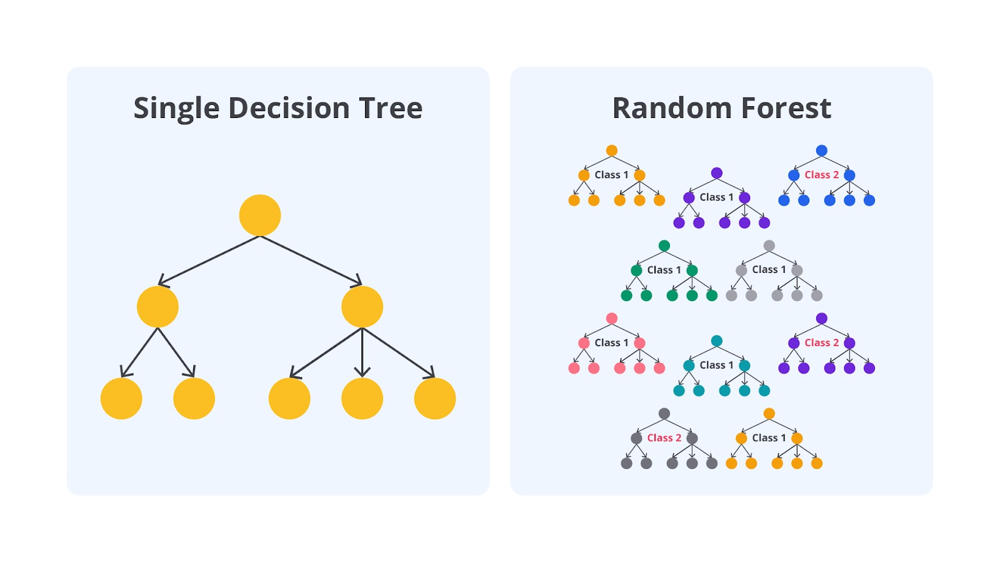

Tujuan utama Random Forest adalah mengatasi kelemahan Decision Tree yang cenderung overfit terhadap data pelatihan. Dengan menggabungkan prediksi dari banyak pohon, Random Forest mampu menghasilkan model yang lebih stabil, akurat, dan lebih general terhadap data baru.

## Parameter Utama Random Forest

Dalam algoritma Random Forest, beberapa parameter utama perlu diatur untuk mengoptimalkan performa model. Inilah beberapa di antaranya.

- n_estimators
- Maksimal Kedalaman (max_depth)
- Jumlah Minimum Sampel untuk Split (min_samples_split)
- Jumlah Minimum Sampel untuk Daun (min_samples_leaf)
- Jumlah Maksimum Fitur untuk Pembagian (max_features)
- bootstrap
- random_state

Mari kita bahas lebih lengkap masing-masing parameternya!

### n_estimators: int, default=100

n_estimators adalah parameter yang menentukan jumlah Decision Tree (pohon keputusan) yang akan dibangun dalam model Random Forest. Semakin banyak pohon yang digunakan, model cenderung lebih stabil dan akurat karena setiap pohon memberikan kontribusi pada hasil akhir melalui proses voting atau averaging. Nilai default-nya adalah 100.

Jika n_estimators terlalu rendah, model tidak cukup kuat untuk menangkap pola dalam data. Sebaliknya, jika terlalu tinggi, waktu komputasi dan penggunaan memori akan meningkat tanpa peningkatan yang signifikan dalam performa.

Disarankan untuk mengatur n_estimators menjadi nilai yang cukup tinggi, tetapi tidak terlalu tinggi sehingga mengorbankan efisiensi komputasi. Nilai yang disarankan adalah antara 100 hingga 300 karena sering mendapatkan hasil cukup baik dalam praktiknya.

### Maksimal Kedalaman (max_depth): int, default=None

max_depth mengatur kedalaman maksimum dari setiap Decision Tree dalam Random Forest. Pohon yang lebih dalam dapat menangkap lebih banyak informasi dari data, tetapi jika terlalu dalam, pohon bisa overfit terhadap data pelatihan. Nilai default adalah None yang berarti pohon akan tumbuh sampai semua node adalah murni atau sampai jumlah sampel minimum pada node kurang dari min_samples_split.

Mengatur batas kedalaman dapat mencegah overfitting dan menghasilkan model yang lebih general. Namun, kedalaman yang terlalu dangkal dapat menyebabkan underfitting. Gunakan cross-validation untuk menemukan nilai max_depth yang optimal. Pohon dengan kedalaman 10–20 sering kali cukup dalam untuk menangkap informasi yang diperlukan tanpa terlalu overfitting.

### Jumlah Minimum Sampel untuk Split (min_samples_split): int or float, default=2

min_samples_split adalah jumlah minimum sampel yang diperlukan untuk membagi sebuah node dalam Decision Tree. Jika jumlah sampel dalam sebuah node kurang dari nilai ini, node tersebut tidak akan dibagi lagi dan akan menjadi leaf node. Nilai default-nya adalah 2.

Nilai yang lebih tinggi dari min_samples_split membuat pohon lebih sederhana, mencegah pohon tumbuh terlalu kompleks, dan mengurangi risiko overfitting. Sebaliknya, nilai terlalu rendah dapat menghasilkan pohon yang terlalu terpecah, menangkap noise dari data. Nilai lebih besar dapat digunakan jika Anda memiliki data yang sangat besar atau data yang cenderung noisy.

### Jumlah Minimum Sampel untuk Daun (min_samples_leaf): int or float, default=1

min_samples_leaf adalah jumlah minimum sampel yang diperlukan untuk berada pada leaf node (node daun). Sama seperti min_samples_split, tetapi berfungsi pada level leaf node. Ini membantu memastikan bahwa setiap leaf node berisi cukup sampel untuk memberikan prediksi yang dapat diandalkan.

Nilai default-nya adalah 1. Nilai antara 1 hingga 5 sering kali digunakan, tergantung pada ukuran dataset dan jumlah fitur. Nilai lebih tinggi mengarah pada pohon yang lebih halus dan generalisasi lebih baik, terutama untuk dataset yang sangat besar. Namun, terlalu besar dapat menyebabkan underfitting.

### Jumlah Maksimum Fitur untuk Pembagian (max_features): {“sqrt”, “log2”, None}, int or float, default=”sqrt”

max_features menentukan jumlah maksimum fitur yang dipertimbangkan untuk pemisahan pada setiap node. Dengan memilih subset acak dari fitur, setiap pohon dalam Random Forest memiliki pohon yang sedikit berbeda, mengurangi korelasi antar pohon dan meningkatkan generalisasi. Default-nya adalah sqrt (akar kuadrat dari jumlah total fitur) untuk tugas klasifikasi dan log2 untuk tugas regresi.

Nilai default biasanya sudah cukup baik, tetapi jika memiliki data dengan banyak fitur, Anda bisa bereksperimen dengan nilai yang lebih tinggi atau lebih rendah untuk melihat dampaknya pada akurasi.

### bootstrap: bool, default=True

bootstrap adalah parameter yang menentukan bahwa sampel akan diambil dengan penggantian ketika membangun setiap Decision Tree. Jika bootstrap=True, setiap pohon dilatih menggunakan subset acak dari data secara bergantian. Ini adalah esensi dari metode bagging.

Menggunakan bootstrap meningkatkan variasi antar pohon dan umumnya menghasilkan model yang lebih kuat. Jika bootstrap=False, setiap pohon akan dilatih pada seluruh dataset, yang dapat menghasilkan pohon yang lebih mirip satu sama lain. Default True hampir selalu digunakan karena menghasilkan model yang lebih general.###

### random_state: int, RandomState instance or None, default=None

random_state adalah parameter yang mengontrol pengacakan yang digunakan oleh algoritma. Dengan menetapkan random_state, Anda memastikan bahwa hasil model akan konsisten setiap kali dijalankan berdasarkan kondisi yang sama. Nilai default adalah None yang berarti pengacakan tidak dikendalikan dan hasilnya dapat berbeda setiap kali model dijalankan.

## Cara Kerja Random Forest

Pada penjelasan ini, kita akan membahas cara kerja Random Forest dan alasan algoritma ini sangat efektif dalam menangani masalah machine learning yang kompleks.

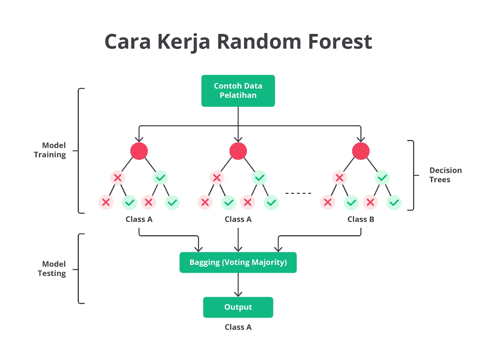

### Langkah 1: Pengambilan Sampel Data

Random Forest memulai dengan mengambil beberapa sampel acak dari dataset pelatihan asli. Setiap sampel diambil dengan teknik bootstrap, yaitu pengambilan sampel dengan penggantian sehingga beberapa data bisa muncul lebih dari sekali dalam satu sampel.

### Langkah 2: Pembentukan Decision Tree

Untuk setiap sampel data yang diambil, Random Forest membangun Decision Tree. Pada setiap node dalam pohon, subset acak dari fitur dipilih untuk menemukan fitur terbaik saat membagi data pada node tersebut. Pemilihan fitur ini dilakukan untuk memastikan bahwa setiap pohon dalam hutan sedikit berbeda satu sama lain.###

### Langkah 3: Proses Training/Pembelajaran

Setiap Decision Tree dibangun hingga mencapai kedalaman maksimum atau sampai tidak ada pembagian lebih lanjut yang mungkin dilakukan, tergantung pada parameter, seperti max_depth atau min_samples_split. Setiap pohon belajar dari data dengan membuat keputusan berdasarkan fitur-fitur yang dipilih secara acak.###

### Langkah 4: Agregasi Prediksi

Setelah semua pohon dibangun, Random Forest menggunakan hasil dari setiap pohon untuk membuat prediksi. Untuk tugas klasifikasi, setiap pohon memberikan suara (voting) untuk kelas tertentu, dan yang paling banyak dipilih akan menjadi prediksi akhir.

### Langkah 5: Evaluasi Model

Model Random Forest kemudian dievaluasi berdasarkan performanya dalam data uji atau melalui teknik validasi silang. Karena Random Forest menggabungkan prediksi dari banyak pohon, model ini biasanya lebih akurat dan lebih tahan terhadap overfitting dibandingkan dengan Decision Tree tunggal.

### Langkah 6: Penerapan Model

Setelah model dilatih dan dievaluasi, model Random Forest yang sudah terbentuk digunakan untuk membuat prediksi pada data baru. Data baru ini akan melewati semua pohon dalam hutan dan hasil akhir akan ditentukan berdasarkan agregasi prediksi dari semua pohon tersebut.

Melalui langkah-langkah ini, Random Forest menghasilkan model kuat serta fleksibel untuk berbagai tugas klasifikasi dan regresi dengan kelebihan berupa stabilitas serta kemampuan dalam menangani data yang memiliki kompleksitas tinggi.

## Kelebihan dan Kekurangan Random Forest

Random Forest adalah algoritma machine learning yang populer serta banyak digunakan dalam berbagai aplikasi untuk tugas klasifikasi dan regresi. Metode ini menggabungkan kekuatan dari banyak pohon keputusan untuk menghasilkan model yang kuat dan akurat. Memahami kelebihan serta kekurangan Random Forest sangat penting untuk menentukan waktu dan cara algoritma ini dapat digunakan secara efektif dalam proyek machine learning. Berikut kelebihan dan kekurangannya.

| Kelebihan Random Forest                                                                                            | Kekurangan Random Forest                                                                                  |
| ------------------------------------------------------------------------------------------------------------------ | --------------------------------------------------------------------------------------------------------- |
| Akurasi tinggi: sering memberikan akurasi yang sangat baik karena menggabungkan banyak pohon keputusan.            | Kebutuhan Memori yang Tinggi: memerlukan memori besar, terutama dengan banyak pohon.                      |
| Robust terhadap Overfitting: mengurangi risiko overfitting dengan menggabungkan hasil dari banyak pohon keputusan. | Interpretabilitas yang Rendah: model sulit diinterpretasikan dibandingkan dengan pohon keputusan tunggal. |
| Kemampuan Menangani Data Tidak Seimbang: dapat menangani data dengan kelas yang tidak seimbang secara baik.        | Lambat pada Prediksi: prediksi bisa lambat jika model memiliki banyak pohon dan dataset besar.            |
| Menangani Data yang Hilang: dapat mengisi nilai yang hilang dengan rata-rata atau median.                          | Kurang Efektif pada Data Kecil: mungkin tidak memberikan manfaat signifikan pada dataset kecil.           |
| Fitur Penting: memberikan informasi tentang pentingnya fitur, membantu dalam feature selection.                    | Waktu Pelatihan yang Lama: tuning hyperparameter bisa memerlukan waktu dan usaha ekstra.                  |

Dengan mempertimbangkan kelebihan dan kekurangan ini, Anda dapat menentukan pilihan bahwa Random Forest adalah algoritma yang tepat atau tidak untuk masalah klasifikasi atau regresi yang sedang dihadapi. Anda juga dapat menentukan cara mengoptimalkan penggunaannya untuk hasil terbaik.

# Support Vector Machine (SVM)

Support vector machine (SVM) adalah salah satu algoritma machine learning yang digunakan untuk klasifikasi dan regresi. Namun, SVM lebih sering digunakan pada masalah klasifikasi. SVM bekerja dengan mencari hyperplane yang optimal untuk memisahkan data ke dalam kelas-kelas yang berbeda. Hyperplane adalah garis (pada data dua dimensi) atau bidang (pada data tiga dimensi) yang memisahkan data dari kelas berbeda. Tujuan SVM adalah menemukan hyperplane yang memaksimalkan margin, yaitu jarak antara hyperplane dan titik data terdekat dari setiap kelas.

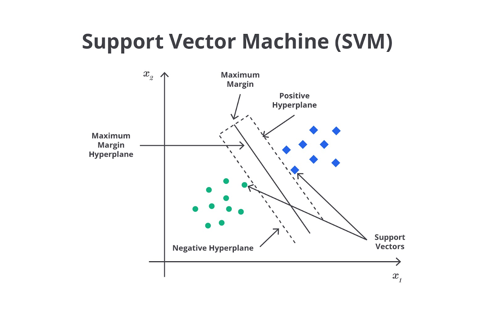

Parameter Utama SVM
Dalam algoritma SVM, beberapa parameter utama perlu diatur untuk mengoptimalkan performa model. Inilah beberapa di antaranya.

- Kernel
- Gamma
- Regularization (c)
- Degree
- Mari kita bahas lebih lengkap masing-masing parameternya!

## Kernel: {‘linear’, ‘poly’, ‘rbf’, ‘sigmoid’, ‘precomputed’} or callable, default=’rbf’

Kernel adalah fungsi yang memainkan peran penting dalam SVM, terutama ketika data tidak dapat dipisahkan secara linear di ruang aslinya. Kernel memungkinkan SVM untuk mengubah atau memetakan data dari ruang input berdimensi rendah ke ruang fitur berdimensi tinggi atau data tersebut bisa dipisahkan secara linear. Konsep ini dikenal sebagai kernel trick, yang memungkinkan perhitungan dilakukan di ruang fitur tanpa secara eksplisit menghitung koordinat dalam ruang tersebut.

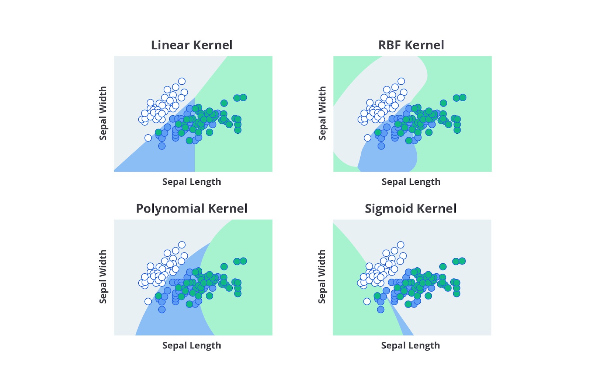

Berikut adalah penjelasan detail tentang beberapa jenis kernel yang sering digunakan.

1. Linear Kernel
   Linear kernel adalah pilihan sederhana yang tidak memetakan data ke ruang yang lebih tinggi, tetapi menggunakan data sebagaimana adanya. Kernel ini digunakan untuk data yang dapat dipisahkan secara linear. Berikut persamaannya.

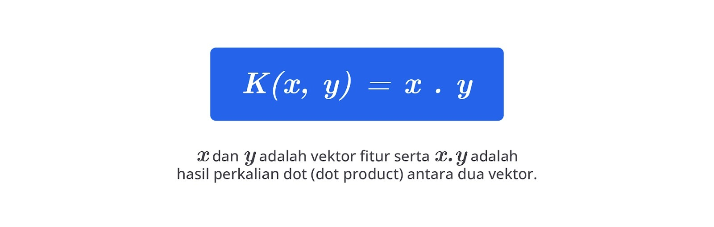

Linear kernel biasanya digunakan ketika jumlah fitur jauh lebih besar daripada jumlah sampel, misalnya pada teks klasifikasi dengan ribuan fitur (kata-kata) dalam dokumen.

2. Polynomial Kernel
   Polynomial kernel mengubah data ke ruang berdimensi lebih tinggi menggunakan fungsi polinomial. Ini adalah generalisasi dari linear kernel dan dapat menangani interaksi non-linear antara fitur. Berikut persamaannya.

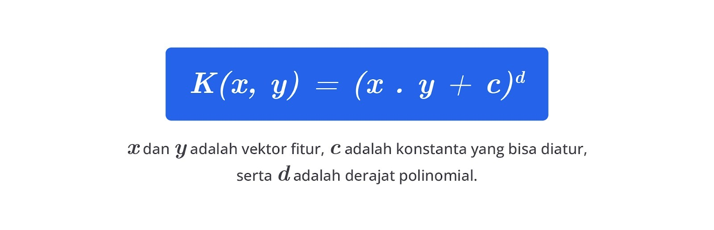

Kernel polinomial digunakan ketika hubungan antara kelas tidak linear dan dapat direpresentasikan oleh polinomial.

3. Radial Basis Function (RBF) Kernel
   RBF kernel (juga dikenal sebagai Gaussian kernel) adalah kernel yang sangat populer karena kemampuannya untuk menangani data yang tidak dapat dipisahkan secara linear. Kernel ini memetakan data ke ruang fitur berdimensi sangat tinggi. Berikut persamaannya.

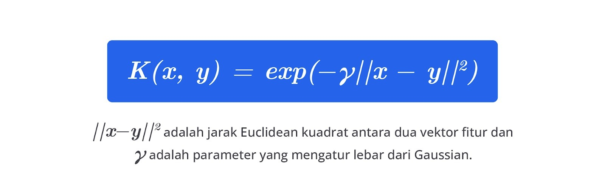
Kernel RBF cocok untuk data yang memiliki batas pemisah non-linear, seperti dalam masalah klasifikasi dengan pola kompleks.

4. Sigmoid Kernel
   Sigmoid kernel sering dianggap sebagai fungsi aktivasi dalam jaringan saraf dan penggunaannya pada SVM memberikan perilaku yang mirip dengan model jaringan saraf. Berikut persamaannya.

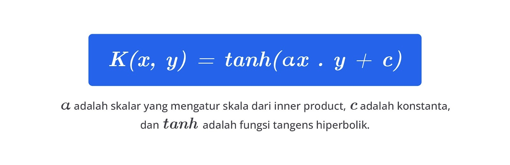

Kernel sigmoid digunakan ketika data memiliki batas non-linear yang menyerupai perilaku aktivasi sigmoid dalam jaringan saraf.

## Gamma (): {‘scale’, ‘auto’} or float, default=’scale’

Parameter gamma pada SVM adalah faktor penting yang mengatur seberapa besar pengaruh setiap titik data dalam menentukan keputusan model, terutama saat menggunakan kernel, seperti RBF, polynomial, atau sigmoid.

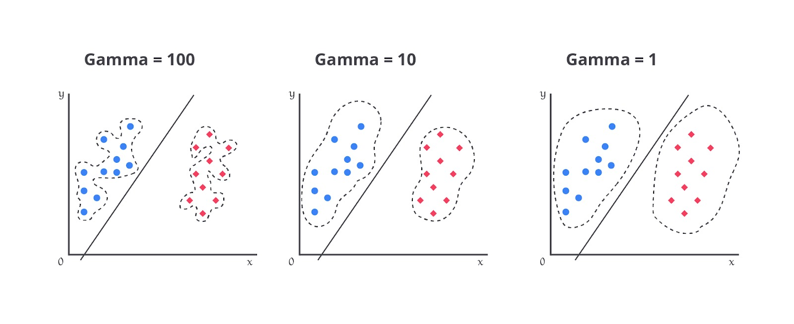

Ada beberapa cara untuk mengatur nilai gamma.

- Gamma 'scale' (default): nilai gamma ini dihitung otomatis dengan mempertimbangkan jumlah fitur dan variasi dalam data. Pendekatan ini biasanya lebih stabil dan cocok untuk berbagai jenis data karena menyesuaikan nilai gamma berdasarkan distribusi data.
- Gamma 'auto': nilai gamma ini juga dihitung otomatis, tetapi hanya berdasarkan jumlah fitur dalam data. Meskipun sederhana, pendekatan ini mungkin kurang adaptif, terutama jika data memiliki skala fitur yang sangat berbeda.
- Gamma float: pengguna dapat menetapkan nilai gamma secara manual. Ini memberikan fleksibilitas penuh, memungkinkan penyesuaian yang spesifik untuk data tertentu, tetapi memerlukan eksperimen lebih lanjut untuk menemukan nilai optimal.

Dengan kata lain, gamma menentukan seberapa jauh dampak dari satu titik data akan terasa pada model SVM, yang sangat memengaruhi kemampuan model dalam mengklasifikasikan data secara akurat.

## Regularization (C): float, default=1.0

Regularization Parameter (C) adalah parameter dalam SVM yang mengontrol kekuatan regularisasi pada model. Regularisasi adalah teknik yang digunakan untuk mencegah overfitting dengan menambahkan penalti pada kompleksitas model. Kekuatan regularisasi berbanding terbalik dengan nilai C.

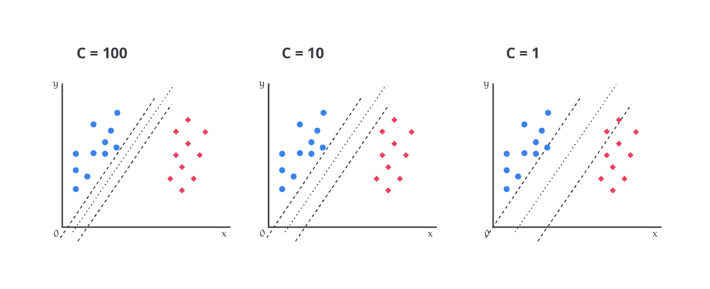

Dengan kata lain, semakin besar nilai C, semakin sedikit regularisasi yang diterapkan dan model akan berusaha keras untuk mengklasifikasikan semua data dengan benar. Bahkan, jika itu berarti memiliki margin yang lebih kecil. Sebaliknya, nilai C yang lebih kecil akan meningkatkan kekuatan regularisasi dan menghasilkan margin lebih besar dengan mengizinkan beberapa kesalahan dalam klasifikasi.

## Degree

Parameter degree dalam SVM berlaku khusus untuk kernel polinomial. Parameter ini menentukan derajat polinomial untuk memetakan data dari ruang fitur asli ke ruang fitur yang lebih tinggi. Dengan kata lain, degree mengontrol kompleksitas dari fungsi polinomial yang digunakan dalam kernel polinomial.

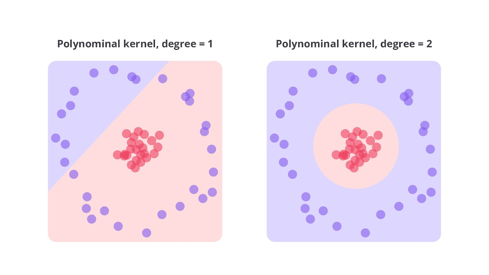

Dalam kernel polinomial pada SVM, perbedaan antara degree 1 dan degree 2 terletak pada kompleksitas fungsi polinomial untuk memetakan data ke ruang fitur yang lebih tinggi. Dengan degree 1, kernel polinomial menghasilkan fungsi linier yang sederhana, setara dengan menggunakan kernel linier sehingga cocok untuk data yang dapat dipisahkan secara linier.

Model ini lebih cepat dan cenderung menghindari overfitting karena kesederhanaannya. Sebaliknya, degree 2 menggunakan fungsi polinomial kuadrat. Ini memungkinkan model untuk menangkap hubungan non-linier yang lebih kompleks dalam data. Ini berguna untuk data dengan pola kuadratik atau hubungan non-linier lainnya.

Namun, peningkatan kompleksitas ini juga meningkatkan risiko overfitting, terutama jika data tidak cukup untuk mendukung model yang lebih rumit. Dengan demikian, pemilihan degree yang tepat bergantung pada karakteristik data dan tujuan analisis.

## Cara Kerja SVM

Dalam penjelasan ini, kita akan menguraikan cara SVM membangun model klasifikasi secara optimal dan memperluas kemampuannya untuk menyelesaikan masalah klasifikasi yang lebih kompleks.

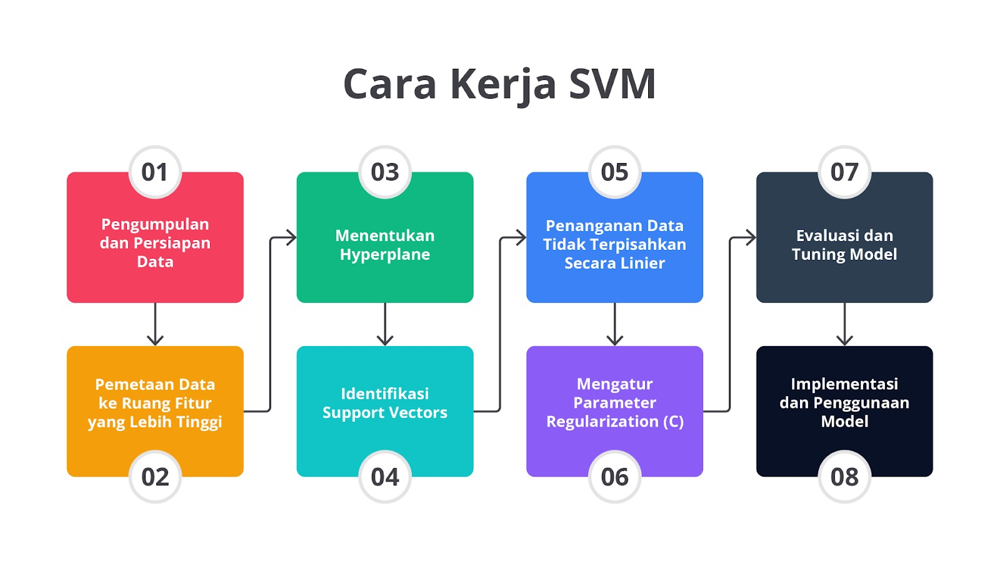

### Langkah 1: Pengumpulan dan Persiapan Data

Proses SVM dimulai dengan pengumpulan data yang akan digunakan untuk melatih model. Data ini harus dipersiapkan dengan cermat melalui pra-pemrosesan, yang mencakup pembersihan data, penanganan nilai yang hilang, serta normalisasi atau standardisasi fitur untuk memastikan bahwa semua fitur berada dalam skala seragam. Selanjutnya, data dibagi menjadi set pelatihan dan set pengujian. Set pelatihan digunakan untuk melatih model dan set pengujian dalam mengevaluasi kinerjanya.

### Langkah 2: Pemetaan Data ke Ruang Fitur yang Lebih Tinggi

SVM memulai dengan memetakan data ke ruang fitur yang lebih tinggi menggunakan fungsi kernel. Ini memungkinkan model untuk menangkap pola non-linier yang mungkin tidak terlihat dalam ruang fitur asli. Kernel, seperti polinomial, RBF (Radial Basis Function), atau sigmoid digunakan untuk mengubah data sehingga dapat dipisahkan secara linier dalam ruang fitur yang baru.

### Langkah 3: Menentukan Hyperplane

Dalam ruang fitur yang lebih tinggi, SVM mencari hyperplane yang memisahkan data ke dalam kelas-kelas berbeda. Hyperplane adalah permukaan (atau garis dalam dimensi dua) yang memisahkan dua kelas dengan jarak maksimum. Tujuannya adalah menemukan hyperplane yang memaksimalkan margin, yaitu jarak antara hyperplane dan titik data terdekat dari masing-masing kelas.

### Langkah 4: Identifikasi Support Vectors

Support vectors adalah titik data yang terletak paling dekat dengan hyperplane. Titik-titik ini berperan penting dalam menentukan posisi dan orientasi hyperplane. Hanya titik-titik ini yang memengaruhi pembentukan hyperplane sehingga mereka sangat penting dalam pelatihan model SVM.

### Langkah 5: Penanganan Data Tidak Terpisahkan Secara Linier

Jika data tidak dapat dipisahkan secara linier di ruang fitur asli, kernel trick digunakan untuk mengubah data ke ruang fitur yang lebih tinggi. Di ruang ini, data bisa dipisahkan secara linier oleh hyperplane. Ini memungkinkan SVM untuk menangani masalah klasifikasi yang lebih kompleks dengan batas kelas non-linier.

### Langkah 6: Mengatur Parameter Regularization (C)

Parameter regularization C mengontrol trade-off antara margin dan kesalahan klasifikasi. Nilai C yang tinggi akan memaksa model untuk mengklasifikasikan semua titik data dengan benar, mengorbankan margin yang lebih kecil. Sebaliknya, nilai C yang lebih rendah akan menghasilkan margin lebih besar, tetapi dengan beberapa kesalahan klasifikasi. Pengaturan parameter ini membantu menyeimbangkan kompleksitas model dan akurasi.

### Langkah 7: Evaluasi dan Tuning Model

Setelah model dilatih, performanya dievaluasi menggunakan data uji. Metrik, seperti akurasi, precision, recall, dan F1-Score digunakan untuk mengukur seberapa baik model mengklasifikasikan data baru. Berdasarkan hasil evaluasi, parameter kernel, seperti gamma (untuk kernel RBF) dan degree (untuk kernel polinomial) disesuaikan untuk meningkatkan performa model.

### Langkah 8: Implementasi dan Penggunaan Model

Dengan model yang telah dilatih dan dioptimalkan, model diimplementasikan dalam aplikasi atau sistem produksi. Model digunakan untuk membuat prediksi pada data baru yang belum pernah dilihat. Penting memantau kinerja model secara berkala serta melakukan pembaruan jika diperlukan untuk memastikan bahwa model tetap efektif dan relevan.

## Kelebihan dan Kekurangan SVM

SVM memiliki berbagai kelebihan yang membuatnya populer dalam berbagai aplikasi, tetapi juga memiliki beberapa kekurangan yang perlu dipertimbangkan. Tabel berikut merangkum kelebihan dan kekurangan utama dari SVM untuk memberikan gambaran lebih jelas tentang waktu dan cara algoritma ini dapat digunakan secara efektif.

| Kelebihan | Kekurangan |
| --------- | ---------- |

| Margin Maksimal: SVM mencari hyperplane yang memisahkan kelas dengan margin maksimal, yang dapat meningkatkan generalisasi dan mengurangi risiko overfitting.

| Kompleksitas Komputasi: untuk dataset besar atau fitur yang sangat banyak, pelatihan SVM bisa menjadi sangat lambat dan memerlukan banyak memori.

|
| Kemampuan Menangani Data Non-Linier: dengan penggunaan kernel trick, SVM dapat mengatasi data yang tidak dapat dipisahkan secara linier dengan baik.

| Pemilihan Parameter: pemilihan parameter, seperti C, gamma, dan jenis kernel dapat memengaruhi kinerja model secara signifikan dan memerlukan tuning yang hati-hati.

|
| Kinerja yang Baik dengan Data Kecil: SVM sering kali memberikan hasil yang baik pada dataset dengan jumlah data relatif kecil jika dibandingkan dengan metode lain.

| Tidak Biasa Menghasilkan Probabilitas: SVM tidak secara langsung memberikan probabilitas untuk kelas yang mungkin menjadi kendala jika probabilitas klasifikasi penting dalam aplikasi tertentu.

|
| Efektif pada Dimensi Tinggi: SVM dapat bekerja dengan baik pada data berdimensi tinggi, seperti dalam masalah teks dan bioinformatika, letak banyak fitur mungkin ada.

| Interpretasi Model Sulit: hasil model SVM, terutama dengan kernel non-linier, sering kali sulit untuk diinterpretasikan atau dipahami secara intuitif.

|

Dengan mempertimbangkan kelebihan dan kekurangan ini, Anda dapat menentukan bahwa SVM adalah algoritma yang tepat dalam masalah klasifikasi atau regresi yang sedang dihadapi serta cara mengoptimalkan penggunaannya untuk hasil terbaik.
