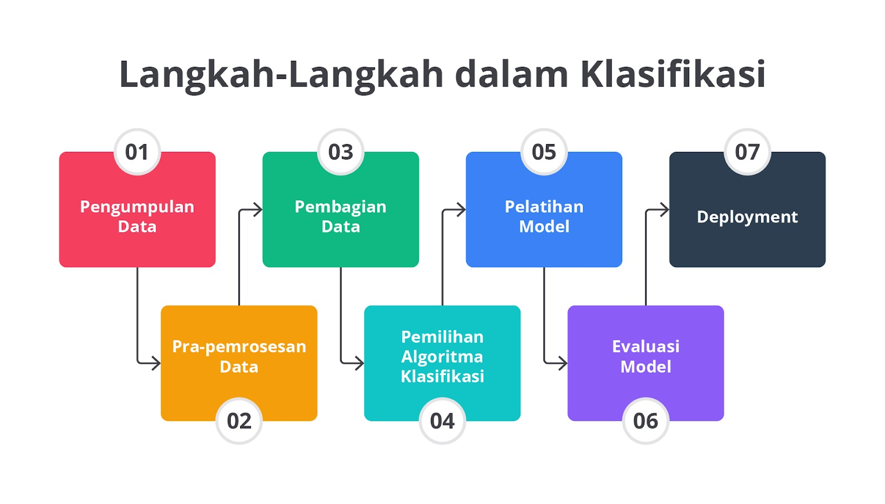
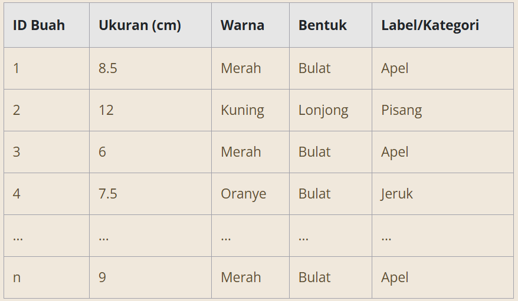
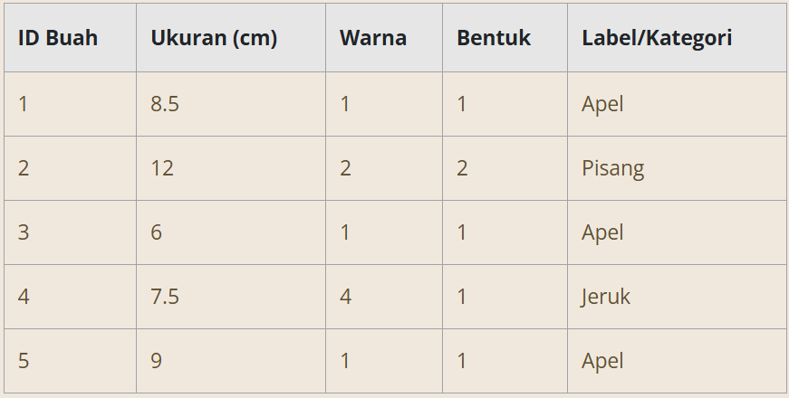
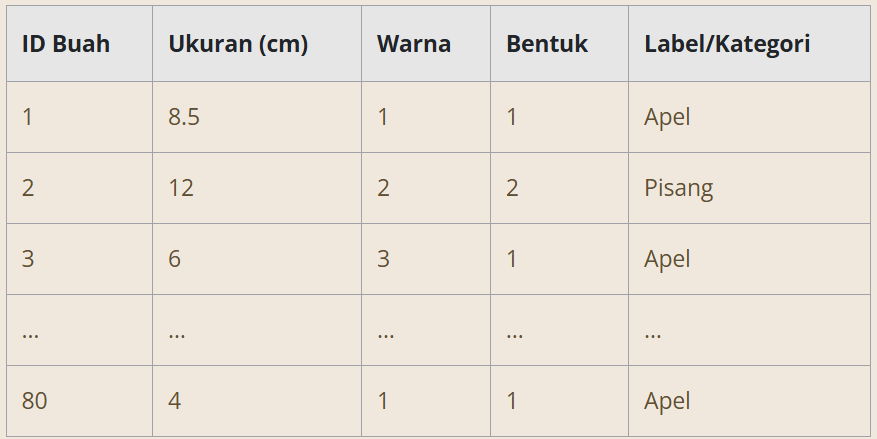
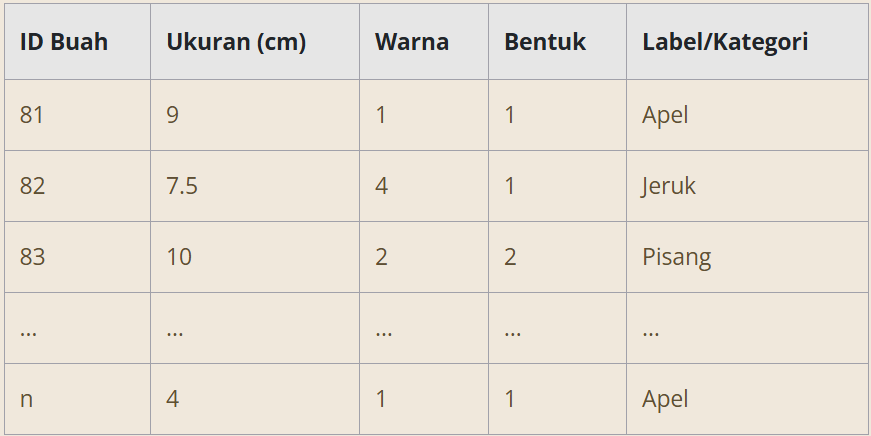
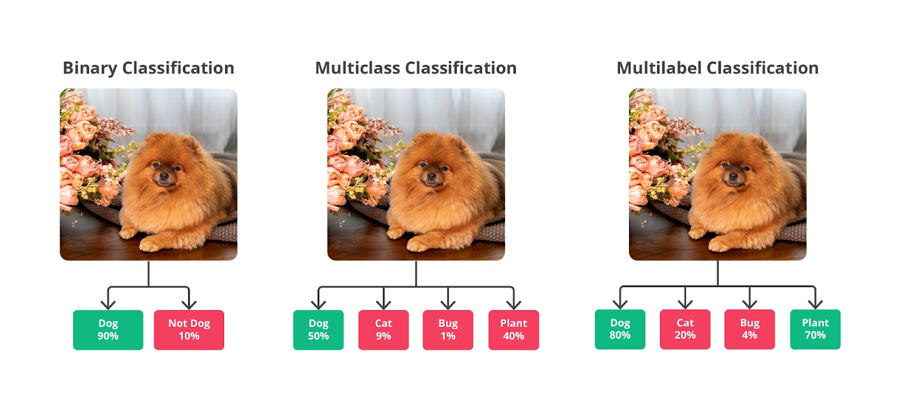
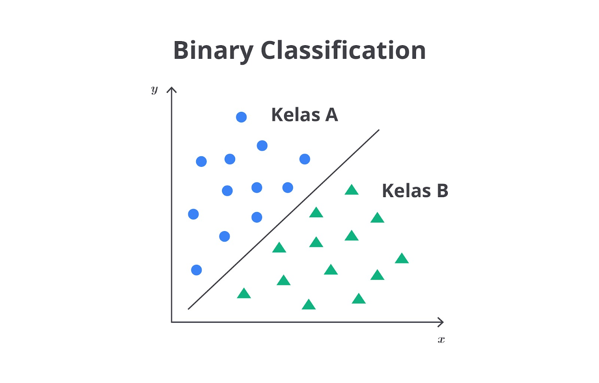
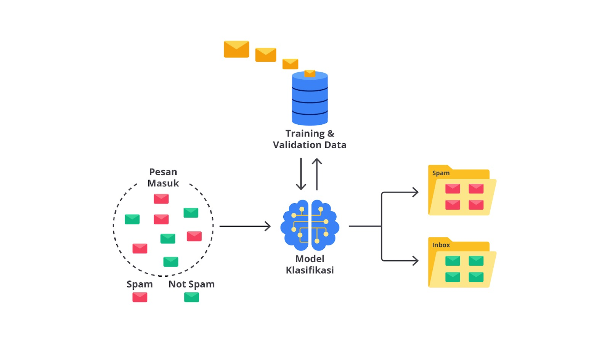
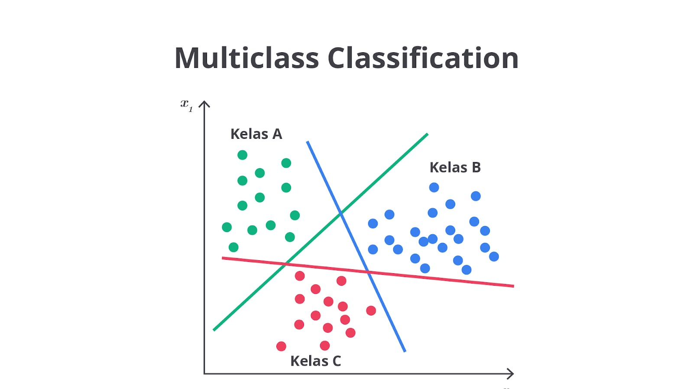
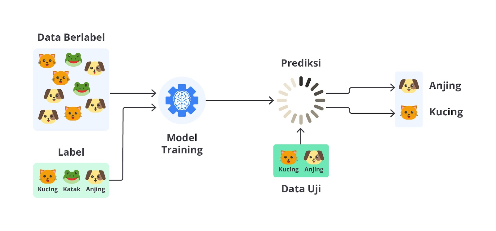

# Konsep Dasar Klasifikasi

Klasifikasi adalah salah satu metode dalam machine learning yang berfungsi untuk mengelompokkan data ke dalam kategori atau kelas tertentu berdasarkan karakteristik atau fitur dari data tersebut. Metode ini adalah bagian dari supervised learning, yaitu model yang dilatih menggunakan data yang sudah diberi label atau kategori. Klasifikasi sangat berguna dalam berbagai aplikasi nyata, yaitu pengenalan wajah, filtering email spam, deteksi penipuan, diagnosis penyakit, dan banyak lagi.

## Proses Klasifikasi: Langkah Demi Langkah

Proses klasifikasi melibatkan beberapa tahapan yang penting untuk dipahami agar model yang dihasilkan dapat memberikan prediksi akurat. Berikut adalah langkah-langkah dalam proses klasifikasi.

Nah, sekarang mari kita bahas setiap tahapan tersebut secara rinci!

## Pengumpulan Data

Langkah pertama dalam proses klasifikasi adalah mengumpulkan data yang akan digunakan untuk melatih dan menguji model. Data ini harus relevan dengan masalah yang ingin diselesaikan serta memiliki kualitas yang baik, artinya data harus lengkap, akurat, dan representatif terhadap populasi data yang lebih luas.

Contoh: Kita ingin membangun model klasifikasi untuk mengidentifikasi jenis buah berdasarkan fitur, seperti ukuran, warna, dan bentuk. Berikut adalah beberapa contoh data yang kita kumpulkan.

## Pra-pemrosesan Data

Data yang dikumpulkan sering kali tidak langsung siap digunakan oleh model machine learning. Pra-pemrosesan data melibatkan serangkaian langkah untuk membersihkan dan mempersiapkan data. Langkah-langkah ini bisa mencakup penanganan data yang hilang, penghapusan duplikasi, menangani nilai yang tidak konsisten, mengonversi data ke format yang dapat diproses oleh algoritma, dan normalisasi atau standardisasi fitur.

Contoh: Dalam data buah di atas, kita perlu mengubah warna buah menjadi angka agar bisa digunakan oleh model, misalnya: Merah = 1, Kuning = 2, Hijau = 3, Oranye = 4. Data setelah pra-pemrosesan mungkin terlihat seperti ini.

## Pembagian Data

Setelah data diproses, langkah berikutnya adalah membagi data menjadi dua set utama, yaitu data pelatihan (training data) dan data pengujian (testing data). Biasanya, sekitar 70–80% dari data digunakan untuk melatih model, sedangkan sisanya digunakan untuk menguji kinerja model.

Namun, perlu diingat bahwa proporsi pembagian ini tidaklah mutlak. Terkadang, kita hanya menggunakan 1–10% data untuk pengujian atau validasi, tergantung pada jumlah data yang tersedia, kompleksitas model, dan kebutuhan spesifik dari proyek yang sedang dikerjakan.

Contoh: Dari 100 data buah yang kita miliki, kita membagi data tersebut menjadi 80 data untuk pelatihan dan 20 data untuk pengujian. Berikut adalah contoh data tersebut dibagi.

## Data Pelatihan:

## Data Pengujian:

## Pemilihan Algoritma Klasifikasi

Berbagai algoritma bisa digunakan untuk klasifikasi serta pemilihan algoritma bergantung pada jenis data, ukuran dataset, dan kompleksitas masalah. Setiap algoritma memiliki keunggulan dan kelemahan yang berbeda.

Pemilihan algoritma klasifikasi dipengaruhi oleh jenis data, ukuran dataset, dan kompleksitas masalah. Misalnya, data skala kecil sering cocok dengan algoritma sederhana, seperti Logistic Regression atau KNN, sementara dataset besar dan kompleks lebih sesuai untuk Random Forest atau SVM.

Kecepatan dan skalabilitas juga penting, terutama untuk aplikasi real time, seperti Naive Bayes atau Logistic Regression sering dipilih. Selain itu, interpretabilitas model perlu diperhatikan dalam domain sensitif dengan Decision Tree atau Logistic Regression menawarkan penjelasan yang lebih mudah dipahami dibandingkan model yang lebih kompleks.

Contoh: Kita memilih algoritma Decision Tree untuk mengklasifikasikan buah-buahan. Algoritma ini akan membuat keputusan berdasarkan fitur, seperti ukuran, warna, dan bentuk, untuk memutuskan bahwa suatu buah adalah apel, pisang, atau jeruk.

Decision Tree dipilih karena mudah diinterpretasikan; setiap keputusan yang dibuat oleh model dapat ditelusuri kembali melalui struktur pohon sehingga kita dapat dengan jelas memahami alasan suatu buah diklasifikasikan sebagai apel, pisang, atau jeruk. Selain itu, Decision Tree efektif dalam menangani data dengan fitur kategorikal dan numerik, serta mampu menangkap interaksi antara berbagai fitur secara baik.

## Pelatihan Model

Pada tahap ini, data pelatihan model dilakukan untuk mengajarkan komputer mengenali pola dalam data dan membangun model klasifikasi berdasarkan algoritma yang digunakan. Algoritma bertugas untuk menganalisis hubungan antara fitur dan label untuk memprediksi kelas dari data baru.

Contoh: Model Decision Tree akan belajar bahwa buah dengan ukuran tertentu dan warna tertentu kemungkinan besar adalah apel. Selama pelatihan, model ini akan membangun struktur pohon keputusan yang memisahkan buah-buahan ke dalam kategori yang sesuai.

## Evaluasi Model

Setelah model dilatih, kita perlu mengevaluasi kinerjanya menggunakan data pengujian. Evaluasi dilakukan menggunakan berbagai metrik, seperti akurasi, precision, recall, dan F1-Score.

Contoh: Jika model kita memprediksi 18 dari 20 buah dengan benar, akurasi model adalah 90%. Selain itu, kita juga akan memeriksa hasil klasifikasi untuk mengidentifikasi jenis buah yang sering salah diklasifikasikan oleh model. Dengan cara ini, kita dapat memahami kelemahan model dan memperbaikinya jika diperlukan.

## Deployment

Setelah model diuji dan terbukti efektif, langkah terakhir adalah menerapkan model tersebut untuk memprediksi kelas dari data baru dalam aplikasi nyata.

Contoh: Model klasifikasi buah yang sudah dilatih dapat digunakan oleh pabrik untuk secara otomatis mengklasifikasikan buah-buahan yang baru dipanen berdasarkan ukuran dan warnanya, membantu proses penyortiran tanpa intervensi manusia.

Dengan mengikuti langkah-langkah ini secara sistematis, kita bisa memastikan bahwa model klasifikasi yang dibangun mampu memberikan prediksi akurat dan dapat diandalkan dalam situasi nyata.

# Jenis-Jenis Klasifikasi

Klasifikasi merupakan salah satu fondasi utama dalam machine learning yang memungkinkan komputer untuk membuat keputusan cerdas berdasarkan data yang telah dipelajari. Dalam dunia yang semakin dipenuhi oleh data, kemampuan untuk mengklasifikasikan informasi dengan tepat menjadi sangat penting, baik dalam memahami pola tersembunyi maupun untuk membuat prediksi akurat.

Ada berbagai jenis klasifikasi yang dapat diterapkan. Pilihan jenis yang tepat sangat bergantung pada kompleksitas data serta tujuan spesifik yang ingin dicapai. Pemahaman mendalam tentang jenis-jenis klasifikasi ini tidak hanya memungkinkan kita untuk memilih pendekatan paling sesuai dengan sebuah masalah, tetapi juga membuka pintu inovasi dan peningkatan kinerja dalam implementasi machine learning yang lebih kompleks dan berdampak tinggi.

Berikut adalah jenis-jenis klasifikasi berdasarkan jumlah kelas atau label.

- Klasifikasi Biner
- Klasifikasi Multikelas
- Klasifikasi Multilabel

Nah, selanjutnya mari kita bahas setiap jenis tersebut secara rinci!

## Klasifikasi Biner (Binary Classification)

Klasifikasi biner adalah tipe klasifikasi dengan mengelompokkan data ke dalam dua kategori atau label yang berbeda. Dengan kata lain, model hanya memiliki dua pilihan untuk mengelompokkan data, yaitu kategori pertama atau kategori kedua. Misalnya, sebuah sistem perlu menentukan jenis sebuah email termasuk spam atau bukan.

Proses klasifikasi biner dimulai dengan pelatihan model menggunakan dataset yang sudah diberi label. Artinya, setiap contoh data sudah diketahui kelasnya. Model ini kemudian belajar dari fitur-fitur dalam data tersebut untuk membedakan antara dua kelas.

Misalnya, dalam kasus deteksi email spam, fitur-fitur, seperti frekuensi kata tertentu, panjang subjek, atau adanya lampiran tertentu bisa digunakan untuk mempelajari pola yang membedakan email spam dari yang tidak spam.

Setelah dilatih, model klasifikasi biner digunakan untuk memprediksi kelas dari data baru yang belum dikenal. Setiap input data akan dianalisis oleh model dan memberikan output berupa salah satu dari dua kelas tersebut. Output ini bisa dalam bentuk keputusan yang pasti (misalnya, "spam" atau "tidak spam") atau probabilitas (contohnya, 70% spam, 30% tidak spam), tergantung pada implementasi model.

Klasifikasi biner sering kali digunakan dalam berbagai aplikasi dunia nyata karena kesederhanaannya dan efektivitasnya untuk menyelesaikan masalah yang memerlukan keputusan ya/tidak. Misalnya, dalam deteksi penipuan, sistem dapat memutuskan transaksi tertentu adalah penipuan atau tidak. Dalam diagnosis medis, model dapat membantu dokter dalam memutuskan sebuah status pasien apabila menunjukkan tanda-tanda penyakit tertentu.

Namun, meskipun sederhana, klasifikasi biner juga memiliki tantangan tersendiri, terutama ketika data tidak seimbang, yaitu salah satu kelas jauh lebih banyak dibandingkan kelas lainnya. Ini sering memerlukan teknik-teknik khusus, seperti oversampling, undersampling, atau penyesuaian threshold untuk memastikan model tidak hanya fokus pada kelas yang lebih dominan dan mengabaikan kelas minoritas.

## Klasifikasi Multikelas (Multiclass Classification)

Klasifikasi multikelas (multiclass classification) adalah teknik klasifikasi yang digunakan ketika data harus dikelompokkan ke dalam lebih dari dua kategori. Berbeda dengan klasifikasi biner yang hanya memiliki dua kelas, klasifikasi multikelas mengharuskan model untuk memilih satu dari beberapa kelas yang mungkin ada.

Ini berarti bahwa setiap data hanya bisa dimasukkan ke salah satu dari beberapa kategori yang sudah ditentukan. Artinya, sebuah data hanya bisa berada dalam satu kategori saja dan tidak bisa masuk kategori lain.

Untuk memecahkan masalah klasifikasi multikelas, model machine learning perlu belajar untuk membedakan antara banyak kelas yang berbeda. Misalnya, dalam pengenalan gambar, model mungkin harus memutuskan bahwa gambar tersebut adalah anjing, kucing, atau katak.

Setiap gambar pada dataset pelatihan diberi label sesuai dengan salah satu dari beberapa kategori ini. Model dilatih untuk mengenali fitur yang membedakan setiap kelas, seperti bentuk, tekstur, atau pola warna, kemudian digunakan untuk mengklasifikasikan gambar baru ke dalam kategori yang sesuai.

Proses pelatihan model untuk klasifikasi multikelas melibatkan beberapa langkah kunci.

1. Persiapan Dataset: siapkan dataset pelatihan yang berisi contoh-contoh dari setiap kelas, termasuk fitur-fitur yang relevan dan label yang benar.
2. Pemilihan Algoritma: pilih algoritma klasifikasi yang mampu menangani lebih dari dua kelas.
3. Pelatihan Model: latih model menggunakan dataset tersebut, yakni model belajar mengidentifikasi pola dan fitur yang membedakan setiap kelas.
4. Pengujian Model: uji model pada data yang belum pernah dilihat sebelumnya untuk menilai kemampuannya dalam mengklasifikasikan data ke dalam kategori yang benar.

## Klasifikasi Multilabel (Multilabel Classification)

Klasifikasi multilabel (multilabel classification) adalah metode yang memungkinkan sebuah data dikategorikan ke dalam lebih dari satu label atau kategori sekaligus. Berbeda dengan klasifikasi multikelas yang membatasi data hanya pada satu kategori dari beberapa opsi, klasifikasi multilabel memberikan fleksibilitas lebih besar dengan memungkinkan satu sampel data untuk memiliki beberapa label.

Proses klasifikasi multilabel melibatkan pelatihan model menggunakan dataset yang setiap sampelnya memiliki beberapa label. Model belajar mengenali pola yang menghubungkan fitur-fitur data dengan berbagai label. Setelah dilatih, model dapat memprediksi beberapa label yang relevan untuk data baru. Klasifikasi multilabel sangat berguna untuk data yang tidak dapat dibatasi pada satu kategori dan memberikan kemampuan dalam menangani data lebih kompleks.
