# Konsep Dasar Clustering

Clustering adalah metode analisis data yang digunakan untuk mengelompokkan objek-objek data ke dalam grup-grup atau cluster berdasarkan kemiripan atau kesamaan fitur. Pada clustering, tujuan utamanya adalah mengidentifikasi struktur atau pola tersembunyi dalam data tanpa memerlukan label atau informasi yang telah ditentukan sebelumnya. Ini berarti clustering termasuk teknik unsupervised learning, yakni model tidak dilatih dengan data berlabel, tetapi hanya dengan data fitur untuk menemukan pola.

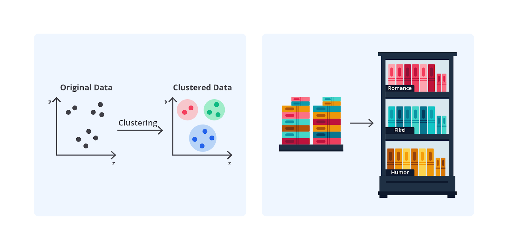

Bayangkan Anda seorang pustakawan yang baru menerima koleksi buku untuk perpustakaan. Tugas Anda adalah mengatur buku-buku tersebut dalam rak-rak tanpa mengetahui sebelumnya kategori yang ada. Anda mulai dengan mengumpulkan semua buku baru, yang mencakup berbagai genre, seperti fiksi, non-fiksi, dan ilmiah.

Selanjutnya, Anda memutuskan untuk mengelompokkan buku berdasarkan genre sebagai fitur utama sehingga buku-buku dengan genre yang sama akan dikelompokkan bersama. Dengan metode ini, buku-buku fiksi akan berada pada rak yang sama, sementara buku non-fiksi dan ilmiah akan diletakkan dalam rak berbeda.

Proses ini mirip dengan clustering, yaitu pengelompokan data berdasarkan kemiripan atau kesamaan fitur untuk mempermudah pengorganisasian dan pemahaman, tanpa memerlukan informasi tambahan mengenai kategori yang sudah ada.

## Proses Clustering: Langkah Demi Langkah

Clustering adalah proses yang sangat berguna dalam analisis data untuk mengelompokkan data ke dalam grup-grup berdasarkan kemiripan atau kesamaan fitur. Berikut adalah langkah-langkah dalam proses clustering.

1. Pengumpulan Data
2. Pemilihan Fitur
3. Pra-pemrosesan Data
4. Pemilihan Metode Pengukuran Jarak
5. Pemilihan Algoritma Clustering
6. Penerapan Algoritma Clustering
7. Evaluasi Hasil Clustering
8. Interpretasi dan Tindakan

Nah, sekarang mari kita bahas setiap tahapan tersebut secara rinci!

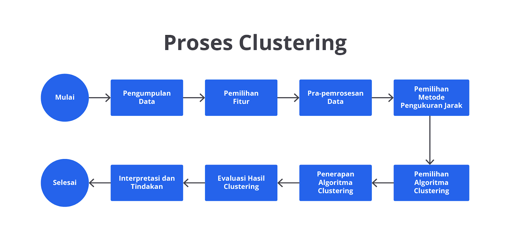

### Pengumpulan Data

Pengumpulan data adalah langkah pertama dalam proses clustering melibatkan pengumpulan semua data relevan yang akan dianalisis. Data ini bisa berupa berbagai jenis informasi, seperti data numerik, kategorikal, atau teks, tergantung pada tujuan analisis clustering.

Misalnya, jika tujuan Anda adalah menganalisis segmen pelanggan, data dari database pelanggan akan dikumpulkan, seperti usia, pendapatan, dan riwayat pembelian. Data yang dikumpulkan harus valid dan cukup untuk memungkinkan identifikasi pola atau struktur secara signifikan dalam proses clustering.

Contoh Data Pelanggan

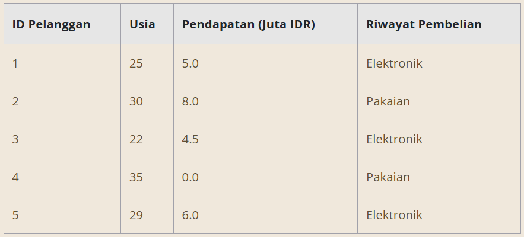

### Pemilihan Fitur

Setelah data dikumpulkan, langkah berikutnya adalah pemilihan fitur, yaitu atribut yang akan digunakan untuk mengelompokkan data. Fitur harus dipilih berdasarkan relevansinya dengan tujuan analisis dan kemampuannya dalam membedakan antar kelompok.

Misalnya, dalam analisis pelanggan, fitur yang relevan adalah usia dan pendapatan. Pemilihan fitur yang tepat sangat penting karena fitur tidak relevan atau berlebihan dapat mengaburkan hasil clustering dan membuat interpretasi menjadi kurang akurat.

Contoh Fitur yang Dipilih untuk Clustering

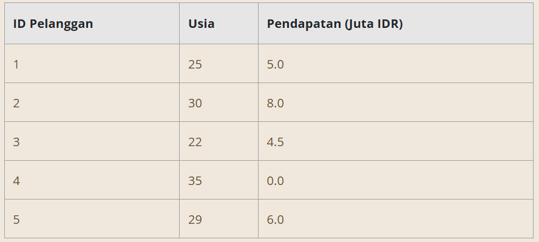

### Pra-pemrosesan Data

Pra-pemrosesan data adalah tahap ketika data yang telah dikumpulkan akan dibersihkan dan dinormalisasi untuk memastikan kualitas serta konsistensinya. Ini mencakup beberapa aktivitas, seperti menangani nilai yang hilang, menghapus duplikasi, dan menormalisasikan skala fitur.

Misalnya, Anda perlu menormalkan data pendapatan dan usia agar berada pada skala yang sama sehingga semua fitur memberikan kontribusi setara dalam proses clustering. Pra-pemrosesan membantu memastikan bahwa data siap digunakan dalam algoritma clustering tanpa adanya gangguan dari masalah kualitas data.

Contoh Data Setelah Pra-pemrosesan

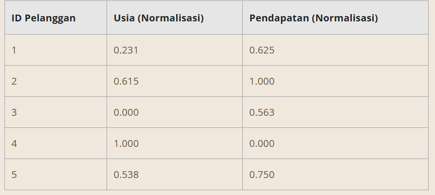

### Pemilihan Metode Pengukuran Jarak

Pemilihan metode pengukuran jarak adalah langkah penting untuk Anda menentukan cara mengukur kemiripan atau jarak antara objek dalam data. Metode ini memengaruhi cara data dikelompokkan dan hasil clustering yang diperoleh.

Misalnya, jarak Euclidean sering digunakan untuk data numerik karena mengukur jarak linier antara dua titik dalam ruang fitur. Untuk data teks, cosine similarity lebih sesuai karena mengukur seberapa mirip dua dokumen berdasarkan isi kata-katanya. Pemilihan metode pengukuran jarak secara tepat adalah kunci untuk mendapatkan hasil clustering yang akurat.

Contoh Pengukuran Jarak Euclidean

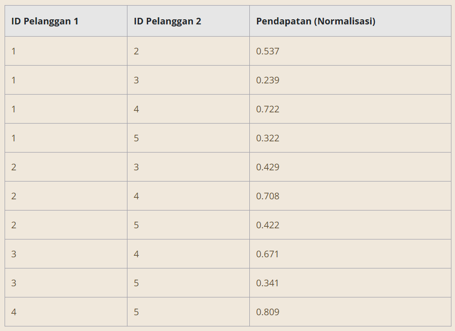

Berikut adalah contoh rincian untuk beberapa pasangan.

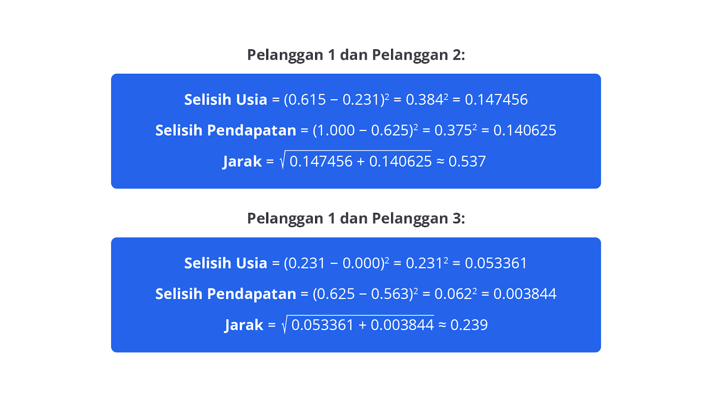

Lakukan perhitungan serupa untuk pasangan pelanggan lainnya menggunakan data normalisasi yang telah disediakan.

### Pemilihan Algoritma Clustering

Pemilihan algoritma clustering melibatkan keputusan tentang metode yang akan digunakan untuk mengelompokkan data. Berbagai algoritma clustering, seperti K-Means, DBSCAN, atau hierarchical clustering, memiliki pendekatan yang berbeda dalam mengelompokkan data. Pilihan algoritma bergantung pada jenis data yang Anda miliki dan tujuan analisis.

Misalnya, K-Means dipilih jika Anda sudah mengetahui jumlah cluster yang diinginkan, sedangkan DBSCAN lebih cocok jika ingin mengidentifikasi cluster dengan bentuk yang tidak teratur dan juga menangani noise dalam data.

### Penerapan Algoritma Clustering

Setelah algoritma clustering dipilih, langkah berikutnya adalah menerapkannya pada data. Pada tahap ini, algoritma yang telah dipilih diterapkan untuk mengelompokkan data ke dalam cluster berdasarkan fitur yang telah ditentukan.

Misalnya, dengan K-Means, algoritma akan membagi data pelanggan ke dalam jumlah cluster yang telah ditentukan berdasarkan kemiripan fitur, seperti usia dan pendapatan. Penerapan algoritma ini menghasilkan cluster yang mencerminkan kelompok-kelompok data dengan karakteristik serupa.

Contoh Hasil Penerapan K-Means

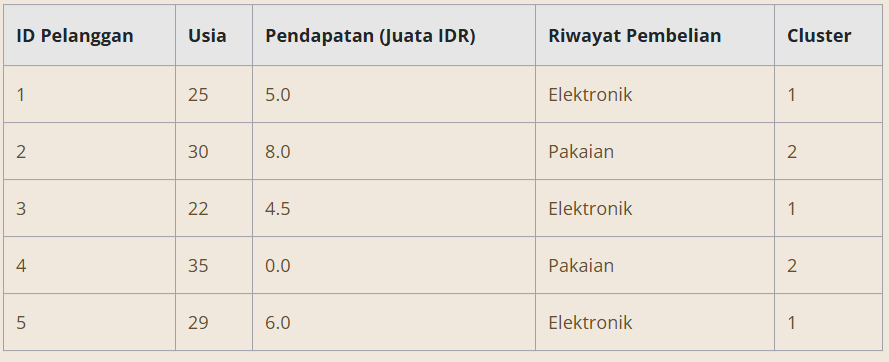

### Evaluasi Hasil Clustering

Evaluasi hasil clustering adalah proses untuk menilai seberapa baik data telah dikelompokkan setelah algoritma diterapkan. Berbagai metrik digunakan untuk mengevaluasi kualitas cluster, seperti silhouette score yang mengukur seberapa baik setiap objek berada dalam cluster-nya sendiri dibandingkan dengan cluster lainnya atau Davies-Bouldin Index yang mengukur keterpisahan antara cluster. Evaluasi ini membantu memastikan bahwa cluster yang terbentuk adalah valid dan sesuai dengan tujuan analisis.

Contoh Evaluasi dengan Silhouette Score

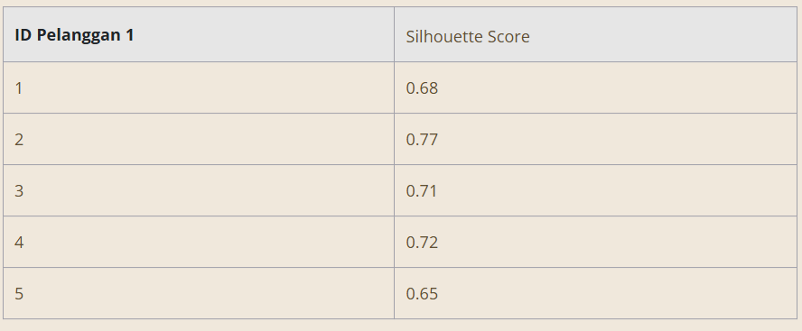

### Interpretasi dan Tindakan

Langkah terakhir adalah interpretasi dan tindakan berdasarkan hasil clustering. Setelah clustering selesai, hasilnya perlu dianalisis untuk memahami pola atau struktur yang muncul dalam data. Berdasarkan temuan ini, langkah-langkah tindak lanjut dapat diambil, seperti pengembangan strategi bisnis, pembuatan laporan, atau penelitian lebih lanjut.

Misalnya, jika clustering mengidentifikasi segmen pelanggan baru, Anda mungkin akan merancang strategi pemasaran yang lebih terarah untuk setiap segmen. Interpretasi yang baik dari hasil clustering memungkinkan Anda untuk membuat keputusan lebih informatif dan strategis berdasarkan analisis data.

Contoh Interpretasi dan Tindakan

Interpretasi Hasil

- Cluster 1: terdiri dari pelanggan dengan usia lebih muda dan pendapatan menengah, lebih suka membeli elektronik.
- Cluster 2: terdiri dari pelanggan dengan usia lebih tua dan pendapatan lebih tinggi, lebih suka membeli pakaian.

Tindakan

- Rancang kampanye pemasaran yang ditargetkan untuk masing-masing cluster, seperti promosi produk elektronik untuk Cluster 1 dan penawaran eksklusif pakaian untuk Cluster 2.

Dengan menerapkan metode clustering yang sesuai dan melakukan evaluasi secara cermat, kita dapat mengidentifikasi pola-pola tersembunyi dan membuat keputusan lebih strategis. Misalnya, dalam konteks pemasaran, hasil clustering dapat digunakan untuk merancang kampanye yang lebih terarah dan efektif berdasarkan karakteristik masing-masing kelompok pelanggan.

Clustering tidak hanya membantu dalam segmentasi pasar serta analisis data, tetapi juga dalam berbagai aplikasi lain, seperti deteksi anomali dan pengelompokan dokumen. Dengan memahami dan menerapkan teknik clustering secara efektif, kita dapat memanfaatkan data dengan lebih baik serta mendukung pengambilan keputusan yang lebih informatif dan berbasis data.

# Hierarchical Clustering (HC)

Metode clustering umumnya dibagi menjadi dua kategori utama: hierarchical clustering dan non-hierarchical clustering. Pertama, mari kita bahas hierarchical clustering.

Hierarchical clustering adalah teknik clustering yang digunakan untuk mengelompokkan data dalam bentuk hierarki bertingkat berdasarkan kemiripan atau jarak antar objek. Metode ini membangun struktur yang menggambarkan cara cluster dibentuk atau dipecah secara bertahap. Hierarchical clustering memiliki dua pendekatan utama, yaitu agglomerative (bottom-up) dan divisive (top-down).

Agglomerative hierarchical clustering, atau clustering hierarkis aglomeratif, dimulai dengan pendekatan bottom-up dengan setiap objek dianggap sebagai cluster individu pada tahap awal. Jika ada n objek, ada pula n cluster yang terpisah, masing-masing berisi satu objek.

Proses ini melibatkan penggabungan, yaitu ketika jarak atau kemiripan antara semua pasangan cluster dihitung menggunakan metrik jarak, seperti Euclidean, Manhattan, atau Minkowski. Dua cluster dengan jarak terdekat atau kemiripan tertinggi digabungkan menjadi satu cluster baru.

Penggabungan ini berlanjut pada setiap langkah hingga seluruh objek bergabung menjadi satu cluster besar. Selama proses ini, dendrogram—sebuah diagram pohon—dibuat untuk menunjukkan hubungan hierarkis antar cluster. Pada dendrogram, sumbu vertikal menunjukkan jarak atau kemiripan saat penggabungan, sementara sumbu horizontal menunjukkan cluster yang digabung.

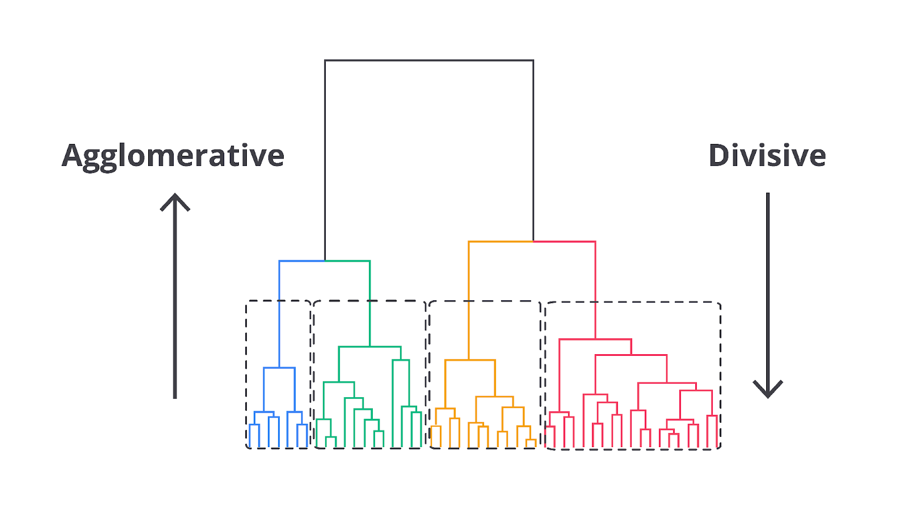

Divisive hierarchical clustering, atau clustering hierarkis divisif, mengikuti pendekatan top-down, dimulai dengan satu cluster besar yang mencakup semua objek dalam dataset. Proses ini melibatkan pembagian cluster besar menjadi dua sub-cluster yang lebih kecil berdasarkan kriteria kemiripan atau jarak.

Pembagian ini dilakukan dengan menggunakan metode yang sama dengan penerapan dalam agglomerative clustering, tetapi dilakukan secara terbalik—dari cluster besar menjadi lebih kecil. Pada setiap langkah, cluster yang ada dibagi menjadi dua bagian lebih kecil hingga akhirnya mencapai keadaan bahwa setiap objek berada dalam cluster terpisah.

Hasil dari proses ini juga digambarkan dalam dendrogram yang menunjukkan proses cluster besar dibagi menjadi sub-cluster yang lebih kecil dari waktu ke waktu. Dendrogram ini memberikan panduan visual tentang proses pembagian dan struktur hierarkis yang terbentuk dalam dataset.

Berikut adalah ilustrasi lain terkait agglomerative dan divisive.

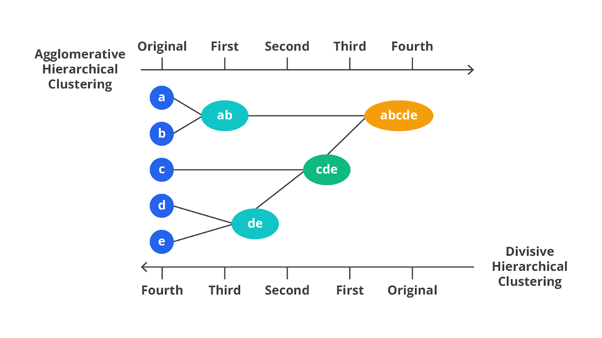

Ilustrasi ini membantu memahami perbedaan antara pendekatan agglomerative dan divisive dalam clustering hierarkis.

- Agglomerative: dimulai dari setiap objek sebagai cluster terpisah (a, b, c, d, e), lalu secara bertahap cluster-cluster ini digabungkan menjadi satu cluster besar (abcde).
- Divisive: dimulai dengan satu cluster besar yang mencakup semua objek (abcde), lalu secara bertahap cluster ini dipecah menjadi cluster-cluster lebih kecil hingga setiap objek berdiri sendiri (a, b, c, d, e).

## Metode Linkage dalam Hierarchical Clustering

Dalam hierarchical clustering, metode linkage digunakan untuk menentukan cara jarak antar cluster dihitung saat proses penggabungan atau pembagian cluster. Berikut adalah penjelasan lebih detail tentang masing-masing metode linkage.

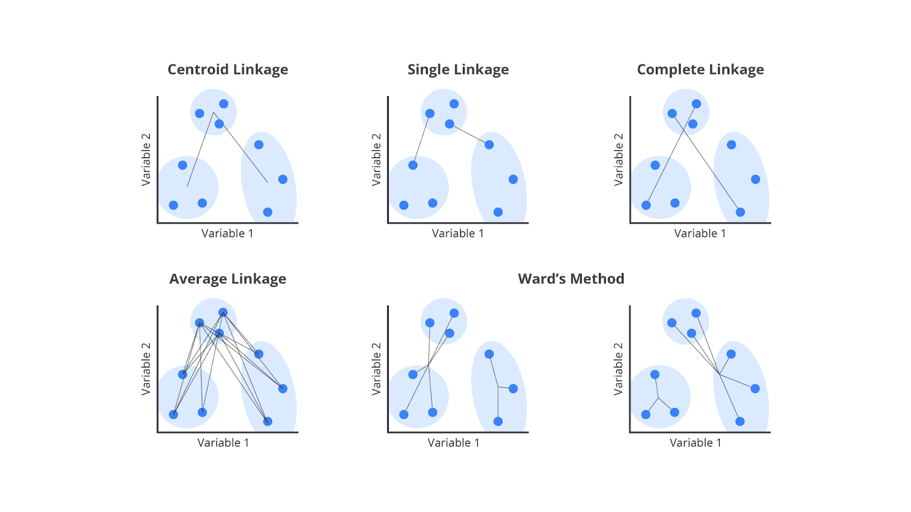

## Single Linkage (Nearest Neighbor)

Metode single linkage, juga dikenal sebagai nearest neighbor, menghitung jarak antara dua cluster sebagai jarak terpendek antara anggota dari kedua cluster. Misalnya, jika kita memiliki dua cluster, jarak antara cluster tersebut adalah jarak terpendek antara anggota dari cluster pertama dengan anggota dari cluster kedua.

Metode ini bisa menyebabkan "efek rantai", yaitu ketika dua cluster yang terhubung dengan jarak terpendek mungkin membentuk rantai panjang jika mereka memiliki anggota yang tersebar jauh dari pusatnya. Akibatnya, cluster bisa menjadi tidak teratur dan berantakan, tergantung pada cara objek tersebar dalam ruang fitur.

## Complete Linkage (Farthest Neighbor)

Metode complete linkage, atau farthest neighbor, menghitung jarak antara dua cluster sebagai jarak terjauh antara anggota dari kedua cluster. Dengan kata lain, jarak antara dua cluster adalah jarak terjauh antara satu anggota dari cluster pertama dan satu anggota dari cluster kedua.

Metode ini cenderung menghasilkan cluster lebih kompak dan terpisah dengan jelas karena hanya dua objek terjauh dari kedua cluster yang menentukan jarak antar cluster. Ini membantu memastikan bahwa semua anggota cluster berada dalam jarak relatif dekat satu sama lain untuk menghasilkan cluster yang lebih homogen.

## Average Linkage

Dalam metode average linkage, jarak antara dua cluster dihitung sebagai rata-rata jarak antara semua pasangan anggota dari kedua cluster. Jadi, kita menghitung jarak antara setiap anggota pada cluster pertama dengan setiap anggota dalam cluster kedua, kemudian mengambil rata-ratanya.

Metode ini memberikan gambaran lebih umum tentang jarak antara cluster dan sering kali menghasilkan cluster yang lebih seimbang dibandingkan dengan metode single linkage atau complete linkage. Average linkage sering kali digunakan untuk menghindari masalah ekstrem yang mungkin muncul dengan metode lain, seperti efek rantai pada single linkage atau kompresi cluster yang sangat padat pada complete linkage.

## Centroid Linkage

Metode centroid linkage adalah teknik dalam hierarchical clustering yang menggunakan centroid (pusat) dari cluster untuk menentukan jarak antar cluster. Dalam metode ini, jarak antara dua cluster diukur sebagai jarak antara centroid (rata-rata) dari kedua cluster tersebut. Ketika dua cluster digabungkan, centroid dari cluster gabungan dihitung ulang berdasarkan rata-rata posisi semua anggota dalam cluster gabungan.

Pendekatan ini memastikan bahwa penggabungan cluster didasarkan pada posisi pusatnya dan perubahan centroid menggambarkan perubahan jarak yang terjadi selama proses penggabungan. Karena jarak antar cluster dihitung berdasarkan centroid, metode ini cenderung menghasilkan cluster yang relatif seimbang dan terpisah dengan jelas. Centroid linkage sering digunakan untuk analisis data yang memerlukan pemahaman mendalam tentang posisi relatif dan kesamaan antar cluster.

## Ward’s Linkage

Metode ward’s linkage adalah teknik yang mencoba meminimalkan jumlah kuadrat perbedaan di dalam cluster saat menggabungkan dua cluster. Dengan kata lain, metode ini memilih untuk menggabungkan dua cluster yang jika digabungkan akan menghasilkan peningkatan terkecil dalam variasi total pada cluster yang baru terbentuk.

Variasi total ini diukur sebagai jumlah kuadrat deviasi dari setiap anggota cluster terhadap rata-rata cluster tersebut. Ward’s linkage cenderung menghasilkan cluster yang lebih homogen dan lebih kompak karena algoritma secara aktif berusaha meminimalkan variasi di dalam cluster. Teknik ini sangat berguna ketika ingin memastikan bahwa hasil cluster memiliki anggota yang sangat mirip satu sama lain.

Dengan memahami kekuatan dan kelemahan masing-masing metode, Anda dapat memilih teknik yang paling sesuai untuk mengelompokkan data secara efektif, menghasilkan cluster yang relevan dan mudah diinterpretasikan. Penggunaan metode linkage secara tepat memastikan bahwa hasil clustering mencerminkan struktur data yang sebenarnya, memungkinkan analisis lebih mendalam dan keputusan lebih baik dalam berbagai aplikasi praktis.

## Metode Pengukuran Jarak dalam Hierarchical Clustering

Dalam hierarchical clustering, metode pengukuran distance antara objek atau cluster sangat penting untuk menentukan cara data dikelompokkan. Beberapa metode distance yang umum digunakan adalah Euclidean Distance, Manhattan Distance, dan Minkowski Distance, masing-masing dengan karakteristik serta rumus matematis yang berbeda.

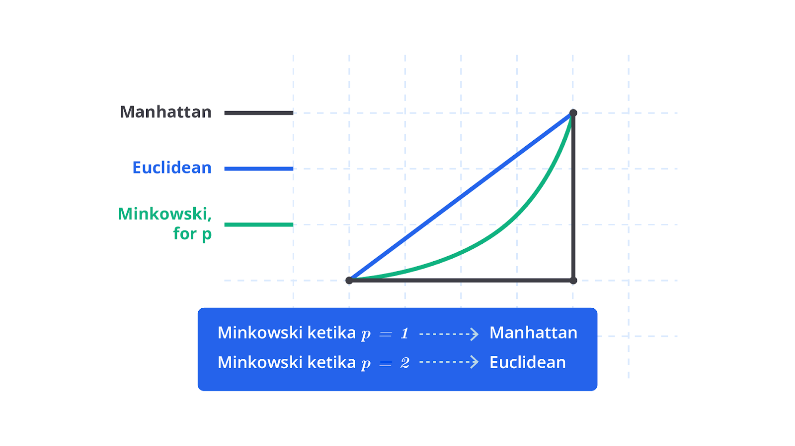

## Euclidean Distance

Metode ini adalah yang paling sering digunakan untuk mengukur jarak linier antara dua titik dalam ruang fitur. Distance ini dihitung sebagai akar kuadrat dari jumlah kuadrat perbedaan antara nilai-nilai fitur dari dua titik data.

Rumus untuk Euclidean Distance antara dua titik dalam ruang fitur n-dimensi adalah berikut.

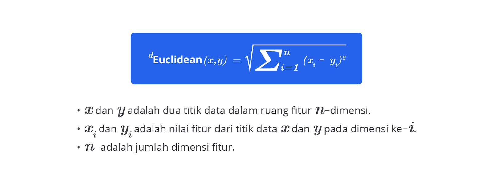

Dalam kata lain, Euclidean Distance dihitung dengan menguadratkan perbedaan antara nilai-nilai fitur dari dua titik, menjumlahkan hasil kuadratnya, dan kemudian mengambil akar kuadrat dari jumlah tersebut. Metode ini memberikan ukuran jarak langsung yang sering kali digunakan dalam banyak aplikasi analisis data dan machine learning.

## Manhattan Distance

Metode ini juga dikenal sebagai distance "city block" yang mengukur jarak berdasarkan jumlah perbedaan absolut pada setiap dimensi. Dalam hal ini, jarak dihitung sebagai jumlah dari selisih absolut antara nilai-nilai fitur.

Rumus untuk Manhattan Distance antara dua titik dalam ruang fitur n-dimensi sebagai berikut.

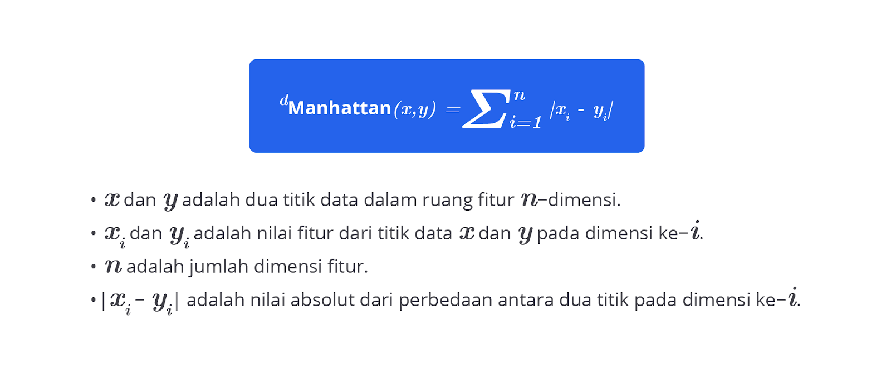

Manhattan Distance diukur dengan menjumlahkan nilai absolut dari perbedaan antara nilai-nilai fitur pada setiap dimensi. Ini memberikan ukuran jarak yang memperhitungkan perbedaan pada setiap dimensi secara terpisah dan sering digunakan ketika jarak di sepanjang garis grid lebih relevan daripada jarak diagonal.

## Minkowski Distance

Perhitungan jarak ini adalah generalisasi dari Euclidean Distance dan Manhattan Distance yang memperkenalkan parameter (p) untuk mengontrol jenis jarak yang dihitung. Rumus untuk Minkowski Distance antara dua titik dalam ruang fitur n-dimensi dengan parameter (p) adalah berikut.

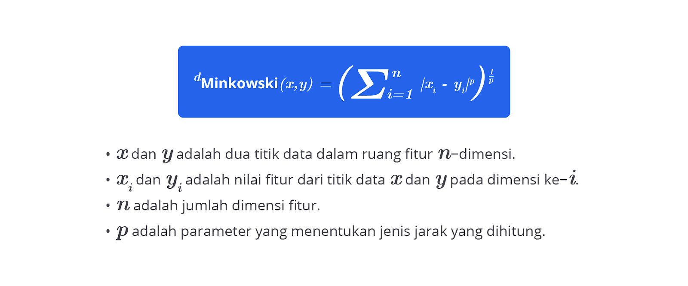

Untuk nilai tertentu dari p, Minkowski Distance menjadi berikut.

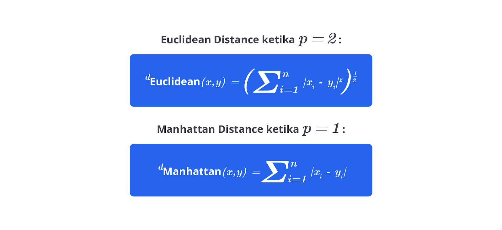

Memilih metode pengukuran jarak yang tepat sangat penting karena dapat memengaruhi hasil clustering. Jarak yang diukur harus mencerminkan kemiripan atau perbedaan data dengan akurat untuk mendapatkan hasil clustering yang bermanfaat.

Hierarchical clustering adalah teknik yang efektif untuk mengelompokkan data dan memahami struktur data dengan detail. Kelebihannya dalam memberikan struktur hierarkis yang jelas, visualisasi melalui dendrogram, dan fleksibilitas tanpa memerlukan spesifikasi awal jumlah cluster membuatnya berguna pada berbagai aplikasi.

Namun, kekurangan seperti skalabilitas terbatas, sensitivitas terhadap noise dan outliers, serta tantangan dalam menentukan jumlah cluster yang optimal memerlukan perhatian dan pertimbangan saat menerapkan metode ini. Dengan memahami cara kerja dan karakteristiknya, Anda dapat memanfaatkan hierarchical clustering untuk analisis data lebih baik dan pengambilan keputusan berbasis data yang lebih informatif.

# Non-hierarchical Clustering (NHC)

Non-hierarchical clustering (NHC) adalah metode pengelompokan data yang berbeda dari hierarchical clustering karena tidak membentuk struktur hierarkis atau dendrogram. Sebaliknya, NHC berfokus pada pembentukan cluster yang terpisah berdasarkan kriteria tertentu tanpa memperhitungkan hubungan antara cluster dalam bentuk hierarki.

Metode ini sering digunakan ketika jumlah cluster yang diinginkan telah ditentukan sebelumnya atau ketika pendekatan yang lebih sederhana diperlukan. Berikut adalah penjelasan tentang metode non-hierarchical clustering, termasuk berbagai algoritma dan proses yang terlibat.

## Metode Non-hierarchical Clustering

Metode non-hierarchical clustering (NHC) adalah teknik pengelompokan data yang tidak membangun struktur hierarkis, tetapi fokus pada pembentukan cluster terpisah berdasarkan kriteria tertentu. Berikut adalah penjelasan rinci tentang beberapa metode NHC yang umum digunakan.

### K-Means Clustering

K-Means clustering adalah metode clustering yang membagi data ke dalam k cluster berdasarkan jarak terdekat dari centroid, yaitu titik pusat cluster yang dihitung sebagai rata-rata titik data pada cluster tersebut. Metode ini sangat populer karena kesederhanaannya dan kecepatan dalam proses implementasinya.

Ini cocok untuk studi kasus dengan data besar serta bentuk cluster yang relatif bulat dan terpisah. Misalnya, segmentasi pelanggan dalam pemasaran ketika jumlah segmen diketahui atau diperkirakan.

Cara Kerja Singkat

1. Inisialisasi: tentukan jumlah cluster (k) dan 2. 2. inisialisasi centroid secara acak atau menggunakan metode tertentu.
2. Penugasan Cluster: assign setiap titik data ke cluster terdekat berdasarkan jarak Euclidean ke centroid.
3. Pembaruan Centroid: hitung ulang centroid sebagai rata-rata dari semua titik data dalam cluster.
   Iterasi: ulangi langkah penugasan dan pembaruan centroid hingga posisi centroid stabil atau konvergen.

Kelebihan

- Simplicity: mudah diimplementasikan dan dipahami.
- Efisiensi: cepat dalam komputasi, terutama untuk dataset besar.

Kekurangan

- Pemilihan Jumlah Cluster: memerlukan penentuan jumlah cluster (k) sebelumnya, yang bisa sulit tanpa informasi awal.
- Sensitivitas terhadap Outliers: dapat terpengaruh oleh outliers yang memengaruhi posisi centroid.

## K-Medoids Clustering

K-Medoids clustering adalah varian dari K-Means yang menggunakan titik data nyata sebagai pusat cluster (medoids) dan bukan rata-rata. Ini membuatnya lebih robust terhadap noise dan outliers. Cocok untuk data yang mengandung banyak outliers atau noise, seperti clustering dalam data medis atau data sensor saat ketepatan pusat cluster itu penting.

Cara Kerja Singkat

Inisialisasi: tentukan jumlah cluster (k) dan pilih medoids secara acak dari data.
Penugasan Cluster: assign setiap titik data ke medoid terdekat.
Pemilihan Medoid Baru: pilih medoid baru dari titik data dalam cluster untuk meminimalkan total jarak pada cluster.
Iterasi: ulangi langkah penugasan dan pemilihan medoid hingga tidak ada perubahan signifikan.
Kelebihan

Robust terhadap Outliers: lebih tahan terhadap outliers karena medoids adalah titik data nyata.
Kualitas Cluster: menghasilkan cluster dengan pusat yang lebih representatif.
Kekurangan

Kompleksitas: lebih lambat dibandingkan K-Means karena proses pemilihan medoid yang lebih rumit.
Pemilihan Jumlah Cluster: masih memerlukan penentuan jumlah cluster (k) sebelumnya.

## DBSCAN (Density-Based Spatial Clustering of Applications with Noise)

DBSCAN adalah metode clustering berbasis kepadatan yang mengelompokkan data berdasarkan kepadatan dan dapat mengidentifikasi cluster dengan bentuk arbitrer tanpa memerlukan jumlah cluster yang ditentukan sebelumnya. Cocok untuk data dengan bentuk cluster tidak teratur atau memiliki noise yang signifikan, seperti pengelompokan titik-titik lokasi geografis atau deteksi anomali.

Cara Kerja Singkat

Penentuan Parameter: tentukan parameter jarak maksimum (ε) dan jumlah minimum titik (MinPts) untuk membentuk cluster.
Pengelompokan: identifikasi titik-titik yang cukup dekat satu sama lain untuk membentuk cluster dan tetapkan titik yang tidak memenuhi kriteria sebagai noise.
Ekspansi Cluster: ekspansi cluster dilakukan dengan menambahkan titik tetangga yang memenuhi kriteria kepadatan.
Kelebihan

Tidak Memerlukan Jumlah Cluster: tidak perlu menentukan jumlah cluster sebelumnya.
Menangani Noise: dapat mengidentifikasi noise dan cluster dengan bentuk arbitrer.
Kekurangan

Pemilihan Parameter: memerlukan pemilihan parameter secara tepat (ε dan MinPts) serta bisa memengaruhi hasil clustering.
Skalabilitas: dapat menjadi kurang efisien pada dataset yang sangat besar.

## Mean Shift Clustering

Mean shift clustering adalah metode berbasis kepadatan dengan mengelompokkan data menggunakan cara mencari titik-titik yang berkumpul di sekitar jendela pencarian tanpa memerlukan jumlah cluster awal. Ini cocok untuk data dengan cluster yang memiliki bentuk kompleks atau tidak teratur, seperti analisis pola dalam citra atau pengelompokan dalam data berbasis spasial.

Cara Kerja Singkat

Inisialisasi: tentukan jendela pencarian atau kernel.
Pindah Titik: hitung rata-rata posisi titik di sekitar jendela pencarian untuk setiap titik data dan geser titik ke posisi rata-rata tersebut.
Konsolidasi: titik yang telah berpindah ke posisi yang sama dan dikelompokkan bersama untuk membentuk cluster.
Kelebihan

Tidak Memerlukan Jumlah Cluster: tidak memerlukan penentuan jumlah cluster sebelumnya.
Menangani Bentuk Arbitrer: efektif dalam menemukan cluster dengan bentuk arbitrer.
Kekurangan

Pemilihan Ukuran Jendela: pemilihan ukuran jendela pencarian yang tepat dapat memengaruhi hasil clustering.
Kompleksitas: bisa memerlukan waktu komputasi yang lebih lama pada dataset besar.
Dengan memahami berbagai metode non-hierarchical clustering, Anda dapat memilih teknik yang paling sesuai berdasarkan karakteristik data dan tujuan analisis. Setiap metode membawa keunggulan khusus yang dapat dioptimalkan untuk studi kasus tertentu serta memberikan alat berharga dalam eksplorasi dan pemahaman data.

Pada materi berikutnya, kita akan menggali lebih dalam tentang dua metode yang sangat dikenal pada non-hierarchical clustering, yaitu K-Means dan DBSCAN. Keduanya memiliki keunikan dan keunggulan masing-masing yang akan kita bahas lebih mendetail.

Jadi, tetap semangat dan siap untuk eksplorasi yang seru,ya!
