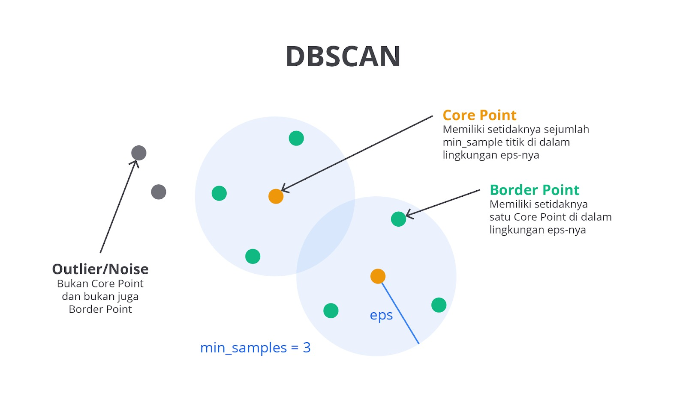
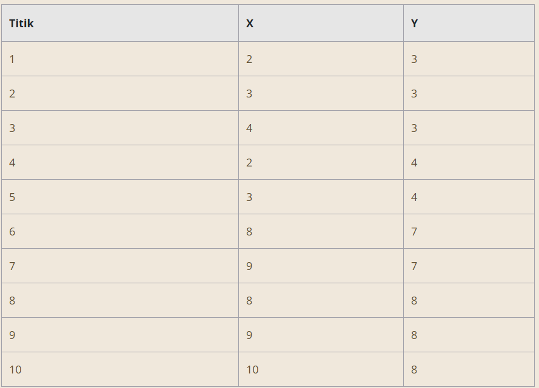
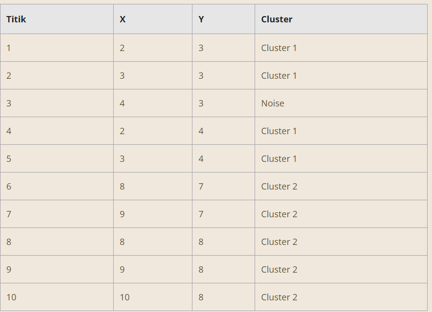
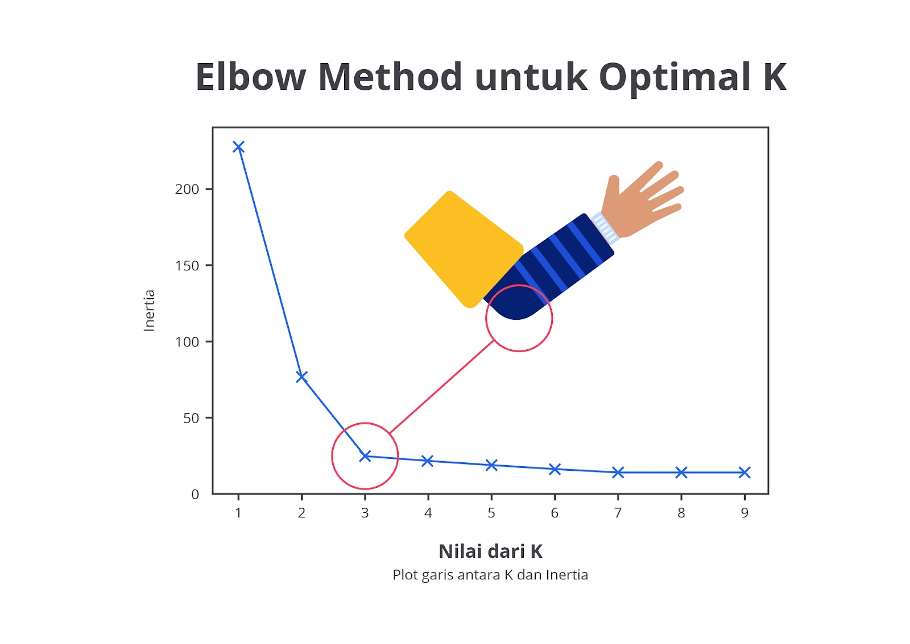
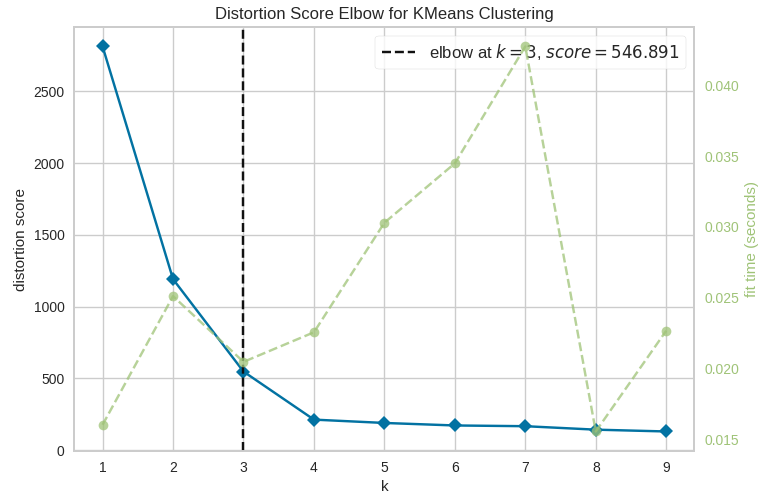
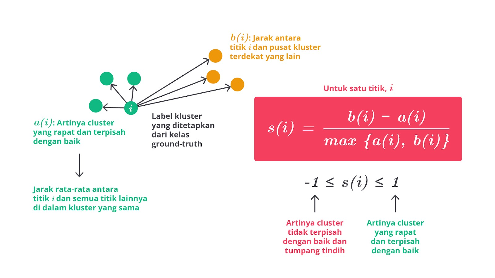
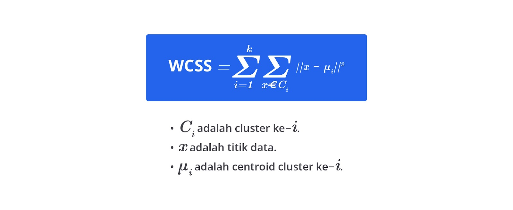

# K-Means Clustering

K-Means clustering adalah algoritma unsupervised learning untuk mengelompokkan data yang tidak berlabel ke dalam beberapa kelompok atau cluster. Setiap data dalam cluster memiliki karakteristik yang mirip satu sama lain, sedangkan data pada cluster berbeda memiliki karakteristik berbeda pula.

Misalnya, bayangkan Anda seorang pemilik toko mainan yang ingin mengelompokkan mainan di toko berdasarkan ukuran dan harga. Anda memutuskan untuk membuat tiga kelompok: mainan kecil murah, mainan sedang, dan mainan besar mahal.

Pertama, Anda memilih tiga titik awal acak sebagai pusat kelompok (centroid). Kemudian, Anda mengalokasikan setiap mainan ke kelompok dengan centroid terdekat berdasarkan ukuran dan harga. Setelah semua mainan dikelompokkan, Anda menghitung ulang posisi centroid berdasarkan rata-rata ukuran dan harga mainan dalam setiap kelompok serta mengulangi proses ini hingga posisi centroid stabil.


Melalui cara ini, mainan-mainan di toko Anda akan berkelompok secara rapi ke dalam kategori yang relevan, tentunya akan memudahkan untuk menata rak dengan lebih efisien dan merancang strategi pemasaran yang sesuai. K-Means clustering memudahkan kita untuk mengidentifikasi pola dalam data, tetapi perlu diperhatikan bahwa pemilihan jumlah kelompok (K) dan pengaruh dari data ekstrem (outlier) dapat memengaruhi hasil akhir.

## Langkah Kerja K-Means Clustering

Berikut adalah contoh lengkap yang mengikuti semua tahapan K-Means clustering dengan dataset mainan fiktif.


### Langkah 1: Menentukan Jumlah Cluster (K)

Pada tahap ini, Anda harus menentukan jumlah kelompok (K) yang ingin Anda buat dari data. Jumlah ini harus dipilih berdasarkan pemahaman tentang data atau dengan menggunakan metode analisis, seperti elbow method atau silhouette score.

Misalnya, jika Anda memiliki data tentang berbagai jenis mainan serta ingin mengelompokkan mereka dalam 3 kategori (misalnya, mainan kecil, menengah, dan besar), K akan diatur menjadi 3. Pilihan jumlah cluster ini akan memengaruhi hasil akhir dari pengelompokan sehingga penting untuk memilih K yang sesuai dengan tujuan analisis.

### Langkah 2: Inisialisasi Centroid

Inisialisasi centroid adalah langkah ketika Anda memilih K titik awal dari dataset yang akan menjadi pusat sementara untuk masing-masing cluster. Ada beberapa metode untuk inisialisasi centroid, seperti berikut.

Random Initialization: memilih K titik acak dari dataset sebagai centroid awal.
K-Means++ Initialization: metode lebih canggih yang memilih centroid awal dengan cara lebih terdistribusi untuk mengurangi kemungkinan hasil yang buruk. Misalnya, jika K=3, Anda mungkin secara acak memilih tiga mainan dengan ukuran dan harga berbeda sebagai centroid awal.
Contoh:

Kita memilih tiga titik acak sebagai centroid awal. Misalnya berikut.

Centroid 1: (10 cm, 50,000 IDR)
Centroid 2: (30 cm, 150,000 IDR)
Centroid 3: (5 cm, 20,000 IDR)

### Langkah 3: Pengalokasian Data

Pada tahap ini, setiap titik data (misalnya, mainan) dihitung jaraknya ke setiap centroid. Biasanya, jarak dihitung menggunakan Euclidean Distance. Titik data kemudian dialokasikan pada centroid yang terdekat. Proses ini mengelompokkan data berdasarkan kemiripan fitur.

Contoh:

Hitung jarak setiap mainan ke setiap centroid menggunakan Euclidean Distance dan alokasikan pada centroid yang terdekat. Berikut adalah perhitungan jarak untuk mainan ID 1 dengan centroid.


Mainan ID 1 dialokasikan ke Cluster 1 karena jaraknya ke Centroid 1 yang paling dekat.

### Langkah 4: Menghitung Ulang Centroid

Setelah data dialokasikan ke kelompok yang sesuai, centroid baru dihitung. Untuk setiap cluster, centroid baru ditentukan sebagai rata-rata dari semua titik data yang termasuk dalam cluster tersebut.

Misalnya, setelah pengalokasian awal, hasil pengelompokan seperti ini.

Cluster 1: (10 cm, 50,000 IDR), (15 cm, 75,000 IDR), (12 cm, 65,000 IDR), (8 cm, 40,000 IDR)
Cluster 2: (30 cm, 150,000 IDR), (25 cm, 120,000 IDR), (20 cm, 100,000 IDR), (18 cm, 80,000 IDR)
Cluster 3: (5 cm, 20,000 IDR), (7 cm, 30,000 IDR)
Hitung centroid baru.

Cluster 1

Titik data sebagai berikut:

(10 cm, 50,000 IDR)
(15 cm, 75,000 IDR)
(12 cm, 65,000 IDR)
(8 cm, 40,000 IDR)


Cluster 2

Titik data sebagai berikut:
(30 cm, 150,000 IDR)
(25 cm, 120,000 IDR)
(20 cm, 100,000 IDR)
(18 cm, 80,000 IDR)


Cluster 3

Titik data sebagai berikut:

(5 cm, 20,000 IDR)
(7 cm, 30,000 IDR)


Dengan menghitung centroid baru untuk setiap cluster berdasarkan rata-rata ukuran dan harga dari titik data dalam cluster tersebut, kita dapat memastikan bahwa centroid mencerminkan posisi rata-rata data pada kelompoknya. Proses ini kemudian diulang hingga centroid stabil.

### Langkah 5: Iterasi

Proses pengalokasian data dan perhitungan ulang centroid diulang hingga centroid tidak lagi bergerak atau perubahan posisi centroid sangat kecil. Setiap iterasi memperbarui posisi centroid dan memperbaiki pengelompokan.

Algoritma berhenti ketika pergeseran centroid antara iterasi menjadi kurang signifikan atau setelah jumlah iterasi maksimum tercapai. Tujuan dari iterasi ini adalah untuk memastikan bahwa centroid berada pada posisi optimal yang mencerminkan data dalam cluster dengan baik.

### Langkah 6: Hasil Akhir

Setelah proses iterasi selesai dan centroid stabil, hasil akhir dari K-Means clustering adalah pengelompokan data ke dalam K cluster yang stabil. Data yang dikelompokkan akan menunjukkan struktur atau pola signifikan berdasarkan penggunaan fitur (misalnya, ukuran dan harga). Hasil ini memungkinkan untuk analisis lebih lanjut, seperti visualisasi data, perencanaan strategi pemasaran, atau pengambilan keputusan berdasarkan kelompok yang terbentuk.

Contoh:

Setelah beberapa iterasi, centroid akhirnya stabil, dan hasil akhir pengelompokan mungkin seperti berikut.

Cluster 1: mainan kecil dengan ukuran dan harga rendah. Cluster 2: mainan menengah dengan ukuran dan harga sedang. Cluster 3: mainan besar dengan ukuran dan harga tinggi.


Proses ini memberikan pengelompokan yang jelas berdasarkan ukuran dan harga mainan. Ini membantu dalam penataan serta analisis lebih lanjut. Namun, ketika jumlah data sangat besar, pencarian centroid secara manual tentu akan menjadi sangat sulit dan memakan waktu.

Untuk mengatasi masalah ini, kita bisa menggunakan library K-Means yang memudahkan implementasi algoritma secara otomatis dan efisien, seperti scikit-learn pada Python. Library ini menyediakan fungsi K-Means yang dapat menangani data dalam skala besar dengan cepat dan akurat. Kita akan membahas penggunaan library ini lebih dalam pada materi selanjutnya. Tetap semangat, ya!

## Kelebihan dan Kekurangan

Dengan prinsip kerja yang sederhana, K-Means menawarkan kemudahan dalam implementasi dan pemahaman. Ini menjadikannya pilihan yang sering digunakan dalam berbagai aplikasi analisis data. Algoritma ini efisien dan dapat menangani data besar dengan cepat berkat kompleksitas waktu yang relatif rendah.

Namun, meskipun K-Means memiliki banyak kelebihan, seperti kesederhanaan dan efisiensi, ia juga memiliki beberapa kekurangan. Menentukan jumlah cluster yang optimal bisa menantang dan hasil clustering dapat dipengaruhi oleh inisialisasi centroid serta outlier.

Memahami kelebihan dan kekurangan K-Means sangat penting untuk memanfaatkan algoritma ini secara efektif dalam segmentasi data, analisis pasar, serta pengelompokan pelanggan. Berikut penjelasan lengkapnya.


# DBSCAN (Density-Based Spatial Clustering of Applications with Noise)

DBSCAN (density-based spatial clustering of applications with noise) adalah algoritma clustering yang mengelompokkan data berdasarkan kepadatan titik-titik di ruang fitur tanpa memerlukan jumlah cluster yang ditentukan sebelumnya.

Algoritma ini menggunakan dua parameter utama: Epsilon (ε) dan MinPts. Epsilon adalah jarak maksimum yang digunakan untuk menentukan bahwa dua titik dianggap saling berdekatan dan berada dalam satu cluster. Misalnya, jika Anda membayangkan sebuah lingkaran di sekitar setiap titik data, ε menentukan jari-jari lingkaran tersebut.



Adapun MinPts adalah jumlah minimum titik yang diperlukan di dalam lingkaran ε untuk membentuk cluster secara valid. Jika jumlah titik dalam lingkaran tersebut memenuhi atau melebihi MinPts, titik tersebut dianggap sebagai pusat cluster. Melalui cara ini, DBSCAN dapat mengidentifikasi cluster dengan bentuk kompleks dan tidak teratur serta mengatasi noise atau titik yang tidak termasuk dalam cluster mana pun.

Sebagai analogi, bayangkan sebuah taman yang penuh dengan kelompok orang. Epsilon adalah radius dari lingkaran imajiner di sekitar seseorang dan MinPts adalah jumlah minimum orang yang harus berada dalam lingkaran tersebut untuk membentuk kelompok. Titik yang tidak berada pada kelompok ini atau tidak memiliki cukup banyak tetangga di dalam radius ε dianggap sebagai noise. DBSCAN sangat berguna pada situasi bahwa cluster tidak berbentuk bulat dan ada banyak outlier dalam data.

## Langkah Kerja DBSCAN

Berikut adalah contoh data dan langkah-langkah pada setiap tahapan algoritma DBSCAN dengan data tabular yang sederhana. Misalnya, kita memiliki dataset 2D berikut.



### Langkah 1: Inisialisasi

Mulailah dengan memilih sebuah titik acak dari dataset sebagai titik pusat (core point). Tentukan parameter epsilon (ε) yang akan digunakan sebagai jarak maksimum untuk mengidentifikasi tetangga dan MinPts yang menentukan jumlah minimum titik dalam radius ε untuk membentuk cluster.

Contoh: Kita memiliki dataset dengan titik-titik yang terdistribusi di ruang 2D. Kita memilih titik (2,3) sebagai titik pusat dengan ε = 1 dan MinPts = 3.

### Langkah 2: Penentuan Titik-Titik Tetangga

Untuk setiap titik dalam dataset, hitung jarak ke titik-titik lainnya menggunakan parameter ε. Jarak ini biasanya dihitung menggunakan jarak Euclidean. Jika jumlah titik yang berada dalam radius ε dari titik pusat lebih besar atau sama dengan MinPts, titik tersebut dianggap sebagai titik pusat. Titik-titik yang berada dalam radius ε, tetapi jumlahnya kurang dari MinPts tidak dianggap sebagai titik pusat.

Contoh:

Hitung jarak antara titik (2, 3) dan titik-titik lainnya dengan menggunakan jarak Euclidean. Titik-titik yang berada dalam jarak ε = 1 dari (2, 3) adalah berikut.

Jarak (2, 3) ke (3, 3): 1
Jarak (2, 3) ke (4, 3): 2
Jarak (2, 3) ke (2, 4): 1
Jarak (2, 3) ke (3, 4): 1.414
Titik-titik dalam radius ε = 1 dari (2, 3) adalah (3, 3), (2, 4), dan (3, 4). Total ada 3 titik yang merupakan jumlah minimum (MinPts).

Karena ada 3 titik dalam radius ε dari (2, 3), (2, 3) adalah titik pusat.

### Langkah 3: Pembentukan Cluster

Semua titik pada radius ε dari titik pusat akan digabungkan ke dalam cluster yang sama. Titik-titik yang berada dalam jangkauan ε dari titik pusat, tetapi tidak memenuhi syarat MinPts akan dianggap sebagai titik tepi (border point) dan dimasukkan dalam cluster jika mereka terhubung dengan titik pusat.

Contoh:

Gabungkan titik-titik dalam radius ε dari titik pusat (2, 3) ke dalam cluster berikut.

Titik pusat: (2, 3)
Anggota cluster: (3, 3), (2, 4), (3, 4)
Dengan demikian, cluster pertama adalah {(2, 3), (3, 3), (2, 4), (3, 4)}.

### Langkah 4: Penanganan Noise

Titik-titik yang tidak memenuhi syarat untuk menjadi titik pusat dan tidak memiliki cukup tetangga untuk bergabung dengan cluster mana pun dianggap sebagai noise (outliers). Titik-titik ini tidak dimasukkan ke dalam cluster apa pun.

Contoh:

Cek titik-titik lainnya untuk cluster baru atau noise.

Titik (8, 7), (9, 7), (8, 8), (9, 8), dan (10, 8) memiliki jarak Euclidean antara satu sama lain yang lebih kecil dari ε = 1.
Titik (8, 7) memiliki lebih dari MinPts (3) tetangga dalam radius ε = 1.
Titik (8, 7) adalah titik pusat dan titik-titik lainnya di sekitar (8, 7) membentuk cluster yang sama.
Dengan cluster kedua adalah {(8, 7), (9, 7), (8, 8), (9, 8), (10, 8)}.

Titik-titik yang tidak berada dalam radius ε dari kedua cluster ini, seperti titik (4, 3) dan titik-titik lainnya dianggap sebagai noise.

### Langkah 5: Iterasi

Proses ini diulang untuk semua titik dalam dataset. Titik-titik yang sudah terkelompok tidak akan diproses lagi. Lalu, algoritma akan melanjutkan ke titik berikutnya yang belum dikelompokkan. Proses berlanjut hingga semua titik dalam dataset dikelompokkan atau dikategorikan sebagai noise.

Contoh:

Proses ini diulang untuk semua titik yang belum dikelompokkan.

Titik (4, 3) dan titik-titik lainnya yang tidak termasuk dalam cluster akan diidentifikasi sebagai noise.

Berikut adalah contoh data setelah clustering menggunakan DBSCAN.



Dengan langkah-langkah ini, DBSCAN mengidentifikasi dua cluster dan titik-titik yang dianggap sebagai noise berdasarkan parameter yang ditentukan.

# Metode Evaluasi: Elbow Method

Metode elbow adalah teknik evaluasi yang digunakan untuk menentukan jumlah cluster optimal dalam analisis clustering, khususnya pada algoritma K-Means. Mari kita jelaskan metode ini secara mendetail dan memberikan analogi untuk memudahkan pemahaman.

## Definisi dan Prinsip Dasar

Metode elbow adalah teknik untuk menentukan jumlah cluster (k) yang ideal dengan cara menganalisis hubungan antara jumlah cluster dan total kesalahan kuadrat dalam cluster (sum of squared errors atau SSE). SSE mengukur seberapa baik titik data dalam cluster mendekati centroid cluster mereka. Semakin kecil nilai SSE, semakin baik titik data dikelompokkan ke dalam cluster mereka.



Bayangkan Anda sedang mengatur sebuah pesta dan ingin membagi tamu dengan jumlah 20 orang ke dalam beberapa meja makan. Anda harus menentukan berapa banyak meja yang akan digunakan. Jika Anda hanya memiliki satu meja, tamu akan duduk terlalu berdesakan, dan suasananya menjadi tidak nyaman. Jika Anda menggunakan dua meja, mungkin tamu masih terasa agak berdesakan, tetapi lebih baik daripada hanya satu meja. Saat Anda menambah meja lebih banyak, tamu semakin merasa nyaman dan tidak berdesakan.

Namun, pada titik tertentu, menambah meja lebih banyak tidak memberikan banyak tambahan kenyamanan. Misalnya, jika Anda sudah memiliki empat meja, menambah meja kelima hanya akan sedikit mengurangi kerumunan dan tidak memberikan banyak manfaat tambahan dibandingkan dengan meja keempat.

Dalam konteks metode elbow, SSE berfungsi sebagai ukuran kerumunan tamu. Jumlah meja (cluster) yang Anda pilih seharusnya mengurangi kerumunan (SSE) sampai titik bahwa menambah meja lebih banyak hanya memberikan sedikit peningkatan kenyamanan tambahan. Titik letak peningkatan kenyamanan mulai melambat adalah "elbow" atau titik optimal untuk jumlah meja, yakni jumlah cluster ideal dalam analisis clustering.

Metode elbow sangat berguna ketika Anda perlu menentukan jumlah cluster yang optimal untuk algoritma seperti K-Means. Dengan menggunakan metode elbow, Anda dapat memastikan bahwa pemilihan jumlah cluster memberikan representasi terbaik dari struktur data tanpa membuat terlalu banyak cluster yang bisa menyebabkan overfitting.

## Langkah-Langkah Metode Elbow

Langkah-langkah metode elbow adalah proses sistematis yang dirancang untuk menentukan jumlah cluster secara optimal dalam analisis clustering, khususnya menggunakan algoritma K-Means. Dengan memahami serta menerapkan langkah-langkah ini, Anda dapat memilih jumlah cluster yang memberikan keseimbangan terbaik antara kompleksitas model dan kualitas pengelompokan. Ini membantu mengungkap struktur data dengan cara yang lebih informatif dan akurat.

Berikut langkah-langkahnya.

### Tentukan Rentang k

Pilih rentang nilai k yang akan diuji, misalnya dari 1 hingga 10. Rentang ini mencakup berbagai kemungkinan jumlah cluster yang dapat diuji.

### Jalankan K-Means untuk Setiap k

Untuk setiap nilai k dalam rentang yang telah ditentukan, jalankan algoritma K-Means clustering pada dataset Anda. K-Means akan membagi data ke dalam k cluster dan menghitung SSE untuk setiap nilai k. SSE dihitung dengan menjumlahkan kuadrat jarak antara setiap titik data dan centroid cluster mereka.

### Plot Grafik SSE vs. k

Plotkan nilai k pada sumbu x dan SSE pada sumbu y. Grafik ini biasanya menunjukkan penurunan SSE seiring dengan bertambahnya jumlah cluster. Hal ini terjadi karena lebih banyak cluster memungkinkan titik data lebih dekat ke centroid mereka sehingga mengurangi SSE.

### Identifikasi Titik Elbow

Perhatikan grafik yang dihasilkan dan cari titik letak penurunan SSE mulai melambat secara signifikan. Titik ini terlihat seperti siku pada grafik yang disebut sebagai "elbow". Titik elbow ini menunjukkan jumlah cluster optimal karena menambahkan lebih banyak cluster setelah titik ini memberikan penurunan SSE yang tidak signifikan.

Berikut adalah contoh kode Python untuk menerapkan metode elbow dalam menentukan jumlah cluster optimal menggunakan algoritma K-Means dengan pustaka scikit-learn dan matplotlib untuk visualisasi. Contoh ini menggunakan dataset iris dari pustaka sklearn sebagai data contoh.

```bash
from sklearn.cluster import KMeans
from yellowbrick.cluster import KElbowVisualizer  # Mengimpor KElbowVisualizer untuk visualisasi metode Elbow
from sklearn.datasets import make_blobs

# Membuat dataset buatan
X, y = make_blobs(n_samples=300, centers=4, cluster_std=0.60, random_state=0)

kmeans = KMeans()
visualizer = KElbowVisualizer(kmeans, k=(1, 10))
visualizer.fit(X)
visualizer.show()
```



Titik elbow menunjukkan bahwa jumlah cluster yang paling optimal untuk data ini adalah 3. Ini adalah titik letak penurunan SSE mulai melambat secara signifikan. Ini menunjukkan bahwa menambah jumlah cluster lebih lanjut tidak memberikan peningkatan signifikan dalam pengurangan SSE.

Nilai SSE pada jumlah cluster 3 adalah 546.891. Ini adalah ukuran seberapa baik cluster yang dihasilkan sesuai dengan data; semakin rendah nilai SSE, semakin baik data berkelompok.

# Evaluasi Model Clustering

Evaluasi model clustering adalah tahap krusial dalam analisis data, ibarat mengevaluasi hasil karya seni untuk memastikan bahwa setiap elemen menyatu dengan harmonis dan sesuai dengan visi awal. Sama seperti seorang kritikus seni yang menilai jika sebuah lukisan mencerminkan komposisi, teknik, serta pesan yang diinginkan, evaluasi model clustering bertujuan menentukan seberapa baik model telah mengelompokkan data menjadi cluster yang bermakna dan sesuai dengan tujuan analisis.

Proses evaluasi ini menggunakan berbagai metrik untuk mengukur kualitas dan efektivitas clustering yang dihasilkan, seperti mengukur sejauh mana cluster yang terbentuk terpisah dengan jelas dan seberapa baik data dalam satu cluster saling berdekatan.

Setiap metrik memberikan perspektif unik tentang cara model clustering bekerja. Ini memungkinkan penilaian yang mendalam dan perbaikan yang diperlukan. Berikut adalah beberapa metode evaluasi utama yang digunakan untuk menilai hasil clustering.

## Silhouette Score

Silhouette score adalah metrik yang mengukur seberapa baik setiap data point diklasifikasikan dalam cluster-nya sendiri dibandingkan dengan cluster lain. Nilai ini memberikan informasi tentang kualitas clustering dengan memperhitungkan kepadatan dan jarak antar cluster.



### Interpretasi Nilai Silhouette

Nilai berkisar antara -1 dan 1 dengan penjelasan lengkap sebagai berikut.

Nilai 1: Menunjukkan bahwa data point sangat sesuai dengan cluster-nya sendiri dan terpisah dengan baik dari cluster lain. Ini adalah indikasi clustering yang sangat baik.
Nilai 0: Menunjukkan bahwa data point berada pada perbatasan antara dua cluster. Ini bisa menunjukkan bahwa data point tersebut tidak sepenuhnya cocok dengan cluster mana pun.
Nilai -1: Menunjukkan bahwa data point lebih cocok berada pada cluster lain dibanding cluster-nya sendiri. Ini menunjukkan bahwa clustering mungkin perlu penyesuaian.
Silhouette score memiliki beberapa kelebihan utama dalam evaluasi clustering. Pertama, metrik ini memberikan indikasi yang jelas mengenai kualitas clustering untuk setiap data point sehingga memudahkan identifikasi data point yang mungkin tidak sesuai dengan cluster-nya. Selain itu, silhouette score juga membantu dalam mengidentifikasi cluster yang mungkin terlalu besar atau terlalu kecil. Ini memungkinkan penyesuaian lebih lanjut untuk meningkatkan hasil clustering.

Namun, ada beberapa kekurangan, terutama ketika data memiliki cluster dengan bentuk yang sangat berbeda. Dalam kasus tersebut, silhouette score tidak mencerminkan kualitas clustering dengan akurat karena jarak antar cluster tidak selalu mencerminkan struktur cluster yang sebenarnya.

## Within-Cluster Sum of Squares (WCSS)

WCSS (within-cluster sum of squares) mengukur total jarak kuadrat antara titik data dan centroid-nya dalam cluster. Metrik ini sering digunakan untuk menilai seberapa baik data dikelompokkan dalam cluster.

WCSS dihitung dengan menjumlahkan jarak kuadrat antara setiap titik data dan centroid cluster-nya melalui persamaan matematis sebagai berikut.



Semakin rendah nilai WCSS, semakin baik clustering-nya karena menunjukkan jarak yang lebih kecil antara data point dan centroid cluster-nya serta mengindikasikan kepadatan cluster dengan lebih baik.

Kelebihan WCSS adalah kemudahan perhitungannya dan kemampuannya memberikan indikasi jelas tentang kepadatan cluster. Namun, WCSS tidak mempertimbangkan jarak antara cluster yang berbeda, hanya fokus pada jarak dalam cluster. Ini berarti WCSS tidak menunjukkan seberapa terpisah cluster satu sama lain dan cenderung menurun seiring bertambahnya jumlah cluster.

Oleh karena itu, WCSS harus digunakan bersama metrik lain, seperti metode elbow, untuk menentukan jumlah cluster optimal dengan menganalisis perubahan WCSS seiring bertambahnya jumlah cluster.
