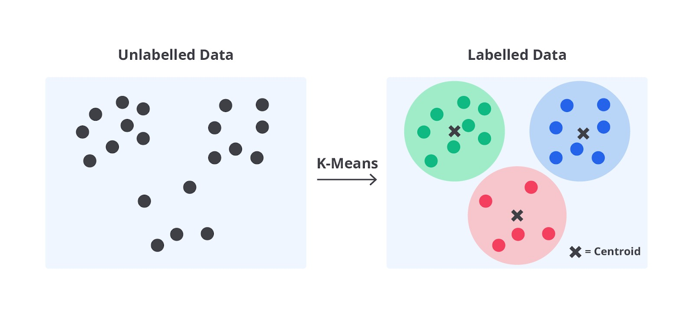
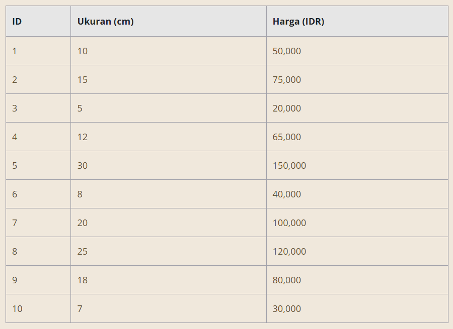
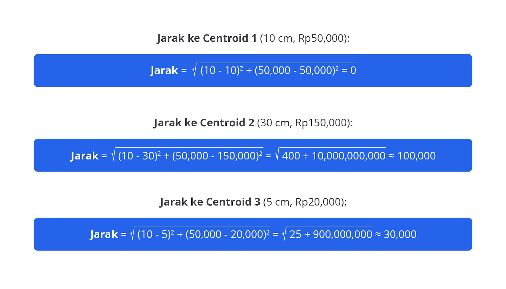
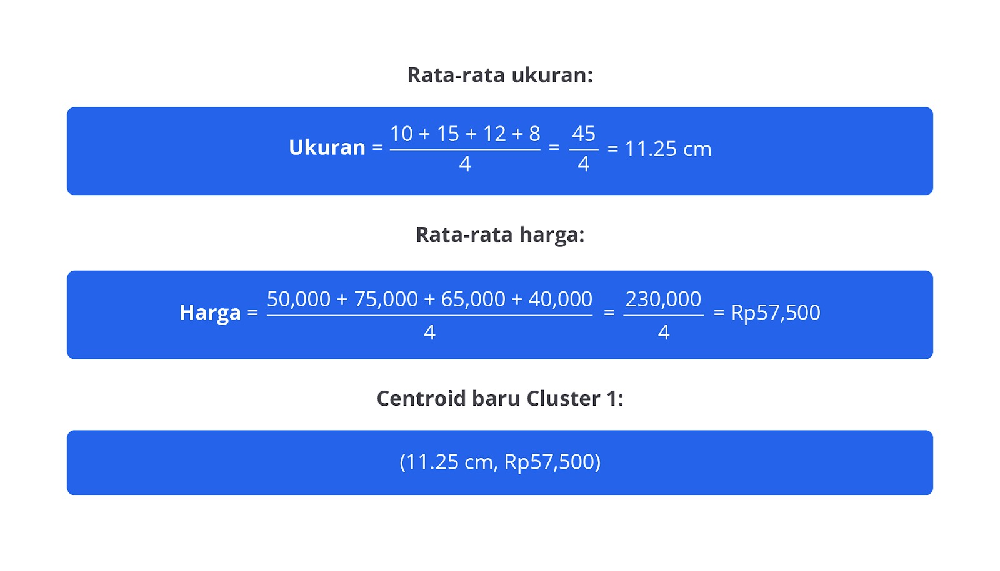
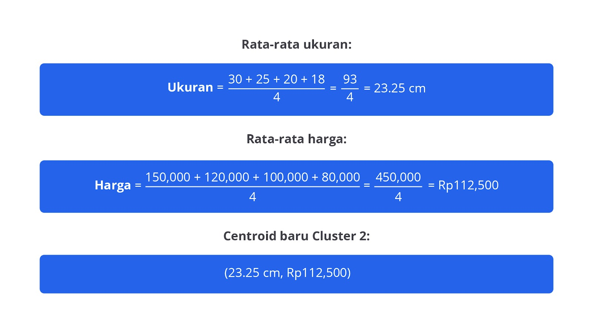
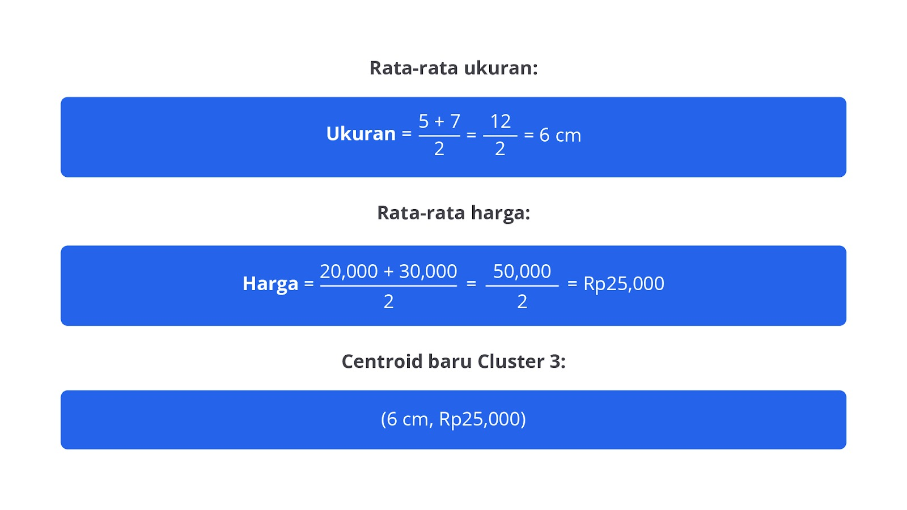
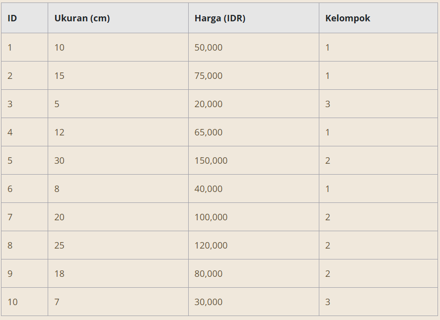
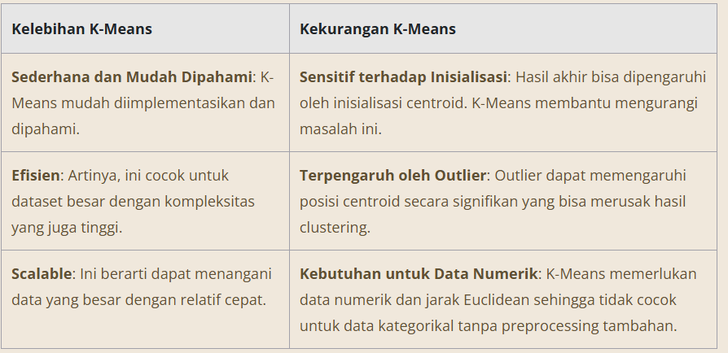

# K-Means Clustering

K-Means clustering adalah algoritma unsupervised learning untuk mengelompokkan data yang tidak berlabel ke dalam beberapa kelompok atau cluster. Setiap data dalam cluster memiliki karakteristik yang mirip satu sama lain, sedangkan data pada cluster berbeda memiliki karakteristik berbeda pula.

Misalnya, bayangkan Anda seorang pemilik toko mainan yang ingin mengelompokkan mainan di toko berdasarkan ukuran dan harga. Anda memutuskan untuk membuat tiga kelompok: mainan kecil murah, mainan sedang, dan mainan besar mahal.

Pertama, Anda memilih tiga titik awal acak sebagai pusat kelompok (centroid). Kemudian, Anda mengalokasikan setiap mainan ke kelompok dengan centroid terdekat berdasarkan ukuran dan harga. Setelah semua mainan dikelompokkan, Anda menghitung ulang posisi centroid berdasarkan rata-rata ukuran dan harga mainan dalam setiap kelompok serta mengulangi proses ini hingga posisi centroid stabil.

Melalui cara ini, mainan-mainan di toko Anda akan berkelompok secara rapi ke dalam kategori yang relevan, tentunya akan memudahkan untuk menata rak dengan lebih efisien dan merancang strategi pemasaran yang sesuai. K-Means clustering memudahkan kita untuk mengidentifikasi pola dalam data, tetapi perlu diperhatikan bahwa pemilihan jumlah kelompok (K) dan pengaruh dari data ekstrem (outlier) dapat memengaruhi hasil akhir.

## Langkah Kerja K-Means Clustering

Berikut adalah contoh lengkap yang mengikuti semua tahapan K-Means clustering dengan dataset mainan fiktif.

### Langkah 1: Menentukan Jumlah Cluster (K)

Pada tahap ini, Anda harus menentukan jumlah kelompok (K) yang ingin Anda buat dari data. Jumlah ini harus dipilih berdasarkan pemahaman tentang data atau dengan menggunakan metode analisis, seperti elbow method atau silhouette score.

Misalnya, jika Anda memiliki data tentang berbagai jenis mainan serta ingin mengelompokkan mereka dalam 3 kategori (misalnya, mainan kecil, menengah, dan besar), K akan diatur menjadi 3. Pilihan jumlah cluster ini akan memengaruhi hasil akhir dari pengelompokan sehingga penting untuk memilih K yang sesuai dengan tujuan analisis.

### Langkah 2: Inisialisasi Centroid

Inisialisasi centroid adalah langkah ketika Anda memilih K titik awal dari dataset yang akan menjadi pusat sementara untuk masing-masing cluster. Ada beberapa metode untuk inisialisasi centroid, seperti berikut.

Random Initialization: memilih K titik acak dari dataset sebagai centroid awal.
K-Means++ Initialization: metode lebih canggih yang memilih centroid awal dengan cara lebih terdistribusi untuk mengurangi kemungkinan hasil yang buruk. Misalnya, jika K=3, Anda mungkin secara acak memilih tiga mainan dengan ukuran dan harga berbeda sebagai centroid awal.
Contoh:

Kita memilih tiga titik acak sebagai centroid awal. Misalnya berikut.

Centroid 1: (10 cm, 50,000 IDR)
Centroid 2: (30 cm, 150,000 IDR)
Centroid 3: (5 cm, 20,000 IDR)

### Langkah 3: Pengalokasian Data

Pada tahap ini, setiap titik data (misalnya, mainan) dihitung jaraknya ke setiap centroid. Biasanya, jarak dihitung menggunakan Euclidean Distance. Titik data kemudian dialokasikan pada centroid yang terdekat. Proses ini mengelompokkan data berdasarkan kemiripan fitur.

Contoh:

Hitung jarak setiap mainan ke setiap centroid menggunakan Euclidean Distance dan alokasikan pada centroid yang terdekat. Berikut adalah perhitungan jarak untuk mainan ID 1 dengan centroid.

Mainan ID 1 dialokasikan ke Cluster 1 karena jaraknya ke Centroid 1 yang paling dekat.

### Langkah 4: Menghitung Ulang Centroid

Setelah data dialokasikan ke kelompok yang sesuai, centroid baru dihitung. Untuk setiap cluster, centroid baru ditentukan sebagai rata-rata dari semua titik data yang termasuk dalam cluster tersebut.

Misalnya, setelah pengalokasian awal, hasil pengelompokan seperti ini.

Cluster 1: (10 cm, 50,000 IDR), (15 cm, 75,000 IDR), (12 cm, 65,000 IDR), (8 cm, 40,000 IDR)
Cluster 2: (30 cm, 150,000 IDR), (25 cm, 120,000 IDR), (20 cm, 100,000 IDR), (18 cm, 80,000 IDR)
Cluster 3: (5 cm, 20,000 IDR), (7 cm, 30,000 IDR)
Hitung centroid baru.

Cluster 1

Titik data sebagai berikut:

(10 cm, 50,000 IDR)
(15 cm, 75,000 IDR)
(12 cm, 65,000 IDR)
(8 cm, 40,000 IDR)

Cluster 2

Titik data sebagai berikut:
(30 cm, 150,000 IDR)
(25 cm, 120,000 IDR)
(20 cm, 100,000 IDR)
(18 cm, 80,000 IDR)

Cluster 3

Titik data sebagai berikut:

(5 cm, 20,000 IDR)
(7 cm, 30,000 IDR)

Dengan menghitung centroid baru untuk setiap cluster berdasarkan rata-rata ukuran dan harga dari titik data dalam cluster tersebut, kita dapat memastikan bahwa centroid mencerminkan posisi rata-rata data pada kelompoknya. Proses ini kemudian diulang hingga centroid stabil.

### Langkah 5: Iterasi

Proses pengalokasian data dan perhitungan ulang centroid diulang hingga centroid tidak lagi bergerak atau perubahan posisi centroid sangat kecil. Setiap iterasi memperbarui posisi centroid dan memperbaiki pengelompokan.

Algoritma berhenti ketika pergeseran centroid antara iterasi menjadi kurang signifikan atau setelah jumlah iterasi maksimum tercapai. Tujuan dari iterasi ini adalah untuk memastikan bahwa centroid berada pada posisi optimal yang mencerminkan data dalam cluster dengan baik.

### Langkah 6: Hasil Akhir

Setelah proses iterasi selesai dan centroid stabil, hasil akhir dari K-Means clustering adalah pengelompokan data ke dalam K cluster yang stabil. Data yang dikelompokkan akan menunjukkan struktur atau pola signifikan berdasarkan penggunaan fitur (misalnya, ukuran dan harga). Hasil ini memungkinkan untuk analisis lebih lanjut, seperti visualisasi data, perencanaan strategi pemasaran, atau pengambilan keputusan berdasarkan kelompok yang terbentuk.

Contoh:

Setelah beberapa iterasi, centroid akhirnya stabil, dan hasil akhir pengelompokan mungkin seperti berikut.

Cluster 1: mainan kecil dengan ukuran dan harga rendah. Cluster 2: mainan menengah dengan ukuran dan harga sedang. Cluster 3: mainan besar dengan ukuran dan harga tinggi.

Proses ini memberikan pengelompokan yang jelas berdasarkan ukuran dan harga mainan. Ini membantu dalam penataan serta analisis lebih lanjut. Namun, ketika jumlah data sangat besar, pencarian centroid secara manual tentu akan menjadi sangat sulit dan memakan waktu.

Untuk mengatasi masalah ini, kita bisa menggunakan library K-Means yang memudahkan implementasi algoritma secara otomatis dan efisien, seperti scikit-learn pada Python. Library ini menyediakan fungsi K-Means yang dapat menangani data dalam skala besar dengan cepat dan akurat. Kita akan membahas penggunaan library ini lebih dalam pada materi selanjutnya. Tetap semangat, ya!

## Kelebihan dan Kekurangan

Dengan prinsip kerja yang sederhana, K-Means menawarkan kemudahan dalam implementasi dan pemahaman. Ini menjadikannya pilihan yang sering digunakan dalam berbagai aplikasi analisis data. Algoritma ini efisien dan dapat menangani data besar dengan cepat berkat kompleksitas waktu yang relatif rendah.

Namun, meskipun K-Means memiliki banyak kelebihan, seperti kesederhanaan dan efisiensi, ia juga memiliki beberapa kekurangan. Menentukan jumlah cluster yang optimal bisa menantang dan hasil clustering dapat dipengaruhi oleh inisialisasi centroid serta outlier.

Memahami kelebihan dan kekurangan K-Means sangat penting untuk memanfaatkan algoritma ini secara efektif dalam segmentasi data, analisis pasar, serta pengelompokan pelanggan. Berikut penjelasan lengkapnya.

